# KnowForge RAG 全部 Markdown 内容

> 本文件由 `scripts/merge-markdown.mjs` 自动生成，用于集中阅读和编辑。
> 原始 Markdown 文件保持独立，本站仍然从 `src/content` 目录构建。

> 文档总数：46 篇博客文章

## 文档目录

### 博客文章

1. [项目阶段 01：项目概述与 Docker 环境搭建](#doc-01-project-overview-md)
2. [项目阶段 02：RAG 核心概念深入](#doc-02-rag-fundamentals-md)
3. [项目阶段 03：LangChain 生态系统](#doc-03-langchain-ecosystem-md)
4. [04.5 vibe coding rag practice greenfield](#doc-04-5-vibe-coding-rag-practice-greenfield-md)
5. [第二阶段实践：Vibe Coding 实践](#doc-04-5-vibe-coding-rag-practice-md)
6. [项目阶段 04：Milvus 索引机制与基本操作](#doc-04-milvus-index-and-operations-md)
7. [第 05 章：意图分类与路由入口](#doc-05-intent-classification-md)
8. [第 06 章：检索策略与动态计划](#doc-06-retrieval-strategy-md)
9. [项目阶段 07：查询改写与变体生成](#doc-07-query-rewrite-variants-md)
10. [项目阶段 08：Milvus 混合检索深度解析](#doc-08-milvus-hybrid-search-md)
11. [项目阶段 09：QAService 核心编排](#doc-09-qaservice-orchestration-md)
12. [项目阶段 10：RAG Pipeline 主流程与 Prompt 生成](#doc-10-rag-pipeline-md)
13. [项目阶段 11：FastAPI 与异步 Web 框架](#doc-11-fastapi-async-md)
14. [项目阶段 11：Prompt 工程与 Profile 系统](#doc-11-prompt-engineering-md)
15. [项目阶段 12：应用入口与环境前置校验](#doc-12-app-entry-preflight-md)
16. [项目阶段 12：FastAPI 与异步 Web 框架](#doc-12-fastapi-async-md)
17. [项目阶段 13：应用入口与环境前置校验](#doc-13-app-entry-preflight-md)
18. [项目阶段 13：知识库多版本管理](#doc-13-kb-versioning-md)
19. [项目阶段 13：知识库治理与离线入库发布](#doc-13-knowledge-governance-md)
20. [项目阶段 14：数据隔离与多租户设计](#doc-14-data-isolation-md)
21. [项目阶段 14：知识库多版本管理](#doc-14-kb-versioning-md)
22. [项目阶段 14：RAG 质量评测与 Bad Case 闭环](#doc-14-rag-quality-md)
23. [项目阶段 15：数据隔离与多租户设计](#doc-15-data-isolation-md)
24. [项目阶段 15：文档入库与索引链路](#doc-15-ingestion-pipeline-md)
25. [项目阶段 15：自动化测试与接口验收](#doc-15-testing-system-md)
26. [项目阶段 16：文档入库与索引链路](#doc-16-ingestion-pipeline-md)
27. [项目阶段 16：线上可观测性、Trace 与容量治理](#doc-16-observability-capacity-md)
28. [项目阶段 16：RAG 回归验收与入库质量](#doc-16-quality-evaluation-md)
29. [项目阶段 17：Docker 交付与排障](#doc-17-docker-delivery-md)
30. [项目阶段 17：RAG 回归验收与入库质量](#doc-17-quality-evaluation-md)
31. [项目阶段 17：测试与接口验收](#doc-17-testing-system-md)
32. [项目阶段 18：LangSmith 观测、Trace 与生产化部署](#doc-18-observability-tracing-md)
33. [项目阶段 18：测试与接口验收](#doc-18-testing-system-md)
34. [项目阶段 19：Docker 交付深化与排障](#doc-19-docker-containerization-md)
35. [项目阶段 19：LangSmith 观测、Trace 与生产化部署](#doc-19-observability-tracing-md)
36. [项目阶段 20：Docker 交付深化与排障](#doc-20-docker-containerization-md)
37. [附录A：Pydantic 数据校验与 Settings 管理](#doc-appendix-a-pydantic-md)
38. [附录B：SHA256 内容指纹与增量检测](#doc-appendix-b-sha256-fingerprint-md)
39. [附录C：HNSW 图索引原理与参数调优](#doc-appendix-c-hnsw-index-md)
40. [附录D：CrossEncoder 重排器](#doc-appendix-d-crossencoder-reranker-md)
41. [附录E：RecursiveCharacterTextSplitter 递归切分算法](#doc-appendix-e-recursive-splitter-md)
42. [附录F：Embedding 模型选型与原理深入](#doc-appendix-f-embedding-models-md)
43. [附录G：文档切分策略 — Parent-Child Chunking 深度解析](#doc-appendix-g-chunking-strategy-md)
44. [附录H：项目工具类开发详解](#doc-appendix-h-tool-foundations-md)
45. [KnowForge RAG Platform — 开发路线](#doc-course-outline-md)
46. [离线入库链路学习笔记](#doc-offline-ingestion-teaching-notes-md)

## 博客文章

<a id="doc-01-project-overview-md"></a>
# 项目阶段 01：项目概述与 Docker 环境搭建

> 来源：`src/content/blog/01-project-overview.md`
> 类型：博客文章
> description：🎬 推荐 ：在阅读本节之前或之后，观看 RAG Pipeline 执行流程动画 建立对系统整体执行流程的直观认识。
> pubDate：2026-09-13
> tags：KnowForge、RAG、工程实践
> draft：否
> featured：否

> 🎬**推荐**：在阅读本节之前或之后，观看RAG Pipeline 执行流程动画建立对系统整体执行流程的直观认识。

## 本节目标

- 理解 RAG 系统的基本概念和应用场景
- 了解本项目的整体架构和技术栈
- 理解 Docker/Compose 在本项目中的运行底座作用
- 完成开发环境的搭建和验证

---

## 第一部分：前置知识

### 1.1 什么是 RAG（检索增强生成）

**RAG = Retrieval-Augmented Generation**，即"检索增强生成"。

在没有 RAG 之前，大语言模型（LLM）存在几个核心问题：

1. **知识截止日期**：模型训练完成后，无法获取训练数据之后的新信息。例如 GPT-4 的知识截止到 2023 年某月，之后发生的事情它不知道。
2. **幻觉问题**：当模型不确定某个答案时，它可能会"编造"一个看起来很合理但实际上是错误的内容。这在企业场景中是不可接受的。
3. **私有知识无法覆盖**：跨境贸易的规则、单证、业务文档是私有数据，从未进入过公开训练集，模型自然无法回答。

**RAG 的解决思路**非常简单：

```text
用户提问 → 先从知识库中检索相关文档 → 把检索到的文档和问题一起发给 LLM → LLM 基于文档生成答案
```

可以把 RAG 理解成"开卷考试"：LLM 不再只靠记忆回答，而是可以查阅我们提供的资料后再作答。

**RAG 的核心价值**：
- 答案是**可溯源**的（每个回答都能追溯到具体的文档片段）
- 知识可以**实时更新**（更新知识库不需要重新训练模型）
- 幻觉大幅**减少**（模型被约束在提供的文档范围内回答）

### 1.2 RAG 系统的基本组成

一个完整的 RAG 系统包含两条核心链路：

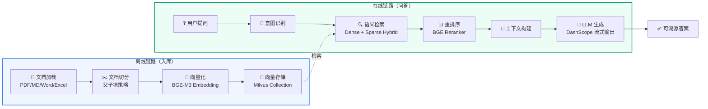

**对比：传统 LLM vs RAG**

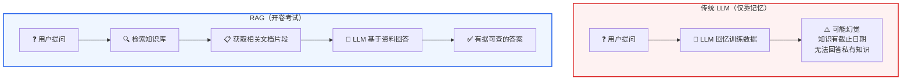

**离线链路（入库）**：
1.**文档加载**：读取 PDF、Markdown、Word 等各种格式的文档
2.**文档切分**：把长文档按语义边界切成小块（chunk），每块通常是几百到一千字
3.**向量化**：用 Embedding 模型把每个 chunk 转成一串数字（向量），表达其语义
4.**存储**：把向量和原文一起存入向量数据库

**在线链路（问答）**：
1.**意图识别**：判断用户问的是什么类型的问题
2.**查询向量化**：把用户问题转成向量
3.**语义检索**：在向量数据库中找最相似的文档片段
4.**上下文构建**：把检索到的片段整理成 LLM 的参考资料
5.**答案生成**：LLM 基于资料生成回答

### 1.3 向量和向量检索是什么

这是理解 RAG 最关键的概念。我们通过一个类比来理解：

**类比：图书馆找书**

传统关键词搜索（比如 MySQL LIKE 查询）就像你告诉图书管理员"我要找书名里有'Python'的书"。问题在于：
- 一本叫《Python 机器学习实战》的书会被找到
- 但一本叫《用编程语言做数据分析》的书不会被找到，虽然它也讲 Python

向量检索就像你告诉图书管理员"我要找一本关于'用代码分析数据'的书"。图书管理员理解了这个概念的"语义"，然后去书架上找到《Python 机器学习实战》、《R 语言统计分析》、《数据科学入门》等语义相近的书。

**技术层面**：
- Embedding 模型把一段文本（比如一句话、一个段落）转换成一个固定长度的浮点数数组，例如 1024 维的向量
- 语义相近的文本，它们的向量在数学空间中的"距离"也近
- 向量数据库就是专门存储和检索这些向量的系统

```text
# 伪代码示例
文本1 = "Python 是一门编程语言"
文本2 = "Java 也是一门编程语言"
文本3 = "今天天气很好"

向量1 = embedding(文本1)  # [0.12, 0.34, -0.56, ...] (1024个数字)
向量2 = embedding(文本2)  # [0.11, 0.33, -0.54, ...] (与向量1很接近)
向量3 = embedding(文本3)  # [0.89, -0.21, 0.67, ...] (与向量1差异很大)

# 向量1和向量2的余弦相似度 ≈ 0.95（很高）
# 向量1和向量3的余弦相似度 ≈ 0.12（很低）
```

---

## 第二部分：项目架构

### 2.1 一句话描述

> 这是一个基于 LangChain + Milvus 2.5 Hybrid Search 的企业级 RAG 平台，当前只启用跨境贸易业务场景，同时保留可配置的场景注册能力。它不是简单的 Demo，而是补齐了企业级 RAG 完整工程闭环的项目。

### 2.2 全景架构图

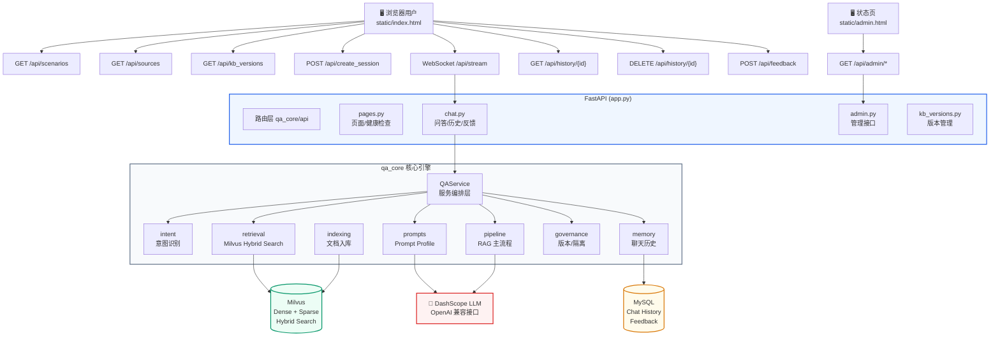

#### 2.2.1 架构分层解读

全景架构图从上到下可以划分为**五个层次**，每一层各司其职：

| 层次 | 名称 | 包含组件 | 一句话职责 |
| --- | --- | --- | --- |
| 第一层 | 用户入口层 | 浏览器用户（问答页）、状态页（admin 页） | 用户看得见、点得到的地方 |
| 第二层 | 路由层 | FastAPI`qa_core/api`（pages / chat / admin / kb\_versions） | 把 HTTP/WebSocket 请求分发给正确的后端模块 |
| 第三层 | 核心引擎层 | `qa_core`八大模块（QAService、Intent、Retrieval 等） | 所有 RAG 业务逻辑的真正执行者 |
| 第四层 | 外部依赖层 | Milvus、MySQL、DashScope LLM | 提供向量检索、会话存储、文本生成能力 |
| 第五层 | 入库链路（离线） | Indexing → Milvus | 文档和 FAQ 怎么进知识库 |

**为什么要分层？**每一层只跟相邻层打交道：浏览器不直接调 Milvus，API 路由不直接拼 Prompt，核心引擎不直接写 HTTP 响应。这保证了任何一层被替换时，其他层不受影响。

#### 2.2.2 第一层：用户入口 — 问答页和状态页各做什么

全景架构图的顶部有两个入口角色：

**问答页（`static/index.html`）**是面向普通用户的交互界面，它会发出以下常用请求：

| 端点 | 方法 | 触发时机 | 作用 |
| --- | --- | --- | --- |
| `GET /api/scenarios` | HTTP | 页面加载时 | 拉取当前可用业务场景（现阶段仅返回跨境贸易） |
| `GET /api/sources` | HTTP | 场景初始化或刷新时 | 拉取跨境贸易场景可选的 source 过滤项 |
| `GET /api/kb_versions` | HTTP | 场景初始化或刷新时 | 查看跨境贸易场景的知识库版本状态 |
| `POST /api/create_session` | HTTP | 用户选择场景后 | 创建新会话，返回`session_id`（后续所有问答都绑定这个 ID） |
| `WebSocket /api/stream` | WebSocket | 用户每次发送问题 | 走完整 RAG 流式问答链路，逐 token 推送答案 |
| `GET /api/history/{id}` | HTTP | 用户刷新页面或切换会话 | 恢复之前的聊天记录 |
| `DELETE /api/history/{id}` | HTTP | 用户清空会话时 | 删除该会话历史和摘要 |
| `POST /api/feedback` | HTTP | 用户点赞/点踩 | 记录用户对某个回答的满意度 |

> **关键理解**：这些端点里，只有`/api/stream`是 WebSocket 长连接——它承载了最重的 RAG 逻辑。其他端点都是轻量 HTTP 请求，负责页面初始化、历史、反馈、版本或过滤项查询。

**状态页（`static/admin.html`）**是面向开发者/管理员的诊断界面，它通过`GET /api/admin/*`访问 LangSmith 状态、active 版本、入库质量报告和回归报告入口。状态页不参与在线问答，只做"事后排查"。

#### 2.2.3 第二层：FastAPI 路由层 — 请求如何分发

`app.py`只做四件事：创建 FastAPI 应用、配置 CORS、启动时执行环境校验、注册路由。业务逻辑全在路由模块里：

| 路由模块 | 文件 | 承接的请求 |
| --- | --- | --- |
| `pages.py` | `qa_core/api/pages.py` | 页面渲染（`GET /`、`GET /admin`）、健康检查（`GET /health`）、创建会话 |
| `chat.py` | `qa_core/api/chat.py` | **主链路**：WebSocket 流式问答、历史查询、反馈、检索诊断 |
| `admin.py` | `qa_core/api/admin.py` | 管理接口：LangSmith 状态、入库报告、回归报告入口、回归状态 |
| `kb_versions.py` | `qa_core/api/kb_versions.py` | 知识库版本查看、回滚、归档 |

**关键设计决策**：在线问答统一走 WebSocket（`/api/stream`），不再提供额外的 HTTP 问答入口。如果 HTTP 和 WebSocket 两套问答入口并存，容易出现"HTTP 返回的结果和 WebSocket 不一样"的不一致问题。问候、越界、人工客服短句这些无需检索的问题，也在 WebSocket 主链路的意图识别阶段直接返回。

#### 2.2.4 第三层：qa\_core 核心引擎 — 八大模块如何协作

这是整个项目的大脑。图表中的八个模块各自承担独立的职责，通过`QAService`（服务编排层）统一调度：

**① QAService — 服务编排层（总指挥）**

QAService 是唯一对外的业务入口。路由层的`chat.py`不直接调 Intent、不直接拼 Prompt，一切通过 QAService 调度。它提供两个问答相关核心方法：

```text
# 流式主链路：完整 RAG，通过 Generator 逐事件产出
service.stream_query(query, source_filter, session_id, ...)

# 检索诊断：只查不生成，用于调试和评测
service.debug_retrieval(query, source_filter, session_id, ...)
```

QAService 是进程级单例（应用启动时创建一次，全局复用），但**不保存任何请求级状态**——所有变化的数据都在方法局部变量中，多用户并发不会互相覆盖。

**② Intent — 意图识别（检索准备中的业务判断）**

在线主链路的第一个决策点是`decide_route()`：先处理问候、转人工、越界、场景边界和 FAQ 精确命中。只有`route=retrieval`时，才进入`classify_intent()`做检索类意图识别。Intent 模块回答三个问题：

1. 这是什么类型的问题？（问候 / 标准问答 / 知识咨询 / 追问 / 人工客服 / 越界）
2. 能不能直接回答？（问候直接回"你好"，越界直接拒答）
3. 如果不能直接回答，后续该怎么处理？（改写成独立问题？FAQ 优先还是文档优先？）

检索类意图识别采用**规则候选 + BERT 模型增强 + 决策网关仲裁 + 知识查询兜底**：

```text
在线主链路顺序：
1. decide_route() 先收口 direct_answer / faq_exact / retrieval
2. route=retrieval 后加载历史并 classify_intent()
3. 规则层生成 FOLLOW_UP / FAQ_QUERY / KNOWLEDGE_QUERY 候选
4. BERT 模型预测检索类意图及候选分布
5. 决策网关按策略采纳、纠偏或保护规则结果
6. 两侧都不能可靠区分时           →  KNOWLEDGE_QUERY 保守兜底
```

这一步的决策结果会影响后面的所有步骤：检索计划、查询改写、Prompt 模板选择、FAQ 直出阈值。

**③ Retrieval — 检索系统（查什么、怎么查）**

Retrieval 模块负责和 Milvus 打交道，它封装了：

- **MilvusHybridStore**：连接管理、Collection 操作、add\_documents / search
- **检索计划（RetrievalPlan）**：把意图转成具体参数——FAQ 查几条、Doc 查几条、阈值多高、是否 rerank
- **过滤表达式**：把`scenario_id`、`kb_version`、`tenant_id`、`dataset_id`、`visibility`、`source`拼成 Milvus expr，保证不会跨场景、跨版本混查
- **重排序（Reranker）**：用 BGE Reranker CrossEncoder 对召回结果精排
- **去重**：FAQ 和 Doc 各自的去重逻辑

检索不是"一把梭"，而是分层策略：先查 FAQ（高频确定答案），FAQ 不命中再查文档（需要整合资料），两者分开决策、分开返回。

**④ Pipeline — RAG 主流程（流水线）**

Pipeline 是问答的"流水线车间"，包含五个关键环节：

| 环节 | 触发条件 | 做了什么 |
| --- | --- | --- |
| 查询改写（rewrite） | 意图为 FOLLOW\_UP 时 | "那审批呢" → "HS 编码归类流程中的审批步骤是什么"，把省略的主语和背景补全 |
| 查询变体（query\_variants） | 检索计划启用时，主要用于知识查询和追问 | 原问题 + 等价问法（规则命中本地生成，否则 LLM 生成），提高召回覆盖 |
| 上下文构建（context） | Doc RAG 时有多个 chunk | FAQ 前 2 条 + Doc 得分达标片段，按`[1] 来源 + 内容`格式拼接 |
| 事件生成（events） | 流式问答全程 | 产出`start → status → token... → end`事件序列，前端按 type 渲染 |
| 引用标注（citations） | Doc RAG 时 | 为每个来源片段标注文件名和 chunk 位置 |

**⑤ Prompts — 提示词工程（给 LLM 的指令）**

不同的意图和问题类别需要不同的 System Prompt。例如：

- `faq_answer`：严格用标准答案回答，不要自行发挥
- `knowledge_answer`：基于提供的文档资料整合回答
- `follow_up`：结合对话历史理解用户追问的上下文
- `default`：通用问答模板

Prompt 选择由`build_answer_prompt_profile`根据意图和问题类别自动决定，而不是 hardcode 一个通用模板。

**⑥ Memory — 聊天记忆（上下文连续性）**

Memory 模块管理两件事：

- **聊天历史（HistoryStore）**：基于 LangChain 的`SQLChatMessageHistory`，每次问答后写入 MySQL 的`chat_messages`表。下次提问时读取最近 N 条消息 + 历史摘要，让模型知道"刚才在聊什么"
- **反馈（FeedbackStore）**：用户点赞/点踩后写入 MySQL，用于后续 bad case 分析和评测集补充

**⑦ Governance — 知识库治理（版本与隔离）**

Governance 模块保证场景边界、知识库版本和数据权限不会互相串扰：

- **kb\_version / version\_seq**：FAQ 按`kb_version == active_version`精确过滤；文档 chunk 按 active`version_seq`解释`valid_from_seq/valid_to_seq`有效期窗口，支持引用式增量和快速回滚
- **data\_scope**：每条数据还有`tenant_id`、`dataset_id`、`visibility`、`allowed_roles`字段。检索时拼成 Milvus 表达式，实现租户级数据隔离

**⑧ Indexing — 文档入库（离线链路）**

Indexing 模块不在在线问答链路中执行（太慢），而是通过离线脚本触发：

```text
文档/FAQ → 加载（按后缀选 loader）→ normalize（补 metadata）→ 切分（父子块策略）→ 向量化（BGE-M3）→ 写入 Milvus
```

入库时还会做增量判断：同版本内通过文件 fingerprint 跳过未变化文件；跨版本增量构建时，未变化文档引用旧 chunk，修改/删除文档通过`valid_to_seq`从目标版本开始失效。

#### 2.2.5 第四层：外部依赖 — 三个独立服务各管什么

全景架构图底部有三个圆柱形节点（`[(...)]`），代表独立部署的外部服务：

**Milvus — 向量数据库**

```text
职责：存储 Dense 向量 + Sparse 向量，支持 Hybrid Search
部署：Docker Compose 中的 milvus 容器
端口：19530
依赖：etcd（元数据）+ MinIO（索引和日志文件）
```

每次入库时，BGE-M3 在客户端生成 Dense 语义向量；Milvus 的 BM25 Built-in Function 根据原始文本生成 Sparse 关键词向量。检索时两路向量一起查询，兼顾语义相近和关键词命中。

**MySQL — 关系型数据库**

```text
职责：保存聊天与反馈、知识库版本控制面、文档清单、缓存命名空间等结构化数据
部署：Docker Compose 中的 MySQL 容器
端口：3306
```

MySQL**不承担 FAQ/文档语义检索**。知识召回在 Milvus 中完成；MySQL 负责事务型控制面和业务元数据，例如版本状态、active 指针、文档清单、聊天历史、反馈与缓存 epoch。这个边界避免了用关系库模糊查询替代向量检索，也让版本治理和数据写入具备事务能力。

**DashScope LLM — 大语言模型**

```text
职责：查询变体生成（结构化输出）+ 答案生成（流式输出）
接口：OpenAI 兼容 API（通过 LangChain ChatOpenAI 统一调用）
部署：阿里云 DashScope 云端服务
```

项目主链路采用分层职责：确定性规则先处理直答与安全边界，检索类意图由规则候选、BERT 模型和决策网关共同确定，必要时以知识查询保守兜底；查询变体生成使用结构化输出提升召回覆盖；最终答案生成使用`llm.stream`支持 WebSocket 流式返回。BERT 意图模型是独立的本地分类模型，不经过`get_chat_model()`；查询变体和答案生成才使用 ChatModel 工厂。

#### 2.2.6 完整问答链路走读：一次用户提问经历了什么

把全景架构图的箭头串起来，就是一次完整问答请求的真实轨迹。以下用"HS 编码归类流程有哪些步骤"这个提问来走一遍：

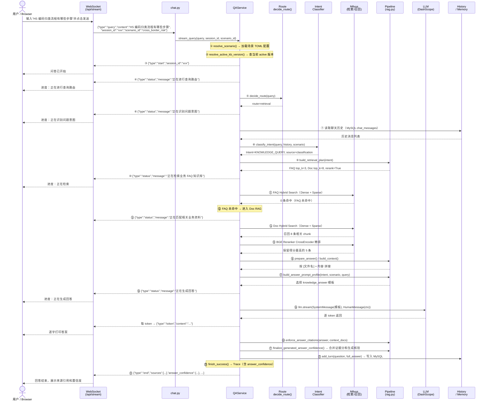

> **耗时分布（典型值）**：意图识别 ~50ms | FAQ 检索 ~80ms | Doc 检索 ~120ms | Rerank ~200ms | LLM 生成首 token ~2500ms | 总计 ~3000-4000ms。最慢的环节永远是 LLM 生成——因为需要等待云端模型推理，这是所有 RAG 系统的共性。

**两条特殊路径**（图中箭头覆盖但上面没走到的）：

1. **问候/越界快速通道**：`User → /api/stream → chat.py → QAService.stream_query → decide_route()`在主链路内直接产出答案事件，后面的检索准备、检索和 LLM 全部跳过。耗时取决于运行环境和限流/数据库状态，通常远低于完整 RAG。
2. **FAQ 直出通道**：分两种情况：Stage 1 的`route=faq_exact`只允许标准问题精确匹配；Stage 3 的 FAQ 标准直出则发生在检索准备之后，允许精确匹配或达到动态阈值。两者都会返回`metadata.answer`，不进入 Doc 检索和 LLM 生成。
3. **追问改写通道**：用户说"那审批呢"→ 意图识别为 FOLLOW\_UP → Pipeline 读取历史，把"HS 编码归类流程中的审批步骤"补全 → 后续流程和普通 RAG 一样。

### 2.3 部署架构图

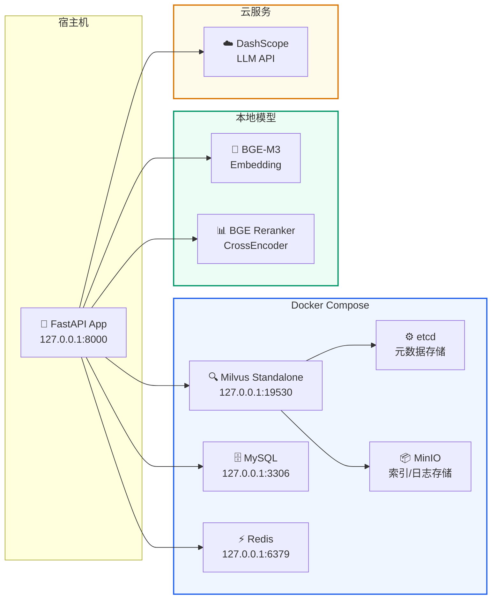

#### 2.3.1 部署拓扑解读

部署架构图将整个系统划分为**四个物理区域**，每个区域的部署方式和选型理由各不相同：

| 区域 | 位置 | 包含组件 | 部署方式 | 为什么放这里 |
| --- | --- | --- | --- | --- |
| 宿主机 | 本地 | FastAPI App (127.0.0.1:8000) | Python 进程直接运行 | 应用代码需要频繁修改调试，不适合容器化 |
| Docker | 本地容器 | Milvus + etcd + MinIO + MySQL + Redis | Docker Compose 编排 | 这些是"基础设施"，不需要修改代码，容器化能一键启动、统一管理 |
| 本地模型 | 本地磁盘 | BGE-M3 + BGE Reranker | Python 进程加载本地文件 | Embedding 和 Rerank 延迟敏感，不能走网络；且涉及私有数据不适合上传 |
| 云服务 | 阿里云 | DashScope LLM API | HTTPS 远程调用 | LLM 推理需要 GPU 集群，本地跑不动；API 调用按量付费，成本可控 |

#### 2.3.2 七类连接线逐一解读

图中的每一条箭头都是一条运行时依赖，按调用频率和延迟敏感度排列：

**① FastAPI → Milvus（高频 · 延迟敏感）**

```text
协议：gRPC（pymilvus）
端口：127.0.0.1:19530
每次问答调用：1-2 次（FAQ 检索 + Doc 检索）
数据量：Dense 向量(1024维) + Sparse 向量 + metadata
```

这是调用最频繁的外部依赖。每次用户提问，FastAPI 都要把问题向量化后发给 Milvus 做语义检索。部署在本地 Docker 是因为延迟必须可控——如果 Milvus 在云端，每次检索多 50-100ms 网络延迟，用户体验会明显变差。

**② FastAPI → MySQL（中频 · 延迟不敏感）**

```text
协议：TCP（pymysql / SQLAlchemy）
端口：127.0.0.1:3306
每次问答调用：2-3 次（读历史 + 写消息 + 刷新摘要）
数据量：每轮对话约 1-5KB 文本
```

MySQL 主要保存聊天记录、反馈和知识库治理控制面数据，例如版本状态、active 指针、文档清单与缓存命名空间。部署在本地 Docker 同样是为了避免网络延迟累积——虽然单次 MySQL 查询很快，但每次问答和治理操作都可能多次读写，走公网会显著拖慢。

**③ FastAPI → Redis（高频 · 延迟敏感）**

```text
协议：TCP（redis-py）
端口：127.0.0.1:6379
每次问答调用：按缓存命中情况读取或写入
数据量：query embedding 缓存、FAQ/Doc 检索缓存、缓存命名空间状态
```

Redis 是当前三级缓存里的 L2 共享缓存。更准确地说，这套设计是“L1 进程内 epoch 快照 + L2 Redis 业务缓存 + L3 MySQL 治理层”：L1 只缓存短 TTL 的`cache_epoch`快照，L2 存 query embedding 和 FAQ/Doc 检索结果，L3 MySQL 只存缓存命名空间与 epoch，不存检索结果。Redis 放在 Docker Compose 里，目的是让 API 重启后仍能复用短期缓存，并且便于和 MySQL、Milvus 一起由 Compose 管理。

**④ FastAPI → BGE-M3（高频 · 极度延迟敏感）**

```text
协议：本地函数调用（transformers / sentence-transformers）
每次问答调用：每个 chunk 入库时 1 次 + 每次查询 1 次
数据量：输入文本 → 输出 1024 维 float32 向量
```

BGE-M3 是 CPU/GPU 本地推理，不走网络。为什么必须本地？因为 Embedding 调用极其高频——入库时每个 chunk 都要向量化，在线问答时每个 query variant 都要向量化。如果走 API，不仅延迟不可控，API 调用费用也会非常高。而且，私有文档内容发送给第三方 Embedding 服务本身就有数据安全风险。

**⑤ FastAPI → BGE Reranker（中频 · 延迟敏感）**

```text
协议：本地函数调用（CrossEncoder）
每次问答调用：1 次（对召回结果统一排序）
数据量：输入 query+doc 对 → 输出相关性分数（用于候选排序，不等同于最终答案置信度）
```

Reranker 用 CrossEncoder 架构对 Milvus 召回的候选文档逐对打分。这个环节对精度影响最大——同样的召回结果，Rerank 前后 MRR 可能差 10-15 个百分点。本地部署保证了延迟和精度都可控。

**⑥ FastAPI → DashScope LLM（低频 · 延迟最高）**

```text
协议：HTTPS（OpenAI 兼容 API）
每次问答调用：0-2 次（意图分类可能需要 1 次 + 答案生成 1 次）
数据量：输入 System Prompt + 上下文 ~2000-4000 token，输出 ~200-800 token
```

LLM 是整个链路中唯一部署在云端的组件，也是最慢的环节（首 token 延迟 ~2500ms）。为什么 LLM 可以走云端而 Embedding 不行？

- LLM 推理需要 GPU 显存（至少 16GB+），本地开发机通常跑不动
- LLM 调用频率相对低（每次问答 1-2 次），不像 Embedding 那样一次入库就调用上百次
- API 调用按 token 计费，成本可控
- LLM 是文本进文本出，不涉及向量数据，传输量小

**⑦ Milvus → etcd / MinIO（内部依赖 · 用户无感）**

```text
协议：gRPC / S3 兼容 API
触发：Milvus 内部读写元数据和索引文件
用户不需要关心这两条线，Docker Compose 自动管理
```

- **etcd**：存 Milvus 的元数据（Collection Schema、索引配置、段信息）。类比 MySQL 的 information\_schema。
- **MinIO**：存 Milvus 的索引文件、日志和 binlog。类比 MySQL 的 ibdata 文件。

#### 2.3.3 端口与网络边界

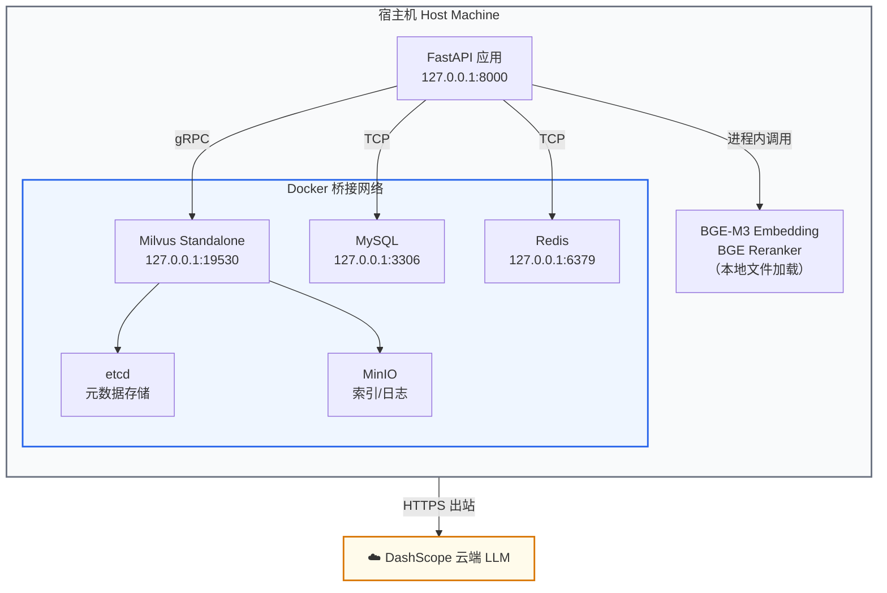

所有本地组件都绑定在`127.0.0.1`，不暴露到公网，安全性由操作系统网络栈保证。

### 2.4 技术栈详解

| 层级 | 技术 | 为什么选它 |
| --- | --- | --- |
| API 框架 | FastAPI | 原生支持异步、WebSocket、自动生成 OpenAPI 文档 |
| RAG 编排 | LangChain | 开源生态成熟，封装了 ChatModel、VectorStore、MessageHistory 等 |
| 向量数据库 | Milvus 2.5.x | 支持 BGE-M3 Dense + Milvus BM25 Sparse 混合检索 |
| Embedding | BGE-M3 | 中文语义理解能力强，支持本地部署，生成 1024 维 Dense 向量 |
| Sparse 向量 | Milvus BM25BuiltInFunction | 服务端内置函数，不需要额外部署分词器 |
| Reranker | BGE Reranker Large | CrossEncoder 架构，对召回结果做精细排序 |
| LLM | DashScope (OpenAI 兼容) | 通过 LangChain ChatOpenAI 统一调用 |
| 会话存储 | MySQL | LangChain SQLChatMessageHistory 自动管理表结构 |
| 缓存 | Redis + 进程内缓存 + MySQL 命名空间 | 支撑 query embedding、FAQ/Doc 检索和版本激活后的缓存失效闭环 |
| 配置 | `.env.compose`/`.env`+`scenario.toml` | 运行时环境变量 + 场景级 TOML 配置 |

### 2.5 跨境贸易业务场景

项目当前只保留跨境贸易这一业务场景，共享完整的 RAG 核心引擎与治理流程：

| 场景 ID | 业务领域 | 典型问题 |
| --- | --- | --- |
| `cross_border_risk` | 跨境贸易 | "跨境贸易中 HS 编码归类争议怎么处理" |


### 2.6 核心模块一览

```text
qa_core/
├── api/              # FastAPI 路由 — HTTP/WebSocket 请求入口
├── application/      # 服务编排 — QAService 统一业务入口
├── intent/           # 意图识别 — 判断用户想干什么
├── retrieval/        # 检索系统 — Milvus 连接、过滤、重排
├── pipeline/         # RAG 主流程 — 事件生成、上下文构建
├── prompts/          # 提示词 — 模板选择、场景注入
├── indexing/         # 入库 — 文档加载、切分、FAQ 入库
├── governance/       # 治理 — 知识库版本、数据隔离
├── memory/           # 记忆 — 聊天历史、摘要、反馈
├── quality/          # 质量 — 入库质量、冲突检测
├── scenarios/        # 场景配置、source 推断（当前仅跨境贸易）
├── config/           # 配置 — 设置、日志、启动校验
└── observability/    # 可观测 — 追踪、评测、Bad Case
```

---

## 第三部分：环境搭建与首次启动

本章只完成“让项目第一次跑起来”。Dockerfile、Compose 字段、镜像分层、完整交付验收和故障排查统一放到[项目阶段 17](/blog/17-docker-delivery)。

### 3.1 运行方式

| 方式 | API 位置 | 基础设施 | 适用场景 |
| --- | --- | --- | --- |
| Docker Compose | API、MySQL、Redis、Milvus、etcd、MinIO 都在容器内 | Compose 统一管理 | 首次学习、标准部署、环境复现 |
| 本机 API | Python API 在宿主机运行 | MySQL、Redis、Milvus、etcd、MinIO 仍用 Docker | 高频修改 Python 代码 |

首次运行优先选择 Docker Compose。容器之间通过服务名访问依赖，例如`mysql:3306`、`redis:6379`、`milvus:19530`；宿主机调试则使用`localhost`。

### 3.2 准备配置和模型

Windows PowerShell：

```powershell
if (!(Test-Path .env.compose)) { Copy-Item .env.compose.example .env.compose }
New-Item -ItemType Directory -Force models, logs, reports | Out-Null
Test-Path .\models\bge-m3
Test-Path .\models\bge-reranker-large
Test-Path .\models\bert_intent_classifier_v1
```

Linux Shell：

```bash
cp -n .env.compose.example .env.compose
mkdir -p models logs reports
test -d models/bge-m3
test -d models/bge-reranker-large
test -d models/bert_intent_classifier_v1
```

宿主机模型目录统一使用项目相对路径`./models`，Compose 挂载到容器内`/app/models`。因此 Windows 和 Linux 不需要在配置中写各自的绝对路径：

```text
MODEL_VOLUME_HOST_PATH=./models
EMBEDDING_MODEL_PATH=/app/models/bge-m3
RERANKER_MODEL_PATH=/app/models/bge-reranker-large
INTENT_MODEL_PATH=/app/models/bert_intent_classifier_v1
```

然后在`.env.compose`中填写真实的`DASHSCOPE_API_KEY`、数据库密码和管理令牌。

### 3.3 最小启动流程

```bash
# 1. 启动基础设施
docker compose --env-file .env.compose up -d mysql redis etcd minio milvus

# 2. 首次机器若没有项目基础镜像，先构建一次
docker build -f Dockerfile.base -t localhost/knowforge-rag-platform-base:py312 .

# 3. 构建 API
docker compose --env-file .env.compose build api

# 4. 初始化并激活跨境贸易业务场景
docker compose --env-file .env.compose run --rm api python scripts/rebuild_scenarios.py --reset-collections --description "docker init cross-border trade"

# 5. 启动 API
docker compose --env-file .env.compose up -d api

# 6. 查看状态
docker compose --env-file .env.compose ps
docker compose --env-file .env.compose logs --tail 80 api
```

`Dockerfile.base`只在目标机器没有`localhost/knowforge-rag-platform-base:py312`时需要构建；已有该镜像时可以跳过第 2 步。

### 3.4 访问与最小检查

| 环境 | 地址 |
| --- | --- |
| Windows 本机 | `http://127.0.0.1:8000` |
| Linux 服务器 | `http://服务器IP:8000` |
| 健康检查 | `http://127.0.0.1:8000/health` |

如果 API 没有启动，按以下顺序检查：

```bash
docker compose config 是否通过
→ 基础服务是否 healthy
→ /app/models 下三个模型目录是否存在
→ active 知识库版本是否已生成
→ api 日志中的 preflight 失败项
```

启动前置校验的源码和职责放在[项目阶段 12](/blog/12-app-entry-preflight)，Docker 构建、部署脚本、验收命令和常见故障放在[项目阶段 17](/blog/17-docker-delivery)。

### 3.5 启动前置校验的工作机制

服务不是进程启动后立刻接受请求，而是先执行 FastAPI`lifespan -> warmup_runtime()`。这里采用**fail-fast（尽早失败）**：本地模型、场景资料、Milvus、MySQL、active 知识库版本等关键条件任一不满足，进程直接启动失败，而不是等用户第一次提问时才报错。

需要区分两个概念：

- **启动必需条件**：LLM Key、Admin Token、本地模型、场景配置与资料、Milvus、MySQL、active 知识库版本；缺失时阻断启动。
- **LLM 供应商真实连通性**：启动时只确认 Key 已配置；真实请求由后台任务探测并写入健康状态，不因供应商短暂抖动阻断 API 进程。

Redis 是条件依赖：只有`CACHE_ENABLED=true`时，启动校验才要求 Redis Python 客户端已安装且`redis_host:redis_port`可连通。

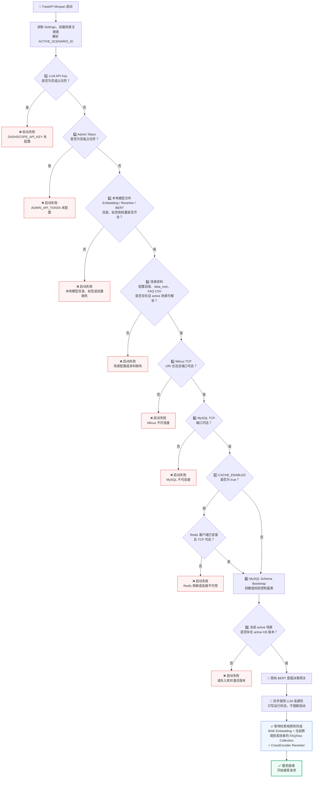

下面的代码是实际启动顺序的压缩版。`validate_runtime_environment()`只处理配置、文件系统和 TCP 前置条件；MySQL 表结构、active 版本和模型预热由`app.py`继续完成。

```python
# app.py
@asynccontextmanager
async def lifespan(_: FastAPI):
    await warmup_runtime()
    yield


async def warmup_runtime() -> None:
    # 1-7：Key、Token、模型、场景资料、Milvus、MySQL、可选 Redis
    validate_runtime_environment()

    # 8：控制面表必须先存在，版本状态才能查询
    await asyncio.to_thread(bootstrap_mysql_schema)

    # 9：当前 active 场景必须已有已激活版本
    validate_active_kb_versions(settings.active_scenario_id)

    # 预热 BERT 意图分类模型和规则网关
    warmup_intent_decision_gateway()

    # 后台记录 LLM 可用性；这里不等待，也不以失败阻断启动
    asyncio.create_task(refresh_llm_status_background())

    # 预热 BGE、当前已配置场景的 FAQ/Doc Collection、CrossEncoder，完成前不接收流量
    start_retrieval_warmup_background()
    await asyncio.to_thread(wait_for_retrieval_warmup)
```

`validate_runtime_environment()`内部的校验顺序如下。先做几乎零成本的占位符检查，再检查本地路径，最后才做网络 I/O；因此配置错误通常会比网络超时更早暴露。

```python
# qa_core/config/preflight.py
from pathlib import Path

def validate_runtime_environment() -> dict[str, object]:
    settings = get_settings()
    registry = get_scenario_registry()
    scenario = resolve_scenario(settings.active_scenario_id)

    # 1-2：空值或示例占位符都不允许启动
    if _is_placeholder(settings.llm_api_key):
        raise RuntimeError("DASHSCOPE_API_KEY 未配置")
    if _is_placeholder(settings.admin_api_token):
        raise RuntimeError("ADMIN_API_TOKEN 未配置")

    # 3：三类本地模型都要可用；BERT 还要求标签文件和权重文件
    _require_path("Embedding 模型目录", settings.embedding_model_path)
    _require_path("Reranker 模型目录", settings.reranker_model_path)
    _require_path("BERT 意图模型目录", settings.intent_model_path)
    _require_path("BERT 意图模型标签文件", str(Path(settings.intent_model_path) / "intent_labels.json"))
    if not (Path(settings.intent_model_path) / "model.safetensors").exists() and not (
        Path(settings.intent_model_path) / "pytorch_model.bin"
    ).exists():
        raise RuntimeError("BERT 意图模型权重文件不存在")

    # 4：当前场景配置、资料目录和 FAQ 文件都必须存在
    _require_path("场景配置目录", settings.scenario_config_dir)
    if scenario.scenario_id not in {item.scenario_id for item in registry.list_scenarios()}:
        raise RuntimeError("ACTIVE_SCENARIO_ID 无效")
    _require_path("场景文档目录", scenario.data_root)
    _require_path("场景 FAQ 文件", scenario.faq_csv_path)

    # 5-7：基础设施连通性；Redis 只在启用缓存时成为必需依赖
    _require_milvus_uri()
    _require_tcp("MySQL", settings.mysql_host, settings.mysql_port)
    if settings.cache_enabled:
        _require_redis()
```

**设计意图**：允许核心组件缺失时继续启动，会形成“页面能打开，用户提问才报错”的假可用状态。当前设计把故障前移到启动日志：缺模型就补模型，缺 active 版本就先入库，Milvus 或 MySQL 不通就先修基础服务；排查对象明确，不会把后端配置问题误判成前端或网络偶发问题。

**下一讲**：[RAG 核心概念深入](/blog/02-rag-fundamentals)— 向量检索原理、Embedding 模型、混合检索策略

---

<a id="doc-02-rag-fundamentals-md"></a>
# 项目阶段 02：RAG 核心概念深入

> 来源：`src/content/blog/02-rag-fundamentals.md`
> 类型：博客文章
> description：上一讲 ： 项目概述与 Docker 环境搭建 下一讲 ： LangChain 生态系统
> pubDate：2026-09-13
> tags：KnowForge、RAG、工程实践
> draft：否
> featured：否

**上一讲**：[项目概述与 Docker 环境搭建](/blog/01-project-overview)**下一讲**：[LangChain 生态系统](/blog/03-langchain-ecosystem)

## 本节目标

- 深入理解向量检索的数学原理
- 掌握 Embedding 模型的工作机制
- 理解 Dense 检索和 Sparse 检索的区别与互补
- 了解 Reranker（重排）在 RAG 链路中的作用

---

## 第一部分：前置知识 — Embedding 模型

### 1.1 什么是 Embedding

**Embedding（嵌入）**是将非结构化数据（文本、图片、音频）转换为固定长度的浮点数向量的技术。

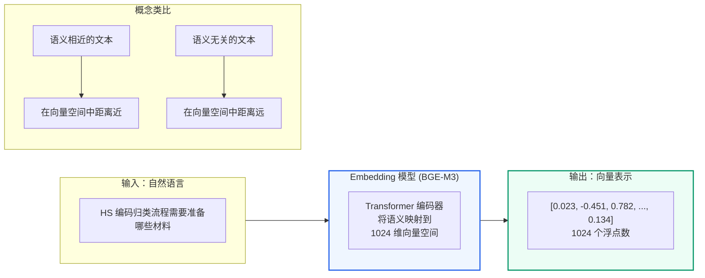

在文本领域，Embedding 模型接收一段文字，输出一串数字（通常是 512 到 4096 维的向量），这个向量在数学空间中代表了这段文字的"语义位置"。

### 1.2 为什么要 Embedding

计算机本质上只能做数值计算。要让计算机"理解"两段文字是否相似，必须先把文字变成它可以计算的数字。

早期方法（如 TF-IDF、Bag-of-Words）只统计词频和共现关系，无法理解语义：
- "我很开心" 和 "我非常高兴" 的词完全不同，但语义相同
- "银行利率很高" 和 "河边的银行很美" 词相同，但语义完全不同

现代 Embedding 模型基于 Transformer 架构，通过大规模预训练学会了理解上下文中的语义。同一个词在不同上下文中会产生不同的向量表示。

### 1.3 向量相似度计算

Embedding 把文本变成向量以后，检索系统要回答一个问题：**用户问题向量和知识库中哪个 chunk 向量更接近？**

这里要先区分两个概念：

- **相似度（similarity）**：分数越大越相似，例如 Cosine、Inner Product
- **距离（distance）**：数值越小越接近，例如 Euclidean Distance

向量数据库通常会把距离或相似度统一转成“可排序的分数”。所以你在代码里看到的`score`，不一定都严格等于数学公式原始值，而是 Milvus / LangChain 返回的检索排序分数。

本项目在项目阶段 10会额外返回`answer_confidence`。它和这里的`score`不是一回事：`score`表示单条候选的检索相关性；`answer_confidence`是最终答案综合置信度，内部会先用`evidence_confidence`衡量生成前证据是否扎实，再用`generation_verification`核验 LLM 生成答案的行内引用、引用编号和上下文词面支撑度。

#### 1.3.1 余弦相似度：看方向

**余弦相似度 (Cosine Similarity)**— 最常用

\[\text{cosine}(A, B) = \frac{A \cdot B}{||A|| \times ||B||}\]

其中：

- \(A \cdot B\)是两个向量的点积
- \(||A||\)和\(||B||\)是两个向量的长度
- 分母的作用是把长度影响消掉，只比较两个向量的方向
- 取值范围 [-1, 1]
- 1 表示方向完全一致，0 表示正交（不相关），-1 表示方向相反
- 只看方向不看长度，适合文本语义比较

直观理解：

```text
"HS 编码归类流程"       → 方向接近 "报关资料提交步骤"       → cosine 高
"HS 编码归类流程"       → 方向远离 "报关系统连接失败"         → cosine 低
```

#### 1.3.2 欧几里得距离：看直线距离

**欧几里得距离 (Euclidean Distance)**— 适合 L2 归一化后的向量

\[d(A, B) = \sqrt{\sum\_{i=1}^{n}(A\_i - B\_i)^2}\]

欧氏距离比较的是两个点在向量空间中的直线距离。它是“距离”，所以：

- 数值越小，表示越相似
- 数值越大，表示越不相似

如果向量已经做过 L2 归一化，Cosine、L2、IP 的排序结果会非常接近。原因是所有向量都被压到单位球面上，长度都约等于 1，这时主要差别就来自方向。

#### 1.3.3 内积：看方向和长度的乘积

**内积 (Inner Product / Dot Product)**：

\[IP(A, B) = \sum\_{i=1}^{n}A\_i \times B\_i\]

内积可以理解为“两个向量在同一方向上的重合程度”。如果向量没有归一化，内积会同时受方向和长度影响；如果向量已经 L2 归一化，内积和余弦相似度等价：

\[
||A|| = ||B|| = 1 \Rightarrow \text{cosine}(A, B) = A \cdot B
\]

所以很多向量检索系统会使用：

- **COSINE**：语义检索中最容易解释
- **IP**：归一化后效果等价，计算更直接
- **L2**：适合一些几何距离场景

```python
import numpy as np

# 两个语义相近的句子的向量
A = np.array([0.5, 0.3, 0.8, ...])  # "报关需要什么材料"
B = np.array([0.48, 0.32, 0.79, ...])  # "报关要准备哪些文件"

cosine_sim = np.dot(A, B) / (np.linalg.norm(A) * np.linalg.norm(B))
# 结果 ≈ 0.95（很高）

# 两个语义不同的句子的向量
C = np.array([-0.3, 0.7, -0.2, ...])  # "今天天气怎么样"

cosine_sim_ac = np.dot(A, C) / (np.linalg.norm(A) * np.linalg.norm(C))
# 结果 ≈ 0.1（很低）
```

#### 1.3.4 本项目在哪里用相似度计算

本项目不是只在一个地方做“相似度计算”，而是在检索链路中分层使用：

| 使用位置 | 代码位置 | 计算方式 | 作用 |
| --- | --- | --- | --- |
| Dense 向量检索 | `qa_core/retrieval/store.py`→`similarity_search_with_score()` | BGE-M3 生成 1024 维 dense 向量，Milvus 按 dense 向量字段检索 | 找到语义相近的 FAQ / 文档 chunk |
| Dense 索引示例 | 项目阶段 04 pymilvus 示例 | `metric_type="COSINE"` | 示例展示 Milvus 如何按向量相似度搜索 |
| Sparse BM25 检索 | `qa_core/retrieval/milvus_compat.py`→`BM25BuiltInFunction` | 中文分词 + BM25 词频/逆文档频率评分 | 找到精确包含关键词、术语、编号的内容 |
| Hybrid 融合 | `qa_core/retrieval/store.py` | `ranker_type="weighted"`，权重`[0.55, 0.45]` | 将 dense 语义分数和 sparse BM25 分数融合排序 |
| CrossEncoder 重排 | `qa_core/retrieval/ranking.py` | query + passage 成对输入 reranker 模型 | 对 Milvus 召回候选做二阶段精排 |

本项目的核心检索配置可以概括为：

```text
用户问题
  → BGE-M3 生成 dense query vector
  → Milvus BM25 Function 生成 sparse query representation
  → Milvus 同时检索 dense 字段和 sparse 字段
  → WeightedRanker 按 0.55 / 0.45 融合
  → CrossEncoder Reranker 二阶段重排
```

#### 1.3.5 Sparse 检索也是用余弦相似度吗？

**不是。至少在本项目中不是。**

Dense 检索比较的是 BGE-M3 生成的连续浮点向量，例如 1024 维：

```text
dense = [0.012, -0.034, 0.876, ...]
```

这类向量适合用 Cosine / IP / L2 这类几何相似度计算。

Sparse 检索虽然也叫“稀疏向量”，但本项目的 sparse 字段由 Milvus 的 BM25 Function 生成，核心思想不是“两个语义向量夹角有多小”，而是：

```text
query 里出现的词，是否也出现在文档里？
这个词在当前文档中出现得多不多？
这个词在整个语料库中稀不稀有？
这篇文档是不是因为太长而天然占便宜？
```

BM25 的典型形式是：

\[\text{BM25}(D, Q) = \sum\_{i=1}^{n} \text{IDF}(q\_i) \times \frac{f(q\_i, D) \times (k\_1 + 1)}{f(q\_i, D) + k\_1 \times (1 - b + b \times \frac{|D|}{\text{avgdl}})}\]

它关注的是：

- **TF**：词在当前文档里出现多少次
- **IDF**：词在整个语料中稀不稀有，越稀有越重要
- **长度归一化**：长文档不能因为词多就天然分数高

可以这样总结：

```text
Dense 相似度：比较语义向量，常见公式是 Cosine / IP / L2。
Sparse BM25：比较关键词匹配贡献，核心是词频、逆文档频率和文档长度归一化。
Hybrid Search：不是让两者用同一个公式，而是分别计算各自分数，再融合排序。
```

### 1.4 BGE-M3 模型介绍

本项目使用的是**BGE-M3**（BAAI General Embedding M3），由北京智源研究院（BAAI）开发。

> 📖**深入阅读**：如果你想了解 Embedding 模型的完整工作原理（Tokenization → Transformer → Pooling → 向量输出）、维度选择、模型对比和 L2 归一化，请阅读[附录F：Embedding 模型深入](/blog/appendix-f-embedding-models)。

**BGE-M3 的核心特点**：

| 特性 | 说明 |
| --- | --- |
| 多语言 | 支持中英双语及 100+ 语言 |
| 多粒度 | 支持短句到长文档（最多 8192 token）的向量化 |
| 多功能 | 同时支持 Dense 检索、Sparse 检索和 Multi-Vector 检索 |
| 维度 | 默认输出 1024 维 Dense 向量 |
| 部署 | 可在本地 GPU/CPU 上运行，不需要调用外部 API |

在本项目中，BGE-M3 默认放在项目`./models/bge-m3/`目录下；Docker 模式会挂载到容器内`/app/models/bge-m3/`，再通过 LangChain 的 Embedding 接口调用：

```python
# qa_core/retrieval/models.py — 获取 Embedding 模型
from langchain_huggingface import HuggingFaceEmbeddings
from qa_core.config.settings import get_settings

def get_embeddings():
    settings = get_settings()
    return HuggingFaceEmbeddings(
        model_name=settings.embedding_model_path,
        model_kwargs={"device": "cpu", "local_files_only": True},  # 或 "cuda"
        encode_kwargs={"normalize_embeddings": True},  # L2 归一化
    )
```

---

## 第二部分：向量数据库在 RAG 中的职责

Embedding 只负责把文本变成向量，向量数据库负责保存和检索这些向量。一次在线查询通常需要完成：

```text
query → embedding → Top-K 向量检索 → metadata 过滤 → 返回候选文本
```

| 能力 | 在 RAG 中的作用 |
| --- | --- |
| 向量存储 | 保存文档 chunk、FAQ 的向量及原文 |
| ANN 检索 | 从大量向量中快速召回近似 Top-K |
| 标量过滤 | 限制场景、版本、租户、角色和 source |
| 集合管理 | 隔离不同数据结构和业务数据 |

普通关系查询擅长精确条件，全文检索擅长关键词匹配，向量数据库擅长语义相似度搜索。企业 RAG 往往需要把这些能力组合起来，而不是让一种存储承担所有任务。

本项目选择 Milvus，但本章不展开 Milvus 的 Collection、Schema、索引、部署架构和产品选型。这些内容统一放在[第 04 讲：Milvus 索引机制与基本操作](/blog/04-milvus-index-and-operations)。

---

## 第三部分：Dense 检索 vs Sparse 检索

这是本项目最核心的检索概念。让我们用一个具体的例子来理解。

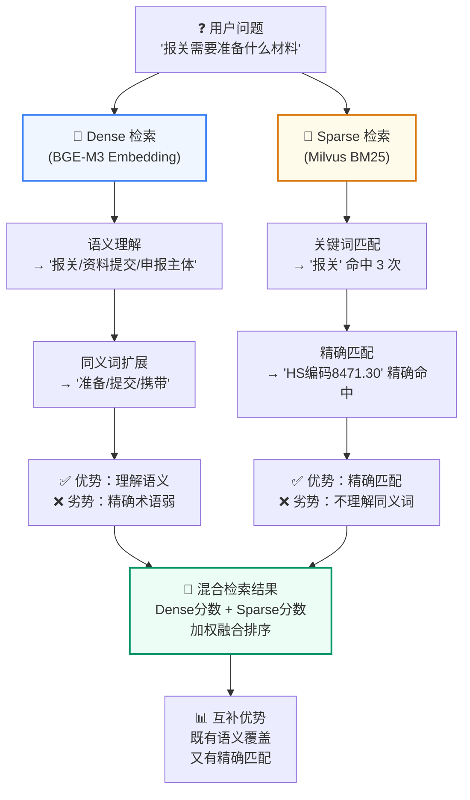

### 3.1 场景设定

假设知识库中有以下文档片段：

| ID | 内容 |
| --- | --- |
| D1 | "申报账号异常时，可以通过绑定的邮箱或手机号完成身份验证并恢复访问" |
| D2 | "关务管理员可以在后台重置申报账号的访问凭据" |
| D3 | "海关接口回调地址配置在报关系统的集成管理页面" |
| D4 | "报关 API 密钥在贸易系统的安全设置页面中生成和管理" |

### 3.2 Dense 检索（语义相似度）

用户提问：**"申报账号异常后如何恢复访问"**

Dense 检索使用 Embedding 模型将问题和文档都转成向量，计算余弦相似度：

```text
问题向量   vs  D1 向量 → 相似度 0.91  ← 最高！语义非常接近
问题向量   vs  D2 向量 → 相似度 0.72
问题向量   vs  D3 向量 → 相似度 0.15
问题向量   vs  D4 向量 → 相似度 0.22
```

D1 排第一，因为"账号异常→验证身份并恢复访问"与用户问题语义高度相关。

**Dense 检索的优势**：
- 理解语义，同义词和改写都能识别
- "恢复申报账号"、"重置访问凭据"、"申报账号异常怎么办"等表达都能召回

**Dense 检索的局限**：
- 对专业术语、编号、代码等精确匹配较弱
- 例如搜索"API v3.2 变更"，Dense 检索可能召回所有和 API 相关的文档，难以精确定位到特定版本

### 3.3 Sparse 检索（关键词匹配）

Sparse 检索（本项目使用 BM25 算法）基于词频和逆文档频率，对关键词做精确匹配：

```text
问题："报关 API 密钥在贸易系统的安全设置页面中生成和管理"

D4 包含：API(1次), 密钥(1次), 个人设置(1次), 安全页面(1次), 生成(1次), 管理(1次)
→ BM25 分数最高

D3 包含：Webhook(1次), 回调(1次), API(0次), 密钥(0次)
→ BM25 分数较低
```

**Sparse 检索的优势**：
- 精确匹配专业术语、编号（如 "API v3.2"、"HS 编码 8471.30"）
- 对生僻词和专有名词效果极好
- 计算效率高，不需要 GPU

**Sparse 检索的局限**：
- 无法理解语义：搜"恢复访问"不一定会召回"申报账号异常怎么办"
- 同义词需要手动维护

### 3.4 Hybrid Search（混合检索）

**混合检索 = Dense + Sparse**，取长补短：

```text
问题："HS 编码 8471.30 的进口关税是多少"

Dense 检索贡献：
  → 召回语义相关的文档：关税政策、进口流程、税率表

Sparse 检索贡献：
  → 精确匹配 "8471.30" 的文档：该编码对应的具体税率记录

合并结果 → 既有精确的编码匹配，又有相关的背景信息
```

在本项目中，Milvus 2.5.x 原生支持混合检索，并通过 BM25BuiltInFunction 提供 Sparse 召回能力：

```text
# 一次查询同时走 Dense 向量和 Sparse 向量
results = milvus_store.similarity_search_with_score(
    query,
    k=top_k,
    expr=filter_expression,  # 同时过滤 source、kb_version、tenant 等
)
# Milvus 内部自动融合 Dense 和 Sparse 的分数
```

---

## 第四部分：Reranker（重排器）

向量检索适合从大规模知识库中快速召回候选，但 Top-K 的顺序不一定足够准确。Reranker 的职责是在候选集已经很小之后，再判断“当前问题与每条候选文本是否真正相关”。

### 4.1 Bi-Encoder 与 CrossEncoder

| 阶段 | 输入方式 | 优点 | 代价 |
| --- | --- | --- | --- |
| Bi-Encoder 召回 | query 和文档分别编码，再比较向量 | 文档向量可预计算，检索快 | query 与文档缺少逐词交互 |
| CrossEncoder 重排 | 把`(query, document)`成对送入模型 | 相关性判断更细致 | 每个候选都要推理，只适合 Top-K |

典型链路是：

```text
Milvus 快速召回 20 条
→ CrossEncoder 对 20 个 query-document 对打分
→ 重新排序并保留前 5 条
```

因此 Reranker 不能代替向量数据库：它负责“少量候选精排”，不负责“全库召回”。

### 4.2 本项目中的内容边界

- 本章只建立召回与重排的概念边界。
- [第 08 讲](/blog/08-milvus-hybrid-search#33-reranker)讲`rerank_hits()`如何进入项目检索链路。
- [附录 D](/blog/appendix-d-crossencoder-reranker)讲 CrossEncoder、BGE Reranker、推理成本和失效场景。

---

## 第五部分：在本项目中的体现

回顾项目阶段 01中的核心架构图，现在你应该能理解每个组件的角色：

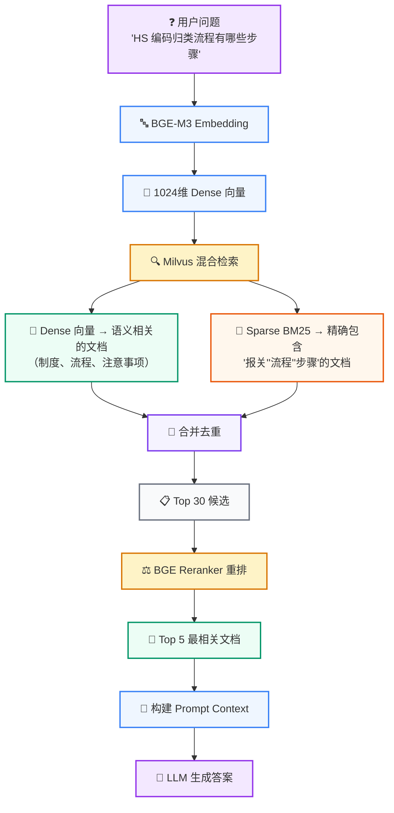

---

<a id="doc-03-langchain-ecosystem-md"></a>
# 项目阶段 03：LangChain 生态系统

> 来源：`src/content/blog/03-langchain-ecosystem.md`
> 类型：博客文章
> description：上一讲 ： RAG 核心概念深入 下一讲 ： Milvus 索引机制与基本操作
> pubDate：2026-09-13
> tags：KnowForge、RAG、工程实践
> draft：否
> featured：否

**上一讲**：[RAG 核心概念深入](/blog/02-rag-fundamentals)**下一讲**：[Milvus 索引机制与基本操作](/blog/04-milvus-index-and-operations)

---

## 本节导入

LangChain 的组件很多：Runnable、Prompt、Message、Parser、History、Loader、Splitter、VectorStore 都是常见概念。理解这些组件时，最重要的不是记住每个类名，而是看清它们在企业级 RAG 项目中分别出现在什么位置、解决什么工程问题。

本节只围绕三个问题：

1. **LangChain 在本项目里到底是什么角色？**
2. **一次在线问答中，哪些步骤用到了 LangChain？**
3. **一次离线入库中，哪些步骤用到了 LangChain？**

先记住一句话：

> 本项目没有把 LangChain 当成“一键 RAG 框架”，而是把它当成一组可靠的工程适配器：模型适配器、消息对象、结构化输出、历史记录、文档对象、加载器、切分器和向量库封装。

---

## 本节目标

完成本节后，需要能说清楚：

- 为什么项目用`ChatOpenAI`接入 DashScope，而不是直接绑定某个厂商 SDK。
- `SystemMessage`、`HumanMessage`、`AIMessage`在多轮对话和 Prompt 中分别承担什么角色。
- `with_structured_output()`为什么比让模型返回自由文本更适合查询变体生成。
- `SQLChatMessageHistory`、`Document`、`TextSplitter`、`Milvus VectorStore`分别位于项目哪条链路。
- 为什么本项目没有直接使用`RetrievalQA`、`ConversationalRetrievalChain`或一条 LCEL 管道完成全部 RAG。

---

## 第一部分：LangChain 在项目中的角色

### 1.1 LangChain 不是完整业务流程

LangChain 不是模型，也不是知识库，更不是项目的业务大脑。它更像一组标准接口：

| 项目问题 | LangChain 提供的抽象 |
| --- | --- |
| 不同 LLM 厂商 API 不一致 | `ChatOpenAI`等 ChatModel 统一接口 |
| 多轮对话消息结构容易混乱 | `SystemMessage`/`HumanMessage`/`AIMessage` |
| LLM 输出格式不稳定 | `with_structured_output()`+ Pydantic |
| 历史消息要持久化 | `SQLChatMessageHistory` |
| 文件格式不同 | Document Loader |
| 大文档需要切块 | Text Splitter |
| 向量库写入和检索 API 复杂 | VectorStore |

也就是说，LangChain 解决的是**接口标准化**和**工程胶水**问题。本项目真正的业务流程仍然由`qa_core`自己编排。

### 1.2 本项目的使用边界

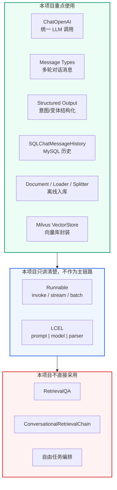

这里要特别区分：**不用高层 Chain，不代表不用 LangChain**。本项目用的是 LangChain 的底层稳定组件，把分支、阈值、追问改写、FAQ 直出、文档检索、Prompt 档位这些业务决策留在项目代码里。

---

## 第二部分：一张图看清两条主线

本项目中 LangChain 的使用分成两条线：

1. **在线问答链路**：用户提问 -> 意图识别 -> 检索准备 -> Prompt -> LLM 流式生成。
2. **离线入库链路**：业务文件 -> Document -> 切分 -> Milvus VectorStore 写入。

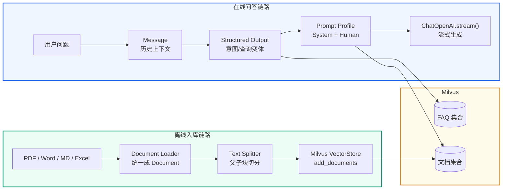

这张图就是本节主线。后面所有组件都放回这两条线里讲。

---

## 第三部分：在线问答链路中的 LangChain

这部分回答“用户提问之后，LangChain 在哪里参与在线回答”。先看项目代码位置，再看组件作用。

### 3.1 ChatOpenAI：统一模型调用入口

项目文件：`qa_core/llm/client.py`

本项目实际使用 DashScope 的 OpenAI-compatible 接口，但代码里不直接写 DashScope SDK，而是统一用 LangChain 的`ChatOpenAI`：

```python
from functools import lru_cache

from langchain_core.messages import HumanMessage
from langchain_openai import ChatOpenAI

from qa_core.config.settings import get_settings


@lru_cache(maxsize=2)
def get_chat_model(streaming: bool = False) -> ChatOpenAI:
    settings = get_settings()
    return ChatOpenAI(
        model=settings.llm_model,
        api_key=settings.llm_api_key,
        base_url=settings.llm_base_url,
        temperature=settings.llm_temperature,
        timeout=settings.llm_timeout,
        streaming=streaming,
    )
```

这里的设计点：

- `base_url`可以指向 DashScope、DeepSeek 或其他 OpenAI-compatible 服务。
- `streaming=False`用于查询改写和查询变体结构化输出。
- `streaming=True`用于最终答案生成，方便 WebSocket 逐 token 推送。
- `@lru_cache(maxsize=2)`只缓存两个客户端实例，不缓存模型答案。

这里要区分两个“缓存”：`@lru_cache`缓存的是 ChatOpenAI 客户端对象，只是避免每次请求重建连接；它不会跳过模型调用，也不会复用上一次生成的文本。

当前实现也没有必要立刻做最终答案缓存：FAQ 精确命中已经会直接返回，查询 embedding 和 FAQ/Doc 检索结果也已缓存。普通 RAG 的最终文本还要结合历史追问、权限域、知识库版本、Prompt Profile 和本次检索证据生成，生成完成后还要做引用补强和生成后核验。因此当前的边界是：**缓存稳定的计算和证据，最终答案每次根据当前上下文生成并核验。**

### 3.2 Message：让多轮对话结构稳定

LangChain 的消息对象对应 OpenAI API 的角色格式：

| LangChain 对象 | API role | 项目用途 |
| --- | --- | --- |
| `SystemMessage` | `system` | 设定助手身份、回答边界、风险约束 |
| `HumanMessage` | `user` | 用户问题、改写请求、检索上下文问题 |
| `AIMessage` | `assistant` | 历史回答，进入多轮上下文 |

项目文件：`qa_core/memory/history.py`

```python
from langchain_core.messages import AIMessage, HumanMessage, SystemMessage


def add_turn(self, session_id: str, question: str, answer: str) -> None:
    history = self.for_session(session_id)
    history.add_messages([
        HumanMessage(content=question),
        AIMessage(content=answer),
    ])


def get_context_messages(self, session_id: str):
    recent = self.get_messages(session_id, limit=self.settings.history_recent_messages)
    summary = self.get_summary(session_id)
    if summary:
        return [SystemMessage(content=f"历史摘要：{summary}")] + recent
    return recent
```

需要理解：LLM 本身没有会话记忆。所谓“多轮对话”，本质是每次调用模型时，把必要的历史消息重新发给模型。

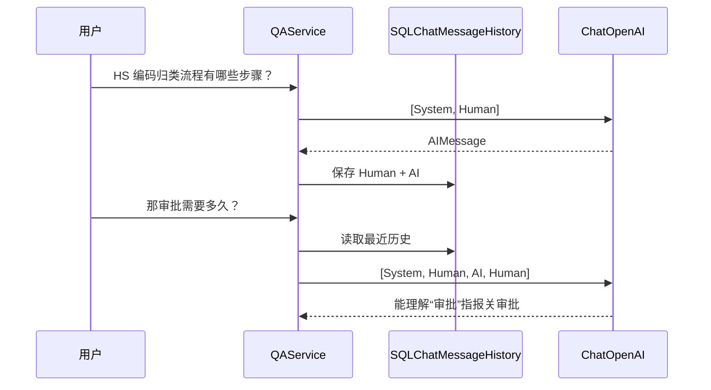

### 3.2.1 History 不等于模型自带记忆

LangChain 中常说的 Memory，不能理解成“模型自己记住了用户”。它的真实过程是：

```text
本轮请求
  -> 从存储读取 session_id 对应的历史消息
  -> 组装成 SystemMessage / HumanMessage / AIMessage
  -> 再次发送给模型
```

`SQLChatMessageHistory`负责把 LangChain 消息对象映射到关系型数据库。它解决的是消息的读写适配，不负责判断哪些历史与当前问题相关，也不负责检索知识库。

本项目的生产存储关系如下：

| 层次 | 实现 | 职责 |
| --- | --- | --- |
| LangChain 适配器 | `SQLChatMessageHistory` | 把`BaseMessage`读写到 SQL 表 |
| 项目存储封装 | `ChatHistoryStore` | 绑定 MySQL、session、最近消息和摘要 |
| 持久化表 | `chat_messages` | 保存完整会话消息，支持重启后恢复和审计 |
| 派生表 | `chat_session_summaries` | 保存旧消息压缩后的摘要 |
| RAG 上下文 | `历史摘要 + 最近消息` | 只把必要上下文传给改写和回答链路 |

`chat_messages`的核心字段可以简化为：

```sql
CREATE TABLE chat_messages (
    id BIGINT AUTO_INCREMENT PRIMARY KEY,
    session_id VARCHAR(191) NOT NULL,
    message LONGTEXT NOT NULL,
    INDEX idx_chat_messages_session_id (session_id)
);
```

其中`session_id`是会话隔离边界，`message`保存 LangChain 序列化后的消息内容。相同用户开启不同会话时，只要`session_id`不同，读取到的历史就不会混在一起。

下面的演示使用临时 SQLite 文件模拟同一套 LangChain 存储适配器。它验证四件事：写入两条消息、重新创建适配器后仍能读到、另一个 session 读不到、清空后消息消失：

```python
from langchain_community.chat_message_histories import SQLChatMessageHistory
from langchain_core.messages import AIMessage, HumanMessage
from sqlalchemy import create_engine

engine = create_engine("sqlite:///history-demo.db")
history = SQLChatMessageHistory(
    session_id="session-a",
    connection=engine,
    table_name="demo_chat_messages",
)
history.add_messages([
    HumanMessage(content="HS 编码归类流程有哪些？"),
    AIMessage(content="包括材料提交、合同签署和账号开通。"),
])

# 模拟进程重启：重新创建适配器，仍然能从数据库读出消息
reloaded = SQLChatMessageHistory(
    session_id="session-a",
    connection=engine,
    table_name="demo_chat_messages",
)
print(len(reloaded.messages))  # 2
```

项目实际代码的对应关系是：

```text
ChatHistoryStore.for_session()
  -> SQLChatMessageHistory(session_id, connection=self.engine)
  -> MySQL chat_messages
  -> get_context_messages()
  -> 传给查询改写或最终回答 Prompt
```

本章 demo 为了离线可运行使用 SQLite；正式服务使用 MySQL，配置和表初始化由项目启动前置流程负责。历史摘要、最近消息窗口和追问改写的业务策略放在第 07 讲展开，本章只建立“消息如何落库并重新装配”的基础认知。

### 3.3 Structured Output：把 LLM 输出变成业务对象

项目文件：`qa_core/pipeline/query_variants.py`

查询变体生成不能让模型自由发挥。自由文本会出现这些情况：

```text
可以改写为：HS 编码归类流程、报关办理步骤、报关 SOP。
["HS 编码归类流程", "报关办理步骤"]
variants = HS 编码归类流程; 报关办理步骤
```

这些格式都不稳定。项目里使用 Pydantic 结构约束：

```python
from pydantic import BaseModel, Field


class QueryVariants(BaseModel):
    variants: list[str] = Field(description="查询变体列表")


model = get_chat_model(streaming=False).with_structured_output(QueryVariants)
decision = model.invoke([
    SystemMessage(content="请为用户问题生成 2-3 个等价查询变体。"),
    HumanMessage(content="用户问题：HS 编码归类流程有哪些步骤？"),
])
```

返回值不是字符串，而是一个 Pydantic 对象：

```text
decision.variants         # ["HS 编码归类流程有哪些步骤？", "HS 编码归类流程", ...]
```

这一步是 LangChain 在项目中非常关键的价值：**让 LLM 的输出进入可校验、可分支、可记录的工程世界**。

在主项目中，意图识别的高频路径主要走确定性规则；结构化输出重点用于查询变体、改写和后续更复杂的模型结构化任务。这样能让主入口稳定，模型能力集中在更适合它的位置。

### 3.4 Prompt Profile：不是一个 Prompt 走天下

项目文件：

- `qa_core/prompts/profiles.py`
- `qa_core/prompts/selector.py`

项目没有把所有问题都塞进同一个 Prompt，而是按意图和风险类别选择不同模板：

```text
PROMPT_PROFILES = {
    "FAQ_QUERY": PromptProfile(
        name="faq_answer",
        system_template=FAQ_ANSWER_SYSTEM_PROMPT,
        user_template=FAQ_ANSWER_USER_TEMPLATE,
        reason="FAQ 类问题优先复用标准答案，控制回答长度和业务口径。",
    ),
    "KNOWLEDGE_QUERY": PromptProfile(
        name="knowledge_answer",
        system_template=KNOWLEDGE_ANSWER_SYSTEM_PROMPT,
        user_template=KNOWLEDGE_ANSWER_USER_TEMPLATE,
        reason="业务知识咨询需要整合文档资料。",
    ),
    "FOLLOW_UP": PromptProfile(
        name="follow_up",
        system_template=FOLLOW_UP_ANSWER_SYSTEM_PROMPT,
        user_template=FOLLOW_UP_ANSWER_USER_TEMPLATE,
        reason="追问需要结合历史理解指代。",
    ),
}
```

可以这样理解：

- Prompt 不是一段固定文案，而是**回答策略配置**。
- `system_template`控制助手身份、边界、风险口径。
- `user_template`注入历史、检索上下文、用户问题。
- `reason`进入调试信息，帮助解释为什么选择这个模板。

### 3.5 最终答案：ChatOpenAI.stream() 推给前端

项目文件：`qa_core/pipeline/steps.py`

```python
from langchain_core.messages import HumanMessage, SystemMessage


def stream_llm_answer(system_prompt: str, user_prompt: str):
    llm = get_chat_model(streaming=True)
    return llm.stream([
        SystemMessage(content=system_prompt),
        HumanMessage(content=user_prompt),
    ])
```

项目主流程会把每个 chunk 转成 WebSocket token 事件：

```python
for chunk in stream_llm_answer(answer_prepared.system_prompt, answer_prepared.user_prompt):
    token = str(getattr(chunk, "content", "") or "")
    if not token:
        continue
    yield build_token_event(token, context.session_id)
```

注意：这里不是 LangChain 替我们完成整个 RAG。LangChain 只负责模型流式调用；FAQ 直出、文档检索、上下文筛选、引用补强、写历史这些仍由项目代码控制。

---

## 第四部分：离线入库链路中的 LangChain

第 03 章只讲 LangChain 组件提供的统一接口，不展开项目入库实现。真实 Loader 注册表、Docling、metadata 标准化和`split_documents()`放在[项目阶段 13](/blog/13-knowledge-governance)；Milvus VectorStore 初始化与检索放在[第 08 讲](/blog/08-milvus-hybrid-search)。


### 4.1 Document：统一数据结构

```python
from langchain_core.documents import Document

doc = Document(
    page_content="HS 编码归类流程包括提交材料、签订合同和账号开通。",
    metadata={"source": "classification", "file_name": "商品归类规范.md"},
)
```

- `page_content`保存用于切分、Embedding、BM25 和回答上下文的正文。
- `metadata`保存来源、版本、权限、页码等治理字段。

### 4.2 Loader、Splitter 与 VectorStore 的接口边界

| 组件 | 输入 | 输出 | 本项目实现章节 |
| --- | --- | --- | --- |
| Document Loader | PDF、Word、Markdown、表格等文件 | `list[Document]` | 项目阶段 13 Loader 注册表与 Docling |
| Text Splitter | `list[Document]` | 更小的`list[Document]` | 项目阶段 13`split_documents()`，附录 G 讲策略原理 |
| VectorStore | `Document`与查询文本 | 写入结果或检索候选 | 第 08 讲`MilvusHybridStore` |

组件的价值是统一接口：上游文件格式可以不同，但进入切分前统一为`Document`；切分策略可以变化，但写入 VectorStore 的对象仍然是`Document`。LangChain 负责这些生态接口，项目代码负责版本、权限、质量门禁和业务编排。

---

## 第五部分：Runnable 和 LCEL 只作为统一接口理解

### 5.1 Runnable 的意义

Runnable 是 LangChain 的统一调用协议。无论 Prompt、Model、Parser，核心调用都收敛到三个方法：

| 方法 | 语义 | 本项目对应 |
| --- | --- | --- |
| `invoke()` | 一个输入，返回完整结果 | 查询改写、查询变体结构化输出 |
| `stream()` | 一个输入，持续返回片段 | 最终答案逐 token 输出 |
| `batch()` | 多个输入，批量处理 | 批量测试、批量解析、离线评测可用 |

```python
response = model.invoke([HumanMessage(content="HS 编码归类流程有哪些步骤？")])

for chunk in model.stream([HumanMessage(content="HS 编码归类流程有哪些步骤？")]):
    print(chunk.content, end="")

results = parser.batch([message_a, message_b, message_c])
```

### 5.2 LCEL 是线性链路语法，不是项目主流程

LCEL 可以把 Prompt、Model、Parser 串成线性管道：

```python
from langchain_core.output_parsers import StrOutputParser
from langchain_core.prompts import ChatPromptTemplate

prompt = ChatPromptTemplate.from_template("用一句话回答：{question}")
chain = prompt | model | StrOutputParser()

answer = chain.invoke({"question": "HS 编码归类流程有哪些步骤？"})
```

它适合简单线性任务：

```text
输入变量 -> Prompt -> Model -> Parser -> 输出
```

但本项目的 RAG 主流程不是一条直线：

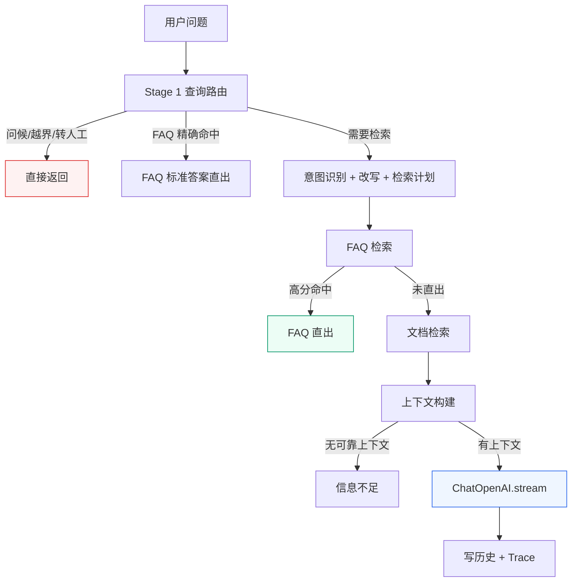

所以本项目选择显式编排，而不是高层 Chain：

```python
route = decide_route(context)
if route.answer:
    return direct_answer

prepared = prepare_retrieval(context)
faq_result = search_faq(context, prepared)
doc_result = search_doc(context, prepared)
answer_prepared = prepare_answer(context, prepared, faq_result, doc_result)

for chunk in stream_llm_answer(system_prompt, user_prompt):
    yield token_event(chunk)
```

可以这样总结：

> LCEL 很适合教“组件怎么串起来”，但企业 RAG 主链路有大量分支、阈值、提前退出和诊断信息，所以本项目不用一条 LCEL 链包到底。

---

## 第六部分：自研与生态的分工

### 6.1 交给 LangChain 的部分

| 能力 | 原因 |
| --- | --- |
| LLM 客户端 | 多厂商 OpenAI-compatible 统一接口 |
| Message 类型 | 对话历史结构稳定 |
| 结构化输出 | Pydantic 约束，减少自由文本解析 |
| SQLChatMessageHistory | 省掉历史消息 CRUD |
| Document / Loader | 文件解析后统一结构 |
| Text Splitter | 成熟切分策略，减少手写边界问题 |
| VectorStore | 统一向量库写入和检索入口 |

### 6.2 项目自己实现的部分

| 能力 | 为什么自己做 |
| --- | --- |
| 查询路由 | 要优先处理问候、转人工、越界、FAQ 精确命中 |
| 意图决策网关 | 高频确定场景由规则处理，检索类长尾由 BERT 模型增强，避免所有请求都调用 LLM |
| 检索计划 | 不同意图、风险类别、source 需要不同参数 |
| FAQ 直出 | 标准答案命中后不需要 LLM 生成 |
| 上下文筛选 | 要做分数阈值、重排、来源整理 |
| Prompt Profile | 不同业务类别要有不同口径 |
| 引用补强 | 企业 RAG 必须给出可追溯来源 |
| Trace 和诊断 | 调试、验收和生产排障都需要可解释过程 |

这就是本项目的工程取舍：**底层组件用生态，业务编排自己掌控**。

---

## 第七部分：常见误区

### 7.1 误区一：用了 LangChain 就应该用 RetrievalQA

不对。`RetrievalQA`适合快速 demo，但企业级 RAG 需要：

- FAQ 标准答案直出
- 意图识别
- 追问改写
- 场景级 source 过滤
- 知识库版本隔离
- 风险 Prompt Profile
- 引用来源补强
- Trace 和诊断面板

这些都很难塞进一个黑盒 Chain 里。

### 7.2 误区二：LCEL 越多越工程化

LCEL 适合表达线性链路，但不是所有流程都应该写成管道。复杂业务分支用显式函数更清楚，也更容易调试。

### 7.3 误区三：SemanticChunker 一定比 RecursiveCharacterTextSplitter 更好

不一定。企业 RAG 里的切分要可控、稳定、便宜、可复现。`RecursiveCharacterTextSplitter`更适合作为默认方案；`SemanticChunker`可以作为特殊文档的增强策略，而不是主链路默认切分器。

### 7.4 误区四：VectorStore 就是 Milvus

不是。VectorStore 是 LangChain 的抽象，Milvus 是具体后端。本项目选择 Milvus，是因为需要服务端 BM25、混合检索、多集合、多版本和企业级部署能力。

---

<a id="doc-04-5-vibe-coding-rag-practice-greenfield-md"></a>
# 04.5 vibe coding rag practice greenfield

> 来源：`src/content/blog/04-5-vibe-coding-rag-practice-greenfield.md`
> 类型：博客文章
> description：你截图中的提示词没有错，但它适合的是：
> pubDate：2026-09-13
> tags：KnowForge、RAG、工程实践
> draft：否
> featured：否

你截图中的提示词没有错，但它适合的是：

> **在已有项目基础上，让 Codex 阅读、修改和完善 Mini RAG。**

它依赖当前目录已经存在的代码、目录结构和实现方式，所以不适合“从空目录生成完整项目”。

如果让开发人员从 0 到 1 使用 Codex 完成一个完整 RAG 项目，提示词需要从“修改任务”升级为“项目合同”。核心变化是：

```text
先定义项目目标和边界
→ 让 Codex 设计架构
→ 固化项目契约
→ 创建项目骨架
→ 分阶段开发
→ 每阶段测试和提交
→ 最后进行端到端验收
```

## 一、从零生成完整项目，不能只写一条提示词

不建议直接发送：

```text
请帮我从零生成一个完整企业级 RAG 项目。
```

因为“完整项目”对 Codex 来说可能意味着：

- 只生成几个 Python 文件；
- 使用假的向量检索；
- 用内存数据代替数据库；
- 不处理 Docker；
- 不处理模型加载；
- 没有测试；
- 没有版本管理；
- 接口可以启动，但业务流程不能运行。

因此，应该使用：

```text
一份总控提示词
+
多轮分阶段提示词
+
每阶段验收标准
```

总控提示词负责约束项目方向，分阶段提示词负责推动代码实现。

## 二、完整项目的总控提示词

开发人员可以在一个全新的目录中打开 Codex，例如：

```bash
mkdir D:\workspace\knowforge-rag-greenfield
cd D:\workspace\knowforge-rag-greenfield
git init
```

然后在 Codex 中发送下面的总控提示词：

```text
当前工作区是：

D:\workspace\knowforge-rag-greenfield

这是一个从零开始的新项目，当前目录中没有可复用的业务代码。
不要假设存在任何已有模块，也不要从其他项目复制代码。

我要从零实现一个可以 Docker 部署的企业级 RAG 知识问答系统。

一、业务目标

用户输入一个业务问题，系统能够：

1. 判断问题属于哪一类业务；
2. 判断问题是否需要检索；
3. 对需要检索的问题执行 FAQ 和业务文档检索；
4. 使用 Dense + Sparse 混合检索；
5. 使用 Reranker 对候选结果进行精排；
6. 使用 LLM 根据检索证据生成答案；
7. 返回答案、来源、检索信息和阶段耗时；
8. 对问候、越界问题和高置信 FAQ 进行快速处理；
9. 支持知识库版本、数据隔离、质量检查和回归评测；
10. 支持 Docker Compose 部署。

二、技术约束

1. Python 3.12；
2. FastAPI 作为 Web 框架；
3. Milvus 2.5+ 作为向量数据库；
4. Dense 向量使用本地 BGE-M3；
5. Dense 索引使用 HNSW；
6. Sparse 使用 Milvus 服务端 BM25；
7. Sparse 字段使用 AUTOINDEX + BM25；
8. 使用 Weighted Hybrid Search 融合 Dense 和 Sparse；
9. 使用本地 BGE Reranker CrossEncoder 精排；
10. MySQL 保存会话、反馈、知识库版本和评测记录；
11. Redis 只用于 query embedding 和检索候选缓存；
12. 不缓存最终 LLM 答案；
13. 不使用 Agent；
14. 不引入 GraphRAG；
15. 使用 WebSocket 支持流式回答；
16. 使用 Docker Compose 启动 API、MySQL、Redis、etcd、MinIO 和 Milvus；
17. 本地模型通过 volume 挂载，不在镜像构建阶段下载；
18. API Key 只能从环境变量读取。

三、在线路由

在线请求只能进入以下三种路由之一：

1. direct_answer
   用于问候、越界转人工和其他无需检索的确定性回答。

2. faq_exact
   用于高置信 FAQ 命中，直接返回 FAQ 答案和来源。

3. retrieval
   用于普通知识问题，进入完整的检索、精排、上下文构建和 LLM 生成流程。

四、意图识别要求

意图识别使用以下顺序：

1. 读取对话历史；
2. 生成规则候选；
3. 对规则无法确定的问题使用意图模型校验；
4. 通过统一网关决定最终意图；
5. 根据最终意图选择 direct_answer、faq_exact 或 retrieval；
6. 记录 intent、source、score、reason 和 requires_rewrite。

五、知识库要求

支持以下知识库能力：

1. FAQ CSV 导入；
2. Markdown、TXT、PDF、DOCX、PPTX、CSV、XLSX 文档导入；
3. 文档切分；
4. FAQ 和文档分别写入 Milvus Collection；
5. 每条数据包含 source、tenant_id、dataset_id、visibility、allowed_roles 和 kb_version；
6. 知识库版本状态包括 STAGED、ACTIVE 和 ARCHIVED；
7. 只有通过质量门禁的版本才能激活；
8. 支持重新入库和失败回滚；
9. 支持文档来源和版本查询。

六、交付物要求

最终项目必须包含：

1. 应用代码；
2. Dockerfile；
3. docker-compose.yml；
4. requirements.txt；
5. .env.example；
6. 数据库初始化脚本；
7. Milvus Collection 初始化和入库脚本；
8. FAQ 和文档样例数据；
9. API 接口；
10. WebSocket 流式接口；
11. 单元测试；
12. 接口测试；
13. Smoke Test；
14. README；
15. 故障排查说明；
16. 项目架构说明；
17. 在线问答流程图；
18. 离线入库流程图；
19. 版本发布和回滚说明。

七、工作规则

1. 第一轮只分析和规划，不修改文件；
2. 后续每一轮只完成一个阶段；
3. 每次修改前先查看当前目录和 git diff；
4. 不要一次性重写整个项目；
5. 不要修改与当前阶段无关的文件；
6. 每个阶段必须有测试或可执行验收命令；
7. 每轮完成后报告修改文件、命令、结果和未完成内容；
8. 测试失败时先分析根因，再进行最小修改；
9. 不要用 mock 逻辑冒充真实 Milvus、Redis、MySQL 或模型能力；
10. 如果真实服务无法运行，必须明确区分“纯逻辑测试”和“真实集成测试”。

本轮只输出：

1. 项目总体架构；
2. 模块划分；
3. 数据库表设计；
4. Milvus Collection 设计；
5. 在线问答调用链；
6. 离线入库调用链；
7. 分阶段实施计划；
8. 每阶段验收标准；
9. 风险清单。

暂时不要创建或修改任何文件。
```

这条提示词的作用不是让 Codex 立刻写代码，而是先让它形成一份项目设计稿。

## 三、第一阶段：固化项目设计

Codex 输出方案后，继续发送：

```text
请根据刚才的方案，生成以下设计文件：

1. PROJECT_SPEC.md
2. ARCHITECTURE.md
3. API_CONTRACT.md
4. DATA_MODEL.md
5. IMPLEMENTATION_PLAN.md
6. ACCEPTANCE_CHECKLIST.md

要求：

- 明确三种在线 route；
- 明确 FAQ、Document 两类 Collection；
- 明确 text、dense、sparse 字段；
- 明确 HNSW、BM25 和 Reranker 的位置；
- 明确 MySQL、Redis、Milvus 的职责；
- 明确知识库版本状态和激活条件；
- 明确每个 API 的输入、输出和错误响应；
- 明确每个阶段将修改哪些文件；
- 不创建业务代码；
- 不生成无法验证的架构描述。

完成后停止，等待下一条指令。
```

讲课时要告诉学生：

> “从零项目最容易失败的地方，是 Codex 一开始就写代码，结果写到一半才发现数据结构、接口和模块边界没有确定。所以先让它把项目契约写出来。”

## 四、第二阶段：创建项目骨架

```bash
请只实现项目骨架，不实现具体业务逻辑。

根据 PROJECT_SPEC.md 创建：

1. app.py；
2. qa_core/config；
3. qa_core/schemas；
4. qa_core/api；
5. qa_core/application；
6. qa_core/pipeline；
7. qa_core/intent；
8. qa_core/retrieval；
9. qa_core/indexing；
10. qa_core/storage；
11. qa_core/memory；
12. qa_core/quality；
13. scripts；
14. tests；
15. static；
16. scenarios。

要求：

- 所有包包含必要的 __init__.py；
- 配置统一从 .env 读取；
- 创建 GET /health；
- 暂时不连接真实数据库；
- 暂时不加载模型；
- 为配置和健康检查编写纯逻辑测试；
- 更新 README 的本地运行命令；
- 不实现检索和 LLM。

完成后执行：

python -m pytest tests -q

报告修改文件、测试结果和未完成内容。
```

验收：

```bash
git diff
python -m pytest tests -q
git add .
git commit -m "创建项目骨架和配置"
```

## 五、第三阶段：接入基础设施

```bash
请只实现 Docker Compose 和基础设施连接。

要求：

1. 启动 MySQL；
2. 启动 Redis；
3. 启动 etcd；
4. 启动 MinIO；
5. 启动 Milvus 2.5+；
6. 启动 API；
7. API 通过 Docker 服务名访问依赖；
8. 模型通过 volume 挂载；
9. API Key 使用环境变量；
10. 为 MySQL、Redis、Milvus 增加连接检查；
11. /health 返回各组件状态；
12. 不实现问答逻辑；
13. 不实现 LLM 调用。

必须验证：

docker compose config
docker compose up -d
docker compose ps
curl http://127.0.0.1:8010/health
```

这里要强调：

> “`docker compose config`只能验证配置文件格式正确，不能证明服务可用。必须继续检查容器状态和健康接口。”

## 六、第四阶段：实现离线入库

```text
请只实现离线知识库构建流程。

调用顺序必须是：

读取资料
→ 加载为 Document
→ FAQ 转换
→ 文档切分
→ 写入 metadata
→ 创建 Milvus Collection
→ BGE-M3 生成 Dense
→ Milvus BM25 生成 Sparse
→ 写入 FAQ / Document Collection
→ 创建 STAGED 知识库版本
→ 执行质量检查
→ 质量通过后激活版本

要求：

- FAQ 和文档分别入库；
- Collection 包含 text、dense、sparse；
- Dense 使用 HNSW；
- Sparse 使用 AUTOINDEX + BM25；
- 保留 source 和 kb_version；
- 记录 tenant、dataset、visibility 和 allowed_roles；
- 质量失败时禁止激活；
- 添加入库元数据测试；
- 添加索引参数测试；
- 添加版本状态测试。

本轮不要实现在线问答。
```

入库阶段验收：

```bash
python -m pytest tests -q
docker compose exec api python scripts/rebuild_kb.py
```

## 七、第五阶段：实现检索和 Reranker

```text
请只实现检索层，不实现意图识别和 LLM 生成。

必须实现：

1. Dense 检索；
2. BM25 Sparse 检索；
3. Weighted Hybrid Search；
4. 版本和权限过滤；
5. FAQ 与 Document 检索；
6. 多查询变体支持；
7. 结果去重；
8. BGE Reranker 精排；
9. 检索耗时统计；
10. 空候选保护。

严格顺序：

query
→ Dense + BM25 召回
→ Weighted Hybrid Search
→ 去重
→ CrossEncoder Reranker
→ top_n

要求：

- Reranker 不参与入库；
- Reranker 不替代 Milvus；
- 保留原始来源和各阶段分数；
- 不缓存最终答案；
- 为过滤、融合、去重和精排添加测试。
```

此时让学生观察：

```text
Dense 分数
BM25 分数
Hybrid 分数
Reranker 分数
```

并说明这些分数不是同一套尺度，不能直接混在一起比较。

## 八、第六阶段：实现意图和路由

```text
请只实现意图识别和三路路由，不连接 LLM。

路由必须只有：

- direct_answer；
- faq_exact；
- retrieval。

实现顺序：

读取 history
→ 规则识别
→ 规则候选
→ 模型校验
→ 网关仲裁
→ 确定最终 route
→ 生成 RetrievalPlan

要求：

- 问候进入 direct_answer；
- 越界问题进入 direct_answer；
- 高置信 FAQ 进入 faq_exact；
- 普通知识问题进入 retrieval；
- 规则结果包含 intent、score、reason 和 source；
- 模型只作为规则无法确定时的补充；
- 添加 route 决策测试；
- 不在本轮实现完整问答。
```

这一步非常关键，因为从零项目必须先固定“谁决定是否检索”，否则后面所有检索和生成逻辑都会互相调用。

## 九、第七阶段：实现完整在线问答链路

```text
请将意图、检索、Reranker、上下文和 LLM 串成完整在线问答流程。

调用顺序必须是：

请求进入
→ direct route 判断
→ active 版本读取
→ 查询改写
→ RetrievalPlan
→ FAQ 检索
→ FAQ 高分直出判断
→ 文档检索
→ FAQ + Document 合并
→ Reranker 精排
→ 上下文构建
→ LLM 生成
→ 引用补强
→ 生成后核验
→ 返回答案、来源和诊断信息

要求：

- LLM 只能看到最终上下文；
- 答案必须返回 sources；
- 没有证据时明确说明资料不足；
- 支持 WebSocket 流式事件；
- 支持 HTTP 诊断接口；
- 记录 route、intent、kb_version、retrieval、timings；
- 不缓存最终 LLM 答案；
- 为成功、空问题、无资料、LLM 失败和权限失败添加测试。
```

## 十、第八阶段：补齐治理、评测和观测

```text
请只实现企业级治理能力：

1. 知识库版本激活和回滚；
2. tenant、dataset、visibility、role 数据隔离；
3. 入库质量报告；
4. 质量门禁；
5. 回归评测；
6. Bad Case 记录；
7. Trace；
8. 阶段耗时；
9. 反馈记录；
10. 缓存版本失效。

要求：

- 质量门禁不通过时禁止激活；
- active 版本切换必须可审计；
- 缓存 Key 必须包含场景、版本和权限边界；
- 不复用最终答案缓存 Key；
- Trace 能定位一次请求经过了哪些阶段；
- 所有治理能力都要有纯逻辑测试和至少一个集成验收命令。
```

## 十一、第九阶段：最终验收和交付

```text
请对整个项目执行发布前验收，不要修改代码。

检查以下内容：

1. requirements.txt 能否在全新环境安装；
2. docker compose config 是否通过；
3. Docker 服务能否正常启动；
4. /health 是否返回正确状态；
5. FAQ 和文档能否入库；
6. Dense 和 Sparse 字段是否存在；
7. Dense 索引是否为 HNSW；
8. Sparse 是否使用 BM25；
9. 三种 route 是否都能触发；
10. Reranker 是否在召回之后执行；
11. 答案是否包含来源；
12. 无资料时是否拒绝编造；
13. 知识库版本能否激活和回滚；
14. 权限过滤是否生效；
15. Redis 缓存是否带版本边界；
16. WebSocket 是否能正常返回 end 事件；
17. 单元测试、接口测试和 Smoke Test 是否通过；
18. README 是否可以让新开发人员独立部署。

输出：

- 通过项；
- 失败项；
- 风险项；
- 需要人工验证的项目；
- 最终启动命令；
- 最终入库命令；
- 最终提问命令。

本轮不修改文件。
```

## 十二、这类提示词最重要的五个设计原则

### 1. 先写“业务行为”，再写“技术组件”

不要只写：

```text
使用 Milvus、Redis、MySQL、BGE-M3。
```

还要写：

```text
什么问题进入什么路由；
什么时候检索；
什么时候 FAQ 直出；
什么时候调用 LLM；
没有证据时如何回答；
知识库版本如何生效。
```

### 2. 每一轮必须限制修改范围

每条提示词都要有：

```text
本轮只实现什么；
本轮不实现什么；
允许修改哪些目录；
完成后执行什么测试。
```

### 3. 先让 Codex 设计，再让 Codex 写代码

推荐顺序：

```text
PROJECT_SPEC.md
→ ARCHITECTURE.md
→ API_CONTRACT.md
→ DATA_MODEL.md
→ 代码骨架
→ 模块实现
```

### 4. 每阶段都要形成证据

每一阶段至少留下：

```bash
git diff
测试命令
测试结果
运行截图或接口返回
一次 git commit
```

### 5. “完整项目”必须包含可交付物

代码能运行不等于项目完成。至少还要有：

```text
环境变量模板
依赖文件
Docker 配置
数据库初始化
入库脚本
测试
健康检查
README
故障排查
发布和回滚说明
```

## 最后怎么讲给学生

可以用下面这段话收束：

> “我们现在使用的提示词，是在一个已有完整项目的基础上生成 Mini RAG，所以它会先让 Codex 阅读当前代码。真正从零开发时，不能直接让 Codex 开始写业务代码，而要先让它理解业务目标、确认架构、定义接口和数据结构。之后每次只实现一个阶段，每次都运行测试、检查 diff、提交代码。Vibe Coding 不是一次性生成，而是让 Codex 参与整个项目生命周期。”

因此，当前的`vibe-coding-lab.md`适合继续保留为：

```text
已有项目基础上的 Mini RAG 实践提示词
```

如果要支持“从 0 到 1 创建完整项目”，建议另外增加一份：

```text
mini-rag/prompts/codex-greenfield-enterprise-rag.md
```

两者不要混在同一份提示词中：

| 提示词 | 使用场景 |
| --- | --- |
| `vibe-coding-lab.md` | 基于现有 Mini RAG 或已有项目进行分阶段实现 |
| `codex-greenfield-enterprise-rag.md` | 在空目录中从需求、架构、骨架到完整项目逐步生成 |

这样学生能够清楚区分两种能力：

```text
基于已有代码使用 Codex 改造项目
从空目录使用 Codex 构建项目
```

---

<a id="doc-04-5-vibe-coding-rag-practice-md"></a>
# 第二阶段实践：Vibe Coding 实践

> 来源：`src/content/blog/04-5-vibe-coding-rag-practice.md`
> 类型：博客文章
> description：上一讲 ： Milvus 索引机制与基本操作
> pubDate：2026-09-13
> tags：KnowForge、RAG、工程实践
> draft：否
> featured：否

## 用 Codex 完成一个简易混合检索 RAG

**上一讲**：[Milvus 索引机制与基本操作](/blog/04-milvus-index-and-operations)

**下一讲**：[意图分类](/blog/05-intent-classification)

本节放在第 04 讲之后学习。前面已经学习了 Milvus、HNSW、Dense 向量、Sparse 向量和混合检索，本节把这些知识放进一个可以运行的 RAG 项目中，再使用 Vibe Coding 的方式完成代码、验证和修正。

> 本节统一使用 Codex 演示。下面的提示词可以直接复制到 Codex 对话中执行；代码修改、命令运行和结果检查都在同一个项目工作区完成。

这里的重点不是让 Codex 一次生成所有代码，而是验证实践一套可以重复使用的开发过程：

```text
明确需求
→ 让 Codex 先分析和规划
→ 分阶段实现
→ 运行和查看结果
→ 提供完整报错上下文
→ 让 Codex 做最小修改
→ 测试和复盘
```

## 本节完成什么

完成本节后，你应该能够：

- 说清楚一个简易 RAG 的入库链路和在线问答链路；
- 让 Codex 根据结构化需求生成项目方案；
- 使用 Milvus 保存 Dense 和 Sparse 两类检索字段；
- 使用 Milvus 2.5+ 完成 Dense + BM25 混合检索；
- 理解为什么混合检索之后还需要 Reranker；
- 使用 BGE Reranker 对候选文档进行二次排序；
- 让 LLM 根据排序后的上下文生成答案和来源；
- 使用测试、接口响应、检索来源和日志判断代码是否正确；
- 遇到错误时，向 Codex 提供足够信息并完成最小修改。

本节完成的不是一个企业级平台，而是一条真实、可运行、可解释的核心 RAG 链路。

## 一、项目边界

### 1.1 本节主链路

本节只关注下面这条链路：

```text
离线入库：
FAQ / 业务文档
    → 文件加载
    → 文本切分
    → BGE-M3 生成 Dense 向量
    → Milvus 内置 BM25 生成 Sparse 向量
    → 写入 Milvus

在线问答：
用户问题
    → Dense + BM25 混合检索
    → 合并候选结果
    → BGE Reranker 精排
    → 选择上下文
    → LLM 生成答案
    → 返回答案和来源
```

### 1.2 本节会用到的组件

| 组件 | 本节中的职责 |
| --- | --- |
| FastAPI | 提供`GET /`、`GET /health`和`POST /ask` |
| Milvus 2.5+ | 保存文档并执行向量检索 |
| HNSW | 为 Dense 向量提供近似近邻索引 |
| BM25 | 根据关键词和词频执行 Sparse 检索 |
| BGE-M3 | 将问题和文档转换为 Dense 向量 |
| BGE Reranker Large | 对候选文档进行二次相关性排序 |
| OpenAI 兼容 LLM | 根据检索上下文生成答案 |
| MySQL | 保存本案例的 active 知识库版本 |
| Docker Compose | 启动基础设施和 API |

### 1.3 本节暂时不展开的内容

下面的能力属于后续企业级章节，本节只保留运行所需的最小接口，不展开其内部设计：

- 场景感知的意图识别、source 路由和网关仲裁；
- Redis 缓存；
- 多租户权限治理；
- 知识库质量门禁和回滚；
- LangSmith Trace；
- WebSocket 流式输出；
- Agent、GraphRAG 和复杂任务编排。

现有`mini-rag/`代码为了便于后续对照，保留了 active 版本、FAQ 直出、查询改写和查询变体等辅助能力。本节的主线仍然只追踪“入库、混合检索、Reranker、生成”四个核心环节。

## 二、先看懂最终效果

### 2.1 入库完成后的结果

执行入库脚本后，系统会得到两类 Milvus Collection：

```text
FAQ Collection
  每条记录包含问题、答案、source 和版本信息

Document Collection
  每条记录是文档切分后的一个 chunk
```

每条记录的检索字段可以理解为：

```text
text    原始文本
dense   BGE-M3 生成的 Dense 向量
sparse  Milvus BM25 生成的 Sparse 向量
```

Dense 和 Sparse 不是二选一：

- Dense 擅长理解“意思相近但用词不同”的问题；
- BM25 擅长命中明确的关键词、编号、制度名称和专有名词；
- 混合检索把两路结果合并，减少只依赖一种检索方式带来的漏召回。

### 2.2 在线提问后的结果

在`mini-rag/static/index.html`页面提问后，可以看到：

- 最终答案；
- 引用来源；
- 本次命中的路由；
- 改写后的问题；
- 查询变体；
- FAQ 和文档的命中数量；
- Reranker 是否运行；
- 每个阶段的耗时。

这些字段帮助你判断：问题有没有进入检索、检索命中了什么、Reranker 是否运行，以及慢在哪个阶段。

## 三、Vibe Coding 的工作方法

### 3.1 你和 Codex 分别负责什么

Vibe Coding 不是只写一条提示词，然后不再看代码。一个可控的分工是：

| 工作 | 主要责任 |
| --- | --- |
| 描述业务目标 | 你 |
| 确认技术边界 | 你和 Codex 一起确认 |
| 生成代码初稿 | Codex |
| 检查文件是否改对 | 你 |
| 运行测试和服务 | 你 |
| 根据报错提出修改方案 | Codex |
| 判断修改是否真正解决问题 | 你 |

Codex 可以提高编码速度，但不能替你判断结果是否正确。本节每完成一个阶段，都要留下三种证据：

```text
修改了什么文件
执行了什么命令
命令和测试返回了什么结果
```

### 3.2 提示词必须包含什么

一条有效的 Vibe Coding 请求至少包含：

```text
当前目标：这一轮只实现什么
项目位置：在哪个目录工作
技术约束：必须使用什么，不能引入什么
输入输出：函数或接口接收什么、返回什么
验收方式：如何判断本轮完成
修改范围：允许改哪些文件
```

不要只说“把 RAG 做出来”。应该明确说：

> 这一轮只实现 Milvus Collection 初始化。需要创建`text`、`dense`和`sparse`字段，Dense 使用 HNSW，Sparse 使用 Milvus 2.5+ 的 BM25 内置函数。先阅读当前文件，再列出修改计划，暂时不要修改代码。完成后用一个不连接真实服务的测试验证索引参数。

### 3.3 每一轮只推进一个阶段

```text
阶段 0：分析已有代码和目标
阶段 1：确认项目骨架和配置
阶段 2：完成文档加载、切分和入库
阶段 3：完成 Dense + BM25 混合检索
阶段 4：加入 BGE Reranker
阶段 5：连接 LLM 和问答接口
阶段 6：测试、调试和 Docker 验收
```

每个阶段结束后再进入下一阶段。这样出现问题时，可以知道问题是在哪一轮引入的。

## 四、实践一：让 Codex 先分析项目

打开一个新的工作目录，或者复制现有`mini-rag/`作为验证实践目录。在 Codex 中打开这个工作区，第一轮只让它阅读需求和现有代码，不要求它立即生成大量代码。

```text
请先阅读当前项目，不要修改任何文件。

我需要完成一个简易但真实可运行的 RAG：

1. 使用 FastAPI 提供 /、/health、/ask；
2. 使用 Milvus 2.5+ 保存文本、Dense 向量和 Sparse 向量；
3. Dense 使用本地 BGE-M3；
4. Sparse 使用 Milvus 服务端 BM25 内置函数；
5. Dense 索引使用 HNSW，Sparse 使用 BM25/AUTOINDEX；
6. 使用 Weighted Hybrid Search 融合两路召回结果；
7. 使用本地 BGE Reranker 对候选结果精排；
8. 使用 OpenAI 兼容接口调用 LLM 生成答案；
9. 返回 answer、sources、route、retrieval 等诊断字段；
10. 使用 Docker Compose 启动 MySQL、etcd、MinIO、Milvus 和 API。

请输出：
- 当前项目中已经存在的相关文件；
- 每个模块负责什么；
- 一次入库的执行顺序；
- 一次在线问答的执行顺序；
- 需要新增或修改的文件；
- 分阶段实施计划；
- 每个阶段的测试和验收方法。

暂时不要修改文件，也不要输出大段代码。
```

### 检查 Codex 的方案

重点检查：

- 入库和在线问答是否分开；
- Dense 和 Sparse 是否同时存在；
- 是否先混合召回，再 Reranker 精排；
- Reranker 是否被错误地放在入库阶段；
- 是否把 Reranker 当成向量索引；
- 是否明确了 LLM 只使用最终上下文；
- 是否给出了可执行的测试方法。

如果 Codex 把所有逻辑都塞进一个文件，先要求它重新拆分方案，不要马上接受代码。

## 五、实践二：按阶段生成代码

### 5.1 阶段 1：项目骨架和配置

```text
请根据刚才确认的方案，只完成项目骨架和配置。

要求：
- 创建 app.py、qa_core/、scripts/、static/、tests/；
- 配置从 .env 读取，不把 API Key 写死在代码中；
- 先提供 GET /health；
- 为配置解析和健康检查添加纯逻辑测试；
- 不实现混合检索和 LLM 生成；
- 不修改与本阶段无关的文件。

完成后只报告：修改文件、启动命令、测试命令、测试结果和未完成内容。
```

本阶段的验收重点：

```bash
python -m pytest tests -q
python -m uvicorn app:app --host 127.0.0.1 --port 8010
```

浏览器访问`http://127.0.0.1:8010/health`，确认返回 JSON，而不是只确认进程没有退出。

### 5.2 阶段 2：文档加载、切分和入库

```text
请只实现离线入库流程。

输入：scenarios/cross_border_risk/faq.csv 和 data/ 下的业务文档。

要求：
- FAQ 转换为包含 question、answer、source 的 Document；
- 支持 Markdown、TXT、PDF、DOCX、PPTX、CSV、XLSX；
- 文档使用 RecursiveCharacterTextSplitter 切分；
- 写入 FAQ Collection 和 Document Collection；
- Milvus 记录必须包含 text、dense、sparse；
- Dense 使用本地 BGE-M3；
- Sparse 使用 Milvus 2.5+ BM25BuiltInFunction；
- Dense 索引使用 HNSW，Sparse 使用 AUTOINDEX + BM25；
- 写入 MySQL 的知识库版本记录，并将版本设为 active；
- 添加不依赖真实服务的入库元数据和索引参数测试。

先阅读现有代码并列出会修改的文件，再执行修改。
```

本阶段要理解的顺序是：

```text
文件
→ Document
→ chunk
→ dense/sparse
→ Milvus Collection
→ active 版本
```

### 5.3 阶段 3：Dense + BM25 混合检索

```text
请在现有入库代码基础上，只实现在线混合检索。

要求：
- 接收一个 query 和 top_k；
- 同时执行 Dense 检索和 BM25 检索；
- 使用 Weighted Hybrid Search 合并结果；
- 结果必须保留原文和 source；
- 对重复 chunk 去重；
- 返回文档、分数和检索耗时；
- 不加入 Reranker，不加入 LLM，不修改 API 页面。

请说明：
1. Dense 和 Sparse 两路分别解决什么问题；
2. Weighted 融合发生在哪一步；
3. 为什么不能直接比较两路未经处理的原始分数；
4. 如何测试检索函数。
```

可以用下面的问题观察检索结果：

```text
跨境贸易资料审核需要完成哪些流程？
报关系统连接不上怎么处理？
预算超过部门额度时需要谁审批？
```

除了看最终答案，还要展开返回的`sources`，确认来源内容确实与问题相关。

### 5.4 阶段 4：加入 BGE Reranker

```text
请在混合检索之后加入 BGE Reranker，不要改动 Milvus 的索引和召回逻辑。

执行顺序必须是：
混合检索召回候选结果
→ 构造 (query, document) 对
→ CrossEncoder 批量打分
→ 按 Reranker 分数降序排列
→ 取最终 top_n

要求：
- 使用本地 BGE Reranker 模型；
- 模型只在在线检索阶段加载，不参与入库；
- 保留原文、source 和 Reranker 分数；
- 候选为空时返回空结果，不调用模型；
- 添加一个纯函数测试，验证排序和 top_n 截断；
- 记录 Reranker 阶段耗时。

完成后解释：
- Embedding 和 Reranker 的输入有什么区别；
- 为什么 Reranker 不能替代 Milvus 召回；
- 为什么候选数量不能无限增大。
```

### 5.5 阶段 5：连接 LLM 和问答接口

```text
请把已经完成的检索和 Reranker 接到问答接口。

要求：
- POST /ask 接收 query、history 和 source_filter；
- 先执行混合检索，再执行 Reranker；
- 只把最终排序后的上下文交给 LLM；
- Prompt 要求答案只能依据上下文；
- 没有相关资料时明确说明资料不足；
- 返回 answer、sources、route、retrieval、timings；
- API Key 只从环境变量读取；
- 不缓存最终 LLM 答案。
```

本阶段的链路必须保持为：

```text
POST /ask
→ pipeline.ask()
→ retrieval.search_many()
→ rerank()
→ select_context_docs()
→ generate_answer()
→ 返回 answer + sources
```

### 5.6 阶段 6：Docker 和说明文件

```text
请只补齐 Docker Compose、Dockerfile、README 和运行测试。

要求：
- Docker Compose 启动 MySQL、etcd、MinIO、Milvus 和 API；
- API 通过服务名访问 Milvus 和 MySQL；
- 本地模型通过 volume 挂载到 /app/models；
- 不把 API Key 写进 Dockerfile 或 compose 文件；
- README 必须包含启动、入库、提问、测试和常见报错处理；
- 执行 docker compose config 验证配置；
- 不新增 Redis、Agent 或管理后台。
```

## 六、实践三：运行完整项目

### 6.1 准备模型和环境变量

当前仓库的参考代码位于：

```text
D:\workspace\knowforge-rag-platform\mini-rag
```

需要准备以下本地模型目录：

```text
models/bge-m3
models/bge-reranker-large
```

复制配置文件：

```powershell
cd D:\workspace\knowforge-rag-platform\mini-rag
Copy-Item .env.example .env
```

确认`.env`至少包含：

```text
DASHSCOPE_API_KEY=你的Key
EMBEDDING_MODEL_PATH=../models/bge-m3
RERANKER_MODEL_PATH=../models/bge-reranker-large
MILVUS_URI=http://127.0.0.1:19540
MYSQL_HOST=127.0.0.1
MYSQL_PORT=3307
```

### 6.2 启动基础设施

```bash
docker compose up -d mysql etcd minio milvus
docker compose ps
```

确认 MySQL、etcd、MinIO 和 Milvus 已经运行后，再构建和启动 API：

```bash
docker compose up -d --build api
docker compose ps
```

### 6.3 初始化知识库

```bash
docker compose exec api python scripts/rebuild.py --reset-collections --description "vibe coding hybrid rag"
```

这一步会：

```text
读取 FAQ 和业务文档
→ 文档切分
→ 创建或重建 Milvus Collection
→ 生成 Dense 向量
→ 由 Milvus 生成 Sparse BM25 数据
→ 写入 FAQ 和文档集合
→ 创建并激活 MySQL 知识库版本
```

### 6.4 发起问题

浏览器打开：

```text
http://127.0.0.1:8010/
```

也可以使用命令行：

```bash
docker compose exec api python scripts/ask.py "跨境贸易资料审核需要完成哪些流程？"
docker compose exec api python scripts/ask.py "报关系统连接不上怎么处理？" --source-filter documents
```

检查返回结果时，按下面顺序看：

1. `answer`是否回答了当前问题；
2. `sources`是否包含相关文档；
3. `retrieval.rerank`是否为开启状态；
4. `retrieval.faq_hits`和`retrieval.doc_hits`是否有命中；
5. `retrieval.timings`中哪一个阶段耗时最高；
6. `retrieval.faq_rerank_ms`/`retrieval.doc_rerank_ms`是否能反映 Reranker 精排耗时。

## 七、通过实验理解 Reranker

### 7.1 不要把三种分数混在一起

| 分数 | 来源 | 用途 |
| --- | --- | --- |
| Dense 距离或相似度 | BGE-M3 + Milvus | 语义召回 |
| BM25 分数 | Milvus 服务端 | 关键词召回 |
| Reranker 分数 | CrossEncoder | 候选结果精排 |

这些分数的计算方式不同，不能简单地说“谁的分数最高谁就一定更相关”。混合检索阶段由 ranker 负责融合，Reranker 阶段再使用 CrossEncoder 对 query 和 document 联合判断。

### 7.2 用一句话理解 Reranker

可以把整个过程想成两次筛选：

```text
Milvus：先从大量资料中快速找出可能相关的候选

Reranker：逐条阅读问题和候选内容，重新判断谁最匹配
```

Milvus 负责速度和召回范围，Reranker 负责候选集内的相关性排序。Reranker 不直接扫描整个知识库，所以不能替代向量数据库。

### 7.3 观察参数的作用

当前参考代码中的默认值是：

```text
FAQ_TOP_K=20
DOC_TOP_K=20
RERANK_TOP_N=8
FINAL_CONTEXT_TOP_N=5
```

它们的含义是：

- 每路检索先召回一批候选；
- Reranker 对候选结果重新排序并保留前 8 条；
- 最后送给 LLM 的上下文最多保留 5 条。

这些是体验项目的默认实验参数，不代表所有业务都必须使用这些数值。参数调优要结合评测集和实际耗时，在后续质量评测章节再系统处理。

## 八、使用 Codex 修复报错

### 8.1 报错反馈的正确格式

遇到问题时，不要只把最后一行错误复制给 Codex。使用下面的结构：

```bash
当前目录：D:\workspace\knowforge-rag-platform\mini-rag

执行命令：
docker compose exec api python scripts/rebuild.py --reset-collections

期望结果：
FAQ 和业务文档写入 Milvus，并激活一个知识库版本。

完整报错：
粘贴从 Traceback 开始到最后一行的完整内容

请先判断错误发生在：配置、依赖、Milvus 连接、模型加载还是业务代码。
请先阅读相关文件，再给出根因和最小修改方案。
不要重写整个项目，也不要修改与这个错误无关的文件。
```

### 8.2 常见问题的定位顺序

| 现象 | 先检查什么 |
| --- | --- |
| `ModuleNotFoundError` | 容器内依赖和 requirements.txt |
| 模型目录不存在 | volume 挂载和模型路径 |
| Milvus 连接失败 | `docker compose ps`、URI 和服务健康状态 |
| Collection 结构不匹配 | 索引参数和是否需要重建集合 |
| LLM 调用失败 | API Key、Base URL、网络和模型名 |
| 答案没有依据 | `sources`、上下文选择和 Prompt |
| 结果很慢 | `retrieval.timings`中的检索和 Reranker 耗时 |

### 8.3 修复完成后的验收

```text
查看 git diff
→ 运行纯逻辑测试
→ 重新执行失败命令
→ 查看服务日志
→ 发起一个真实问题
→ 检查 answer 和 sources
```

“程序不再报错”只是第一步，还要确认业务结果正确。

## 九、只追一条代码线

不要第一次阅读就打开整个项目。先沿着下面的调用关系阅读：

### 9.1 入库链路

```text
mini-rag/scripts/rebuild.py
  → mini-rag/qa_core/ingest.py
  → mini-rag/qa_core/loaders.py
  → mini-rag/qa_core/retrieval.py
  → MiniMilvusStore.add_documents()
  → Milvus
```

重点看：

- `load_faq_documents()`如何把 FAQ 转为 Document；
- `load_document_chunks()`如何加载和切分文件；
- `hybrid_index_params()`如何声明 HNSW 和 BM25；
- `MiniMilvusStore.store`如何配置`dense`和`sparse`字段；
- `add_documents()`如何把文档写入 Milvus。

### 9.2 在线问答链路

```text
mini-rag/app.py
  → qa_core/pipeline.py: ask()
  → qa_core/query.py: prepare_query()
  → qa_core/retrieval.py: search_many()
  → qa_core/retrieval.py: rerank()
  → qa_core/pipeline.py: select_context_docs()
  → qa_core/prompts.py: generate_answer()
  → 返回 AnswerResult
```

在线链路中先记住三件事：

1. 混合检索负责召回候选；
2. Reranker 负责候选集内的精排；
3. LLM 只接收最终选出的上下文。

## 十、本节单证审核清单

### 10.1 运行验收

```bash
cd D:\workspace\knowforge-rag-platform\mini-rag
python -m pytest tests -q
docker compose config
docker compose ps
```

### 10.2 功能验收

- 能成功创建 FAQ 和文档 Collection；
- Dense 字段和 Sparse 字段同时存在；
- Dense 索引为 HNSW；
- Sparse 检索使用 BM25；
- 混合检索可以返回候选文档；
- Reranker 会重新排序候选结果；
- LLM 能根据检索上下文生成答案；
- 答案返回来源引用；
- 没有相关资料时不会编造确定答案。

### 10.3 Vibe Coding 验收

你还要能够回答：

- 本轮 Codex 修改了哪些文件；
- 为什么要先做混合召回，再做 Reranker；
- 为什么 Reranker 不放在入库阶段；
- 一次报错发生后，你给了 Codex 哪些上下文；
- 你用什么命令和结果确认修改有效；
- 如果答案不准确，应该先看`sources`还是先改 Prompt。

## 十一、和后续章节的衔接

本节把后续项目的核心检索链路提前跑通，但有意把企业级复杂度留到后面：

| 本节 | 后续章节 |
| --- | --- |
| 单一`cross_border_risk`场景 | 第 05 章完善意图分类、source 路由与场景边界保护 |
| 直接调用`pipeline.ask()` | 第 09、10 讲学习 QAService 和完整 Pipeline |
| Dense + BM25 + Reranker | 第 06、07、08 讲逐项拆解检索计划、改写、变体和混合检索 |
| 简单 active 版本 | 第 13、15、16 讲学习版本管理、入库流程和质量门禁 |
| 基础测试 | 第 16、17 讲学习评测、回归和接口验收 |
| Docker Compose 能运行 | 项目阶段 17学习离线交付、镜像和排障 |

本节的作用是把前面学过的 Milvus 操作变成一条完整的应用链路，也让你提前熟悉后续阅读企业级代码时最重要的方式：先找入口，再跟调用链，最后用运行结果验证理解。

---

<a id="doc-04-milvus-index-and-operations-md"></a>
# 项目阶段 04：Milvus 索引机制与基本操作

> 来源：`src/content/blog/04-milvus-index-and-operations.md`
> 类型：博客文章
> description：上一讲 ： LangChain 生态系统 下一讲 ： 意图分类
> pubDate：2026-09-13
> tags：KnowForge、RAG、工程实践
> draft：否
> featured：否

**上一讲**：[LangChain 生态系统](/blog/03-langchain-ecosystem)**下一讲**：[意图分类](/blog/05-intent-classification)

## 本节目标

- 理解 Milvus 是什么，以及它在企业级 RAG 中承担的检索存储角色
- 能说清向量数据库和普通关系型数据库、搜索引擎、本地向量索引库的边界差异
- 能对比 FAISS、Chroma、pgvector、Elasticsearch/OpenSearch、Qdrant、Weaviate、Milvus 的典型适用场景
- 理解本项目选择 Milvus 的工程原因：混合检索、多集合隔离、元数据过滤、Docker 部署和后续治理能力
- 理解向量索引的本质：用空间和构建时间换查询速度
- 掌握五种主流索引形态（FLAT / IVF\_FLAT / IVF\_SQ8 / IVF\_PQ / HNSW）的工作原理和适用场景
- 能用 PyMilvus 完成 Collection 创建、索引构建、数据插入、搜索的完整流程
- 理解 PyMilvus 原生混合检索和 langchain-milvus 混合检索的差异
- 能根据召回率、延迟和内存压力解释索引选型取舍

> **本节定位**：本节用 PyMilvus 示例说明 Milvus 的创建、插入、索引、搜索和混合检索，再对照本项目的 langchain-milvus 封装。这里先介绍离线构建的前置概览，完整的知识库构建链路（`rebuild_kb_version.py`、FAQ/文档入库、质量门禁、版本激活）放在项目阶段 13系统展开。

---

## 第一部分：Milvus 与向量数据库选型

### 1.1 Milvus 是什么

Milvus 是面向向量相似度检索的数据库。它不是普通文件索引，也不是只放 embedding 的缓存，而是一个能长期保存向量、文本和元数据，并支持高性能 Top-K 检索的独立基础设施。

在 RAG 系统里，用户问题会先被 embedding 模型转换成向量，知识库文档也会提前被转换成向量。Milvus 要解决的是：

```text
给定一个查询向量，在大量知识片段向量中快速找出最相似的 Top-K 候选，
同时还能按业务场景、知识库版本、租户、角色、source 等元数据做过滤。
```

本项目中，Milvus 主要承担四类职责：

| 职责 | 在 RAG 链路中的作用 |
| --- | --- |
| 向量存储 | 保存 FAQ 和文档 chunk 的 dense 向量、sparse 向量、原文和 metadata |
| 相似度检索 | 根据用户问题召回语义相近的 FAQ / 文档候选 |
| 元数据过滤 | 通过`kb_version`、`source`、`tenant_id`、`dataset_id`、`visibility`、`allowed_roles`控制检索范围 |
| 混合检索 | 在同一个 collection 内同时使用 Dense 语义召回和 BM25 Sparse 关键词召回 |

所以，Milvus 在项目里不是“可有可无的存储组件”，而是在线知识问答链路的核心检索引擎。

### 1.2 为什么本项目需要服务化向量数据库

[第 02 讲](/blog/02-rag-fundamentals)已经解释向量数据库在 RAG 中的基本职责。本节只回答项目选型问题：为什么这里需要可独立部署、支持长期运行和治理的向量数据库，而不是本地索引文件。

普通关系型数据库擅长结构化查询，例如按订单号、用户 ID、时间范围查数据。RAG 检索面对的是自然语言相似性问题，核心查询方式不是`where id = ?`，而是：

```text
search(query_vector, top_k=10, filter="kb_version == ... and source == ...")
```

如果不用向量数据库，常见替代方式会遇到边界：

| 方案 | 能做什么 | 边界 |
| --- | --- | --- |
| MySQL / PostgreSQL 普通表 | 存原文、存元数据、做精确过滤 | 不擅长大规模向量 Top-K 相似度检索 |
| 传统全文检索 | 关键词匹配、倒排索引、BM25 | 对同义表达、语义改写和多语言表达不够稳定 |
| 本地向量索引文件 | 快速做单机向量实验 | 缺少服务化、多集合、权限过滤、版本治理和运维能力 |
| 向量数据库 | 向量检索、元数据过滤、服务化部署、集合管理 | 需要额外部署和维护 |

企业级 RAG 不只是“能把向量查出来”，还要求：

- 数据可以按业务场景、版本、租户、角色隔离。
- 检索链路可以长期运行，而不是每次启动重新加载本地索引文件。
- 新旧知识库版本可以共存，active 指针切换后不影响历史版本。
- 检索失败、schema 不匹配、collection 缺失可以被明确发现。
- 后续能接质量评测、Trace、治理页和运维监控。

这些要求决定了本项目需要服务化向量数据库，而不是只用一个本地向量索引库。

### 1.3 可用向量数据库与检索后端对比

向量数据库选型没有绝对最优，只有是否匹配当前项目的约束。下面是企业 RAG 项目中常见候选方案：

| 方案 | 类型 | 优点 | 主要边界 | 更适合的场景 |
| --- | --- | --- | --- | --- |
| FAISS | 本地向量索引库 | 性能强、适合离线实验和算法验证 | 不是数据库，缺少服务化、多租户、元数据治理和在线运维能力 | 单机 demo、召回算法实验、离线评测 |
| Chroma | 轻量向量库 | 上手快，适合快速原型 | 企业级部署、治理、复杂过滤和大规模稳定性需要谨慎评估 | 小型原型、早期 demo |
| pgvector | PostgreSQL 插件 | 和 PostgreSQL 事务、SQL、权限体系集成方便 | 向量检索和混合检索能力受数据库设计边界影响，高并发大规模场景需要压测 | 已经以 PostgreSQL 为中心的业务系统 |
| Elasticsearch / OpenSearch | 搜索引擎 + 向量检索 | 全文检索、日志搜索、过滤和聚合能力强 | 向量 RAG 的 collection/schema、embedding 写入、混合融合需要更多工程适配 | 关键词搜索强需求、已有 ES/OpenSearch 基础设施 |
| Qdrant | 向量数据库 | API 简洁，过滤能力强，部署轻量 | 与本项目当前 LangChain + Milvus Hybrid Search 代码不直接对齐 | 轻量服务化向量检索、Rust 技术栈偏好 |
| Weaviate | 向量数据库 | schema、GraphQL、模块生态较完整 | 部署和模块配置复杂度相对更高 | 需要 schema 化知识对象和模块生态的项目 |
| Milvus | 向量数据库 | 面向大规模向量检索，支持 collection/schema/index/load、metadata filter、Docker Compose 生态和 Dense + Sparse 混合检索 | 需要部署 etcd/MinIO/Milvus，学习曲线高于轻量库 | 多场景企业 RAG、版本治理、混合检索、权限过滤 |

本项目选择 Milvus 的原因不是“Milvus 永远最好”，而是它和项目目标匹配：

1. **多业务场景隔离**：每个场景可以配置独立 FAQ collection 和文档 collection。
2. **版本治理友好**：`kb_version`、`version_seq`、`valid_from_seq`、`valid_to_seq`可以写入 metadata，并在检索表达式里过滤。
3. **数据域过滤清楚**：租户、数据集、可见级别、角色可以统一转换成 Milvus boolean expr。
4. **混合检索能力直接可用**：Milvus 2.5+ 支持 BM25 Function，项目可以把 Dense 语义召回和 Sparse 关键词召回放到同一检索后端。
5. **部署形态贴近企业项目**：Docker Compose 中 Milvus、etcd、MinIO 独立运行，和 MySQL、FastAPI 分工清楚。
6. **适合讲清底层机制**：Collection、Schema、Field、Index、Load、Search 都能用 PyMilvus 明确演示，再进入项目阶段 08的`MilvusHybridStore`封装。

### 1.4 本项目中 Milvus 的代码落点

第 04 讲先讲底层概念和 PyMilvus 操作，第 08 讲再把这些能力封装进业务检索。代码对应关系如下：

| 项目文件 | 与 Milvus 的关系 |
| --- | --- |
| `docker-compose.yml` | 启动 Milvus、etcd、MinIO 基础服务 |
| `scripts/demo/demo_ch04_milvus_basics.py` | 第 04 讲可运行 demo，演示 Collection 创建、HNSW 索引、插入、搜索、清理 |
| `qa_core/retrieval/milvus_compat.py` | 管理 Milvus 连接参数、database、BM25 Function |
| `qa_core/retrieval/store.py::MilvusHybridStore` | 本项目 FAQ/文档混合检索的统一封装 |
| `qa_core/retrieval/filters.py` | 把`kb_version`、`source`、DataScope 转成 Milvus 过滤表达式 |
| `scripts/rebuild_kb_version.py` | 重建知识库版本时写入 FAQ 和文档 chunk 到 Milvus |
| `scenarios/*/scenario.toml` | 声明每个业务场景使用的 FAQ collection 和文档 collection |

这一讲的实现重点是“知道 Milvus 能力边界和底层操作是什么”。第 08 讲的实现重点是“如何把这些能力封装成项目可复用的 FAQ/Doc 分层混合检索”。

---

## 第二部分：向量索引的本质

### 2.1 为什么需要索引

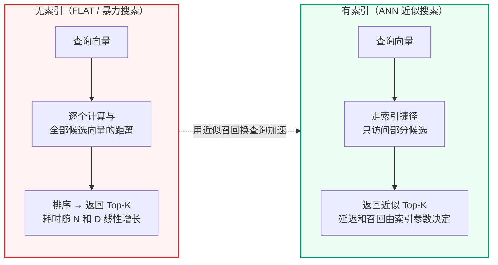

**索引的本质**：用额外的存储空间和构建时间，换取查询时的大幅加速。类比：
- 无索引 = 在未排序的书架上逐本翻找
- 有索引 = 先查图书馆目录卡片，按索书号直接走到对应书架

### 2.2 索引在什么时候构建

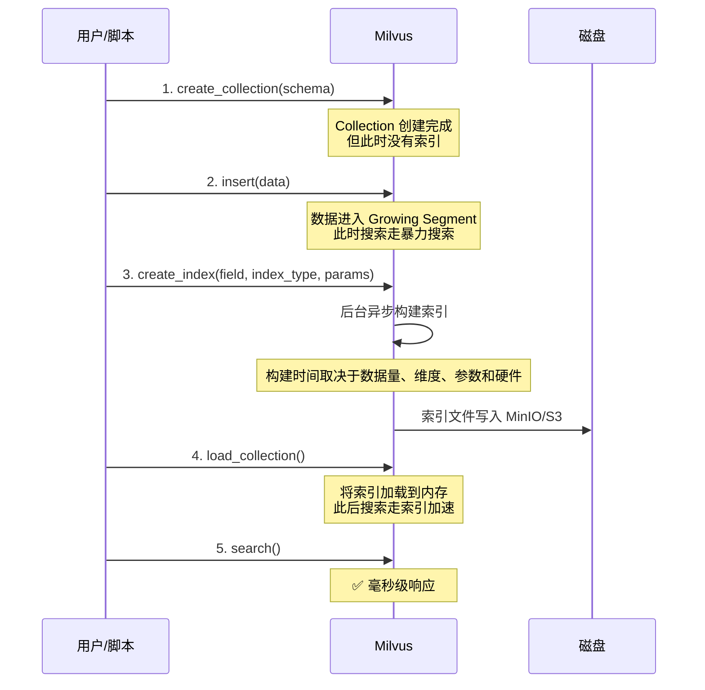

**关键点**：
- 创建 Collection 时不会自动建索引——必须显式调用`create_index()`- 索引构建是**异步**的——调用`create_index()`后立即返回，Milvus 在后台构建
- 必须先`load_collection()`将索引加载到内存，才能使用索引加速搜索

---

## 第三部分：主流索引类型图解

> **数字口径说明**：本节会出现两类数字。`nlist`、`nprobe`、`M`、`efConstruction`、`ef`这类参数范围来自 Milvus 官方文档；规模线、耗时和硬件容量只能作为示例或项目经验估算，不能当成官方标准。真实项目必须结合向量维度、过滤条件、QPS、硬件、collection/segment 状态和压测结果重新校准。

### 3.1 FLAT — 暴力搜索

```text
FLAT 不做任何索引优化。搜索时逐条计算距离。

数据: [v1, v2, v3, v4, v5, ..., v1000000]
查询: q
      ↓
      q 与 v1 计算距离
      q 与 v2 计算距离
      ...
      q 与 v1000000 计算距离
      ↓
      排序 → 取 Top-10

✅ 精度 100%（找到的一定是最近邻）
❌ 速度最慢 O(N×D)
🎯 适用：需要 100% 精确召回的小规模数据、离线评测基准，或强过滤后候选集很小的场景
```

注意：Milvus 官方只明确 FLAT 是 exhaustive search / brute-force search，精确但慢，不适合 massive vector data；官方没有给出“少于 1 万就用 FLAT”这种固定阈值。项目文档或项目中出现的“1 万”只能解释为单机本地环境下的保守经验线，不是通用结论。

### 3.2 IVF\_FLAT — 倒排索引 + 暴力搜索

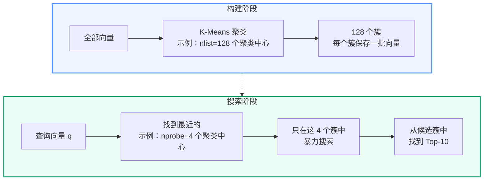

**用二维坐标看清 IVF 的倒排表**

假设只有 6 个二维向量，方便直接画在平面上：

| 向量 ID | 坐标`(x, y)` |
| --- | --- |
| `V1` | `(0.1, 0.2)` |
| `V2` | `(0.2, 0.1)` |
| `V3` | `(0.3, 0.3)` |
| `V4` | `(9.9, 10.1)` |
| `V5` | `(10.2, 9.8)` |
| `V6` | `(10.5, 10.5)` |

设置`nlist = 2`时，K-Means 会先把整体空间聚成两个区域。示例中可以理解为两个聚类中心：

| 聚类中心 | 坐标`(x, y)` | 代表区域 |
| --- | --- | --- |
| `C0` | `(0.2, 0.2)` | 左下角的一组向量 |
| `C1` | `(10.2, 10.1)` | 右上角的一组向量 |

然后系统遍历所有向量，把每个向量挂到最近的聚类中心下面：

```text
V1 / V2 / V3 整体上离 C0 更近 → 进入 C0 的倒排列表
V4 / V5 / V6 整体上离 C1 更近 → 进入 C1 的倒排列表
```

此时 IVF 的倒排索引可以简化理解为：

| 倒排表 Key | 倒排表 Value |
| --- | --- |
| `C0` | `[V1, V2, V3]` |
| `C1` | `[V4, V5, V6]` |

这里最容易误解的一点是：IVF 的倒排表不是按向量内部的某一维特征建的。它不是`x = 0.1 -> [V1]`、`y = 0.2 -> [V1]`这种结构。IVF 的 Key 是“聚类中心编号”，Value 是“属于这个聚类区域的向量 ID 或向量位置”。算法关心的是一个向量整体上离哪个中心更近，而不是某一维的具体取值。

查询时也沿用这张倒排表。假设查询向量`Q = (0.25, 0.25)`，并设置`nprobe = 1`：

1. 先计算`Q`到两个聚类中心的距离，发现`Q`离`C0`更近。
2. 拿`C0`去倒排表中取出候选列表`[V1, V2, V3]`。
3. 只在这三个候选里执行 FLAT 暴力距离计算，排序后返回 Top-K。

所以，IVF\_FLAT 中的“倒排索引”可以记成一句话：**簇号到成员向量列表的映射**。它先用聚类中心缩小搜索范围，再在被选中的桶内保留原始向量并做精确距离计算。

**核心参数**：

| 参数 | 含义 | 官方范围 / 调参方向 |
| --- | --- | --- |
| `nlist` | 聚类中心数 | Milvus 文档给出的取值范围是`[1, 65536]`，默认值`128`，常用建议范围是`[32, 4096]`；值越大，簇更细，构建时间和索引体积也更高 |
| `nprobe` | 搜索时探测的聚类数 | Milvus 文档给出的取值范围是`[1, nlist]`，默认值`8`；值越大，召回率更高，查询延迟也更高；它通常是在线查询阶段最直接的调参旋钮 |

**IVF 参数怎么调**

- `nlist`更像“离线建库时的分桶颗粒度”。它决定了索引要先把向量切成多少个簇，直接影响构建时间、索引大小和每个桶的拥挤程度。
- `nprobe`更像“在线查询时的扫桶宽度”。它决定一次查询要检查多少个簇，几乎直接决定召回率和延迟的平衡。
- 一般先固定一个不过分极端的`nlist`，再围绕`nprobe`做召回和延迟的折中；如果`nlist`变化，通常意味着需要重建索引，而`nprobe`可以按查询或环境单独调整。
- 召回不足时，优先增大`nprobe`；构建过慢或索引过大时，优先检查`nlist`是否过高；如果延迟已经很高但召回足够，先减小`nprobe`。

| 现象 | 优先动作 | 解释 |
| --- | --- | --- |
| 召回偏低，但延迟还能接受 | 增大`nprobe` | 先扩大查询覆盖面，再看是否需要改`nlist` |
| 构建时间太长、索引文件过大 | 适当减小`nlist` | 分桶太细会抬高建库和存储成本 |
| 延迟偏高，但召回已经够用 | 减小`nprobe` | 少扫一些桶，查询会更快 |
| 需要更强压缩、内存压力明显 | 评估`IVF_SQ8`/`IVF_PQ` | 压缩可以降内存，但要重新验证召回 |

```text
✅ 通常比 FLAT 更快
✅ 内存占用比 HNSW 小
❌ 精度取决于 nprobe（可能漏掉边界附近的向量）
🎯 适用：希望在召回率、内存和查询延迟之间做平衡的场景
```

### 3.3 IVF\_SQ8 / IVF\_PQ — 倒排索引 + 量化压缩

先记住一句话：

> IVF 负责“少查一些桶”，SQ8/PQ 负责“每个向量少占一点内存”。

IVF\_FLAT 只做聚类分桶，桶里的向量仍然以原始 float32 保存。IVF\_SQ8 和 IVF\_PQ 在 IVF 的基础上继续压缩向量，所以它们解决的核心问题不是“怎么更聪明地找桶”，而是“桶里的向量太多、太占内存怎么办”。

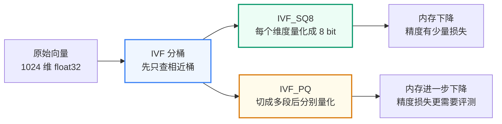

**沿用上面的二维例子：倒排列表里存什么**

IVF\_SQ8 和 IVF\_PQ 仍然先走同一套 IVF 分桶逻辑：`C0 -> [V1, V2, V3]`、`C1 -> [V4, V5, V6]`。它们和 IVF\_FLAT 的区别不在“是否聚类”，而在每个倒排列表里保存的向量表示不同，桶内距离计算方式也不同。

| 索引类型 | 倒排列表里保存的内容 | 查询`Q = (0.25, 0.25)`时怎么比较 |
| --- | --- | --- |
| `IVF_FLAT` | 原始 float 向量，例如`V1 = (0.1, 0.2)` | 在选中的桶内直接计算原始向量距离，结果最精确 |
| `IVF_SQ8` | 每一维量化后的 8 bit 编码，例如`V1 -> [64, 128]` | 把查询也量化后，用压缩表示近似计算距离，内存更省但有舍入误差 |
| `IVF_PQ` | 分段量化后的码本编号，例如`V1 -> [0, 1]` | 先算查询到各段码本中心的距离表，再按编号查表求和，压缩更强但误差更依赖参数 |

可以把三者的差别理解为：

```text
IVF_FLAT：先少查桶，桶里仍然存原始向量
IVF_SQ8 ：先少查桶，桶里存每一维压缩后的整数编码
IVF_PQ  ：先少查桶，桶里存每个子向量对应的码本编号
```

**IVF\_SQ8：Scalar Quantization，逐维压缩**

SQ8 可以理解成“把每一维的小数压缩成 8 bit 编码”。原始向量每一维通常是 float32，占 4 字节；SQ8 会把每一维映射到 0-255 的整数区间，占 1 字节。这样向量主体存储会明显变小，但距离计算不再完全基于原始浮点数，因此召回率需要用评测集验证。

```text
原始向量：
[0.1234, -0.5521, 0.0388, ...]  每维 float32

SQ8 压缩后：
[138,     42,      117,   ...]  每维 uint8

搜索时：
先找最近的 IVF 桶 → 在桶内用量化后的向量近似计算距离 → 返回 Top-K
```

继续用二维例子理解：如果`C0`桶内每一维的有效范围近似是`0.0`到`0.4`，就可以用下面这个简化公式把一维 float 压缩成 0-255 的整数：

```text
quantized_value = round((value - min_value) / (max_value - min_value) * 255)
```

那么`C0`桶里的三个向量可以近似编码为：

| 向量 ID | 原始坐标 | SQ8 编码 |
| --- | --- | --- |
| `V1` | `(0.1, 0.2)` | `[64, 128]` |
| `V2` | `(0.2, 0.1)` | `[128, 64]` |
| `V3` | `(0.3, 0.3)` | `[191, 191]` |

此时倒排列表可以理解为：

```text
C0 -> [(V1, [64, 128]), (V2, [128, 64]), (V3, [191, 191])]
C1 -> [(V4, ...),       (V5, ...),       (V6, ...)]
```

查询`Q = (0.25, 0.25)`到来时，流程和 IVF\_FLAT 很像，只是桶内比较方式变了：

1. 先计算`Q`到`C0`、`C1`的距离，`nprobe = 1`时仍然选择`C0`。
2. 把`Q`也量化成约`[159, 159]`。
3. 只在`C0`的三个压缩候选里比较`[159, 159]`和`[64,128]`、`[128,64]`、`[191,191]`。
4. 得到近似距离排序，示例中`V3`会更接近`Q`。

所以 IVF\_SQ8 的结构可以记成：

```text
聚类中心编号 -> 这个桶里的向量 ID + 每维 8 bit 压缩编码
```

这个例子只用于解释“逐维压缩”的方向，真实量化范围、残差处理和距离计算细节由 Milvus 索引实现负责。

**IVF\_PQ：Product Quantization，分段压缩**

PQ 的压缩更激进。它不是逐维单独压缩，而是先把一个高维向量切成多段，每一段用一个“码本”表示。存储时不再保存每段的原始浮点值，而是保存“这一段最像码本里的第几个中心”。

以 1024 维向量为例：

```text
原始向量：
1024 维 float32

切成 m=64 段：
每段 16 维

每段用 nbits=8 编码：
每段只保存 1 个 code

最终主体编码：
64 个 code，而不是 1024 个 float32
```

仍然套回二维例子，可以把`(x, y)`临时看成两段：第一段是`x`，第二段是`y`。为了讲清楚机制，假设`m = 2`、`nbits = 2`，也就是每个子空间有 4 个码本中心：

| 子空间 | code`0` | code`1` | code`2` | code`3` |
| --- | --- | --- | --- | --- |
| `x`码本 | `0.1` | `0.2` | `0.3` | `10.2` |
| `y`码本 | `0.1` | `0.2` | `0.3` | `10.1` |

这样，`C0`桶里的向量可以被编码成：

| 向量 ID | 原始坐标 | PQ code |
| --- | --- | --- |
| `V1` | `(0.1, 0.2)` | `[0, 1]` |
| `V2` | `(0.2, 0.1)` | `[1, 0]` |
| `V3` | `(0.3, 0.3)` | `[2, 2]` |

此时倒排列表可以理解为：

```text
C0 -> [(V1, [0, 1]), (V2, [1, 0]), (V3, [2, 2])]
C1 -> [(V4, ...),    (V5, ...),    (V6, ...)]
```

查询`Q = (0.25, 0.25)`到来时，PQ 不需要把`Q`逐个还原后再和每个原始向量完整计算距离，而是先做两张很小的查表结果：

```text
Q.x 到 x 码本的距离：
code 0: (0.25 - 0.1)^2 = 0.0225
code 1: (0.25 - 0.2)^2 = 0.0025
code 2: (0.25 - 0.3)^2 = 0.0025

Q.y 到 y 码本的距离：
code 0: (0.25 - 0.1)^2 = 0.0225
code 1: (0.25 - 0.2)^2 = 0.0025
code 2: (0.25 - 0.3)^2 = 0.0025
```

然后按候选向量的 PQ code 查表相加：

| 候选 | PQ code | 近似距离计算 | 结果 |
| --- | --- | --- | --- |
| `V1` | `[0, 1]` | `x_code_0 + y_code_1` | `0.0225 + 0.0025 = 0.0250` |
| `V2` | `[1, 0]` | `x_code_1 + y_code_0` | `0.0025 + 0.0225 = 0.0250` |
| `V3` | `[2, 2]` | `x_code_2 + y_code_2` | `0.0025 + 0.0025 = 0.0050` |

示例中`V3`的近似距离最小，所以会排在更靠前的位置。注意这里比较的是“查询到码本中心的距离之和”，不是查询和原始 float 向量的完整距离。

所以 IVF\_PQ 的结构可以记成：

```text
聚类中心编号 -> 这个桶里的向量 ID + 每个子向量的码本编号
```

这个例子只是帮助理解压缩方向，不是容量承诺。真实索引还包含 IVF 聚类中心、PQ 码本、主键、元数据和段管理开销。Milvus 官方参数里，`m`表示 PQ 分段数量，并要求向量维度能被`m`整除；`nbits`表示每个低维子向量编码使用的 bit 数，默认常见为 8。

**IVF\_SQ8 和 IVF\_PQ 的取舍**

| 对比项 | IVF\_SQ8 | IVF\_PQ |
| --- | --- | --- |
| 压缩方式 | 每一维从 float32 量化为 8 bit | 向量切成多段，每段用码本编号表示 |
| 内存节省 | 明显下降 | 通常比 SQ8 更省 |
| 召回损失 | 一般小于 PQ，但仍需评测 | 更依赖`m`、`nbits`和评测集 |
| 理解难度 | 相对容易 | 更复杂 |
| 适用场景 | 内存有压力，但希望保留相对稳定召回 | 数据规模更大、内存更紧张、能接受更强近似 |

不要把 SQ8/PQ 理解成“更高级所以更好”。它们的本质是压缩。压缩带来内存收益，也会带来距离近似误差。是否值得用，要看业务对召回率、延迟、内存成本的取舍。

### 3.4 HNSW — 分层可导航小世界图

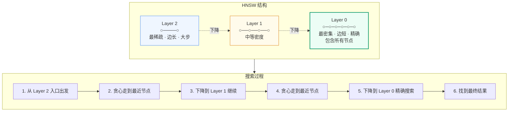

> 📖**深入阅读**：HNSW 图索引的理论原理详见[附录C：HNSW 索引参数调优](/blog/appendix-c-hnsw-index)。

HNSW 和 IVF 的思路完全不同：

- IVF 是“先聚类分桶，再只查少数桶”。
- HNSW 是“把向量组织成图，搜索时沿着越来越近的节点走”。

可以把 HNSW 想象成城市道路：

```text
高层图：高速路，节点少，跳得远，用来快速接近目标区域
中层图：主干路，节点变多，继续缩小范围
底层图：街区路，包含全部节点，在附近精细搜索
```

为了和前面的 IVF 例子对齐，下面仍然使用这 6 个二维向量：

| 向量 ID | 坐标`(x, y)` |
| --- | --- |
| `V1` | `(0.1, 0.2)` |
| `V2` | `(0.2, 0.1)` |
| `V3` | `(0.3, 0.3)` |
| `V4` | `(9.9, 10.1)` |
| `V5` | `(10.2, 9.8)` |
| `V6` | `(10.5, 10.5)` |

IVF 会把它们分到`C0`、`C1`两个桶里；HNSW 不建桶，而是把每个向量变成图节点，再给相近节点之间连边。为了便于说明，假设最后形成了这样一个简化 HNSW 图：

```text
Layer 2:
  V5

Layer 1:
  V5 ----- V2 ----- V3

Layer 0:
  V1 ----- V2 ----- V3 ----- V4 ----- V5 ----- V6
   \_______________/          \_______________/
```

这张图不是 Milvus 对这 6 个点的固定输出，只是说明用的简化结构。真实 HNSW 会受到插入顺序、随机层高、`M`、`efConstruction`和内部邻居选择策略影响。

### 3.4.1 HNSW 是怎么建出来的

构建 HNSW 时，每个向量会变成图里的一个节点。新节点插入时，会在图中寻找离它比较近的已有节点，并建立连接。不是每个节点都出现在所有层：

- 最底层包含全部向量。
- 越往上，节点越少。
- 上层负责快速跳转，下层负责精细搜索。

```mermaid
flowchart TD
    V["新向量 v"] --> Find["在已有图中寻找近邻"]
    Find --> Connect["与近邻建立边"]
    Connect --> Level{"是否进入更高层？"}
    Level -->|"是"| Upper["在上层也建立少量长连接"]
    Level -->|"否"| Base["只保留在底层图"]

    style Find fill:#EFF6FF,stroke:#3B82F6
    style Connect fill:#ECFDF5,stroke:#059669
    style Upper fill:#FFFBEB,stroke:#D97706
```

**构建示例：把`V3 = (0.3, 0.3)`插入 HNSW**

假设当前图里已经有`V1`、`V2`、`V4`、`V5`、`V6`，入口点是高层的`V5`。为了方便观察，假设参数大致是：

```text
M = 2
efConstruction = 3
V3 被随机分配到最高 Layer 1
```

插入`V3`时，可以按下面的流程理解：

1. 从当前最高层入口`V5`开始，用`V3`作为“查询向量”在已有图里找近邻。
2. 在 Layer 1 中，`V5`很远，沿边看到`V2`更接近`V3`，于是移动到`V2`。
3. Layer 1 已经没有更近节点，就从`V2`下降到 Layer 0。
4. 在 Layer 0 中，以`efConstruction = 3`的候选宽度继续找附近节点，候选里可能包含`V1`、`V2`和较远的桥接节点。
5. 根据距离选出最多`M = 2`个近邻，在 Layer 0 给`V3`连接`V1`、`V2`。
6. 因为`V3`的最高层是 Layer 1，所以还会在 Layer 1 给`V3`连接靠近它的节点，例如`V2`。
7. 如果某些旧节点的边超过`M`，算法会按规则修剪边，尽量保留更有用的邻居。

插入后，局部结构可以简化成：

```text
Layer 1:
  V5 ----- V2 ----- V3

Layer 0:
  V1 ----- V2 ----- V3
   \_______________/
```

这个过程的重点不是“每条边一定长这样”，而是：**HNSW 建索引时就在提前铺路**。它通过插入、找近邻、连边、修剪，把未来查询可能走的路径预先保存在图结构里。

这就是为什么 HNSW 的构建成本和内存占用会比较高：它不只是保存向量，还要保存节点之间的连接关系。

### 3.4.2 HNSW 是怎么查的

查询时，HNSW 不会从底层全量扫描开始，而是从上层入口点开始：

```text
1. 从最高层入口节点出发
2. 在当前层贪心移动：只要邻居更接近查询向量，就走过去
3. 当前层走不动了，就下降一层
4. 重复上面的过程
5. 到最底层后，保留一批候选节点，返回 Top-K
```

**查询示例：用`Q = (0.25, 0.25)`搜索**

继续使用上面的简化图，假设入口点仍然是 Layer 2 的`V5`，查询参数里`ef = 3`、`top_k = 2`。

先看几个关键距离的直觉：

| 节点 | 坐标 | 到`Q`的平方距离 |
| --- | --- | --- |
| `V5` | `(10.2, 9.8)` | 很大 |
| `V2` | `(0.2, 0.1)` | `0.0250` |
| `V3` | `(0.3, 0.3)` | `0.0050` |
| `V1` | `(0.1, 0.2)` | `0.0250` |

搜索过程可以这样走：

1. 从 Layer 2 的入口`V5`出发，发现它离`Q`很远。
2. 下降到 Layer 1，沿着`V5 -> V2`走，因为`V2`明显更接近`Q`。
3. 继续看`V2`的邻居，发现`V3`比`V2`更接近`Q`，于是走到`V3`。
4. Layer 1 没有更近节点后，从`V3`下降到 Layer 0。
5. 在 Layer 0 中，以`ef = 3`保留一个小候选池，检查`V3`附近的`V1`、`V2`、`V4`等邻居。
6. 最终候选大致是`V3`、`V1`、`V2`，当`top_k = 2`时会返回`V3`和`V1/V2`中的一个；`V1`与`V2`在这个例子里距离相同，实际排序会由实现细节和分数决定。

这和 IVF\_FLAT 的查询路径非常不同：

```text
IVF_FLAT：Q -> 找最近的桶 C0 -> 扫 C0 桶里的向量
HNSW    ：Q -> 从高层入口出发 -> 沿图走向更近节点 -> 底层局部扩展候选
```

HNSW 快的原因是：它用上层图快速接近目标区域，再在底层图局部搜索。它不是全量扫描，也不是只查固定几个 IVF 桶。

**核心参数：先分清构建期和查询期**

HNSW 参数最容易混淆的一点是：有些参数在建索引时确定，后续调整必须重建索引；有些参数只影响本次查询，可以在不重建 collection 的情况下动态调整。

| 类别 | 参数 | 是否需要重建索引 | 控制什么 | 调大后的变化 |
| --- | --- | --- | --- | --- |
| 构建期参数 | `M` | 是 | 每个节点最多连多少个邻居，也就是图的路网密度 | 图更密，召回可能更好；内存和构建成本上升 |
| 构建期参数 | `efConstruction` | 是 | 构建索引时为新节点寻找近邻的候选宽度 | 图质量可能更好；构建更慢 |
| 查询期参数 | `ef`/`efSearch` | 否 | 查询时维护的动态候选列表宽度 | 召回可能更好；查询延迟上升 |

这些参数的默认值由当前 Milvus / langchain-milvus 版本和创建方式决定，不应在项目文档里当成固定标准。需要确认时，看 collection 的 index 描述。

**构建期参数：`M`和`efConstruction`**

`M`的本质是控制图的“路网密度”。每个节点最多保留多少条邻居边，决定了搜索时可选择的路径数量。`M`太小，图会变稀，查询可能更快但更容易漏掉好路径；`M`太大，图会更密，召回通常更稳，但每个节点都要维护更多边，内存成本大致随`M`增长，构建也会更慢。

`M`还会影响分层图的整体形态。不同实现的层高采样细节不完全相同，但可以记住工程直觉：`M`不只是一个内存参数，它会影响上层长连接和底层邻居连接的组织方式。调大`M`往往会让底层连接更充分、搜索路径更宽，减少因为图太稀造成的绕路或漏召回；代价是索引体积和构建时间都会上升。

常见起点可以这样选：

| 场景 | `M`建议起点 | 说明 |
| --- | --- | --- |
| 通用场景 | `16` | 常见均衡起点，先用评测集看召回和延迟 |
| 高召回优先 | `32`到`64` | 召回更稳，但内存会明显上升，需要容量评估 |
| 内存敏感 | `8`到`12` | 节省内存，但要重点检查 Recall@K 和误漏召 |

`efConstruction`的本质是“建图时看多宽”。新节点插入图中时，不是直接找`M`个邻居就结束，而是先维护一个大小约为`efConstruction`的候选集合，再从候选里择优选出最多`M`个正式邻居。候选越宽，建出来的图通常质量越好，但构建时间也越高。

关键约束是：`efConstruction`通常应当大于或等于`M`。如果它小于`M`，建图时连足`M`个高质量邻居的空间都不够，参数组合本身就不合理；在具体 Milvus 版本中，还可能被校验拒绝或无法发挥预期效果。

实战中可以把`efConstruction`设为`M * 2`到`M * 4`附近作为起点；例如`M = 16`时，可以从`100`或`200`开始压测。继续把它调到很大时，构建会明显变慢，但召回提升往往逐渐变小，所以不要只凭“更大更好”来调参。

**查询期参数：`ef`/`efSearch`**

`ef`，也常写作`efSearch`，控制查询时动态候选列表的宽度。查询进入底层图后，算法会维护一个候选池来决定还要继续探索哪些节点。`ef`越大，搜索视野越广，召回通常越好；`ef`越小，查询越快，但更可能提前停在局部较优位置。

这个参数的最大优势是灵活：它属于查询参数，可以按请求动态调整，不需要重建索引。例如低延迟接口可以使用较小的`ef`，离线评测、后台校验或高精度请求可以使用较大的`ef`。

常见起点是`100`到`300`。如果`ef`已经明显大于`efConstruction`，召回继续提升通常不会很明显，因为建图阶段没有为更宽的搜索准备足够好的连接质量；因此工程上常把`ef <= efConstruction`作为一个调参参考，而不是绝对数学定律。

可以把三类参数的调参直觉记成：

```text
M：
  建图时确定图有多密，影响内存、构建时间和可走路径数量。

efConstruction：
  建图时决定新节点找邻居看多宽，影响图质量和构建速度。

ef / efSearch：
  查询时决定候选池看多宽，影响召回率和查询延迟，可以动态调整。
```

**为什么仍要重点理解 HNSW**

HNSW 是常用的高召回低延迟 ANN 索引，适合用来理解“向量索引用空间换查询速度”的核心思想。本节的 PyMilvus 原生 demo 会显式创建 HNSW，方便观察`M`、`efConstruction`、`ef`这些参数。

本项目主链路的 dense 侧也采用 HNSW；sparse 侧使用 Milvus BM25 Built-in Function。也就是说，当前正式配置是`dense: HNSW + L2`、`sparse: BM25BuiltInFunction`。如果 collection 还是旧版本的索引配置，需要先删除旧 collection 再重建，HNSW 不会在已有 collection 上自动替换。

### 3.5 索引选型决策树

```mermaid
flowchart TD
    Start["开始选型"] --> Q1{"数据量级？"}

    Q1 -->|"小规模 / 强过滤后候选少"| FLAT["FLAT<br/>100% 精确 · 全量扫描"]
    Q1 -->|"中等规模 / 低延迟要求"| Q2{"内存是否充足？"}
    Q1 -->|"大规模 / 内存压力明显"| Q3{"是否接受近似压缩？"}

    Q2 -->|"充足"| HNSW["HNSW<br/>高召回 · 低延迟"]
    Q2 -->|"紧张"| IVFFlat["IVF_FLAT<br/>内存占用小<br/>精度适中"]

    Q3 -->|"接受"| IVFPQ["IVF_PQ 或 DiskANN<br/>节省内存 · 需评测召回"]
    Q3 -->|"不接受"| HNSW2["HNSW<br/>高召回 · 内存开销较高"]

    style HNSW fill:#ECFDF5,stroke:#059669,stroke-width:3px
    style FLAT fill:#EFF6FF,stroke:#3B82F6
    style IVFFlat fill:#FFFBEB,stroke:#D97706
    style IVFPQ fill:#FEF2F2,stroke:#DC2626
    style HNSW2 fill:#ECFDF5,stroke:#059669
```

**分支一：小规模 / 强过滤后候选少 → FLAT**

FLAT 不做任何近似——逐条计算与全部向量的距离后排序返回。优势是 100% 精确，适合原型验证、离线评测基准、强过滤后候选集很小的场景。本项目的单个场景 FAQ Collection 通常只有几十到几百条，在这个数量级上 FLAT 和 HNSW 的延迟差异通常不明显，但这仍然要以本机压测为准。

**分支二：中等规模 + 内存充足 → HNSW**

HNSW 是常用的高召回低延迟 ANN 索引。它预先构建多层"高速公路图"——上层节点少跳得远，下层节点密查得准。Milvus 官方口径是：HNSW 查询延迟低、搜索准确性好，但需要更高内存来维护图结构。本项目当前 dense 主链路使用 HNSW，sparse 主链路使用 BM25BuiltInFunction；后续是否继续使用该配置、调整`M`/`ef`，或切换到 IVF/DiskANN，仍要以容量估算和压测为准。

**分支三：内存更敏感 → IVF\_FLAT**

用 K-means 聚类分桶，检索时只搜最近 N 个桶。内存比 HNSW 小（不需要存储图结构），但精度略低——查询向量落在桶边界附近时可能漏掉相邻桶中的近邻。

**分支四：大规模 / 内存压力明显 → IVF\_PQ 或 DiskANN**

当向量规模继续扩大、内存成本成为主要瓶颈时，才考虑 IVF\_PQ、DiskANN 等方案。IVF\_PQ 通过量化压缩减少内存，DiskANN 将部分索引压力转移到 SSD。它们不是“规模一大就必选”，而是需要结合召回率目标、SSD 性能、过滤条件和压测结果来定。

---

## 第四部分：PyMilvus 基本操作与原生混合检索

这部分对应`scripts/demo/demo_ch04_milvus_basics.py`的流程：连接 Milvus、创建 Collection、创建 HNSW 索引、插入样本、执行搜索、清理临时 Collection。项目文档会把脚本中的步骤拆开解释，完整运行以项目内置 demo 为准。

```bash
python scripts/demo/demo_ch04_milvus_basics.py
```

理解这些基础步骤后，再看项目阶段 08中 langchain-milvus 的封装，就能知道项目检索代码底层发生了什么。

### 4.1 连接 Milvus

```python
from pymilvus import connections, MilvusClient

# 方式一：connections 模块（本项目 LangChain 使用的方式）
connections.connect(
    alias="default",
    uri="http://127.0.0.1:19530",
    db_name="",
)

# 方式二：MilvusClient（新版 API，更简洁）
client = MilvusClient(uri="http://127.0.0.1:19530")

# 查看所有 Collection
collections = client.list_collections()
```

### 4.2 创建 Collection 和 Schema

```python
from pymilvus import Collection, CollectionSchema, FieldSchema, DataType

# 定义字段
pk_field = FieldSchema(name="pk", dtype=DataType.VARCHAR, is_primary=True, max_length=128)
text_field = FieldSchema(name="text", dtype=DataType.VARCHAR, max_length=65535)
dense_field = FieldSchema(name="dense", dtype=DataType.FLOAT_VECTOR, dim=1024)
sparse_field = FieldSchema(name="sparse", dtype=DataType.SPARSE_FLOAT_VECTOR)
source_field = FieldSchema(name="source", dtype=DataType.VARCHAR, max_length=64)
kb_version_field = FieldSchema(name="kb_version", dtype=DataType.VARCHAR, max_length=128)

# 创建 Schema
schema = CollectionSchema(
    fields=[pk_field, text_field, dense_field, sparse_field, source_field, kb_version_field],
    description="示例 FAQ 集合",
    enable_dynamic_field=True,
)

# 创建 Collection
collection = Collection(
    name="demo_collection",
    schema=schema,
    consistency_level="Session",
)
```

### 4.3 创建索引

```text
# 为 Dense 向量字段创建 HNSW 索引
dense_index_params = {
    "index_type": "HNSW",
    "metric_type": "COSINE",
    "params": {"M": 16, "efConstruction": 200},
}
collection.create_index(field_name="dense", index_params=dense_index_params)

# 为 Sparse 向量字段创建索引
sparse_index_params = {
    "index_type": "SPARSE_INVERTED_INDEX",
    "metric_type": "IP",
}
collection.create_index(field_name="sparse", index_params=sparse_index_params)
```

### 4.4 插入数据

```python
import numpy as np

entities = [
    ["doc_001", "doc_002", "doc_003"],  # pk
    [
        "HS 编码归类流程包含以下步骤：1. 提交商品与贸易资料 2. 签订贸易合同 3. 完成海关申报",
        "跨境贸易报关需要准备商业发票、装箱单、合同和必要的审批记录",
        "报关系统连接失败时，请先检查网络连接，然后尝试重启报关系统客户端",
    ],  # text
    np.random.rand(3, 1024).tolist(),     # dense 向量（实际由 BGE-M3 生成）
    [{} for _ in range(3)],               # sparse 手动占位；自动生成必须配置 3.8 的 BM25 Function
    ["customs", "classification", "documents"],              # source
    ["v1", "v1", "v1"],                   # kb_version
]

mr = collection.insert(entities)
print(f"插入了 {mr.insert_count} 条数据")
```

### 4.5 加载到内存并搜索

```python
# 必须先加载才能搜索
collection.load()

# 执行搜索
search_params = {"metric_type": "COSINE", "params": {"ef": 64}}
query_vector = np.random.rand(1, 1024).tolist()

results = collection.search(
    data=query_vector,
    anns_field="dense",
    param=search_params,
    limit=5,
    expr='source == "customs"',            # 标量过滤
    output_fields=["text", "source"],  # 返回字段
)

for hits in results:
    for hit in hits:
        print(f"  id={hit.id}, distance={hit.distance:.4f}")
        print(f"  text={hit.entity.get('text')[:50]}...")
```

### 4.6 删除数据

```text
# 按主键删除
collection.delete(ids=["doc_001", "doc_002"])

# 按表达式删除
collection.delete(expr='kb_version == "v1"')
```

### 4.7 完整流程串联

```mermaid
flowchart TD
    Connect["1. 连接 Milvus"] --> CreateCol["2. 创建 Collection"]
    CreateCol --> CreateIdx["3. 创建索引"]
    CreateIdx --> Insert["4. 插入数据"]
    Insert --> Flush["5. 持久化 flush()"]
    Flush --> Load["6. 加载到内存"]
    Load --> Search["7. 执行搜索"]
    Search --> MoreData{"还有数据？"}
    MoreData -->|"是"| Insert
    MoreData -->|"否"| Delete["8. 清理 delete()"]
    Delete --> Release["9. 释放内存 release()"]

    style CreateIdx fill:#FFFBEB,stroke:#D97706,stroke-width:2px
    style Search fill:#ECFDF5,stroke:#059669,stroke-width:2px
```

### 4.8 用 PyMilvus 直接实现混合检索

前面的`collection.search()`只查一个向量字段。真实 RAG 项目常常需要同时查两路：

- `dense`：语义向量，适合相似表达和改写。
- `sparse`：BM25 稀疏向量，适合关键词、编号、术语、制度名称。

如果完全不用 langchain-milvus，可以用 PyMilvus 明确写出“创建 schema → 配置 BM25 Function → 分别建 dense/sparse 索引 → 发起 hybrid\_search → 融合排序”的过程。

```python
from pymilvus import (
    AnnSearchRequest,
    Collection,
    CollectionSchema,
    DataType,
    FieldSchema,
    Function,
    FunctionType,
    WeightedRanker,
)

fields = [
    FieldSchema(name="pk", dtype=DataType.VARCHAR, is_primary=True, max_length=128),
    FieldSchema(
        name="text",
        dtype=DataType.VARCHAR,
        max_length=65535,
        enable_analyzer=True,
        analyzer_params={"type": "chinese"},
    ),
    FieldSchema(name="dense", dtype=DataType.FLOAT_VECTOR, dim=1024),
    FieldSchema(name="sparse", dtype=DataType.SPARSE_FLOAT_VECTOR),
    FieldSchema(name="source", dtype=DataType.VARCHAR, max_length=64),
]

bm25 = Function(
    name="text_bm25",
    function_type=FunctionType.BM25,
    input_field_names="text",
    output_field_names="sparse",
)

schema = CollectionSchema(
    fields=fields,
    functions=[bm25],
    enable_dynamic_field=True,
    description="PyMilvus hybrid search demo",
)

collection = Collection("demo_hybrid_search", schema=schema, consistency_level="Session")

collection.create_index(
    field_name="dense",
    index_params={"index_type": "HNSW", "metric_type": "COSINE", "params": {"M": 16, "efConstruction": 200}},
)
collection.create_index(
    field_name="sparse",
    index_params={"index_type": "SPARSE_INVERTED_INDEX", "metric_type": "IP"},
)
```

插入时，业务代码只需要提供`pk`、`text`、`dense`和业务元数据。`sparse`是 BM25 Function 的输出字段，由 Milvus 根据`text`自动生成，不需要手动传入。

```text
collection.insert(
    [
        {
            "pk": "doc_001",
            "text": "跨境贸易资料审核需要提交商品资料、原产地证和收款账户信息。",
            "dense": dense_vectors[0],  # 实际项目中由 BGE-M3 生成
            "source": "customs",
        },
        {
            "pk": "doc_002",
            "text": "贸易结算需要发票、审批单和部门负责人签字。",
            "dense": dense_vectors[1],
            "source": "documents",
        },
    ]
)
collection.flush()
collection.load()
```

检索时，PyMilvus 需要显式构造两路请求，再指定融合器：

```text
dense_request = AnnSearchRequest(
    data=[query_dense_vector],
    anns_field="dense",
    param={"metric_type": "COSINE", "params": {"ef": 64}},
    limit=20,
    expr='source == "documents"',
)

sparse_request = AnnSearchRequest(
    data=[query_text],
    anns_field="sparse",
    param={"metric_type": "IP"},
    limit=20,
    expr='source == "documents"',
)

results = collection.hybrid_search(
    reqs=[dense_request, sparse_request],
    rerank=WeightedRanker(0.55, 0.45),
    limit=5,
    output_fields=["text", "source"],
)
```

这段代码能看清混合检索的底层结构：

1. `dense_request`负责语义召回。
2. `sparse_request`负责关键词召回。
3. `WeightedRanker(0.55, 0.45)`负责把两路结果按权重融合。
4. `expr`负责 source、版本、租户、可见性等标量过滤。

PyMilvus 原生写法的优点是透明、可控，适合学习底层机制、排查 schema、做索引调参和性能压测；缺点是业务代码会变长，需要自己处理 embedding、BM25 Function、连接、schema 校验、结果转换和异常提示。

### 4.9 WeightedRanker 与 RRFRanker

Milvus 的 Hybrid Search 先得到 Dense 和 Sparse 两路候选，再用 ranker 合并排序。常见方案有两种：

| Ranker | 核心做法 | 优点 | 局限 | 适用场景 |
| --- | --- | --- | --- | --- |
| `WeightedRanker` | 对各路分数归一化后按权重加权求和 | 可以明确表达 Dense/Sparse 的业务偏好，便于解释和调参 | 依赖各路分数具有可比较性；权重变化需要评测 | 已知语义召回和关键词召回的相对重要性时 |
| `RRFRanker` | 主要按各路结果的名次计算 Reciprocal Rank，再融合名次 | 不依赖 Dense 与 Sparse 的原始分数尺度，跨检索器更稳健 | 不能直接表达“Dense 比 Sparse 更重要多少”，需要调`k`和结果名次 | 分数尺度明显不同、希望采用稳健名次融合时 |

官方机制、参数和 Python 用法参见：[Milvus Reranking：WeightedRanker 与 RRFRanker](https://milvus.io/docs/v2.5.x/reranking.md)。

#### 一个小例子

假设查询“无线耳机”得到以下两路排名：

```text
Dense：A(第1)、B(第2)、C(第3)、D(第4)
BM25：B(第1)、C(第2)、D(第3)、E(第4)
```

以`k=60`的 RRF 为例：

```text
A = 1/(60+1)                         ≈ 0.0164
B = 1/(60+2) + 1/(60+1)              ≈ 0.0325
C = 1/(60+3) + 1/(60+2)              ≈ 0.0320
D = 1/(60+4) + 1/(60+3)              ≈ 0.0315
E =                         1/(60+4) ≈ 0.0156
```

因此 RRF 排序为`B > C > D > A > E`：B、C、D 同时出现在两路结果中，虽然没有比较原始分数，也能体现交叉命中优势。RRF 的`k`是平滑参数，不是业务置信度或相似度阈值。

WeightedRanker 则使用两路归一化后的分数：

```text
final_score = w_dense * normalized_dense_score
            + w_sparse * normalized_sparse_score
```

如果把 Dense 权重设为`0.8`、BM25 权重设为`0.2`，并且 A 的 Dense 分数明显高于其他候选，A 可能排在第一；如果提高 BM25 权重，关键词命中更好的 B 可能反超。这个例子用于理解“权重会改变排序”，不是 Milvus 的精确复算：Milvus 的实际分数归一化由其 ranker 实现负责，不能直接用简单 Min-Max 结果替代。

两种写法的基本形式如下：

```python
from pymilvus import RRFRanker, WeightedRanker

# 明确表达 Dense 比 Sparse 略重要
weighted_ranker = WeightedRanker(0.55, 0.45)

# 不指定各路权重，按结果名次融合；默认 k 通常为 60
rrf_ranker = RRFRanker()
```

选择原则可以简化为：

- 有明确业务优先级，且能够通过评测校准权重：选择`WeightedRanker`。
- 各路分数尺度差异大、检索器重要性不明确，先求稳定融合：选择`RRFRanker`。

本项目选择`WeightedRanker(0.55, 0.45)`，因为当前策略是 Dense 略优先于 BM25。`0.55/0.45`是融合权重，不是概率；权重是否合理仍需用 Recall@K、MRR、关键词覆盖率、FAQ 误直出率和延迟验证。

注意，这里的两个 ranker 都属于**Milvus 多路召回融合**。它们与后续的 BGE CrossEncoder Reranker 不是同一个阶段：CrossEncoder 会对已经融合出的候选文档进行 query-document 相关性精排。

---

## 第五部分：langchain-milvus 如何实现混合检索

> **上下文**：[项目阶段 03](/blog/03-langchain-ecosystem)已经建立了 VectorStore 抽象；本节先用 PyMilvus 展示 Milvus 的底层操作，再回到本项目的 langchain-milvus 封装。这样你能理解"为什么项目代码中没有显式的`create_collection()`或`create_index()`调用"。

理解了上面的 PyMilvus 原生混合检索后，再看下面的`Milvus()`、`add_documents()`、`similarity_search_with_score()`，就能知道 langchain-milvus 帮我们省掉了哪些重复代码。项目阶段 08会在完整 Hybrid Search 场景中再次使用这些封装。

### 5.1 初始化时的隐藏操作

```python
# 第 8 讲中的代码（qa_core/retrieval/store.py）
from qa_core.retrieval.milvus_compat import hybrid_index_params, hybrid_search_params

self._store = Milvus(
    embedding_function=get_embeddings(),
    builtin_function=bm25_function(),
    collection_name=self.collection_name,
    vector_field=["dense", "sparse"],
    index_params=hybrid_index_params(),
    search_params=hybrid_search_params(),
    text_field="text",
    primary_field="pk",
    auto_id=False,
    enable_dynamic_field=True,
    consistency_level="Session",
    drop_old=False,
)
```

这个封装对应 PyMilvus 里的多步操作：

```text
1. 用 PyMilvus 连接到 Milvus
2. 检查 Collection 是否存在
   ├─ 不存在 → 自动创建 Collection + Schema + HNSW(L2) + BM25(BM25BuiltInFunction) + load()
   └─ 存在 → 直接使用现有 Collection
3. 如果 drop_old=True → 先 drop 再重建（⚠️ 本项目设为 False）
```

**这就是为什么项目代码中没有直接调用`create_collection()`或`create_index()`**：常规创建和插入流程由 langchain-milvus 封装完成；项目通过`index_params/search_params`显式传入索引意图，只在 schema 校验、database 管理、重建 collection 等地方直接使用 PyMilvus。

在本项目里，这段代码位于`qa_core/retrieval/store.py::MilvusHybridStore.store`。它是 FAQ 集合和文档集合的统一检索入口。

### 5.2 add\_documents() 的隐藏操作

```text
store.add_documents(documents=docs, ids=ids)
```

底层实际执行：

```text
1. 对每个 doc.page_content 调用 embedding_function → 生成 Dense 向量
2. Milvus 服务端 BM25BuiltInFunction 对 text 字段 → 生成 Sparse 向量
3. 将 Dense + Sparse + text + metadata 包装为 insert 请求
4. collection.insert(entities) → collection.flush()
```

在本项目里，`scripts/rebuild_kb_version.py`和`scripts/rebuild_scenarios.py`会通过检索封装把 FAQ 和文档 chunk 写入 Milvus。项目阶段 13会完整展开入库链路；本节只需要先知道：项目最终不是手写`collection.insert()`，而是通过`MilvusHybridStore.add_documents()`写入。

### 5.3 similarity\_search\_with\_score() 的隐藏操作

```text
store.similarity_search_with_score(
    query,
    k=20,
    expr=expr,
    ranker_type="weighted",
    ranker_params={"weights": [0.55, 0.45]},
)
```

底层实际执行：

```text
1. embedding_function.embed_query(query) 将 query 文本 → Dense 向量
2. 内置 BM25Function 将 query 文本 → Sparse 向量
3. 通过 PyMilvus 发起 dense/sparse 多向量搜索 → 标量过滤 → 加权融合
4. 结果包装为 [(Document, score), ...]
```

在本项目里，这段调用位于`qa_core/retrieval/store.py::MilvusHybridStore.search()`。项目还会在 LangChain 返回结果之后继续做两件事：

1. 转成项目内部的`RetrievalHit`，避免上层业务直接依赖 langchain-milvus 的返回结构。
2. 按需调用 CrossEncoder reranker，对初始候选做二阶段重排。

注意：当前项目文档代码与本项目现有`langchain-milvus==0.2.2`调用方式保持一致。后续如果升级到新的 reranker Function API，再把这里的`ranker_type/ranker_params`替换为新写法。

### 5.4 PyMilvus 与 langchain-milvus 对比

```mermaid
flowchart LR
    subgraph Pymilvus["直接 PyMilvus"]
        P1["显式创建 Schema"]
        P2["显式 create_index()"]
        P3["显式 insert()"]
        P4["显式 load()"]
        P5["显式 search()"]
        P1 --> P2 --> P3 --> P4 --> P5
    end

    subgraph LangChain["LangChain Milvus（本项目）"]
        L1["Milvus() 初始化<br/>自动 Schema + Index + Load"]
        L2["add_documents()<br/>自动 Embedding + BM25 + Insert"]
        L3["similarity_search_with_score()<br/>自动 Embedding + Search + 融合"]
        L1 --> L2 --> L3
    end

    Pymilvus -.->|"LangChain 封装了<br/>这些手动步骤"| LangChain

    style Pymilvus fill:#EFF6FF,stroke:#3B82F6,stroke-width:2px
    style LangChain fill:#ECFDF5,stroke:#059669,stroke-width:2px
```

**PyMilvus 原生混合检索 vs langchain-milvus 混合检索**：

| 维度 | PyMilvus 原生写法 | langchain-milvus 写法 |
| --- | --- | --- |
| 代码透明度 | 每一步都显式写出来，适合学习和排障 | 细节被封装，业务代码更短 |
| Schema / 索引控制 | 更细，可以直接控制字段、索引、ranker | 通过封装参数控制，常规场景足够 |
| Embedding | 需要自己调用模型并组织向量 | 自动调用`embedding_function` |
| BM25 Sparse | 需要自己配置 BM25 Function 和 sparse 搜索请求 | 通过`builtin_function=BM25BuiltInFunction(...)`收口 |
| 结果结构 | 返回 Milvus 原始命中，需要自己转换 | 返回 LangChain Document，方便接 RAG 链路 |
| 本项目用途 | 连接、database、schema 校验、排障、底层机制验证 | FAQ/文档在线检索和入库主入口 |

---

## 第六部分：langchain-milvus 与 PyMilvus 的职责边界

### 6.1 本项目为什么两者都存在

本项目最终选择：**继续使用 langchain-milvus 作为业务检索入口，保留 PyMilvus 作为底层连接、database 管理和 schema 检查工具，不迁移为纯 PyMilvus 实现。**

原因是`langchain-milvus`不是独立驱动——它是套在 PyMilvus 之上的 LangChain VectorStore。业务代码面向 LangChain VectorStore，但底层连接、database、collection schema 仍然由 PyMilvus 完成。

这里的“适配层”不是为了兼容旧版本而额外凑出来的代码，而是职责边界：

- 业务检索要接 LangChain 的`Document`、embedding、reranker 和 QAService，所以入口放在 langchain-milvus。
- Milvus 连接、database、BM25 Function、schema 检查属于数据库驱动层，放在 PyMilvus 相关工具里更清楚。
- 当 collection 结构不符合当前 Dense + BM25 Sparse 设计时，必须靠底层 schema 检查及时报错，不能让业务层悄悄切换到简化路径。

### 6.2 本项目当前的稳定做法

适配代码集中在`qa_core/retrieval/milvus_compat.py`：

```python
def langchain_connection_args() -> dict[str, str]:
    args = {"uri": settings.milvus_uri}
    if settings.milvus_database:
        args["db_name"] = settings.milvus_database
    return args
```

`MilvusHybridStore.store`在首次创建 wrapper 时做三件事：

```python
if self._store is None:
    ensure_milvus_database()
    connection_args = langchain_connection_args()
    self._store = Milvus(...)
```

工程价值：

```text
store.py 仍表达"业务检索走 langchain-milvus"
milvus_compat.py 表达"BM25 Function、database、连接参数在这里收口"
项目不需要改成纯 PyMilvus
```

> 如果已经用了 LangChain Milvus，为什么还要导入 PyMilvus？
> 答案：LangChain Milvus 是抽象层，不是底层驱动。抽象层让 RAG 好写，底层驱动负责连接、database 和 collection schema。项目用一个很薄的适配层把这些底层细节收口。

## 调参与性能提醒

本节不要求记固定耗时，也不把“多少条向量用什么索引”讲成死规则。索引效果要看自己的数据、向量维度、过滤条件、QPS、硬件和评测集。真正上线前，至少要同时观察四个指标：召回率、查询 P95、索引大小、构建时间。

本节先理解取舍关系即可：

| 变化 | 通常影响 |
| --- | --- |
| `nprobe`/`ef`调大 | 召回更稳，查询更慢 |
| `M`/`efConstruction`调大 | HNSW 图质量可能更好，构建和内存成本更高 |
| 使用 SQ8 / PQ | 内存下降，但召回损失必须评测 |
| 过滤条件更复杂 | 检索计划和查询延迟都可能变化 |

---

<a id="doc-05-intent-classification-md"></a>
# 第 05 章：意图分类与路由入口

> 来源：`src/content/blog/05-intent-classification.md`
> 类型：博客文章
> description：上一讲 ： Milvus 索引机制与基本操作 下一讲 ： 检索策略与动态计划
> pubDate：2026-09-13
> tags：KnowForge、RAG、工程实践
> draft：否
> featured：否

**上一讲**：[Milvus 索引机制与基本操作](/blog/04-milvus-index-and-operations)  

**下一讲**：[检索策略与动态计划](/blog/06-retrieval-strategy)

## 本节目标

- 理解意图识别在 RAG 链路中的关键作用
- 掌握"规则候选 + BERT 模型增强 + 决策网关仲裁 + 知识查询兜底"的分层意图决策策略
- 理解规则意图识别和大语言模型意图识别的适用边界
- 理解用户原话和业务有效问题的拆分方式
- 读懂路由层直答与检索层意图识别的分层判断顺序
- 理解 Source 自动推断的机制
- 掌握 BERT 意图识别模型的训练、评测、决策网关接入和治理边界

---

## 第一部分：前置知识 — NLU 中的意图识别

### 1.1 什么是意图识别

在自然语言理解（NLU）中，**意图识别（Intent Classification）**是判断用户"想干什么"的技术。

```text
用户说："HS 编码归类流程有哪些步骤"
意图：知识咨询（KNOWLEDGE_QUERY）
→ 需要检索文档 + LLM 生成答案

用户说："你好"
意图：问候（GREETING）
→ 直接返回问候语，不需要检索

用户说："你好，HS 编码归类流程有哪些？"
意图：业务知识/FAQ 查询
→ 不能只当成问候，需要继续进入检索链路
```

### 1.2 传统做法 vs 本项目做法

**传统 NLU 意图分类**（如 Rasa、BERT 分类器）：
- 训练一个专门的分类模型
- 需要标注训练数据
- 意图类型固定，新增意图需要重新训练

**本项目做法（规则候选 + BERT 模型 + 决策网关）**：
- 高频确定场景用正则规则（快、稳定、零成本）
- 检索类长尾表达由本地 BERT 意图模型参与判断
- 决策网关融合规则候选与模型候选，处理冲突、低分和安全边界
- 两侧都不能可靠区分时才进入`KNOWLEDGE_QUERY`，交给后续检索和上下文质量判断
- 模型训练、评测、报告和在线版本状态都进入治理闭环

### 1.3 规则、BERT 模型与 LLM 意图识别的边界

意图识别可以拆成三类能力：规则候选、本地分类模型和大语言模型结构化分类。三者都能工作，但适合的位置不同。

| 对比项 | 规则意图识别 | BERT 分类模型 | 大语言模型意图识别 |
| --- | --- | --- |
| 典型实现 | 正则、关键词、场景配置、历史长度判断 | BERT/Transformer 分类头 + 本地权重 | Prompt + JSON 输出，或函数调用/结构化输出 |
| 稳定性 | 高，相同输入稳定得到相同结果 | 高，同一权重和输入结果可复现 | 中等，受模型版本、Prompt、温度和上下文影响 |
| 成本与延迟 | 低，基本只有本地 CPU 字符串匹配成本 | 本地推理成本，通常低于远程 LLM | 高，每次分类都要调用模型 |
| 可解释性 | 强，`reason`能直接说明命中哪条规则 | 中等，可记录分数、候选分布和模型版本 | 中等，需要看 Prompt、模型输出和解释文本 |
| 测试方式 | 单测容易覆盖，输入输出固定 | 使用标注评测集、混淆矩阵和版本报告 | 通常需要 mock、评测集和线上抽样 |
| 适合场景 | 问候、越界、转人工、确定性高频规则 | 检索类长尾表达和规则边界纠偏 | 开放域、多标签和复杂推理等可选扩展 |
| 主要风险 | 规则覆盖不足时可能过于保守 | 训练数据不足或分布漂移时准确率下降 | 分类结果不稳定，入口决策难复现，排障成本更高 |

本项目把意图识别放在 RAG 主链路入口，所以更看重**稳定、可解释、可测试、低成本**。入口层一旦把问题分错，后面的检索计划、FAQ 直出阈值、是否改写、是否跳过检索都会被影响。因此第 05 章采用下面这条入口决策路径：

```text
规则先生成检索类候选
  -> BERT 模型生成候选意图与模型分数
  -> 决策网关融合、纠偏或保护规则结果

仍不能可靠细分
  -> KNOWLEDGE_QUERY 保守兜底
  -> 第 06 章生成更保守的检索计划
  -> 多召回证据，由后续 RAG 链路判断答案质量
```

这样设计的好处是：**不确定时不在入口处强行做高风险分类，而是让网关采用可解释的规则或模型结果；仍不确定时进入更稳的证据检索路径**。LLM 会用在更适合它的位置，例如第 07 章的追问改写、查询变体生成，以及第 10 章之后的最终答案生成。

#### 面试答辩：如何回应“规则方案不够灵活、准确率不够高”

如果面试官质疑规则意图识别的灵活性和准确率，可以这样回答：

> 本项目不是纯规则意图识别，而是采用“规则候选 + BERT 意图模型校验 + 决策网关仲裁”的方案。规则层负责高确定性、低风险、可解释的入口判断，例如问候、越界、转人工会在路由层直接收口；进入检索分支后，规则先生成`FAQ_QUERY`、`KNOWLEDGE_QUERY`、`FOLLOW_UP`等候选意图，并附带`rule_score`、`reason`、`requires_rewrite`、`suggested_source`等诊断字段。
>
> 随后本地 BERT 意图模型会对检索类问题做校验，输出模型候选意图、`model_score`和候选分布。系统最终不是简单相信规则或模型，而是由`apply_intent_decision_gateway()`统一仲裁：规则和模型一致时提高最终置信度；规则是`default_knowledge`兜底时允许模型纠偏；模型低置信度或无历史却判断为追问时保留规则；强规则和模型冲突时保留规则但降低`final_score`，让后续检索更保守。
>
> 这些字段不是只写进 Trace 展示。`confidence`、`decision_policy`、`suggested_source`和`requires_rewrite`会继续影响第 06 章的检索计划，例如 FAQ 是否允许直出、文档召回数量是否扩大、是否启用追问改写、是否添加 source 过滤，以及最终选择哪套 Prompt Profile。
>
> 因此我们的设计重点不是“规则替代模型”，而是让规则提供稳定边界，让 BERT 覆盖检索类长尾表达，再通过网关把不确定性传递给检索策略。评测也不只看意图标签是否正确，还会验证`decision_policy`、`confidence`、`RetrievalPlan`、Prompt Profile 等下游行为是否符合预期。
>
> LLM 不承担入口层的主意图分类，是因为远程大模型分类在成本、延迟、复现和排障上都不如本地规则与 BERT 网关稳定。LLM 更适合放在追问改写、查询变体和答案生成这些更需要语义推理的位置。

一句话总结：

> **规则负责稳定入口和候选生成，BERT 意图模型负责校验与弱规则纠偏，决策网关负责最终仲裁，下游检索策略消费最终置信度。**

### 1.4 意图识别在 RAG 中的特殊角色

在 RAG 系统中，意图识别**不只是贴标签**。它直接影响后续所有决策：

```text
意图识别结果
├─ 是否直接返回答案（跳过检索和生成）
├─ 是否需要结合历史改写追问
├─ FAQ 和文档各召回多少条
├─ FAQ 直出阈值应该高还是低
├─ 是否能自动推断业务分类过滤项
└─ 使用哪套 Prompt Profile 生成答案
```

### 1.5 意图识别与检索策略漏斗

本项目的入口判断可以抽象成一个漏斗模型。漏斗的含义是：越靠前的层越确定、越便宜、越应该提前收口；越往后的层越不确定，需要保留更多证据，交给检索计划和 RAG 生成链路继续处理。

```mermaid
flowchart TD
    A["用户问题"] --> B["第 1 层：协议与安全层<br/>问候 / 转人工 / 越界 / source 边界"]
    B --> C{"是否可以确定性收口？"}
    C -->|"是"| D["direct_answer<br/>直接返回，不检索"]
    C -->|"否"| E["第 2 层：FAQ 精确快路径<br/>短标准问答探测"]
    E --> F{"标准问题是否精确命中？"}
    F -->|"是"| G["route=faq_exact<br/>FAQ 标准答案直出"]
    F -->|"否"| H["第 3 层：上下文层<br/>加载历史，判断是否追问"]
    H --> I{"是否为省略追问？"}
    I -->|"是"| J["规则候选<br/>FOLLOW_UP / requires_rewrite=True"]
    I -->|"否"| K["第 4 层：规则候选层<br/>FAQ / 知识查询候选规则"]
    J --> L["第 5 层：模型校验与网关层<br/>BERT predict() + apply_intent_decision_gateway()"]
    K --> L
    L --> M["最终 IntentResult<br/>intent / confidence / decision_policy / suggested_source"]
    M --> N["第 6 层：策略层<br/>build_retrieval_plan()"]
    N --> O["RetrievalPlan<br/>FAQ/Doc 召回量、直出阈值、上下文数量、查询变体开关"]
```

这六层不是六个互相孤立的功能，而是一条完整决策链：

| 漏斗层 | 代码入口 | 解决的问题 | 输出 |
| --- | --- | --- | --- |
| 协议与安全层 | `decide_route()`/`classify_direct_intent()` | 能不能直接回答或拒答？ | `route="direct_answer"`或继续 |
| FAQ 精确快路径 | `should_try_faq_fast_path()`/`try_fast_faq_direct_answer()` | 是否为标准 FAQ 精确命中？ | `route="faq_exact"`或继续 |
| 上下文层 | `classify_intent(history=...)` | 当前问题是否依赖历史？ | `FOLLOW_UP`规则候选 /`requires_rewrite` |
| 规则候选层 | `_strong_rule_domain_intent()` | 更像 FAQ 还是知识查询？ | `FAQ_QUERY`/`KNOWLEDGE_QUERY`规则候选 |
| 模型校验与网关层 | `BertIntentModelService.predict()`/`apply_intent_decision_gateway()` | 模型是否支持、纠偏或反对规则候选？ | 最终`IntentResult`/`confidence`/`decision_policy` |
| 策略层 | `build_retrieval_plan()` | 检索应该多保守、多充分？ | `RetrievalPlan` |

漏斗模型的核心不是“尽快给出一个标签”，而是“按确定性逐层过滤风险”。确定的问题提前结束；检索类问题先形成规则候选，再由 BERT 模型校验，最后由网关把`confidence`、`decision_policy`和风险标签传给第 06 章，让检索计划根据不确定性变得更保守。

### 1.6 如果项目必须交付意图识别模型

成熟企业架构中通常会有意图识别模型，但模型不是唯一决策者，而是意图决策系统中的一层。当前实现采用“规则候选 + BERT 微调意图模型 + 网关仲裁”：规则负责确定性、可解释和安全边界，模型负责长尾表达和默认兜底纠偏，网关负责最终采用哪一个结果。

```text
规则与模型一致
  -> 提高 final_score，说明这次判断更稳定

规则低置信 / 长尾表达
  -> 允许模型纠偏，例如 default_knowledge 被模型改成 FAQ_QUERY

规则与模型冲突
  -> 保守保留规则意图，降低 final_score，让检索计划多召回证据
```

本项目使用本地`bert-base-chinese`微调得到`bert_intent_classifier_v1`，在线链路通过`BertIntentModelService`加载模型并输出检索类意图预测。它不是大模型 SFT，而是监督式文本分类模型，适合放在 RAG 入口层承担低延迟、可评测、可版本化的意图判断。

| 环节 | 交付内容 | 说明 |
| --- | --- | --- |
| 训练数据 | `eval_sets/intent/train.jsonl` | 外部 JSONL 资产，包含`query`、`label`、`has_history` |
| 模型训练 | `scripts/intent/train_intent_bert.py` | 基于本地 BERT 训练三分类意图模型 |
| 评测 | `evaluate()` | 输出 accuracy 和 confusion matrix |
| 预测 | `predict()` | 输出 intent、score、候选分数和 model\_version |
| 主链路接入 | `apply_intent_decision_gateway()` | 在线调用模型，和规则候选一起仲裁 |
| 治理报告 | `qa_core/intent/governance.py` | 固化模型文件、标签、评测指标、策略版本和后台状态 |
| 企业边界 | 直答/安全不进模型 | GREETING、OUT\_OF\_SCOPE、HUMAN\_SERVICE 仍由规则确定性收口 |

可运行命令：

```bash
python scripts\intent\train_intent_bert.py --train-data eval_sets/intent/train.jsonl --eval-data eval_sets/intent/eval.jsonl --epochs 10
python scripts\intent\demo_intent_model.py --eval-only --output latest
python scripts\intent\demo_intent_model.py "HS 编码归类流程有哪些"
python scripts\intent\demo_intent_model.py "那要谁审批" --has-history
```

这里的 BERT 意图模型只覆盖检索类意图：

```text
FAQ_QUERY
KNOWLEDGE_QUERY
FOLLOW_UP
```

它不负责`GREETING / OUT_OF_SCOPE / HUMAN_SERVICE`，因为这些属于协议、安全和确定性直答层，更适合用规则处理。模型只参与`route="retrieval"`后的检索类意图，这样既能体现企业级模型接入，又不会让安全边界依赖概率模型。

企业级落地时，最终输出不是一个裸`intent`，而是结构化`IntentResult`：

```text
intent            最终采用的检索类意图
rule_score        规则层分数，继续驱动第 06 章检索计划
final_score       网关仲裁后的最终分数，驱动后续检索保守程度
decision_policy   rule_model_agreed / model_assisted_default / rule_model_conflict_guarded / model_low_confidence_rule_kept / deterministic_route
risk_tags         风险和业务标签，如 domain/source/risk/pricing
candidate_intents 规则候选 + 模型候选，供 Trace 回放
model_score       模型最终候选分数
model_version     模型版本，如 bert-intent-v1
policy_version    网关策略版本，便于后续升级对比
```

核心代码位置：

```text
qa_core/intent/classifier.py        # 规则意图识别，输出基础 IntentResult
qa_core/intent/model_classifier.py  # BERT 意图模型服务：加载、评测、预测，主链路由网关调用
qa_core/intent/decision.py          # 企业级意图决策网关：规则候选 + 模型候选 + 风险标签 + 策略版本
qa_core/intent/governance.py        # 意图模型治理报告：模型文件、评测、策略和后台状态
config/rules.toml                   # 查询变体、规则分数和检索策略保护线
scripts/intent/evaluate_intent_policy.py   # 意图策略校准评测：验证分数是否驱动正确检索策略
eval_sets/intent_policy_cases.jsonl # 校准样本：覆盖 direct、FAQ、知识、追问、低分兜底、风险保护
```

训练样本和模型评测样本不写在 Python 源码中，而是作为可审查、可版本化的 JSONL 数据资产：

```text
eval_sets/intent/train.jsonl  # BERT 微调训练集
eval_sets/intent/eval.jsonl   # 独立评测集，不与训练集重复
```

每行必须包含`query`、`label`和布尔型`has_history`。加载器会拒绝空问题、未知标签、重复样本和非法字段；训练脚本还会阻断训练集与评测集的问题重叠，避免数据泄漏。需要新增业务表达时，修改 JSONL 后重新训练并重新执行评测，不需要修改模型服务代码。

### 1.7 BERT 意图模型源码级实现

意图模型的核心源码在`qa_core/intent/model_classifier.py`。这个文件不负责业务路由，也不直接修改检索计划；它只做一件事：把一个检索类问题预测成`FAQ_QUERY / KNOWLEDGE_QUERY / FOLLOW_UP`之一，并把分数、候选分布和模型版本交给意图决策网关。

#### 1.7.1 三个数据结构

```python
@dataclass(frozen=True)
class IntentTrainingExample:
    query: str
    label: str
    has_history: bool = False


@dataclass(frozen=True)
class IntentModelPrediction:
    intent: str
    score: float
    scores: dict[str, float]
    reason: str
    model_version: str


@dataclass(frozen=True)
class IntentModelEvaluation:
    accuracy: float
    total: int
    correct: int
    confusion_matrix: dict[str, dict[str, int]]
```

这三个结构分别对应训练、在线预测和离线评测：

| 结构 | 用途 | 为什么需要 |
| --- | --- | --- |
| `IntentTrainingExample` | 训练和评测样本 | 除了`query/label`，还记录`has_history`，让模型区分普通问题和追问问题 |
| `IntentModelPrediction` | 在线预测结果 | 不只返回最终标签，还返回`score/scores/model_version`，便于 Trace 和治理页复盘 |
| `IntentModelEvaluation` | 模型评测结果 | 输出 accuracy 和 confusion matrix，判断模型是否真的可用 |

这里不要只返回一个字符串标签。企业级系统需要知道“模型为什么这么判、分数是多少、版本是什么、有没有和规则冲突”。这些字段后面会进入`IntentResult.as_dict()`，最终出现在诊断信息和治理报告里。

#### 1.7.2 模型输入为什么要带历史标记

```python
def format_intent_model_input(query: str, *, has_history: bool) -> str:
    history_marker = "有历史对话" if has_history else "无历史对话"
    return f"{history_marker}。用户问题：{query.strip()}"
```

`FOLLOW_UP`不是单纯靠关键词判断的。例如：

```text
这个需要多久
```

如果没有历史，它可能是一个表达不完整的问题；如果有历史，它更可能是追问。因此训练和推理必须使用同一种输入格式，把“是否有历史”显式告诉模型。否则模型只能从文本本身猜测，追问类意图会更不稳定。

#### 1.7.3`BertIntentModelService.__init__()`做了什么

```python
class BertIntentModelService:
    def __init__(self, model_path, *, device="cpu", max_length=64, model_version=None):
        self.model_path = Path(model_path)
        self.max_length = max_length
        self.device = _resolve_device(device)
        _require_model_artifact(self.model_path)
        self.labels = _load_label_sequence(self.model_path)
        self.label2id = {label: index for index, label in enumerate(self.labels)}
        self.model_version = model_version or _read_model_version(self.model_path)

        self.tokenizer = AutoTokenizer.from_pretrained(str(self.model_path), local_files_only=True)
        self.model = AutoModelForSequenceClassification.from_pretrained(
            str(self.model_path),
            local_files_only=True,
        )
        if int(self.model.config.num_labels) != len(self.labels):
            raise RuntimeError(...)
        self.model.to(self.device)
        self.model.eval()
```

这段初始化有四个关键点：

1. `model_path`来自运行时配置`INTENT_MODEL_PATH`，Docker 环境一般是`/app/models/bert_intent_classifier_v1`。
2. `_require_model_artifact()`会检查模型目录、`config.json`、`intent_labels.json`和权重文件是否存在。
3. `local_files_only=True`表示只加载本地模型，不在服务启动时访问外网，适合企业内网部署。
4. `self.model.eval()`把模型切到推理模式，禁用 dropout 等训练行为，保证线上预测稳定。

其中标签顺序必须固定：

```text
RETRIEVAL_INTENTS = ("FAQ_QUERY", "KNOWLEDGE_QUERY", "FOLLOW_UP")
```

原因是分类模型输出的是 logits 数组，例如`[0.1, 2.3, 0.4]`。数组第 0、1、2 位到底对应哪个意图，必须由`intent_labels.json`固化。如果标签顺序错了，模型分数本身可能没问题，但解释出来的意图会整体错位。

#### 1.7.4`predict()`的完整推理流程

```python
def predict(self, query: str, *, has_history: bool = False) -> IntentModelPrediction:
    text = format_intent_model_input(query, has_history=has_history)
    encoded = self.tokenizer(
        text,
        return_tensors="pt",
        truncation=True,
        max_length=self.max_length,
    )
    encoded = {key: value.to(self.device) for key, value in encoded.items()}
    with torch.no_grad():
        logits = self.model(**encoded).logits[0]
        probabilities = torch.softmax(logits, dim=-1).detach().cpu().tolist()
    scores = {label: float(probabilities[index]) for index, label in enumerate(self.labels)}
    intent = max(scores, key=scores.get)
    return IntentModelPrediction(
        intent=intent,
        score=scores[intent],
        scores=scores,
        reason="bert_intent_model",
        model_version=self.model_version,
    )
```

逐步看：

| 步骤 | 代码 | 作用 |
| --- | --- | --- |
| 1 | `format_intent_model_input()` | 把历史标记和用户问题拼成稳定输入 |
| 2 | `tokenizer(...)` | 把中文文本转成 BERT 可读的`input_ids/attention_mask` |
| 3 | `value.to(self.device)` | 把输入放到 CPU 或 GPU |
| 4 | `torch.no_grad()` | 推理阶段不计算梯度，降低内存和耗时 |
| 5 | `torch.softmax(logits)` | 把模型原始输出转成 0-1 分数分布 |
| 6 | `max(scores, key=scores.get)` | 取分数最高的标签作为模型候选意图 |

一个典型输出类似：

```json
{
  "intent": "FAQ_QUERY",
  "score": 0.91,
  "scores": {
    "FAQ_QUERY": 0.91,
    "KNOWLEDGE_QUERY": 0.06,
    "FOLLOW_UP": 0.03
  },
  "reason": "bert_intent_model",
  "model_version": "bert-intent-v1"
}
```

注意：这个`score`是模型分类分数，不等同于 Milvus 相似度分数，也不等同于最终答案置信度。它只表示“模型认为这个问题属于某个检索意图的强弱”。

#### 1.7.5`evaluate()`如何形成模型评测

```python
def evaluate(self, examples: Iterable[IntentTrainingExample]) -> IntentModelEvaluation:
    total = 0
    correct = 0
    matrix = {
        label: {predicted: 0 for predicted in RETRIEVAL_INTENTS}
        for label in RETRIEVAL_INTENTS
    }
    for example in examples:
        prediction = self.predict(example.query, has_history=example.has_history)
        total += 1
        if prediction.intent == example.label:
            correct += 1
        matrix[example.label][prediction.intent] += 1
    accuracy = correct / total if total else 0.0
    return IntentModelEvaluation(...)
```

评测不是只看一条预测是否正确，而是对固定样本集批量预测，输出：

- `accuracy`：总体准确率。
- `correct/total`：正确数和总数。
- `confusion_matrix`：哪些标签容易互相混淆。

例如如果`FOLLOW_UP`经常被预测成`FAQ_QUERY`，混淆矩阵会直接暴露出来。后续应该补追问样本或调整训练数据，而不是只修改线上规则分数。

#### 1.7.6 为什么还需要`decision.py`

模型服务只产生“模型候选”，最终线上不能直接采用模型输出。主链路使用`qa_core/intent/decision.py`做仲裁：

```python
def apply_intent_decision_gateway(query, history, scenario, rule_result):
    if rule_result.intent not in RETRIEVAL_INTENTS:
        return _with_decision_fields(..., decision_policy="deterministic_route")

    model_prediction = _default_model().predict(query, has_history=bool(history))
    final_intent, final_score, decision_policy = _fuse_decision(
        rule_result,
        model_prediction,
        has_history=bool(history),
    )
    return _with_decision_fields(...)
```

这段代码体现了企业级意图识别的边界：

| 情况 | 处理方式 | 原因 |
| --- | --- | --- |
| `GREETING / OUT_OF_SCOPE / HUMAN_SERVICE` | 不进模型，直接按规则收口 | 安全、边界和人工服务不应该依赖概率模型 |
| 检索类意图 | 调用 BERT 模型 | 让模型参与 FAQ/知识/追问的长尾表达判断 |
| 规则与模型一致 | 提高最终分数 | 两路信号一致，判断更稳定 |
| 规则默认兜底，模型高分 | 允许模型纠偏 | 解决规则覆盖不到的表达 |
| 规则与模型冲突 | 保守保留规则，降低最终分数 | 避免模型误判直接改变高风险链路 |
| 模型把无历史问题判成追问 | 保留规则结果 | `FOLLOW_UP`必须依赖历史上下文 |

核心仲裁逻辑在`_fuse_decision()`：

```python
if model_prediction.intent == "FOLLOW_UP" and not has_history:
    return rule_result.intent, rule_result.rule_score, "model_follow_up_without_history_guarded"

if model_prediction.score < POLICY.model_min_score:
    return rule_result.intent, rule_result.rule_score, "model_low_confidence_rule_kept"

if model_prediction.intent == rule_result.intent:
    final_score = min(1.0, max(rule_result.rule_score, model_prediction.score) + POLICY.agreement_score_boost)
    return rule_result.intent, final_score, "rule_model_agreed"

if rule_result.reason == "default_knowledge":
    return model_prediction.intent, model_prediction.score, "model_assisted_default"

return rule_result.intent, min(rule_result.rule_score, POLICY.conflict_final_score), "rule_model_conflict_guarded"
```

这不是简单的“模型分高就听模型”。网关先保护上下文、安全和规则强约束，再允许模型在低置信默认兜底场景中发挥作用。最终写回`IntentResult`的字段包括：

```text
intent              最终采用的意图
final_score         网关仲裁后的最终分数
decision_policy     本次采用哪条仲裁策略
risk_tags           业务域、source、风险类别、低置信等标签
candidate_intents   规则候选 + 模型候选完整列表
model_score         模型最高分
model_version       模型版本
policy_version      网关策略版本
```

这些字段继续进入第 06 章的检索计划、第 10 章的 Pipeline 诊断事件和`/admin`治理页。这样意图模型才不是孤立 demo，而是完整接入在线问答闭环。

#### 1.7.7 启动预热为什么必要

`decision.py`中的模型是单例缓存：

```python
@lru_cache(maxsize=1)
def _default_model() -> BertIntentModelService:
    return BertIntentModelService.from_settings()
```

第一次加载 BERT 模型会读取 tokenizer、config 和权重文件。如果等到第一个用户提问时才加载，首个请求会明显变慢。因此第 12 章启动前置校验会调用：

```text
warmup_intent_decision_gateway()
```

预热动作会加载模型并执行一次样例预测：

```text
prediction = model.predict("HS 编码归类流程有哪些", has_history=False)
```

这能提前发现模型目录、标签文件、权重文件、设备参数等问题，也能避免首个在线请求承担冷启动成本。

#### 1.7.8 本节源码调用链

完整调用链如下：

```text
用户问题
  -> qa_core/pipeline/steps.py
  -> classify_intent()
  -> 规则候选 IntentResult
  -> apply_intent_decision_gateway()
  -> BertIntentModelService.predict()
  -> _fuse_decision()
  -> 带 final_score/model_score/decision_policy 的 IntentResult
  -> build_retrieval_plan()
  -> FAQ/Doc 检索计划
```

一句话总结：**`model_classifier.py`负责让模型会判断，`decision.py`负责决定线上能不能采用这个判断。**

### 1.8 规则分数怎样形成闭环评测

`rule_score`和`confidence`不是只写进 Trace 的展示字段。它们会继续影响第 06 章的`RetrievalPlan`，所以评测不能只看“意图标签是否正确”，还要检查“这个分数有没有让系统采取正确的保守策略”。

本项目把意图相关评测分成两层：

| 评测层 | 命令 | 关注点 |
| --- | --- | --- |
| 模型评测 | `python scripts\intent\demo_intent_model.py --eval-only --output latest` | BERT 三分类模型的 accuracy、confusion matrix 和`reports/intent_model/intent_model_latest.json` |
| 策略校准评测 | `python scripts\intent\evaluate_intent_policy.py --fail-on-critical` | `rule_score/confidence`是否驱动正确 route、source、rewrite、RetrievalPlan 和 Prompt Profile |

策略校准评测使用`eval_sets/intent_policy_cases.jsonl`。每条样本不是只写 expected intent，而是同时写下游期望：

```json
{
  "case_id": "default_low_score_guard",
  "question": "帮我分析一下这个问题",
  "expected_intent": "KNOWLEDGE_QUERY",
  "expected_confidence_max": 0.7,
  "expected_plan_contains": {
    "faq_direct_exact_only": true,
    "faq_direct_threshold": 0.86
  }
}
```

这条样本的业务含义是：默认兜底问题可以进入知识查询，但不能让相似 FAQ 模糊直出。评测脚本会实际调用`classify_intent()`、`apply_intent_decision_gateway()`和`build_retrieval_plan()`，检查结果是否满足期望。

生成报告：

```bash
python scripts\intent\evaluate_intent_policy.py --output reports\intent_policy\intent_policy_latest.json --fail-on-critical
```

意图模型报告生成后，`/admin`的“意图识别模型”面板会展示：

- 模型版本、标签顺序、模型路径和训练/评测样本数
- 固定验证集 accuracy 和 confusion matrix
- 决策网关策略版本、冲突保护分和模型最低采用分
- 训练脚本、模型评测脚本和策略校准脚本

这样模型不是“接进主链路就结束”，而是形成：

```text
训练样本 -> 训练脚本 -> 模型产物 -> 固定评测 -> 治理报告 -> admin 状态 -> 主链路 Trace
```

报告会输出：

```text
route_accuracy
intent_accuracy
source_accuracy
rewrite_accuracy
policy_accuracy
rule_score_accuracy
question_category_accuracy
prompt_profile_accuracy
confidence_bands
threshold_snapshot
critical_failures
```

看这份报告时，不要只看`ok=true`或`intent_accuracy=1.0`。意图识别闭环真正要回答的是：**如果失败，应该改规则、改模型、改网关，还是改 source 推断**。

| 报告现象 | 优先判断 | 主要改动位置 |
| --- | --- | --- |
| `route_accuracy`下降 | 问候、越界、转人工、source boundary 是否提前收口错误 | `classify_direct_intent()`、路由规则、边界规则 |
| `intent_accuracy`下降 | FAQ / KNOWLEDGE / FOLLOW\_UP 是否互相误判 | FAQ 规则、知识查询规则、追问规则、意图模型训练样本 |
| `policy_accuracy`下降 | 规则候选和 BERT 候选的仲裁是否符合预期 | `apply_intent_decision_gateway()`、`model_min_score`、冲突保护策略 |
| `source_accuracy`下降 | source 自动推断是否错把问题过滤到错误资料域 | source patterns、场景 source 白名单、前端 source 优先级 |
| `rewrite_accuracy`下降 | 追问是否该改写、是否错误触发改写 | FOLLOW\_UP 规则、历史上下文判断、`requires_rewrite` |
| `question_category_accuracy`下降 | 费用、合规、排障、总结等风险类别是否识别错误 | `infer_question_category()`、风险关键词和类别规则 |
| `prompt_profile_accuracy`下降 | 意图和类别是否把问题送进了错误回答模板 | Prompt Profile 选择规则，必要时回查 intent/category |
| `critical_failure_count > 0` | 关键样本失败，不能继续讨论参数优化 | 先修失败样本，再进入阈值或检索策略调参 |

如果要看完整跨章闭环和一条可落地的排障案例，直接去第 10 章；本章只保留意图识别层该怎么看。

这张表的核心是排查顺序：先确认 route、intent、source 和网关策略正确，再讨论第 06 章的`top_k`、FAQ 直出阈值和上下文数量。如果 FAQ 问题被判成 KNOWLEDGE，或者 source 推断错了，直接调检索阈值通常会掩盖真正问题。

这就是分数闭环：先用业务样本定义正确行为，再让脚本验证当前`config/rules.toml`和网关策略能否产生这些行为。以后调整 0.82、0.84、0.86、0.70、0.82 这些值时，不应该只看代码能否运行，而要重新跑这份策略校准报告。

---

## 第二部分：路由意图与检索意图

当前主链路把入口分成两层，而不是让一个函数包办所有判断：

- `decide_route()`/`classify_direct_intent()`：处理确定性直答和边界拦截。
- `classify_intent()`：只在`route="retrieval"`后运行，负责检索类意图。

```text
Intent = Literal[
    "GREETING",        # 路由层：纯问候 → 直接返回
    "HUMAN_SERVICE",   # 路由层：人工客服 → 直接返回联系方式
    "OUT_OF_SCOPE",    # 路由层：越界 → 直接拒答
    "FOLLOW_UP",       # 检索层：追问 → 先改写再检索
    "FAQ_QUERY",       # 检索层：标准问答 → FAQ 优先
    "KNOWLEDGE_QUERY", # 检索层：知识咨询 → 文档证据更充分
]
```

| 所属层 | 意图 | 触发场景举例 | 后续行为 |
| --- | --- | --- | --- |
| 路由层 | GREETING | "你好"、"在吗"、"你是谁" | 直接返回问候语，不检索 |
| 路由层 | HUMAN\_SERVICE | "客服电话"、"转人工" | 直接返回联系方式 |
| 路由层 | OUT\_OF\_SCOPE | "怎么买彩票" | 直接拒答 |
| 检索层 | FOLLOW\_UP | "那审批呢"、"费用呢" | 先改写再检索，提高直出阈值 |
| 检索层 | FAQ\_QUERY | "报关接口限流怎么办" | FAQ 优先，必要时再用文档补充 |
| 检索层 | KNOWLEDGE\_QUERY | "HS 编码归类流程有哪些步骤" | FAQ+文档都查，更多文档上下文 |

这样分层后，代码主线更清楚：直答问题在路由层已经结束；进入`classify_intent()`的问题默认就是需要检索的问题。

---

## 第三部分：入口判断顺序（核心设计）

进入规则前，系统会先得到一个“业务有效问题”：用户原话保留给历史、Trace 和诊断，去掉礼貌开场后的问题用于入口判断和检索。例如：

| 用户原话 | 业务有效问题 |
| --- | --- | --- | --- |
|`你好`|`你好`|
|`你好，请问HS 编码归类流程有哪些？`|`HS 编码归类流程有哪些？`|
|`您好，报关系统连接不上怎么处理？`|`报关系统连接不上怎么处理？`|
|`麻烦帮我看下账号权限怎么申请`|`账号权限怎么申请`|

这一步只处理常见问候和礼貌前缀，不会删除“转人工”“彩票”“跨境贸易合同风险”等业务或安全关键词。纯问候剥离后没有业务内容，因此保留原文，继续由 GREETING 规则直答。

```python
def normalize_user_query(query: str) -> str:
    raw_query = (query or "").strip()
    if not raw_query:
        return ""

    normalized = re.sub(r"\s+", " ", raw_query).strip()
    for _ in range(4):
        next_query = GREETING_PREFIX.sub("", normalized, count=1)
        next_query = POLITE_PREFIX.sub("", next_query, count=1)
        next_query = next_query.lstrip(LEADING_SEPARATORS).strip()
        if next_query == normalized:
            break
        normalized = next_query

    return normalized or raw_query
```

入口判断分两段：

```mermaid
flowchart TD
    Start(["用户有效问题"]) --> Route

    Route["decide_route()"] --> D1{"问候 / 越界 / 转人工 / source 边界？"}
    D1 -->|"命中"| Direct["direct_answer
返回固定文案或切换分类提示"]
    D1 -->|"未命中"| Retrieval["route=retrieval"]

    Retrieval --> Intent["classify_intent()"]
    Intent --> FU{"1. 有历史 + 追问形态？"}
    FU -->|"是"| Follow["FOLLOW_UP
requires_rewrite=True"]
    FU -->|"否"| Strong{"2. FAQ/知识强规则？"}
    Strong -->|"生成规则候选"| Model["BERT 意图模型
检索类候选与模型分数"]
    Model --> Gateway["决策网关
规则/模型融合与冲突保护"]
    Gateway -->|"无法可靠区分"| Default["4. 知识查询兜底
KNOWLEDGE_QUERY
rule_score: 0.6"]
    Gateway -->|"采纳候选"| IntentResult["最终检索意图
FAQ_QUERY / KNOWLEDGE_QUERY / FOLLOW_UP"]

    Direct --> End["结束"]
    Follow --> Plan["build_retrieval_plan()"]
    IntentResult --> Plan
    Default --> Plan

    style Direct fill:#ECFDF5,stroke:#059669
    style Retrieval fill:#EFF6FF,stroke:#2563EB
    style Plan fill:#FFFBEB,stroke:#D97706
```

读图重点：
1.`decide_route()`先短路直答和 FAQ 精确命中，只有未命中才进入检索准备。
2.`classify_intent()`只处理检索类问题，不再重复做问候、越界和转人工。
3.`apply_intent_decision_gateway()`负责规则候选、BERT 候选和最终`IntentResult`仲裁。

这张图的关键是职责边界：`classify_intent()`不再重复处理 GREETING / OUT\_OF\_SCOPE / HUMAN\_SERVICE。它只服务检索分支，输出 FOLLOW\_UP / FAQ\_QUERY / KNOWLEDGE\_QUERY。

### 代码执行时序图

阅读第 5 章代码时，可以按下面这条时序打断点。它对应的是一次普通问答请求从入口进入，到最终产出`IntentResult`和`RetrievalPlan`的代码执行顺序。

```mermaid
sequenceDiagram
    autonumber
    participant U as 用户
    participant API as QAService/RAG 入口
    participant Input as normalize_user_query()
    participant Route as decide_route()
    participant Direct as classify_direct_intent()
    participant FastFAQ as FAQ 快路径
    participant Prep as prepare_retrieval()
    participant Rule as classify_intent()
    participant Source as infer_source_details()
    participant Gateway as apply_intent_decision_gateway()
    participant Model as BertIntentModelService.predict()
    participant Plan as build_retrieval_plan()

    U->>API: 提交用户原话
    API->>Input: 清理问候和礼貌前缀
    Input-->>API: 业务有效问题
    API->>Route: decide_route(context)
    Route->>Direct: classify_direct_intent(query, scenario)

    alt 命中问候 / 越界 / 转人工
        Direct-->>Route: IntentResult(direct_answer)
        Route-->>API: RouteDecision(direct_answer)
        API-->>U: 固定文案，结束
    else 未命中直答
        Route->>FastFAQ: should_try_faq_fast_path()
        alt FAQ 精确命中
            FastFAQ-->>Route: answer + FAQ_QUERY
            Route-->>API: RouteDecision(faq_exact)
            API-->>U: FAQ 标准答案，结束
        else 进入完整检索准备
            Route-->>API: RouteDecision(retrieval)
            API->>Prep: prepare_retrieval(context)
            Prep->>Rule: classify_intent(query, history, scenario)
            Rule->>Source: infer_source_details(query, scenario)
            Source-->>Rule: suggested_source / source_score / candidates

            alt 有历史且像追问
                Rule->>Rule: 构造 FOLLOW_UP 规则候选
            else 命中 FAQ/知识强规则
                Rule->>Rule: _strong_rule_domain_intent()<br/>收集候选，按 rule_score + priority 选规则候选
            else 规则无法明确细分
                Rule->>Rule: 构造 KNOWLEDGE_QUERY 兜底候选
            end

            Rule->>Gateway: apply_intent_decision_gateway(rule_result)
            Gateway->>Model: predict(query, has_history)
            Model->>Model: softmax 后取模型最高分标签
            Model-->>Gateway: model_prediction(intent, score, scores)
            Gateway->>Gateway: _fuse_decision()<br/>按策略仲裁规则候选和模型候选
            Gateway-->>Rule: 最终 IntentResult
            Rule-->>Prep: intent / confidence / decision_policy
            Prep->>Plan: build_retrieval_plan(rewritten_query, intent)
            Plan-->>Prep: RetrievalPlan
            Prep-->>API: RetrievalPreparation
        end
    end
```

单独查看：打开可缩放时序图。

这张时序图里有三个容易混淆的决策点：

1. `decide_route()`是顺序短路：直答命中就结束，FAQ 精确命中也结束，只有都不命中才进入`prepare_retrieval()`。
2. `_strong_rule_domain_intent()`是规则候选内部排序：同一个问题可能同时命中 FAQ 和知识规则，所以先收集候选，再按`rule_score + priority`选出规则候选。
3. `BertIntentModelService.predict()`内部是模型分数最高者胜出，但系统最终不是模型分最高就采纳，而是交给`apply_intent_decision_gateway()`按历史保护、低置信保护、规则模型一致、默认兜底纠偏、强规则冲突保护的顺序仲裁。

### 意图到检索策略的映射

```mermaid
flowchart LR
    subgraph Intents["检索类意图"]
        I1["FOLLOW_UP"]
        I2["FAQ_QUERY"]
        I3["KNOWLEDGE_QUERY"]
    end

    subgraph Strategy["检索策略"]
        S_rewrite["先改写 → 再检索
提高直出阈值"]
        S_faq["FAQ 优先
减少文档候选"]
        S_knowledge["扩大搜索
更多文档上下文"]
    end

    I1 --> S_rewrite
    I2 --> S_faq
    I3 --> S_knowledge

    style Intents fill:#EFF6FF,stroke:#2563EB,stroke-width:2px
    style Strategy fill:#ECFDF5,stroke:#059669,stroke-width:2px
```

直答类问题不映射检索策略，因为它们不会生成`RetrievalPlan`。`build_retrieval_plan()`接收的就是检索类`IntentResult`，输出 faq\_top\_k、doc\_top\_k、threshold、use\_rerank 等参数。

### 完整源码解读

`classify_direct_intent()`负责路由层直答：

```python
def classify_direct_intent(query, scenario):
    if GREETING_PATTERNS.match(query):
        return IntentResult("GREETING", direct_answer=greeting_text, rule_score=1.0)

    if OFF_TOPIC_HINTS.search(query):
        return IntentResult("OUT_OF_SCOPE", direct_answer=refuse_text, rule_score=0.95)

    if HUMAN_SERVICE_HINTS.search(query) and len(query) <= 18:
        return IntentResult("HUMAN_SERVICE", direct_answer=support_text, rule_score=0.9)

    return None
```

`classify_intent()`只负责检索分支：

```python
def classify_intent(query, history, scenario):
    source_details = infer_source_details(query, scenario)

    if history and (FOLLOW_UP_HINTS.search(query.strip()) or len(query.strip()) <= 8):
        rule_result = IntentResult(
            intent="FOLLOW_UP",
            rule_score=0.8,
            reason="follow_up_rule",
            requires_rewrite=True,
            **source_details.intent_kwargs(),
        )
        return apply_intent_decision_gateway(query, history, scenario, rule_result)

    strong_rule_intent = _strong_rule_domain_intent(query, source_details)
    if strong_rule_intent is not None:
        return apply_intent_decision_gateway(query, history, scenario, strong_rule_intent)

    rule_result = IntentResult(
        intent="KNOWLEDGE_QUERY",
        rule_score=0.6,
        reason="default_knowledge",
        **source_details.intent_kwargs(),
    )
    return apply_intent_decision_gateway(query, history, scenario, rule_result)
```

追问的两个触发条件：

1. 代词或追问词开头：`那|这个|那个|它|上面|刚才|还有|审批呢|费用呢`。
2. 问题很短（≤8 字符）：极短的问题在有历史上下文时更可能是追问。

`requires_rewrite=True`意味着后续流程会先结合历史改写问题，再进入检索。

强规则的核心价值是给高频业务问题提供稳定候选。规则命中时会给出明确的`intent`、`reason`和`rule_score`；没有命中时，规则层生成知识查询兜底候选，随后仍由 BERT 模型和决策网关确认或纠偏。

这层设计带来四个直接收益：

- 标准 FAQ 问题优先进入`FAQ_QUERY`，更容易复用标准答案，减少不必要的文档召回和生成成本。
- 明确的流程、制度、文档类问题进入`KNOWLEDGE_QUERY`，扩大文档证据召回，更适合综合回答。
- 模糊问题进入`default_knowledge`，由第 06 章的低分保护策略提高 FAQ 直出门槛、扩大文档召回。
- `reason`保留具体规则标签，Trace 和诊断面板能看清楚系统为什么走这条路径。

```python
def _strong_rule_domain_intent(
    query: str, source_details: _SourceInference
) -> IntentResult | None:
    normalized = query.strip().lower()
    candidates: list[_IntentCandidate] = []
    suggested_source = source_details.source

    # 规则 1：FAQ 关键词 → FAQ_QUERY，覆盖面广，分数相对保守
    if FAQ_HINTS.search(normalized):
        candidates.append(_IntentCandidate(
            result=IntentResult(
                intent="FAQ_QUERY",
                rule_score=0.82,
                reason="strong_faq_rule",
                **source_details.intent_kwargs(),
            ),
            priority=10,
        ))

    # 规则 2：source 已推断 + 短问题 + 标准问法 → FAQ_QUERY
    if (suggested_source and len(normalized) <= 32
        and FAQ_QUESTION_SHAPE_HINTS.search(normalized)):
        candidates.append(_IntentCandidate(
            result=IntentResult(
                intent="FAQ_QUERY",
                rule_score=0.85,
                reason="source_question_shape_rule",
                **source_details.intent_kwargs(),
            ),
            priority=30,
        ))

    # 规则 3：source 已推断 + 口语化短问法 → FAQ_QUERY
    if (suggested_source and len(normalized) <= 36
        and DIRECT_FAQ_SHAPE_HINTS.search(normalized)):
        candidates.append(_IntentCandidate(
            result=IntentResult(
                intent="FAQ_QUERY",
                rule_score=0.86,
                reason="direct_faq_shape_rule",
                **source_details.intent_kwargs(),
            ),
            priority=40,
        ))

    # 知识类强规则：知识库关键词 + 有 source 或短问题 → KNOWLEDGE_QUERY
    if (KNOWLEDGE_HINTS.search(normalized)
        and (suggested_source or len(normalized) <= 24)):
        candidates.append(_IntentCandidate(
            result=IntentResult(
                intent="KNOWLEDGE_QUERY",
                rule_score=0.84,
                reason="strong_knowledge_rule",
                **source_details.intent_kwargs(),
            ),
            priority=20,
        ))

    # 四类规则不要求互斥；同一个问题可能同时命中 FAQ 问法和知识类关键词。
    # 最终选择 rule_score 最高的候选；同分时用 priority 保持稳定的业务优先级。
    if not candidates:
        return None
    return max(candidates, key=lambda candidate: (
        candidate.result.rule_score,
        candidate.priority,
    )).result
```

这里的 4 类强规则不是互斥的。比如“HS 编码归类流程有哪些？”既像标准问法，也包含“流程”这样的知识类关键词。系统会把命中的候选都收集起来，再用`rule_score + priority`做一次稳定选择：明确 FAQ 问法优先于泛知识关键词，同分时按照显式优先级保留业务排序。

### 4.2 各规则的关键词设计

**FAQ\_HINTS**— 触发标准问答检索：

```text
FAQ_HINTS = re.compile(
    r"(费用|价格|安装|环境|失败|报错|地址|时间|退费|优惠|"
    r"发票|账号|登录|权限|审批|合同|隐私|账单|支付|开票|工单|售后)"
)
```

这些词通常是具体的、有标准答案的问题。例如"API 调用失败怎么办"→ 大概率 FAQ 里有标准答案。

**FAQ\_QUESTION\_SHAPE\_HINTS**— 标准问答的问法形态：

```text
FAQ_QUESTION_SHAPE_HINTS = re.compile(
    r"(怎么办|如何处理|怎么处理|需要什么|需要哪些|"
    r"需要准备哪些|有哪些|为什么|什么时候|由谁|能不能|会不会)"
)
```

这些词表示用户在问一个具体的"How-to"类问题，这类问题通常有标准答案。

**DIRECT\_FAQ\_SHAPE\_HINTS**— 口语化的短问答形态：

```text
DIRECT_FAQ_SHAPE_HINTS = re.compile(
    r"(资料呢|材料呢|是什么|如何回收|怎么排查|怎么处理|能不能|可以吗|要看什么)"
)
```

这些是真实业务场景中更口语化的问法，比如"那跨境贸易单证审核资料呢"、"报关接口限流导致申报失败怎么排查"。

**KNOWLEDGE\_HINTS**— 触发知识文档检索：

```text
KNOWLEDGE_HINTS = re.compile(
    r"(知识库|文档|手册|流程|制度|规范|说明|配置|接口|功能|"
    r"排查|故障|步骤|sop|告警|核验|单证|合规|条款|报关|"
    r"审批|合同|隐私|webhook|回调|发票|账单)"
)
```

这些词表示用户需要综合性的知识解答，不一定是 FAQ 能覆盖的。

### 4.3 规则分数阶梯

注意规则分数的设计：`0.82 → 0.84 → 0.85 → 0.86`

这不是随意设置的。宽泛 FAQ 关键词最低，知识类关键词居中，带业务 source 的明确 FAQ 问法更高。这样可以避免“流程、报关、文档”等泛知识词把“需要哪些材料、怎么办、是什么”这类标准问答误分到知识查询，同时仍然给规则判断留有余地（不设为 1.0 或 0.95）。

`rule_score`是入口规则候选分数，不是模型概率，也不是 Milvus 相似度。模型接入后，`confidence`表示规则候选和模型候选经过`apply_intent_decision_gateway()`仲裁后的最终决策分。第 06 章会消费这个最终分数：低分兜底或规则/模型冲突的问题会提高 FAQ 直出门槛、扩大文档召回，必要时只允许精确 FAQ 直出。

---

## 第五部分：知识查询保守兜底

### 5.1 兜底分支的设计边界

意图识别是入口决策模块，目标是快速、稳定地把问题分到可执行链路。追问和强领域规则无法进一步细分时，规则层先生成`KNOWLEDGE_QUERY`候选；BERT 模型仍会参与判断，最终由决策网关确认、纠偏或保留该兜底：

- 入口阶段保持低延迟和稳定输出
- BERT 模型先参与检索类意图判断，并通过决策网关进入主链路
- LLM 能力集中服务于查询变体和最终答案生成
- 让后续检索分数、上下文构建和 Prompt 约束共同决定是否回答
- 主链路清晰：意图识别负责路由，答案可靠性由检索与生成链路闭环

### 5.2 实现代码

```python
# 规则与模型都不能可靠细分时，保守进入知识查询
return IntentResult(
    intent="KNOWLEDGE_QUERY",
    rule_score=0.6,
    reason="default_knowledge",
    suggested_source=suggested_source,
)
```

这个分支的含义不是“系统已经确定能回答”，也不是最终意图已经锁定，而是“规则层暂时无法细分”。决策网关若没有足够证据改判，才保留知识查询结果并交给检索链路继续判断。

### 5.3 下游影响

`default_knowledge`会继续进入第 06 讲的检索计划：

- `intent="KNOWLEDGE_QUERY"`：FAQ 和文档都会参与召回
- `rule_score=0.6`：表示低分兜底，检索计划会更保守
- `suggested_source`：只有`infer_source()`命中场景 source 时才携带

因此这个值不是只用于记录。它会被后续链路消费，用来调整 FAQ 直出门槛、文档召回数量和低分保护策略。

### 5.4 LLM 能力在后续链路中的位置

本章负责入口路由，后续模块负责模型生成能力：

- 第 07 讲：查询变体生成会使用结构化输出
- 项目阶段 10：最终答案生成会使用流式输出

---

## 第六部分：Source 自动推断

### 6.1 为什么需要 Source 推断

用户在页面上提问时，不一定手动选择业务分类。系统需要自动判断“HS 编码归类流程有哪些步骤”属于商品归类（`classification`），“报关接口限流怎么办”属于贸易单证与系统（`documents`）。

前端也有业务分类下拉框，但很多用户不会手动选择。自动推断可以作为默认值，也可以作为前端选择的补充。

### 6.2 infer\_source() 实现

```python
def infer_source(query: str, scenario: ScenarioDefinition) -> str | None:
    """只根据当前业务场景配置推断可能的业务分类过滤项。

    该结果只是建议值，不会覆盖前端显式选择。
    """
    best_source, _ = score_source_matches(query, scenario)
    return best_source
```

当前项目只启用跨境贸易业务场景，`source`会参与 Milvus 过滤表达式和数据隔离，必须来自`cross_border_risk`的`valid_sources`。新增跨境贸易业务分类时，只修改`scenario.toml`的`valid_sources`和`source_patterns`，不要在 Python 主链路里堆业务硬编码；场景注册机制继续作为通用扩展能力保留。

### 6.3 Source Pattern 的评分算法

当一个问题同时命中多个业务分类时，系统不能只取第一个正则结果，而是先计算可解释的规则分数：

```text
source_score = 命中次数 × 10 + 命中文本长度总和
```

这个公式表达两层证据：

1. **命中次数是主证据**：同一个 source 命中多个业务词，通常比只偶然命中一个词更可信；乘以 10 是为了让次数在排序中占主导。
2. **匹配长度用于细分**：命中次数相同时，更长、更具体的业务词获得少量优势。

例如问题“企业报关资料提交需要哪些材料，同时如何贸易结算”中，假设 Customs 命中“申报主体、报关”两次、总长度 4，Documents 命中“贸易结算”一次、长度 2：

```text
customs = 2 × 10 + 4 = 24
documents = 1 × 10 + 2 = 12
```

`10`是规则基线权重，不是模型训练得到的概率。生产环境需要使用标注问题集观察 source 准确率、跨场景误报率和漏报率，再联合校准该权重以及`CURRENT_SCENARIO_SAFE_SCORE`、`MIN_OTHER_SCENARIO_SCORE`。

`valid_sources`的顺序不进入相关性分数。只有两个 source 完全同分时，系统才按配置顺序稳定决胜，避免把业务优先级伪装成相关性证据。

```python
# qa_core/scenarios/boundary.py
def score_source_map(query: str, scenario: ScenarioDefinition) -> dict[str, int]:
    """计算问题在某个场景内命中各 source 的分数。

    分数来自场景 TOML 里的 source_patterns。命中次数越多、命中文本越长，
    分数越高；source 配置顺序只用于完全同分时的稳定排序。
    """
    normalized = query.strip()
    scores: dict[str, int] = {}
    for source, pattern in scenario.compiled_source_patterns().items():
        # pattern 已经按 re.IGNORECASE 编译，只匹配一次，避免重复计数。
        matches = list(pattern.finditer(normalized))
        if not matches:
            continue
        scores[source] = len(matches) * 10 + sum(len(match.group(0)) for match in matches)
    return scores


def score_source_matches(query: str, scenario: ScenarioDefinition) -> tuple[str | None, int]:
    """返回问题在某个场景内最像的 source 及其加权分数。"""
    matches = rank_source_matches(query, scenario)
    if not matches:
        return None, 0
    return matches[0].source, matches[0].score
```

这里不能同时对`query`和`query.lower()`各执行一次匹配，因为场景正则已经使用`re.IGNORECASE`编译；重复执行会把每个关键词算两次，使边界阈值失真。

该算法只适合高确定性的业务关键词路由。它不表示语义概率，也不能替代 BERT 意图模型或 Milvus 语义检索。最终`suggested_source`仍会绑定租户、知识库版本和权限域进入检索过滤，不能跨数据域复用。

### 6.4 可扩展场景边界为什么要比较双方分数

当前只注册跨境贸易场景，线上路由实际只在该场景的三个 source 之间判断。框架仍保留未来扩展场景时的边界比较能力：不能采用“当前场景只要命中一个词就立即保留”的逻辑，而要比较当前场景与候选场景的完整证据分数，避免单个弱提示词触发错误路由。

项目使用三层条件：

```text
候选场景最低分：MIN_OTHER_SCENARIO_SCORE = 12
当前场景可信分：CURRENT_SCENARIO_SAFE_SCORE = 8
候选领先幅度：OTHER_SCENARIO_SCORE_MARGIN = 4
```

决策顺序如下：

1. 分别计算当前场景和其他场景的最佳 source 分数。
2. 最佳候选低于`12`时不切换，避免偶然文本触发跨场景。
3. 当前场景达到可信分时，候选还必须至少领先`4`分。
4. 候选同时满足最低分和相对领先条件，才返回跨场景建议。

这里的非对称设计用于减少界面频繁跳场景：当前场景具有用户显式选择这一先验，因此同分或接近时保留；只有另一个场景证据明显更强时才建议切换。三个值仍是可校准的规则参数，应通过跨场景标注集统计误切换率和漏切换率，而不是把它们解释成概率。

`rank_source_matches()`中的`confidence = 当前 source 分数 / 最高 source 分数`也只是候选之间的相对强弱标签。第一名恒为`1.0`，所以它不能单独证明第一名正确，更不能当作模型置信度；Trace 应同时展示原始`score`、候选差距和最终边界决策。

---

## 第七部分：IntentResult 与下游联动

### 7.1 IntentResult 的字段与派生属性

```python
@dataclass(frozen=True)
class IntentResult:
    intent: Intent                          # 意图枚举值
    direct_answer: str | None = None        # 直接答案（非空时跳过检索）
    rule_score: float = 0.6                 # 规则候选强弱分数，不是模型概率
    reason: str = "rule"                    # 判断原因（可解释性）
    requires_rewrite: bool = False          # 是否需要改写追问
    suggested_source: str | None = None     # 建议的业务分类
    source_score: int = 0                   # source 规则匹配原始分
    source_confidence: float = 0.0          # source 候选相对置信度
    source_candidates: tuple[dict, ...] = () # source 候选列表
    final_score: float | None = None        # 网关仲裁后的最终分
    risk_tags: tuple[str, ...] = ()         # 风险、领域、source 等标签
    decision_policy: str = "rule_candidate" # 网关采用的仲裁策略
    candidate_intents: tuple[dict, ...] = () # 规则候选 + 模型候选
    model_score: float | None = None        # BERT 模型最高候选分
    model_version: str | None = None        # BERT 模型版本
    policy_version: str = "intent-policy-v1-bert"
```

这里最容易混淆的是`rule_score`和`confidence`。`rule_score`只表示规则候选本身有多强；`confidence`是`final_score`的对外属性，表示规则候选和模型候选经过决策网关仲裁后的最终分数。第 06 章真正用来触发低分保护的是`intent.confidence`，不是裸`rule_score`。

### 7.2 各字段的下游影响

第 05 章不会真正执行检索，它交付的是`IntentResult`。第 06 章的`build_retrieval_plan()`会把这个对象转成具体检索参数：

```mermaid
flowchart LR
    Intent["第 05 章<br/>IntentResult"]
    Fields["intent / confidence / decision_policy<br/>requires_rewrite / suggested_source"]
    Plan["第 06 章<br/>build_retrieval_plan()"]
    Params["RetrievalPlan<br/>FAQ阈值 / 文档召回 / 直出保护 / 查询变体"]

    Intent --> Fields --> Plan --> Params
```

```python
# intent → 检索计划参数
if intent.intent == "FAQ_QUERY":
    doc_top_k = doc_top_k // 2        # 减少文档候选
    direct_threshold = 0.62           # 降低直出阈值

elif intent.intent == "KNOWLEDGE_QUERY":
    doc_top_k *= 2                    # 增加文档上下文

# confidence/final_score → 检索计划保护
decision_score = intent.confidence
if decision_score < 0.70:
    faq_direct_exact_only = True       # 低分兜底只允许精确 FAQ 直出
    direct_threshold = 0.86            # 提高模糊直出门槛
    doc_top_k = complex_doc_top_k      # 扩大文档证据召回

# rule_score 与 confidence 都会进入 RetrievalPlan 诊断
intent_rule_score = intent.rule_score
intent_decision_score = intent.confidence

# route → 是否进入检索计划
if route.route != "retrieval":
    return route.answer  # 路由层已经结束，不生成 RetrievalPlan

# requires_rewrite → 是否调用改写模型
if intent.requires_rewrite:
    query = rewrite_query_if_needed(query, history)

# 检索类意图的 suggested_source → Milvus 过滤表达式
if suggested_source and not source_filter:
    source_filter = suggested_source
```

---

<a id="doc-06-retrieval-strategy-md"></a>
# 第 06 章：检索策略与动态计划

> 来源：`src/content/blog/06-retrieval-strategy.md`
> 类型：博客文章
> description：上一讲 ： 意图分类与路由入口 下一讲 ： 查询改写与变体生成
> pubDate：2026-09-13
> tags：KnowForge、RAG、工程实践
> draft：否
> featured：否

**上一讲**：[意图分类与路由入口](/blog/05-intent-classification)**下一讲**：[查询改写与变体生成](/blog/07-query-rewrite-variants)

## 本节目标

第 05 章已经完成入口路由：用户问题进来后，系统能判断是直接回答、source 边界提示，还是进入检索链路。

本章继续沿着同一条代码主线往后走：当`RouteDecision.route="retrieval"`时，把`IntentResult`转成一份可执行的`RetrievalPlan`。

也就是说，本章要解决的问题是：

> 既然这个问题需要检索，那 FAQ 查不查？文档查不查？各查多少？阈值多高？是否需要查询变体？

本章不连接 Milvus，不执行真实检索，只生成后续检索会消费的计划参数。

## 本章主线

第 06 章只做一件事：**把已经进入`route="retrieval"`的问题，从`IntentResult`转成`RetrievalPlan`**。

它不重新判断问候、越界、转人工，也不连接 Milvus、不生成答案。第 05 章负责入口判断，第 06 章只接住需要检索的问题，决定后续 FAQ 和文档应该怎么查。

```text
第 05 章：decide_route() / classify_intent()
  -> route="retrieval"
  -> IntentResult(intent, rule_score, confidence, requires_rewrite, suggested_source)

第 06 章：build_retrieval_plan()
  -> RetrievalPlan(run_faq, run_doc, top_k, threshold, query_variant 开关)

第 07/08/10 章：
  -> 追问改写和查询变体
  -> FAQ/Doc 检索和重排
  -> Prompt 组装和答案生成
```

本章围绕五个输入信号展开。读后面的参数时，不要把它们当成零散规则；它们都在回答同一个问题：**当前请求应该更快直出，还是更谨慎地多召回证据？**

| 输入信号 | 本章如何使用 | 影响 |
| --- | --- | --- |
| `intent.intent` | 决定主检索方向：FAQ 优先、文档增强、追问扩召回 | `faq_top_k`、`doc_top_k`、`use_query_variants` |
| `intent.rule_score` | 保留规则候选强弱，主要用于诊断 | `intent_rule_score` |
| `intent.confidence` | 判断规则/模型仲裁后稳不稳 | FAQ 直出阈值、是否只允许精确 FAQ 直出 |
| `question_category` | 判断错答风险类型 | 费用、合规、排障、总结类问题更保守 |
| `prefer_table` | 判断是否依赖清单、字段、行记录 | 扩大文档候选，禁用模糊 FAQ 直出 |

本章对应业务流程中的 Stage 2 检索计划节点。如果只想抓主线，按下面顺序看就够了：

| 顺序 | 文件 | 只看什么 |
| --- | --- | --- |
| 1 | `scripts/demo/demo_query_prepare.py --plan-only` | route、intent、retrieval\_plan 三层输出 |
| 2 | `qa_core/pipeline/steps.py` | `route="retrieval"`后才进入本章逻辑 |
| 3 | `qa_core/retrieval/strategy.py` | `build_retrieval_plan()`和规则叠加顺序 |
| 4 | `qa_core/intent/question_category.py` | 风险类别和表格问题识别 |
| 5 | `tests/test_retrieval_and_prompt.py` | 检索计划行为测试 |

## RetrievalPlan 是什么

`RetrievalPlan`是后续检索阶段要读取的参数包。后面的代码不需要到处写`if intent == ...`，而是统一消费这份计划。

它定义在：

```text
qa_core/retrieval/strategy.py
```

核心字段如下：

| 字段 | 含义 |
| --- | --- |
| `run_faq` | 是否检索 FAQ 集合 |
| `run_doc` | 是否检索文档集合 |
| `faq_top_k` | FAQ 初始召回数量 |
| `doc_top_k` | 文档初始召回数量 |
| `rerank` | 后续是否进入重排 |
| `faq_direct_threshold` | FAQ 相似直出的保护阈值 |
| `final_context_top_n` | 最终进入 Prompt 的上下文条数 |
| `min_context_score` | 上下文最低相关性分数 |
| `max_context_chars` | 上下文总字符上限 |
| `max_context_doc_chars` | 单条文档字符上限 |
| `use_query_variants` | 第 07 章是否生成查询变体 |
| `question_category` | 问题类别 |
| `prefer_table` | 是否偏向表格、清单、字段类资料 |
| `faq_direct_exact_only` | 是否只允许精确 FAQ 直出 |
| `intent_rule_score` | 规则候选分数，来自`IntentResult.rule_score` |
| `intent_decision_score` | 网关最终决策分数，来自`IntentResult.confidence`，用于保守检索保护 |
| `reason` | 本次计划的原因标签 |

`source`不放在`RetrievalPlan`中。它属于检索过滤范围，而不是检索策略本身：前端显式选择的`source_filter`优先，其次才使用`IntentResult.suggested_source`。第 08 章真正执行 Milvus 检索时，再把最终生效的 source 转成过滤条件。

这里有三个分数必须分清楚：

| 分数字段 | 所在阶段 | 含义 |
| --- | --- | --- |
| `intent.rule_score` | 意图/检索计划阶段 | 入口规则候选强弱，用于诊断和规则候选排序 |
| `intent.confidence`/`plan.intent_decision_score` | 意图/检索计划阶段 | 规则候选和模型候选仲裁后的最终决策分，影响 FAQ 直出阈值和召回策略 |
| `RetrievalHit.score`/`sources[*].score` | FAQ/Doc 检索阶段 | 候选内容的检索相关性排序分 |
| `answer_confidence.evidence_confidence.score` | 生成前证据评估阶段 | 综合 top-1 检索分、上下文数量、来源数量、意图决策分和追问改写后的证据置信度 |
| `answer_confidence.generation_verification.score` | LLM 生成后核验阶段 | 检查最终答案的行内引用覆盖、引用编号合法性和上下文词面支撑度 |
| `answer_confidence.score` | 最终答案收口阶段 | 取证据置信度和生成核验分中更保守的一侧，作为最终展示和 Trace 使用的综合置信度 |

第 06 章只负责意图/检索计划分数。检索候选`score`在第 08 章 Milvus Hybrid Search 和 reranker 中产生；`answer_confidence`在第 10 章 RAG Pipeline 收口时生成。

FAQ/Doc 检索和 Hybrid Search 的边界

`run_faq/run_doc`控制的是业务上的两路/分层检索：是否查 FAQ collection、是否查 Doc collection。它不是 Milvus Hybrid Search 的定义。

第 08 章的 Hybrid Search 指每个被执行的 collection 内部用 Dense 向量召回 + BM25 Sparse 关键词召回做融合排序。真实业务中，企业问答常见默认策略是 FAQ 和 Doc 都查，但最终仍要服从`RetrievalPlan`：直答类问题不查，FAQ-only 或 Doc-heavy 问题也可以只查一路或偏向一路。

### 代码执行时序图

这章最适合按`build_retrieval_plan()`的真实执行顺序阅读。顺序不是“先看参数，再看规则”，而是先识别问题形态，再按固定层叠加补丁，最后产出不可变的`RetrievalPlan`。

```mermaid
sequenceDiagram
    autonumber
    participant Prep as prepare_retrieval()
    participant Plan as build_retrieval_plan()
    participant Cat as infer_question_category()/is_table_query()
    participant Base as _base_params()
    participant Rules as _apply_plan_rules()
    participant Intent as _intent_rules()
    participant Guard as _rule_score_guard()
    participant CatRules as _category_rules()

    Prep->>Plan: build_retrieval_plan(rewritten_query, intent)
    Plan->>Cat: infer_question_category(query)
    Cat-->>Plan: question_category
    Plan->>Cat: is_table_query(query)
    Cat-->>Plan: prefer_table
    Plan->>Base: _base_params(settings, is_short)
    Base-->>Plan: default params
    Plan->>Rules: _apply_plan_rules(params, intent, is_short, question_category, prefer_table)

    Rules->>Intent: _intent_rules(settings)
    Intent-->>Rules: FAQ_QUERY / KNOWLEDGE_QUERY / FOLLOW_UP patches
    Rules->>Rules: 先按 intent 叠加召回量和阈值
    Rules->>Guard: _rule_score_guard(settings, rules, intent.confidence)
    Guard-->>Rules: 低分/中分保护补丁
    Rules->>CatRules: _category_rules(settings)
    CatRules-->>Rules: pricing / compliance / troubleshooting / summary 补丁
    Rules->>Rules: prefer_table 时再收紧表格策略
    Rules-->>Plan: params + reason
    Plan-->>Prep: RetrievalPlan
```

读图重点：
1.`build_retrieval_plan()`只在`route="retrieval"`后执行，不承担直答分支。
2. 检索参数不是一次算完，而是默认值叠加意图、短问题、分数、类别和表格补丁。
3.`intent.confidence`会继续影响 FAQ 直出门槛和文档召回范围。

单独查看：打开可缩放时序图。

## 检索计划如何生成

### 1. 从`route="retrieval"`开始

`scripts/demo/demo_query_prepare.py --plan-only`的核心逻辑是：

```python
route = decide_low_cost_route(query, scenario, source_filter)

if route.route == "retrieval":
    intent = classify_intent(query, history, scenario)
    plan = build_retrieval_plan(query, intent)
```

这段代码说明本章的边界非常清楚：

- `direct_answer`：已经有答案或边界提示，不生成计划
- `retrieval`：继续意图分类，并生成检索计划
- `--plan-only`：只看第 06 章交付物，不执行第 07 章的追问改写和查询变体

完整在线链路里的`decide_route()`还会尝试 FAQ 精确 fast path；那一步会访问 FAQ collection。第 06 章为了聚焦“计划怎么生成”，验证脚本只保留确定性路由预览，不执行 Milvus 检索。

### 2. 先识别风险和资料形态

`qa_core/intent/question_category.py`负责识别问题类型：

```text
QuestionCategory = Literal[
    "default",
    "pricing",
    "compliance",
    "troubleshooting",
    "summary",
]
```

这些类别不是新的用户意图，而是检索策略的风险标签。

这里要先把三个维度分清楚，否则很容易觉得参数没有感觉：

| 维度 | 代码字段 | 解决的问题 | 例子 |
| --- | --- | --- | --- |
| 用户意图 | `intent.intent` | 这类问题更像 FAQ、知识查询，还是追问？ | `FAQ_QUERY`、`KNOWLEDGE_QUERY`、`FOLLOW_UP` |
| 规则候选分 | `intent.rule_score` | 入口规则候选强不强？ | `0.60`兜底、`0.82+`强规则 |
| 决策分数 | `intent.confidence` | 规则/模型仲裁后是否稳定，是否需要更保守地直出？ | `0.68`冲突降分、`0.99`规则模型一致 |
| 风险标签 | `question_category` | 这类问题错答成本高不高，需不需要更谨慎？ | `pricing`、`compliance`、`troubleshooting` |
| 资料形态 | `prefer_table` | 这类问题是不是更依赖表格、清单、字段、行记录？ | `true`/`false` |

它们不是互斥关系，而是可以叠加。比如：

```text
跨境结算费用超过5000需要谁审批
```

这句话可能同时触发：

- 意图：像 FAQ 查询，所以先偏向 FAQ。
- 决策分数：规则和模型一致时可以按意图分支执行；默认兜底或规则/模型冲突时更偏向证据召回。
- 风险：包含“费用、5000、审批”，所以进入`pricing`保护。
- 资料形态：如果问到清单、字段、明细表，还会继续触发`prefer_table=true`。

所以最后的`reason`可能不是一个词，而是一串策略叠加结果，例如：

```text
faq_first_short_query_guard_pricing_guard
faq_first_pricing_guard_table_row_preferred
```

读`reason`时，要从左到右理解为：先按意图定主方向，再叠加短问题、决策分数、风险类别、表格偏好的保护规则。

| 类别 | 典型问题 | 策略倾向 |
| --- | --- | --- |
| `default` | 普通业务问题 | 使用默认检索计划 |
| `pricing` | 费用、金额、贸易结算、付款 | 提高 FAQ 直出门槛，扩大候选 |
| `compliance` | 合规、隐私、合同、审计 | 使用更高保护阈值 |
| `troubleshooting` | 报错、失败、异常、排查 | 扩大文档候选，保留更多步骤 |
| `summary` | 总结、归纳、对比、大纲 | 扩大文档候选，覆盖更多资料 |

表格类问题由`is_table_query()`判断，例如清单、台账、字段、金额、责任人、付款节点等。

这里的“表格类问题”不是指第 06 章已经去解析 Excel，也不是指用户问题里一定出现了`.xlsx`文件。它指的是：用户问法明显依赖某个清单、台账、字段、行记录或明细项，答案很可能藏在结构化资料的一行或一列里。

| 不是表格类问题 | 是表格类问题 |
| --- | --- |
| `跨境结算流程是什么` | `贸易结算材料清单里发票字段怎么填` |
| `报关系统连接不上怎么处理` | `故障台账里的责任人字段是谁` |
| `合同审批流程有哪些步骤` | `付款节点明细表里超过 5000 的审批要求是什么` |

第 06 章只负责识别这种问题形态，并把保护信号写进`RetrievalPlan`；真正的表格文件加载、切分和入库在第 15 章，真正按计划执行 Milvus 检索在第 08 章。

### 3. 按固定顺序叠加规则

`build_retrieval_plan()`不是一次性返回固定参数，而是先生成默认参数，再按固定顺序应用规则补丁。当前代码用`PlanPatch`描述每条规则要改哪些字段，用`_apply_plan_rules()`统一执行规则。

```text
默认参数
  ↓
意图规则 _intent_rules()
  ↓
短问题保护规则
  ↓
决策分数保护 _rule_score_guard()
  ↓
问题类别规则 _category_rules()
  ↓
表格偏好规则
  ↓
RetrievalPlan
```

这样做的好处是：参数规则集中在表里，主函数只负责识别问题形态和组装`RetrievalPlan`，不会在多个长分支之间来回跳。

#### 规则一：按意图调整

| intent | 调整结果 |
| --- | --- |
| `FAQ_QUERY` | FAQ 优先，文档候选减半，降低基础 FAQ 直出阈值 |
| `KNOWLEDGE_QUERY` | 扩大文档候选，增加最终上下文数量 |
| `FOLLOW_UP` | 扩大 FAQ 和文档候选，提高 FAQ 直出阈值，打开查询变体 |

`build_retrieval_plan()`只服务`route="retrieval"`的检索类问题。问候、转人工、越界和 source 边界会在`decide_route()`阶段直接返回，不会生成`RetrievalPlan`。如果把直答类`IntentResult`误传进来，函数会直接报错，让职责错误尽早暴露。

#### 规则二：短问题保护

短问题信息少，更容易误命中。比如：

```text
登录
审批呢
费用
```

如果它不是追问，本章会：

- 收缩文档候选
- 提高 FAQ 直出门槛
- 在`reason`中追加`short_query_guard`

追问不套用这个保护，因为第 07 章会先结合历史问题做改写。

#### 规则三：决策分数保护

`IntentResult.rule_score`只表示规则候选强弱；`IntentResult.confidence`表示规则候选和模型候选经过网关仲裁后的最终决策分。它不是概率，也不是向量相似度。检索计划直接消费的是`confidence`，并把它记录为`intent_decision_score`：

下面的保护线来自`config/rules.toml`的`[retrieval_strategy]`，表格中的数字是项目默认配置。调参时优先改配置，再用测试和评测集验证效果。

| 分数区间 | 典型来源 | 检索策略 |
| --- | --- | --- |
| `< 0.70` | `default_knowledge`兜底，或规则/模型冲突后降分 | 提高 FAQ 直出阈值到至少`0.86`，扩大文档候选和上下文，只允许精确 FAQ 直出 |
| `0.70 - 0.82` | 追问或中等确定规则 | FAQ 直出阈值至少`0.82`，保持足够文档候选 |
| `>= 0.82` | 规则/模型一致，或高分稳定判断 | 不额外加决策分数保护，继续按意图、风险和表格规则叠加 |

这一层解决的问题是：入口越不确定，后续越不能轻易因为一个相似 FAQ 分数高就直接返回答案。它在短问题保护之后执行，所以低分兜底会覆盖短句收缩策略，优先保证证据召回。

#### 决策分数的校准评测

`0.70`、`0.82`、`0.86`这些值不能只靠代码注释解释。它们需要通过业务样本验证：当前分数是否真的让检索计划变得更保守，是否避免了 FAQ 误直出，是否没有把高确定 FAQ 问题过度复杂化。

本项目新增了轻量校准脚本：

```bash
python scripts\intent\evaluate_intent_policy.py --output reports\intent_policy\intent_policy_latest.json --fail-on-critical
```

它不连接 Milvus，也不调用 LLM，只执行：

```text
normalize_user_query()
classify_direct_intent()
classify_intent()
apply_intent_decision_gateway()
build_retrieval_plan()
build_answer_prompt_profile()
```

每条样本会同时检查第 05 章和第 06 章之间的关键契约：

| 检查项 | 说明 |
| --- | --- |
| `route` | 问候、越界、转人工是否在检索前收口 |
| `intent` | 最终采用的 FAQ / KNOWLEDGE / FOLLOW\_UP 是否正确 |
| `effective_source` | source 推断是否会进入正确 Milvus 过滤范围 |
| `requires_rewrite` | 追问是否触发后续改写 |
| `decision_policy` | 规则和模型仲裁策略是否符合预期 |
| `rule_score / confidence` | 规则候选分和最终决策分是否落在预期区间 |
| `RetrievalPlan` | `faq_direct_exact_only`、`faq_direct_threshold`、`use_query_variants`等是否正确 |
| `Prompt Profile` | 费用、合规、追问等是否进入正确回答模板 |

例如低分兜底样本：

```json
{
  "question": "帮我分析一下这个问题",
  "expected_confidence_max": 0.7,
  "expected_plan_contains": {
    "faq_direct_exact_only": true,
    "faq_direct_threshold": 0.86
  }
}
```

这条样本用来证明：低分不是只被记录，而是会真正触发“只允许精确 FAQ 直出 + 提高直出门槛 + 扩大文档证据”的保守策略。

#### 规则四：风险类别保护

费用、合规、排障、总结类问题更需要谨慎。

这些风险保护线同样来自`config/rules.toml`，目的是让不同业务风险可以独立调参。

| 类别 | 策略变化 |
| --- | --- |
| `pricing` | 扩大 FAQ 和文档候选，FAQ 直出阈值至少`0.84` |
| `compliance` | 扩大文档候选，FAQ 直出阈值至少`0.86` |
| `troubleshooting` | 扩大文档候选和上下文数量 |
| `summary` | 扩大文档候选和上下文数量 |

#### 规则五：表格偏好

表格类问题通常要定位具体行列，例如：

```text
材料清单里的付款金额字段是什么
验收表里责任人字段在哪里
付款节点明细有哪些
```

这类问题最怕“看起来差不多”的误命中。比如 FAQ 里有“贸易结算材料需要哪些”，但用户真正问的是“材料清单里的付款金额字段”，两者都和贸易结算材料相关，却不是同一个答案。

所以本层会把检索计划改得更保守：

| 策略变化 | 含义 | 后续影响 |
| --- | --- | --- |
| 扩大文档候选 | 不只看少量 FAQ 候选 | 第 08 章检索时给文档集合更多召回机会 |
| 增加最终上下文数量 | 给 LLM 更多证据 | 第 10 章生成答案时更容易引用到正确行或字段 |
| `prefer_table=True` | 标记这是表格、清单、字段类问题 | 后续上下文选择时优先保留表格化资料 |
| `faq_direct_exact_only=True` | 禁止模糊 FAQ 高分直接返回 | 第 09/10 章只有精确 FAQ 命中才允许直出 |

换句话说，表格偏好不是“现在查表”，而是告诉后续链路：这一问要谨慎，宁愿多查一点证据，也不要因为一个相似 FAQ 分数高就直接回答。

## 三种检索倾向怎么算

第 06 章里的“优先”不是给 FAQ 和文档算一个总分，然后二选一。它做的是：先生成默认计划，再根据意图和风险保护去调几个旋钮。

默认计划可以理解成：

```text
run_faq=true
run_doc=true
faq_top_k=20
doc_top_k=20
faq_direct_threshold=0.72
```

也就是说，系统默认不是只查 FAQ，也不是只查文档，而是 FAQ 和文档都查一批，再交给后续检索、重排、上下文构建和答案生成继续判断。

### 1. FAQ 优先

FAQ 优先通常来自`intent=FAQ_QUERY`。它的意思是：问题像一个标准问答，先相信 FAQ，但仍保留少量文档兜底。

| 字段 | 变化 | 含义 |
| --- | --- | --- |
| `run_faq` | 保持`true` | 继续查 FAQ |
| `run_doc` | 保持`true` | 文档不关闭，只做兜底 |
| `doc_top_k` | 从 20 收到 10 | 少拿一些文档，降低噪声和成本 |
| `faq_direct_threshold` | 从 0.72 降到 0.64 | FAQ 更容易标准直出 |
| `use_query_variants` | `false` | 标准问法不需要额外扩写 |

一句话：**FAQ 优先 = 标准 FAQ 更有机会快速回答，文档只是兜底证据。**

### 2. 文档优先

文档优先通常来自`intent=KNOWLEDGE_QUERY`。它的意思是：问题不像一个单条 FAQ 能回答，需要从制度、流程、规范或多段资料里拼答案。

| 字段 | 变化 | 含义 |
| --- | --- | --- |
| `run_faq` | 保持`true` | FAQ 仍可提供候选 |
| `run_doc` | 保持`true` | 文档是主要证据来源 |
| `doc_top_k` | 从 20 提到 24 | 多拿文档候选，避免漏召回 |
| `final_context_top_n` | 提高 | 给 LLM 更多证据 |
| `use_query_variants` | `true` | 第 07 章生成查询变体扩大召回 |

一句话：**文档优先 = 多召回文档证据，让后续答案生成有足够上下文。**

### 3. FAQ 和文档都多

FAQ 和文档都多通常来自`intent=FOLLOW_UP`，比如用户在有历史上下文时问“那审批呢？”。

| 字段 | 变化 | 含义 |
| --- | --- | --- |
| `faq_top_k` | 提到 24 | FAQ 多取一些，避免短追问漏掉标准问答 |
| `doc_top_k` | 提到 24 | 文档也多取一些，补足上下文 |
| `faq_direct_threshold` | 至少 0.82 | 不轻易 FAQ 模糊直出 |
| `use_query_variants` | `true` | 追问需要先结合历史改写 |

一句话：**FAQ 和文档都多 = 当前问题信息不足，先多找证据，再谨慎判断。**

### 风险类别怎么参与

风险类别不是新的用户意图，也不会直接决定最终答案分数。它是在已有检索倾向上继续加保险。

例如`跨境结算费用超过5000需要谁审批`可能先被识别为`FAQ_QUERY`，于是得到 FAQ 优先计划；但它又命中`pricing`风险类别，所以会继续叠加费用保护：

| 风险类别 | 典型词 | 保护动作 |
| --- | --- | --- |
| `pricing` | 费用、金额、贸易结算、付款 | 提高 FAQ 直出门槛，扩大文档候选 |
| `compliance` | 合规、隐私、审计、合同 | 使用更高直出阈值，避免草率回答 |
| `troubleshooting` | 报错、失败、异常、排查 | 扩大文档候选，保留更多排障步骤 |
| `summary` | 总结、归纳、对比、大纲 | 扩大文档候选，覆盖更多资料 |

所以最后看到的`reason`可能是：

```text
faq_first_short_query_guard_pricing_guard
```

它的读法是：先按 FAQ 优先走，再叠加短问题保护，再叠加费用风险保护。

一句话：**意图决定主方向，风险类别决定要不要更谨慎。**

## 五类问题的参数体感

理解第 06 章时，可以把参数看成五个旋钮：

| 旋钮 | 变大或打开以后意味着什么 | 代价 |
| --- | --- | --- |
| `faq_top_k` | FAQ 候选更多，更不容易漏掉标准问答 | 后续重排和判断成本更高 |
| `doc_top_k` | 文档候选更多，更适合复杂知识问题 | 噪声更多，检索和重排更慢 |
| `faq_direct_threshold` | FAQ 直出更谨慎，分数必须更高 | 可能少一些快速直出 |
| `final_context_top_n` | 给 LLM 的证据更多 | Prompt 更长，答案可能更慢 |
| `use_query_variants` | 第 07 章会生成查询变体扩大召回 | 多一次改写/变体成本 |
| `intent_rule_score` | 记录入口规则候选强弱 | 用于诊断规则为什么这么判 |
| `intent_decision_score` | 记录网关最终决策分，低分触发更保守计划 | 低分或规则/模型冲突问题会少一些快速直出 |

下面把五类常见问题放到同一张表里对比。

| 问题类型 | 典型问法 | 核心参数变化 | 设计目的 |
| --- | --- | --- | --- |
| FAQ 查询 | `异地报关资料办理时需要准备哪些资料和审批信息` | `doc_top_k`从 20 收到 10；`use_query_variants=false`；基础 FAQ 直出阈值从 0.72 降到 0.64 | 先相信标准 FAQ，文档只作为兜底证据，避免简单问题走复杂链路 |
| 知识查询 | `跨境贸易单证提交规则在哪里查看以及需要遵守哪些流程要求` | `doc_top_k`提到 24；`final_context_top_n`提到 5；`use_query_variants=true` | 问题通常需要多段资料拼接，先扩大文档召回，再由后续章节生成更完整答案 |
| 低决策分兜底 | `帮我分析一下这个问题` | `intent_rule_score=0.6`，`intent_decision_score=0.6`；`faq_direct_exact_only=true`；`faq_direct_threshold`至少 0.86；`final_context_top_n`至少 6 | 入口判断不够确定时，禁止模糊 FAQ 快速直出，优先收集更多证据 |
| 追问 | `那审批呢`，历史问题是`跨境结算流程是什么` | `faq_top_k=24`；`doc_top_k=24`；`faq_direct_threshold`至少 0.82；`use_query_variants=true` | 当前问题信息不足，必须依赖历史改写，并叠加决策分数保护，不能被短词误命中后直接回答 |
| 费用类问题 | `跨境结算费用超过5000需要谁审批` | `doc_top_k`至少 24；`final_context_top_n`至少 6；`faq_direct_threshold`至少 0.84 | 金额、贸易结算、付款类问题错答成本高，宁愿多找证据，也不轻易 FAQ 模糊直出 |
| 表格类问题 | `材料清单里的付款金额字段是什么` | `prefer_table=true`；`faq_direct_exact_only=true`；`final_context_top_n`至少 7 | 这类问题常藏在表格行、清单字段或台账明细里，必须抑制“相似 FAQ 直接回答” |

这张表要注意两点。

第一，FAQ 查询不等于只查 FAQ。本项目默认仍然允许`run_doc=true`，只是把文档候选收小，让文档作为兜底；真正是否返回 FAQ 标准答案，要等第 08/09/10 章拿到真实 FAQ hit 后判断。

第二，费用类和表格类是叠加保护，不是新的主意图。一个问题可以既是 FAQ 查询，又是费用类问题，还可以同时是表格类问题。最终计划会把这些规则叠加起来。

### 参数叠加示例

假设默认配置是：

```text
faq_top_k=20
doc_top_k=20
final_context_top_n=4
faq_direct_score_threshold=0.72
doc_complex_query_top_k=24
```

普通 FAQ 问题：

```text
异地报关资料办理时需要准备哪些资料和审批信息
```

计划会偏向 FAQ：

```json
{
  "doc_top_k": 10,
  "faq_direct_threshold": 0.64,
  "final_context_top_n": 4,
  "use_query_variants": false,
  "reason": "faq_first"
}
```

这表示：标准 FAQ 很可能能回答，所以文档候选先收小；问题本身已经完整，不需要第 07 章生成查询变体。

如果问题变成：

```text
跨境结算费用超过5000需要谁审批
```

计划会叠加费用保护：

```json
{
  "doc_top_k": 24,
  "faq_direct_threshold": 0.84,
  "final_context_top_n": 6,
  "reason": "faq_first_short_query_guard_pricing_guard"
}
```

这表示：虽然它看起来仍像 FAQ，但涉及费用和审批，不能轻易模糊直出；要多召回文档证据，给后续答案生成更多上下文。

如果问题再变成：

```text
材料清单里的付款金额字段是什么
```

计划会继续叠加表格保护：

```json
{
  "prefer_table": true,
  "faq_direct_exact_only": true,
  "final_context_top_n": 7,
  "reason": "faq_first_pricing_guard_table_row_preferred"
}
```

这表示：答案更可能来自某个清单字段或表格行。即使 FAQ 相似度高，也不能只靠“相似”直接返回，除非是精确 FAQ 命中。

## 典型运行结果

在项目根目录执行以下命令。第 06 章统一带上`--plan-only`，这样输出会停在`RetrievalPlan`，不会调用第 07 章的 LLM 改写或查询变体。

```bash
cd D:\workspace\knowforge-rag-platform
```

### FAQ 查询

```bash
python scripts\demo\demo_query_prepare.py "异地报关资料办理时需要准备哪些资料和审批信息" --plan-only
```

关键输出：

```json
{
  "intent": {
    "intent": "FAQ_QUERY"
  },
  "retrieval_plan": {
    "run_faq": true,
    "run_doc": true,
    "doc_top_k": 10,
    "use_query_variants": false,
    "reason": "faq_first"
  }
}
```

### 知识查询

```bash
python scripts\demo\demo_query_prepare.py "跨境贸易单证提交规则在哪里查看以及需要遵守哪些流程要求" --plan-only
```

关键输出：

```json
{
  "intent": {
    "intent": "KNOWLEDGE_QUERY"
  },
  "retrieval_plan": {
    "doc_top_k": 24,
    "final_context_top_n": 5,
    "use_query_variants": true,
    "reason": "knowledge_doc_enriched"
  }
}
```

### 追问

```bash
python scripts\demo\demo_query_prepare.py "那审批呢" --history "跨境结算流程是什么" --plan-only
```

关键输出：

```json
{
  "intent": {
    "intent": "FOLLOW_UP",
    "requires_rewrite": true
  },
  "retrieval_plan": {
    "faq_top_k": 24,
    "doc_top_k": 24,
    "use_query_variants": true,
    "reason": "history_aware_follow_up_rule_score_guard"
  }
}
```

### 费用类问题

```bash
python scripts\demo\demo_query_prepare.py "跨境结算费用超过5000需要谁审批" --plan-only
```

关键输出：

```json
{
  "retrieval_plan": {
    "question_category": "pricing",
    "faq_direct_threshold": 0.84,
    "final_context_top_n": 6,
    "reason": "faq_first_short_query_guard_pricing_guard"
  }
}
```

### 表格类问题

```bash
python scripts\demo\demo_query_prepare.py "材料清单里的付款金额字段是什么" --plan-only
```

关键输出：

```json
{
  "retrieval_plan": {
    "prefer_table": true,
    "faq_direct_exact_only": true,
    "final_context_top_n": 7,
    "reason": "faq_first_pricing_guard_table_row_preferred"
  }
}
```

这段输出可以这样读：

| 字段 | 说明 |
| --- | --- |
| `prefer_table=true` | 这个问题像是在问清单、字段或表格行，后续证据选择要偏向表格化资料。 |
| `faq_direct_exact_only=true` | FAQ 不能只因为相似度高就直接返回，必须是精确匹配才允许直出。 |
| `final_context_top_n=7` | 最终给 LLM 的上下文条数增加，避免漏掉正确行或字段。 |
| `reason`包含`table_row_preferred` | 诊断标签，说明本轮计划触发了表格/行记录保护。 |

这里要明确一个边界：第 06 章只输出计划，不负责加载表格文件，也不负责执行检索；它把“这可能是表格类问题”的信号传给第 08 章及后续 Pipeline。

## 容易混淆的边界

| 问题 | 正确理解 |
| --- | --- |
| `run_faq/run_doc`是不是 Hybrid Search？ | 不是。它决定查 FAQ collection 还是 Doc collection；第 08 章每个 collection 内部的 Dense + BM25 才是 Milvus Hybrid Search。 |
| 为什么`source`不在`RetrievalPlan`里？ | `source`是数据过滤范围，来自前端选择或意图推断；`RetrievalPlan`是检索策略参数，两者职责不同。 |
| `faq_direct_threshold`是不是本章会直接返回 FAQ？ | 不是。本章只计算阈值；是否直出要等第 08/09/10 章拿到真实 FAQ hit 后再判断。 |
| `use_query_variants=true`是不是本章已经生成变体？ | 不是。本章只打开开关；第 07 章才真正改写追问并生成查询变体。 |
| `prefer_table=true`是不是本章已经读取 Excel？ | 不是。本章只识别“像表格/清单/字段类问题”；第 15 章负责多格式文件加载和表格行入库。 |

## 参数数字怎么解释

本章参数对齐主项目默认配置。检索策略保护线集中配置在`config/rules.toml`的`[retrieval_strategy]`，代码通过`get_rule_config().retrieval_strategy`读取。它们不是官方标准，也不是固定承诺。

| 参数 | 默认值 | 参数理解 |
| --- | --- | --- |
| `faq_top_k` | 20 | FAQ 先召回一批候选，后续再精筛 |
| `doc_top_k` | 20 | 文档先召回一批候选，避免过早漏召回 |
| `faq_short_query_top_k` | 30 | 短问题信息少，FAQ 多取一些候选 |
| `doc_complex_query_top_k` | 24 | 复杂知识问题需要更多文档候选 |
| `faq_direct_score_threshold` | 0.72 | FAQ 相似直出的基础保护线 |
| `short_query_guard_threshold` | 0.78 | 短问题更容易误命中，所以阈值更高 |
| `medium_rule_score_direct_threshold` | 0.82 | 意图决策不够稳定时，进一步抬高 FAQ 直出门槛 |
| `pricing_direct_threshold` | 0.84 | 金额、贸易结算、付款类问题更谨慎 |
| `compliance_direct_threshold` | 0.86 | 合规、隐私、合同类问题更谨慎 |
| `low_rule_score_direct_threshold` | 0.86 | 默认兜底或规则/模型冲突问题只允许更谨慎的 FAQ 直出 |

这些值来自当前项目样例和默认配置。真实项目上线时，需要结合`evaluate_intent_policy.py`、主链路评测集、召回率、误直出率、延迟和人工抽检继续校准。

## 怎么从评测结果落到参数

不要看到一个候选阈值就直接改生产配置。本项目按三步落参：

1. 先运行`calibrate_thresholds.py`，得到 FAQ 直出阈值和意图模型接管阈值的候选值。
2. 再运行`recommend_runtime_params.py`，把候选值、主链路评测、意图策略门禁合并成参数建议。
3. 只采纳`action=apply_candidate_after_review`的项；如果报告显示`keep_current`，说明当前证据不足或门禁失败，先补样本/修 Bad Case。

示例命令：

```bash
python scripts/intent/calibrate_thresholds.py --output reports/threshold_calibration/threshold_candidate_latest.json
python scripts/intent/evaluate_intent_policy.py --output reports/intent_policy/intent_policy_latest.json --fail-on-critical
python scripts/evaluate_core_chain.py --dataset eval_sets/multi_scenario_smoke.json --limit 20 --output reports/evaluation/core_chain_latest.json
python scripts/quality/recommend_runtime_params.py --calibration-report reports/threshold_calibration/threshold_candidate_latest.json --evaluation-report reports/evaluation/core_chain_latest.json --intent-policy-report reports/intent_policy/intent_policy_latest.json
```

运行时按下面规则理解：

| 评测现象 | 优先调整 | 调参方向 |
| --- | --- | --- |
| FAQ 误直出 | `FAQ_DIRECT_SCORE_THRESHOLD`/`*_direct_threshold` | 上调，通常先加 0.03-0.05 |
| 应 FAQ 直出却进入 RAG | `FAQ_DIRECT_SCORE_THRESHOLD` | 下调，通常先减 0.02-0.03，但必须确认误直出率仍过门禁 |
| 预期来源没有召回 | `DOC_TOP_K`/`FINAL_CONTEXT_TOP_N` | 先扩大候选池，例如`DOC_TOP_K`从 20 到 24，`FINAL_CONTEXT_TOP_N`从 4 到 5 |
| 意图模型误接管规则 | `model_min_score` | 上调，或补充意图训练/评测样本 |
| 规则和模型频繁冲突 | `conflict_final_score`/ 训练集 | 先保持保守分，优先补样本，不直接放宽 |
| 平均耗时或 P95 超门禁 | `top_k`/`final_context_top_n`/ cache | 先查慢样本，确认召回无损后再下调 |

这张表只适合在第 05 章和主链路评测已经通过时使用。顺序不能反过来：如果`evaluate_intent_policy.py`已经显示`route_accuracy`、`policy_accuracy`、`source_accuracy`有问题，先修意图和 source，再谈第 06 章的召回参数；否则你会把错误的上游判断“放大”成错误的检索策略。

如果要看完整跨章闭环和一条可落地的排障案例，直接去第 10 章；本章只保留检索策略层该怎么看。

更稳妥的排查顺序是：

1. 先看`evaluate_intent_policy.py`，排除 route、source、rewrite、policy 级别的问题。
2. 再看`calibrate_thresholds.py`，确认 FAQ 直出阈值和意图模型接管阈值有没有样本支撑。
3. 再看`evaluate_core_chain.py`，确认召回、MRR、keyword coverage、hit type 和延迟是否达标。
4. 最后才对`DOC_TOP_K`、`FINAL_CONTEXT_TOP_N`、FAQ 直出阈值和风险类 direct threshold 做小步调整。

如果只想一句话记住第 06 章的闭环：**意图和 source 先定方向，阈值和 top\_k 负责把这个方向执行稳。**

所以在项目说明中可以这样解释：评测报告不是直接告诉我们“所有参数应该是多少”，而是先判断问题属于误直出、漏直出、漏召回、误路由还是性能超标；每类问题只对应少量运行时参数，改完必须重新跑门禁。

## 测试

```bash
cd D:\workspace\knowforge-rag-platform
python -m pytest tests/test_retrieval_and_prompt.py
python -m pytest tests/test_intent_policy_evaluation.py -q
python scripts\intent\evaluate_intent_policy.py --fail-on-critical
```

测试应该覆盖：

- 第 05 章入口路由仍然正常
- FAQ\_QUERY 会生成 FAQ 优先计划，不在本章本地返回标准答案
- FAQ 查询生成 FAQ 优先计划
- 知识查询扩大文档候选并打开查询变体
- 追问扩大候选并要求第 07 章改写
- 短问题提高 FAQ 直出门槛
- 费用/合规类问题提高保护阈值
- 表格类问题偏向表格行资料
- 意图策略校准报告无 critical failure，证明当前分数和阈值能驱动正确检索计划

## 本章小结

第 06 章只处理`route="retrieval"`的问题。它把`IntentResult`翻译成`RetrievalPlan`，再把意图、决策分、风险类别和表格偏好变成后续检索能直接消费的参数。下一章会接着这份计划，处理追问改写和查询变体。

---

<a id="doc-07-query-rewrite-variants-md"></a>
# 项目阶段 07：查询改写与变体生成

> 来源：`src/content/blog/07-query-rewrite-variants.md`
> 类型：博客文章
> description：上一讲 ： 检索策略与动态计划 下一讲 ： Milvus 混合检索深度解析
> pubDate：2026-09-13
> tags：KnowForge、RAG、工程实践
> draft：否
> featured：否

**上一讲**：[检索策略与动态计划](/blog/06-retrieval-strategy)**下一讲**：[Milvus 混合检索深度解析](/blog/08-milvus-hybrid-search)

## 本节目标

- 理解多轮对话中追问问题的处理机制
- 掌握查询改写（Query Rewrite）的触发条件和工作原理
- 理解查询变体（Query Variants）如何提升召回覆盖率

---

## 第一部分：前置知识 — 多轮对话中的指代消解

### 1.1 为什么追问需要特殊处理

在真实对话中，用户的后续问题往往依赖于前文的上下文：

```text
用户：HS 编码归类流程有哪些步骤？
AI：HS 编码归类流程包括：1. 提交材料 2. 签订合同 3. 部门审批 4. 完成单证放行...

用户：那审批需要多久？          ← 这是一个追问
      ↑ "那审批" 指的是什么审批？不结合历史无法理解
```

如果直接把"那审批需要多久"发给 Milvus 做向量检索：
- 检索到的可能是"报关审批"、"结算审批"、"单证审核"……
- 因为向量只看到"审批"和"多久"，不知道上下文是"HS 编码归类流程"

**这就是追问改写的必要性**：把依赖上下文的问题补全为独立的检索问题。

### 1.2 指代消解的概念

**指代消解（Anaphora Resolution）**是 NLP 的一个经典问题：确定代词或省略的主体指什么。

```text
"那审批呢" → "那" 指代的是 HS 编码归类流程中的审批步骤
"费用呢"   → "费用" 需要结合上文确定是 报关费用 还是 运输费用
"还有吗"   → 需要结合上文确定在问什么"还有"
```

---

## 第二部分：查询改写（Query Rewrite）

### 2.1 触发条件

改写不是对所有问题都执行，有两个条件：

```python
def rewrite_query_if_needed(query, history_messages, should_rewrite):
    if not should_rewrite or not history_messages:
        return query  # 直接返回原问题
```

1. **`should_rewrite == True`**：由意图识别结果中的`requires_rewrite`控制
2. **`history_messages`不为空**：没有历史上下文就无法改写

**哪些情况`requires_rewrite`为 True？**

```python
# qa_core/intent/classifier.py — 触发 requires_rewrite 的场景

# 场景 1：追问规则命中
if history and (FOLLOW_UP_HINTS.search(query.strip()) or len(query.strip()) <= 8):
    return IntentResult(
        intent="FOLLOW_UP",
        requires_rewrite=True,  # ← 标记需要改写
        ...
    )

# 场景 2：LLM 判断需要改写
return IntentResult(
    intent=decision.intent,
    requires_rewrite=decision.requires_rewrite or decision.intent == "FOLLOW_UP",
    ...
)
```

### 2.2 改写实现

```python
# qa_core/pipeline/rewrite.py
from langchain_core.messages import HumanMessage, SystemMessage

def rewrite_query_if_needed(query, history_messages, should_rewrite):
    if not should_rewrite or not history_messages:
        return query

    # 只取最近 8 条历史 — 聚焦当前话题
    history_text = format_messages(history_messages[-8:])

    llm = get_chat_model(streaming=False)  # 非流式，需要完整结果
    response = llm.invoke([
        SystemMessage(content=REWRITE_SYSTEM_PROMPT),
        HumanMessage(
            content=f"对话历史：\n{history_text}\n\n"
                    f"当前问题：{query}\n\n"
                    f"改写后的检索问题："
        ),
    ])

    rewritten = str(response.content).strip()
    if not rewritten:
        raise RuntimeError("查询改写返回空结果，无法生成独立检索问题。")
    return rewritten
```

### 2.3 改写 Prompt 设计

```text
REWRITE_SYSTEM_PROMPT = """
你是一个查询改写助手。你的任务是把用户的追问问题改写成独立的检索问题。

规则：
1. 如果问题已经可以独立理解，直接返回原问题
2. 如果问题包含代词（那、这个、它、他们）或依赖上文，请结合对话历史补全
3. 补全后的检索问题应该包含具体的实体和动作
4. 只返回改写后的问题，不要加任何解释

示例：
对话历史：
用户：HS 编码归类流程有哪些步骤
AI：HS 编码归类流程包括提交材料、签订合同、部门审批...

当前问题：那审批呢
改写后的检索问题：HS 编码归类流程中的审批步骤是什么

对话历史：
用户：报关接口限流怎么处理
AI：可以先核对申报服务状态、重试策略和贸易系统支持记录...

当前问题：升级套餐多少钱
改写后的检索问题：报关接口限流相关服务费用是多少
"""
```

### 2.4 为什么要限制历史长度

```text
history_text = format_messages(history_messages[-8:])  # 只取最近 8 条
```

- **效率**：发送给 LLM 的 token 数减少，改写延迟降低
- **聚焦**：只取最近的对话，让改写聚焦当前追问主题
- **防止跑题**：如果用户 14 轮之前问的是"报关"，现在问的是"贸易结算"，取全部历史反而会让改写混淆

### 2.5 完整问题不改写的原则

```python
if not should_rewrite or not history_messages:
    return query  # 直接返回原问题，不做任何修改
```

对于完整、自包含的问题（如"HS 编码归类流程有哪些步骤"、"API 密钥怎么生成"），保持原样是最好的做法。让 LLM 改写清晰的问题可能会导致"改偏"——原本明确的问题被改成模糊的。

---

## 第三部分：查询变体（Query Variants）

### 3.1 为什么需要查询变体

用户的问题表述方式可能和知识库中的表述不一致。例如：

```text
用户问：跨境贸易资料审核当天要带什么
知识库写：报关资料提交需提交的材料清单
```

虽然语义相近（Embedding 能找到），但关键词完全不同（BM25 找不到了）。

**查询变体**的思路：把用户的原始问题扩展成多个等价表达，每个都去检索，提高命中率。

```text
原始问题："跨境贸易资料审核当天要带什么"

查询变体：
  1. "跨境贸易资料审核当天要带什么"        ← 原问题
  2. "报关资料提交需要提交哪些材料"    ← 正式表述
  3. "申报前需要准备什么文件"    ← 另一种问法
  4. "报关需要携带的证件和材料"    ← 更具体的表述
```

### 3.2 两种生成方式

**方式 1：规则生成（本地，不用 LLM）**

对于能从 scene TOML 中推断出 source 的短问题，使用关键词替换生成变体：

```python
# qa_core/pipeline/query_variants.py
def generate_query_variants(query: str, *, enabled: bool, allow_short_structured: bool = False) -> list[str]:
    """返回"原问题 + 少量同义检索表达"。

    该函数是召回增强，不是问题改写。返回值同时传给 FAQ 和文档集合的 search_many()。

    生成策略分 4 层：
    1. enabled=False 或配置关闭 → 直接返回 [原问题]
    2. 普通短结构化问题 → 跳过扩展（已经足够清晰，扩展无收益）
       追问改写结果例外，因为它需要保留历史锚点继续做同义召回
    3. 本地启发式命中 → 用关键词替换规则生成变体（快、稳定、不用 LLM）
    4. 以上都不满足 → 调用 LLM 结构化输出生成变体
    """
    settings = get_settings()
    cleaned = query.strip()
    if not enabled or not cleaned or settings.retrieval_variant_max <= 0:
        return [cleaned]

    if _looks_like_short_structured_question(cleaned) and not allow_short_structured:
        return [cleaned]

    heuristic_variants = _heuristic_variants(cleaned, settings.retrieval_variant_max)
    if len(heuristic_variants) > 1:
        return heuristic_variants

    variants = [cleaned]
    model = get_chat_model(streaming=False).with_structured_output(QueryVariants)
    result = model.invoke([
        SystemMessage(content=QUERY_VARIANT_SYSTEM_PROMPT),
        HumanMessage(content=f"原问题：{cleaned}\n最多生成 {settings.retrieval_variant_max} 条检索表达。"),
    ])
    for item in result.queries:
        candidate = str(item).strip()
        if candidate and candidate not in variants:
            variants.append(candidate)
        if len(variants) >= settings.retrieval_variant_max + 1:
            break
    return variants
```

其中`_heuristic_variants()`仍然是本地低延迟规则入口，但规则内容不再写死在 Python 分支里。高频同义词、短结构化问题触发词和大小写策略统一放在`config/rules.toml`：

```text
[query_variants]
short_structured_max_chars = 24
short_structured_markers = [
  "怎么走",
  "资料",
  "材料",
  "怎么排查",
  "怎么处理",
  "需要哪些",
  "能不能",
  "可以吗",
  "是什么",
  "要看什么",
]

[[query_variants.replacements]]
when_any = ["流程"]
replace = [
  ["流程", "SOP"],
  ["流程", "处理步骤"],
  ["流程", "办理流程"],
]

[[query_variants.replacements]]
when_any = ["webhook"]
ignore_case = true
replace = [
  ["webhook", "回调"],
  ["webhook", "Webhook 回调"],
]
```

代码只负责读取配置、判断规则是否命中、按顺序执行替换、去重和限量：

```python
from qa_core.config.rules import QueryVariantReplacementRule, get_rule_config

def _heuristic_variants(query: str, max_extra: int) -> list[str]:
    """用配置中的确定性规则为高频业务知识说法生成同义变体。"""
    variants = [query]
    rules = get_rule_config().query_variants

    def add(candidate: str) -> None:
        candidate = candidate.strip()
        if candidate and candidate not in variants and len(variants) < max_extra + 1:
            variants.append(candidate)

    for rule in rules.replacements:
        if not rule.matches(query):
            continue
        for old, new in rule.replacements:
            add(_replace_term(query, old, new, rule))
    return variants


def _replace_term(query: str, old: str, new: str, rule: QueryVariantReplacementRule) -> str:
    if not rule.ignore_case:
        return query.replace(old, new)
    return re.sub(re.escape(old), new, query, flags=re.IGNORECASE)
```

上面`generate_query_variants()`在调用本地启发式之前，先通过`_looks_like_short_structured_question()`判断问题是否已经足够结构化，避免对清晰短问题做无收益的 LLM 扩展。追问改写结果例外：调用方会在`intent.intent == "FOLLOW_UP"`时传入`allow_short_structured=True`，让“跨境结算流程是什么；追问：那审批呢”这类短句继续生成`SOP/处理步骤`等本地规则变体。这个判断同样读取`config/rules.toml`：

```python
# qa_core/pipeline/query_variants.py
def _looks_like_short_structured_question(query: str) -> bool:
    """判断问题的常见同义说法是否已被配置规则覆盖，无需进一步 LLM 扩展。"""
    return get_rule_config().query_variants.is_short_structured_question(query)
```

判断逻辑：问题长度上限和流程类、FAQ 类高频句式标记都由配置决定。命中时直接返回单查询`[cleaned]`，不再走 LLM 扩展路径。

**方式 2：LLM 生成（Pydantic 结构化输出，适用于本地规则未命中的情况）**

```python
    # 本地启发式未命中时，使用 Pydantic 结构化输出让 LLM 生成变体
    # 注意：该逻辑是 generate_query_variants() 内部的内联实现，不是独立函数
    if not heuristic_hit:
        model = get_chat_model(streaming=False).with_structured_output(QueryVariants)
        result = model.invoke([
            SystemMessage(content=QUERY_VARIANT_SYSTEM_PROMPT),
            HumanMessage(content=f"原问题：{cleaned}\n最多生成 {settings.retrieval_variant_max} 条检索表达。"),
        ])
        for item in result.queries:
            ...  # 去重、上限控制后追加到 variants 列表
```

### 3.3 什么时候不生成变体

```text
# RetrievalPlan 是 frozen dataclass，use_query_variants 在 build_retrieval_plan() 构造时设定
# qa_core/retrieval/strategy.py
plan = RetrievalPlan(
    ...
    use_query_variants=intent.intent in {"KNOWLEDGE_QUERY", "FOLLOW_UP"},
    ...
)
```

只在**知识咨询**和**追问**时启用。原因：

- **问候/直接答案/人工客服**：不需要检索，自然不需要变体
- **FAQ 查询**：FAQ 的标准问题通常较短且固定，变体可能引入噪音
- **知识咨询**：域广，多角度检索有收益
- **追问**：改写后的问题可能丢失了一些原问题的角度，变体可以补充

---

## 第四部分：历史消息的压缩策略

### 4.1 为什么不把全部历史发给 LLM

假设用户已经和系统对话了 50 轮：
- 全部历史可能有好几千个 token
- 每次请求（意图识别、改写、生成）都带完整历史 → 成本高、延迟高
- 对话时间跨度长，早期的主题和当前问题可能已经无关

### 4.2 摘要 + 最近消息 策略

```python
# qa_core/memory/history.py — ChatHistoryStore 类
def get_context_messages(self, session_id: str):
    # 1. 读取已有会话摘要（从 MySQL 摘要表加载）
    summary = self.get_summary(session_id)

    # 2. 读取最近 8 条消息（由 settings.history_recent_messages 控制）
    recent = self.get_messages(session_id, limit=self.settings.history_recent_messages)

    # 3. 拼接：摘要作为 SystemMessage 放在前面
    if summary:
        return [SystemMessage(content=f"历史摘要：{summary}")] + recent
    return recent
```

**摘要生成**：当历史消息超过`history_summary_after_messages`（默认 14 条），由`refresh_summary_if_needed()`在每轮回答结束后异步触发摘要刷新。实际代码拆分为两个方法：

- `get_summary(session_id)`— 从 MySQL 摘要表读取已有摘要
- `refresh_summary_if_needed(session_id)`— 判断消息数是否达标，达标则调用 LLM 生成摘要并通过`save_summary()`写入 MySQL

> 项目阶段 07这里展示的是会话记忆刚引入时的阶段性写法。最终项目从项目阶段 12开始把 MySQL 表结构统一收敛到`qa_core/storage/runtime_schema.sql`，由`bootstrap_mysql_schema()`在 API 或脚本入口初始化；业务 Store 不再负责建表。

```python
# qa_core/memory/history.py — ChatHistoryStore 类

def get_summary(self, session_id: str) -> str:
    """从 MySQL 摘要表加载当前会话的对话摘要。"""
    if not self.settings.history_summary_enabled:
        return ""
    self.ensure_summary_table()
    with self.engine.begin() as conn:
        row = conn.execute(
            text(f"SELECT summary FROM {self.settings.chat_summary_table_name} "
                 f"WHERE session_id=:session_id"),
            {"session_id": session_id},
        ).fetchone()
    return str(row[0]) if row and row[0] else ""

def refresh_summary_if_needed(self, session_id: str) -> None:
    """当消息数超过阈值时，用 LLM 生成/更新摘要并写入 MySQL。"""
    if not self.settings.history_summary_enabled:
        return
    messages = self.get_messages(session_id)
    if len(messages) < self.settings.history_summary_after_messages:
        return

    # 只总结"较早历史"，最近 N 条继续原文保留
    older_messages = messages[: -self.settings.history_recent_messages]
    if not older_messages:
        return

    current_summary = self.get_summary(session_id) or "无"
    history_text = format_messages(older_messages)
    llm = get_chat_model(streaming=False)
    response = llm.invoke([
        SystemMessage(content=HISTORY_SUMMARY_SYSTEM_PROMPT),
        HumanMessage(content=(
            f"已有摘要：\n{current_summary}\n\n"
            f"新增历史：\n{history_text}\n\n"
            f"请输出不超过 {self.settings.history_summary_max_chars} 字的更新摘要。"
        )),
    ])
    summary = str(response.content).strip()[: self.settings.history_summary_max_chars]
    if summary:
        self.save_summary(session_id, summary)
```

### 4.3 上下文窗口管理全景

```text
整个会话的上下文管理策略：

时间轴 ──────────────────────────────────────────────>

轮次 1-8：全部保留在最近消息中
轮次 9-20：前 14 轮压缩为一段摘要 + 最近 8 轮完整保留
轮次 15+：摘要逐步更新 + 始终保留最近 8 轮

发给 LLM 的内容：
┌────────────────────┐
│ 会话摘要（如果有）  │  ← 200-1200 字符
├────────────────────┤
│ 最近 8 条消息      │  ← 完整对话文本
└────────────────────┘
```

---

## 第五部分：改写+变体的完整流程

### 代码执行时序图

这一章的代码阅读重点不是“看懂两个工具”，而是看清它们的前后关系：先判断是否需要把追问改写成独立问题，再决定要不要为同一个问题生成少量同义查询变体。

```mermaid
sequenceDiagram
    autonumber
    participant Prep as prepare_retrieval()
    participant Rewrite as rewrite_query_if_needed()
    participant Hist as format_messages()
    participant LLM1 as 非流式 LLM
    participant Plan as build_retrieval_plan()
    participant Variant as generate_query_variants()
    participant Rule as _heuristic_variants()
    participant LLM2 as structured LLM

    Prep->>Rewrite: rewrite_query_if_needed(query, history_messages, intent.requires_rewrite)
    alt 不需要改写 / 没有历史
        Rewrite-->>Prep: 原问题
    else 需要改写
        Rewrite->>Hist: format_messages(history_messages[-8:])
        Hist-->>Rewrite: 历史摘要文本
        Rewrite->>LLM1: invoke(REWRITE_SYSTEM_PROMPT)
        LLM1-->>Rewrite: rewritten_query
        Rewrite-->>Prep: 改写后的独立检索问题
    end

    Prep->>Plan: build_retrieval_plan(rewritten_query, intent)
    Plan-->>Prep: RetrievalPlan(use_query_variants=...)
    Prep->>Variant: generate_query_variants(rewritten_query, enabled=plan.use_query_variants, allow_short_structured=intent.intent=="FOLLOW_UP")

    alt 功能关闭 / 短结构化问题 / 无变体空间
        Variant-->>Prep: [原问题]
    else 规则可覆盖
        Variant->>Rule: _heuristic_variants(cleaned, max_extra)
        Rule-->>Variant: 规则变体列表
        Variant-->>Prep: 变体列表
    else 规则不足
        Variant->>LLM2: with_structured_output(QueryVariants).invoke(...)
        LLM2-->>Variant: 补充变体
        Variant-->>Prep: 去重后的变体列表
    end
```

读图重点：
1. 先判断是否需要改写，再决定是否生成查询变体。
2.`FOLLOW_UP`会放宽短结构化问题的限制，因为追问已经补全上下文。
3. 规则变体优先，LLM 只在规则覆盖不到时兜底补充。

单独查看：打开可缩放时序图。

### 5.1 在 RAG 链路中的位置

```mermaid
flowchart TD
    Q["❓ 原始问题<br/>'那审批呢'"] --> Intent["🎯 意图识别"]
    Intent --> RewriteCheck{"requires_rewrite?"}

    RewriteCheck -->|"✅ 是"| Rewrite["📝 查询改写 (LLM)<br/>结合最近 8 条历史"]
    Rewrite --> RWResult["'HS 编码归类流程中的审批步骤是什么'"]

    RewriteCheck -->|"❌ 否"| PlanCheck

    RWResult --> Plan["📋 检索计划"]
    Original["原问题 (无需改写)"] --> Plan

    Plan --> VariantCheck{"use_query_variants?"}
    VariantCheck -->|"✅ 是"| GenVariants["🔀 生成查询变体<br/>规则 / LLM"]
    GenVariants --> Variants["变体1: 报关审批流程<br/>变体2: 关务审核时长<br/>变体3: 报关审批步骤"]

    VariantCheck -->|"❌ 否"| SingleQ["仅用改写后问题"]
    Variants --> MultiSearch["🔍 多查询并行检索"]
    SingleQ --> MultiSearch

    MultiSearch --> FAQ["FAQ 检索"]
    MultiSearch --> Doc["文档检索"]
    FAQ --> Merge["合并去重 → Rerank"]
    Doc --> Merge
    Merge --> Context["构建上下文 → LLM 生成"]

    style Rewrite fill:#EFF6FF,stroke:#2563EB,stroke-width:2px
    style GenVariants fill:#ECFDF5,stroke:#059669,stroke-width:2px
    style MultiSearch fill:#FFFBEB,stroke:#D97706,stroke-width:2px
```

**流程图中每个节点的代码定位：**

| 流程图节点 | 对应函数路径 | 本节对应章节 |
| --- | --- | --- |
| 意图识别 | `qa_core/intent/classifier.py::classify_intent()` | 项目阶段 05 |
| requires\_rewrite? | `qa_core/intent/classifier.py::IntentResult.requires_rewrite` | 项目阶段 05 |
| 查询改写 (LLM) | `qa_core/pipeline/rewrite.py::rewrite_query_if_needed()` | [第二部分](#query-rewrite) |
| 检索计划 | `qa_core/retrieval/strategy.py::build_retrieval_plan()` | 项目阶段 06 |
| use\_query\_variants? | `qa_core/retrieval/strategy.py::RetrievalPlan.use_query_variants` | [3.3 节](#33) |
| 生成查询变体 | `qa_core/pipeline/query_variants.py::generate_query_variants()` | [第三部分](#query-variants) |
| 多查询并行检索 | `qa_core/retrieval/store.py::MilvusHybridStore.search_many()` | [5.3 节](#53) |
| 合并去重 → Rerank | `qa_core/retrieval/ranking.py::merge_hits_by_document()`、`qa_core/retrieval/ranking.py::rerank_hits()` | 项目阶段 07 |
| 构建上下文 → LLM 生成 | `qa_core/pipeline/context.py::select_context_docs()`、`qa_core/pipeline/steps.py::stream_llm_answer()` | 项目阶段 09 |

> **阅读建议**：对照上表，先在流程图中理解数据流向（"改写后的问题去哪里了""变体是在哪个节点生成的"），再按"对应章节"列跳转到具体代码。不要试图一次性读懂全部代码——按流程图节点逐个击破。

### 5.2 历史压缩策略

```mermaid
flowchart LR
    subgraph Session["会话历史管理"]
        direction TB
        Rounds1["第 1-14 轮<br/>全部保留在最近消息"]
        Rounds2["第 15+ 轮<br/>前 N 轮压缩为摘要<br/>+ 最近 8 轮完整保留"]
    end

    subgraph Context["发送给 LLM 的上下文"]
        direction TB
        Summary["📋 会话摘要<br/>200-1200 字符"]
        Recent["💬 最近 8 条消息<br/>完整对话文本"]
    end

    Rounds1 --> Recent
    Rounds2 --> Summary
    Rounds2 --> Recent

    style Session fill:#EFF6FF,stroke:#2563EB,stroke-width:2px
    style Context fill:#ECFDF5,stroke:#059669,stroke-width:2px
```

**这张图解决了一个实际问题：LLM 的上下文窗口不是无限的，但对话可以无限进行下去。**

左半部分（会话历史管理）展示了两阶段策略：

- **第 1-14 轮**：所有消息完整保留。这时候对话还短，全部历史加起来不过几千 token，LLM 完全可以消化。
- **第 15 轮开始**：前 N 轮压缩为一段 200-1200 字符的摘要，只保留最近 8 轮完整消息。压缩的触发条件是`refresh_summary_if_needed()`，它在每轮问答结束后检查消息数——超过`history_summary_after_messages`（默认 14 条）就用非流式 LLM 生成摘要，存到 MySQL 的摘要表。

右半部分（发送给 LLM 的上下文）展示的是**每次请求时拼给 LLM 的最终内容**：

```text
[System Prompt]
   ↓
[会话摘要] ← 如果有（200-1200 字符，概括前十几轮的要点）
   ↓
[最近 8 条消息] ← 完整原文（保留措辞细节和指代关系）
   ↓
[当前问题] ← 用户刚发的问题
```

**为什么是"摘要 + 最近 8 条"而不是"全部历史"？**如果 30 轮对话后还把全部历史发给 LLM，prompt 会膨胀到上万 token，不仅成本飙升，LLM 的注意力也会被稀释（中间偏早的对话细节会干扰当前问题的判断）。摘要把早期对话浓缩成一两句话，最近 8 条保留完整上下文——在"省 token"和"不丢信息"之间取得了平衡。

**为什么最近保留 8 条而不是 3 条或 14 条？**这里的 8 条是项目默认值，不是行业标准。它的依据是：多轮追问经常跨越 4-5 轮（"报关需要什么材料"→"商品资料复印件可以吗"→"电子版行不行"→"多久能办好"→"提前准备可以吗"），只保留 3 条容易丢指代；保留太多又会增加 prompt 成本并引入旧话题干扰。生产环境可以通过追问改写成功率、prompt 长度和用户会话统计继续调整。

**代码实现**——两个核心方法对应上图的两个阶段：

```python
# qa_core/memory/history.py — ChatHistoryStore 类

def get_context_messages(self, session_id: str) -> list[BaseMessage]:
    """对应上图右半部分：拼给 LLM 的最终上下文。"""
    # 读取已持久化的最近 N 条完整消息（默认 8 条）
    recent = self.get_messages(session_id, limit=self.settings.history_recent_messages)
    # 从 MySQL 摘要表读取已有摘要
    summary = self.get_summary(session_id)
    if summary:
        # 摘要作为 SystemMessage 放在前面，让 rewrite 和 answer prompt
        # 都能把它当作背景事实读取
        return [SystemMessage(content=f"历史摘要：{summary}")] + recent
    return recent

def refresh_summary_if_needed(self, session_id: str) -> None:
    """对应上图左半部分：第 15+ 轮时触发摘要压缩。"""
    if not self.settings.history_summary_enabled:
        return
    messages = self.get_messages(session_id)
    # 判断是否需要压缩：消息数 < 阈值则跳过
    if len(messages) < self.settings.history_summary_after_messages:
        return

    # 只压缩"较早历史"，最近 N 条继续原文保留
    older = messages[: -self.settings.history_recent_messages]
    if not older:
        return

    current = self.get_summary(session_id) or "无"
    llm = get_chat_model(streaming=False)       # 非流式，后台执行
    response = llm.invoke([
        SystemMessage(content=HISTORY_SUMMARY_SYSTEM_PROMPT),
        HumanMessage(content=(
            f"已有摘要：\n{current}\n\n"
            f"新增历史：\n{format_messages(older)}\n\n"
            f"请输出不超过 {self.settings.history_summary_max_chars} 字的更新摘要。"
        )),
    ])
    summary = str(response.content).strip()[: self.settings.history_summary_max_chars]
    if summary:
        self.save_summary(session_id, summary)   # upsert 到 MySQL 摘要表
```

**两个方法的调用时机**：
-`get_context_messages()`— 每次 RAG 请求开始时调用（在`prepare_retrieval()`内部），为意图识别和查询改写提供上下文
-`refresh_summary_if_needed()`— 每轮问答结束后异步调用（通过`_schedule_summary_refresh()`在后台线程执行），不阻塞用户看到答案

### 5.3 检索时的用法

```python
# qa_core/retrieval/store.py — MilvusHybridStore 类
def search_many(
    self,
    queries: list[str],
    *,
    k: int,
    source_filter: str | None,
    kb_version: str | None = None,
    data_scope: DataScope | None = None,
    source_type: Literal["faq", "doc"],
    rerank: bool = True,
) -> RetrievalResult:
    """对多个查询变体分别检索，合并重复 chunk 后统一重排。

    核心流程：
    1. 清洗查询变体 → 逐个变体做轻量检索（先不 rerank）
    2. 按 chunk_id/faq_id 合并重复命中，只保留最高分
    3. 按分数排序 → 取候选上限 → CrossEncoder 统一重排
    """
    merged: dict[str, RetrievalHit] = {}
    for q in normalize_queries(queries):
        result = self.search(q, k=k, ..., rerank=False)
        merge_hits_by_document(merged, result.hits)   # 原地更新 dict

    hits = sort_hits_by_score(merged.values())
    if rerank and hits:
        hits = self._rerank(queries[0], hits)         # 原问题作为 rerank query
    return RetrievalResult(hits=hits[:k], ...)
```

关键点：`merge_hits_by_document(merged: dict, hits: list)`不是一个返回新列表的纯函数——它原地修改`merged`字典，以`chunk_id`（或`faq_id`）为 key，遇到同一文档的重复命中时只保留分数更高的那次。

---

<a id="doc-08-milvus-hybrid-search-md"></a>
# 项目阶段 08：Milvus 混合检索深度解析

> 来源：`src/content/blog/08-milvus-hybrid-search.md`
> 类型：博客文章
> description：上一讲 ： 查询改写与变体生成 下一讲 ： QAService 核心编排
> pubDate：2026-09-13
> tags：KnowForge、RAG、工程实践
> draft：否
> featured：否

**上一讲**：[查询改写与变体生成](/blog/07-query-rewrite-variants)**下一讲**：[QAService 核心编排](/blog/09-qaservice-orchestration)

## 本节目标

- 深入理解 Milvus Dense + Sparse Hybrid Search 的实现细节
- 掌握 source 入口校验和 Milvus 过滤表达式构造的分层
- 理解 Reranker 在检索链路中的角色和实现
- 了解多查询变体合并去重的完整流程

> 📖**前置阅读**：Dense/Sparse 与 BM25 基础见[项目阶段 02](/blog/02-rag-fundamentals#dense-vs-sparse)；Milvus 索引和 PyMilvus 基本操作见[项目阶段 04](/blog/04-milvus-index-and-operations)。

---

## 数据准备检查

第二阶段重点讲在线检索链路，不完整展开离线知识库构建。但在进入混合检索之前，必须确认 Milvus 中已经有可检索数据、有 active 知识库版本。可以把它理解为：讲 SQL 查询前，要先确认表和测试数据已经准备好。

下面所有`docker compose --env-file .env.compose ...`命令都要求项目根目录已经存在`.env.compose`。仓库只提交`.env.compose.example`，新环境先执行：

```powershell
if (!(Test-Path .env.compose)) { Copy-Item .env.compose.example .env.compose }
notepad .env.compose
```

### 0.1 检查服务是否启动

```bash
docker compose --env-file .env.compose ps
```

重点看`milvus`、`mysql`、`api`是否处于 running/healthy 状态。如果 Milvus 或 MySQL 没起来，后面的 collection、active 版本、检索验证都会失败。

### 0.2 检查当前场景和 active 版本

```bash
docker compose --env-file .env.compose run --rm api python -c "from qa_core.config.settings import get_settings; from qa_core.scenarios.registry import resolve_scenario; from qa_core.governance.kb_versions import get_kb_version_store; s=get_settings(); sc=resolve_scenario(s.active_scenario_id); store=get_kb_version_store(sc.scenario_id); print('scenario=', sc.scenario_id); print('faq_collection=', sc.faq_collection); print('doc_collection=', sc.doc_collection); print('active=', store.resolve_active_version())"
```

期望看到：

- `scenario`是当前业务场景，例如`cross_border_risk`
- `faq_collection`和`doc_collection`有明确名称
- `active`不是`None`

如果`active=None`，说明还没有激活知识库版本，在线检索不知道该查哪一批数据。

### 0.3 检查 Milvus Collection 是否存在

```bash
docker compose --env-file .env.compose run --rm api python -c "from pymilvus import MilvusClient; from qa_core.config.settings import get_settings; s=get_settings(); c=MilvusClient(uri=s.milvus_uri); print(c.list_collections())"
```

列表中应该包含当前场景的 FAQ/Doc collection。例如跨境贸易场景通常需要看到：

```text
enterprise_faq_hybrid_v1
enterprise_doc_hybrid_v1
```

### 0.4 如果没有数据，先做一次预置入库

第二阶段不展开入库细节，开始前需要先初始化当前跨境贸易场景。

新环境首次初始化，或者之前改过 Milvus schema，使用`--reset-collections`重建当前跨境贸易场景：

```bash
docker compose --env-file .env.compose up -d mysql etcd minio milvus
docker compose --env-file .env.compose build api
docker compose --env-file .env.compose run --rm api python scripts/rebuild_scenarios.py --reset-collections
```

如果之前已经存在知识库，只是资料内容变化，刷新跨境贸易场景时不要删除 collection：

```bash
docker compose --env-file .env.compose run --rm api python scripts/rebuild_scenarios.py
```

当前注册表只包含`cross_border_risk`，批量脚本会为这一场景创建新知识库版本、强制入库、执行质量门禁并激活，确保项目阶段 08 可以直接检索跨境贸易数据。

如果只想补一个场景，例如跨境贸易场景，也可以执行单场景预置：

```bash
docker compose --env-file .env.compose run --rm api python scripts/rebuild_kb_version.py --scenario cross_border_risk --new-version --force --quality-gate --activate
```

如果之前改过 Milvus schema，或者遇到 BM25 Function / sparse 字段不兼容，需要删除旧 collection 后重建：

```bash
docker compose --env-file .env.compose run --rm api python scripts/rebuild_kb_version.py --scenario cross_border_risk --new-version --force --reset-collections --quality-gate --activate
```

本节边界：

> 项目阶段 08暂时不展开“数据如何入库”，只确认“Milvus 里已经有可检索的数据”。完整的 FAQ、文档、表格资料如何通过`rebuild_kb_version.py`构建成 active 版本，放到项目阶段 13系统讲。

---

## 第一部分：Milvus 混合检索实现

> Dense/Sparse、BM25 的基础原理已经在[第 02 讲第三部分](/blog/02-rag-fundamentals#dense-vs-sparse)说明。本章不重复算法公式，直接进入 Milvus`BM25BuiltInFunction`、混合召回和项目实现。

### 1.1 先划清两个容易混淆的概念

系统里会同时出现`FAQ 检索`、`文档检索`、`Hybrid Search`这几个词，它们不是同一层概念。

| 概念 | 准确定义 | 在项目里的落点 |
| --- | --- | --- |
| Milvus Hybrid Search | 单个 collection 内同时使用 Dense 向量召回和 BM25 Sparse 关键词召回，再做融合排序 | `MilvusHybridStore.search()`/`search_many()` |
| FAQ + Doc 分层检索 | 业务上把标准问答和正文资料放在两个 collection，按计划分别或同时检索 | `RetrievalPlan.run_faq`/`RetrievalPlan.run_doc` |

也就是说，真实业务中并不是“只要混合检索就必须同时查 FAQ 和 Doc”。更严谨的说法是：

- FAQ collection 内部可以执行一次 Milvus Hybrid Search。
- Doc collection 内部也可以执行一次 Milvus Hybrid Search。
- 是否执行 FAQ、是否执行 Doc，由第 06 讲生成的`RetrievalPlan`决定。
- 跨境贸易知识问答默认通常两路都查，因为 FAQ 提供标准口径，Doc 提供制度依据；但问候、越界、转人工、某些确定性直答问题不应该查知识库。

所以本项目的在线检索是两层结构：

```text
检索计划层：决定查 FAQ、查 Doc、还是都不查
检索执行层：每个被执行的 collection 内部使用 Dense + BM25 Sparse Hybrid Search
```

### 1.2 双向量字段的 Schema

在 Milvus 中，每个 collection 有两个向量字段：

```text
Collection Schema:
┌──────────────┬──────────────┬──────────────────────────────┐
│ 字段名        │ 类型          │ 说明                          │
├──────────────┼──────────────┼──────────────────────────────┤
│ pk           │ VARCHAR      │ 主键（稳定 chunk_id）          │
│ text         │ VARCHAR      │ 原始文本（检索输入 + 生成展示） │
│ dense        │ FLOAT_VECTOR │ BGE-M3 生成的 1024 维向量      │
│ sparse       │ SPARSE_VECTOR│ Milvus 服务端 BM25 生成         │
│ source       │ VARCHAR      │ 业务分类（用于过滤）           │
│ kb_version   │ VARCHAR      │ 知识库版本（用于过滤）         │
│ scenario_id  │ VARCHAR      │ 场景 ID（用于过滤）            │
│ tenant_id    │ VARCHAR      │ 租户 ID（用于过滤）            │
│ ...          │ ...          │ 更多标量过滤字段               │
└──────────────┴──────────────┴──────────────────────────────┘
```

### 1.3 LangChain Milvus 初始化

```python
# qa_core/retrieval/store.py
from langchain_milvus import Milvus
from qa_core.retrieval.milvus_compat import hybrid_index_params, hybrid_search_params

self._store = Milvus(
    embedding_function=get_embeddings(),      # BGE-M3 → 生成 dense 向量
    builtin_function=bm25_function(),          # Milvus 内置 BM25 → 生成 sparse 向量
    collection_name=self.collection_name,
    connection_args=connection_args,
    vector_field=["dense", "sparse"],          # 双向量字段
    index_params=hybrid_index_params(),        # dense/sparse 两路索引参数
    search_params=hybrid_search_params(),      # dense/sparse 两路搜索参数
    text_field="text",
    primary_field="pk",
    auto_id=False,                             # 手动指定 ID
)
```

**关键参数分析**：

- `embedding_function`：当调用`add_documents()`写入数据时，LangChain 自动调用 BGE-M3 对`text`字段生成 Dense 向量
- `builtin_function`：Milvus 2.5.x 可用的服务端内置函数，在写入时自动对`text`字段执行中文分词 + BM25 编码，生成 Sparse 向量
- `vector_field=["dense", "sparse"]`：声明两个向量字段，相似度搜索时会**同时使用两者**，Milvus 内部自动加权融合分数
- `index_params/search_params`：顺序必须和`vector_field`对齐。当前实现显式使用`dense: HNSW + L2`、`sparse: AUTOINDEX + BM25`，不是依赖 langchain-milvus 的隐藏默认值；旧 collection 必须重建后才会应用 HNSW。
- `auto_id=False`：使用入库时生成的稳定 chunk\_id 作为主键。这使得文档更新时可以按 ID`delete(ids=old_ids)`再`add_documents(new_chunks)`

这里故意选择`L2`而不是`COSINE`：项目的 BGE 向量在`get_embeddings()`中已经做了 L2 归一化，归一化向量下 L2 距离和 Cosine 相似度的排序等价；同时早期环境中的 collection 已按 langchain-milvus 默认的 L2 metric 建好，显式使用 L2 可以避免`metric type not match`，不强制重建已有数据。

### 1.3.1 查询时 embed\_query 在哪里被调用

`embedding_function`不只在入库时使用，查询时也会用。项目代码里调用的是：

```text
# qa_core/retrieval/store.py
self.store.similarity_search_with_score(query, k=k, expr=expr, **HYBRID_RANKER_KWARGS)
```

这里的`self.store`是`langchain_milvus.Milvus`。进入 langchain-milvus 后，`similarity_search_with_score()`会识别当前是`vector_field=["dense", "sparse"]`的多向量检索，然后进入内部的 hybrid search 逻辑。它的核心行为可以理解为下面这段伪代码：

```python
for field in ["dense", "sparse"]:
    if field 来自 embedding_function:
        search_data = embedding_function.embed_query(query)
    else:
        search_data = query
    build AnnSearchRequest(field, search_data)

milvus.hybrid_search(requests, weighted_ranker)
```

也就是说：

- `dense`字段来自`embedding_function=get_embeddings()`，所以查询时会调用`get_embeddings().embed_query(query)`，把用户 query 转成 BGE-M3 dense 向量。
- `sparse`字段来自`builtin_function=bm25_function()`，所以查询时传的是原始 query 文本，由 Milvus 服务端的 BM25 Function 生成 sparse query representation。
- 两路请求随后进入同一次`hybrid_search()`，再由 weighted ranker 融合排序。

这个细节非常关键：项目没有在`search_many()`里手动写`embed_query()`，而是把`CachedEmbeddings`作为`embedding_function`交给 LangChain Milvus。只要 LangChain Milvus 查询 dense 字段，就会回调到`CachedEmbeddings.embed_query()`；如果 query embedding 已经在 Redis 命中，就直接返回向量，否则才调用底层 BGE-M3 模型推理。

### 1.4 BM25 中文分词配置

```python
# qa_core/retrieval/milvus_compat.py
def bm25_function():
    return BM25BuiltInFunction(
        input_field_names="text",        # 对哪个字段做 BM25
        output_field_names="sparse",     # 输出到哪个向量字段
        analyzer_params={"type": "chinese"},  # 使用中文分词器
        enable_match=True,               # 启用 BM25 match 评分
    )
```

`analyzer_params={"type": "chinese"}`确保 BM25 使用中文分词器（而不是默认的英文空格分词）。这样"跨境贸易知识库智能问答"会被正确拆分为"企业/知识库/智能/问答"，而不是按空格当成一个整体。

### 1.5 Milvus 内置 BM25 的优势

本项目没有在 Python 侧自己维护 BM25 索引，而是使用 Milvus 2.5.x 的`BM25BuiltInFunction`。这样做有几个工程优势：

| 方案 | 问题 |
| --- | --- |
| Python 自己跑 BM25 | Demo 很简单，但生产化时还要补中文分词、索引缓存、删除/新增 chunk 更新、BM25 与 Dense 结果合并去重 |
| MySQL`LIKE`/ 全文索引 | 可以做关键词匹配，但无法和 Dense 向量检索在同一套向量检索流程里融合 |
| Milvus 内置 BM25 | 文本写入时自动生成 sparse 向量，查询时自动生成 sparse query，并能和 dense 检索统一融合 |

具体到本项目，Milvus 内置 BM25 带来这些收益：

1. **入库简单**：`add_documents()`只写入文本和 metadata，Milvus 服务端自动从`text`字段生成`sparse`向量。
2. **查询简单**：用户输入 query 后，Milvus 自动生成 sparse query representation，不需要业务代码手动调用 BM25 编码器。
3. **融合自然**：Dense 和 Sparse 在一次 Hybrid Search 请求里完成，避免 Python 侧分别查两套系统再手动 merge。
4. **数据一致**：文档文本、dense 向量、sparse 向量、metadata 都在同一个 collection 中，版本过滤、租户过滤、source 过滤可以一起生效。
5. **更适合增量重建**：删除旧 chunk、写入新 chunk 后，BM25 sparse 字段由 Milvus 重新生成，不需要额外维护外部倒排索引。
6. **中文配置集中**：中文分词器通过`analyzer_params={"type": "chinese"}`固定在 collection schema / function 配置里，避免不同脚本分词口径不一致。

### 1.5.1 BM25 sparse vs BGE-M3 sparse

上面讲的是本项目当前默认实现：`sparse`字段由 Milvus 的`BM25BuiltInFunction`自动生成。
但在工程上，`sparse`还可以来自 BGE-M3 的模型输出。两种方案都能做混合检索，区别在于谁来生成 sparse、写入和查询时由谁负责这一步。

| 方案 | 写入方式 | 查询方式 | 优点 | 缺点 |
| --- | --- | --- | --- | --- |
| Milvus`BM25BuiltInFunction` | 业务只写`text + metadata`，Milvus 根据`text`自动生成`sparse` | 业务直接传自然语言 query，Milvus 自动生成 sparse query | 写入/查询最省事，BM25 规则清晰，可解释，和当前增量版本/删除重建最一致 | 依赖 BM25 词项匹配，对同义改写和复杂语义的上限不如学习型 sparse |
| BGE-M3 sparse 向量 | 业务侧调用 BGE-M3，同时拿到 dense 和 sparse，再写入普通`SPARSE_FLOAT_VECTOR`字段 | 业务侧也要用 BGE-M3 对 query 生成 sparse 再搜索 | sparse 权重来自模型学习，理论上更擅长语义化关键词权重和复杂表达 | 写入/查询链路更复杂，需要自己维护 sparse 字段、query 编码和 schema 兼容，调试成本更高 |

如果要试验 BGE-M3 sparse，推荐新增独立字段，例如`sparse_bge`，不要把它写进`BM25BuiltInFunction`的输出字段。
当前实现采用`BM25BuiltInFunction`，是因为它和 FAQ/Doc 分集合、active 版本过滤、引用式增量重建最匹配。

### 1.5.2 为什么当前实现采用 Dense + BM25BuiltInFunction

当前项目的正式方案是：

```text
BGE-M3 Dense Embedding
        +
Milvus BM25BuiltInFunction
        +
Weighted Hybrid Ranker
```

这个组合是合理的企业级方案，原因是：

- Dense 向量负责语义相似和同义表达召回。
- BM25 负责专有名词、编号、条款和精确关键词召回。
- Milvus 在服务端处理 BM25 文本分析和稀疏表示，业务代码只需要维护原始文本、Dense 向量和 metadata。
- FAQ/Doc 分集合、`kb_version`过滤、DataScope 隔离和引用式增量都可以沿用同一套检索治理边界。
- 相比同时维护 BGE-M3 Dense、BGE-M3 Sparse 和 BM25 三路信号，两路方案更容易解释、测试和调参。

Milvus 官方在 Hybrid Search Retriever 文档中将“Dense embedding +`BM25BuiltInFunction`”列为推荐方案之一。官方示例也是通过`embedding=...`、`builtin_function=BM25BuiltInFunction()`和`vector_field=["dense", "sparse"]`构建同一 Collection 内的 Dense + BM25 混合检索：

[Milvus Hybrid Search Retriever：Dense embedding + Milvus BM25 built-in function](https://milvus.io/docs/v2.5.x/milvus_hybrid_search_retriever.md)

这里的“推荐”是针对该类组合的工程便利性和适用性，不代表任何业务数据都必然优于 BGE-M3 Sparse。最终仍要通过本项目的 Recall@K、MRR、关键词覆盖率、FAQ 误直出率和性能报告进行验证。

如果未来评测证明 BGE-M3 Sparse 对某些场景有明显收益，应新增独立的`sparse_bge`字段和双侧编码路径，作为独立实验方案，不覆盖当前实现的 BM25 字段，也不直接把三路融合当成默认配置。

所以这里的设计可以概括为：

```text
Python 负责业务编排
Embedding 模型负责 dense 语义向量
Milvus BM25 Function 负责 sparse 关键词向量
Milvus Hybrid Search 负责统一召回和融合排序
```

### 1.6 Hybrid Search 的分数融合

当同时使用 Dense 和 Sparse 检索时，Milvus 内部如何融合两者的分数？

```text
总分数 = w_dense × dense_score + w_sparse × sparse_score

当前权重：w_dense = 0.55, w_sparse = 0.45
          （可在搜索参数中调整）
```

本项目在`HYBRID_RANKER_KWARGS`中显式使用`0.55 : 0.45`，让 Dense 语义召回略占优势，同时保留 BM25 对专有名词、编号和精确关键词的补充能力。该权重不是 Milvus 强制默认值，也不是概率；需要用 Recall@K、MRR 和 Bad Case 对比校准。对于更依赖精确条款编号的场景，可以评测后提高 sparse 权重，但不能只改项目文档或只改某一路代码。

`WeightedRanker`与`RRFRanker`的原理、公式和选型对比已经在[第 04 讲 4.9 节](/blog/04-milvus-index-and-operations#49-weightedranker-rrfranker)介绍。本章只落地当前项目的`ranker_type="weighted"`与`weights=[0.55, 0.45]`配置。

### 1.7 检索执行的完整时序

第 08 章承接第 06 章的`RetrievalPlan`和第 07 章的`query_variants`。在线链路里不是直接拿用户问题调用 Milvus，而是先由`search_faq()`/`search_doc()`按计划决定查哪一路，再由`MilvusHybridStore.search_many()`执行多查询变体合并、Milvus Hybrid Search 和可选重排。

FAQ 还有一条请求内优化：路由层已经对原问题做过一次`faq_fast_retrieval`，但没有精确命中时，主链路不再把原问题完整查一遍。它保留这批未重排候选，只把新增查询变体送到 Milvus，随后合并、去重并统一重排。这是候选复用，不是最终答案缓存。

```mermaid
sequenceDiagram
    autonumber
    participant RAG as rag._search_and_generate()
    participant FAQ as search_faq()
    participant DOC as search_doc()
    participant Store as MilvusHybridStore.search_many()
    participant Filter as build_source_expr()
    participant One as search()
    participant Emb as CachedEmbeddings.embed_query()
    participant Milvus as Milvus Hybrid Search
    participant Rank as merge_hits_by_document()/rerank_hits()
    participant Next as prepare_answer()

    RAG->>FAQ: search_faq(context, prepared)
    alt plan.run_faq=False
        FAQ-->>RAG: 空 RetrievalResult(source_type="faq")
    else 需要查 FAQ
        alt FAQ 快速探测可复用
            FAQ->>Store: search_many(新增 variants, rerank=False)
            Note over FAQ,Store: 原问题候选来自 faq_fast_retrieval，不重复查询
        else 快速探测不可复用
            FAQ->>Store: search_many(query_variants, k=faq_top_k, source_type="faq")
        end
        Store->>Filter: 构造 source/kb_version/data_scope expr
        loop 每个 query variant
            Store->>One: search(clean_query, rerank=False)
            One->>Milvus: similarity_search_with_score(query, k, expr, weighted ranker)
            Milvus->>Emb: dense 字段调用 embedding_function.embed_query(query)
            Emb-->>Milvus: query dense vector
            Milvus-->>One: dense + sparse 融合候选
            One-->>Store: RetrievalHit 列表
        end
        Store->>Rank: 合并重复 chunk/faq_id，保留最高分
        opt plan.rerank=True
            Rank->>Rank: CrossEncoder 统一重排
        end
        Store-->>FAQ: RetrievalResult(source_type="faq")
        FAQ-->>RAG: faq_result
    end

    RAG->>DOC: search_doc(context, prepared)
    alt plan.run_doc=False
        DOC-->>RAG: 空 RetrievalResult(source_type="doc")
    else 需要查文档
        DOC->>Store: search_many(query_variants, k=doc_top_k, source_type="doc")
        Store-->>DOC: RetrievalResult(source_type="doc")
        DOC-->>RAG: doc_result
    end
    RAG->>Next: prepare_answer(prepared, faq_result, doc_result)
```

读图重点：
1. 第 08 章接收的是第 06 章生成的`RetrievalPlan`和第 07 章生成的`query_variants`。
2. FAQ 快速探测未精确命中时，原问题候选已经在请求上下文中；主链路只调用`search_many()`补查新增变体，再合并重复命中，避免同一原问题查两次。
3. 每次单变体检索内部仍是 Dense + BM25 Sparse Hybrid Search，`expr`先约束场景、版本、租户和 source。
4.`embed_query()`是 langchain-milvus 在处理 dense 字段时回调的，不是 RAG Pipeline 手写调用；这也是 query embedding 缓存能生效的入口。

复用必须同时满足四个条件：没有追问改写、变体列表第一个仍是原问题、有效`source_filter`未变化、快速探测的候选数不少于完整计划要求的`faq_top_k`。任一条件不满足都退回完整 FAQ 检索。这样不会把“为短问题准备的少量候选”错误地当成“完整检索结果”。

单独查看：打开可缩放时序图。

口语化理解：

> 第 06 章决定查 FAQ 还是查文档、查多少；第 07 章准备一个或多个等价查询；第 08 章真正把这些查询打到 Milvus，在每个 collection 内用 Dense + BM25 做混合召回，合并重排后交给第 10 章构建上下文。

---

## 第二部分：过滤表达式构建

### 2.1 为什么需要过滤表达式

向量检索是在整个 collection 中找最相似的内容。但实际业务中，我们需要限制搜索范围：

- 同一个 collection 中存了多个场景的数据 → 只搜当前场景的
- 同一个场景中有多个知识库版本 → 只搜 active 版本的
- 开启了数据隔离 → 只搜当前租户/数据集的
- 前端选择了业务分类 → 只搜该分类的

这些限制通过 Milvus 的**标量过滤表达式**实现。

### 2.2 build\_source\_expr() 实现

```python
# qa_core/retrieval/filters.py
def build_source_expr(
    source_filter: str | None,
    kb_version: str | None = None,
    data_scope: DataScope | None = None,
    *,
    scenario_id: str | None = None,
    source_type: str | None = None,
) -> str | None:
    """把业务过滤条件转换为 Milvus 布尔表达式。

    表达式包含四类约束：
    - source：业务分类，例如 customs、classification、documents
    - kb_version：FAQ 按版本精确过滤；文档用它解析 active version_seq
    - tenant_id/dataset_id：轻量多租户和数据集隔离
    - visibility/allowed_roles：轻量可见性控制
    """
    clauses: list[str] = []

    # 1. 业务分类过滤
    if source_filter:
        safe_source = escape_expr_value(str(source_filter))
        clauses.append(f'source == "{safe_source}"')

    # 2. 知识库版本过滤
    if kb_version and source_type == "doc" and scenario_id:
        version = get_kb_version_store(scenario_id).resolve_version(kb_version)
        clauses.append(
            f"(valid_from_seq <= {int(version.version_seq)} and "
            f"(valid_to_seq == 0 or valid_to_seq > {int(version.version_seq)}))"
        )
    elif kb_version:
        safe_version = escape_expr_value(str(kb_version))
        clauses.append(f'kb_version == "{safe_version}"')

    # 3. 数据隔离过滤
    if data_scope is not None:
        clauses.extend(data_scope.expr_clauses())

    # 4. 用 AND 拼接所有条件
    return " and ".join(clauses) if clauses else None
```

### 2.3 拼接后的实际表达式

对于一次具体的查询，过滤表达式可能长这样：

```text
# FAQ 场景：关务 分类，active 版本，默认租户
faq_expr = (
    'source == "customs"'
    ' and kb_version == "kb_cross_border_risk_20260506_103000_9f2a1b3c"'
    ' and tenant_id == "default"'
    ' and dataset_id == "default"'
    ' and visibility in ["public", "internal"]'
)

# 文档场景：按 active version_seq 解释有效期窗口
doc_expr = (
    'source == "customs"'
    ' and (valid_from_seq <= 8 and (valid_to_seq == 0 or valid_to_seq > 8))'
    ' and tenant_id == "default"'
)
```

这个表达式在 Milvus 内部先做标量过滤（缩小搜索范围），再做向量检索，大幅提升检索精度和效率。

### 2.4 安全转义

```python
# qa_core/governance/data_scope.py
def escape_expr_value(value: str) -> str:
    """转义 Milvus 表达式中的特殊字符。

    防止用户输入中包含双引号等特殊字符破坏表达式结构。
    例如 source_filter='customs" or 1==1 or "' 这种注入尝试必须被转义。
    """
    return str(value).replace('"', '\\"')
```

---

## 第三部分：多查询变体检索与合并

### 3.1 search\_many() 的完整流程

```mermaid
flowchart TD
    Input["输入：多个查询变体<br/>['HS 编码归类流程步骤', 'HS 编码归类流程', '报关需要什么步骤']"]

    Input --> V1["变体1 检索<br/>Dense + Sparse Hybrid"] --> H1["Hits: doc_A(0.82), doc_B(0.75)"]
    Input --> V2["变体2 检索<br/>Dense + Sparse Hybrid"] --> H2["Hits: doc_A(0.76), doc_C(0.71)"]
    Input --> V3["变体3 检索<br/>Dense + Sparse Hybrid"] --> H3["Hits: doc_B(0.79), doc_D(0.68)"]

    H1 --> Merge["🔀 按文档合并去重<br/>同一 doc 保留最高分"]
    H2 --> Merge
    H3 --> Merge

    Merge --> Dedup["去重结果<br/>doc_A(0.82), doc_B(0.79), doc_C(0.71), doc_D(0.68)"]

    Dedup --> Rerank["📊 BGE Reranker 精排<br/>CrossEncoder 逐一打分"]

    Rerank --> Final["✅ 最终排序<br/>doc_B(0.91) ← 实际更相关<br/>doc_A(0.88)<br/>doc_D(0.45) ← 排到后面<br/>doc_C(0.32) ← 排到后面"]

    subgraph Key["关键步骤"]
        K1["去重：按 chunk_id / faq_id"]
        K2["合并：分数取 max"]
        K3["重排：CrossEncoder vs Bi-Encoder"]
    end

    style Merge fill:#EFF6FF,stroke:#2563EB,stroke-width:2px
    style Rerank fill:#ECFDF5,stroke:#059669,stroke-width:2px
    style Final fill:#FFFBEB,stroke:#D97706,stroke-width:2px
```

```python
def search_many(
    self,
    queries: list[str],
    *,
    k: int,
    source_filter: str | None,
    kb_version: str | None = None,
    data_scope: DataScope | None = None,
    scenario_id: str | None = None,
    source_type: Literal["faq", "doc"],
    rerank: bool = True,
) -> RetrievalResult:
    """对多个查询变体分别检索，合并结果后 rerank"""
    merged: dict[str, RetrievalHit] = {}
    searched_queries = normalize_queries(queries)

    for clean_query in searched_queries:
        # 对每个变体执行 Hybrid Search（关闭 rerank 避免重复重排）
        result = self.search(
            clean_query,
            k=k,
            source_filter=source_filter,
            kb_version=kb_version,
            data_scope=data_scope,
            scenario_id=scenario_id,
            source_type=source_type,
            rerank=False,
        )
        # 合并到全局结果（按文档去重，保留最高分）
        merge_hits_by_document(merged, result.hits)

    # 按分数排序
    hits = sort_hits_by_score(merged.values())

    # Rerank 重排（只对合并后的有限候选统一重排）
    if rerank and hits:
        hits = self._rerank(searched_queries[0], hits)

    return RetrievalResult(hits=hits[:k], ...)
```

### 3.2 文档去重逻辑

```python
def document_key(document: Document) -> str:
    """返回用于合并重复命中文档的稳定标识。

    优先级：
    1. chunk_id — 文档 chunk 的唯一 ID
    2. faq_id — FAQ 的唯一 ID
    3. 内容前 120 字符 — 最后兜底
    """
    metadata = document.metadata or {}
    return str(
        metadata.get("chunk_id")
        or metadata.get("faq_id")
        or document.page_content[:120]
    )

def merge_hits_by_document(merged, hits):
    """同一个文档被多个 query variant 命中时，只保留分数更高的那次。"""
    for hit in hits:
        key = document_key(hit.document)
        previous = merged.get(key)
        if previous is None or hit.score > previous.score:
            merged[key] = hit
```

**为什么需要去重？**

```text
用户问："HS 编码归类流程有哪些步骤"
变体 1："HS 编码归类流程有哪些步骤" → 命中 chunk_A (分数 0.82)
变体 2："报关需要做什么"     → 命中 chunk_A (分数 0.76)  ← 重复！
变体 3："报关具体步骤"       → 命中 chunk_A (分数 0.79)  ← 重复！

去重后：chunk_A 只保留分数最高的那次 (0.82)
```

### 3.3 Reranker 重排实现

```python
def rerank_hits(
    query: str,
    hits: list[RetrievalHit],
    *,
    reranker: Any,
    top_n: int,
) -> list[RetrievalHit]:
    """使用 CrossEncoder 重排候选结果。

    与向量检索（Bi-Encoder）不同，CrossEncoder 将 query 和 passage
    拼接后一起编码，通过交叉注意力获得更精确的相关性判断。
    """
    if not hits:
        return []
    if reranker is None:
        raise RuntimeError("Reranker 未初始化，但当前检索计划要求重排。")

    # 构建 (query, passage) 对
    pairs = [(query, hit.document.page_content) for hit in hits]

    # CrossEncoder 逐对打分
    scores = reranker.predict(pairs)

    # 按新分数重新排序
    reranked = [
        RetrievalHit(document=hit.document, score=float(score))
        for hit, score in sorted(
            zip(hits, scores),
            key=lambda item: float(item[1]),
            reverse=True
        )
    ]
    return reranked[:top_n]
```

**Reranker 的计算代价**：

- 向量检索（Bi-Encoder）：O(n) 次向量比较，n=候选数，每次都是快速的向量内积
- Reranker（CrossEncoder）：O(k) 次 Transformer 前向传播，k=候选数（通常 20-50），每次都需要模型推理

这就是为什么 Reranker 只对检索召回的前 k 个候选做重排，而不是对整个 collection 做。如果对整个 collection（可能有几十万条）做 CrossEncoder，一次查询就要几分钟。

---

## 第四部分：FAQ 与文档分集合设计

### 4.1 本章边界

第 08 章只做一件事：**按检索计划执行 FAQ collection 和 Doc collection 检索，返回可排序、可过滤、可追溯的候选证据。**

本章不负责：

- 判断最终回答路径
- 生成自然语言答案
- 写入对话历史
- 推送前端流式事件

这些能力会在后续 Pipeline 编排章节中接入。

### 4.2 为什么要分成 FAQ collection 和 Doc collection

FAQ 和文档虽然都进入 Milvus，但它们的业务语义不同：

| 类型 | 内容形态 | 检索目标 | 典型输出 |
| --- | --- | --- | --- |
| FAQ collection | 标准问题、标准答案、业务分类、source | 找到最接近的标准问答候选 | `question / answer / score / metadata` |
| Doc collection | 文档 chunk、表格行、父子 chunk 元数据 | 找到可引用的业务材料片段 | `page_content / source / score / metadata` |

如果把 FAQ 和文档混在同一个 collection 里，会带来三个问题：

- 难以分别控制 FAQ 和文档的`top_k`
- 难以区分“标准问答候选”和“文档证据片段”
- 难以在后续 Pipeline 中按不同来源组织上下文

分集合后，第 06 章生成的`RetrievalPlan`可以明确控制：

- `run_faq=True/False`：是否检索 FAQ collection
- `run_doc=True/False`：是否检索 Doc collection
- `faq_top_k`：FAQ 候选数量
- `doc_top_k`：文档候选数量

```mermaid
flowchart TD
    Q["query_variants<br/>多个等价查询"] --> PLAN["RetrievalPlan<br/>run_faq / run_doc / faq_top_k / doc_top_k"]

    PLAN --> FAQGate{"run_faq=True？"}
    FAQGate -->|"是"| FAQ["FAQ collection<br/>search_many(k=faq_top_k)"]
    FAQGate -->|"否"| FAQSkip["空 FAQ RetrievalResult"]

    PLAN --> DocGate{"run_doc=True？"}
    DocGate -->|"是"| DOC["Doc collection<br/>search_many(k=doc_top_k)"]
    DocGate -->|"否"| DocSkip["空 Doc RetrievalResult"]

    FAQ --> FAQResult["faq_result<br/>FAQ 候选列表"]
    FAQSkip --> FAQResult
    DOC --> DocResult["doc_result<br/>文档候选列表"]
    DocSkip --> DocResult

    FAQResult --> Output["第08章输出<br/>faq_result + doc_result"]
    DocResult --> Output

    style PLAN fill:#EFF6FF,stroke:#2563EB,stroke-width:2px
    style FAQ fill:#ECFDF5,stroke:#059669,stroke-width:2px
    style DOC fill:#FFFBEB,stroke:#D97706,stroke-width:2px
    style Output fill:#DCFCE7,stroke:#16A34A,stroke-width:2px
```

### 4.3 本章输出契约

第 08 章的输出不是 answer，而是两个`RetrievalResult`：

```text
faq_result = get_faq_store().search_many(
    queries=query_variants,
    k=prepared.plan.faq_top_k,
    source_filter=prepared.effective_source_filter,
    kb_version=context.kb_version,
    data_scope=context.data_scope,
    scenario_id=context.scenario.scenario_id,
    source_type="faq",
)

doc_result = get_doc_store().search_many(
    queries=query_variants,
    k=prepared.plan.doc_top_k,
    source_filter=prepared.effective_source_filter,
    kb_version=context.kb_version,
    data_scope=context.data_scope,
    scenario_id=context.scenario.scenario_id,
    source_type="doc",
)
```

`RetrievalResult`需要满足四个契约：

| 契约 | 说明 |
| --- | --- |
| `hits` | 保留候选文档和分数 |
| `top_score` | 暴露最高命中分，供后续编排使用 |
| `top_document` | 暴露最高命中文档，便于后续快速读取 metadata |
| `source_payloads()` | 把候选来源整理成前端和日志可展示的数据结构 |

---

<a id="doc-09-qaservice-orchestration-md"></a>
# 项目阶段 09：QAService 核心编排

> 来源：`src/content/blog/09-qaservice-orchestration.md`
> 类型：博客文章
> description：上一讲 ： Milvus 混合检索深度解析 下一讲 ： RAG Pipeline 主流程深度解析
> pubDate：2026-09-13
> tags：KnowForge、RAG、工程实践
> draft：否
> featured：否

**上一讲**：[Milvus 混合检索深度解析](/blog/08-milvus-hybrid-search)**下一讲**：[RAG Pipeline 主流程深度解析](/blog/10-rag-pipeline)

## 本节目标

- 理解 QAService 作为服务编排层（Orchestration Layer）的设计理念
- 掌握"服务门面"模式在 RAG 系统中的应用
- 理解两个核心方法的职责分工
- 理解 Generator（生成器）在流式问答中的角色

---

## 第一部分：前置知识 — 服务编排模式

### 1.1 什么是服务编排

**服务编排（Service Orchestration）**是软件架构中的一种模式：用一个中心化的"编排器"来协调多个子服务的调用顺序和数据流转。

打个比方：
-**没有编排**：每个厨师自己决定做什么菜、用什么食材、先炒哪个后炒哪个 → 混乱
-**有编排**：主厨（编排器）决定菜单、分配任务、协调出菜顺序 → 有序

在 RAG 系统中，"子服务"包括：
- 意图识别 → 判断用户想干什么
- 历史读取 → 获取会话上下文
- 查询改写 → 补全追问
- 检索计划 → 决定如何检索
- FAQ 检索 → 查标准答案
- 文档检索 → 查业务资料
- 上下文构建 → 组织参考资料
- LLM 生成 → 产生答案
- 历史写入 → 保存对话

QAService 就是协调这些子服务的"主厨"。

### 1.2 QAService 不做什么（边界）

```python
class QAService:
    """
    这层代码承担的职责：
    1. 读取历史并决定是否需要改写追问
    2. 判断问题意图，过滤无需 RAG 的场景
    3. 根据意图构建检索计划
    4. 先查 FAQ，再查文档
    5. 生成最终上下文，调用 LLM 流式输出
    6. 保存历史，返回诊断信息

    这层不做的事情：
    1. 不创建 FastAPI 响应对象
    2. 不直接操作静态页面
    3. 不实现底层 Milvus 连接细节
    4. 不新增绕过 Pipeline 的并行检索入口
    """
```

---

## 第二部分：QAService 的两个核心方法

### 2.1 方法职责对照

```mermaid
flowchart TD
    Client["🖥️ 浏览器"] --> WS["WebSocket /api/stream<br/>在线问答唯一入口"]
    Client --> Debug["POST /api/retrieval/debug<br/>检索半链路"]

    WS --> Stream["stream_query()<br/>唯一主干链路"]
    Stream --> Intent{"意图识别结果"}
    Intent -->|"问候/越界/转人工"| DirectReturn["直接答案事件<br/>跳过检索和 LLM"]
    Intent -->|"FAQ/知识问答/追问"| Rag["FAQ/文档检索<br/>重排/生成"]
    Stream --> Generator["Generator 持续产出事件"]

    Generator --> Events["start → status → token* → end/error"]

    Debug --> DebugFn["debug_retrieval()<br/>不调用 LLM 生成"]
    DebugFn --> Diag["返回诊断 JSON<br/>intent/plan/sources"]

    style Stream fill:#ECFDF5,stroke:#059669,stroke-width:2px
    style DebugFn fill:#FFFBEB,stroke:#D97706,stroke-width:2px
```

### 代码执行时序图

这一章最值得阅读的是在线问答主干：WebSocket 路由只负责接入和转发，真正的业务编排在`QAService.stream_query()`和`pipeline.rag.stream_query()`里。

```mermaid
sequenceDiagram
    autonumber
    participant B as 浏览器
    participant WS as /api/stream
    participant F as get_qa_service()
    participant S as QAService.stream_query()
    participant R as rag.stream_query()
    participant P as pipeline stages
    participant T as history.add_turn()

    B->>WS: 发送 WebSocket JSON 请求
    WS->>F: 获取进程级 QAService
    F-->>WS: QAService 单例
    WS->>S: stream_query(...)
    S->>R: yield from rag_stream_query(...)
    R->>P: create_query_context()
    P->>P: decide_route()
    alt 直答 / FAQ 精确命中
        P-->>R: 直接答案事件
        R-->>S: event stream
    else 进入完整检索链路
        P->>P: prepare_retrieval()
        P->>P: search_faq() / search_doc()
        P->>P: prepare_answer() / stream_llm_answer()
        P-->>R: token/status/end 事件
        R-->>S: event stream
    end
    S-->>WS: 逐事件透传
    WS-->>B: send_json(event)
    opt end 事件
        P->>T: history.add_turn()
    end
```

读图重点：
1. WebSocket 路由只负责接入和转发，不做业务编排。
2.`QAService`只是门面，真正的主链路在`rag.stream_query()`。
3.`end`事件后才会收口保存历史并结束本轮流式返回。

单独查看：打开可缩放时序图。

### 2.2 stream\_query() — 唯一主干链路

```python
def stream_query(self, query, source_filter, session_id, ...):
    """委托 RAGPipeline 执行完整流式问答。"""
    yield from rag_stream_query(
        self.history,        # 历史存储适配器
        query,
        source_filter,
        session_id,
        kb_version=kb_version,
        scenario_id=scenario_id,
        ...
    )
```

`yield from`是 Python 的委托语法。`rag_stream_query`是`qa_core.pipeline.rag`模块中`stream_query`函数的 import alias（`from qa_core.pipeline.rag import stream_query as rag_stream_query`），它是一个生成器函数，每次`yield`产生一个事件。`yield from`把这些事件"透传"给调用方（FastAPI WebSocket 路由），所以 QAService 不需要自己维护生成循环。

### 2.3 debug\_retrieval() — 检索诊断半链路

```python
def debug_retrieval(self, query, source_filter, session_id=None, ...):
    """复用主链路的场景、数据域、意图和检索逻辑，但不调用最终回答 LLM。"""
    return rag_debug_retrieval(
        self.history,
        query,
        source_filter,
        session_id=session_id,
        ...
    )
```

这个方法服务于状态页、评测脚本和排障。它可以告诉开发者"本次请求走了什么路由、意图是什么、检索计划是什么、FAQ/Doc 命中了什么"，但不会生成面向用户的最终答案。

注意：`debug_retrieval()`是**路由 + 检索诊断半链路**。它会先执行`decide_route()`；如果是问候、转人工、越界或 source 边界问题，会直接返回 route 诊断，不生成`RetrievalPlan`。如果是`route="faq_exact"`，会返回命中的 FAQ 来源，方便排障时确认标准问题和答案。只有`route="retrieval"`时，才继续进入`prepare_retrieval()`，观察检索类意图、source 推断、按需改写、检索计划和召回质量。

### 2.4 source 白名单校验

```python
def decide_route(context):
    context.run_stage(
        "validate_source",
        lambda: validate_source_filter(context.source_filter, context.scenario.valid_sources),
    )
    ...
```

这个校验放在 Pipeline 的查询路由阶段，而不是 QAService 薄包装里：
-**API 层**：不应该知道 Milvus 过滤规则（它只管 HTTP 参数校验）
-**QAService 层**：只做服务门面，透传给唯一主链路
-**Pipeline 路由阶段**：最早拿到场景和 source\_filter，先拒绝非法分类，再进入直答、FAQ 精确命中或完整检索
-**Retrieval 层**：只负责构造过滤表达式和执行检索

---

## 第三部分：Generator 模式在 RAG 中的应用

### 3.1 什么是 Generator

Generator（生成器）是 Python 的一个核心特性，使用`yield`关键字：

```python
def simple_generator():
    yield "第一步完成"
    yield "第二步完成"
    yield "第三步完成"

for event in simple_generator():
    print(event)  # 逐个输出，而不是等全部完成
```

Generator 的特点是**惰性求值**：每次只产生一个值，调用方可以在每个值之间做其他事情。

### 3.2 为什么 RAG 适合用 Generator

RAG 的问答过程不是一个"输入→等待→输出"的单步操作，而是一个**多阶段持续产出**的过程：

```python
def stream_query(...):
    # 阶段 1：查询路由
    yield {"type": "status", "message": "正在进行查询路由..."}
    route = decide_route(context)
    if route.answer:
        yield {"type": "token", "token": route.answer}
        yield {"type": "end", ...}
        return

    # 阶段 2：检索准备
    yield {"type": "status", "message": "正在识别问题意图..."}
    prepared = prepare_retrieval(context)

    # 阶段 4：FAQ 检索
    yield {"type": "status", "message": "正在检索业务 FAQ 知识库..."}
    faq_result = search_faq(context, prepared)

    # 阶段 5：文档 RAG
    yield {"type": "status", "message": "正在匹配相关业务资料..."}
    doc_result = search_doc(context, prepared)

    # 阶段 6：LLM 流式生成
    yield {"type": "status", "message": "正在生成回答..."}
    for chunk in stream_llm_answer(system_prompt, user_prompt):
        yield {"type": "token", "token": chunk.content}

    # 阶段 7：保存 + 收尾
    yield {"type": "end", "sources": [...], "retrieval": {...}}
```

每个`yield`都是**一个可以立即推送给前端的事件**。用户不需要等全部流程跑完才能看到任何东西。

### 3.3 前端接收到的体验

```text
[0.0s] 用户点击发送 "HS 编码归类流程有哪些步骤"
[0.1s] 页面显示 "正在进行查询路由..."
[0.5s] 页面显示 "正在识别问题意图..."
[1.2s] 页面显示 "正在检索业务 FAQ 知识库..."
[2.0s] 页面显示 "正在匹配相关业务资料..."
[3.5s] 页面显示 "正在生成回答..."
[3.8s] 页面开始逐字出现 "入" "职" "流" "程" "包" "括" ...
[6.0s] 回答完成，显示来源引用
```

如果不用 Generator 而是一次性返回：

```text
[0.0s] 用户点击发送
[6.0s] 空白等待...
[6.0s] 整个答案突然出现
```

---

## 第四部分：应用工厂模式

### 4.1 get\_qa\_service() 工厂函数

```python
# qa_core/application/factory.py
from functools import lru_cache

@lru_cache(maxsize=1)
def get_qa_service() -> QAService:
    """返回进程级缓存的 QAService 实例。

    单例缓存确保了 settings 和 history store 在整个进程中只加载一次。
    QAService 本身不保存请求级状态（所有变量都在方法局部作用域内），
    所以多用户并发是安全的。
    """
    return QAService()
```

**为什么用单例**：
-`history`是历史存储适配器，本身负责按 session\_id 隔离会话
- 每次请求创建新的 QAService 没有必要，复用进程级服务门面即可

**为什么不担心并发**：
- QAService 只保存`history`适配器，不保存请求级状态
- 请求级变量（query、intent、plan、sources 等）都不在 QAService 上，而在方法局部变量中

### 4.2 在 API 中使用

```python
# qa_core/api/chat.py
from qa_core.application.factory import get_qa_service

@router.websocket("/api/stream")
async def websocket_endpoint(websocket: WebSocket):
    service = get_qa_service()  # 同一个单例
    generator = await asyncio.to_thread(
        lambda: service.stream_query(...)
    )
    ...
```

---

## 第五部分：错误处理与事件协议

### 5.1 异常不抛给 WebSocket 路由

```python
# qa_core/pipeline/rag.py
try:
    # 完整的 RAG 流程...
    for chunk in stream_llm_answer(...):
        yield build_token_event(token, context.session_id)
    yield finish_success(context, answer=answer)

except Exception as exc:
    logger.exception("QA stream failed")
    # 错误以事件形式返回给前端，不抛出到路由层
    yield finish_error(context, exc)
```

**设计意图**：如果抛出异常到 WebSocket 路由，前端收到的就是一个 WebSocket 协议级别的错误，页面无法优雅地展示错误信息。以事件形式返回错误，前端可以按同一套 UI 渲染错误信息，并允许用户继续下一轮提问。

### 5.2 事件类型

| 事件类型 | 含义 | 前端处理 |
| --- | --- | --- |
| `start` | 请求已接收 | 创建答案区域，显示加载状态 |
| `status` | 当前进行到哪个阶段 | 更新进度提示文字 |
| `token` | LLM 生成的一个 token | 追加到答案文本末尾 |
| `end` | 问答完成 | 显示来源引用、诊断信息、耗时 |
| `error` | 可恢复的错误 | 显示错误信息，允许继续提问 |

---

<a id="doc-10-rag-pipeline-md"></a>
# 项目阶段 10：RAG Pipeline 主流程与 Prompt 生成

> 来源：`src/content/blog/10-rag-pipeline.md`
> 类型：博客文章
> description：上一讲 ： QAService 核心编排 下一讲 ： FastAPI 与异步 Web 框架
> pubDate：2026-09-13
> tags：KnowForge、RAG、工程实践
> draft：否
> featured：否

**上一讲**：[QAService 核心编排](/blog/09-qaservice-orchestration)**下一讲**：[FastAPI 与异步 Web 框架](/blog/11-fastapi-async)

## 本节目标

- 理解 RAG Pipeline 的 8 个 Stage（0-7）事件生成模型
- 掌握 FAQ 快速路径和 FAQ 标准直出的区别
- 理解上下文构建中的筛选、去重、截断策略
- 掌握 Prompt Profile 的选择、场景变量注入和最终 Prompt 组装
- 理解答案引用增强的实现

本节边界

本节覆盖一次在线问答的完整主流程：问题如何进入 Pipeline、如何检索、如何构建上下文、如何选择 Prompt Profile、如何流式生成以及如何收口。Prompt 不再作为独立的后置章节，而是纳入真实调用链的生成准备阶段。

---

## 第一部分：前置知识 — Pipeline 设计模式

### 1.1 Pipeline vs Chain

**Chain（链）**：固定的步骤序列，A → B → C → D，没有分支。

**Pipeline（管道）**：有分支、有快慢路径的流程。每一步可以提前结束（如 FAQ 命中时跳过文档检索），也可以根据上一步的结果调整下一步的参数。

本项目的 RAG 流程是 Pipeline 而非 Chain：

```text
用户问题
  → 查询路由（direct_answer / faq_exact / retrieval）
  → 检索准备（历史 / 意图 / source / 按需改写 / 计划 / 变体）
  → 按 RetrievalPlan 执行 FAQ 检索（先查安全缓存，高置信标准直出可结束）
  → 按 RetrievalPlan 执行文档检索（先查安全缓存）
  → 上下文构建 → LLM 生成
```

### 1.2 Pipeline 的模块化拆分

项目将 Pipeline 拆分为多个职责单一的文件：

```text
qa_core/pipeline/
├── rag.py          # 主流程编排（stream_query, debug_retrieval）
├── runtime.py      # 请求上下文（RAGQueryContext）和事件工具函数
├── steps.py        # 查询路由、检索准备、Prompt 准备
├── retrieval_steps.py  # FAQ / 文档检索执行
├── context.py      # 上下文构建（筛选、去重、格式化）
├── rewrite.py      # 查询改写
├── query_variants.py  # 查询变体生成
├── events.py       # 事件构造（start/status/token/end/error）
├── confidence.py   # 最终答案置信度（answer_confidence）
└── citations.py    # 答案引用增强
```

---

## 第二部分：8 个 Stage 主流程

### 2.0 先按代码主线阅读，再看横切专题

本章的主线以`qa_core/pipeline/rag.py::stream_query()`为准。阅读时先沿着下面的调用链从上到下理解；缓存、性能和事件协议属于跨阶段能力，放在主线之后回看，不把它们误认为新的 Stage。

```text
stream_query()
  -> create_query_context()                         # Stage 0
  -> decide_route()                                 # Stage 1
  -> prepare_retrieval()                            # Stage 2
  -> _search_and_generate()
      -> search_faq()                               # Stage 3
      -> search_doc()                               # Stage 4
      -> prepare_answer()                           # Stage 5
      -> stream_llm_answer()                        # Stage 6
  -> enforce_answer_citations()                     # Stage 6 后处理
  -> finalize_generated_answer_confidence()         # Stage 6 后处理
  -> history.add_turn() + finish_success()          # Stage 7
```

| 执行阶段 | 主入口函数 | 主要实现文件 | 项目文档深挖位置 |
| --- | --- | --- | --- |
| Stage 0 | `create_query_context()` | `qa_core/pipeline/runtime.py` | 2.4 主线代码骨架 |
| Stage 1 | `decide_route()` | `qa_core/pipeline/steps.py` | 2.5～2.6.1 |
| Stage 2 | `prepare_retrieval()` | `qa_core/pipeline/steps.py` | 第三部分 3.1～3.5 |
| Stage 3 | `search_faq()` | `qa_core/pipeline/retrieval_steps.py` | 第四部分 4.1 |
| Stage 4 | `search_doc()` | `qa_core/pipeline/retrieval_steps.py` | 第四部分 4.2 |
| Stage 5 | `prepare_answer()` | `qa_core/pipeline/steps.py`、`context.py` | 第五部分 5.1～5.4、第六部分 6.1～6.3 |
| Stage 6 | `stream_llm_answer()`、引用增强、生成后核验 | `steps.py`、`citations.py`、`confidence.py` | 第七部分 7.1～7.5 |
| Stage 7 | `history.add_turn()`、`finish_success()`、`finish_error()` | `rag.py`、`runtime.py` | 第八部分 8.1～8.3 |

这张表解决的是“先读什么”的问题。后面的专题小节可以按需跳转，但不能改变上面这条实际调用顺序。

### Stage 0-7 可视化总览

```mermaid
flowchart TD
    Start(["🚀 stream_query() 开始"]) --> Stage0

    Stage0["🏗️ Stage 0：创建上下文<br/>场景/数据域/会话/trace/KB版本"] --> Stage1

    Stage1["🧭 Stage 1：查询路由<br/>decide_route()"] --> RouteCheck{"RouteDecision.route？"}
    RouteCheck -->|"direct_answer"| End1["📝 返回直接答案<br/>问候/越界/转人工/边界"]
    RouteCheck -->|"faq_exact"| End2Fast["🎯 返回 FAQ 标准答案<br/>intent=FAQ_QUERY"]
    RouteCheck -->|"retrieval"| Stage2

    Stage2["🎯 Stage 2：检索准备<br/>历史/意图/source/改写/计划/变体/Prompt Profile"] --> Stage3

    Stage3["🔍 Stage 3：FAQ 检索<br/>先查缓存 / 未命中查 Milvus"] --> Stage3Check{"FAQ 高置信直出？<br/>精确匹配 或 分数>阈值"}
    Stage3Check -->|"✅"| End3["📋 返回标准答案<br/>hit_type: faq_direct"]
    Stage3Check -->|"❌"| Stage4

    Stage4["📚 Stage 4：文档检索<br/>先查缓存 / 未命中查 Milvus<br/>Dense + Sparse Hybrid / Rerank"] --> Stage5
    Stage5["📊 Stage 5：上下文与 Prompt 组装<br/>筛选去重截断 / 选择 Profile / 组织引用来源"] --> Stage5Check{"召回结果是否不足？"}
    Stage5Check -->|"信息不足"| End5["⚠️ 信息不足提示<br/>引导联系人工"]
    Stage5Check -->|"✅ 有资料"| Stage6

    Stage6["🤖 Stage 6：LLM 流式生成 + 引用增强<br/>逐 token 推送/补充来源标注"] --> Stage7

    Stage7["💾 Stage 7：保存历史<br/>写入 Trace"] --> Final(["✅ end 事件<br/>返回 sources/intent/retrieval/answer_confidence"])

    style Stage1 fill:#FEF3C7,stroke:#D97706,stroke-width:2px
    style Stage2 fill:#EFF6FF,stroke:#2563EB,stroke-width:2px
    style Stage3 fill:#ECFDF5,stroke:#059669,stroke-width:2px
    style Stage4 fill:#FFFBEB,stroke:#D97706,stroke-width:2px
    style Stage5 fill:#FFFBEB,stroke:#D97706,stroke-width:2px
    style Stage6 fill:#FEF2F2,stroke:#DC2626,stroke-width:2px
    style Final fill:#ECFDF5,stroke:#059669,stroke-width:3px
```

### 代码执行时序图

这张图对应的是`qa_core/pipeline/rag.py::stream_query()`的真实执行顺序。它比前面的阶段总览更适合代码调试，因为可以直接按函数名下断点。

```mermaid
sequenceDiagram
    autonumber
    participant API as QAService.stream_query()
    participant RAG as rag.stream_query()
    participant Ctx as create_query_context()
    participant Route as decide_route()
    participant Prep as prepare_retrieval()
    participant Prompt as build_answer_prompt_profile()
    participant FAQ as search_faq()
    participant Doc as search_doc()
    participant Ans as prepare_answer()
    participant LLM as stream_llm_answer()
    participant Hist as history.add_turn()
    participant Trace as finish_success()

    API->>RAG: yield from rag_stream_query(...)
    RAG->>Ctx: 创建请求上下文
    RAG->>Route: decide_route(context)
    alt direct_answer / faq_exact
        Route-->>RAG: RouteDecision + answer
        RAG->>Hist: _finish_with_single_answer()
        RAG->>Trace: finish_success()
    else retrieval
        Route-->>RAG: route=retrieval
        RAG->>Prep: prepare_retrieval(context)
        Prep->>Prompt: 根据意图和问题类别选择 Profile
        Prompt-->>Prep: PromptProfile
        Prep-->>RAG: RetrievalPreparation
        RAG->>FAQ: search_faq(context, prepared)
        alt FAQ 直出
            FAQ-->>RAG: direct_answer
            RAG->>Hist: _finish_with_single_answer()
            RAG->>Trace: finish_success()
        else 继续检索
            RAG->>Doc: search_doc(context, prepared)
            RAG->>Ans: prepare_answer(context, prepared, faq_result, doc_result)
            alt 信息不足
                Ans-->>RAG: insufficient_context
                RAG->>Hist: _finish_with_single_answer()
                RAG->>Trace: finish_success()
            else 进入生成
                Ans-->>RAG: AnswerPreparation
                RAG->>LLM: stream_llm_answer(system_prompt, user_prompt)
                LLM-->>RAG: token chunks
                RAG->>Hist: history.add_turn()
                RAG->>Trace: finish_success()
            end
        end
    end
```

读图重点：
1.`decide_route()`先决定是直答、FAQ 精确命中，还是进入完整检索链路。
2. FAQ 直出和信息不足都会提前收口，不进入 LLM 生成。
3. 只有检索准备、FAQ/文档召回都完成后，才会进入`stream_llm_answer()`。

单独查看：打开可缩放时序图。

eline)。

### 2.4 主线代码骨架（先按此顺序阅读）

```python
# qa_core/pipeline/rag.py
def stream_query(history, query, source_filter, session_id, ...):
    # === Stage 0: 创建运行上下文 ===
    context = create_query_context(...)
    yield build_query_start_event(context)  # start 事件

    try:
        # === Stage 1: 查询路由 ===
        yield build_status_event("正在进行查询路由...", context.session_id)
        route = decide_route(context)
        if route.answer:
            yield from _finish_with_single_answer(context, history, query, route.answer)
            return

        # === Stage 2: 检索准备 + Prompt Profile 选择 ===
        yield build_status_event("正在识别问题意图...", context.session_id)
        prepared = prepare_retrieval(context)

        # === Stage 3-6: FAQ 检索 → 文档检索 → 上下文/Prompt 构建 → LLM 生成 ===
        helper_result = yield from _search_and_generate(context, prepared, query, history)
        if helper_result is None:
            return  # 已在内部收尾（FAQ 直出或信息不足）

        # === Stage 6 continuation: 引用补强与生成后核验 ===
        answer = enforce_answer_citations(context.answer, helper_result.context_docs)
        finalize_generated_answer_confidence(
            context,
            answer=answer,
            context_docs=helper_result.context_docs,
        )

        # === Stage 7: 保存历史 + 写入 Trace + 结束事件 ===
        history.add_turn(context.session_id, query, answer)
        yield finish_success(context, answer=answer)

    except Exception as exc:
        yield finish_error(context, exc)


def _search_and_generate(context, prepared, query, history):
    """检索-生成核心链路：FAQ 检索 → 文档检索 → 上下文构建 → LLM 流式生成。

    提取为独立函数使 stream_query 主干更清晰，便于单步调试和异常定位。
    """
    # Stage 3: FAQ 检索 + 直出判断
    yield build_status_event("正在检索业务 FAQ 知识库...", context.session_id)
    faq_result = search_faq(context, prepared)
    direct_answer = get_faq_direct_answer(context, prepared, faq_result)
    if direct_answer:
        yield from _finish_with_single_answer(context, history, query, direct_answer)
        return None

    # Stage 4: 文档检索
    yield build_status_event("正在匹配相关业务资料...", context.session_id)
    doc_result = search_doc(context, prepared)

    # Stage 5: 上下文构建
    answer_prepared = prepare_answer(context, prepared, faq_result, doc_result)
    context.sources = answer_prepared.sources
    context.hit_type = answer_prepared.hit_type

    if context.hit_type == "insufficient_context":
        answer = build_insufficient_context_answer(context)
        yield from _finish_with_single_answer(context, history, query, answer)
        return None

    # Stage 6: LLM 流式生成
    yield build_status_event("正在生成回答...", context.session_id)
    for chunk in stream_llm_answer(answer_prepared.system_prompt, answer_prepared.user_prompt):
        token = str(getattr(chunk, "content", "") or "")
        if not token:
            continue
        yield build_token_event(token, context.session_id)

    return answer_prepared
```

### 2.5 Stage 1：查询路由

这是在线问答进入检索准备之前的低成本路由层。它统一处理三类结果：

| route | intent | 含义 |
| --- | --- | --- |
| `direct_answer` | `GREETING`/`HUMAN_SERVICE`/`OUT_OF_SCOPE` | 问候、转人工、越界、source 边界，直接返回 |
| `faq_exact` | `FAQ_QUERY` | FAQ 标准问题精确命中，直接返回标准答案 |
| `retrieval` | 暂不确定 | 路由不了，进入检索准备 |

这里的关键点是：**intent 描述用户想做什么，route 描述系统下一步怎么处理**。FAQ 精确命中不是新的用户意图，而是`route=faq_exact`，同时携带`intent=FAQ_QUERY`。

```python
@dataclass
class RouteDecision:
    route: Literal["direct_answer", "faq_exact", "retrieval"]
    answer: str | None = None
    intent: IntentResult | None = None
    reason: str = ""


def decide_route(context):
    # 1. 先校验 source_filter
    context.run_stage("validate_source", ...)

    # 2. 协议/安全类直答：问候、越界、短句转人工
    direct_intent = classify_direct_intent(context.query, context.scenario)
    if direct_intent:
        return RouteDecision("direct_answer", direct_intent.direct_answer, direct_intent)

    # 3. source 边界
    boundary_answer = detect_and_apply_boundary_answer(context)
    if boundary_answer:
        return RouteDecision("direct_answer", boundary_answer, out_of_scope_intent)

    # 4. FAQ 精确命中：route 是 faq_exact，intent 仍是 FAQ_QUERY
    if should_try_faq_fast_path(context.query, context.scenario):
        answer, intent = try_fast_faq_direct_answer(context)
        if answer:
            return RouteDecision("faq_exact", answer, intent)

    # 5. 路由不了，再进入检索准备
    return RouteDecision("retrieval")
```

这也是你截图里最应该调整的地方：`你好`、`转人工`、`彩票怎么买`这类问题不应该先进入 FAQ 快速路径，而应该在这一阶段直接收口。

### 2.6 FAQ 精确命中为什么放在路由层

FAQ 精确命中依赖知识库内容、版本、tenant、source\_filter 和标准问题文本，它不是“用户意图类型”。所以更准确的表达是：查询路由层可以产出`route=faq_exact`，并把`intent`标记为`FAQ_QUERY`。

```python
# qa_core/pipeline/steps.py
from qa_core.config.rules import get_rule_config

def should_try_faq_fast_path(query, scenario):
    """判断短问题是否值得先做 FAQ 精确匹配探测。

    快速路径只处理"短、完整、像标准问答"或能推断业务分类的问题。
    不是语义答案缓存：会先查带版本和权限边界的检索缓存，未命中时访问当前场景的 FAQ Milvus 集合，
    并带上 kb_version、tenant、dataset、visibility 和 role 过滤。
    返回 True 只代表可以先探测 FAQ 候选，不代表已经可以直出。
    """
    rules = get_rule_config().faq_fast_path
    compact_query = (query or "").strip()
    if (
        not compact_query
        or len(compact_query) > rules.max_chars
        or "\n" in compact_query
    ):
        return False  # 长问题、多行问题不适合快速路径
    return bool(
        rules.hint_matches(compact_query)  # FAQ 句式特征
        or infer_source(compact_query, scenario)  # 明确业务分类
    )

def try_fast_faq_direct_answer(context):
    """路由层的 FAQ 精确试探：只允许精确匹配，不允许相似直出。"""
    faq_store = get_faq_store(context.scenario.faq_collection)
    result = faq_store.search_many(
        [context.query],
        # 原问题候选随后可能供完整 FAQ 链路复用，容量不能小于计划所需。
        k=max(plan.faq_top_k, get_settings().faq_short_query_top_k),
        source_filter=effective_source_filter,
        kb_version=context.active_kb_version,
        data_scope=context.data_scope,
        source_type="faq",
        rerank=False,
    )
    # 只允许精确匹配，分数阈值设为无穷大
    answer, _ = _exact_faq_answer(context.query, result)
    return answer, intent  # 不是精确匹配就返回 (None, FAQ_QUERY intent)，继续主流程
```

FAQ 快路径的触发词和最大长度来自`config/rules.toml`中的`faq_fast_path`配置，不写死在代码里。`max_chars = 48`是本项目的初始保护阈值，不是官方标准。它的作用是把 FAQ 快路径限制在“一句话标准问法”上：短问题先试精确命中；长问题、多行问题、带多个条件的问题交给后面的完整检索链路处理。

诊断信息里的`retrieval.plan`会按 FAQ 快路径的实际执行方式展示：`run_faq=true`、`run_doc=false`、`rerank=false`，并标记`match_policy=standard_question_exact`。这样 Trace 里看到的计划和真实执行链路一致，不会误以为 Stage 1 也进入了完整文档检索。

这里还有一个边界要注意：FAQ 快路径只做“是否精确命中标准 FAQ”的判断，不选择 Prompt Profile。因为精确命中会直接返回标准答案，不调用 LLM，也不需要构造回答 Prompt。Prompt Profile 的选择发生在后面的`prepare_retrieval()`/`prepare_answer()`，也就是完整检索和生成路径里。

### `_exact_faq_answer()`— 精确匹配实现

```python
def _exact_faq_answer(query: str, faq_result: RetrievalResult) -> tuple[str | None, RetrievalResult]:
    """从 FAQ 候选中找与标准问题完全一致的答案。

    快速路径只允许精确标准问答直出，不按相似分数直出。
    找到精确命中后会把该命中排到来源列表第一位，方便页面展示。
    """
    for index, hit in enumerate(faq_result.hits):
        answer = direct_faq_answer(query, hit.document, hit.score, threshold=float("inf"))
        if not answer:
            continue
        if index:
            reordered = [hit, *faq_result.hits[:index], *faq_result.hits[index + 1 :]]
            faq_result = RetrievalResult(
                hits=reordered,
                query=faq_result.query,
                source_type=faq_result.source_type,
                elapsed_ms=faq_result.elapsed_ms,
            )
        return answer, faq_result
    return None, faq_result
```

**为什么在检索准备之前做**：
- 减少首 token 延迟。标准 FAQ 的精确命中不需要经过历史加载、检索类意图识别、改写、检索计划等步骤。
- FAQ 快速路径可以命中 Redis 检索缓存；缓存未命中时仍然访问 Milvus，并且始终带版本和数据隔离过滤。
- 它在同一个`decide_route()`中排在 direct\_answer 之后，避免问候、转人工、越界问题先触发知识库查询。

**为什么只允许精确匹配**：
- 还没做意图识别，不知道这是 FAQ\_QUERY 还是 KNOWLEDGE\_QUERY
- 如果是知识咨询但 FAQ 相似分数高，可能误答。所以只允许用户问题和 FAQ 标准问题完全一致时才直出。

### 2.6.1 FAQ 快速探测未命中后的候选复用

先用一个具体例子理解。用户问“跨境贸易资料审核需要完成哪些流程？”。路由层为了判断能否精确 FAQ 直出，已经用原问题查过一次 FAQ；结果没有找到完全相同的标准问题，于是进入完整 RAG。完整链路生成的变体可能是：

```text
["跨境贸易资料审核需要完成哪些流程？", "跨境贸易资料审核需要完成哪些 SOP？", "申报主体需要办理哪些出口海关备案手续？"]
```

当前请求上下文会保存`fast_faq_result`、对应的`source_filter`和已取回的候选容量。复用条件成立时，完整检索读取原问题候选，只向 FAQ collection 查询两个新增变体：

```text
快速探测：原问题 -> FAQ 原始候选
完整检索：读取原问题候选 + 只查询后两个新增变体
        -> 按 FAQ/chunk 去重 -> 一次统一 CrossEncoder 重排 -> 取 top_k
```

这不是 Redis 中跨请求复用“整段回答”，也不会跳过后面的意图识别、来源过滤、引用补强或 LLM 生成。它只是在**同一次请求**里复用已经得到的原始 FAQ 候选，因此不会受到对话历史不同、Prompt 不同或最终答案不同的影响。

为保证正确性，只有以下条件同时满足才允许复用：

1. `rewritten_query`仍等于原问题，说明没有追问改写。
2. `query_variants`的第一个元素仍是原问题。
3. 快速探测与完整计划的有效`source_filter`相同。
4. 快速探测的候选容量不少于完整计划的`faq_top_k`。

如果是追问、来源过滤发生变化，或者完整计划需要更多候选，系统会正常执行完整`search_many(query_variants)`。这是性能优化的边界：不能以少查一次为理由复用不等价的数据。

## 第三部分：Stage 2 检索准备与 Prompt Profile

这一部分对应 Stage 2 的`prepare_retrieval()`。它先根据意图、问题类别和场景选择 Prompt Profile，但此时还没有把检索结果填入 User Prompt。

### 3.1 Prompt 在在线链路中的位置

完整检索路径的调用主线如下：

```text
stream_query()
  -> prepare_retrieval()
      -> classify_intent()
      -> rewrite_query_if_needed()
      -> build_retrieval_plan()
      -> generate_query_variants()
      -> build_answer_prompt_profile()
  -> search_faq() / search_doc()
  -> prepare_answer()
      -> select_context_docs()
      -> build_context()
      -> 填充 user_template
  -> stream_llm_answer(system_prompt, user_prompt)
  -> enforce_answer_citations()
  -> finalize_generated_answer_confidence()
  -> finish_success()
```

这里有两个容易混淆的时间点：

1. `build_answer_prompt_profile()`在`prepare_retrieval()`中完成。它根据意图和问题类别先确定回答策略。
2. `prepare_answer()`在检索结果返回后，才把历史、改写后的问题和最终上下文填入`user_template`，形成真正发送给 LLM 的`user_prompt`。

FAQ 精确路由、问候、越界和转人工等确定性分支不会调用 LLM，因此不会进入最终回答 Prompt 的生成流程。FAQ 相似候选没有直接结束时，才会进入完整检索链路并选择 Prompt Profile。

### 3.2 PromptProfile 的数据结构

项目没有把一长段 Prompt 直接散落在`rag.py`中，而是使用不可变的`PromptProfile`统一描述一个回答档位：

```python
# qa_core/prompts/profiles.py
from dataclasses import dataclass


@dataclass(frozen=True)
class PromptProfile:
    name: str
    system_template: str
    user_template: str
    reason: str

    def as_dict(self) -> dict[str, str]:
        # Trace 只记录名称和选择原因，不把完整 Prompt 写入诊断日志
        return {"name": self.name, "reason": self.reason}
```

四个字段的职责是：

| 字段 | 作用 |
| --- | --- |
| `name` | 当前使用的模板档位名称，例如`knowledge_answer` |
| `system_template` | 角色、回答边界、引用规则和风险约束 |
| `user_template` | 历史、问题和检索上下文的拼接格式 |
| `reason` | 解释为什么选中该档位，供 Trace 和调试使用 |

`frozen=True`是为了避免请求处理中途修改模板。模板属于经过评审的业务规则，变更应该通过代码或配置发布，而不是在一次请求里被悄悄改写。

### 3.3 模板注册与选择优先级

当前模板分成三个层次：

| 层次 | 注册位置 | 作用 |
| --- | --- | --- |
| 风险类别模板 | `CATEGORY_PROMPT_PROFILES` | 费用、合规、排障、总结等问题使用更严格的回答口径 |
| 意图模板 | `PROMPT_PROFILES` | FAQ、知识查询、追问使用对应的回答结构 |
| 默认模板 | `DEFAULT_PROMPT_PROFILE` | 新增意图或未知类别的安全兜底 |

选择优先级固定为：

```text
问题类别专用模板
        ↓ 未命中
意图专用模板
        ↓ 未命中
默认安全模板
```

当前主要回答档位如下：

| 问题或意图 | Profile | 业务目的 |
| --- | --- | --- |
| 费用、价格、退款、发票 | `pricing_guard` | 不估算金额，区分已确认和待人工确认 |
| 合同、合规、隐私、审计 | `compliance_guard` | 只引用依据，不自行判断合规结论 |
| 故障排查、异常处理 | `troubleshooting_steps` | 按现象、原因、步骤和升级路径回答 |
| 资料总结 | `source_bound_summary` | 只总结上下文已有内容 |
| `FAQ_QUERY` | `faq_answer` | 短、准、直接复用 FAQ 口径 |
| `KNOWLEDGE_QUERY` | `knowledge_answer` | 对制度、流程和知识资料进行结构化回答 |
| `FOLLOW_UP` | `follow_up` | 结合历史，但只回答当前追问焦点 |
| 未知意图 | `default_answer` | 通用安全兜底 |

风险类别优先于意图。例如“贸易结算超过 5000 需要谁审批”可能被意图识别为`FAQ_QUERY`，但它同时属于费用类问题，因此最终使用`pricing_guard`，不能只使用普通 FAQ 模板。

### 3.4 build\_answer\_prompt\_profile() 的实际实现

```python
# qa_core/prompts/selector.py
def build_answer_prompt_profile(
    intent: str,
    scenario: ScenarioDefinition,
    query: str,
) -> PromptProfile:
    question_category = infer_question_category(query)

    profile = (
        CATEGORY_PROMPT_PROFILES.get(question_category)
        or PROMPT_PROFILES.get(intent, DEFAULT_PROMPT_PROFILE)
    )

    context = _scenario_prompt_context(scenario)
    return PromptProfile(
        name=profile.name,
        system_template=profile.system_template.format(**context),
        user_template=profile.user_template,
        reason=profile.reason,
    )
```

这里没有再次调用 LLM 选择模板。模板选择是确定性的规则判断，原因有三点：

1. 检索策略和回答口径必须一致，不能检索阶段认为是 FAQ，生成阶段又随机改成综合分析模板。
2. 少一次 LLM 判断，减少延迟、成本和不稳定性。
3. 费用、合规等高风险问题必须稳定使用保守模板，不能把模板选择交给模型自由判断。

### 3.5 场景变量注入

模板本身不写死具体业务名称，而是在选择完成后注入当前场景配置：

```python
# qa_core/prompts/selector.py
def _scenario_prompt_context(scenario: ScenarioDefinition) -> dict[str, str]:
    return {
        "assistant_name": scenario.assistant_name,
        "business_domain": scenario.business_domain,
        "industry": scenario.industry,
        "support_contact": scenario.support_contact,
        "phone": scenario.support_contact,
    }
```

因此，同一套`knowledge_answer`模板统一服务跨境贸易场景，只需要从`cross_border_risk/scenario.toml`注入助手名称、业务域和人工支持联系方式；通用模板仍保留未来扩展能力。

最终回答 Prompt 分为两部分：

```text
System Prompt：定义助手身份、回答边界、引用要求和风险约束
User Prompt：历史消息 + 改写后的问题 + 编号上下文
```

静态模板统一放在`qa_core/prompts/constants.py`。所有回答模板都会强调：只能基于上下文回答、不能编造不存在的业务事实、引用编号必须来自当前上下文、资料不足时必须明确说明无法确认。

---

## 第四部分：Stage 3-4 FAQ 与文档检索

这一部分承接 Stage 2 的`RetrievalPreparation`，说明 FAQ 候选如何决定直出，以及未直出时如何进入文档检索。

### 4.1 FAQ 标准直出 vs FAQ 精确路由

这是两个容易混淆的概念：

|  | FAQ 精确路由（Stage 1） | FAQ 标准直出（Stage 3） |
| --- | --- | --- |
| 时机 | `decide_route()`中，检索准备之前 | 检索准备之后 |
| route / intent | `route=faq_exact`，携带`intent=FAQ_QUERY` | `route=retrieval`，保持原始检索意图：`FAQ_QUERY`/`FOLLOW_UP`/`KNOWLEDGE_QUERY` |
| FAQ 关系 | 只试 FAQ collection 的标准问题精确匹配 | 只要`RetrievalPlan.run_faq=True`，就会执行 FAQ collection 检索 |
| 未精确命中 | 保存原问题候选；完整链路可按条件补查变体 | 合并原问题候选与变体候选后，再决定是否标准直出 |
| 匹配方式 | 仅精确匹配 | 精确匹配 + 相似分数阈值 |
| 阈值 | ∞（只精确） | 动态阈值；追问、低决策分、表格类问题会更保守 |
| 适用 | 短标准问答 | FAQ 候选足够可靠；不要求意图必须是`FAQ_QUERY` |
| 风险 | 低（只精确） | 中（相似分数可能误命中） |

注意：Stage 3 的“FAQ 检索”不是“把意图改成`FAQ_QUERY`”。例如用户追问“那审批呢？”时，如果存在历史上下文，检索类意图仍然是`FOLLOW_UP`；后续只是因为检索计划里`run_faq=True`，所以会同时查 FAQ collection。FAQ top 命中足够可靠时可以直接返回标准答案，否则继续查文档并进入生成链路。

---

### 4.2 Stage 4：文档检索

FAQ 没有达到标准直出条件时，主线才进入`search_doc(context, prepared)`。这个函数仍然消费 Stage 2 生成的`RetrievalPreparation`，因此文档检索不会重新判断意图、来源范围或 Prompt Profile。

```text
# qa_core/pipeline/retrieval_steps.py
doc_result = search_doc(context, prepared)
```

它的执行顺序可以概括为：先按`kb_version`、DataScope、source 和检索计划检查安全缓存；缓存未命中时执行 Dense + Sparse Hybrid 检索；计划开启`rerank`时再进行 CrossEncoder 精排；最后把候选、最高分、耗时和缓存命中情况写回`context.retrieval_info`。Stage 4 只负责拿回候选，不负责筛选最终 Prompt 上下文，最终筛选发生在 Stage 5 的`prepare_answer()`。

---

## 第五部分：Stage 5 上下文构建与 Prompt 组装

这一部分对应 Stage 5 的`prepare_answer()`：先筛选和格式化上下文，再把历史、问题和证据填入 Stage 2 已选定的 Prompt Profile，形成真正发送给 LLM 的 User Prompt。

### 5.1 select\_context\_docs() 的筛选策略

```python
# qa_core/pipeline/context.py
def select_context_docs(faq_hits: list, doc_hits: list, plan: RetrievalPlan) -> list[Document]:
    """筛选进入 Prompt 的文档片段（只依赖 plan 对象，不需要 scenario 参数）。

    执行流程：
    1. FAQ 命中：过滤分数 → 取前 2 条 → 转成"常见问题 + 标准答案"格式
    2. 文档命中：过滤分数 → prefer_table 时表格行优先 → 优先用 parent_content
    3. 每条追加受 final_context_top_n / max_context_chars / max_context_doc_chars 三重约束
    """
    selected = []
    seen_keys = set()
    used_chars = 0

    # ── FAQ 部分：过滤 min_context_score → 取前 2 条 → 转成标准问答格式 ──
    for hit in [h for h in faq_hits if h.score >= plan.min_context_score][:2]:
        answer = hit.document.metadata.get("answer")
        question = hit.document.metadata.get("standard_question") or hit.document.page_content
        if answer:
            _append_with_budget(
                Document(page_content=f"常见问题：{question}\n标准答案：{answer}"),
                f"faq:{document_key(hit.document)}",
                selected, seen_keys, used_chars, plan)

    # ── 文档部分：过滤分数 → prefer_table 排序 → 优先用 parent_content ──
    eligible = [h for h in doc_hits if h.score >= plan.min_context_score]
    if plan.prefer_table:
        # 表格行（content_type 以 table 开头）排到普通正文前面
        eligible = sorted(eligible,
            key=lambda h: (0 if is_table_document(h.document) else 1, -h.score))

    for hit in eligible:
        parent_content = hit.document.metadata.get("parent_content")
        key = str(hit.document.metadata.get("parent_id") or document_key(hit.document))
        _append_with_budget(
            Document(page_content=str(parent_content or hit.document.page_content)),
            f"doc:{key}",
            selected, seen_keys, used_chars, plan)
    return selected
```

### 5.2 build\_context() 的格式化输出

```bash
def build_context(docs: list[Document]) -> str:
    """构建最终上下文文本（只依赖 doc.metadata，不依赖 scenario 对象）。"""
    lines = []
    seen: set[str] = set()
    for i, doc in enumerate(docs):
        content = doc.page_content.strip()
        if not content or content in seen:
            continue  # 内容去重
        seen.add(content)
        source = _context_source_label(doc.metadata or {})

        # 格式：[编号] 来源：文件名 或 标准问题名 或 表格 sheet+行号
        header = f"[{i+1}] 来源：{source}"
        lines.append(f"{header}\n{content}")

    return "\n\n".join(lines)
```

输出示例：

```text
[1] 来源：关务制度 / 跨境贸易资料管理
HS 编码归类流程包括以下步骤：1. 提交报关材料（商品资料复印件、原产地证...）

[2] 来源：关务制度 / 关务关务审批权限
关务负责人负责审批本批次申报，审批时限为 1 个工作日...

[3] 来源：关务制度 / 申报任务分配
出口资料提交后由关务团队统一分配申报任务和系统权限...
```

---

### 5.3 Prompt 组装与下游调用

`prepare_retrieval()`负责选择 Profile，并把它放入`RetrievalPreparation`：

```text
# qa_core/pipeline/steps.py
prompt_profile = context.run_stage(
    "select_prompt_profile",
    lambda: build_answer_prompt_profile(
        intent.intent,
        context.scenario,
        context.rewritten_query,
    ),
)
```

检索完成后，`prepare_answer()`才把真实上下文填入模板：

```python
user_prompt = prepared.prompt_profile.user_template.format(
    history=format_messages(prepared.history_messages),
    question=prepared.rewritten_query,
    context=build_context(context_docs)
    or "无可用上下文。必须明确回答：信息不足，无法确认。",
)

return AnswerPreparation(
    context_docs=context_docs,
    sources=sources,
    hit_type=hit_type,
    system_prompt=prepared.prompt_profile.system_template,
    user_prompt=user_prompt,
)
```

随后由`stream_llm_answer()`将这两个字符串转换成`SystemMessage`和`HumanMessage`，开始流式生成。第 10 章后面的引用增强、生成后核验和答案置信度，都是针对这个 Prompt 生成结果继续执行的。

### 5.4 Prompt 选择的验证方式

本章示例通过两种方式验证 Prompt：

```bash
python scripts/demo_rag_pipeline.py "公司 HS 编码归类流程文档在哪里查看" --source classification --debug
python -m unittest discover -s tests
```

`--debug`输出中的`retrieval_plan.prompt_profile`会显示最终使用的模板名称和选择原因；完整流式问答的`end`事件也会保留 Prompt Profile 诊断信息。测试重点验证风险类别优先于意图、知识查询使用`knowledge_answer`、历史追问仍然保持改写和查询变体闭环。

---

## 第六部分：Stage 5 信息不足与生成前证据置信度

Stage 5 的职责是确认“有没有足够可靠的证据进入 Prompt”。它会先筛选上下文；如果上下文不足就确定性收口，如果上下文足够则记录生成前证据置信度，随后才允许进入 Stage 6。

### 6.1 什么情况判定为信息不足

`prepare_answer`在`steps.py`中定义，其内部的信息不足判定委托给`_build_answer_context`：

```python
# qa_core/pipeline/steps.py
def prepare_answer(
    context: RAGQueryContext,
    prepared: RetrievalPreparation,
    faq_result: RetrievalResult,
    doc_result: RetrievalResult,
) -> AnswerPreparation:
    """将 FAQ + 文档检索结果整理为 LLM Prompt、引用来源列表和命中类型。

    信息不足判定委托给 _build_answer_context，prepare_answer 负责
    组装最终的 system_prompt 和 user_prompt。
    """
    context_docs, sources, hit_type, top_score = context.run_stage(
        "build_answer_context",
        lambda: _build_answer_context(prepared, faq_result, doc_result),
    )
    _record_context_stats(context, context_docs, prepared.plan, top_score)
    # 这里只记录生成前证据置信度；LLM 输出后会在 rag.py 中执行生成后核验并合并。
    record_evidence_confidence(
        context,
        hit_type=hit_type,
        retrieval_top_score=top_score,
        context_count=len(context_docs),
        source_count=len(sources),
    )

    user_prompt = prepared.prompt_profile.user_template.format(
        history=format_messages(prepared.history_messages),
        question=prepared.rewritten_query,
        context=build_context(context_docs)
        or "无可用上下文。必须明确回答：信息不足，无法确认。",
    )
    return AnswerPreparation(
        context_docs=context_docs,
        sources=sources,
        hit_type=hit_type,
        system_prompt=prepared.prompt_profile.system_template,
        user_prompt=user_prompt,
    )
```

`_build_answer_context`负责实际的上下文筛选和命中类型判定：

```python
def _build_answer_context(prepared, faq_result, doc_result):
    """整理上下文文档、引用来源列表、命中类型和最高分数。

    无上下文通过分数过滤时命中类型标记为 insufficient_context。
    """
    context_docs = select_context_docs(faq_result.hits, doc_result.hits, prepared.plan)
    if prepared.plan.prefer_table:
        sources = doc_result.source_payloads(limit=5) + faq_result.source_payloads(limit=2)
    else:
        sources = faq_result.source_payloads(limit=2) + doc_result.source_payloads(limit=5)
    top_score = max(faq_result.top_score, doc_result.top_score)
    return context_docs, sources, "rag" if context_docs else "insufficient_context", top_score
```

### 6.2 信息不足的答案

```python
def build_insufficient_context_answer(context: RAGQueryContext) -> str:
    """无可用上下文时返回确定性"信息不足"回答，避免 LLM 幻觉。"""
    context.retrieval_info["insufficient_context_reason"] = "no_context_after_score_filter"
    return f"信息不足，无法确认。当前知识库没有召回到足够可靠的依据，请联系{context.scenario.support_contact}。"
```

**设计意图**：信息不足时，系统**明确告知用户**（而不是让 LLM 即兴发挥），避免 LLM 在没有可靠资料的情况下生成"幻觉"答案。

---

### 6.3 生成前证据置信度

目前答案置信度采用“两阶段评估”设计：

```text
证据置信度
    +
生成结果校验
    ↓
最终答案置信度
```

`calculate_evidence_confidence()`会在答案生成前判断当前证据是否足以支撑回答。它主要参考以下信号：

| 信号 | 含义 |
| --- | --- |
| `retrieval_top_score` | FAQ / Doc 排序后第一条候选的检索相关性分 |
| `context_count` | 最终进入 Prompt 的上下文条数 |
| `source_count` | 返回给前端的来源数量，目前只作为诊断信号 |
| `intent_rule_score` | 入口规则候选强弱，用于诊断 |
| `intent_decision_score` | 意图网关最终决策分，用于计算证据置信度 |
| `history_rewrite_used` | 是否依赖历史追问改写 |
| `hit_type` | FAQ 直出、RAG、信息不足或确定性直答 |

这里的`retrieval_top_score`不是所有候选的平均分，也不是进入 Prompt 的文档数量。它表示当前最强的一条候选证据与问题的匹配程度。例如：

```text
候选1 score=0.91
候选2 score=0.78
候选3 score=0.62
```

这时 top-1 检索分就是`0.91`。当前实现不会把上下文数量、来源数量、答案长度等信号做复杂加权，而是采用“路径优先、分数分档、风险降级”的规则。这样更容易解释，也能避免单纯堆更多低相关上下文把置信度抬高。

检索分先转换为`normalized_retrieval_score`：

```text
score <= 0：0
0 < score <= 1：保持原值
score > 1：1 - 1 / (1 + score)
```

第三种情况用于平滑压缩 CrossEncoder 可能输出的大于 1 的 logit。例如`3.0`被压缩为`0.75`，而不是粗暴截断成`1.0`。该归一化只用于答案置信度，不改变候选排序。

当前基础分档如下，具体逻辑对应`qa_core/pipeline/confidence.py`中的`_base_evidence_score()`：

| 场景 | 证据置信度 |
| --- | --- |
| FAQ 精确匹配 | `0.95` |
| 确定性业务路由 | `0.90` |
| RAG 检索强，且意图稳定 | `0.85` |
| RAG 检索中等 | `0.65` |
| RAG 检索较弱 | `0.45` |
| 没有检索到上下文 | `0.20` |

除此之外，还会进行风险降级：

- 使用历史问题改写时，证据分最高限制为`0.65`。
- 意图决策分低于`0.70`时，非确定性路由且非 FAQ 精确命中的结果最高限制为`0.54`。
- 没有最终上下文时，证据分最高限制为`0.20`。

因此，`source_count`目前不会直接给分数加分；`context_count`会影响系统是否判定为“没有可用证据”。这组分数是工程诊断分档，不是模型训练得到的概率。

---

## 第七部分：Stage 6 流式生成、引用增强与生成后核验

Stage 6 的顺序是固定的：先让 LLM 流式输出，再对完整答案补强引用，最后依据最终文本做生成后核验。生成前已经记录的证据分不会在这里被覆盖，而是与生成核验结果保守合并。

```text
stream_llm_answer()
  -> enforce_answer_citations()
  -> finalize_generated_answer_confidence()
```

### 7.1 LLM 流式生成

```python
# qa_core/pipeline/rag.py::_search_and_generate()
with context.stage("llm_generation"):
    for chunk in stream_llm_answer(
        answer_prepared.system_prompt,
        answer_prepared.user_prompt,
    ):
        token = str(getattr(chunk, "content", "") or "")
        if not token:
            continue
        context.answer_parts.append(token)
        context.mark_first_token()
        yield build_token_event(token, context.session_id)
```

这一步只负责把模型输出逐段交给前端，并把原始回答累计到`context.answer_parts`。此时模型可能遗漏引用或表格关键字段，因此不能立刻结束请求。

### 7.2 答案引用增强

LLM 生成的答案可能引用上下文中的信息，但不会自动标注"这个信息来自哪个文档"。引用增强发生在 Stage 6 的流式生成完成之后、生成后置信度核验之前：它先补齐可见来源标注，再把最终回答交给`calculate_generation_confidence()`检查。

```python
# qa_core/pipeline/citations.py
CITATION_RE = re.compile(r"\[\d+\]")

def has_source_citation(answer: str) -> bool:
    """判断答案中是否已经包含 [数字] 形式的来源编号。"""
    return bool(CITATION_RE.search(answer))

def source_reference_label(doc: Document, index: int) -> str:
    """生成简短来源标签（文件名/FAQ 标准问题；表格资料附加 sheet 和行号）。"""
    from qa_core.document_metadata import format_source_label
    return f"[{index}] {format_source_label(dict(doc.metadata or {}))}"

def enforce_table_row_details(answer: str, context_docs: list[Document]) -> str:
    """确保表格类答案在模型遗漏关键单元格时，确定性追加表格行要点。"""
    details = []
    for index, doc in enumerate(context_docs, start=1):
        if not is_table_document(doc) or not needs_table_row_detail(answer, doc):
            continue
        detail = build_table_row_detail(doc, index)
        if detail:
            details.append(detail)
        if len(details) >= 1:
            break
    if not details:
        return answer
    return f"{answer}\n\n" + "\n".join(details)

def enforce_answer_citations(answer: str, context_docs: list[Document]) -> str:
    """确保 RAG 答案带有可见来源编号：模型已写则保留，未写则末尾补充前 3 个来源。

    额外检查表格类答案：模型遗漏核心单元格值（状态/金额/责任人等）时
    确定性追加表格行要点，避免 LLM 忽略关键数据。
    """
    clean_answer = answer.strip()
    if not clean_answer or not context_docs:
        return clean_answer  # 空答案或空来源时原样返回，不阻断流程

    # 确保表格类答案不丢失关键单元格信息
    clean_answer = enforce_table_row_details(clean_answer, context_docs)
    # 答案已包含 [数字] 来源编号时不重复添加
    if has_source_citation(clean_answer):
        return clean_answer

    # 为前 3 个上下文文档生成来源标签（文件名/FAQ 问题名/表格 sheet 和行号）
    references = "；".join(
        source_reference_label(doc, index)
        for index, doc in enumerate(context_docs[:3], start=1)
    )
    return f"{clean_answer}\n\n参考来源：{references}"
```

---

### 7.3 生成后答案核验

如果最终走了 LLM 生成，`rag.py`会在`enforce_answer_citations()`之后调用`calculate_generation_confidence()`。这一步不再看召回分，而是看最终答案文本本身：

| 核验信号 | 含义 |
| --- | --- |
| `citation_coverage` | 有多少事实单元带有有效行内引用 |
| `valid_citation_numbers` | 答案引用的编号是否落在当前上下文范围内 |
| `invalid_citation_numbers` | 是否编造了不存在的`[N]`来源编号 |
| `context_overlap` | 答案事实单元与上下文的词面支撑比例 |
| `answer_char_count` | 答案是否为空或异常短 |

这里有一个重要边界：末尾自动追加的`参考来源：[1] ...`不算行内引用。它只能说明答案整体附带了来源列表，不能说明每个事实句都有依据。所以生成核验会先把参考来源尾部移除，再检查正文里的`[1]`、`[2]`。

当前生成核验的结果分档如下：

| 生成结果 | 生成置信度 |
| --- | --- |
| 引用有效、引用覆盖率和上下文匹配都达标 | `0.85` |
| 只有引用覆盖率或上下文匹配其中一项达标 | `0.65` |
| 引用编号非法或依据不足 | `0.35` |
| 答案为空 | `0.00` |

其中，引用覆盖率达到`0.50`、上下文词面支撑达到`0.45`，才认为对应指标达标。上下文匹配属于轻量级词汇重合判断，不是严格的语义蕴含判断。

生成核验的状态有四种：

| 状态 | 含义 |
| --- | --- |
| `verified` | 引用覆盖和上下文支撑都较好 |
| `partial` | 有一定支撑，但引用覆盖或词面支撑不足 |
| `failed` | 答案为空、引用严重缺失或支撑明显不足 |
| `not_applicable` | 没有调用 LLM，如 FAQ 直出、确定性直答、信息不足兜底 |

### 7.4 最终合并策略

最终`answer_confidence`由`combine_answer_confidence()`生成。合并策略采用保守口径：

```text
final_score = min(evidence_confidence.score, generation_verification.score)
```

如果本轮没有调用 LLM，`generation_verification.status = not_applicable`，最终分保留证据分。

这样设计是为了避免下面这种误判：

```text
检索证据很强：0.95
LLM 答案没有行内引用，或引用了不存在的 [9]：0.35
最终 answer_confidence = 0.35
```

例如：

```text
证据置信度 = 0.85
生成校验置信度 = 0.65
最终答案置信度 = 0.65
```

如果本轮没有调用 LLM，例如 FAQ 直接返回、确定性路由或上下文不足，系统会保留证据置信度，并将生成核验标记为：

```json
{
  "generation_verification": {
    "status": "not_applicable",
    "score": null
  }
}
```

此时最终分数直接使用证据置信度，不伪造生成后的核验结果。也就是说，最终答案置信度通过“证据强度 + 生成结果校验 + 取较低值”来衡量答案可靠性，但它仍然不是机器学习意义上的答案正确概率。

最终分限制在`[0, 1]`，并按以下区间展示：

```text
high   >= 0.82
medium >= 0.55 且 < 0.82
low    < 0.55
```

### 7.5 答案置信度写入位置

| 路径 | 写入位置 | 说明 |
| --- | --- | --- |
| 确定性直答 | `finish_success()`兜底写入 | 只写证据分，生成核验为`not_applicable` |
| FAQ 直出 | `try_fast_faq_direct_answer()`/`_search_and_generate()` | 只写证据分，生成核验为`not_applicable` |
| 信息不足 | `_finish_with_single_answer()` | 只写证据分，生成核验为`not_applicable` |
| RAG 生成 | `prepare_answer()`+`rag.py`生成后收口 | 先写证据分，再生成后核验，最后合并 |

因此前端和 Trace 要这样读：

- `sources[*].score`：单条来源的检索相关性排序分。
- `answer_confidence.score`：最终答案的综合置信度。
- `answer_confidence.evidence_confidence.score`：生成前证据置信度。
- `answer_confidence.generation_verification`：生成后核验状态、分数和 reasons。
- `answer_confidence.reasons`：为什么高或低，例如`faq_exact_match`、`history_rewrite_used`、`insufficient_context`。

注意：当前`answer_confidence`是可解释的工程信号，不是经过概率校准的“答案正确率”。它适合用于前端提示、Trace 排查、Bad Case 分层和评测报告观察；默认不替代 Recall@K、MRR、关键词覆盖率和人工复核，也不把历史聊天当成真值来源。历史只作为“是否依赖追问改写”的稳定性信号参与扣分。

后续如果要把它升级成更严格的质量门禁，需要先积累评测集、人工标注和线上反馈，再做分数校准。否则直接用一个固定置信度阈值阻断发布，容易把“有证据但表达保守”和“无证据乱答”混在一起。

## 第八部分：Stage 7 统一收口

Stage 7 不负责再检索或生成内容，而是保证所有分支都以一致的方式结束：保存最终答案、补齐诊断信息、写入 Trace，并向前端发出`end`或`error`事件。它是整条在线链路的出口。

### 8.1 成功路径：保存最终答案、发出 end、写入 Trace

完整 RAG 路径在 Stage 6 的引用增强和置信度核验完成后，才进入 Stage 7：

```python
# qa_core/pipeline/rag.py
with context.stage("save_history"):
    history.add_turn(context.session_id, query, answer)

yield finish_success(context, answer=answer)
```

这里保存的是已经补齐引用后的最终答案，而不是 LLM 刚生成的原始文本。这样用户下一轮追问时，历史上下文与前端看到的内容一致。

`finish_success()`位于`qa_core/pipeline/runtime.py`，按固定顺序完成三件事：

```text
1. 补齐未走 LLM 分支的 answer_confidence，并将生成核验标为 not_applicable
2. finalize_timings() 汇总阶段耗时，构造 WebSocket end 事件
3. record_trace() 写入本轮答案、检索诊断和耗时
```

因此 Stage 7 的业务意义不是“简单 return”，而是把本次请求的回答、来源、意图、检索诊断、答案置信度和耗时统一交付给前端与 Trace。

### 8.2 非 LLM 分支也走同一个出口

问候、转人工、越界、FAQ 直出和信息不足不进入 Stage 6 的 LLM 生成，但它们仍需保存历史、写 Trace、发送`end`事件。项目通过`_finish_with_single_answer()`复用这一收口：

```text
# qa_core/pipeline/rag.py
context.answer_parts = [answer]
context.mark_first_token()
yield build_token_event(answer, context.session_id)
history.add_turn(context.session_id, query, answer)
yield finish_success(context, answer=answer)
```

区别只是答案已经确定，不需要逐 token 等待模型，所以一次性发出完整 token。`finish_success()`会发现本轮没有`generation_attempted`，将生成核验标为：

```json
{
  "generation_verification": {
    "status": "not_applicable",
    "score": null
  }
}
```

最终`answer_confidence`保留前面记录的证据分，不伪造“模型回答已核验”的结果。

### 8.3 异常路径：finish\_error()

任何 Stage 抛出异常，`stream_query()`都会进入统一异常收口：

```text
# qa_core/pipeline/rag.py
except Exception as exc:
    logger.exception("QA stream failed")
    yield finish_error(context, exc)
```

`finish_error()`不会把原始异常直接暴露给用户。它先汇总已有耗时、记录失败 Trace，再返回经过`user_facing_error_message()`处理的`error`事件。这样前端可以提示用户重试，服务端则保留完整失败现场用于排查。

口语化总结：**Stage 7 就像问答请求的交付台。前面不管走的是模型生成、FAQ 直出，还是信息不足，最后都要在这里把最终答案、诊断和 Trace 统一交出去；如果失败，也在这里把内部错误变成用户可理解的提示。**

---

## 第九部分：跨阶段性能追踪

### 9.1 阶段计时

```python
# qa_core/pipeline/runtime.py
class RAGQueryContext:
    """RAG 请求的运行时状态（dataclass，字段名与讲义一致）。"""
    started: float           # 请求开始时间戳（time.perf_counter()）
    stage_timings_ms: dict[str, float] = {}  # 各阶段耗时字典
    first_token_ms: float | None = None      # 首 token 到达时间（毫秒）

    @contextmanager
    def stage(self, name: str):
        """记录某个阶段的耗时。"""
        started = time.perf_counter()
        try:
            yield
        finally:
            self.record_stage(name, started)

    def record_stage(self, stage_name: str, started: float) -> float:
        """将阶段耗时写入 stage_timings_ms 字典。"""
        elapsed_ms = (time.perf_counter() - started) * 1000
        self.stage_timings_ms[stage_name] = round(elapsed_ms, 2)
        return elapsed_ms

    def mark_first_token(self):
        """记录首 token 时间（从请求 started 到首次推送 token 的毫秒数）。"""
        if self.first_token_ms is None:
            self.first_token_ms = round((time.perf_counter() - self.started) * 1000, 2)
```

追踪信息最终进入`end`事件：

```json
{
    "type": "end",
    "retrieval": {
        "first_token_ms": 2478.7,
        "stage_timings_ms": [
            {"stage": "intent", "elapsed_ms": 320.5},
            {"stage": "faq_search", "elapsed_ms": 450.2},
            {"stage": "doc_search", "elapsed_ms": 680.1},
            {"stage": "context_build", "elapsed_ms": 15.3},
            {"stage": "llm_generation", "elapsed_ms": 3200.8},
            {"stage": "save_history", "elapsed_ms": 45.2}
        ],
        "slowest_stage": {"stage": "llm_generation", "elapsed_ms": 3200.8}
    }
}
```

这些数据帮助性能优化：如果文档检索阶段总是很慢，可能需要调整 top\_k 或索引参数；如果 LLM 生成阶段很慢，可能需要换更快的模型或调整 max\_tokens。

---

## 第十部分：跨阶段流式事件协议 — 前后端如何协作

### 10.1 事件驱动的问答模型

一次 RAG 问答不是"前端发请求 → 等 5 秒 → 收到完整答案"。实际的用户体验是：

```text
前端发送问题 → 看到"正在进行查询路由..." →
看到"正在识别问题意图..." → 看到"正在检索 FAQ..." → 看到"正在匹配业务资料..." → 看到"正在生成回答..." → token 逐字出现 →
看到完整答案 + 来源引用
```

这就是**事件驱动模型**。后端通过 WebSocket 持续推送事件，前端根据事件类型更新 UI。

### 10.2 五种事件类型

```mermaid
sequenceDiagram
    participant Browser as 浏览器
    participant WS as /api/stream (WebSocket)
    participant QASvc as QAService
    participant Pipeline as RAG Pipeline

    Browser->>WS: {"query": "HS 编码归类流程有哪些步骤", ...}
    WS->>QASvc: stream_query(...)
    QASvc->>Pipeline: 创建生成器

    Pipeline-->>WS: {"type": "start", "session_id": "...", "trace_id": "..."}
    WS-->>Browser: 问答已开始，记录 session_id

    Pipeline-->>WS: {"type": "status", "message": "正在进行查询路由..."}
    WS-->>Browser: 更新状态提示

    Pipeline-->>WS: {"type": "status", "message": "正在识别问题意图..."}
    WS-->>Browser: 更新状态提示

    Pipeline-->>WS: {"type": "status", "message": "正在检索业务 FAQ 知识库..."}
    WS-->>Browser: 更新状态提示

    Pipeline-->>WS: {"type": "status", "message": "正在匹配相关业务资料..."}
    WS-->>Browser: 更新状态提示

    Pipeline-->>WS: {"type": "status", "message": "正在生成回答..."}
    WS-->>Browser: 更新状态提示，准备接收 token

    loop LLM 流式生成
        Pipeline-->>WS: {"type": "token", "token": "入"}
        WS-->>Browser: 追加字符到答案区
        Pipeline-->>WS: {"type": "token", "token": "职"}
        WS-->>Browser: 追加字符到答案区
        Pipeline-->>WS: {"type": "token", "token": "流"}
        WS-->>Browser: 追加字符到答案区
    end

    Pipeline-->>WS: {"type": "end", "sources": [...], "hit_type": "rag", ...}
    WS-->>Browser: 渲染来源引用、展示诊断信息
```

### 10.3 每种事件的字段结构

**start 事件**— 请求已被接收：

```json
{
    "type": "start",
    "session_id": "abc123",
    "trace_id": "xyz789",
    "scenario_id": "cross_border_risk",
    "scenario_name": "跨境贸易风险助手",
    "data_scope": {"tenant_id": "default", "dataset_id": "default"},
    "kb_version": "20260515_a1b2c3d4"
}
```

**status 事件**— 阶段性进度通知：

```json
{
    "type": "status",
    "session_id": "abc123",
    "message": "正在检索业务 FAQ 知识库..."
}
```

前端通常将`message`显示为一个动态更新的状态栏或加载提示。

**token 事件**— 流式答案的片段：

```json
{
    "type": "token",
    "session_id": "abc123",
    "token": "入"
}
```

每个 token 是一个或多个中文字符。前端将这些 token 逐个追加到答案区域，实现打字机效果。

**end 事件**— 问答完成：

```json
{
    "type": "end",
    "session_id": "abc123",
    "hit_type": "rag",
    "answer": "HS 编码归类流程包括以下步骤：1. 提交材料 ...",
    "sources": [
        {"file_name": "HS 编码归类流程.md", "source": "classification", "score": 0.92},
        {"file_name": "FAQ", "standard_question": "报关需要哪些材料", "score": 0.88}
    ],
    "answer_confidence": {
        "score": 0.82,
        "level": "high",
        "label": "高",
        "reasons": ["rag_with_context", "generation_grounded"],
        "evidence_confidence": {
            "score": 0.92,
            "level": "high",
            "label": "高"
        },
        "generation_verification": {
            "score": 0.82,
            "status": "verified",
            "reasons": ["generation_grounded"],
            "signals": {
                "citation_coverage": 1.0,
                "context_overlap": 0.76,
                "valid_citation_numbers": [1, 2],
                "invalid_citation_numbers": []
            }
        },
        "signals": {
            "retrieval_top_score": 0.92,
            "normalized_retrieval_score": 0.92,
            "context_count": 4,
            "source_count": 7,
            "intent_rule_score": 0.84,
            "intent_decision_score": 0.84,
            "history_rewrite_used": false,
            "evidence_confidence_score": 0.92,
            "generation_verification_score": 0.82,
            "generation_verification_status": "verified",
            "citation_coverage": 1.0,
            "context_overlap": 0.76
        }
    },
    "intent": {
        "intent": "KNOWLEDGE_QUERY",
        "rule_score": 0.84,
        "confidence": 0.84,
        "reason": "strong_knowledge_rule"
    },
    "retrieval": {
        "plan": {"faq_top_k": 20, "doc_top_k": 20, "rerank": true},
        "query_variants": ["HS 编码归类流程", "报关步骤", "报关办理流程"],
        "faq_elapsed_ms": 45.2,
        "doc_elapsed_ms": 120.5,
        "stage_timings_ms": {...},
        "first_token_ms": 350.8,
        "total_elapsed_ms": 4520.3
    },
    "processing_time": 4.52,
    "trace_id": "xyz789"
}
```

**error 事件**— 异常恢复：

```json
{
    "type": "error",
    "session_id": "abc123",
    "error": "LLM 服务暂时不可用，请稍后重试。",
    "trace_id": "xyz789"
}
```

### 10.4 前端如何消费事件

```text
// static/js/chat.js（简化逻辑）

const ws = new WebSocket(`ws://${location.host}/api/stream`);

ws.onmessage = (event) => {
    const data = JSON.parse(event.data);

    switch (data.type) {
        case "start":
            state.sessionId = data.session_id;
            state.traceId = data.trace_id;
            break;

        case "status":
            updateStatusBar(data.message);  // "正在检索 FAQ..."
            break;

        case "token":
            appendToAnswer(data.content);    // 追加到答案区
            break;

        case "end":
            renderSources(data.sources);     // 渲染来源引用
            renderDiagnostics(data.retrieval); // 展示检索诊断
            updateStatusBar("");             // 清除状态栏
            state.inProgress = false;
            break;

        case "error":
            showError(data.error);           // 显示错误提示
            state.inProgress = false;
            break;
    }
};
```

### 10.5 后端如何推进生成器

关键问题：`QAService.stream_query()`是**同步生成器**（它内部顺序执行意图识别、Milvus 检索、本地 rerank 和 LLM 流式调用），但 WebSocket 路由是**异步函数**。如果直接调用`next(iterator)`，事件循环会被阻塞。

解决方案：`asyncio.to_thread`将同步生成器的推进放到独立线程：

```python
# qa_core/api/chat.py
stream = get_qa_service().stream_query(*context.service_args())

while True:
    # 在线程中推进同步生成器，不阻塞事件循环
    has_event, event = await asyncio.to_thread(_next_stream_event, stream)
    if not has_event or event is None:
        break
    await websocket.send_json(event)

    if event.get("type") in {"end", "error"}:
        if event.get("type") == "end":
            # 后台异步刷新历史摘要（不阻塞用户看到结果）
            _schedule_summary_refresh(session_id)
        break
```
```mermaid
flowchart TD
    subgraph MainThread["主线程（事件循环）"]
        WS["WebSocket 接收消息"]
        Send["发送事件到浏览器"]
        Schedule["调度后台摘要刷新"]
    end

    subgraph WorkerThread["工作线程"]
        Gen["推进同步生成器<br/>next(iterator)"]
        Intent["意图识别"]
        Milvus["Milvus 检索"]
        Rerank["本地重排"]
        LLM["LLM 流式调用"]
    end

    WS -->|"asyncio.to_thread"| Gen
    Gen --> Intent --> Milvus --> Rerank --> LLM
    LLM -->|"yield token"| Gen
    Gen -->|"返回事件"| Send

    style MainThread fill:#EFF6FF,stroke:#3B82F6,stroke-width:2px
    style WorkerThread fill:#ECFDF5,stroke:#059669,stroke-width:2px
```

**为什么需要两个线程？**这是一个 Python 异步编程中很经典的"同步生成器 + 异步 WebSocket"阻抗匹配问题。

`QAService.stream_query()`是一个**同步生成器**——它内部顺序执行意图识别、Milvus 检索（gRPC 阻塞调用）、本地 Rerank（CPU 密集计算）、LLM 流式调用（HTTP 阻塞读取）。如果把这段逻辑直接放在主线程的事件循环中调用`next(iterator)`，整个事件循环会在每次推进生成器时被阻塞，导致其他 WebSocket 连接、HTTP 请求全部卡住。

**解决方案：`asyncio.to_thread`作为桥梁。**主线程通过`asyncio.to_thread`把同步生成器的推进操作丢给线程池中的工作线程，自己立即返回并继续处理事件循环中的其他任务。工作线程推进完成后，结果通过 Future 传回主线程，主线程再`await websocket.send_json(event)`发给浏览器。

图中两条线程的分工：

| 职责 | 主线程（事件循环） | 工作线程 |
| --- | --- | --- |
| WebSocket 收发 | ✅ 接收用户消息、发送事件 | ❌ |
| 意图识别 | ❌ | ✅ 同步调用 |
| Milvus 检索 | ❌ | ✅ gRPC 阻塞调用 |
| 本地 Rerank | ❌ | ✅ CPU 密集计算 |
| LLM 流式调用 | ❌ | ✅ HTTP 阻塞读取 |
| 后台摘要刷新 | ✅ 调度（不阻塞响应） | ❌ |

**事件如何跨线程**：工作线程每产出一个 token 或状态事件，生成器 yield 一次；主线程的`_next_stream_event(stream)`捕获这个值并通过`asyncio.to_thread`的返回值传回；主线程拿到事件后立即`send_json`给浏览器。这个过程对用户透明——浏览器看到的是连续的`status → token... → end`事件流。

**为什么不在 LLM 流式阶段回到主线程？**LLM 的`llm.stream()`本身返回一个迭代器，每次迭代都是阻塞的 HTTP 读取操作。如果回到主线程逐 token 读取，同样会阻塞事件循环。所以整个生成器——从意图识别到最后一个 token——全部留在工作线程中执行。

### 10.6 事件协议的设计原则

1. **类型安全**：每个事件都有`type`字段，前端用`switch`分派处理，不靠字段存在与否判断
2. **诊断信息附带**：`end`事件携带完整的 retrieval 诊断信息，前端可以用 JS 渲染到页面上，帮助用户理解"系统为什么这样回答"
3. **错误不崩溃**：异常转为`error`事件，不抛到 WebSocket 路由。用户看到错误提示后可以继续下一轮提问
4. **历史写入在最后**：`end`事件之后才写 MySQL 历史，确保历史记录的是完整答案（含引用增强后的来源）

---

## 第十一部分：横切能力——三级缓存

> 缓存不是 Stage 0-7 中额外的一步，而是嵌入 Stage 3、Stage 4 检索过程的跨阶段能力。第一次阅读建议先跳到 2.4 看完整主线，再回来看本节如何影响`search_faq()`和`search_doc()`。

当前缓存不是“答案缓存”。项目不缓存普通 LLM 自由生成答案，只缓存可以被权限、版本和配置边界约束住的安全对象。

更准确地说，当前的“三级缓存”不是三层都在缓存业务结果，而是：

```text
L1：进程内短 TTL epoch 快照
L2：Redis 业务缓存，存 query embedding 和 FAQ/Doc 检索结果
L3：MySQL cache namespace 治理层，存 cache_epoch，用于版本失效
```

因此 L3 不是“把检索结果再缓存一份到 MySQL”，而是缓存控制面。它只回答一个问题：当前场景、租户、数据集应该使用第几代缓存 key。

三级缓存分别解决三个问题：

| 层级 | 实现位置 | 缓存内容 | 主要作用 |
| --- | --- | --- | --- |
| L1 进程内短 TTL 缓存 | `qa_core/cache/stores.py`的`TTLMemoryCache`，由`qa_core/cache/manager.py`使用 | `cache_epoch`这类低频 namespace 元数据 | 避免每次检索都查询 MySQL，默认短 TTL，版本激活时会主动清空 |
| L2 Redis 业务缓存 | `qa_core/cache/stores.py`的`RedisJsonCache` | query embedding、FAQ 检索候选、Doc 检索候选 | 提升热点问题检索速度，跨 API 请求复用 |
| L3 MySQL namespace 治理 | `qa_core/cache/namespaces.py`和表`cache_namespaces` | `scenario_id / tenant_id / dataset_id / cache_epoch` | 负责缓存失效边界，版本发布、回滚或人工失效时推进 epoch |

这三层不是彼此替代的关系：

- L1 只缓存少量元数据，生命周期在 API 进程内。
- L2 才保存可复用的检索结果和 query embedding。
- L3 不保存检索结果，只保存“当前缓存世代”，用于控制哪些 Redis key 还能被命中。

```mermaid
flowchart LR
    Request["用户请求"] --> Manager["CacheManager"]
    Manager --> L1["L1 TTLMemoryCache<br/>读取 cache_epoch 快照"]
    L1 -->|"未命中"| L3["L3 MySQL cache_namespaces<br/>读取或推进 cache_epoch"]
    Manager --> L2["L2 RedisJsonCache<br/>query embedding / FAQ / Doc 候选"]
    L2 -->|"命中"| Hit["直接返回缓存候选"]
    L2 -->|"未命中"| Search["Milvus Hybrid Search"]
    Search --> Write["写入 Redis<br/>等待后续同边界请求命中"]
    L3 --> Manager
```

当前实现只缓存这些对象：

| 缓存对象 | 代码位置 | 为什么可以缓存 |
| --- | --- | --- |
| query embedding | `qa_core/retrieval/models.py`返回`CachedEmbeddings` | 只和 query 文本、embedding 模型版本有关，不包含权限数据 |
| FAQ 检索候选 | `qa_core/pipeline/steps.py`、`qa_core/pipeline/retrieval_steps.py` | key 绑定版本、租户、数据集、角色、source 和查询变体 |
| Doc 检索候选 | `qa_core/pipeline/retrieval_steps.py` | key 绑定版本、权限域和检索参数，版本切换后 epoch 自动变化 |

这里要特别注意`query embedding`的调用入口：RAG Pipeline 本身没有手写`embed_query()`。项目在创建`langchain_milvus.Milvus`时把`CachedEmbeddings`作为`embedding_function`传进去；当`MilvusHybridStore.search()`调用`similarity_search_with_score()`时，langchain-milvus 会在处理`dense`字段时回调`embedding_function.embed_query(query)`。所以 query embedding 缓存的真实拦截点在`CachedEmbeddings.embed_query()`，不是 Pipeline 的某个显式步骤。

这也解释了两种不同的缓存命中：

- 如果 FAQ/Doc 检索结果缓存命中，Pipeline 会直接复用候选，不进入 Milvus，也不会触发这次`embed_query()`。
- 如果检索结果缓存未命中，但相同 query 的 embedding 缓存命中，仍然需要访问 Milvus，不过可以少做一次 BGE-M3 在线编码。

当前实现明确不缓存这些对象：

| 不缓存对象 | 为什么不缓存 |
| --- | --- |
| 普通 LLM 最终答案 | 同一个问题会受知识库版本、权限域、Prompt Profile、历史追问和当前上下文影响，直接复用整段答案容易答错或泄露权限数据 |
| 文档入库 embedding | 入库 chunk 数量大、重复率低，写 Redis 会挤占 query embedding 和检索缓存空间 |
| 语义近似答案缓存 | “问题语义相近”不等于“企业上下文、权限和版本相同”，当前实现不用近似匹配复用答案 |

### 11.1 为什么不缓存 LLM 最终答案

同一个用户问题，不一定应该得到同一个最终答案。例如都问“HS 编码归类流程是什么？”，最终答案仍可能因为以下条件不同而不同：

- **知识库版本不同**：今天 active 版本是`kb_v1`，明天激活`kb_v2`，流程资料可能已经更新，复用旧答案会答错。
- **权限不同**：普通申报主体只能看公开制度，关务 管理员可能能看到内部操作细则，复用管理员答案给普通申报主体就是权限泄露。
- **租户或数据集不同**：A 公司和 B 公司都问“HS 编码归类流程”，业务流程可能完全不同，跨租户复用会污染答案。
- **Prompt Profile 不同**：同样上下文，`knowledge_answer`可能要求总结口径，`troubleshooting_steps`可能要求步骤化排查，缓存答案会绕过当前模板要求。
- **历史追问不同**：上一轮问的是“新贸易主体海关备案”，下一轮问“需要哪些材料？”，答案依赖历史改写；这个答案不能给另一个没有相同历史上下文的人。

这并不是说“大模型答案永远不能缓存”，而是说当前实现没有必要立刻增加这个复杂度。标准 FAQ 已经可以精确命中后直接返回，不进入 LLM；另外，查询 embedding 和 FAQ/Doc 检索结果已经能减少重复计算和 Milvus 访问。在还没有线上数据证明“最终生成是主要延迟和成本瓶颈”之前，先做稳定性和可观测性优先。

**什么情况下才值得增加最终答案缓存？**

先用 Trace 和运行指标回答四个问题：

| 要观察的信号 | 想回答的问题 |
| --- | --- |
| LLM 调用比例和 P95 耗时 | 检索缓存已经命中时，LLM 是否仍然占大部分延迟和费用？ |
| 规范化问题重复率 | 相同问题、相同会话语义、相同权限域是否反复出现？ |
| 潜在缓存命中率 | 把版本、权限、Prompt 和会话都纳入 Key 后，真正能复用的请求还剩多少？ |
| 质量对比 | 复用缓存后，引用正确率、权限隔离和答案质量是否不下降？ |

只有当这些数据证明有明显重复热点，且 LLM 生成确实是主要成本和延迟来源时，才考虑扩展。这是“由评测和 Trace 验证后再做优化”，而不是为了缓存而缓存。

**如果将来实现，边界必须更严格：**

1. 只在引用补强和生成后核验都通过后写入缓存，缓存内容不只是一段文字，还应包含`answer`、`sources`和最终`answer_confidence`。
2. 使用独立的答案缓存 Key，不能复用检索缓存 Key。Key 至少要包含`scenario`、租户和数据集、可见范围与角色、知识库版本与`cache_epoch`、`source_filter`、Prompt Profile 和版本、LLM 模型与参数，以及必要的会话语义指纹。
3. 命中缓存后仍要先校验当前用户权限，不能因为缓存命中就跳过权限边界。

一句话记住：**缓存负责复用稳定的计算和证据；最终回答仍然根据当前请求、当前权限和当前证据生成并核验。**

所以当前实现选择缓存更底层、更稳定的对象：query embedding 和 FAQ/Doc 检索候选。检索结果仍然必须绑定`kb_version`、`cache_epoch`、DataScope、source、query variants、top\_k、rerank 和模型版本等边界。最终答案则每次基于当前上下文、Prompt 和权限重新生成，并在生成后做引用补强和答案置信度核验。

缓存 key 的业务边界不是“问题文本”，而是：

```text
scenario + tenant_id + dataset_id + visibility + user_roles
+ kb_version + cache_epoch + source_filter + query_variants
+ top_k + rerank + embedding/reranker/chunk_schema 版本
```

所以同一个问题在不同知识库版本、不同租户、不同角色下不会复用同一份缓存。

### 11.2 Redis 是精确键缓存，不是模糊查询

Redis 命中依赖结构化参数生成的稳定 hash。只有 query 文本/变体以及版本、权限、source、Top-K、重排开关和模型版本等维度全部一致，才会命中同一个 key；“跨境贸易资料审核怎么办”和“HS 编码归类流程是什么”不会因为语义相近而互相命中。

因此它的命中率来自重复热点请求、前端快捷问题、会话重试和批量业务查询，不来自 Redis 模糊搜索。即使检索结果缓存未命中，完全相同的 query 文本仍可能命中 embedding 缓存，减少一次 BGE-M3 在线编码。当前实现不做语义答案缓存，因为语义近似阈值、知识版本和权限边界组合后更容易复用错误答案；需要提升长尾命中率时，应先基于 Trace 统计真实重复率，再决定是否引入带评测门禁的语义缓存。

`retrieval.cache`会进入 end 事件和 Trace：

```json
{
  "enabled": true,
  "hit_count": 1,
  "miss_count": 2,
  "events": [
    {"stage": "faq_retrieval", "hit": false, "source_type": "faq"},
    {"stage": "doc_retrieval", "hit": true, "source_type": "doc"}
  ]
}
```

这就是缓存闭环：**命中能提速，未命中能解释，版本切换能失效，权限边界不会串数据**。
状态页`/admin`的“企业缓存”面板和`scripts/quality/cache_acceptance_smoke.py`会直接读取这些字段，用来验收首次 miss、二次 hit 和版本失效是否生效。

### 11.3 缓存如何失效

缓存失效不依赖扫描删除 Redis 全量 key，而是通过`cache_epoch`生成新 key。

版本发布或回滚时，`KnowledgeBaseVersionStore.activate_version()`会在同一个事务中完成三件事：

1. 更新`kb_active_versions.active_kb_version`。
2. 写入`kb_version_activations`激活或回滚流水。
3. 调用`bump_cache_epoch_for_scenario_with_conn()`推进当前场景的`cache_epoch`。

随后代码会清空 L1：

```text
# qa_core/governance/kb_versions.py
bump_cache_epoch_for_scenario_with_conn(conn, self.scenario.scenario_id)
get_cache_manager().l1_cache.clear()
```

因此新版本激活后：

- FAQ/Doc 检索缓存会因为`kb_version + cache_epoch`改变而重新 miss。
- Redis 中旧 key 不会立即物理删除，会按 TTL 自然过期。
- query embedding 缓存可以继续复用，因为它只依赖 query 文本和 embedding 模型版本，不依赖知识库版本。
- `qa_core/retrieval/factory.py`中的 Milvus store wrapper 是资源对象缓存，不是业务结果缓存；active 版本变化时会清空这个进程级 wrapper 缓存，避免长生命周期对象持有旧状态。

手工失效也走同一套 epoch 机制：

```text
POST /api/admin/cache/invalidate
```

### 11.4 缓存行为检查

本地单测验证 key 边界、epoch 失效和 query embedding 缓存：

```bash
python -m pytest tests/test_enterprise_cache.py -q
```

Docker 环境验证真实 Redis 命中路径：

```bash
docker compose --env-file .env.compose exec api python scripts/quality/cache_acceptance_smoke.py --base-url http://127.0.0.1:8000
```

验收预期是：同一个场景、同一个数据域、同一个问题连续问两次，第一次出现 cache miss，第二次出现 cache hit；如果中间激活了新知识库版本，下一次查询应重新 miss。

---

<a id="doc-11-fastapi-async-md"></a>
# 项目阶段 11：FastAPI 与异步 Web 框架

> 来源：`src/content/blog/11-fastapi-async.md`
> 类型：博客文章
> description：上一讲 ： RAG Pipeline 主流程与 Prompt 生成 下一讲 ： 应用入口与环境前置校验
> pubDate：2026-09-13
> tags：KnowForge、RAG、工程实践
> draft：否
> featured：否

**上一讲**：[RAG Pipeline 主流程与 Prompt 生成](/blog/10-rag-pipeline)**下一讲**：[应用入口与环境前置校验](/blog/12-app-entry-preflight)

> ## 本节定位
>
> P0 主链路（第 3-10 讲）你已经学完了 LangChain 和完整的 RAG 管线。接下来两讲（本节 + 项目阶段 12）进入 Web 服务基础设施——理解整个项目运行在什么"骨架"上。
> 本节先讲 FastAPI 框架本身（async/await、路由、WebSocket），项目阶段 12再讲基于 FastAPI 的应用入口和启动校验。学完这两讲，你对第 9-10 讲（QAService、Pipeline）中用到的`async def`、`yield`、WebSocket 事件推送将有透彻理解。

## 本节目标

- 理解同步 vs 异步编程在 Web 服务中的区别
- 掌握 FastAPI 的核心概念：路由、中间件、依赖注入
- 理解 WebSocket 协议及其在流式输出中的应用
- 读懂本项目的 API 层代码

---

## 第一部分：前置知识 — 同步 vs 异步

### 1.1 传统同步 Web 服务的瓶颈

假设一个 Web 服务收到一个请求，需要做三件事：

```text
请求 → 查数据库(100ms) → 调外部API(200ms) → 查Milvus(150ms) → 返回
```

在传统的同步模型中，一个工作线程处理单个请求时会被 I/O 占住：

```text
时间线（3个请求先后到达）：
Req1: [===查DB===][===调API===][===查Milvus===]         (450ms)
Req2:                                            [===查DB===][===调API===][===查Milvus===] (450ms)
Req3:                                                                                     [===等...===]
```

真实 Web 服务器通常会用多个进程或线程并发处理请求，并不是所有请求严格串行。它的限制是：每个同步请求会占用一个工作线程；线程池耗尽后，后续请求才会排队。当线程等待数据库返回时，该线程不能处理其他请求。

### 1.2 异步（Async）模型

异步模型的核心思想：当一个操作在等待时（如等待数据库返回），切换到处理另一个请求。

```mermaid
gantt
    title 同步 vs 异步请求处理对比
    dateFormat X
    axisFormat %s

    section 同步模式 单工作线程示意
    Req1-等待DB :r1a, 0, 100
    Req1-等待API:r1b, 100, 200
    Req1-等待Milvus:r1c, 200, 300
    Req2-等待DB :r2a, 300, 400
    Req2-等待API:r2b, 400, 500
    Req2-等待Milvus:r2c, 500, 600
    Req3-等待DB :r3a, 600, 700
    Req3-等待API:r3b, 700, 800
    Req3-等待Milvus:r3c, 800, 900

    section 异步模式 事件循环
    Req1-DB :e1a, 0, 40
    Req2-DB :e2a, 40, 80
    Req3-DB :e3a, 80, 120
    Req1-API:e1b, 120, 160
    Req2-API:e2b, 160, 200
    Req3-API:e3b, 200, 240
    Req1-Milvus:e1c, 240, 280
    Req2-Milvus:e2c, 280, 320
    Req3-Milvus:e3c, 320, 360
```

```mermaid
sequenceDiagram
    participant U1 as 用户1
    participant U2 as 用户2
    participant S as 异步服务器

    U1->>S: 请求1 需要等DB
    Note over S: await db.query 让出CPU
    U2->>S: 请求2 需要等API
    Note over S: await api.call 让出CPU
    S-->>U1: 请求1 DB返回 继续处理
    Note over S: CPU从未空闲
    S-->>U2: 请求2 API返回 继续处理
    S-->>U1: 请求1 完成
    S-->>U2: 请求2 完成
```

```python
# 同步写法
def get_user(id):
    result = db.query("SELECT * FROM users WHERE id = ?", id)  # 阻塞在这里
    return result

# 异步写法
async def get_user(id):
    result = await db.query("SELECT * FROM users WHERE id = ?", id)  # await = 可以切换
    return result
```

`await`关键字的意思是："这个操作需要等待，我先让出 CPU 去处理其他请求，等结果回来了再继续执行"。

```text
时间线（3个请求在异步模型中）：
Req1: [查DB][     ][调API][     ][查Milv][     ]
Req2:      [查DB][     ][调API][     ][查Milv]
Req3:           [查DB][     ][调API][     ][查Milv]
                    ↑ CPU 在等待间隙处理其他请求
```

所有请求的总完成时间大幅缩短。因为服务器在等待 I/O 的时候不会闲着。

### 1.3 async/await 核心语法

```python
# async def 定义一个协程函数
async def fetch_data(url):
    # await 等待一个可等待对象（协程、Task、Future）
    response = await http_client.get(url)
    return response.json()

# 在 async 函数内部才能用 await
async def main():
    data = await fetch_data("https://api.example.com")
    print(data)

# 运行方式
import asyncio
asyncio.run(main())
```

**关键区别**：

| 同步 | 异步 |
| --- | --- |
| `def func()` | `async def func()` |
| `requests.get(url)` | `await httpx.AsyncClient().get(url)` |
| `time.sleep(1)` | `await asyncio.sleep(1)` |
| 多线程处理并发 | 单线程事件循环处理并发 |

`async def`本身不会把同步调用变成异步。如果协程内部直接执行 PyMySQL、同步 Redis 客户端或普通文件读写，事件循环仍会被阻塞。必须使用真正的异步客户端，或者把同步工作交给线程池。

```python
# 错误：函数虽然是 async，query() 仍会阻塞事件循环
async def history():
    return sync_mysql_store.query()

# 本项目普通 HTTP 接口：FastAPI 自动在线程池执行 def 路由
def history():
    return sync_mysql_store.query()

# WebSocket 必须保持异步，阻塞步骤显式跨到线程池
async def stream():
    has_event, event = await asyncio.to_thread(next_event, generator)
```

### 1.4 为什么 RAG 系统需要异步

RAG 系统是典型的**I/O 密集型**应用：

- 查 Milvus（网络 I/O）
- 调 LLM API（网络 I/O）
- 读 MySQL 历史（网络 I/O）
- 读 Embedding 模型文件（磁盘 I/O）
- 计算 Embedding（CPU 密集型，用`asyncio.to_thread`放到线程池）

这些操作中，大部分时间都在等待外部系统响应。异步模型可以让服务器在等待期间处理其他用户的请求。

---

## 第二部分：FastAPI 基础

### 2.1 FastAPI 是什么

FastAPI 是一个现代 Python Web 框架，专为构建 API 设计。它的核心特点：

1. **原生异步支持**：直接使用`async/await`，不依赖第三方层
2. **自动生成 OpenAPI 文档**：访问`/api/docs`即可看到 Swagger UI
3. **基于 Pydantic 的数据校验**：请求和响应自动校验类型
4. **WebSocket 支持**：内置双向通信协议

### 2.1.1 FastAPI 和 Uvicorn 的关系

FastAPI 负责定义应用本身，例如路由、请求校验、依赖注入和 WebSocket 处理；Uvicorn 负责把这个 Python 应用真正启动成一个可以接收网络请求的 Web 服务。

可以把它们理解为两层职责：

```text
浏览器/客户端
    ↓ HTTP 或 WebSocket
Uvicorn：监听端口、接收连接、运行 ASGI 应用
    ↓
FastAPI：匹配路由、校验参数、执行业务函数
    ↓
QAService / RAG Pipeline
```

FastAPI 是应用框架，Uvicorn 是 ASGI（异步服务器网关接口）服务器。只写下面的代码，只是创建了一个应用对象；如果没有 Uvicorn 或其他 ASGI 服务器，浏览器还无法通过端口访问它：

```python
from fastapi import FastAPI

app = FastAPI()
```

#### `app:app`怎么读

启动命令中的`app:app`采用`模块名:对象名`的格式：

```text
app:app
│   └── app.py 中的 FastAPI 对象 app
└────── app.py 文件，省略 .py
```

因此，本项目在章节目录中执行：

```bash
python -m uvicorn app:app --reload --host 127.0.0.1 --port 8000
```

参数含义如下：

| 参数 | 作用 |
| --- | --- |
| `python -m uvicorn` | 使用当前 Python 环境中的 Uvicorn 启动服务，避免调用到其他环境的命令 |
| `app:app` | 加载`app.py`中名为`app`的 FastAPI 实例 |
| `--reload` | 开发阶段监听代码变化并自动重启，生产环境通常关闭 |
| `--host 127.0.0.1` | 只允许本机访问；容器部署时通常使用`0.0.0.0` |
| `--port 8000` | 监听 8000 端口 |

服务启动后，可以先访问`/health`检查应用是否正常，再访问`/api/docs`查看 FastAPI 自动生成的接口文档。本项目的`lifespan`启动逻辑也会在 Uvicorn 启动应用时执行，例如初始化本章依赖的 MySQL 表结构；因此终端中出现启动失败时，原因可能来自数据库或其他外部依赖，而不一定是 Uvicorn 命令本身。

### 2.2 最小 FastAPI 应用

```python
from fastapi import FastAPI

app = FastAPI(title="我的 API")

@app.get("/hello")
def hello():
    return {"message": "Hello World"}

@app.get("/items/{item_id}")
def read_item(item_id: int, q: str = None):
    return {"item_id": item_id, "q": q}

# 运行：python -m uvicorn main:app --reload
```

### 2.3 路由（Router）

当 API 变多时，把所有端点写在`app.py`会导致文件很长。FastAPI 提供了`APIRouter`来做模块化拆分：

```python
# qa_core/api/chat.py
from fastapi import APIRouter
router = APIRouter()

@router.websocket("/api/stream")
async def websocket_endpoint(websocket: WebSocket):
    ...

@router.get("/api/history/{session_id}")
def get_history(session_id: str):
    ...
```
```python
# app.py — 注册路由
from qa_core.api import chat, admin, pages, kb_versions

app.include_router(pages.router)
app.include_router(chat.router)
app.include_router(admin.router)
app.include_router(kb_versions.router)
```

### 2.4 Pydantic 数据校验

> **前置知识**：如果你不熟悉 Pydantic，请先阅读[附录A：Pydantic 数据校验](/blog/appendix-a-pydantic)

FastAPI 使用 Pydantic 模型做请求/响应的自动校验。当前项目里，在线问答只走 WebSocket payload；HTTP 请求模型只保留给检索诊断接口：

```python
from pydantic import BaseModel, Field

class RetrievalDebugRequest(BaseModel):
    """POST /api/retrieval/debug 的请求体。"""

    query: str = Field(..., min_length=1)
    session_id: str | None = None
    scenario_id: str | None = None
    source_filter: str | None = None
    tenant_id: str | None = None
    dataset_id: str | None = None
    visibility: str | None = None
    user_role: str | None = None
    user_roles: list[str] = Field(default_factory=list)
    kb_version: str | None = None

# FastAPI 会自动：
# 1. 检查 query 最短为 1 个字符
# 2. 把 JSON 中的字段映射到对象属性
# 3. 如果缺少必填字段或类型不对，返回 422 错误（附带清晰的错误信息）
```

设计口径：不要再为在线问答保留单独的 HTTP 请求模型。浏览器提问直接连`WebSocket /api/stream`，检索诊断才使用`RetrievalDebugRequest`。

### 2.5 CORS 中间件

```python
from fastapi.middleware.cors import CORSMiddleware

app.add_middleware(
    CORSMiddleware,
    allow_origins=settings.cors_allow_origins,
    allow_credentials=True,
    allow_methods=["GET", "POST", "DELETE", "OPTIONS"],
    allow_headers=["*"],
)
```

**CORS（跨域资源共享）**是浏览器的安全机制。默认情况下，`http://localhost:3000`上的前端页面不能请求`http://localhost:8000`的 API。CORS 中间件告诉浏览器哪些来源被允许跨域访问。

### 2.6 应用生命周期与依赖注入

```python
from contextlib import asynccontextmanager

# lifespan 的 yield 之前：服务启动时执行一次
@asynccontextmanager
async def lifespan(_: FastAPI):
    validate_runtime_environment()  # 校验环境
    start_retrieval_warmup_background()  # 在线程中预热，兼容 langchain-milvus
    await asyncio.to_thread(wait_for_retrieval_warmup)  # 就绪后才接受问答流量
    yield

app = FastAPI(lifespan=lifespan)

# 依赖注入：在路由函数执行前注入共享资源
from fastapi import Depends

def require_admin_token(x_admin_token: str | None = Header(default=None)) -> None:
    ...

@router.get("/api/admin/langsmith")
def get_langsmith_status(_=Depends(require_admin_token)):
    ...
```

**`asyncio.to_thread`**的作用：把阻塞等待放到线程池中，避免阻塞事件循环。BGE-M3、Reranker 和 Milvus Collection 在独立预热线程中加载；`lifespan`的启动阶段再通过`wait_for_retrieval_warmup()`等待结果。这样不是“后台慢慢加载、用户先提问”，而是“模型和连接就绪后服务才开始接收问答流量”。

---

## 第三部分：WebSocket 协议

### 3.1 为什么需要 WebSocket

HTTP 协议是"请求-响应"模式：客户端发一个请求，服务端返回一个响应，通信就结束了。

RAG 系统的答案生成有个特点：**LLM 是一个 token 一个 token 生成的**。如果等完整答案生成完再返回，用户可能等 5-10 秒才能看到任何内容。

WebSocket 是**全双工通信协议**：建立连接后，服务端可以持续向客户端推送消息，不需要客户端反复请求。

### 3.2 HTTP vs WebSocket 对比

```text
HTTP:
  客户端 ──请求──→ 服务端
  客户端 ←──响应── 服务端
  （连接关闭，下次需要重新建立）

WebSocket:
  客户端 ──握手──→ 服务端
  客户端 ←──确认── 服务端
  客户端 ←──消息1─ 服务端  （逐 token 推送）
  客户端 ←──消息2─ 服务端
  客户端 ←──消息3─ 服务端
  ...
  客户端 ←──关闭── 服务端
```

### 3.3 本项目中的 WebSocket 实现

```python
# qa_core/api/chat.py — 简化的 WebSocket 流式问答

@router.websocket("/api/stream")
async def websocket_endpoint(websocket: WebSocket):
    await websocket.accept()  # 接受连接

    try:
        raw_data = await websocket.receive_text()  # 接收原始 JSON 字符串
        data = json.loads(raw_data)  # 手动解析 JSON
        service = get_qa_service()

        # 创建同步 Generator 不执行主链路；每次 next() 才推进检索或生成。
        generator = service.stream_query(
            query=data["query"],
            session_id=data.get("session_id"),
            ...
        )

        while True:
            has_event, event = await asyncio.to_thread(_next_stream_event, generator)
            if not has_event:
                break
            await websocket.send_json(event)

    except WebSocketDisconnect:
        pass  # 用户关闭页面，正常处理
```

### 3.4 流式事件协议

本项目定义了一套事件协议，主流程通过 Generator 产出不同事件：

```mermaid
sequenceDiagram
    participant U as 浏览器
    participant WS as WebSocket流
    participant S as QAService
    participant M as Milvus
    participant L as LLM

    U->>WS: 发送 query + session_id
    WS->>S: stream_query

    S-->>WS: type: start
    WS-->>U: 创建答案区域

    S-->>WS: type: status 识别意图
    WS-->>U: 更新进度提示

    S-->>WS: type: status 检索FAQ
    S->>M: FAQ Hybrid Search

    S-->>WS: type: status 生成回答
    S->>L: stream prompt

    loop LLM 逐个 token 生成
        L-->>S: token chunk
        S-->>WS: type: token 内容
        WS-->>U: 追加字符
    end

    S-->>WS: type: end 含sources / answer_confidence / retrieval
    WS-->>U: 显示来源引用
```

{"type": "start", "session\_id": "..."}

# ↓ 告知前端：请求已接收，准备展示答案区域

{"type": "status", "message": "正在识别问题意图..."}

# ↓ 告知前端：当前进行到哪一步了

{"type": "token", "content": "报关"}
{"type": "token", "content": "流程"}
{"type": "token", "content": "包括"}

# ↓ 逐字推送，前端实时渲染

{"type": "end", "sources": [...], "answer\_confidence": {...}, "intent": {...}, "retrieval": {...}}

# ↓ 告知前端：回答完毕，附带来源引用和诊断信息

```python
**设计要点**：
- `status` 事件让用户知道系统在做什么，不是卡住了
- `token` 事件让答案逐步出现，体验类似 ChatGPT
- `end` 事件携带诊断信息，方便前端展示"参考来源 X 条"、命中路径、耗时和最终答案置信度

前端读取的是 `event.answer_confidence`，如果旧事件没有顶层字段，再回退到 `event.retrieval.answer_confidence`。右侧诊断面板和每次回答下方的检索诊断会显示：

- `answer_confidence.score`：最终综合置信度。
- `answer_confidence.evidence_confidence.score`：生成前证据置信度。
- `answer_confidence.generation_verification.status/score`：LLM 生成后引用和上下文支撑核验。
- `answer_confidence.reasons`：低置信或高置信原因。

这样前端能区分“单条来源相关性分数”“生成前证据是否扎实”和“最终答案文本是否被上下文支撑”。

### 3.5 为什么用同步 Generator 而非异步 Generator

```python

# 本项目使用同步 Generator
def stream_query(...) -> Generator[dict, None, None]:
    yield {"type": "status", ...}

    # Milvus 检索（同步）

    # LLM 流式调用（同步）
    yield {"type": "token", ...}

# FastAPI 层在每次推进 Generator 时跨到线程池
generator = service.stream_query(...)
has_event, event = await asyncio.to_thread(_next_stream_event, generator)
```
原因：
1. LangChain 的 Milvus 检索和 ChatOpenAI 流式调用的底层是同步的
2.`asyncio.to_thread`在每次推进生成器时执行当前阻塞步骤，不阻塞事件循环
3. 保持业务代码简洁，不需要在每一层都写 async/await

---

## 第四部分：本项目 API 层详解

### 4.1 路由拆分架构

```text

app.py  ← 极薄入口：创建 FastAPI、CORS、静态资源、注册路由

qa_core/api/
├── pages.py       ← GET /, GET /admin, GET /health, POST /api/create_session
├── chat.py        ← WS /api/stream, GET /api/history/{id},
│                     DELETE /api/history/{id}, POST /api/feedback,
│                     POST /api/retrieval/debug, GET /api/sources,
│                     GET /api/scenarios
├── admin.py       ← GET /api/admin/status, GET /api/admin/langsmith,
│                     GET /api/admin/ingestion_reports,
│                     GET /api/admin/kb_version_compare,
│                     GET /api/admin/gate_reports, GET /api/admin/performance_reports,
│                     GET /api/admin/enterprise_governance
└── kb_versions.py ← GET /api/kb_versions,
                      POST /api/kb_versions/{kb_version}/activate,
                      POST /api/kb_versions/{kb_version}/archive
```
### 4.2 在线问答唯一入口：WebSocket /api/stream

```python

@router.websocket("/api/stream")
async def websocket_endpoint(websocket: WebSocket):
    await websocket.accept()
    while True:
        raw_data = await websocket.receive_text()
        if not check_rate_limit(client_key(websocket)):
            await websocket.send_json({"type": "error", "error": "请求过于频繁，请稍后再试。"})
            continue

        request_data = json.loads(raw_data)
        context = QueryServiceContext.from_ws_payload(request_data)
        stream = get_qa_service().stream_query(*context.service_args())

        while True:
            has_event, event = await asyncio.to_thread(_next_stream_event, stream)
            if not has_event:
                break
            await websocket.send_json(event)
            if event.get("type") in {"end", "error"}:
                break
```
前端逻辑：

```text

const ws = new WebSocket(`${protocol}//${window.location.host}/api/stream`);
ws.onopen = () => ws.send(JSON.stringify({ query, session_id, scenario_id, source_filter }));
ws.onmessage = (message) => renderStreamEvent(JSON.parse(message.data));
```
**设计意图**：
- 在线问答只走一套连接、限流、事件协议和历史写入逻辑
- 问候、越界、转人工等直答在 Pipeline 意图识别阶段通过 WebSocket 事件返回
- FAQ 命中、文档检索、LLM 生成也沿用同一条事件链路，避免 HTTP 与 WebSocket 两套实现产生不一致

### 4.3 管理接口认证

```python

# qa_core/api/dependencies.py
from fastapi import Header, HTTPException

def require_admin_token(x_admin_token: str | None = Header(default=None)) -> None:
    """校验管理接口令牌。"""
    expected = settings.admin_api_token.strip()
    if not expected:
        raise HTTPException(status_code=500, detail="ADMIN_API_TOKEN 未配置")
    if x_admin_token != expected:
        raise HTTPException(status_code=401, detail="管理接口令牌无效")

# 使用
@router.get("/api/admin/langsmith")
def get_langsmith_status(_=Depends(require_admin_token)):
    ...
```
前端状态页面提供令牌输入框，后端从 HTTP Header`X-Admin-Token`中读取。命令行脚本默认从运行时配置读取令牌：本机调试来自`.env`，Docker Compose 模式来自容器环境变量，避免把真实令牌写入终端历史。

### 4.4 限流保护

下面的滑动窗口示意图直观展示`check_rate_limit`的工作过程（limit=3，窗口=60 秒）：

```mermaid

gantt
    title 滑动窗口限流示例（limit=3，窗口=60秒）
    dateFormat  HH:mm:ss
    axisFormat  %M:%S

    section 窗口位置
    窗口① (t=0~60)  :crit, 00:00:00, 00:01:00
    窗口② (t=10~70)  :crit, 00:00:10, 00:01:00

    section 请求到达
    A @5s  接受  :milestone, 00:00:05, 0
    B @12s 接受  :milestone, 00:00:12, 0
    C @35s 接受  :milestone, 00:00:35, 0
    D @50s 拒绝  :milestone, 00:00:50, 0
    E @70s 接受  :milestone, 00:01:10, 0
    F @80s 接受  :milestone, 00:01:20, 0
```

横向为时间轴，窗口①和窗口②展示滑动前后的两个位置——窗口②比①向右滑动 10 秒。图中 A~F 依次到达，D 到达时 deque 中已有 3 个时间戳（已达上限），因此被拒绝；t=70 时旧请求 A 过期弹出，释放空间后 E 得以加入。

| 时间 | 请求 | 操作 | deque 状态（左→右） | 窗口计数 | 结果 |
| --- | --- | --- | --- | --- | --- |
| t=5 | A | 追加 | [5] | 1 | 接受 |
| t=12 | B | 追加 | [5, 12] | 2 | 接受 |
| t=35 | C | 追加 | [5, 12, 35] | 3 | 接受 |
| t=50 | D | 不追加（已达上限 3） | [5, 12, 35] | 3 | 拒绝 |
| t=70 | E | 弹出 5 → 追加 70 | [12, 35, 70] | 3 | 接受 |
| t=80 | F | 弹出 12 → 追加 80 | [35, 70, 80] | 3 | 接受 |

关键：`while bucket and now - bucket[0] >= 60`循环从 deque**左端**弹出超过 60 秒的旧时间戳，新请求追加到**右端**。达到上限时请求被拒绝，其时间戳**不会**加入 deque，避免恶意请求撑爆窗口。

```python

# qa_core/api/dependencies.py
import time
from collections import defaultdict, deque

RATE_BUCKETS: dict[str, deque[float]] = defaultdict(deque)

def client_key(scope: Request | WebSocket) -> str:
    """从 HTTP/WebSocket 连接中提取限流 key。"""
    client = getattr(scope, "client", None)
    if client and getattr(client, "host", None):
        return str(client.host)
    return "local"

def check_rate_limit(key: str) -> bool:
    """执行进程内滑动窗口限流。"""
    limit = max(int(settings.api_rate_limit_per_minute or 0), 0)
    if limit <= 0:
        return True
    now = time.time()
    bucket = RATE_BUCKETS[key]
    while bucket and now - bucket[0] >= 60:
        bucket.popleft()
    if len(bucket) >= limit:
        return False
    bucket.append(now)
    return True

def enforce_http_rate_limit(request: Request) -> None:
    """HTTP 请求限流依赖，超限时返回 429。"""
    if not check_rate_limit(client_key(request)):
        raise HTTPException(status_code=429, detail="请求过于频繁，请稍后再试。")
```

---

<a id="doc-11-prompt-engineering-md"></a>
# 项目阶段 11：Prompt 工程与 Profile 系统

> 来源：`src/content/blog/11-prompt-engineering.md`
> 类型：博客文章
> description：上一讲 ： RAG Pipeline 主流程深度解析 下一讲 ： FastAPI 与异步 Web 框架
> pubDate：2026-09-13
> tags：KnowForge、RAG、工程实践
> draft：否
> featured：否

**上一讲**：[RAG Pipeline 主流程深度解析](/blog/10-rag-pipeline)**下一讲**：[FastAPI 与异步 Web 框架](/blog/12-fastapi-async)

## 本节目标

- 理解 Prompt Profile 的概念和设计动机
- 掌握 System Prompt 的编写原则（身份、边界、约束）
- 理解问题类别与 Prompt 模板的映射关系
- 理解为什么让 LLM 自行判断模板会引入不稳定性

---

## 第一部分：前置知识 — Prompt 工程基础

### 1.1 什么是 Prompt 工程

**Prompt 工程**是设计和优化发送给 LLM 的指令文本的过程。

一个完整的 Chat Prompt 通常由两部分组成：

```text
System Prompt（系统提示）：
  告诉 LLM "你是谁"、"你的行为边界"、"你应该如何回答"
  → 对整个对话有效，通常不随用户问题改变

User Prompt（用户提示）：
  具体的用户问题 + 上下文资料
  → 每次提问都不同
```

### 1.2 为什么 System Prompt 很重要

没有 System Prompt 的 LLM 是一个"通用聊天机器人"，它可能会：
- 用搞笑的口吻回答严肃的企业制度问题
- 在没有资料的情况下自信地编造答案
- 忘记自己的专业领域，回答任何问题

有了明确的 System Prompt，LLM 成为一个"有角色的专业助手"。

---

## 第二部分：Prompt Profile 系统设计

### 2.1 什么是 Prompt Profile

**Prompt Profile**是一组预设的 System Prompt + User Prompt 模板，针对不同类型的问题使用不同的回答策略。

当前代码中共有 8 个最终回答档位：`faq_answer`、`knowledge_answer`、`follow_up`、`pricing_guard`、`compliance_guard`、`troubleshooting_steps`、`source_bound_summary`、`default_answer`。其中前 3 个按意图兜底选择，后 4 个按问题类别优先选择，`default_answer`只用于未知意图或新增意图兜底。

```python
@dataclass(frozen=True)
class PromptProfile:
    name: str              # 模板名称（用于 trace）
    system_template: str   # System Prompt 模板
    user_template: str     # User Prompt 模板
    reason: str            # 选择此模板的原因
```

### 2.2 模板注册

```text
# qa_core/prompts/profiles.py

# 默认模板（最宽松）
DEFAULT_PROMPT_PROFILE = PromptProfile(
    name="default",
    system_template=(
        "你是{assistant_name}，专门解答{business_domain}相关问题。\n"
        "请基于提供的参考资料回答用户问题，给出清晰、准确的信息。\n"
        "如果资料不足以回答，请诚实说明。"
    ),
    user_template="参考资料：\n{context}\n\n用户问题：{query}",
    reason="通用知识问答模板",
)

# 按意图选择（兜底）
PROMPT_PROFILES: dict[str, PromptProfile] = {
    "FAQ_QUERY": PromptProfile(
        name="faq_answer",
        system_template=(
            "你是{assistant_name}。以下标准答案来自{business_domain}的官方 FAQ。\n"
            "直接使用标准答案回复用户，可以适当简化但不能改变原意。"
        ),
        user_template="标准答案：{context}\n\n用户问题：{query}",
        reason="FAQ 类问题优先复用标准答案，控制回答长度和业务口径。",
    ),
    "KNOWLEDGE_QUERY": PromptProfile(
        name="knowledge_answer",
        system_template=(
            "你是{assistant_name}，专门解答{business_domain}相关问题。\n"
            "回答要求：\n"
            "1. 严格基于提供的参考资料，不得超出资料范围\n"
            "2. 条理清晰，必要时分点或分步骤说明\n"
            "3. 引用资料中的具体条款或流程\n"
            "4. 如果涉及多份资料，请综合后给出完整答案\n"
            "5. 不确定的信息请明确标注"
        ),
        user_template="参考资料：\n{context}\n\n用户问题：{query}",
        reason="业务知识咨询需要整合文档资料，允许按流程、规则、步骤或说明结构化回答。",
    ),
    "FOLLOW_UP": PromptProfile(
        name="follow_up",
        system_template=(
            "你是{assistant_name}，专门解答{business_domain}相关问题。\n"
            "请结合对话历史回答用户的追问。\n"
            "注意指代消解，但回答焦点仍限定在当前问题。"
        ),
        user_template="对话历史：\n{history}\n\n参考资料：\n{context}\n\n用户问题：{query}",
        reason="追问需要结合历史理解指代，但回答焦点仍限定在当前问题。",
    ),
}
```

### 2.3 场景变量注入

注意模板中的`{assistant_name}`、`{business_domain}`、`{industry}`等变量。这些变量在运行时从场景配置注入：

```python
# qa_core/prompts/selector.py
def _scenario_prompt_context(scenario):
    return {
        "assistant_name": scenario.assistant_name,      # "跨境贸易知识助手"
        "business_domain": scenario.business_domain,    # "跨境贸易规则、单证与合规流程"
        "industry": scenario.industry,                   # "企业服务"
        "support_contact": scenario.support_contact,    # "400-xxx-xxxx"
        "phone": scenario.support_contact,
    }
```

这样当前 Prompt 模板统一服务跨境贸易场景，业务身份通过场景配置注入；通用框架仍保留扩展能力。

---

## 第三部分：问题类别的严格模板

### 3.1 费用类（Pricing）模板

```text
CATEGORY_PROMPT_PROFILES: dict[str, PromptProfile] = {
    "pricing": PromptProfile(
        name="pricing_guard",
        system_template=(
            "你是{assistant_name}，专门解答{business_domain}中的费用、价格、退款、"
            "支付相关问题。\n\n"
            "⚠ 重要规则：\n"
            "1. 只能基于参考资料中明确写明的金额、费率、退款条件来回答\n"
            "2. 不得估算、猜测或自行承诺任何金额\n"
            "3. 不得做出'应该可以退款'、'大概多少钱'等不确定表述\n"
            "4. 如果资料中没有明确说明，必须回答'资料中没有明确说明该费用/退款条件，"
            "建议联系{phone}确认'\n"
            "5. 金额相关回答必须注明依据的具体条款"
        ),
        user_template="参考资料：\n{context}\n\n用户问题：{query}",
        reason="费用、退款、优惠、发票等强口径问题必须保守回答，并区分已确认/未确认。",
    ),
    "compliance": PromptProfile(
        name="compliance_guard",
        system_template=(
            "你是{assistant_name}，专门解答{business_domain}中的合规、法律、"
            "合同、审计相关问题。\n\n"
            "⚠ 严格规则：\n"
            "1. 只能逐条引用参考资料中的具体规定来回答\n"
            "2. 不得对合规性做任何主观判断（不能说'这是合规的'或'这不违规'）\n"
            "3. 只能表述为'根据XX规定，该情况下需要XX'\n"
            "4. 涉及法律责任时，必须注明具体的责任条款编号\n"
            "5. 信息不足时，必须引导用户联系{phone}进行专业合规咨询\n"
            "6. 不得简化或省略合规流程中的任何步骤"
        ),
        user_template="参考资料：\n{context}\n\n用户问题：{query}",
        reason="合规、合同、隐私、审计类问题需要更严格的确认边界和风险提示。",
    ),
    "troubleshooting": PromptProfile(
        name="troubleshooting_steps",
        system_template=(
            "你是{assistant_name}，专门解答{business_domain}中的故障排查、"
            "异常处理相关问题。\n\n"
            "回答要求：\n"
            "1. 严格基于提供的参考资料，按步骤输出排查流程\n"
            "2. 每个步骤说明操作目的和预期结果\n"
            "3. 如果资料中未说明某步骤，不得自行编造\n"
            "4. 区分'确定原因'和'可能原因'"
        ),
        user_template="参考资料：\n{context}\n\n用户问题：{query}",
        reason="故障排查类问题需要步骤化输出，同时不能编造文档外操作。",
    ),
    "summary": PromptProfile(
        name="source_bound_summary",
        system_template=(
            "你是{assistant_name}，专门解答{business_domain}相关问题。\n"
            "请根据提供的参考资料进行总结。\n\n"
            "要求：\n"
            "1. 只能总结资料中已出现的信息\n"
            "2. 整合多份资料时需指出信息来源于哪些资料\n"
            "3. 不得添加资料外的任何额外解读"
        ),
        user_template="参考资料：\n{context}\n\n用户问题：{query}",
        reason="总结类问题需要整合更多上下文，但只能总结资料中已出现的信息。",
    ),
}
```

### 3.2 合规类（Compliance）模板

```text
# CATEGORY_PROMPT_PROFILES（完整定义见 3.1 节）中的合规档位：
"compliance": PromptProfile(
    name="compliance_guard",
    system_template=(
        "你是{assistant_name}，专门解答{business_domain}中的合规、法律、"
        "合同、审计相关问题。\n\n"
        "⚠ 严格规则：\n"
        "1. 只能逐条引用参考资料中的具体规定来回答\n"
        "2. 不得对合规性做任何主观判断（不能说'这是合规的'或'这不违规'）\n"
        "3. 只能表述为'根据XX规定，该情况下需要XX'\n"
        "4. 涉及法律责任时，必须注明具体的责任条款编号\n"
        "5. 信息不足时，必须引导用户联系{phone}进行专业合规咨询\n"
        "6. 不得简化或省略合规流程中的任何步骤"
    ),
    user_template="参考资料：\n{context}\n\n用户问题：{query}",
    reason="合规、合同、隐私、审计类问题需要更严格的确认边界和风险提示。",
),
```

### 3.3 问题类别与模板的映射

```text
# qa_core/prompts/profiles.py

# 按问题类别选择（优先级更高）—— 每个档位在字典中内联定义
CATEGORY_PROMPT_PROFILES: dict[str, PromptProfile] = {
    "pricing": PromptProfile(
        name="pricing_guard", ...),       # 费用/价格类严格模板
    "compliance": PromptProfile(
        name="compliance_guard", ...),    # 合规/法律类最严格模板
    "troubleshooting": PromptProfile(
        name="troubleshooting_steps", ...), # 故障排查步骤化模板
    "summary": PromptProfile(
        name="source_bound_summary", ...), # 总结归纳模板
}

# 按意图选择（兜底）—— 每个档位在字典中内联定义
PROMPT_PROFILES: dict[str, PromptProfile] = {
    "FAQ_QUERY": PromptProfile(
        name="faq_answer", ...),           # FAQ 标准答案模板
    "KNOWLEDGE_QUERY": PromptProfile(
        name="knowledge_answer", ...),     # 知识咨询综合回答模板
    "FOLLOW_UP": PromptProfile(
        name="follow_up", ...),            # 追问结合历史模板
}
```

### 3.4 选择优先级

```mermaid
flowchart TD
    Input(["query + intent + scenario"]) --> Cat["🔍 infer_question_category()"]

    Cat --> CatCheck{"类别匹配？"}

    CatCheck -->|"pricing"| P1["💰 PRICING_PROFILE<br/>严格金额约束<br/>不得估算承诺"]
    CatCheck -->|"compliance"| P2["⚖️ COMPLIANCE_PROFILE<br/>最严格<br/>不得自行判断合规性"]
    CatCheck -->|"troubleshooting"| P3["🔧 TROUBLESHOOTING<br/>扩大搜索<br/>SOP+原因+步骤"]
    CatCheck -->|"summary"| P4["📊 SUMMARY_PROFILE<br/>多段资料综合<br/>归纳总结"]
    CatCheck -->|"无匹配"| IntentCheck{"意图匹配？"}

    IntentCheck -->|"FAQ_QUERY"| P5["📋 FAQ_ANSWER<br/>标准答案模板"]
    IntentCheck -->|"KNOWLEDGE_QUERY"| P6["📚 KNOWLEDGE_ANSWER<br/>综合分析模板"]
    IntentCheck -->|"FOLLOW_UP"| P7["💬 FOLLOW_UP<br/>结合历史模板"]
    IntentCheck -->|"无匹配"| P8["📄 DEFAULT<br/>通用安全模板"]

    P1 --> Inject["💉 注入场景变量<br/>assistant_name<br/>business_domain<br/>industry<br/>support_contact"]
    P2 --> Inject
    P3 --> Inject
    P4 --> Inject
    P5 --> Inject
    P6 --> Inject
    P7 --> Inject
    P8 --> Inject

    Inject --> Output(["PromptProfile<br/>system_template + user_template"])

    style P1 fill:#FEF3C7,stroke:#F59E0B,stroke-width:2px
    style P2 fill:#FEF2F2,stroke:#DC2626,stroke-width:2px
    style CatCheck fill:#EFF6FF,stroke:#2563EB,stroke-width:2px
```

```python
def build_answer_prompt_profile(intent, scenario, query):
    question_category = infer_question_category(query)

    # 1. 问题类别优先（pricing/compliance 等高风险类别）
    profile = CATEGORY_PROMPT_PROFILES.get(question_category)

    # 2. 再按意图选择
    if profile is None:
        profile = PROMPT_PROFILES.get(intent)

    # 3. 都不命中用默认模板
    if profile is None:
        profile = DEFAULT_PROMPT_PROFILE

    # 注入场景上下文变量
    context = _scenario_prompt_context(scenario)
    return PromptProfile(
        name=profile.name,
        system_template=profile.system_template.format(**context),
        user_template=profile.user_template,
        reason=profile.reason,
    )
```

---

## 第四部分：为什么不用 LLM 选择模板

这是一个值得讨论的设计决策。

**方案 A（不使用）**：让 LLM 每次自己判断该用哪个模板。

```text
问题：LLM 判断 → "这是合规类问题，用严格模板" → 生成答案
```

**方案 B（本项目采用）**：确定性规则选择。

```text
问题 → 意图识别（规则候选 + BERT 模型 + 决策网关）→ 问题类别推断（规则）→ 确定模板
```

选择方案 B 的原因：

1. **检索策略和 Prompt 模板必须一致**：如果检索时判断为 FAQ\_QUERY（FAQ 优先），但 Prompt 时 LLM 判断为 knowledge\_answer（综合分析），就会出现"只召回了 FAQ 但要求综合分析"的不匹配。
2. **减少一次 LLM 调用**：每次生成答案前再让 LLM 选一次模板，增加延迟和成本。
3. **确定性 > 灵活性**：在高风险场景（费用、合规），我们希望模板选择是 100% 确定的，不能依赖 LLM 的"判断"。LLM 可能在一次调用中正确选择了合规模板，下一次却用了默认模板。

---

## 第五部分：System Prompt 编写原则

从本项目的 Prompt 设计中可以总结出几个原则：

### 5.1 身份明确

```text
✅ "你是跨境贸易知识助手，专门解答跨境贸易规则、单证与合规流程相关问题。"
❌ "你是一个 AI 助手。"
```

### 5.2 行为边界清晰

```text
✅ "严格基于提供的参考资料。不得超出资料范围。"
❌ "尽量基于参考资料回答。"（"尽量"给了模型太多自由）
```

### 5.3 对高风险场景做显式约束

```text
✅ "涉及合规、金额、法律责任时，必须注明依据的具体条款。"
✅ "不得估算、猜测或自行承诺任何金额。"
```

### 5.4 提供失败兜底行为

```text
✅ "如果资料不足，必须回答'信息不足，请联系 XXX'"
❌ （不写兜底，模型可能即兴发挥）
```

---

<a id="doc-12-app-entry-preflight-md"></a>
# 项目阶段 12：应用入口与环境前置校验

> 来源：`src/content/blog/12-app-entry-preflight.md`
> 类型：博客文章
> description：上一讲 ： FastAPI 与异步 Web 框架 下一讲 ： 知识库治理与离线入库发布
> pubDate：2026-09-13
> tags：KnowForge、RAG、工程实践
> draft：否
> featured：否

**上一讲**：[FastAPI 与异步 Web 框架](/blog/11-fastapi-async)**下一讲**：[知识库治理与离线入库发布](/blog/13-knowledge-governance)

> ## 本节定位
>
> 前 9 讲你一直在用`app.py`启动项目，但可能没有逐行理解过它。`app.py`是整个系统的入口——它负责在接收第一个请求之前，验证 LLM Key 是否配置、Milvus 是否在线、模型文件是否存在，初始化 MySQL 运行期表结构，并确认当前场景有 active 知识库版本。基础前置条件不满足时进程直接退出；LLM 供应商真实连通性会写入运行状态，用于健康检查和状态页展示。
> 这个设计选择很关键：它保证关键依赖在启动阶段完成校验，避免问题延迟到用户请求时才暴露。本节拆解这个设计。

## 本节目标

- 理解 FastAPI 应用的完整启动流程
- 掌握环境前置校验（Preflight Check）的设计模式
- 理解哪些依赖必须启动前闭环，哪些依赖适合运行态探测
- 读懂 app.py 的每一行代码

---

## 第一部分：前置知识 — 软件的"启动校验"模式

### 1.1 什么是 Preflight Check

**Preflight Check（前置校验）**来源于航空术语，指飞机起飞前的地面检查清单。在软件工程中，它指的是**在服务正式接受请求之前，验证所有关键依赖是否可用**。

类似地，当你开车前会检查油量、轮胎、灯光——你不会开到高速公路上才发现没油了。

### 1.2 为什么 Web 服务需要启动校验

考虑一个没有启动校验的服务：

```text
服务启动 → 页面正常打开 → 用户提问"HS 编码归类流程" → Milvus 连不上 → 报错
                                    ↑
                            用户体验极差：页面看起来正常，实际不可用
```

这种"假启动"是生产环境中最危险的情况之一：
- 健康检查端点可能返回 200 OK
- 但核心业务链路根本没通电
- 等发现问题时已经影响了真实用户

**正确的做法**：在服务启动时，把核心依赖都检查一遍。缺了就**立即失败**，而不是假装一切正常。

### 1.3 启动校验 vs 运行时容错旁路

| 方案 | 行为 | 优缺点 |
| --- | --- | --- |
| 启动校验（本项目采用） | 缺基础依赖→启动失败 | 问题暴露早，但要求环境完整 |
| 运行时容错旁路（常见反模式） | 缺依赖→用到时才报错 | 看起来能启动，但不可靠 |
| 运行态探测 | 服务先启动→状态页暴露依赖可用性 | 适合供应商额度、网络抖动这类外部状态 |

本项目采用组合策略：Milvus、MySQL、Redis、本地模型、场景配置和 active 版本是硬前置；LLM Key 必须配置，但真实调用是否可用由后台探测写入`/health`和`/api/admin/status`。这样既避免核心本地依赖缺失时“假启动”，也避免供应商欠费或临时网络问题把治理页一起打挂。

---

## 第二部分：app.py 逐行详解

### 2.1 完整代码

```python
# app.py — KnowForge RAG Platform 的 FastAPI 应用入口
#
# 本文件现在只负责四件事：
# 1. 创建 FastAPI 应用
# 2. 配置 CORS 和静态资源
# 3. 启动时执行必需环境校验、MySQL schema bootstrap、active 版本校验和模型预热
# 4. 注册 qa_core.api 下拆分后的路由
#
# 为什么要保持入口文件很薄：
# - app.py 是服务启动点，不应该继续堆 HTTP、WebSocket、管理接口和 RAG 细节
# - 接口按页面、聊天、管理、知识库版本拆分后，入口不会被业务细节污染
# - 入口越薄，越容易确认当前项目没有旧链路、没有技术简化路径、
#   没有隐藏旁路

from __future__ import annotations

import asyncio
import os

from fastapi import FastAPI
from fastapi.middleware.cors import CORSMiddleware
from fastapi.staticfiles import StaticFiles
import uvicorn

from qa_core.api import admin, chat, kb_versions, pages
from qa_core.config.logging_config import get_logger
from qa_core.config.preflight import validate_active_kb_versions, validate_runtime_environment
from qa_core.config.settings import get_settings
from qa_core.intent.decision import warmup_intent_decision_gateway
from qa_core.retrieval.factory import start_retrieval_warmup_background, wait_for_retrieval_warmup
from qa_core.storage.bootstrap import bootstrap_mysql_schema
```

### 2.2 应用实例创建

```python
from contextlib import asynccontextmanager

settings = get_settings()
logger = get_logger(__name__)

app = FastAPI(
    title="跨境贸易知识问答平台 API",
    description="LangChain + Milvus Hybrid 跨境贸易智能问答系统",
    lifespan=lifespan,
)
```

**`get_settings()`**是一个全局配置单例，返回一个`Settings`对象。它使用 Pydantic 的`BaseSettings`，优先读取进程环境变量；本机 API 调试时，再读取项目根目录下的`.env`作为本地配置文件。Docker Compose 模式下，`.env.compose`由 Compose 注入到 API 容器的进程环境变量里，`Settings`本身不直接读取`.env.compose`：

> **前置知识**：如果你不熟悉 Pydantic BaseSettings，请先阅读[附录A：Pydantic 数据校验](/blog/appendix-a-pydantic)

```python
# qa_core/config/settings.py — Settings 部分字段示例
class Settings(BaseSettings):
    llm_api_key: str = ""
    milvus_uri: str = "http://localhost:19530"
    mysql_host: str = "localhost"
    mysql_port: int = 3306
    cache_enabled: bool = False
    redis_host: str = "localhost"
    redis_port: int = 6379
    embedding_model_path: str = "./models/bge-m3"
    reranker_model_path: str = "./models/bge-reranker-large"
    admin_api_token: str = ""
    active_kb_version: str = ""
    active_scenario_id: str = "cross_border_risk"
    api_rate_limit_per_minute: int = 120
    # ... 还有更多字段

    model_config = SettingsConfigDict(
        env_file=str(PROJECT_ROOT / ".env"),
        env_file_encoding="utf-8",
        extra="ignore",
    )
```

### 2.3 CORS 中间件配置

```text
# 当前前端和 API 默认同源部署，但保留 CORS 配置是为了方便本地调试：
# 例如单独启动 Vite/React 页面时，只需要在本机 .env 中追加允许来源即可。
app.add_middleware(
    CORSMiddleware,
    allow_origins=settings.cors_allow_origins,
    allow_credentials=True,
    allow_methods=["GET", "POST", "DELETE", "OPTIONS"],
    allow_headers=["*"],
)
```

理解重点：
-`allow_origins`：生产环境应该设置为具体的域名列表，而非`["*"]`-`allow_credentials=True`：允许前端携带 Cookie/Authorization Header
- 本项目前后端同源部署在 8000 端口，CORS 主要是为本地开发场景保留

### 2.4 静态资源挂载

```text
os.makedirs("static", exist_ok=True)
app.mount("/static", StaticFiles(directory="static"), name="static")
```

`app.mount()`将一个完整的子应用挂载到路由前缀。这里把`static/`目录挂载到`/static`路径，所以：
-`static/index.html`→`http://127.0.0.1:8000/static/index.html`-`static/css/base.css`→`http://127.0.0.1:8000/static/css/base.css`

### 2.5 应用生命周期

```python
from contextlib import asynccontextmanager

@asynccontextmanager
async def lifespan(_: FastAPI):
    """服务启动前完成校验、预热；yield 后开始接收流量。"""
    await warmup_runtime()
    yield

app = FastAPI(lifespan=lifespan)

async def warmup_runtime() -> None:
    """服务启动时执行前置校验、schema bootstrap，并等待检索栈预热完成。

    当前项目的基础环境是必需前置条件：LLM Key、Milvus、MySQL、Redis、本地模型、场景配置、
    MySQL 控制面表结构和 active 知识库版本缺一不可。BERT、BGE、Reranker 和 Milvus
    Collection 未就绪前不接受问答流量；LLM 供应商真实连通性仍在后台探测。
    """
    summary = validate_runtime_environment()
    logger.info("Runtime preflight passed: %s", summary)
    schema_summary = await asyncio.to_thread(bootstrap_mysql_schema)
    logger.info("Runtime MySQL schema bootstrap passed: %s", schema_summary)
    active_summary = validate_active_kb_versions(settings.active_scenario_id)
    logger.info("Runtime active KB version check passed: %s", active_summary)
    intent_summary = warmup_intent_decision_gateway()
    logger.info("Runtime BERT intent model warmup passed: %s", intent_summary)
    retrieval_state = start_retrieval_warmup_background()
    logger.info("Runtime retrieval warmup started: %s", retrieval_state)
    retrieval_summary = await asyncio.to_thread(wait_for_retrieval_warmup)
    logger.info("Runtime retrieval warmup passed: %s", retrieval_summary)
```

缓存开启时，`validate_runtime_environment()`会同时校验：

| 检查项 | 配置 | 失败影响 |
| --- | --- | --- |
| Redis Python 依赖 | `redis==5.2.1` | API 进程启动失败 |
| Redis TCP 连通性 | `REDIS_HOST`/`REDIS_PORT` | API 进程启动失败 |
| MySQL cache namespace 表 | `bootstrap_mysql_schema()` | 表缺失会在启动期补齐 |

这和 Milvus/MySQL 的处理原则一致：当前 Docker 交付环境中缓存是企业级能力，不在运行中静默降级。

启动时做了六件事：

1. **`validate_runtime_environment()`**：检查 API Key、模型路径、场景配置、Milvus/MySQL/Redis TCP，基础条件不满足就抛`RuntimeError`。
2. **`bootstrap_mysql_schema()`**：执行`qa_core/storage/runtime_schema.sql`，一次性初始化运行期 MySQL 表结构。
3. **`validate_active_kb_versions()`**：schema 就绪后再校验当前场景是否存在 active 知识库版本。
4. **`warmup_intent_decision_gateway()`**：同步加载 BERT 意图模型，避免第一个用户请求承担意图模型冷启动。
5. **`refresh_llm_status_background()`**：后台探测 LLM 真实连通性，把可用、欠费、网络失败等状态写入`/health`和状态页。
6. **`start_retrieval_warmup_background()`+`wait_for_retrieval_warmup()`**：在线程中预热 BGE、Reranker 和当前已配置场景 Milvus Collection，但`lifespan`的启动阶段会等待`ready`。预热失败或超时会让服务启动失败，不能把冷启动成本留给第一个用户。

### 2.6 路由注册

```text
app.include_router(pages.router)       # 页面渲染、健康检查、会话创建、场景列表
app.include_router(chat.router)        # 问答、历史、反馈、检索诊断
app.include_router(admin.router)       # 管理接口（trace、报告、bad case）
app.include_router(kb_versions.router) # 知识库版本查看、回滚、归档
```

### 2.7 启动入口

```python
if __name__ == "__main__":
    uvicorn.run("app:app", host="0.0.0.0", port=8000, reload=False)
```

`reload=False`是因为生产环境不需要热重载。本地调试时可以加`--reload`参数。

---

## 第三部分：环境前置校验详解

### 3.1 校验清单

`validate_runtime_environment()`在`qa_core/config/preflight.py`中实现，只检查基础运行环境，不读取业务表结构。active 知识库版本属于 schema bootstrap 之后的业务状态校验，由`validate_active_kb_versions()`单独完成。

> **与 Lecture 01 (2.3 部署架构) 的流程图对应关系**：步骤 1-8 覆盖了 Lecture 01 中展示的各项依赖校验（API Key、模型文件、Milvus/MySQL 可达性）。MySQL/Redis TCP 属于基础运行环境，LLM 真实连通性属于后台运行态探测。Active 知识库版本不放在 preflight 中，是为了避免前置校验阶段夹带表结构假设。

```text
1.  LLM API Key 是否配置（非占位符）
2.  Admin Token 是否配置（非占位符）
3.  Embedding 模型目录是否存在
4.  Reranker 模型目录是否存在
5.  场景配置目录是否存在
6.  活跃场景文档目录是否存在
7.  活跃场景 FAQ 文件是否存在
8.  Milvus TCP 可达性
9.  MySQL TCP 可达性
10. Redis TCP 可达性（CACHE_ENABLED=true 时）
```

#### 启动前置校验工作机制

下面这张图把`app.py::warmup_runtime()`的实际执行顺序画出来。要注意：基础配置、路径和 TCP 检查由`validate_runtime_environment()`统一完成；LLM 连通性探测只是后台更新状态，不会替代检索栈的`ready`等待，也不会把未完成的检索预热暴露给第一个用户。

```mermaid
flowchart TD
    START["服务启动<br/>FastAPI lifespan"]
    PREFLIGHT{"validate_runtime_environment()<br/>LLM Key / Admin Token<br/>模型路径 / 场景配置<br/>Milvus / MySQL / Redis"}
    PREFLIGHT_FAIL["启动失败<br/>输出具体缺失项或不可达依赖"]
    SCHEMA["bootstrap_mysql_schema()<br/>初始化 runtime_schema.sql"]
    ACTIVE{"validate_active_kb_versions()<br/>当前场景是否有 active 版本？"}
    ACTIVE_FAIL["启动失败<br/>先入库并激活知识库版本"]
    INTENT["warmup_intent_decision_gateway()<br/>加载 BERT 意图模型<br/>完成一次样本预测"]
    RETRIEVAL["start_retrieval_warmup_background()<br/>预热 BGE、Reranker、全部 Milvus Collection"]
    WAIT{"wait_for_retrieval_warmup()<br/>状态是否 ready？"}
    WARMUP_FAIL["启动失败<br/>预热 failed 或超时"]
    LLM["refresh_llm_status_background()<br/>后台探测供应商连通性"]
    STATUS["/health + /api/admin/status<br/>展示 LLM 运行状态"]
    READY["允许接收 API / WebSocket 流量<br/>首个用户不承担冷启动"]

    START --> PREFLIGHT
    PREFLIGHT -->|"不通过"| PREFLIGHT_FAIL
    PREFLIGHT -->|"通过"| SCHEMA --> ACTIVE
    ACTIVE -->|"不存在"| ACTIVE_FAIL
    ACTIVE -->|"存在"| INTENT --> RETRIEVAL --> WAIT
    INTENT --> LLM
    LLM -."非阻断".-> STATUS
    WAIT -->|"failed / timeout"| WARMUP_FAIL
    WAIT -->|"ready"| READY

    classDef start fill:#eef2ff,stroke:#6366f1,stroke-width:2px,color:#1e1b4b;
    classDef check fill:#fefce8,stroke:#ca8a04,stroke-width:2px,color:#422006;
    classDef action fill:#eff6ff,stroke:#2563eb,stroke-width:2px,color:#172554;
    classDef fail fill:#fff1f2,stroke:#ef4444,stroke-width:2px,color:#7f1d1d;
    classDef async fill:#f0fdf4,stroke:#16a34a,stroke-width:2px,color:#14532d;
    classDef ready fill:#ecfdf5,stroke:#059669,stroke-width:2px,color:#064e3b;

    class START start;
    class PREFLIGHT,ACTIVE,WAIT check;
    class SCHEMA,INTENT,RETRIEVAL action;
    class PREFLIGHT_FAIL,ACTIVE_FAIL,WARMUP_FAIL fail;
    class LLM,STATUS async;
    class READY ready;
```

读图时按两条原则理解：基础依赖和 active 版本不满足时直接阻断启动；LLM 供应商的临时连通性只进入健康状态，真正决定服务能否接收问答流量的是检索预热是否进入`ready`。

### 3.2 占位符检测

```python
PLACEHOLDER_VALUES = {"", "replace-with-real-key", "replace-with-random-token",
                      "changeme", "change-me"}

def _is_placeholder(value: str | None) -> bool:
    """判断配置值是否为空或仍是示例占位符。"""
    normalized = str(value or "").strip()
    return normalized.lower() in PLACEHOLDER_VALUES
```

这是为了防止忘记修改环境模板中的示例值。Docker Compose 模式检查`.env.compose`注入到容器里的值，本机 API 调试模式检查`.env`中的值。如果 API Key 还是`replace-with-real-key`，系统会直接拒绝启动并给出明确的错误信息。

### 3.3 TCP 连接校验

```python
def _require_tcp(name: str, host: str, port: int, timeout: float = 3.0) -> None:
    """校验 TCP 端口可连接。

    这里只做连接性检查，不做业务读写。真实集合、表结构和模型预热会在后续
    warmup 中完成。把端口检查放在这里，是为了让"服务没启动"这类基础问题
    在最早阶段暴露。
    """
    try:
        with socket.create_connection((host, port), timeout=timeout):
            return
    except OSError as exc:
        raise RuntimeError(
            f"{name} 不可连接：{host}:{port}。请先启动必需环境。"
        ) from exc
```

只检查 TCP 端口是否可以建立连接（相当于`telnet host port`），不进行业务读写。这是最快速的检查方式：
- 如果 Milvus 没启动，不用等到查询时才报错
- 如果 MySQL 没启动，不用等到写入历史时才报错

### 3.4 路径校验

```python
def _require_path(name: str, raw_path: str) -> None:
    """校验本地目录或文件存在。"""
    path = Path(raw_path)
    if not path.exists():
        raise RuntimeError(f"{name} 不存在：{path}")
```

用于检查模型目录（默认`./models/bge-m3`、`./models/bge-reranker-large`，Docker 容器内为`/app/models/...`）、场景文档目录、FAQ CSV 文件等本地资源。

### 3.5 Milvus URI 校验

```python
def _require_milvus_uri() -> None:
    """校验 Milvus URI 格式和 TCP 可达性。"""
    settings = get_settings()
    parsed = urlparse(settings.milvus_uri)  # 解析 http://127.0.0.1:19530
    host = parsed.hostname
    port = parsed.port or 19530  # 默认端口
    if not host:
        raise RuntimeError(f"MILVUS_URI 无效：{settings.milvus_uri}")
    _require_tcp("Milvus", host, port)
```

先检查 URI 格式是否合法，再检查主机和端口是否可达。

### 3.6 LLM 运行态探测

```python
# qa_core/llm/client.py
def refresh_llm_runtime_status() -> dict[str, Any]:
    """主动探测 LLM 连通性并缓存结果，但不抛出异常阻断应用启动。

    LLM API 是外部 HTTP 服务，真实可用性受 API Key、额度、供应商状态和网络影响。
    当前项目把这些状态写入健康检查和管理后台，便于排障。
    """
    try:
        validate_llm_connectivity()
        _LLM_RUNTIME_STATUS.update({"status": "available", "ok": True})
    except RuntimeError as exc:
        _LLM_RUNTIME_STATUS.update({"status": "unavailable", "ok": False, "error": str(exc)})
    return llm_runtime_status()
```

这里有一个关键边界：`DASHSCOPE_API_KEY`是否配置仍然由 preflight 硬校验；但 Key 是否欠费、供应商是否短时不可用，不再阻断`/`、`/admin`和治理接口启动。实际问答链路仍然会调用 LLM，模型服务不可用时由业务接口返回明确错误。

### 3.7 Active 知识库版本校验（schema bootstrap 之后）

```python
def validate_active_kb_versions(scenario_id: str | None = None) -> dict[str, object]:
    scenario = resolve_scenario(scenario_id)
    version_store = get_kb_version_store(scenario.scenario_id)
    try:
        active_version = version_store.resolve_active_version()
    except ValueError as exc:
        raise RuntimeError(
            f"{exc}。请先执行入库并激活版本，例如 "
            "scripts/rebuild_kb_version.py --new-version --force --quality-gate --activate。"
        ) from exc
    return {"scenario_id": scenario.scenario_id, "active_kb_version": active_version}
```

如果没有任何版本被激活，给出明确的命令行建议。这一步必须发生在`bootstrap_mysql_schema()`之后，因为它会读取版本控制面表。

### 3.8 校验结果

校验通过后返回一个摘要字典，既有场景信息、也有环境配置信息：

```python
return {
    "scenario_id": "cross_border_risk",
    "scenario_name": "跨境贸易风险助手",
    "milvus_uri": "http://127.0.0.1:19530",
    "mysql": "127.0.0.1:3306/subjects_kg",
    "embedding_model_path": "./models/bge-m3",
    "reranker_model_path": "./models/bge-reranker-large",
    "available_scenarios": ["cross_border_risk"]
}
```

---

## 第四部分：检索栈预热

### 4.1 为什么需要预热

BGE-M3 Embedding 模型和 Milvus 的连接初始化都有首次访问延迟：

- **模型加载**：BGE-M3 模型文件约 2GB，首次加载需要 5-15 秒
- **Milvus 连接**：首次创建 Collection 对象需要获取 schema 信息

如果不预热，**第一个提问的用户将承受所有这些延迟**。当前项目把预热线程和服务就绪分开：线程负责兼容`langchain-milvus`的初始化方式，`lifespan`的启动阶段负责等待线程进入`ready`；因此页面和 WebSocket 在检索栈完成前不会对外提供问答服务。

### 4.2 warmup\_retrieval\_stack() 实现

```python
# qa_core/retrieval/factory.py
def warmup_retrieval_stack():
    """预热当前已配置场景的 BGE、Reranker 和 FAQ/Doc Collection。"""
    embeddings = get_embeddings()
    # 绕过 query Redis 缓存，确保首次真实编码和设备初始化已完成。
    getattr(embeddings, "base_embeddings", embeddings).embed_query(sample_query)

    for scenario in get_scenario_registry().list_scenarios():
        resolve_active_kb_version(None, scenario.scenario_id)
        get_hybrid_store(scenario.faq_collection).store
        get_hybrid_store(scenario.doc_collection).store

    get_reranker().predict([(sample_query, "业务资料包含处理流程。")])
```

### 4.3 为什么在线程中预热、但启动必须等待

```text
# app.py
retrieval_state = start_retrieval_warmup_background()
retrieval_summary = await asyncio.to_thread(wait_for_retrieval_warmup)
logger.info("Runtime retrieval warmup passed: %s", retrieval_summary)
```

`warmup_retrieval_stack()`内部有：
1. 磁盘 I/O（读取模型文件）
2. CPU 密集操作（加载模型到内存）
3. 网络 I/O（连接 Milvus）

这些都是阻塞操作。后台线程会为`langchain-milvus`初始化独立 event loop，避免在线程里创建异步 Milvus 客户端时报 “no current event loop”。但当前版本不会在`running`时宣布服务可用：启动协程把等待动作放到`asyncio.to_thread()`，只有状态变成`ready`才结束 startup；`failed`或等待超时都会阻断启动。

---

## 第五部分：配置管理体系

### 5.1 配置来源

```mermaid
flowchart TD
    subgraph Sources["配置来源"]
        ENV["运行时环境变量<br/>本机 .env / Compose .env.compose<br/>DASHSCOPE_API_KEY<br/>MILVUS_URI<br/>MYSQL_HOST<br/>ADMIN_API_TOKEN<br/>..."]
        TOML["scenarios/*/scenario.toml<br/>scenario_id<br/>valid_sources<br/>faq_collection<br/>source_patterns<br/>..."]
    end

    ENV --> Pydantic["Pydantic BaseSettings<br/>自动校验类型"]
    Pydantic --> Settings["全局 Settings 单例<br/>get_settings()"]

    TOML --> Registry["ScenarioRegistry<br/>扫描 scenarios/*/scenario.toml"]
    Registry --> ScenarioDef["ScenarioDefinition<br/>frozen dataclass"]

    Settings --> Modules["各模块<br/>llm/client.py<br/>retrieval/store.py<br/>memory/history.py<br/>..."]

    ScenarioDef --> QAService["QAService<br/>每次请求解析场景"]

    subgraph Design["设计决策"]
        D1["配置来源固定<br/>避免多入口漂移"]
        D2["配置缺失时<br/>启动直接失败"]
    end

    style Sources fill:#EFF6FF,stroke:#2563EB,stroke-width:2px
    style Settings fill:#ECFDF5,stroke:#059669,stroke-width:2px
    style Design fill:#FFFBEB,stroke:#D97706
```

**配置来源的架构解读**：这张图展示了项目的两条配置通道，它们在职责上有明确的分工：

**左路：运行时环境变量通道（`环境变量 / .env → Settings → 各模块`）**

运行时环境变量存放的是"这个服务怎么跑"的基础设施配置——LLM API Key、Milvus 地址、MySQL 连接串、Admin Token、模型路径。本机 API 调试时，这些值来自`.env`；Docker Compose 运行时，这些值来自`.env.compose`注入到容器的环境变量。这些值的特点是：

- **全局唯一**：当前跨境贸易场景统一使用同一组 Milvus 地址和 LLM Key；后续扩展场景时也继续复用基础设施配置
- **启动即加载**：通过 Pydantic BaseSettings 在应用启动时一次性读取并校验类型（端口号必须是 int、API Key 不能是占位符）
- **全局单例访问**：任何模块需要基础设施配置时，调用`get_settings()`就能拿到同一个 Settings 实例，避免多处解析环境变量导致不一致

**右路：场景配置通道（`scenario.toml → ScenarioRegistry → QAService`）**

`scenarios/*/scenario.toml`存放的是"这个场景的业务是什么"的领域配置——scenario\_id、valid\_sources、FAQ collection 名称、source\_patterns。这些值的特点是：

- **按场景变化**：当前`cross_border_risk`的 sources 是`["customs", "classification", "documents"]`；后续若扩展场景，只需为新场景配置自己的 source 列表。
- **启动时扫描**：ScenarioRegistry 在启动时遍历`scenarios/`目录，把所有`scenario.toml`解析成`ScenarioDefinition`（frozen dataclass，创建后不可变）
- **每次请求时解析**：QAService 根据用户请求中的`scenario_id`，从 Registry 中取出对应的 ScenarioDefinition，注入到后续的检索过滤和 Prompt 选择中

**为什么分成两条通道？**

环境变量和场景配置的变更节奏完全不同——API Key 一旦配好可能几个月不动，但场景配置（新增 source、调整 source\_patterns）是日常运营工作。如果把业务配置也塞进运行时环境变量，每次加一个 source 就要改环境变量、重启服务，运维成本极高。分成两条通道后，改场景配置只需要编辑 TOML 文件然后重启（不需要接触敏感的环境变量）。

**设计决策框的落实**：图中右下角标注了"配置来源固定"和"配置缺失时启动直接失败"。前者把配置入口收敛到“运行时环境变量”和`scenario.toml`两条通道，后者由 preflight check 在启动时强制执行——详见本节第四部分。

### 5.2 运行时环境变量中的必需配置项

运行时环境变量有两个模板，不再提供通用`.env.example`：

| 运行模式 | 模板 | 实际配置 | 地址视角 |
| --- | --- | --- | --- |
| Docker Compose | `.env.compose.example` | `.env.compose` | API 在容器内，使用`mysql`、`milvus`、`/app/models/...` |
| 本机 API 调试 | `.env.local.example` | `.env` | API 在宿主机，使用`localhost`、`models/...` |

| 配置项 | 用途 | 缺失后果 |
| --- | --- | --- |
| `DASHSCOPE_API_KEY` | LLM API Key | 缺失或占位时启动失败；真实连通性进入运行态状态 |
| `ADMIN_API_TOKEN` | 管理接口认证令牌 | 启动失败 |
| `MILVUS_URI` | Milvus 连接地址 | 启动失败 |
| `MYSQL_HOST`/`MYSQL_PORT` | MySQL 连接 | 启动失败 |
| `EMBEDDING_MODEL_PATH` | BGE-M3 模型路径 | 启动失败 |
| `RERANKER_MODEL_PATH` | Reranker 模型路径 | 启动失败 |
| `INTENT_MODEL_PATH` | BERT 意图模型路径 | 启动失败 |
| `ACTIVE_SCENARIO_ID` | 默认业务场景 | 可选，缺失用第一个场景 |

### 5.3 当前配置边界

当前版本的配置边界非常明确：所有基础设施配置只从运行时环境变量读取，所有业务场景配置只从`scenario.toml`读取。

**为什么坚持两条配置通道？**- 环境变量是云原生部署的标准做法
- TOML 更适合表达场景包中的结构化配置，例如 source 列表、collection 名称和文档匹配规则
- 配置来源固定以后，排查问题时只需要检查两处，不会被额外配置入口分散注意力

---

<a id="doc-12-fastapi-async-md"></a>
# 项目阶段 12：FastAPI 与异步 Web 框架

> 来源：`src/content/blog/12-fastapi-async.md`
> 类型：博客文章
> description：上一讲 ： Prompt 工程与 Profile 系统 下一讲 ： 应用入口与环境前置校验
> pubDate：2026-09-13
> tags：KnowForge、RAG、工程实践
> draft：否
> featured：否

**上一讲**：[Prompt 工程与 Profile 系统](/blog/11-prompt-engineering)**下一讲**：[应用入口与环境前置校验](/blog/13-app-entry-preflight)

> ## 本节定位
>
> P0 主链路（第 3-11 讲）你已经学完了 LangChain 和完整的 RAG 管线。接下来两讲（本节 + 项目阶段 13）进入 Web 服务基础设施——理解整个项目运行在什么"骨架"上。
> 本节先讲 FastAPI 框架本身（async/await、路由、WebSocket），项目阶段 13再讲基于 FastAPI 的应用入口和启动校验。学完这两讲，你对第 9-10 讲（QAService、Pipeline）中用到的`async def`、`yield`、WebSocket 事件推送将有透彻理解。

## 本节目标

- 理解同步 vs 异步编程在 Web 服务中的区别
- 掌握 FastAPI 的核心概念：路由、中间件、依赖注入
- 理解 WebSocket 协议及其在流式输出中的应用
- 读懂本项目的 API 层代码

---

## 第一部分：前置知识 — 同步 vs 异步

### 1.1 传统同步 Web 服务的瓶颈

假设一个 Web 服务收到一个请求，需要做三件事：

```text
请求 → 查数据库(100ms) → 调外部API(200ms) → 查Milvus(150ms) → 返回
```

在传统的同步模型中，一个工作线程处理单个请求时会被 I/O 占住：

```text
时间线（3个请求先后到达）：
Req1: [===查DB===][===调API===][===查Milvus===]         (450ms)
Req2:                                            [===查DB===][===调API===][===查Milvus===] (450ms)
Req3:                                                                                     [===等...===]
```

真实 Web 服务器通常会用多个进程或线程并发处理请求，并不是所有请求严格串行。它的限制是：每个同步请求会占用一个工作线程；线程池耗尽后，后续请求才会排队。当线程等待数据库返回时，该线程不能处理其他请求。

### 1.2 异步（Async）模型

异步模型的核心思想：当一个操作在等待时（如等待数据库返回），切换到处理另一个请求。

```mermaid
gantt
    title 同步 vs 异步请求处理对比
    dateFormat X
    axisFormat %s

    section 同步模式 单工作线程示意
    Req1-等待DB :r1a, 0, 100
    Req1-等待API:r1b, 100, 200
    Req1-等待Milvus:r1c, 200, 300
    Req2-等待DB :r2a, 300, 400
    Req2-等待API:r2b, 400, 500
    Req2-等待Milvus:r2c, 500, 600
    Req3-等待DB :r3a, 600, 700
    Req3-等待API:r3b, 700, 800
    Req3-等待Milvus:r3c, 800, 900

    section 异步模式 事件循环
    Req1-DB :e1a, 0, 40
    Req2-DB :e2a, 40, 80
    Req3-DB :e3a, 80, 120
    Req1-API:e1b, 120, 160
    Req2-API:e2b, 160, 200
    Req3-API:e3b, 200, 240
    Req1-Milvus:e1c, 240, 280
    Req2-Milvus:e2c, 280, 320
    Req3-Milvus:e3c, 320, 360
```

```mermaid
sequenceDiagram
    participant U1 as 用户1
    participant U2 as 用户2
    participant S as 异步服务器

    U1->>S: 请求1 需要等DB
    Note over S: await db.query 让出CPU
    U2->>S: 请求2 需要等API
    Note over S: await api.call 让出CPU
    S-->>U1: 请求1 DB返回 继续处理
    Note over S: CPU从未空闲
    S-->>U2: 请求2 API返回 继续处理
    S-->>U1: 请求1 完成
    S-->>U2: 请求2 完成
```

```python
# 同步写法
def get_user(id):
    result = db.query("SELECT * FROM users WHERE id = ?", id)  # 阻塞在这里
    return result

# 异步写法
async def get_user(id):
    result = await db.query("SELECT * FROM users WHERE id = ?", id)  # await = 可以切换
    return result
```

`await`关键字的意思是："这个操作需要等待，我先让出 CPU 去处理其他请求，等结果回来了再继续执行"。

```text
时间线（3个请求在异步模型中）：
Req1: [查DB][     ][调API][     ][查Milv][     ]
Req2:      [查DB][     ][调API][     ][查Milv]
Req3:           [查DB][     ][调API][     ][查Milv]
                    ↑ CPU 在等待间隙处理其他请求
```

所有请求的总完成时间大幅缩短。因为服务器在等待 I/O 的时候不会闲着。

### 1.3 async/await 核心语法

```python
# async def 定义一个协程函数
async def fetch_data(url):
    # await 等待一个可等待对象（协程、Task、Future）
    response = await http_client.get(url)
    return response.json()

# 在 async 函数内部才能用 await
async def main():
    data = await fetch_data("https://api.example.com")
    print(data)

# 运行方式
import asyncio
asyncio.run(main())
```

**关键区别**：

| 同步 | 异步 |
| --- | --- |
| `def func()` | `async def func()` |
| `requests.get(url)` | `await httpx.AsyncClient().get(url)` |
| `time.sleep(1)` | `await asyncio.sleep(1)` |
| 多线程处理并发 | 单线程事件循环处理并发 |

`async def`本身不会把同步调用变成异步。如果协程内部直接执行 PyMySQL、同步 Redis 客户端或普通文件读写，事件循环仍会被阻塞。必须使用真正的异步客户端，或者把同步工作交给线程池。

```python
# 错误：函数虽然是 async，query() 仍会阻塞事件循环
async def history():
    return sync_mysql_store.query()

# 本项目普通 HTTP 接口：FastAPI 自动在线程池执行 def 路由
def history():
    return sync_mysql_store.query()

# WebSocket 必须保持异步，阻塞步骤显式跨到线程池
async def stream():
    has_event, event = await asyncio.to_thread(next_event, generator)
```

### 1.4 为什么 RAG 系统需要异步

RAG 系统是典型的**I/O 密集型**应用：

- 查 Milvus（网络 I/O）
- 调 LLM API（网络 I/O）
- 读 MySQL 历史（网络 I/O）
- 读 Embedding 模型文件（磁盘 I/O）
- 计算 Embedding（CPU 密集型，用`asyncio.to_thread`放到线程池）

这些操作中，大部分时间都在等待外部系统响应。异步模型可以让服务器在等待期间处理其他用户的请求。

---

## 第二部分：FastAPI 基础

### 2.1 FastAPI 是什么

FastAPI 是一个现代 Python Web 框架，专为构建 API 设计。它的核心特点：

1. **原生异步支持**：直接使用`async/await`，不依赖第三方层
2. **自动生成 OpenAPI 文档**：访问`/api/docs`即可看到 Swagger UI
3. **基于 Pydantic 的数据校验**：请求和响应自动校验类型
4. **WebSocket 支持**：内置双向通信协议

### 2.2 最小 FastAPI 应用

```python
from fastapi import FastAPI

app = FastAPI(title="我的 API")

@app.get("/hello")
def hello():
    return {"message": "Hello World"}

@app.get("/items/{item_id}")
def read_item(item_id: int, q: str = None):
    return {"item_id": item_id, "q": q}

# 运行：uvicorn main:app --reload
```

### 2.3 路由（Router）

当 API 变多时，把所有端点写在`app.py`会导致文件很长。FastAPI 提供了`APIRouter`来做模块化拆分：

```python
# qa_core/api/chat.py
from fastapi import APIRouter
router = APIRouter()

@router.websocket("/api/stream")
async def websocket_endpoint(websocket: WebSocket):
    ...

@router.get("/api/history/{session_id}")
def get_history(session_id: str):
    ...
```
```python
# app.py — 注册路由
from qa_core.api import chat, admin, pages, kb_versions

app.include_router(pages.router)
app.include_router(chat.router)
app.include_router(admin.router)
app.include_router(kb_versions.router)
```

### 2.4 Pydantic 数据校验

> **前置知识**：如果你不熟悉 Pydantic，请先阅读[附录A：Pydantic 数据校验](/blog/appendix-a-pydantic)

FastAPI 使用 Pydantic 模型做请求/响应的自动校验。当前项目里，在线问答只走 WebSocket payload；HTTP 请求模型只保留给检索诊断接口：

```python
from pydantic import BaseModel, Field

class RetrievalDebugRequest(BaseModel):
    """POST /api/retrieval/debug 的请求体。"""

    query: str = Field(..., min_length=1)
    session_id: str | None = None
    scenario_id: str | None = None
    source_filter: str | None = None
    tenant_id: str | None = None
    dataset_id: str | None = None
    visibility: str | None = None
    user_role: str | None = None
    user_roles: list[str] = Field(default_factory=list)
    kb_version: str | None = None

# FastAPI 会自动：
# 1. 检查 query 最短为 1 个字符
# 2. 把 JSON 中的字段映射到对象属性
# 3. 如果缺少必填字段或类型不对，返回 422 错误（附带清晰的错误信息）
```

设计口径：不要再为在线问答保留单独的 HTTP 请求模型。浏览器提问直接连`WebSocket /api/stream`，检索诊断才使用`RetrievalDebugRequest`。

### 2.5 CORS 中间件

```python
from fastapi.middleware.cors import CORSMiddleware

app.add_middleware(
    CORSMiddleware,
    allow_origins=settings.cors_allow_origins,
    allow_credentials=True,
    allow_methods=["GET", "POST", "DELETE", "OPTIONS"],
    allow_headers=["*"],
)
```

**CORS（跨域资源共享）**是浏览器的安全机制。默认情况下，`http://localhost:3000`上的前端页面不能请求`http://localhost:8000`的 API。CORS 中间件告诉浏览器哪些来源被允许跨域访问。

### 2.6 应用生命周期与依赖注入

```python
from contextlib import asynccontextmanager

# lifespan 的 yield 之前：服务启动时执行一次
@asynccontextmanager
async def lifespan(_: FastAPI):
    validate_runtime_environment()  # 校验环境
    start_retrieval_warmup_background()  # 在线程中预热，兼容 langchain-milvus
    await asyncio.to_thread(wait_for_retrieval_warmup)  # 就绪后才接受问答流量
    yield

app = FastAPI(lifespan=lifespan)

# 依赖注入：在路由函数执行前注入共享资源
from fastapi import Depends

def require_admin_token(x_admin_token: str | None = Header(default=None)) -> None:
    ...

@router.get("/api/admin/langsmith")
def get_langsmith_status(_=Depends(require_admin_token)):
    ...
```

**`asyncio.to_thread`**的作用：把阻塞等待放到线程池中，避免阻塞事件循环。BGE-M3、Reranker 和 Milvus Collection 在独立预热线程中加载；`lifespan`的启动阶段再通过`wait_for_retrieval_warmup()`等待结果。这样不是“后台慢慢加载、用户先提问”，而是“模型和连接就绪后服务才开始接收问答流量”。

---

## 第三部分：WebSocket 协议

### 3.1 为什么需要 WebSocket

HTTP 协议是"请求-响应"模式：客户端发一个请求，服务端返回一个响应，通信就结束了。

RAG 系统的答案生成有个特点：**LLM 是一个 token 一个 token 生成的**。如果等完整答案生成完再返回，用户可能等 5-10 秒才能看到任何内容。

WebSocket 是**全双工通信协议**：建立连接后，服务端可以持续向客户端推送消息，不需要客户端反复请求。

### 3.2 HTTP vs WebSocket 对比

```text
HTTP:
  客户端 ──请求──→ 服务端
  客户端 ←──响应── 服务端
  （连接关闭，下次需要重新建立）

WebSocket:
  客户端 ──握手──→ 服务端
  客户端 ←──确认── 服务端
  客户端 ←──消息1─ 服务端  （逐 token 推送）
  客户端 ←──消息2─ 服务端
  客户端 ←──消息3─ 服务端
  ...
  客户端 ←──关闭── 服务端
```

### 3.3 本项目中的 WebSocket 实现

```python
# qa_core/api/chat.py — 简化的 WebSocket 流式问答

@router.websocket("/api/stream")
async def websocket_endpoint(websocket: WebSocket):
    await websocket.accept()  # 接受连接

    try:
        raw_data = await websocket.receive_text()  # 接收原始 JSON 字符串
        data = json.loads(raw_data)  # 手动解析 JSON
        service = get_qa_service()

        # 创建同步 Generator 不执行主链路；每次 next() 才推进检索或生成。
        generator = service.stream_query(
            query=data["query"],
            session_id=data.get("session_id"),
            ...
        )

        while True:
            has_event, event = await asyncio.to_thread(_next_stream_event, generator)
            if not has_event:
                break
            await websocket.send_json(event)

    except WebSocketDisconnect:
        pass  # 用户关闭页面，正常处理
```

### 3.4 流式事件协议

本项目定义了一套事件协议，主流程通过 Generator 产出不同事件：

```mermaid
sequenceDiagram
    participant U as 浏览器
    participant WS as WebSocket流
    participant S as QAService
    participant M as Milvus
    participant L as LLM

    U->>WS: 发送 query + session_id
    WS->>S: stream_query

    S-->>WS: type: start
    WS-->>U: 创建答案区域

    S-->>WS: type: status 识别意图
    WS-->>U: 更新进度提示

    S-->>WS: type: status 检索FAQ
    S->>M: FAQ Hybrid Search

    S-->>WS: type: status 生成回答
    S->>L: stream prompt

    loop LLM 逐个 token 生成
        L-->>S: token chunk
        S-->>WS: type: token 内容
        WS-->>U: 追加字符
    end

    S-->>WS: type: end 含sources / answer_confidence / retrieval
    WS-->>U: 显示来源引用
```

{"type": "start", "session\_id": "..."}

# ↓ 告知前端：请求已接收，准备展示答案区域

{"type": "status", "message": "正在识别问题意图..."}

# ↓ 告知前端：当前进行到哪一步了

{"type": "token", "content": "报关"}
{"type": "token", "content": "流程"}
{"type": "token", "content": "包括"}

# ↓ 逐字推送，前端实时渲染

{"type": "end", "sources": [...], "answer\_confidence": {...}, "intent": {...}, "retrieval": {...}}

# ↓ 告知前端：回答完毕，附带来源引用和诊断信息

```python
**设计要点**：
- `status` 事件让用户知道系统在做什么，不是卡住了
- `token` 事件让答案逐步出现，体验类似 ChatGPT
- `end` 事件携带诊断信息，方便前端展示"参考来源 X 条"、命中路径、耗时和最终答案置信度

前端读取的是 `event.answer_confidence`，如果旧事件没有顶层字段，再回退到 `event.retrieval.answer_confidence`。右侧诊断面板和每次回答下方的检索诊断会显示：

- `answer_confidence.score`：最终综合置信度。
- `answer_confidence.evidence_confidence.score`：生成前证据置信度。
- `answer_confidence.generation_verification.status/score`：LLM 生成后引用和上下文支撑核验。
- `answer_confidence.reasons`：低置信或高置信原因。

这样前端能区分“单条来源相关性分数”“生成前证据是否扎实”和“最终答案文本是否被上下文支撑”。

### 3.5 为什么用同步 Generator 而非异步 Generator

```python

# 本项目使用同步 Generator
def stream_query(...) -> Generator[dict, None, None]:
    yield {"type": "status", ...}

    # Milvus 检索（同步）

    # LLM 流式调用（同步）
    yield {"type": "token", ...}

# FastAPI 层在每次推进 Generator 时跨到线程池
generator = service.stream_query(...)
has_event, event = await asyncio.to_thread(_next_stream_event, generator)
```
原因：
1. LangChain 的 Milvus 检索和 ChatOpenAI 流式调用的底层是同步的
2.`asyncio.to_thread`在每次推进生成器时执行当前阻塞步骤，不阻塞事件循环
3. 保持业务代码简洁，不需要在每一层都写 async/await

---

## 第四部分：本项目 API 层详解

### 4.1 路由拆分架构

```text

app.py  ← 极薄入口：创建 FastAPI、CORS、静态资源、注册路由

qa_core/api/
├── pages.py       ← GET /, GET /admin, GET /health, POST /api/create_session
├── chat.py        ← WS /api/stream, GET /api/history/{id},
│                     DELETE /api/history/{id}, POST /api/feedback,
│                     POST /api/retrieval/debug, GET /api/sources,
│                     GET /api/scenarios
├── admin.py       ← GET /api/admin/status, GET /api/admin/langsmith,
│                     GET /api/admin/ingestion_reports,
│                     GET /api/admin/kb_version_compare,
│                     GET /api/admin/gate_reports, GET /api/admin/performance_reports,
│                     GET /api/admin/enterprise_governance
└── kb_versions.py ← GET /api/kb_versions,
                      POST /api/kb_versions/{kb_version}/activate,
                      POST /api/kb_versions/{kb_version}/archive
```
### 4.2 在线问答唯一入口：WebSocket /api/stream

```python

@router.websocket("/api/stream")
async def websocket_endpoint(websocket: WebSocket):
    await websocket.accept()
    while True:
        raw_data = await websocket.receive_text()
        if not check_rate_limit(client_key(websocket)):
            await websocket.send_json({"type": "error", "error": "请求过于频繁，请稍后再试。"})
            continue

        request_data = json.loads(raw_data)
        context = QueryServiceContext.from_ws_payload(request_data)
        stream = get_qa_service().stream_query(*context.service_args())

        while True:
            has_event, event = await asyncio.to_thread(_next_stream_event, stream)
            if not has_event:
                break
            await websocket.send_json(event)
            if event.get("type") in {"end", "error"}:
                break
```
前端逻辑：

```text

const ws = new WebSocket(`${protocol}//${window.location.host}/api/stream`);
ws.onopen = () => ws.send(JSON.stringify({ query, session_id, scenario_id, source_filter }));
ws.onmessage = (message) => renderStreamEvent(JSON.parse(message.data));
```
**设计意图**：
- 在线问答只走一套连接、限流、事件协议和历史写入逻辑
- 问候、越界、转人工等直答在 Pipeline 意图识别阶段通过 WebSocket 事件返回
- FAQ 命中、文档检索、LLM 生成也沿用同一条事件链路，避免 HTTP 与 WebSocket 两套实现产生不一致

### 4.3 管理接口认证

```python

# qa_core/api/dependencies.py
from fastapi import Header, HTTPException

def require_admin_token(x_admin_token: str | None = Header(default=None)) -> None:
    """校验管理接口令牌。"""
    expected = settings.admin_api_token.strip()
    if not expected:
        raise HTTPException(status_code=500, detail="ADMIN_API_TOKEN 未配置")
    if x_admin_token != expected:
        raise HTTPException(status_code=401, detail="管理接口令牌无效")

# 使用
@router.get("/api/admin/langsmith")
def get_langsmith_status(_=Depends(require_admin_token)):
    ...
```
前端状态页面提供令牌输入框，后端从 HTTP Header`X-Admin-Token`中读取。命令行脚本默认从运行时配置读取令牌：本机调试来自`.env`，Docker Compose 模式来自容器环境变量，避免把真实令牌写入终端历史。

### 4.4 限流保护

下面的滑动窗口示意图直观展示`check_rate_limit`的工作过程（limit=3，窗口=60 秒）：

```mermaid

gantt
    title 滑动窗口限流示例（limit=3，窗口=60秒）
    dateFormat  HH:mm:ss
    axisFormat  %M:%S

    section 窗口位置
    窗口① (t=0~60)  :crit, 00:00:00, 00:01:00
    窗口② (t=10~70)  :crit, 00:00:10, 00:01:00

    section 请求到达
    A @5s  接受  :milestone, 00:00:05, 0
    B @12s 接受  :milestone, 00:00:12, 0
    C @35s 接受  :milestone, 00:00:35, 0
    D @50s 拒绝  :milestone, 00:00:50, 0
    E @70s 接受  :milestone, 00:01:10, 0
    F @80s 接受  :milestone, 00:01:20, 0
```

横向为时间轴，窗口①和窗口②展示滑动前后的两个位置——窗口②比①向右滑动 10 秒。图中 A~F 依次到达，D 到达时 deque 中已有 3 个时间戳（已达上限），因此被拒绝；t=70 时旧请求 A 过期弹出，释放空间后 E 得以加入。

| 时间 | 请求 | 操作 | deque 状态（左→右） | 窗口计数 | 结果 |
| --- | --- | --- | --- | --- | --- |
| t=5 | A | 追加 | [5] | 1 | 接受 |
| t=12 | B | 追加 | [5, 12] | 2 | 接受 |
| t=35 | C | 追加 | [5, 12, 35] | 3 | 接受 |
| t=50 | D | 不追加（已达上限 3） | [5, 12, 35] | 3 | 拒绝 |
| t=70 | E | 弹出 5 → 追加 70 | [12, 35, 70] | 3 | 接受 |
| t=80 | F | 弹出 12 → 追加 80 | [35, 70, 80] | 3 | 接受 |

关键：`while bucket and now - bucket[0] >= 60`循环从 deque**左端**弹出超过 60 秒的旧时间戳，新请求追加到**右端**。达到上限时请求被拒绝，其时间戳**不会**加入 deque，避免恶意请求撑爆窗口。

```python

# qa_core/api/dependencies.py
import time
from collections import defaultdict, deque

RATE_BUCKETS: dict[str, deque[float]] = defaultdict(deque)

def client_key(scope: Request | WebSocket) -> str:
    """从 HTTP/WebSocket 连接中提取限流 key。"""
    client = getattr(scope, "client", None)
    if client and getattr(client, "host", None):
        return str(client.host)
    return "local"

def check_rate_limit(key: str) -> bool:
    """执行进程内滑动窗口限流。"""
    limit = max(int(settings.api_rate_limit_per_minute or 0), 0)
    if limit <= 0:
        return True
    now = time.time()
    bucket = RATE_BUCKETS[key]
    while bucket and now - bucket[0] >= 60:
        bucket.popleft()
    if len(bucket) >= limit:
        return False
    bucket.append(now)
    return True

def enforce_http_rate_limit(request: Request) -> None:
    """HTTP 请求限流依赖，超限时返回 429。"""
    if not check_rate_limit(client_key(request)):
        raise HTTPException(status_code=429, detail="请求过于频繁，请稍后再试。")
```

---

<a id="doc-13-app-entry-preflight-md"></a>
# 项目阶段 13：应用入口与环境前置校验

> 来源：`src/content/blog/13-app-entry-preflight.md`
> 类型：博客文章
> description：上一讲 ： FastAPI 与异步 Web 框架 下一讲 ： 知识库多版本管理
> pubDate：2026-09-13
> tags：KnowForge、RAG、工程实践
> draft：否
> featured：否

**上一讲**：[FastAPI 与异步 Web 框架](/blog/12-fastapi-async)**下一讲**：[知识库多版本管理](/blog/14-kb-versioning)

> ## 本节定位
>
> 前 9 讲你一直在用`app.py`启动项目，但可能没有逐行理解过它。`app.py`是整个系统的入口——它负责在接收第一个请求之前，验证 LLM Key 是否配置、Milvus 是否在线、模型文件是否存在，初始化 MySQL 运行期表结构，并确认当前场景有 active 知识库版本。基础前置条件不满足时进程直接退出；LLM 供应商真实连通性会写入运行状态，用于健康检查和状态页展示。
> 这个设计选择很关键：它保证关键依赖在启动阶段完成校验，避免问题延迟到用户请求时才暴露。本节拆解这个设计。

## 本节目标

- 理解 FastAPI 应用的完整启动流程
- 掌握环境前置校验（Preflight Check）的设计模式
- 理解哪些依赖必须启动前闭环，哪些依赖适合运行态探测
- 读懂 app.py 的每一行代码

---

## 第一部分：前置知识 — 软件的"启动校验"模式

### 1.1 什么是 Preflight Check

**Preflight Check（前置校验）**来源于航空术语，指飞机起飞前的地面检查清单。在软件工程中，它指的是**在服务正式接受请求之前，验证所有关键依赖是否可用**。

类似地，当你开车前会检查油量、轮胎、灯光——你不会开到高速公路上才发现没油了。

### 1.2 为什么 Web 服务需要启动校验

考虑一个没有启动校验的服务：

```text
服务启动 → 页面正常打开 → 用户提问"HS 编码归类流程" → Milvus 连不上 → 报错
                                    ↑
                            用户体验极差：页面看起来正常，实际不可用
```

这种"假启动"是生产环境中最危险的情况之一：
- 健康检查端点可能返回 200 OK
- 但核心业务链路根本没通电
- 等发现问题时已经影响了真实用户

**正确的做法**：在服务启动时，把核心依赖都检查一遍。缺了就**立即失败**，而不是假装一切正常。

### 1.3 启动校验 vs 运行时容错旁路

| 方案 | 行为 | 优缺点 |
| --- | --- | --- |
| 启动校验（本项目采用） | 缺基础依赖→启动失败 | 问题暴露早，但要求环境完整 |
| 运行时容错旁路（常见反模式） | 缺依赖→用到时才报错 | 看起来能启动，但不可靠 |
| 运行态探测 | 服务先启动→状态页暴露依赖可用性 | 适合供应商额度、网络抖动这类外部状态 |

本项目采用组合策略：Milvus、MySQL、Redis、本地模型、场景配置和 active 版本是硬前置；LLM Key 必须配置，但真实调用是否可用由后台探测写入`/health`和`/api/admin/status`。这样既避免核心本地依赖缺失时“假启动”，也避免供应商欠费或临时网络问题把治理页一起打挂。

---

## 第二部分：app.py 逐行详解

### 2.1 完整代码

```python
# app.py — KnowForge RAG Platform 的 FastAPI 应用入口
#
# 本文件现在只负责四件事：
# 1. 创建 FastAPI 应用
# 2. 配置 CORS 和静态资源
# 3. 启动时执行必需环境校验、MySQL schema bootstrap、active 版本校验和模型预热
# 4. 注册 qa_core.api 下拆分后的路由
#
# 为什么要保持入口文件很薄：
# - app.py 是服务启动点，不应该继续堆 HTTP、WebSocket、管理接口和 RAG 细节
# - 接口按页面、聊天、管理、知识库版本拆分后，入口不会被业务细节污染
# - 入口越薄，越容易确认当前项目没有旧链路、没有技术简化路径、
#   没有隐藏旁路

from __future__ import annotations

import asyncio
import os

from fastapi import FastAPI
from fastapi.middleware.cors import CORSMiddleware
from fastapi.staticfiles import StaticFiles
import uvicorn

from qa_core.api import admin, chat, kb_versions, pages
from qa_core.config.logging_config import get_logger
from qa_core.config.preflight import validate_active_kb_versions, validate_runtime_environment
from qa_core.config.settings import get_settings
from qa_core.intent.decision import warmup_intent_decision_gateway
from qa_core.retrieval.factory import start_retrieval_warmup_background, wait_for_retrieval_warmup
from qa_core.storage.bootstrap import bootstrap_mysql_schema
```

### 2.2 应用实例创建

```python
from contextlib import asynccontextmanager

settings = get_settings()
logger = get_logger(__name__)

app = FastAPI(
    title="跨境贸易知识问答平台 API",
    description="LangChain + Milvus Hybrid 跨境贸易智能问答系统",
    lifespan=lifespan,
)
```

**`get_settings()`**是一个全局配置单例，返回一个`Settings`对象。它使用 Pydantic 的`BaseSettings`，优先读取进程环境变量；本机 API 调试时，再读取项目根目录下的`.env`作为本地配置文件。Docker Compose 模式下，`.env.compose`由 Compose 注入到 API 容器的进程环境变量里，`Settings`本身不直接读取`.env.compose`：

> **前置知识**：如果你不熟悉 Pydantic BaseSettings，请先阅读[附录A：Pydantic 数据校验](/blog/appendix-a-pydantic)

```python
# qa_core/config/settings.py — Settings 部分字段示例
class Settings(BaseSettings):
    llm_api_key: str = ""
    milvus_uri: str = "http://localhost:19530"
    mysql_host: str = "localhost"
    mysql_port: int = 3306
    cache_enabled: bool = False
    redis_host: str = "localhost"
    redis_port: int = 6379
    embedding_model_path: str = "./models/bge-m3"
    reranker_model_path: str = "./models/bge-reranker-large"
    admin_api_token: str = ""
    active_kb_version: str = ""
    active_scenario_id: str = "cross_border_risk"
    api_rate_limit_per_minute: int = 120
    # ... 还有更多字段

    model_config = SettingsConfigDict(
        env_file=str(PROJECT_ROOT / ".env"),
        env_file_encoding="utf-8",
        extra="ignore",
    )
```

### 2.3 CORS 中间件配置

```text
# 当前前端和 API 默认同源部署，但保留 CORS 配置是为了方便本地调试：
# 例如单独启动 Vite/React 页面时，只需要在本机 .env 中追加允许来源即可。
app.add_middleware(
    CORSMiddleware,
    allow_origins=settings.cors_allow_origins,
    allow_credentials=True,
    allow_methods=["GET", "POST", "DELETE", "OPTIONS"],
    allow_headers=["*"],
)
```

理解重点：
-`allow_origins`：生产环境应该设置为具体的域名列表，而非`["*"]`-`allow_credentials=True`：允许前端携带 Cookie/Authorization Header
- 本项目前后端同源部署在 8000 端口，CORS 主要是为本地开发场景保留

### 2.4 静态资源挂载

```text
os.makedirs("static", exist_ok=True)
app.mount("/static", StaticFiles(directory="static"), name="static")
```

`app.mount()`将一个完整的子应用挂载到路由前缀。这里把`static/`目录挂载到`/static`路径，所以：
-`static/index.html`→`http://127.0.0.1:8000/static/index.html`-`static/css/base.css`→`http://127.0.0.1:8000/static/css/base.css`

### 2.5 应用生命周期

```python
from contextlib import asynccontextmanager

@asynccontextmanager
async def lifespan(_: FastAPI):
    """服务启动前完成校验、预热；yield 后开始接收流量。"""
    await warmup_runtime()
    yield

app = FastAPI(lifespan=lifespan)

async def warmup_runtime() -> None:
    """服务启动时执行前置校验、schema bootstrap，并等待检索栈预热完成。

    当前项目的基础环境是必需前置条件：LLM Key、Milvus、MySQL、Redis、本地模型、场景配置、
    MySQL 控制面表结构和 active 知识库版本缺一不可。BERT、BGE、Reranker 和 Milvus
    Collection 未就绪前不接受问答流量；LLM 供应商真实连通性仍在后台探测。
    """
    summary = validate_runtime_environment()
    logger.info("Runtime preflight passed: %s", summary)
    schema_summary = await asyncio.to_thread(bootstrap_mysql_schema)
    logger.info("Runtime MySQL schema bootstrap passed: %s", schema_summary)
    active_summary = validate_active_kb_versions(settings.active_scenario_id)
    logger.info("Runtime active KB version check passed: %s", active_summary)
    intent_summary = warmup_intent_decision_gateway()
    logger.info("Runtime BERT intent model warmup passed: %s", intent_summary)
    retrieval_state = start_retrieval_warmup_background()
    logger.info("Runtime retrieval warmup started: %s", retrieval_state)
    retrieval_summary = await asyncio.to_thread(wait_for_retrieval_warmup)
    logger.info("Runtime retrieval warmup passed: %s", retrieval_summary)
```

缓存开启时，`validate_runtime_environment()`会同时校验：

| 检查项 | 配置 | 失败影响 |
| --- | --- | --- |
| Redis Python 依赖 | `redis==5.2.1` | API 进程启动失败 |
| Redis TCP 连通性 | `REDIS_HOST`/`REDIS_PORT` | API 进程启动失败 |
| MySQL cache namespace 表 | `bootstrap_mysql_schema()` | 表缺失会在启动期补齐 |

这和 Milvus/MySQL 的处理原则一致：V1 Docker 交付环境中缓存是企业级能力，不在运行中静默降级。

启动时做了六件事：

1. **`validate_runtime_environment()`**：检查 API Key、模型路径、场景配置、Milvus/MySQL/Redis TCP，基础条件不满足就抛`RuntimeError`。
2. **`bootstrap_mysql_schema()`**：执行`qa_core/storage/runtime_schema.sql`，一次性初始化运行期 MySQL 表结构。
3. **`validate_active_kb_versions()`**：schema 就绪后再校验当前场景是否存在 active 知识库版本。
4. **`warmup_intent_decision_gateway()`**：同步加载 BERT 意图模型，避免第一个用户请求承担意图模型冷启动。
5. **`refresh_llm_status_background()`**：后台探测 LLM 真实连通性，把可用、欠费、网络失败等状态写入`/health`和状态页。
6. **`start_retrieval_warmup_background()`+`wait_for_retrieval_warmup()`**：在线程中预热 BGE、Reranker 和当前已配置场景 Milvus Collection，但`lifespan`的启动阶段会等待`ready`。预热失败或超时会让服务启动失败，不能把冷启动成本留给第一个用户。

### 2.6 路由注册

```text
app.include_router(pages.router)       # 页面渲染、健康检查、会话创建、场景列表
app.include_router(chat.router)        # 问答、历史、反馈、检索诊断
app.include_router(admin.router)       # 管理接口（trace、报告、bad case）
app.include_router(kb_versions.router) # 知识库版本查看、回滚、归档
```

### 2.7 启动入口

```python
if __name__ == "__main__":
    uvicorn.run("app:app", host="0.0.0.0", port=8000, reload=False)
```

`reload=False`是因为生产环境不需要热重载。本地调试时可以加`--reload`参数。

---

## 第三部分：环境前置校验详解

### 3.1 校验清单

`validate_runtime_environment()`在`qa_core/config/preflight.py`中实现，只检查基础运行环境，不读取业务表结构。active 知识库版本属于 schema bootstrap 之后的业务状态校验，由`validate_active_kb_versions()`单独完成。

> **与 Lecture 01 (2.3 部署架构) 的流程图对应关系**：步骤 1-8 覆盖了 Lecture 01 中展示的各项依赖校验（API Key、模型文件、Milvus/MySQL 可达性）。MySQL/Redis TCP 属于基础运行环境，LLM 真实连通性属于后台运行态探测。Active 知识库版本不放在 preflight 中，是为了避免前置校验阶段夹带表结构假设。

```text
1.  LLM API Key 是否配置（非占位符）
2.  Admin Token 是否配置（非占位符）
3.  Embedding 模型目录是否存在
4.  Reranker 模型目录是否存在
5.  场景配置目录是否存在
6.  活跃场景文档目录是否存在
7.  活跃场景 FAQ 文件是否存在
8.  Milvus TCP 可达性
9.  MySQL TCP 可达性
10. Redis TCP 可达性（CACHE_ENABLED=true 时）
```

#### 启动前置校验工作机制

下面这张图把`app.py::warmup_runtime()`的实际执行顺序画出来。要注意：基础配置、路径和 TCP 检查由`validate_runtime_environment()`统一完成；LLM 连通性探测只是后台更新状态，不会替代检索栈的`ready`等待，也不会把未完成的检索预热暴露给第一个用户。

```mermaid
flowchart TD
    START["服务启动<br/>FastAPI lifespan"]
    PREFLIGHT{"validate_runtime_environment()<br/>LLM Key / Admin Token<br/>模型路径 / 场景配置<br/>Milvus / MySQL / Redis"}
    PREFLIGHT_FAIL["启动失败<br/>输出具体缺失项或不可达依赖"]
    SCHEMA["bootstrap_mysql_schema()<br/>初始化 runtime_schema.sql"]
    ACTIVE{"validate_active_kb_versions()<br/>当前场景是否有 active 版本？"}
    ACTIVE_FAIL["启动失败<br/>先入库并激活知识库版本"]
    INTENT["warmup_intent_decision_gateway()<br/>加载 BERT 意图模型<br/>完成一次样本预测"]
    RETRIEVAL["start_retrieval_warmup_background()<br/>预热 BGE、Reranker、全部 Milvus Collection"]
    WAIT{"wait_for_retrieval_warmup()<br/>状态是否 ready？"}
    WARMUP_FAIL["启动失败<br/>预热 failed 或超时"]
    LLM["refresh_llm_status_background()<br/>后台探测供应商连通性"]
    STATUS["/health + /api/admin/status<br/>展示 LLM 运行状态"]
    READY["允许接收 API / WebSocket 流量<br/>首个用户不承担冷启动"]

    START --> PREFLIGHT
    PREFLIGHT -->|"不通过"| PREFLIGHT_FAIL
    PREFLIGHT -->|"通过"| SCHEMA --> ACTIVE
    ACTIVE -->|"不存在"| ACTIVE_FAIL
    ACTIVE -->|"存在"| INTENT --> RETRIEVAL --> WAIT
    INTENT --> LLM
    LLM -."非阻断".-> STATUS
    WAIT -->|"failed / timeout"| WARMUP_FAIL
    WAIT -->|"ready"| READY

    classDef start fill:#eef2ff,stroke:#6366f1,stroke-width:2px,color:#1e1b4b;
    classDef check fill:#fefce8,stroke:#ca8a04,stroke-width:2px,color:#422006;
    classDef action fill:#eff6ff,stroke:#2563eb,stroke-width:2px,color:#172554;
    classDef fail fill:#fff1f2,stroke:#ef4444,stroke-width:2px,color:#7f1d1d;
    classDef async fill:#f0fdf4,stroke:#16a34a,stroke-width:2px,color:#14532d;
    classDef ready fill:#ecfdf5,stroke:#059669,stroke-width:2px,color:#064e3b;

    class START start;
    class PREFLIGHT,ACTIVE,WAIT check;
    class SCHEMA,INTENT,RETRIEVAL action;
    class PREFLIGHT_FAIL,ACTIVE_FAIL,WARMUP_FAIL fail;
    class LLM,STATUS async;
    class READY ready;
```

读图时按两条原则理解：基础依赖和 active 版本不满足时直接阻断启动；LLM 供应商的临时连通性只进入健康状态，真正决定服务能否接收问答流量的是检索预热是否进入`ready`。

### 3.2 占位符检测

```python
PLACEHOLDER_VALUES = {"", "replace-with-real-key", "replace-with-random-token",
                      "changeme", "change-me"}

def _is_placeholder(value: str | None) -> bool:
    """判断配置值是否为空或仍是示例占位符。"""
    normalized = str(value or "").strip()
    return normalized.lower() in PLACEHOLDER_VALUES
```

这是为了防止忘记修改环境模板中的示例值。Docker Compose 模式检查`.env.compose`注入到容器里的值，本机 API 调试模式检查`.env`中的值。如果 API Key 还是`replace-with-real-key`，系统会直接拒绝启动并给出明确的错误信息。

### 3.3 TCP 连接校验

```python
def _require_tcp(name: str, host: str, port: int, timeout: float = 3.0) -> None:
    """校验 TCP 端口可连接。

    这里只做连接性检查，不做业务读写。真实集合、表结构和模型预热会在后续
    warmup 中完成。把端口检查放在这里，是为了让"服务没启动"这类基础问题
    在最早阶段暴露。
    """
    try:
        with socket.create_connection((host, port), timeout=timeout):
            return
    except OSError as exc:
        raise RuntimeError(
            f"{name} 不可连接：{host}:{port}。请先启动必需环境。"
        ) from exc
```

只检查 TCP 端口是否可以建立连接（相当于`telnet host port`），不进行业务读写。这是最快速的检查方式：
- 如果 Milvus 没启动，不用等到查询时才报错
- 如果 MySQL 没启动，不用等到写入历史时才报错

### 3.4 路径校验

```python
def _require_path(name: str, raw_path: str) -> None:
    """校验本地目录或文件存在。"""
    path = Path(raw_path)
    if not path.exists():
        raise RuntimeError(f"{name} 不存在：{path}")
```

用于检查模型目录（默认`./models/bge-m3`、`./models/bge-reranker-large`，Docker 容器内为`/app/models/...`）、场景文档目录、FAQ CSV 文件等本地资源。

### 3.5 Milvus URI 校验

```python
def _require_milvus_uri() -> None:
    """校验 Milvus URI 格式和 TCP 可达性。"""
    settings = get_settings()
    parsed = urlparse(settings.milvus_uri)  # 解析 http://127.0.0.1:19530
    host = parsed.hostname
    port = parsed.port or 19530  # 默认端口
    if not host:
        raise RuntimeError(f"MILVUS_URI 无效：{settings.milvus_uri}")
    _require_tcp("Milvus", host, port)
```

先检查 URI 格式是否合法，再检查主机和端口是否可达。

### 3.6 LLM 运行态探测

```python
# qa_core/llm/client.py
def refresh_llm_runtime_status() -> dict[str, Any]:
    """主动探测 LLM 连通性并缓存结果，但不抛出异常阻断应用启动。

    LLM API 是外部 HTTP 服务，真实可用性受 API Key、额度、供应商状态和网络影响。
    当前项目把这些状态写入健康检查和管理后台，便于排障。
    """
    try:
        validate_llm_connectivity()
        _LLM_RUNTIME_STATUS.update({"status": "available", "ok": True})
    except RuntimeError as exc:
        _LLM_RUNTIME_STATUS.update({"status": "unavailable", "ok": False, "error": str(exc)})
    return llm_runtime_status()
```

这里有一个关键边界：`DASHSCOPE_API_KEY`是否配置仍然由 preflight 硬校验；但 Key 是否欠费、供应商是否短时不可用，不再阻断`/`、`/admin`和治理接口启动。实际问答链路仍然会调用 LLM，模型服务不可用时由业务接口返回明确错误。

### 3.7 Active 知识库版本校验（schema bootstrap 之后）

```python
def validate_active_kb_versions(scenario_id: str | None = None) -> dict[str, object]:
    scenario = resolve_scenario(scenario_id)
    version_store = get_kb_version_store(scenario.scenario_id)
    try:
        active_version = version_store.resolve_active_version()
    except ValueError as exc:
        raise RuntimeError(
            f"{exc}。请先执行入库并激活版本，例如 "
            "scripts/rebuild_kb_version.py --new-version --force --quality-gate --activate。"
        ) from exc
    return {"scenario_id": scenario.scenario_id, "active_kb_version": active_version}
```

如果没有任何版本被激活，给出明确的命令行建议。这一步必须发生在`bootstrap_mysql_schema()`之后，因为它会读取版本控制面表。

### 3.8 校验结果

校验通过后返回一个摘要字典，既有场景信息、也有环境配置信息：

```python
return {
    "scenario_id": "cross_border_risk",
    "scenario_name": "跨境贸易风险助手",
    "milvus_uri": "http://127.0.0.1:19530",
    "mysql": "127.0.0.1:3306/subjects_kg",
    "embedding_model_path": "./models/bge-m3",
    "reranker_model_path": "./models/bge-reranker-large",
    "available_scenarios": ["cross_border_risk"]
}
```

---

## 第四部分：检索栈预热

### 4.1 为什么需要预热

BGE-M3 Embedding 模型和 Milvus 的连接初始化都有首次访问延迟：

- **模型加载**：BGE-M3 模型文件约 2GB，首次加载需要 5-15 秒
- **Milvus 连接**：首次创建 Collection 对象需要获取 schema 信息

如果不预热，**第一个提问的用户将承受所有这些延迟**。当前项目把预热线程和服务就绪分开：线程负责兼容`langchain-milvus`的初始化方式，`lifespan`的启动阶段负责等待线程进入`ready`；因此页面和 WebSocket 在检索栈完成前不会对外提供问答服务。

### 4.2 warmup\_retrieval\_stack() 实现

```python
# qa_core/retrieval/factory.py
def warmup_retrieval_stack():
    """预热当前已配置场景的 BGE、Reranker 和 FAQ/Doc Collection。"""
    embeddings = get_embeddings()
    # 绕过 query Redis 缓存，确保首次真实编码和设备初始化已完成。
    getattr(embeddings, "base_embeddings", embeddings).embed_query(sample_query)

    for scenario in get_scenario_registry().list_scenarios():
        resolve_active_kb_version(None, scenario.scenario_id)
        get_hybrid_store(scenario.faq_collection).store
        get_hybrid_store(scenario.doc_collection).store

    get_reranker().predict([(sample_query, "业务资料包含处理流程。")])
```

### 4.3 为什么在线程中预热、但启动必须等待

```text
# app.py
retrieval_state = start_retrieval_warmup_background()
retrieval_summary = await asyncio.to_thread(wait_for_retrieval_warmup)
logger.info("Runtime retrieval warmup passed: %s", retrieval_summary)
```

`warmup_retrieval_stack()`内部有：
1. 磁盘 I/O（读取模型文件）
2. CPU 密集操作（加载模型到内存）
3. 网络 I/O（连接 Milvus）

这些都是阻塞操作。后台线程会为`langchain-milvus`初始化独立 event loop，避免在线程里创建异步 Milvus 客户端时报 “no current event loop”。但当前版本不会在`running`时宣布服务可用：启动协程把等待动作放到`asyncio.to_thread()`，只有状态变成`ready`才结束 startup；`failed`或等待超时都会阻断启动。

---

## 第五部分：配置管理体系

### 5.1 配置来源

```mermaid
flowchart TD
    subgraph Sources["配置来源"]
        ENV["运行时环境变量<br/>本机 .env / Compose .env.compose<br/>DASHSCOPE_API_KEY<br/>MILVUS_URI<br/>MYSQL_HOST<br/>ADMIN_API_TOKEN<br/>..."]
        TOML["scenarios/*/scenario.toml<br/>scenario_id<br/>valid_sources<br/>faq_collection<br/>source_patterns<br/>..."]
    end

    ENV --> Pydantic["Pydantic BaseSettings<br/>自动校验类型"]
    Pydantic --> Settings["全局 Settings 单例<br/>get_settings()"]

    TOML --> Registry["ScenarioRegistry<br/>扫描 scenarios/*/scenario.toml"]
    Registry --> ScenarioDef["ScenarioDefinition<br/>frozen dataclass"]

    Settings --> Modules["各模块<br/>llm/client.py<br/>retrieval/store.py<br/>memory/history.py<br/>..."]

    ScenarioDef --> QAService["QAService<br/>每次请求解析场景"]

    subgraph Design["设计决策"]
        D1["配置来源固定<br/>避免多入口漂移"]
        D2["配置缺失时<br/>启动直接失败"]
    end

    style Sources fill:#EFF6FF,stroke:#2563EB,stroke-width:2px
    style Settings fill:#ECFDF5,stroke:#059669,stroke-width:2px
    style Design fill:#FFFBEB,stroke:#D97706
```

**配置来源的架构解读**：这张图展示了项目的两条配置通道，它们在职责上有明确的分工：

**左路：运行时环境变量通道（`环境变量 / .env → Settings → 各模块`）**

运行时环境变量存放的是"这个服务怎么跑"的基础设施配置——LLM API Key、Milvus 地址、MySQL 连接串、Admin Token、模型路径。本机 API 调试时，这些值来自`.env`；Docker Compose 运行时，这些值来自`.env.compose`注入到容器的环境变量。这些值的特点是：

- **全局唯一**：当前跨境贸易场景统一使用同一组 Milvus 地址和 LLM Key；后续扩展场景时也继续复用基础设施配置
- **启动即加载**：通过 Pydantic BaseSettings 在应用启动时一次性读取并校验类型（端口号必须是 int、API Key 不能是占位符）
- **全局单例访问**：任何模块需要基础设施配置时，调用`get_settings()`就能拿到同一个 Settings 实例，避免多处解析环境变量导致不一致

**右路：场景配置通道（`scenario.toml → ScenarioRegistry → QAService`）**

`scenarios/*/scenario.toml`存放的是"这个场景的业务是什么"的领域配置——scenario\_id、valid\_sources、FAQ collection 名称、source\_patterns。这些值的特点是：

- **按场景变化**：当前`cross_border_risk`的 sources 是`["customs", "classification", "documents"]`；后续若扩展场景，只需为新场景配置自己的 source 列表。
- **启动时扫描**：ScenarioRegistry 在启动时遍历`scenarios/`目录，把所有`scenario.toml`解析成`ScenarioDefinition`（frozen dataclass，创建后不可变）
- **每次请求时解析**：QAService 根据用户请求中的`scenario_id`，从 Registry 中取出对应的 ScenarioDefinition，注入到后续的检索过滤和 Prompt 选择中

**为什么分成两条通道？**

环境变量和场景配置的变更节奏完全不同——API Key 一旦配好可能几个月不动，但场景配置（新增 source、调整 source\_patterns）是日常运营工作。如果把业务配置也塞进运行时环境变量，每次加一个 source 就要改环境变量、重启服务，运维成本极高。分成两条通道后，改场景配置只需要编辑 TOML 文件然后重启（不需要接触敏感的环境变量）。

**设计决策框的落实**：图中右下角标注了"配置来源固定"和"配置缺失时启动直接失败"。前者把配置入口收敛到“运行时环境变量”和`scenario.toml`两条通道，后者由 preflight check 在启动时强制执行——详见本节第四部分。

### 5.2 运行时环境变量中的必需配置项

运行时环境变量有两个模板，不再提供通用`.env.example`：

| 运行模式 | 模板 | 实际配置 | 地址视角 |
| --- | --- | --- | --- |
| Docker Compose | `.env.compose.example` | `.env.compose` | API 在容器内，使用`mysql`、`milvus`、`/app/models/...` |
| 本机 API 调试 | `.env.local.example` | `.env` | API 在宿主机，使用`localhost`、`models/...` |

| 配置项 | 用途 | 缺失后果 |
| --- | --- | --- |
| `DASHSCOPE_API_KEY` | LLM API Key | 缺失或占位时启动失败；真实连通性进入运行态状态 |
| `ADMIN_API_TOKEN` | 管理接口认证令牌 | 启动失败 |
| `MILVUS_URI` | Milvus 连接地址 | 启动失败 |
| `MYSQL_HOST`/`MYSQL_PORT` | MySQL 连接 | 启动失败 |
| `EMBEDDING_MODEL_PATH` | BGE-M3 模型路径 | 启动失败 |
| `RERANKER_MODEL_PATH` | Reranker 模型路径 | 启动失败 |
| `INTENT_MODEL_PATH` | BERT 意图模型路径 | 启动失败 |
| `ACTIVE_KB_VERSION` | 默认知识库版本 | 启动失败（如版本清单也无 active） |
| `ACTIVE_SCENARIO_ID` | 默认业务场景 | 可选，缺失用第一个场景 |

### 5.3 当前配置边界

当前版本的配置边界非常明确：所有基础设施配置只从运行时环境变量读取，所有业务场景配置只从`scenario.toml`读取。

**为什么坚持两条配置通道？**- 环境变量是云原生部署的标准做法
- TOML 更适合表达场景包中的结构化配置，例如 source 列表、collection 名称和文档匹配规则
- 配置来源固定以后，排查问题时只需要检查两处，不会被额外配置入口分散注意力

---

<a id="doc-13-kb-versioning-md"></a>
# 项目阶段 13：知识库多版本管理

> 来源：`src/content/blog/13-kb-versioning.md`
> 类型：博客文章
> description：上一讲 ： 应用入口与环境前置校验 下一讲 ： 数据隔离与多租户设计
> pubDate：2026-09-13
> tags：KnowForge、RAG、工程实践
> draft：否
> featured：否

**上一讲**：[应用入口与环境前置校验](/blog/12-app-entry-preflight)**下一讲**：[数据隔离与多租户设计](/blog/14-data-isolation)

第四阶段定位

项目阶段 13只回答“知识库版本如何创建、激活、回滚和归档”。入库实现放在项目阶段 15，质量报告和门禁算法放在项目阶段 16；本节只说明为什么门禁结果要控制`active`指针。

## 本节目标

- 理解为什么 RAG 系统需要知识库版本管理
- 掌握版本状态机的设计（STAGED → ACTIVE → ARCHIVED）
- 理解版本切换的实现（O(1) 操作，不批量更新 Milvus）
- 理解版本号生成的设计（时间戳 + 配置哈希）
- 理解引用式增量版本如何复用未变化文档 chunk
- 理解入库质量报告/质量门禁为什么是版本激活前置条件

---

## 第一部分：前置知识 — 为什么 RAG 需要版本管理

### 1.1 不加版本管理的风险

假设你用一个脚本把 500 个业务文档写入 Milvus。运行完毕后：

```text
场景 A：一切正常，问答效果好

场景 B：你发现新的 Embedding 模型（bge-m3-v2）效果更好，想切换
  → 重新入库，覆盖了旧的向量数据
  → 新模型效果反而更差（新的切分策略导致 chunk 太碎）
  → 无法回滚，因为旧数据已经被覆盖了

场景 C：你修改了文档切分参数（chunk_size 从 500 改为 300）
  → 想对比新旧切分方案的效果
  → 没有版本机制，你只能删除旧数据重建，对比无从谈起
```

**版本管理的核心价值**：让知识库的更新成为**可逆操作**。

版本管理还承担一个发布边界：新版本写入 Milvus 只是进入`STAGED`，不等于可以上线。上线前必须有质量依据，当前项目通过入库质量报告和质量门禁决定是否允许激活。

### 1.2 版本管理的典型需求

| 需求 | 说明 |
| --- | --- |
| 安全入库 | 新版本先写入，不影响线上正在使用的版本 |
| 灰度验证 | 新版本入库后先评测，确定没问题再切换 |
| 快速回滚 | 新版本效果不好，一键切回旧版本 |
| 对比评测 | 同一个问题可以分别在新旧版本上验证召回效果 |
| 长期保留 | 历史版本不删除，作为 A/B 测试和故障分析的依据 |

---

## 第二部分：版本状态机

### 2.1 三种状态

```mermaid
stateDiagram-v2
    [*] --> STAGED : 入库完成

    STAGED --> ACTIVE : 激活版本<br/>仅更新 MySQL active 指针
    STAGED --> ARCHIVED : 直接归档<br/>从未激活的版本

    ACTIVE --> STAGED : 回滚/新版本激活<br/>旧 ACTIVE 转为 STAGED
    ACTIVE --> ARCHIVED : 长期不用后归档

    ARCHIVED --> [*] : Milvus 数据保留<br/>可手动清理

    note right of ACTIVE
        在线检索表达式：
        FAQ: kb_version == "active_version"
        Doc: valid_from_seq <= active_seq 且未失效
        同一场景只有一个 ACTIVE
    end note

    note right of STAGED
        已写入 Milvus
        评测验证中
        用户检索不可见
    end note
```

### 安全入库与激活流程

```mermaid
flowchart TD
    Start(["执行 rebuild_kb_version.py"]) --> Create["1️⃣ 创建 STAGED 版本<br/>版本号含时间戳+配置哈希"]

    Create --> Ingest["2️⃣ 入库存入 STAGED<br/>FAQ 入库 + 文档入库<br/>写入 kb_version=新版本号"]

    Ingest --> Report["3️⃣ 生成入库质量报告<br/>解析失败/低质量chunk/<br/>FAQ空值/冲突检测"]

    Report --> Gate{"4️⃣ 入库质量门禁"}

    Gate -->|"✅ 通过"| Activate["5️⃣ 激活版本<br/>更新 MySQL active 指针<br/>旧 ACTIVE 降为 STAGED<br/>Milvus 数据不更新"]

    Gate -->|"❌ 不通过"| Abort["❌ 终止激活<br/>STAGED 版本保留<br/>线上仍用旧 ACTIVE<br/>用户无感知"]

    Activate --> Online["✅ 新版本上线<br/>FAQ 按 kb_version 过滤<br/>文档按 version_seq 有效期视图过滤"]

    style Create fill:#EFF6FF,stroke:#2563EB,stroke-width:2px
    style Gate fill:#FFFBEB,stroke:#D97706,stroke-width:2px
    style Activate fill:#ECFDF5,stroke:#059669,stroke-width:2px
    style Abort fill:#FEF2F2,stroke:#DC2626,stroke-width:2px
    style Online fill:#ECFDF5,stroke:#059669,stroke-width:3px
```

- **STAGED**：版本已写入 Milvus，但线上检索不使用。通常用于新入库的版本，等待评测验证。
- **ACTIVE**：当前在线检索使用的版本。同一场景只有一个 ACTIVE 版本。
- **ARCHIVED**：不再使用的历史版本。数据和 Milvus chunk 都保留，但不参与在线检索。

### 2.2 质量门禁与状态转换

第 13 章只保留一个发布边界：`activate_version()`负责切换 MySQL active 指针，不判断资料质量。脚本传入`--activate`时，会先生成入库质量报告、执行质量门禁；只有门禁通过，才允许调用`activate_version()`。

质量报告和门禁在本章只表示“是否允许上线”。检测项、阈值和 Bad Case 闭环统一放到项目阶段 16，不在版本治理章节重复展开。

下面的代码展示的是步骤 5（激活）和归档操作。步骤 1（创建版本）见`ensure_version()`，步骤 2（入库写入）见项目阶段 15，步骤 3-4（质量报告和门控）见项目阶段 16。

```python
# qa_core/governance/kb_versions.py

def activate_version(self, kb_version: str, *, reason: str = "", activated_by: str = "system") -> KnowledgeBaseVersion:
    """把指定版本切为当前在线检索版本。

    激活只更新 MySQL 控制面中的 active 指针，不更新 Milvus 数据。
    """  # → 流程图节点 5️⃣：激活版本
    record = self.get(kb_version)
    if record is None:
        raise ValueError(f"知识库版本不存在：{kb_version}")

    previous = self._active_pointer()[0]
    now = utc_now()

    with self.engine.begin() as conn:
        # 同一场景原 ACTIVE 统一转为 STAGED，保留回滚能力。
        conn.execute(text("UPDATE kb_versions SET status='STAGED' WHERE scenario_id=:scenario_id AND status='ACTIVE'"), ...)
        record.status = "ACTIVE"
        record.activated_at = now
        self._upsert_version_with_conn(conn, record)
        self._set_active_pointer_with_conn(conn, kb_version, previous)
    return self.get(kb_version) or record


def archive_version(self, kb_version: str) -> KnowledgeBaseVersion:
    """归档一个非 active 版本。

    归档不会删除 Milvus 数据，只是状态标记。
    """  # → 流程图未展示的附加操作：归档
    if self.active_version_candidate() == kb_version:
        raise ValueError("不能归档当前 active 知识库版本")

    record = self.get(kb_version)
    record.status = "ARCHIVED"
    record.archived_at = utc_now()
    self._upsert_version(record)
    return record
```

### 2.3 激活操作的轻量性

**关键设计**：激活版本只更新 MySQL 中的一行 active 指针，不碰 Milvus。

```text
激活前的在线检索：
  Milvus expr 包含 kb_version == "v1"

激活后的在线检索：
  Milvus expr 包含 kb_version == "v2"
  v1 的 chunk 数据仍在 Milvus 中，只是不再被查到
```

如果激活需要修改所有 chunk 的 metadata，一个 10 万条 chunk 的知识库需要很长时间。通过把版本切换放在检索表达式中，版本切换变成了 O(1) 操作。

### 2.4 为什么采用 STAGED 候选版本 + active 指针切换

多版本入库不要理解成“把资料重新写一遍”，而要理解成一次**知识库发布流程**。新资料可能出现解析失败、切分异常、FAQ 口径冲突、source 配错、召回退化等问题。如果直接覆盖线上向量数据，一旦新版本质量有问题，用户会立刻受到影响，而且很难快速回滚。

本项目采用的是控制面和数据面分离：

| 层次 | 保存内容 | 主要职责 |
| --- | --- | --- |
| Milvus 数据面 | 所有版本的 FAQ 向量和文档 chunk 向量 | 保存可检索数据，不负责判断哪个版本上线 |
| MySQL 控制面 | `kb_versions`、`kb_active_versions`、`kb_version_activations`、`kb_chunk_versions` | 保存版本状态、`version_seq`、active 指针、激活流水和 chunk 有效期索引 |
| 在线检索表达式 | FAQ 使用`kb_version == active_version`；文档使用有效期视图 | FAQ 按版本精确过滤，文档按 active`version_seq`解释可见 chunk |

所以完整业务逻辑是：

```text
入库 = 生成一个候选版本
质量报告 = 描述候选版本有哪些风险
质量门禁 = 判断候选版本能不能上线
激活 = 切换 active 指针
回滚 = 把 active 指针切回旧版本
```

注意两个边界：

1. **写入 Milvus 不等于上线**：STAGED 版本已经在 Milvus 中存在，但线上检索不会命中它。FAQ 只查 active`kb_version`，文档只查 active`version_seq`对应的有效期视图。
2. **质量报告不等于质量门禁**：质量报告负责记录事实，例如失败文件、重复 FAQ、低质量 chunk；质量门禁负责根据阈值决定是否阻断激活。

这种设计的好处是：

| 问题 | 直接覆盖式入库 | 多版本发布式入库 |
| --- | --- | --- |
| 新资料有问题 | 线上立即受影响 | STAGED 阶段被拦截 |
| 需要回滚 | 很难恢复旧向量 | 激活指定历史版本，并写入激活流水 |
| 发布速度 | 可能要修改大量向量数据 | 只更新 MySQL active 指针 |
| 排查问题 | 不知道哪次入库引入问题 | 每个版本有独立版本号、报告和统计 |
| 多场景管理 | 容易互相影响 | 每个场景独立 active 指针 |

企业项目中也经常做跨版本增量构建。本项目采用的是**引用式增量版本**：未变化文件不重新 embedding，也不把旧 chunk 复制到新版本，而是通过`version_seq`、`valid_from_seq`、`valid_to_seq`描述 chunk 在哪些版本中有效。

| 资料状态 | 处理方式 | 查询可见性 |
| --- | --- | --- |
| 未变化 | 目标版本 manifest 继续引用旧 chunk | `valid_from_seq <= active_seq`且未失效时可见 |
| 新增 | 插入新 chunk，`valid_from_seq = 当前版本序号` | 从当前版本开始可见 |
| 修改 | 旧 chunk 写`valid_to_seq = 当前版本序号`，新 chunk 写当前`valid_from_seq` | 旧口径在新版本不可见，新口径可见 |
| 删除 | 旧 chunk 写`valid_to_seq = 当前版本序号` | 从当前版本开始不可见 |

当前版本治理采用“active 指针 + version\_seq + chunk 有效期视图”。FAQ 体量小且要求标准口径一致，仍按目标`kb_version`重建；文档 chunk 走引用式增量视图。

### 2.5 引用式增量版本的完整实现链路

引用式增量要先区分两个概念：

| 概念 | 含义 |
| --- | --- |
| 物理数据 | Milvus 中真实存在的 FAQ 行和文档 chunk 行 |
| 逻辑版本 | 某个`kb_version`对外呈现出来的一组可见资料 |

新建一个增量版本时，目标不是“把基准版本所有 chunk 复制一份”，而是产出一个新的逻辑版本视图：

```text
目标版本 = 新增/变更文件的新 chunk + 未变化文件引用的旧 chunk - 已删除/已变更文件失效的旧 chunk
```

这个逻辑版本由三类数据共同决定：

| 数据 | 存放位置 | 作用 |
| --- | --- | --- |
| `version_seq` | MySQL`kb_versions` | 给每个版本分配单调递增序号，用于判断 chunk 在哪个版本可见 |
| `manifest` | MySQL`kb_document_manifests` | 记录某个版本中某个文件对应的`fingerprint`和`chunk_ids` |
| `valid_from_seq`/`valid_to_seq` | Milvus 文档 chunk metadata + MySQL`kb_chunk_versions` | Milvus 用于在线过滤，MySQL 用于治理、排障、回滚审计和版本差异查询 |

`kb_version`是人能读懂的版本 ID，`version_seq`是机器做区间判断的版本序号。线上查询最终使用 active 版本的`version_seq`解释文档 chunk 是否可见。

```text
chunk 可见条件：

valid_from_seq <= active_seq
and
(valid_to_seq == 0 or valid_to_seq > active_seq)
```

例如：

| chunk | valid\_from\_seq | valid\_to\_seq | active\_seq=1 | active\_seq=2 |
| --- | --- | --- | --- | --- |
| A\_v1 | 1 | 0 | 可见 | 可见 |
| B\_v1 | 1 | 2 | 可见 | 不可见 |
| B\_v2 | 2 | 0 | 不可见 | 可见 |

含义是：`A_v1`文件没有变化，所以 v2 继续引用它；`B_v1`在 v2 开始失效，`B_v2`从 v2 开始生效。

### 2.6 增量构建时每个文件如何判断

日常资料更新使用下面的命令：

```bash
python scripts/rebuild_kb_version.py --scenario cross_border_risk --new-version --incremental-from active --quality-gate --activate
```

这条命令会创建一个新的 STAGED 版本，并把当前 active 版本作为增量基准。代码入口在`scripts/rebuild_kb_version.py`，文档入库主逻辑在`qa_core/indexing/service.py`。

执行链路如下：

```mermaid
flowchart TD
    A["rebuild_kb_version.py<br/>--new-version --incremental-from active"] --> B["ensure_target_version()<br/>创建目标 STAGED 版本"]
    B --> C["resolve_incremental_base()<br/>解析基准版本并记录 incremental_base_kb_version"]
    C --> D["ingest_documents()<br/>按 source 目录入库"]
    D --> E["ingest_directory()<br/>构造 DocumentIngestContext"]
    E --> F["_ingest_single_file()<br/>逐文件判断"]
    F --> G{"目标版本 manifest 已存在且未变化？"}
    G -->|"是"| H["跳过<br/>skipped_files + 1"]
    G -->|"否"| I{"基准版本 manifest 存在且未变化？"}
    I -->|"是"| J["引用旧 chunk<br/>目标 manifest 记录旧 chunk_ids<br/>不复制、不重算向量"]
    I -->|"否"| K{"基准版本是否有旧记录？"}
    K -->|"是"| L["旧 chunk 从目标版本开始失效<br/>expire_documents_for_version()<br/>ChunkVersionIndex.expire_chunks()"]
    K -->|"否"| M["新增文件"]
    L --> N["重新解析/切分/写入新 chunk"]
    M --> N
    N --> O["更新目标版本 manifest"]
    J --> P["record_ingest_result()<br/>写入 reused/reembedded/expired 统计"]
    O --> P
    H --> P
```

每个文件只有四种结果：

| 文件情况 | 判断依据 | 实际动作 | 是否重新 embedding |
| --- | --- | --- | --- |
| 目标版本已经入过且未变化 | 目标版本 manifest 的`fingerprint`、`embedding_model_version`、`chunk_schema_version`均匹配 | 跳过 | 否 |
| 基准版本里未变化 | 基准版本 manifest 匹配当前文件和当前模型/切分配置 | 目标版本 manifest 记录同一批`chunk_ids`，Milvus 不复制 | 否 |
| 新增文件 | 基准版本 manifest 不存在 | 解析、切分、写入新 chunk | 是 |
| 修改文件 | 基准版本 manifest 存在但指纹或配置不匹配 | 旧 chunk 写`valid_to_seq=目标版本序号`，再写新 chunk | 是 |
| 删除文件 | 基准版本有记录，但目标目录扫描不到这个路径 | 旧 chunk 写`valid_to_seq=目标版本序号` | 否 |

`chunk_schema_version`是严格等值匹配。它不是“字段种类没少就算兼容”的宽松 schema 检查，而是 chunk 切分规则和 metadata 契约的版本号。`valid_from_seq / valid_to_seq`属于引用式增量有效期窗口，会影响线上检索过滤语义，因此本项目默认`CHUNK_SCHEMA_VERSION=parent_child_validity_v2`。

这里的“引用”不是在查询时临时拼接多个版本，而是在目标版本构建时把可见性关系写清楚。构建完成后，线上仍然只解析当前 active 版本。

注意：修改或删除文件时，不会扫描并过期所有历史版本中的同名文件。入库只读取本次`incremental_base_kb_version`对应的 manifest；如果基准版本里同路径文件需要失效，就把这批旧 chunk 的`valid_to_seq`写成目标版本序号。更早的历史版本仍然通过自己的`active_seq`解释可见性，因此可以回滚和对比。

### 2.7 为什么 FAQ 不做引用式复用

当前实现中，引用式增量只用于文档 chunk；FAQ 每个新版本都会按目标`kb_version`重建。

原因是 FAQ 通常数量小，但它承担“高置信标准问答直出”的职责。FAQ 的标准问题、答案和 source 需要形成同一版本内的一致口径。如果 FAQ 也跨版本引用，直出答案可能来自旧口径，而文档证据来自新口径，反而增加解释成本。

所以规则是：

| 数据类型 | 版本策略 |
| --- | --- |
| FAQ | 新版本重建，检索时按`kb_version == active_version`精确过滤 |
| 文档 chunk | 引用式增量，检索时按 active`version_seq`解释有效期视图 |

### 2.8 命令参数边界

引用式增量依赖基准版本中的旧 chunk 仍然存在，因此有几个参数不能混用：

| 参数组合 | 为什么不允许 |
| --- | --- |
| `--incremental-from`+`--reset-collections` | reset 会删除 collection，旧 chunk 已不存在，无法引用 |
| `--incremental-from`+`--force` | force 表示全部重建，和“复用未变化 chunk”的目标相反 |
| `--incremental-from`但没有`--new-version`或显式`--kb-version` | 增量构建必须有明确目标版本 |

常用命令分两类：

```bash
# 全量重建：适合初始化、schema 变化、模型变化后重建
python scripts/rebuild_kb_version.py --scenario cross_border_risk --new-version --force --quality-gate --activate

# 引用式增量：适合日常资料新增、修改、删除
python scripts/rebuild_kb_version.py --scenario cross_border_risk --new-version --incremental-from active --quality-gate --activate
```

构建日志中会出现类似统计：

```text
文档入库完成：目标版本 chunk=12，重新写入=3，引用复用=9，失效旧chunk=2，跳过未变化文件=0
```

这些统计最终也会写进版本记录的`stats`字段：

| 字段 | 含义 |
| --- | --- |
| `incremental_base_kb_version` | 当前版本基于哪个版本做增量构建 |
| `incremental_mode` | 当前增量模式，值为`reference_delta_validity_window` |
| `last_doc_reembedded_count` | 本次重新 embedding 的 chunk 数 |
| `last_doc_reused_count` | 本次引用复用的 chunk 数 |
| `last_doc_expired_count` | 本次从目标版本开始失效的旧 chunk 数 |

### 2.9 一个简单例子

假设 v1 版本有 3 个文件：

| 文件 | v1 chunk | 有效期 |
| --- | --- | --- |
| `classification/classification.md` | `chunk_classification_v1` | `valid_from_seq=1, valid_to_seq=0` |
| `documents/trade-system.md` | `chunk_documents_v1` | `valid_from_seq=1, valid_to_seq=0` |
| `documents/settlement.md` | `chunk_settlement_v1` | `valid_from_seq=1, valid_to_seq=0` |

现在基于 v1 构建 v2：

| 文件 | v2 中的变化 | v2 的处理 |
| --- | --- | --- |
| `classification/classification.md` | 未变化 | v2 的 manifest 直接引用`chunk_classification_v1` |
| `documents/trade-system.md` | 内容修改 | `chunk_documents_v1.valid_to_seq=2`，再写入`chunk_documents_v2` |
| `documents/settlement.md` | 删除 | `chunk_settlement_v1.valid_to_seq=2` |
| `documents/compliance.md` | 新增 | 写入`chunk_compliance_v2` |

最终查询可见性是：

| active 版本 | active\_seq | 可见内容 |
| --- | --- | --- |
| v1 | 1 | `classification/classification.md`、`documents/trade-system.md`、`documents/settlement.md` |
| v2 | 2 | `classification/classification.md`、`documents/trade-system.md`的新内容、`documents/compliance.md` |

一句话理解：**v2 是一个完整的新版本视图，但它不要求所有文件都重新写向量；未变化文件只引用旧 chunk，变化或删除的旧 chunk 从 v2 开始失效。**

---

## 第三部分：版本号设计

### 3.1 版本号生成

```python
def generate_kb_version(prefix="kb", scenario_id=None) -> str:
    """生成一个适合人读和机器过滤的知识库版本号。

    包含：
    - 时间戳：便于肉眼判断版本先后
    - 配置短 hash：把 embedding、reranker、chunk_schema、collection
      等关键配置纳入标识
    """
    settings = get_settings()
    scenario = _resolve_version_scenario(scenario_id)  # 私有 helper，避免 settings -> scenarios -> kb_versions 循环导入

    stamp = utc_file_stamp()  # 如 20260506_103000（年月日_时分秒）
    config_hash = stable_hash(
        scenario.scenario_id,
        settings.embedding_model_version,    # 如 "bge-m3-local-v1"
        settings.reranker_model_version,     # 如 "bge-reranker-v1"
        settings.chunk_schema_version,       # 如 "parent_child_validity_v2"
        scenario.doc_collection,
        scenario.faq_collection,
    )[:8]  # 只取前 8 位

    return f"{prefix}_{scenario.scenario_id}_{stamp}_{config_hash}"
    # 例：kb_cross_border_risk_20260506_103000_9f2a1b3c
```

### 3.2 为什么版本号包含配置哈希

设计意图：从版本号可以直接判断两个版本是否使用同一套配置。

```text
kb_cross_border_risk_20260506_103000_9f2a1b3c
kb_cross_border_risk_20260507_150000_7d3e8f1a
                           不同日期 ↑         不同 hash ↑
```

如果两个版本的 hash 相同但日期不同，说明是同一套配置下的数据更新（新增/修改了文档）。
如果 hash 不同，说明 Embedding 模型、Reranker 模型或 Chunk 方案有变化，需要重点关注召回质量的对比。

---

## 第四部分：MySQL 版本控制面

### 4.1 表结构

当前项目把知识库版本控制面保存到 MySQL，而不是本地 JSON 文件。核心是五张表：

| 表 | 作用 |
| --- | --- |
| `kb_versions` | 保存每个版本的状态、模型配置快照、collection、入库统计 |
| `kb_active_versions` | 保存每个场景当前 active 版本和上一个 active 版本，服务在线解析和一步快速回退 |
| `kb_version_activations` | 保存每一次激活、回滚和首次激活流水 |
| `kb_chunk_versions` | 保存文档 chunk 的有效期窗口，服务治理页、排障和版本差异查询 |
| `cache_namespaces` | 保存场景/租户/数据集的`cache_epoch`，版本切换时用于缓存失效 |

`kb_versions`的关键字段：

| 字段 | 说明 |
| --- | --- |
| `scenario_id` | 业务场景 |
| `kb_version` | 知识库版本号 |
| `status` | `STAGED`/`ACTIVE`/`ARCHIVED` |
| `doc_collection`/`faq_collection` | 对应 Milvus collection |
| `embedding_model_version`/`reranker_model_version`/`chunk_schema_version` | 入库配置快照 |
| `sources_json`/`stats_json` | 已入库 source 和统计信息 |

`kb_active_versions`的关键字段：

| 字段 | 说明 |
| --- | --- |
| `scenario_id` | 业务场景 |
| `active_kb_version` | 在线检索默认使用的版本 |
| `previous_kb_version` | 上一个 active 版本，用于快速回退入口和页面提示 |

`kb_active_versions`不保存完整版本链路。任意历史版本都可以通过`activate_version(target_version)`重新激活；每次切换都会写入`kb_version_activations`。这样不需要增加`previous_2`、`previous_3`这类列，也能支持多次回滚审计。

`kb_version_activations`的关键字段：

| 字段 | 说明 |
| --- | --- |
| `from_kb_version`/`to_kb_version` | 本次切换前后的版本 |
| `from_version_seq`/`to_version_seq` | 本次切换前后的版本序号 |
| `action` | `activate`/`rollback` |
| `reason`/`activated_by` | 切换原因和操作者 |

`kb_chunk_versions`的关键字段：

| 字段 | 说明 |
| --- | --- |
| `chunk_id` | 文档 chunk 的稳定 ID |
| `source`/`file_path` | 所属业务分类和文件路径 |
| `kb_version` | 产生或引用该 chunk 的知识库版本 |
| `valid_from_seq`/`valid_to_seq` | chunk 的版本有效期窗口 |

表结构集中在`qa_core/storage/runtime_schema.sql`：

```sql
CREATE TABLE IF NOT EXISTS {{KB_VERSIONS_TABLE}} (...);
CREATE TABLE IF NOT EXISTS {{KB_ACTIVE_TABLE}} (...);
CREATE TABLE IF NOT EXISTS {{KB_ACTIVATION_TABLE}} (...);
CREATE TABLE IF NOT EXISTS {{KB_CHUNK_VERSIONS_TABLE}} (...);
```

启动期由`qa_core/storage/bootstrap.py`调用`qa_core/storage/mysql_schema.py`执行这个 SQL 文件。这样表结构初始化和版本状态机读写分开：

| 模块 | 职责 |
| --- | --- |
| `qa_core/storage/runtime_schema.sql` | 维护 MySQL 控制面表结构 |
| `qa_core/storage/mysql_schema.py` | 读取 SQL 文件、替换表名占位符并执行 |
| `qa_core/storage/bootstrap.py` | API 和脚本入口在业务读写前显式初始化 MySQL schema |
| `qa_core/governance/kb_version_models.py` | 维护版本状态常量、`KnowledgeBaseVersion`数据结构和 JSON 字段解析 |
| `qa_core/governance/kb_versions.py` | 负责版本状态机、active 指针、激活流水、归档和回滚 |
| `qa_core/governance/chunk_versions.py` | 负责 chunk 有效期控制面索引 |
| `scripts/rebuild_kb_version.py` | 负责编排入库、质量门禁，通过后才激活版本 |

这个拆分的目的不是增加层级，而是把三类变化分开：表结构变化看`runtime_schema.sql`，版本对象字段变化看`kb_version_models.py`，版本激活和回滚流程看`kb_versions.py`。当前项目暂不引入 Alembic；生产环境如果需要严格版本化 DDL，可以把`runtime_schema.sql`迁移成 Alembic revision。

### 4.2 KnowledgeBaseVersionStore 类

```python
class KnowledgeBaseVersionStore(_MySqlStore):
    """知识库版本状态机的 MySQL 存储实现。

    每个场景在 kb_versions 中有多条版本记录，在 kb_active_versions
    中有一条 active 指针记录。这样多场景可以独立激活、回滚和对比。
    """

    def __init__(self, scenario_id=None):
        self.scenario = _resolve_version_scenario(scenario_id)
        self._engine = None

    def resolve_active_version(self, requested=None) -> str:
        """解析一次检索应该使用的知识库版本。

        优先级：
        1. 请求显式传入的 kb_version（用于评测/灰度）
        2. MySQL active 指针表中的 active_kb_version

        当前在线检索必须带版本过滤。没有 active 版本直接报错。
        """
        if requested:
            if not self.exists(requested):
                raise ValueError(f"请求的知识库版本不存在：{requested}")
            return requested

        active = self.active_version_candidate()
        if not active:
            raise ValueError(
                f"场景 {self.scenario.scenario_id} 没有 active 知识库版本"
            )
        if not self.exists(active):
            raise ValueError(
                f"active 知识库版本不存在于版本表：{active}"
            )
        return active
```

---

## 第五部分：与 Milvus 检索的集成

### 5.1 写入时携带版本信息

```python
# qa_core/governance/kb_versions.py
def version_metadata(kb_version, scenario_id=None, *, version_seq=None):
    """构建写入每个 FAQ/chunk metadata 的版本字段。"""
    settings = get_settings()
    scenario = _resolve_version_scenario(scenario_id)
    resolved_seq = int(version_seq or 0)
    return {
        "scenario_id": scenario.scenario_id,
        "kb_version": kb_version,
        "valid_from_seq": resolved_seq,
        "valid_to_seq": 0,
        "embedding_model_version": settings.embedding_model_version,
        "reranker_model_version": settings.reranker_model_version,
        "chunk_schema_version": settings.chunk_schema_version,
    }
```

每条 FAQ 和 chunk 入库时，这些字段都会被写入 metadata：

```text
chunk = Document(
    page_content="HS 编码归类流程包括以下步骤...",
    metadata={
        "source": "classification",
        "chunk_id": "abc123",
        "source_type": "doc",
        "record_type": "doc_chunk",
        "versioning_mode": "reference_incremental",
        "version_filter_mode": "validity_window",
        "kb_version": "kb_cross_border_risk_20260507_150000_7d3e8f1a",
        "valid_from_seq": 2,
        "valid_to_seq": 0,
        "embedding_model_version": "bge-m3-local-v1",
        ...
    }
)
```

FAQ 和文档 chunk 都会携带`kb_version`、`valid_from_seq`、`valid_to_seq`这些公共版本字段，但它们的业务语义不同，不能只看字段名判断增量模式：

| 数据类型 | `source_type` | `versioning_mode` | `version_filter_mode` | 版本闭环语义 |
| --- | --- | --- | --- | --- |
| FAQ | `faq` | `snapshot` | `kb_version_exact` | 每个版本重建 FAQ 行，检索按`kb_version == active_version`精确过滤；`valid_from_seq/valid_to_seq`只是公共版本元数据 |
| 文档 chunk | `doc` | `reference_incremental` | `validity_window` | 新增/修改写新 chunk，未变化文件引用旧 chunk；检索按`valid_from_seq <= active_seq`且未失效判断可见 |

文档 chunk 入库时还会同步写入 MySQL`kb_chunk_versions`。两边职责不同：

| 存储位置 | 使用时机 | 作用 |
| --- | --- | --- |
| Milvus metadata | 在线检索 | 用`valid_from_seq/valid_to_seq`直接过滤可见 chunk |
| MySQL`kb_chunk_versions` | 治理、排障、版本对比 | 查询某个版本应该看到哪些 chunk，解释回滚前后差异 |

### 5.2 检索时过滤版本

```text
# FAQ 检索：按 active kb_version 精确过滤
faq_expr = f'kb_version == "{active_version}" and source == "customs"'

# 文档检索：按 active version_seq 解释引用式有效期视图
doc_expr = (
    f'(valid_from_seq <= {active_seq} and '
    f'(valid_to_seq == 0 or valid_to_seq > {active_seq}))'
    f' and source == "customs"'
)
```

对应真实代码在`qa_core/retrieval/filters.py::build_source_expr()`。当`source_type="doc"`时，会先解析目标版本记录，拿到`version_seq`，再拼出文档有效期表达式；FAQ 没有传`source_type="doc"`，因此仍使用`kb_version == active_version`。

文档检索不额外拼`kb_version == active_version`。当前版本新写入的 chunk 会通过`valid_from_seq == active_seq`命中；从旧版本引用复用的 chunk 会通过`valid_from_seq < active_seq`且未失效命中。文档检索只看有效期窗口，才能完整表达“当前逻辑版本可见哪些 chunk”。

### 5.3 评测用历史版本

```python
# 评测脚本可以显式指定历史版本
service.debug_retrieval(
    query="HS 编码归类流程有哪些步骤",
    kb_version="kb_cross_border_risk_20260506_103000_9f2a1b3c",  # 旧版本
    ...
)

# 对比两个版本对同一批问题的召回效果
for question in eval_set:
    old_result = service.debug_retrieval(query=question, kb_version=old_version)
    new_result = service.debug_retrieval(query=question, kb_version=new_version)
    compare(old_result, new_result)
```

---

## 第六部分：全量重建的安全流程

这一部分是第 13 章需要和第 15、16 章衔接的地方：第 15 章负责把资料写入新版本，第 16 章负责解释质量报告如何检查；第 13 章负责解释为什么质量报告不通过时不能激活版本。

```bash
python scripts/rebuild_kb_version.py --scenario cross_border_risk --new-version --force --quality-gate --activate
```

执行顺序：

```text
1. 创建 STAGED 版本（version = "kb_...20260507_150000_xxxx"）
2. FAQ 入库（写入 STAGED 版本的 kb_version）
3. 文档入库（写入 STAGED 版本的 kb_version）
4. 生成入库质量报告
5. 执行入库质量门禁
   ├─ 通过 → 调用 activate_version()，将 STAGED 切换为 ACTIVE
   └─ 不通过 → 终止流程，STAGED 版本仍保留（不激活）
```

对应真实代码在`scripts/rebuild_kb_version.py`：

```python
report = build_ingestion_quality_report(...)
gate_result = evaluate_report_against_gate(report, thresholds)
if not gate_result["ok"]:
    save_ingestion_quality_report(report)
    sys.exit(1)

if args.activate:
    version_store.activate_version(kb_version)
```

这段逻辑表达的是：版本已经入库不代表可以上线；只有质量门禁通过，才允许切换 active 指针。

**关键安全点**：即使新的 STAGED 版本已经写入了 Milvus，只要没有执行激活步骤，线上检索仍然使用旧的 ACTIVE 版本。用户完全无感知。

---

<a id="doc-13-knowledge-governance-md"></a>
# 项目阶段 13：知识库治理与离线入库发布

> 来源：`src/content/blog/13-knowledge-governance.md`
> 类型：博客文章
> description：上一讲 ： 应用入口与环境前置校验 下一讲 ： RAG 质量评测与 Bad Case 闭环
> pubDate：2026-09-13
> tags：KnowForge、RAG、工程实践
> draft：否
> featured：否

**上一讲**：[应用入口与环境前置校验](/blog/12-app-entry-preflight)**下一讲**：[RAG 质量评测与 Bad Case 闭环](/blog/14-rag-quality)

第四阶段定位

本节把原本分散在版本管理、数据隔离、文档入库和入库质量中的实现，按“一次知识库发布任务”重新组织。主线是：确定数据边界 → 创建候选版本 → 写入索引 → 生成质量报告 → 通过门禁 → 切换 active。项目阶段 14只评估 RAG 的检索与答案质量，项目阶段 15验证代码和接口，项目阶段 16处理线上观测与容量，项目阶段 17负责 Docker 交付。

这一讲不是只讲“文件怎么解析”，而是回答一个更完整的业务问题：**一批新资料如何在不影响线上旧版本的前提下，经过权限隔离、增量入库和质量门禁，最终成为可服务的 active 知识库？**

> **版本来源约定**：在线请求未显式指定历史版本时，只读取 MySQL`kb_active_versions.active_kb_version`。项目不再通过`ACTIVE_KB_VERSION`环境变量覆盖数据库指针；发布和回滚统一调用`activate_version()`，历史版本查询通过请求参数显式指定。

```mermaid
flowchart LR
    Scope["DataScope\ntenant / dataset / visibility / roles"] --> Version["创建候选版本\nSTAGED + version_seq"]
    Version --> Ingest["离线入库\nLoader → normalize → split → embedding"]
    Ingest --> Manifest["IndexManifest\n指纹、chunk、增量决策"]
    Manifest --> Report["入库质量报告\n失败文件、空内容、重复、噪声"]
    Report --> Gate{"质量门禁"}
    Gate -->|通过| Activate["激活版本\n更新 active 指针"]
    Gate -->|不通过| Hold["保留 STAGED\n修复资料后重跑"]
    Activate --> Online["在线检索\n按版本和 DataScope 过滤"]
```

| 治理对象 | 代码中解决的问题 | 发布时必须保证 |
| --- | --- | --- |
| `DataScope` | 谁能看哪些租户、数据集、可见性和角色数据 | 写入和检索使用同一组边界字段 |
| `kb_version`/`version_seq` | 新旧知识如何并存、切换和回滚 | 新资料先进入候选版本，不能直接污染 active |
| `IndexManifest` | 文件是否变化、哪些 chunk 可以复用 | 增量构建可重复执行，避免无效解析和向量化 |
| 质量报告与 Gate | 候选版本是否达到发布条件 | Gate 失败时不切换 active |

## 本节目标

- 理解离线入库链路和在线问答链路的边界
- 掌握文档加载、标准化、切分的完整流程
- 理解 MySQL IndexManifest 的增量入库机制
- 掌握 FAQ 从 CSV 到 Milvus 的完整流程
- 能解释质量报告、门禁和版本激活在离线发布流程中的作用

> 📖**前置阅读**：如果你想深入理解 Parent-Child Chunking 的设计原理和 chunk size 的选择依据，请先阅读[附录G：文档切分策略](/blog/appendix-g-chunking-strategy)。

---

## 按离线入库总流程阅读本节

项目阶段 13保留原有专题讲解，但阅读主线要按`scripts/rebuild_kb_version.py::main()`的 8 个代码阶段来走。也就是说，后面的“文档加载器注册表”“表格入库”“IndexManifest”“FAQ 入库”“复杂图文资料治理”不是独立散点，而是嵌在一次知识库版本发布任务里的局部实现。

```mermaid
flowchart TD
    A[启动 rebuild_kb_version.py] --> B[第1步 解析场景配置并初始化 MySQL schema]
    B --> C[第2步 按需重置 Milvus Collection]
    C --> D[第3步 创建或复用目标 STAGED 版本]
    D --> E[第4步 解析增量构建基准版本]
    E --> F[第5步 FAQ 快照式入库]
    F --> G[第6步 文档引用式增量入库]
    G --> H[第7步 质量报告 + 质量门禁 + 激活版本]
    H --> I[第8步 输出构建摘要]
    I --> J[在线问答只读 active 版本]
```

| 入库阶段 | 对齐代码注释 | 本阶段要读懂什么 | 本节对应内容 |
| --- | --- | --- | --- |
| 第 1 步 | 解析场景配置并初始化 MySQL schema | `scenario.toml`如何确定数据目录、FAQ 文件、collection、source 白名单；MySQL 控制面表为什么要先准备好 | 1.3、1.4 |
| 第 2 步 | 按需重置 Milvus Collection | `--reset-collections`只在 schema 不兼容时使用，不能和引用式增量混用 | 1.3、1.4、9.3 |
| 第 3 步 | 创建或复用目标知识库版本 | `ensure_version()`如何生成 STAGED 候选版本，`version_seq`为什么必须单调递增 | 1.3、1.4、5.1 |
| 第 4 步 | 解析增量构建基准版本 | `--incremental-from active`如何确定基准版本，并写入`record_incremental_base()` | 1.3、5.4、5.7 |
| 第 5 步 | FAQ 入库 | FAQ 为什么每次按`kb_version`快照式重建，为什么`page_content`放问题、`metadata.answer`放答案 | 第二部分 |
| 第 6 步 | 文档入库 | Loader、Docling、表格行、metadata 标准化、chunking、Manifest、引用复用和`valid_from_seq/valid_to_seq`如何串起来 | 第三、四、五、六、七、八部分 |
| 第 7 步 | 质量报告 + 质量门禁 + 激活版本 | 质量报告只做试解析和检查；门禁失败保留 STAGED；通过并`--activate`后才切 active 指针 | 1.4、3.1.1、9.4 |
| 第 8 步 | 输出构建摘要 | 如何根据`kb_version`、`faq_records`、`doc_chunks`、`activated`、`incremental_base`、`quality_report`判断本次发布结果 | 9.1、9.5 |

读这一讲时建议先顺着上表理解 8 个阶段，再进入后面的专题细节。这样不会把“文档加载器注册表”误认为入库起点，也不会把“Manifest 增量机制”误认为一条独立链路。

---

## 第一部分：前置知识 — 离线 vs 在线链路

### 1.1 清晰的工程边界

```text
离线链路（入库）                      在线链路（问答）
─────────────────                    ─────────────────
定时/手动执行                         每次用户提问时执行
修改 Milvus 数据                      只读 Milvus 数据
可以慢（几分钟到几十分钟）            必须快（秒级响应）
可以重试、可以回滚                    必须一次成功
解析文件、切分、向量化                只做检索、不解析文件
```

**关键原则：在线问答不解析文件、不执行 OCR、不写入知识库。**

### 1.2 为什么分开

如果把文档解析放在在线链路：
- 用户提问时临时解析 PDF → 首 token 延迟增加 5-10 秒
- 文件解析失败时用户看到的是"PDF 损坏"而非答案
- 无法做质量报告（因为解析是即时的，没有机会检查）

如果把向量化放在在线链路：
- 用户问题需要等 Embedding 模型加载（冷启动 10+ 秒）
- 无法预热 Embedding 模型

### 1.3 知识库构建总链路

本项目的离线知识库构建不是单独的“文档切分”或“FAQ 入库”，而是一条完整的版本化构建链路。可以用一句话概括：

> 离线链路负责把原始资料变成“带版本、带权限、可检索、可回滚”的知识资产；在线链路只读取当前 active 版本来回答问题。

生产、本地验证或资料发布时有两个常用入口：

| 入口 | 用途 | 适合场景 |
| --- | --- | --- |
| `scripts/rebuild_scenarios.py` | 一次初始化/重建全部 当前跨境贸易场景 | 新环境初始化、统一准备、Milvus schema 变更后的全量修复 |
| `scripts/rebuild_kb_version.py` | 只重建单个业务场景 | 只修改了某个场景资料、验证单场景入库、定位某个场景问题 |

如果在 Docker Compose 里执行入库命令，先确认项目根目录存在`.env.compose`。仓库只提交`.env.compose.example`，首次部署需要生成本地配置文件：

```powershell
if (!(Test-Path .env.compose)) { Copy-Item .env.compose.example .env.compose }
notepad .env.compose
```

如果是新环境，或者 Milvus collection schema 变更后需要全量修复，优先使用批量脚本：

```bash
python scripts/rebuild_scenarios.py --reset-collections
```

它会对 当前跨境贸易场景逐个执行“新建版本 → 强制入库 → 质量门禁 → 激活”，并在`--reset-collections`开启时删除旧 FAQ/Doc collection，确保 Milvus schema 按当前代码重新创建。

在 Docker Compose 模式下，对应命令是：

```bash
docker compose --env-file .env.compose up -d mysql etcd minio milvus
docker compose --env-file .env.compose build api
docker compose --env-file .env.compose run --rm api python scripts/rebuild_scenarios.py --reset-collections
```

如果之前已经存在知识库，只是资料内容变化，批量重建当前跨境贸易场景时不加`--reset-collections`：

```bash
docker compose --env-file .env.compose run --rm api python scripts/rebuild_scenarios.py
```

如果只重建一个场景，使用`scripts/rebuild_kb_version.py`：

```bash
python scripts/rebuild_kb_version.py --scenario cross_border_risk --new-version --force --quality-gate --activate
```

Docker Compose 模式下，对应命令是：

```bash
docker compose --env-file .env.compose run --rm api python scripts/rebuild_kb_version.py --scenario cross_border_risk --new-version --force --quality-gate --activate
```

企业中更常见的日常资料更新方式，是“构建阶段增量，查询阶段按有效版本视图读取”。如果当前 active 版本已经存在，且只是少量文件变化，可以创建新候选版本并基于 active 做跨版本增量构建：

```bash
python scripts/rebuild_kb_version.py --scenario cross_border_risk --new-version --incremental-from active --quality-gate --activate
```

这条命令的语义是：FAQ 仍按新版本重建；文档先读取 active 版本的 MySQL IndexManifest，未变化文件直接引用旧版本 chunk，不复制 Milvus 行；变化文件让旧 chunk 从目标版本开始失效，再重新加载、切分、embedding；删除文件只写失效版本。在线查询按 active`version_seq`解释有效期视图。

`--incremental-from`不能和`--force`或`--reset-collections`同时使用：`--force`表示全部重算，`--reset-collections`会删掉可复用的旧向量。

源码第 15 章配套验证实践里提供了一个专门演示引用式增量的脚本：

```bash
python scripts\demo_incremental_ingestion.py
```

这个脚本会在临时目录里构造两个连续版本：第二个版本同时包含未变化、修改、删除和新增文件。输出中的`file_transitions`会显示`unchanged_reused`、`modified_reembedded`、`deleted_expired`、`added_reembedded`四类结果；`visible_chunks`会展示不同`active_seq`下哪些 chunk 可见。

#### 引用式增量版本

当前项目采用的是**引用式增量版本**：未变化文件不重新 embedding，也不复制旧 chunk；新版本只记录“从哪个基线版本继承、哪些文件新增、哪些文件修改、哪些文件删除”。查询时通过有效期字段判断当前版本能看到哪些 chunk。

文档检索表达式不再等价于`kb_version == active`，而是用 active 版本序号解释有效视图：

```text
valid_from_seq <= active_seq
and (valid_to_seq == 0 or valid_to_seq > active_seq)
```

当前版本中新写入的 chunk 会带上`valid_from_seq = active_seq`；未变化资料引用的旧 chunk 会保留原来的`valid_from_seq`，并通过`valid_to_seq`判断是否失效。因此文档检索只需要有效期窗口，不需要再追加`kb_version == active`分支。

一种典型 metadata 设计如下：

| 字段 | 含义 |
| --- | --- |
| `scenario_id` | 业务场景 |
| `source_type` | 数据类型，文档为`doc` |
| `record_type` | 记录粒度，文档 chunk 为`doc_chunk` |
| `versioning_mode` | 文档版本模式，值为`reference_incremental` |
| `version_filter_mode` | 文档检索过滤模式，值为`validity_window` |
| `doc_id` | 稳定文件 ID |
| `chunk_id` | 稳定 chunk ID |
| `file_fingerprint` | 基于绝对路径、修改时间和文件大小生成的本地文件指纹 |
| `valid_from_seq` | 从哪个版本序号开始有效 |
| `valid_to_seq` | 到哪个版本序号前失效，`0`表示仍然有效 |

假设 active 版本序号是`8`，文档检索表达式为：

```text
scenario_id == "cross_border_risk"
and valid_from_seq <= 8
and (valid_to_seq == 0 or valid_to_seq > 8)
```

增量构建时：

| 文件状态 | 引用式增量处理方式 |
| --- | --- |
| 未变化 | 不写 Milvus，只继续引用旧 chunk |
| 新增 | 插入新 chunk，`valid_from_seq = 当前版本序号` |
| 修改 | 旧 chunk 写`valid_to_seq = 当前版本序号`，新 chunk 写`valid_from_seq = 当前版本序号` |
| 删除 | 旧 chunk 写`valid_to_seq = 当前版本序号`，作为 tombstone 处理 |

这里的“旧 chunk”只来自本次增量基准版本的同路径 manifest，不是全历史版本扫描。也就是说，某个文件在第二个版本中修改时，只让第一个版本里被新版本继承的那批 chunk 从新版本开始不可见；更早或其他历史版本仍按自己的`active_seq`查询，不会被物理删除，也不会失去回滚价值。

下面用一个具体例子看引用式增量怎么工作。假设跨境贸易知识库里有三份资料：

```text
classification/classification.md      HS 编码归类流程
documents/trade-system.md             报关系统处理
documents/settlement.md    跨境结算流程
```

### 首个版本：首次全量入库

第一次入库时，三个文件都写入 Milvus：

| chunk\_id | 文件 | 内容摘要 | valid\_from\_seq | valid\_to\_seq |
| --- | --- | --- | --- | --- |
| `classification_c1` | `classification/classification.md` | 商品归类需要提交商品资料、原产地信息和贸易合同 | 1 | 0 |
| `documents_c1` | `documents/trade-system.md` | 报关系统连不上先检查账号、网络和 MFA | 1 | 0 |
| `settlement_c1` | `documents/settlement.md` | 跨境结算流程包括提交单据、审批、结算复核 | 1 | 0 |

此时 active 版本序号是`1`，查询表达式是：

```text
valid_from_seq <= 1
and (valid_to_seq == 0 or valid_to_seq > 1)
```

能查到：

```text
classification_c1, documents_c1, settlement_c1
```

### 第二个版本：只修改报关系统文档

后来贸易系统更新了报关系统文档，新增了“贸易系统版本检查”的要求。引用式增量不会复制归类和结算 chunk，只处理变化文件：

| 操作 | chunk\_id | 文件 | valid\_from\_seq | valid\_to\_seq | 说明 |
| --- | --- | --- | --- | --- | --- |
| 标记旧 chunk 失效 | `documents_c1` | `documents/trade-system.md` | 1 | 2 | 新版本开始不再使用旧报关系统口径 |
| 插入新 chunk | `documents_c2` | `documents/trade-system.md` | 2 | 0 | 新报关系统口径从第二个版本开始有效 |

Milvus 中现在一共有四条 chunk：

| chunk\_id | 文件 | valid\_from\_seq | valid\_to\_seq |
| --- | --- | --- | --- |
| `classification_c1` | `classification/classification.md` | 1 | 0 |
| `documents_c1` | `documents/trade-system.md` | 1 | 2 |
| `documents_c2` | `documents/trade-system.md` | 2 | 0 |
| `settlement_c1` | `documents/settlement.md` | 1 | 0 |

如果 active 版本序号切到`2`，查询表达式是：

```text
valid_from_seq <= 2
and (valid_to_seq == 0 or valid_to_seq > 2)
```

能查到：

```text
classification_c1, documents_c2, settlement_c1
```

注意：`classification_c1`和`settlement_c1`没有复制一份到第二个版本，但它们仍然有效，因为`valid_to_seq = 0`。

### 第三个版本：删除旧贸易结算文档，新增跨境结算规则文档

再后来结算删除旧的跨境结算流程文档，并新增跨境结算规则文档：

```text
删除：documents/settlement.md
新增：documents/settlement_rules.md
```

引用式增量处理如下：

| 操作 | chunk\_id | 文件 | valid\_from\_seq | valid\_to\_seq | 说明 |
| --- | --- | --- | --- | --- | --- |
| 标记旧 chunk 失效 | `settlement_c1` | `documents/settlement.md` | 1 | 3 | v3 起旧贸易结算资料不再可见 |
| 插入新 chunk | `settlement_rules_c1` | `documents/settlement_rules.md` | 3 | 0 | 跨境结算规则从 v3 起生效 |

如果 active 版本序号切到`3`，有效 chunk 是：

```text
classification_c1, documents_c2, settlement_rules_c1
```

完整状态表如下：

| chunk\_id | 文件 | valid\_from\_seq | valid\_to\_seq | v1 可见 | v2 可见 | v3 可见 |
| --- | --- | --- | --- | --- | --- | --- |
| `classification_c1` | `classification/classification.md` | 1 | 0 | 是 | 是 | 是 |
| `documents_c1` | `documents/trade-system.md` | 1 | 2 | 是 | 否 | 否 |
| `documents_c2` | `documents/trade-system.md` | 2 | 0 | 否 | 是 | 是 |
| `settlement_c1` | `documents/settlement.md` | 1 | 3 | 是 | 是 | 否 |
| `settlement_rules_c1` | `documents/settlement_rules.md` | 3 | 0 | 否 | 否 | 是 |

这个例子说明了引用式增量的关键点：

1. 未变化资料不复制，例如`classification_c1`从 v1 一直被 v2、v3 复用。
2. 修改资料不是覆盖旧 chunk，而是让旧 chunk 在新版本前失效，再插入新 chunk。
3. 删除资料不是立刻物理删除，而是写`valid_to_seq`，让它从某个版本开始不可见。
4. 回滚时只需要把 active 版本序号从`3`切回`2`，`settlement_c1`又会重新可见。

这种方案节省空间，也更适合大规模知识库。本项目已经把它作为版本治理能力实现：MySQL 版本表提供`version_seq`，文档 chunk 写入`valid_from_seq / valid_to_seq`，检索时用 active 版本序号解释有效版本视图。

如果 Milvus Collection 的 schema 发生过变化，例如 sparse 字段从普通 SparseVector 改成 BM25 Function 输出字段，需要加上`--reset-collections`删除旧集合并重新建表：

```bash
python scripts/rebuild_kb_version.py --scenario cross_border_risk --new-version --force --reset-collections --quality-gate --activate
```

这里要区分两个参数：`--force`只是忽略文件指纹、强制把资料重新写入新版本；`--reset-collections`会删除 Milvus 里的 FAQ/Doc collection，让当前代码重新创建 schema。已有知识库只更新资料时，用`--force`，不要默认加`--reset-collections`。

### 1.4 完整入库链路闭环

这张图不是某一个函数的内部流程，而是从脚本入口到线上可检索、失败可修复、版本可回滚的端到端闭环：

```mermaid
flowchart TD
    Start(["执行 rebuild_kb_version.py<br/>或 rebuild_scenarios.py"]) --> Bootstrap["bootstrap_mysql_schema()<br/>执行 runtime_schema.sql<br/>初始化版本/Manifest/反馈/历史表"]
    Bootstrap --> Scenario["解析 scenario.toml<br/>确定 FAQ/Doc collection、数据目录、source、权限默认值"]
    Scenario --> Reset{"是否传入<br/>--reset-collections？"}
    Reset -->|"是"| Drop["删除旧 FAQ/Doc collection<br/>仅用于 schema 不兼容后的重建"]
    Reset -->|"否"| Version
    Drop --> Version["创建或确认 STAGED 知识库版本<br/>分配 version_seq<br/>线上 active 暂不变化"]

    Version --> FAQ["FAQ 入库<br/>CSV 问答对 -> Document<br/>question=text, answer=metadata"]
    Version --> Docs["普通文档入库<br/>Loader/Docling -> 标准化 -> 父子块切分"]
    Version --> Tables["表格入库<br/>CSV/Excel 每行一个 table_row"]
    Version --> OCR["OCR 复核资料<br/>reviewed Markdown 才进入正式目录"]

    FAQ --> FaqStore["写入 FAQ Milvus collection<br/>dense + sparse + metadata"]
    Docs --> ManifestCheck["读取 MySQL IndexManifest<br/>判断跳过、复用或重建"]
    Tables --> ManifestCheck
    OCR --> ManifestCheck

    ManifestCheck --> Reuse{"文件相对基准版本<br/>是否未变化？"}
    Reuse -->|"未变化"| ReuseChunk["引用旧 chunk<br/>补齐有效期视图<br/>不重复 embedding"]
    Reuse -->|"变化/新增/删除"| Rebuild["失效旧 chunk<br/>重新解析、切分、embedding<br/>写入 Doc Milvus collection"]
    ReuseChunk --> Manifest["更新目标版本 Manifest<br/>记录 fingerprint + chunk_ids"]
    Rebuild --> Manifest
    FaqStore --> Stats["记录 FAQ 入库统计<br/>record_ingest_result()"]
    Manifest --> Stats

    Stats --> Report["生成入库质量报告<br/>空文件、低质量 chunk、重复 FAQ、source 错误、FAQ/文档冲突、OCR 风险"]
    Report --> Gate{"入库质量门禁<br/>evaluate_report_against_gate()<br/>是否通过？"}

    Gate -->|"不通过"| Hold["保留 STAGED 版本<br/>不切换 active<br/>线上继续使用旧版本"]
    Hold --> Diagnose["阅读质量报告<br/>定位 failed_files / duplicate_faq / conflicts / OCR 风险"]
    Diagnose --> Fix["修复资料或场景配置<br/>重新执行入库脚本"]
    Fix --> Start

    Gate -->|"通过但未 --activate"| KeepStaged["保存质量报告<br/>版本继续保持 STAGED<br/>可用于人工复核"]
    Gate -->|"通过 + --activate"| Active["activate_version()<br/>更新 MySQL active 指针<br/>记录激活流水"]
    Active --> Online["在线问答只读 active 版本<br/>FAQ 按 kb_version<br/>文档按 active version_seq 有效视图"]
    Online --> Verify["检索诊断/回归验收<br/>确认新资料可召回、引用可复核"]
    Verify --> Rollback{"发现线上口径问题？"}
    Rollback -->|"是"| Back["回滚到上一个已激活版本<br/>只切 MySQL active 指针"]
    Rollback -->|"否"| Done(["入库发布闭环完成"])
    Back --> Online

    style Bootstrap fill:#EEF2FF,stroke:#4F46E5,stroke-width:2px
    style Version fill:#F8FAFC,stroke:#475569,stroke-width:2px
    style Report fill:#F5F3FF,stroke:#7C3AED,stroke-width:2px
    style Gate fill:#FFF7ED,stroke:#EA580C,stroke-width:2px
    style Hold fill:#FEF2F2,stroke:#DC2626,stroke-width:2px
    style Active fill:#ECFDF5,stroke:#059669,stroke-width:3px
    style Done fill:#ECFDF5,stroke:#059669,stroke-width:3px
```

这条链路里有几个容易混淆的点：

| 环节 | 作用 | 解释 |
| --- | --- | --- |
| `scenario.toml` | 定义业务场景、collection、数据目录、默认权限 | 先确定“这次给哪个业务场景建知识库” |
| `--new-version` | 创建一个新的 STAGED 版本 | 新资料先进入候选版本，不直接覆盖线上 |
| `--force` | 强制重新处理数据 | 用于需要重新入库时跳过增量判断 |
| `--incremental-from active` | 基于当前 active 版本做引用式增量构建 | 未变化文档引用旧 chunk，变化/删除文档写失效版本，查询按 active`version_seq`解释有效视图 |
| `--reset-collections` | 删除并重建 Milvus collection | 只在 schema 变化或旧集合不兼容时使用 |
| FAQ 入库 | 把 CSV 问答对写入 FAQ collection | 适合标准问答、政策口径、固定流程 |
| 文档入库 | 把 PDF/Word/Markdown/表格等切成 chunk 写入 Doc collection | 适合长文档、制度、合同、手册 |
| IndexManifest | 在 MySQL 中记录文件指纹和 chunk ID | 下次入库时判断文件是否变化，避免重复处理 |
| 质量报告 | 统计入库质量问题 | 把“知识库是否可靠”变成可检查的数据 |
| `--quality-gate` | 质量门禁 | 可以显式执行门禁；如果同时传入`--activate`，脚本会自动开启门禁 |
| `--activate` | 激活版本 | 只有通过门禁的新版本才进入在线链路 |

所以本节中的 FAQ 入库、文档加载、表格行入库、父子块切分、MySQL IndexManifest，都是这条总链路中的局部实现；项目阶段 14负责解释 RAG 质量评测和 Bad Case。

---

## 第二部分：FAQ 入库流程

> 流程位置：第 5 步“FAQ 入库”。FAQ 不走文档切分和引用式增量，而是每个目标`kb_version`下重新生成一份快照。

### 2.1 CSV 格式

FAQ 使用 CSV 文件管理，每行一个问答对：

```text
source,question,answer
customs,报关需要准备哪些材料,申报前需要携带：商业发票与装箱单、原产地证复印件、贸易合同、报关委托书、收款账户信息...
customs,跨境贸易单证审核流程是什么,单证审核与放行流程：1. 申报主体提交放行申请 2. 关务负责人复核 3. 关务审核 4. 关务负责人确认...
documents,报关系统连接失败怎么办,请按以下步骤排查：1. 确认账号密码正确 2. 检查网络连接 3. 尝试切换报关系统节点...
documents,跨境结算发票如何申请,在订单页面点击"申请发票"，选择发票类型（电子/纸质），填写发票抬头...
```

### 2.1.1 FAQ 入库流程图

```mermaid
flowchart TD
    A["第5步 FAQ 入库"] --> B{"是否跳过"}
    B -->|是| Z["跳过 FAQ"]
    B -->|否| C["读取 FAQ CSV"]
    C --> D["逐行校验问答"]
    D --> E["生成 faq_id"]
    E --> F{"faq_id 重复"}
    F -->|是| D
    F -->|否| G["构建 FAQ Document"]
    G --> H["先删旧 FAQ"]
    H --> I["写入新 FAQ"]
    I --> J["记录入库结果"]
```

这张图要记住 3 个核心点：

1. FAQ 是**快照式重建**，不是引用式增量。
2. 每次入库都是**先删旧 FAQ，再写新 FAQ**。
3. FAQ 检索按`kb_version`**精确隔离**，不走文档那套`valid_from_seq / valid_to_seq`。

### 2.2 入库实现

在完整的`rebuild_kb_version.py`离线编排路径中，场景、DataScope、目标版本和版本
Store 会在前置阶段统一准备，再传给 FAQ 入库函数复用。`faq_documents_from_csv()`仍保留独立调用时的兜底解析能力，因此这不是删除原有能力，而是避免同一次构建重复解析。

```bash
# qa_core/indexing/faq_ingestion.py

from typing import Any


def faq_documents_from_csv(
    csv_path: str,
    kb_version: str | None = None,
    version_seq: int | None = None,
    scenario_id: str | None = None,
    tenant_id: str | None = None,
    dataset_id: str | None = None,
    visibility: str | None = None,
    allowed_roles: list[str] | None = None,
    *,
    scenario: Any | None = None,
    data_scope: Any | None = None,
) -> tuple[list[Document], list[str]]:
    """把 FAQ CSV 转换为可写入 Milvus 的问题文档。

    FAQ 的 page_content 只放"标准问题"，答案放在 metadata.answer。这样检索时匹配的是
    用户问题和标准问题的相似度；一旦高置信命中，就可以直接返回 metadata.answer。
    """
    scenario = scenario if scenario is not None else resolve_scenario(scenario_id)
    data_scope = (
        data_scope
        if data_scope is not None
        else resolve_data_scope(
            tenant_id=tenant_id,
            dataset_id=dataset_id,
            visibility=visibility,
            user_roles=allowed_roles,
        )
    )
    version_meta = version_metadata(kb_version, scenario.scenario_id, version_seq=version_seq)
    data = pd.read_csv(csv_path, encoding="utf-8")
    docs: list[Document] = []
    ids: list[str] = []
    seen_ids: set[str] = set()
    for _, row in data.iterrows():
        question = str(row.get("问题") or row.get("question") or "").strip()
        answer = str(row.get("答案") or row.get("answer") or "").strip()
        subject = _resolve_csv_source(dict(row))
        if not question or not answer:
            continue

        source = normalize_faq_source(subject, scenario=scenario, question=question)
        faq_id = stable_hash(scenario.scenario_id, kb_version or "", source, question)
        if faq_id in seen_ids:
            faq_id = stable_hash(scenario.scenario_id, kb_version or "", source, question, answer)
        if faq_id in seen_ids:
            continue
        seen_ids.add(faq_id)
        docs.append(
            Document(
                page_content=question,
                metadata={
                    "faq_id": faq_id,
                    "scenario_id": scenario.scenario_id,
                    "source_type": "faq",
                    "record_type": "faq",
                    "versioning_mode": "snapshot",
                    "version_filter_mode": "kb_version_exact",
                    **data_scope.metadata(allowed_roles=allowed_roles),
                    "standard_question": question,
                    "answer": answer,
                    "source": source,
                    "subject_name": subject,
                    "status": "published",
                    **version_meta,
                },
            )
        )
        ids.append(faq_id)
    return docs, ids
```

**存储策略**：
-`page_content`= FAQ 标准问题 → 用于向量检索
-`metadata.answer`= 标准答案 → 检索命中后直接取 metadata 返回
-`metadata.source`= 当前场景`valid_sources`中的标准分类 → 用于 Milvus 过滤和数据隔离
-`metadata.versioning_mode = snapshot`→ FAQ 是按版本快照重建，不做引用式增量复用
-`metadata.version_filter_mode = kb_version_exact`→ FAQ 检索按`kb_version == active_version`精确过滤

这样 FAQ 直出时不需要再调用 LLM，直接从 metadata 读取答案即可。

FAQ metadata 里也会出现`valid_from_seq/valid_to_seq`，这是因为版本字段由统一函数生成，便于质量报告和排障时看到同一套版本上下文。它不表示 FAQ 使用引用式增量；FAQ 的线上可见性由`kb_version`精确过滤决定，文档 chunk 的线上可见性才由有效期窗口决定。

`normalize_faq_source()`只依赖当前场景包的`valid_sources`和`source_patterns`。如果 CSV 中的分类无法映射到当前场景，系统会直接报错，而不是偷偷写入 Milvus。这样可以保证 FAQ 入库的业务边界和场景配置一致。

---

## 第三部分：文档加载器注册表

> 流程位置：第 6 步“文档入库”。加载器注册表是`_rebuild_file_chunks()`中`load_file(path)`的前置能力，负责把不同格式的原始资料统一读成 LangChain`Document`。

### 3.1 本项目采用两层解析策略

本节的目标不是只把文件读成字符串，而是把资料读成后续可以治理、切分、检索和引用的`Document`。因此当前项目把文档解析拆成两层：

| 层级 | 负责内容 | 当前实现 |
| --- | --- | --- |
| 默认解析层 | Markdown、TXT、PDF 文本层、DOCX、PPTX、CSV、Excel | 项目内 native loader，行为可控 |
| 增强解析层 | 复杂 PDF、复杂 DOCX/PPTX、HTML 等版面资料 | Docling 已纳入主依赖，按配置启用后输出 Markdown，再进入同一入库链路 |

配置项在`qa_core/config/settings.py`中：

```text
document_parser_backend: str = Field(default="native", validation_alias="DOCUMENT_PARSER_BACKEND")
```

取值只有两个：

| 值 | 含义 | 适用场景 |
| --- | --- | --- |
| `native` | 默认解析路径 | 跨境贸易业务场景的常规资料、稳定验收、快速部署 |
| `docling` | 对 PDF/DOCX/PPTX/HTML 启用 Docling 增强解析 | 复杂版面 PDF、图文混排、表格版式复杂的资料 |

注意：**CSV/Excel 不会交给 Docling**。本项目对业务表格采用行级 Document 设计，每一行都会保留`sheet_name`、`row_number`、表头和单元格键值。通用版面解析器可能把表格转成普通 Markdown 文本，反而削弱“按行定位、按行引用、按行回答”的业务能力。

### 3.2 Docling 是什么

Docling 是一个文档转换与版面理解工具。它的核心价值不是“直接做 RAG”，而是把 PDF、Word、PPT、HTML、图片等不同来源的资料先转换成统一的`DoclingDocument`，再导出成 Markdown、JSON、HTML 或 DocTags 等格式。官方文档中，`DocumentConverter`是主要入口；转换结果会包裹一个`DoclingDocument`，而`DoclingDocument`可以序列化为 Markdown 等下游更容易处理的格式。

放到 RAG 入库链路里，Docling 所在的位置非常明确：

```text
原始复杂文档
  -> Docling DocumentConverter
  -> DoclingDocument
  -> Markdown 文本
  -> LangChain Document
  -> normalize_documents()
  -> split_documents()
  -> MilvusHybridStore.add_documents()
  -> IndexManifest / 质量报告 / 质量门禁
```

所以 Docling 在本项目里只负责**解析阶段**，不负责下面这些事情：

| 不负责的内容 | 原因 |
| --- | --- |
| embedding / rerank | 仍由 BGE-M3 和 BGE reranker 负责 |
| Milvus 写入和混合检索 | 仍由`MilvusHybridStore`负责 |
| metadata 标准化 | 仍由`normalize_documents()`写入 source、scenario、kb\_version、DataScope |
| chunk 切分策略 | 仍由`split_documents()`控制父子块、表格行和 Markdown 标题增强 |
| 质量报告和质量门禁 | 仍由`qa_core/quality`和`rebuild_kb_version.py`收口 |
| 知识库版本激活 | 仍由`KnowledgeBaseVersionStore.activate_version()`在门禁通过后执行 |

这条边界很重要。Docling 能提升复杂资料解析质量，但它不能替代企业 RAG 的版本治理、质量门禁和在线检索链路。

### 3.3 为什么需要 Docling

项目内置 native loader 已经可以处理常见资料：Markdown、TXT、带文本层 PDF、DOCX、PPTX、CSV、Excel。它轻量、稳定、可控，适合项目默认数据和生产环境中的规范资料。

但企业资料经常不是“干净文本”：

| 资料问题 | native loader 常见风险 | Docling 的价值 |
| --- | --- | --- |
| PDF 多栏排版 | 读取顺序可能错乱 | 更关注页面 layout 和 reading order |
| PDF / Word 中复杂表格 | 表格可能被压成难读文本 | 尽量保留表格结构，再导出为 Markdown |
| PPT 图文混排 | 文本框、表格、标题层级容易丢失 | 统一转换成结构化文档表示 |
| HTML 页面 | 需要保留标题、段落和表格结构 | 转成统一 Markdown 后进入同一入库链路 |

因此，本项目把 Docling 作为**增强解析后端**：默认仍走 native，遇到复杂版面资料时才切换到`DOCUMENT_PARSER_BACKEND=docling`。这样既能保持主链路简单，也能给企业真实资料留出增强入口。

参考资料：

- [Docling Quickstart](https://docling-project.github.io/docling/getting_started/quickstart/)
- [Docling DocumentConverter](https://docling-project.github.io/docling/reference/document_converter/)
- [Docling serialization](https://docling-project.github.io/docling/concepts/serialization/)

### 3.4 注册表设计

```text
# qa_core/indexing/document_loaders.py

DOCLING_SUFFIXES = {".pdf", ".docx", ".pptx", ".html", ".htm"}

DOCUMENT_LOADER_SPECS: tuple[DocumentLoaderSpec, ...] = (
    DocumentLoaderSpec(
        suffixes=(".txt", ".md"),
        factory=_utf8_text_loader,
        description="UTF-8 文本和 Markdown；Markdown 保留原文给标题切分器处理。",
    ),
    DocumentLoaderSpec(
        suffixes=(".pdf",),
        factory=_pdf_loader,
        description="PDF 文本层解析；扫描件 OCR 不默认进入主链路。",
    ),
    DocumentLoaderSpec(
        suffixes=(".docx", ".doc"),
        factory=_word_loader,
        description="Word 文档文本解析。",
    ),
    DocumentLoaderSpec(
        suffixes=(".ppt", ".pptx"),
        factory=_powerpoint_loader,
        description="PowerPoint 文本解析。",
    ),
    DocumentLoaderSpec(
        suffixes=(".html", ".htm"),
        factory=_docling_loader,
        description="HTML 资料解析；需要 DOCUMENT_PARSER_BACKEND=docling。",
    ),
    DocumentLoaderSpec(
        suffixes=(".csv", ".xlsx", ".xls"),
        factory=_table_loader,
        description="CSV/Excel 表格解析；按行保留表头、sheet 和单元格键值。",
    ),
)
```

`load_file()`的核心判断是：先按后缀确认文件受支持，再按配置决定是否启用 Docling。

```python
def _use_docling_for(path: Path) -> bool:
    return get_settings().document_parser_backend == "docling" and path.suffix.lower() in DOCLING_SUFFIXES


def load_file(path: Path) -> list[Document]:
    spec = get_document_loader_spec(path)
    if spec is None:
        raise ValueError(f"不支持的文档类型：{path}")
    if _use_docling_for(path):
        return _docling_loader(path).load()
    return spec.create_loader(path).load()
```

这段代码有两个边界：

- `DOCUMENT_PARSER_BACKEND=docling`只影响 PDF/DOCX/PPTX/HTML/HTM；
- CSV/XLSX/XLS 始终走`_table_loader()`，保证表格行 metadata 不丢失。

还有两个格式细节要注意：

- `.html`和`.htm`都在`DOCLING_SUFFIXES`中，启用 Docling 后都走 HTML/Docling 增强解析路径。
- `.doc`和`.ppt`虽然在 loader registry 里注册了后缀，但当前 loader 会提示先转换成`.docx`/`.pptx`后入库；质量报告里更可能归为解析失败，而不是“未注册格式”。

### 3.5 Docling 增强解析如何接入

Docling loader 只负责把复杂版面资料转换成 Markdown。转换后仍然返回 LangChain`Document`，后续的`normalize_documents()`、`split_documents()`、`MilvusHybridStore.add_documents()`、IndexManifest 和质量门禁都不需要改。

```python
class DoclingLoader:
    """Docling 增强 loader，把复杂版面资料转换成 Markdown 后进入统一入库链路。"""

    def __init__(self, path: Path) -> None:
        self.path = path

    def load(self) -> list[Document]:
        if (
            importlib.util.find_spec("docling") is None
            or importlib.util.find_spec("docling.document_converter") is None
        ):
            raise RuntimeError("Docling 解析后端不可用：未安装 docling。")

        converter_module = importlib.import_module("docling.document_converter")
        result = converter_module.DocumentConverter().convert(str(self.path))
        content = result.document.export_to_markdown().strip()
        metadata = {
            "file_type": self.path.suffix.lower(),
            "parser_backend": "docling",
            "docling_format": "markdown",
        }
        return [Document(page_content=content, metadata=metadata)] if content else []
```

实际代码使用`importlib`做显式动态加载：只有配置为`docling`且文件类型需要增强解析时，才加载 Docling。这样默认运行路径不会提前初始化 Docling 的模型和依赖；如果当前环境没有按项目主依赖完整安装，会直接报明确错误，不会静默退回 native 路径。

### 3.6 如何启用 Docling

本机开发环境：

```bash
pip install -r requirements.txt
$env:DOCUMENT_PARSER_BACKEND="docling"
python scripts/tools/docling_parser_smoke.py
python scripts/rebuild_kb_version.py --scenario cross_border_risk --new-version --force --quality-gate --activate --description "docling parser rebuild"
```

Docker Compose 环境：

```bash
# 使用完整项目依赖构建 API 镜像
docker compose --env-file .env.compose build api

# 在 .env.compose 中设置
# DOCUMENT_PARSER_BACKEND=docling

docker compose --env-file .env.compose run --rm api python scripts/rebuild_kb_version.py --scenario cross_border_risk --new-version --force --quality-gate --activate --description "docling parser rebuild"
```

如果只是确认 Docling 是否能在当前环境解析文件，可以先运行：

```bash
python scripts/tools/docling_parser_smoke.py
```

这个命令会生成一个临时 HTML 样例，只检查`load_file()`是否能走 Docling 后端，不写 Milvus，也不创建知识库版本。也可以指定真实资料：

```bash
python scripts/tools/docling_parser_smoke.py --input 你的复杂版面资料.pdf
```

如果只是使用 当前跨境贸易业务场景和当前已整理好的多格式资料，保持：

```text
DOCUMENT_PARSER_BACKEND=native
```

即可。native 路径已经覆盖 Markdown、TXT、带文本层 PDF、DOCX、PPTX、CSV、XLSX、XLS，并且更适合稳定验收。

### 3.7 为什么不把所有文件都交给 Docling

| 文件类型 | 当前选择 | 原因 |
| --- | --- | --- |
| Markdown / TXT | native | 已经是可控文本，保留原始标题和段落结构即可 |
| CSV / Excel | native table loader | 必须保留表头、sheet、行号、单元格键值，便于行级检索和引用 |
| 带文本层 PDF | native 或 Docling | 普通制度 PDF 可走 native；复杂版面 PDF 可切 Docling |
| DOCX / PPTX | native 或 Docling | 普通资料走 native；复杂版式或多表格版面可切 Docling |
| 扫描件 / 图片件 | 先走 OCR 复核流程 | 不能把低置信 OCR 结果直接写入 active 知识库 |

所以当前项目不是“native 和 Docling 二选一”，而是：

```text
默认资料：native，简单、稳定、可控
复杂版面：Docling，增强解析能力
结构化表格：项目行级 loader，保留业务语义
扫描件：OCR 复核治理，避免污染 active 知识库
```

### 3.8 为什么没有直接使用 LlamaIndex 入库流水线

LlamaIndex 的`SimpleDirectoryReader`可以快速读取本地目录文件，`IngestionPipeline`可以把 transformations、embedding、缓存和向量库写入串起来。这些能力适合快速搭建 RAG 数据接入原型，也适合作为企业项目后续优化方向。

但本项目没有把 LlamaIndex 接入本节主代码，原因是本节要讲清楚的是跨境贸易知识库入库治理，而不只是“把文件变成向量”。

| 对比点 | 本项目当前实现 | 如果直接换成 LlamaIndex |
| --- | --- | --- |
| 主线 | `load_file -> normalize_documents -> split_documents -> add_documents -> manifest -> quality report`每一步都和代码对齐 | 会额外引入`Document / Node / Index / QueryEngine / IngestionPipeline`等概念 |
| 版本治理 | 每个 chunk 显式写入`scenario_id / kb_version / source / DataScope` | 仍需要自己把这些 metadata 接回企业治理链路 |
| 增量机制 | MySQL`IndexManifest`明确记录文件指纹和 chunk\_id | LlamaIndex cache 能减少重复 transformation，但不能直接替代 active 版本发布和质量门禁 |
| 表格资料 | 自定义 table loader 按表头、工作表、行号生成行级 Document | 通用 loader 未必能保留本项目需要的业务 metadata 粒度 |
| 质量报告 | 入库后生成空文件、重复 chunk、FAQ 冲突、OCR 风险等报告 | 质量指标仍然要由项目自己定义和落库 |

因此当前代码保持显式实现：文档解析使用 native + Docling 可选增强，切分和向量化使用 LangChain/Milvus，版本和质量治理由`qa_core`自己掌控。这样做的好处是每个字段为什么存在、每个步骤为什么执行，都能和后续检索、评测、回滚闭环对齐。

当前代码和依赖保持一致：`requirements.txt`不包含`llama-index`，`qa_core`主链路也不导入`llama_index`。

---

## 第四部分：文档入库主流程

> 流程位置：第 6 步“文档入库”。这一部分展开`ingest_directory()`和`_ingest_single_file()`，也就是主流程图里最重的文档入库阶段。

### 4.1 ingest\_directory() 完整流程

```mermaid
flowchart TD
    Start(["ingest_directory()<br/>目录路径 + 场景 + 版本"]) --> Version["📋 创建/确认 STAGED KB 版本<br/>KnowledgeBaseVersionStore"]

    Version --> Loop["📂 遍历目录文件"]

    Loop --> Ext{"文件后缀<br/>在注册表中？"}

    Ext -->|"❌"| Skip1["⚠️ 跳过<br/>不支持的文件类型"]
    Ext -->|"✅"| Fingerprint["🔍 计算本地文件指纹<br/>绝对路径 + 修改时间 + 文件大小"]

    Fingerprint --> Check{"Manifest 中<br/>指纹未变化？<br/>且非 force 模式"}

    Check -->|"✅ 未变化"| Skip2["⏭️ 增量跳过<br/>不重复入库"]
    Check -->|"❌ 已变化/新文件"| Load["📄 DocumentLoader 加载<br/>PDF→PyMuPDF<br/>MD→TextLoader<br/>XLSX→TableLoader"]

    Load --> Normalize["🏷️ normalize_documents<br/>补充 source/kb_version/<br/>tenant_id/data_scope"]

    Normalize --> Split["✂️ split_documents<br/>Markdown标题增强<br/>父子块切分"]

    Split --> Delete["🗑️ 删除旧 chunk_ids<br/>(如果存在)"]

    Delete --> Write["💾 Milvus add_documents<br/>BGE-M3 生成 Dense 向量<br/>Milvus 生成 BM25 Sparse"]

    Write --> Manifest["📝 更新 MySQL IndexManifest<br/>记录指纹+chunk_ids"]

    Manifest --> Loop

    Skip1 --> Loop
    Skip2 --> Loop

    Loop --> Done(["✅ 返回文档写入统计<br/>doc_chunks_written"])

    Done --> Script["rebuild_kb_version.py<br/>汇总 FAQ + 文档入库结果"]
    Script --> Report["📊 生成入库质量报告<br/>build_ingestion_quality_report()"]
    Report --> Gate{"🚦 入库质量门禁<br/>evaluate_report_against_gate()"}
    Gate -->|"❌ 不通过"| Staged["保留 STAGED 版本<br/>不切换 active<br/>线上仍用旧版本"]
    Gate -->|"✅ 通过 + --activate"| Active["激活新版本<br/>activate_version()<br/>更新 MySQL active 指针"]
    Gate -->|"✅ 通过但未 --activate"| KeepStaged["保存质量报告<br/>版本继续保持 STAGED"]

    style Load fill:#EFF6FF,stroke:#2563EB,stroke-width:2px
    style Split fill:#ECFDF5,stroke:#059669,stroke-width:2px
    style Write fill:#FFFBEB,stroke:#D97706,stroke-width:2px
    style Done fill:#ECFDF5,stroke:#059669,stroke-width:3px
    style Report fill:#F5F3FF,stroke:#7C3AED,stroke-width:2px
    style Gate fill:#FFF7ED,stroke:#EA580C,stroke-width:2px
    style Active fill:#ECFDF5,stroke:#059669,stroke-width:3px
    style Staged fill:#FEF2F2,stroke:#DC2626,stroke-width:2px
    style KeepStaged fill:#F8FAFC,stroke:#64748B,stroke-width:2px
```

### 代码执行时序图

这张图对应离线入库主入口`qa_core/indexing/service.py::ingest_directory()`。它最适合按“版本确认 -> 遍历文件 -> 单文件增量判断 -> 写 Milvus -> 回写清单”的顺序阅读。

```mermaid
sequenceDiagram
    autonumber
    participant CLI as 入库脚本
    participant Svc as ingest_directory()
    participant Ver as KnowledgeBaseVersionStore
    participant Man as IndexManifest
    participant Loader as load_file()
    participant Norm as normalize_documents()
    participant Split as split_documents()
    participant Store as doc_store.add_documents()
    participant DB as Milvus/MySQL

    CLI->>Svc: 传入目录 + 已解析的场景、数据域、目标版本
    Svc->>Ver: 复用 version_store/version<br/>独立调用时才 resolve/ensure
    Ver-->>Svc: active_kb_version + version_seq
    Svc->>Man: 创建 manifest
    loop 每个文件
        Svc->>Svc: _ingest_single_file(path, context)
        alt 文件后缀不支持 / 指纹未变化
            Svc-->>CLI: 跳过该文件
        else 需要重建或首次入库
            Svc->>Loader: load_file(path)
            Loader-->>Svc: Documents
            Svc->>Norm: normalize_documents(...)
            Norm-->>Svc: 标准化 Documents
            Svc->>Split: split_documents(...)
            Split-->>Svc: chunks + chunk_ids
            Svc->>DB: delete 旧 chunk_id（如存在）
            Svc->>Store: add_documents(chunks)
            Store-->>Svc: 写入完成
            Svc->>Man: update(record_manifest)
        end
    end
    Svc->>DB: _expire_missing_base_records()
    Svc->>Ver: record_ingest_result(...)
    Ver-->>Svc: 入库统计写回 MySQL
```

读图重点：
1. 先确认版本和数据域，再开始遍历目录文件。
2. 单文件是否重建由指纹和 manifest 决定，不是每次都全量写。
3. 写入 Milvus 后必须回写 manifest，才能支撑下次跳过和版本回滚。

单独查看：打开可缩放时序图。

FAQ CSV 的链路是另一条更短的路：`ingest_faq_csv()`直接把 CSV 转成 FAQ 文档，再执行删除旧 FAQ + 批量写入 + 记录版本统计，不走普通文档切分。

### 4.1.1 质量报告在真实代码中的位置

质量报告不在`ingest_directory()`内部生成，而是在脚本完成 FAQ 和所有文档入库之后，由`rebuild_kb_version.py::main()`的第七步统一收口：

```python
# scripts/rebuild_kb_version.py
report = build_ingestion_quality_report(...)
report["actual_ingest"] = {
    "faq_records_written": faq_count,
    "doc_chunks_written": doc_chunks,
    "activated": False,
}

if args.quality_gate:
    gate_result = evaluate_report_against_gate(report, quality_thresholds_from_args(args))
    report["quality_gate"] = gate_result
    if not gate_result["ok"]:
        report_path = save_ingestion_quality_report(report)
        sys.exit(1)

if args.activate:
    version_store.activate_version(kb_version)
    report["actual_ingest"]["activated"] = True

report_path = save_ingestion_quality_report(report)
```

这里有三个必须讲清楚的边界：

1. `build_ingestion_quality_report()`会重新解析和切分候选资料，检查文件、chunk、FAQ、冲突和 OCR 风险，但它本身不写 Milvus；本次真实写入数量通过`actual_ingest`统计附加到报告中。
2. `evaluate_report_against_gate()`只负责把报告中的数量与阈值比较。门禁失败时保存报告并退出，`--activate`不会执行，线上继续使用旧的 active 版本。
3. 只有门禁通过且显式传入`--activate`，才调用`activate_version()`更新 MySQL 的 active/previous 指针。通过门禁但没有`--activate`时，版本仍然保持`STAGED`，用于人工复核。

因此，本节的“质量报告”回答的是**资料能不能发布**，不是“用户问题的召回率和答案是否正确”。后者要在版本激活后由项目阶段 14的 RAG Evaluation 验证，项目阶段 15再用接口和回归测试证明代码、接口和既有功能没有被改坏。

```python
# qa_core/indexing/service.py
def ingest_directory(
    directory_path: str,
    source: str | None = None,
    *,
    scenario_id: str | None = None,
    tenant_id: str | None = None,
    dataset_id: str | None = None,
    visibility: str | None = None,
    allowed_roles: list[str] | None = None,
    force: bool = False,
    kb_version: str | None = None,
    create_new_version: bool = False,
    description: str = "",
    incremental_base_kb_version: str | None = None,
    scenario: Any | None = None,
    data_scope: Any | None = None,
    target_version: Any | None = None,
    version_store: Any | None = None,
    incremental_base_version_seq: int | None = None,
) -> int:
    """把目录中的业务文档增量写入 Milvus，逐文件委托 _ingest_single_file 处理。"""

    # Step 1：解析或复用场景、构建或复用数据域、确定业务分类
    scenario = scenario if scenario is not None else resolve_scenario(scenario_id)
    data_scope = (
        data_scope
        if data_scope is not None
        else resolve_data_scope(
            tenant_id=tenant_id,
            dataset_id=dataset_id,
            visibility=visibility,
            user_roles=allowed_roles,
        )
    )
    root = Path(directory_path)
    resolved_source = source or normalize_source_from_path(root)
    if resolved_source not in scenario.valid_sources:
        raise ValueError(f"无效的业务分类：{resolved_source}")

    # Step 2：创建/确认知识库版本
    version_store = (
        version_store
        if version_store is not None
        else get_kb_version_store(scenario.scenario_id)
    )
    version = (
        target_version
        if target_version is not None
        else version_store.ensure_version(
            kb_version,
            create_new=create_new_version,
            description=description,
            created_by="ingest_directory",
        )
    )
    active_kb_version = version.kb_version
    if incremental_base_version_seq is None:
        incremental_base_version_seq = _resolve_incremental_base_version_seq(
            version_store,
            incremental_base_kb_version,
        )

    # Step 3：打开增量清单 + 文档存储，并组装单次入库上下文
    context = DocumentIngestContext(
        source=resolved_source,
        kb_version=active_kb_version,
        kb_version_seq=version.version_seq,
        scenario=scenario,
        data_scope=data_scope,
        allowed_roles=allowed_roles,
        doc_store=get_doc_store(scenario.doc_collection),
        manifest=IndexManifest(),
        chunk_index=ChunkVersionIndex(),
        force=force,
        incremental_base_kb_version=incremental_base_kb_version,
        incremental_base_version_seq=incremental_base_version_seq,
    )

    # Step 4：遍历目录，逐个文件委托给 _ingest_single_file
    stats = DirectoryIngestStats()
    for path in _walk_files(root):
        stats.add(_ingest_single_file(path, context))

    # Step 5：记录入库统计
    version_store.record_ingest_result(
        active_kb_version, content_type="doc",
        count=stats.total_chunks, source=resolved_source,
        extra_stats=stats.as_version_stats(incremental_base_kb_version),
    )

    # Step 6：入库函数只写入和记录统计，不直接激活。
    # 版本发布由 rebuild_kb_version.py 生成质量报告、执行门禁后统一切换 active。

    return stats.total_chunks
```

`_ingest_single_file()`负责单个文件的增量入库逻辑，被`ingest_directory`的循环调用：

```python
def _ingest_single_file(path: Path, context: DocumentIngestContext) -> FileIngestResult:
    """处理单个文件：目标版本跳过、基准版本复用、变化文件重建。"""
    if get_document_loader_spec(path) is None:
        raise ValueError(f"不支持的文档类型：{path}")
    fingerprint = file_fingerprint(path)
    settings = get_settings()
    existing = context.manifest.get(context.source, path, context.kb_version, context.scenario_id)

    if not context.force and _manifest_matches_current_settings(existing, fingerprint, settings):
        return FileIngestResult(skipped=True)

    base_record = None
    if context.incremental_base_kb_version and not context.force:
        base_record = context.manifest.get(
            context.source,
            path,
            context.incremental_base_kb_version,
            context.scenario_id,
        )
    if not existing and base_record and _manifest_matches_current_settings(base_record, fingerprint, settings):
        _record_manifest(context, path, fingerprint, base_record.chunk_ids, settings)
        return FileIngestResult(reused_chunks=len(base_record.chunk_ids))

    expired_chunks = 0
    if base_record:
        expired_chunks = _expire_base_record_for_target(context, base_record)
    return _rebuild_file_chunks(
        context,
        path,
        fingerprint,
        existing,
        settings,
        expired_chunks=expired_chunks,
    )
```

### 4.2 normalize\_documents 的作用

```python
def normalize_documents(
    documents: list[Document],
    file_path: Path,
    source: str,
    kb_version: str | None = None,
    scenario_id: str | None = None,
    version_seq: int | None = None,
    data_scope: DataScope | None = None,
    allowed_roles: list[str] | None = None,
    *,
    scenario: Any | None = None,
) -> list[Document]:
    """为文档补充项目标准元数据，供过滤和引用使用。"""
    doc_id = file_fingerprint(file_path)
    scenario = scenario if scenario is not None else resolve_scenario(scenario_id)
    scope = data_scope if data_scope is not None else resolve_data_scope()
    version_meta = version_metadata(kb_version, scenario.scenario_id, version_seq=version_seq)
    normalized: list[Document] = []
    for index, doc in enumerate(documents):
        metadata = dict(doc.metadata or {})
        metadata.update(
            {
                "source": source,
                "scenario_id": scenario.scenario_id,
                **scope.metadata(allowed_roles=allowed_roles),
                "file_path": str(file_path),
                "file_name": file_path.name,
                "file_type": file_path.suffix.lower(),
                "doc_id": doc_id,
                "page_index": metadata.get("page", index),
                "content_type": metadata.get("content_type") or "text",
                **version_meta,
            }
        )
        normalized.append(Document(page_content=doc.page_content, metadata=metadata))
    return normalized
```

### 4.3 split\_documents() 的项目策略

`normalize_documents()`输出统一 metadata 后，`split_documents()`根据资料类型选择真实切分路径：

```python
# qa_core/indexing/chunking.py
for doc in documents:
    file_type = str(doc.metadata.get("file_type", "")).lower()

    if is_table_metadata(doc.metadata) or is_reviewed_ocr_metadata(doc.metadata):
        parent_content = doc.page_content.strip()
        if not parent_content:
            continue
        metadata = dict(doc.metadata)
        metadata["parent_content"] = parent_content
        parent_id, chunk_id = chunk_identity(parent_content, metadata)
        metadata.update({"parent_id": parent_id, "chunk_id": chunk_id})
        chunks.append(Document(page_content=parent_content, metadata=metadata))
        ids.append(chunk_id)
        continue

    if file_type == ".md":
        header_splitter = MarkdownHeaderTextSplitter(
            headers_to_split_on=[("#", "h1"), ("##", "h2"), ("###", "h3")]
        )
        header_docs = header_splitter.split_text(doc.page_content)
        for header_doc in header_docs:
            header_doc.metadata.update(doc.metadata)
        parent_docs = parent_splitter.split_documents(header_docs)
    else:
        parent_docs = parent_splitter.split_documents([doc])

    for parent_doc in parent_docs:
        parent_content = parent_doc.page_content
        for child_doc in child_splitter.split_documents([parent_doc]):
            metadata = dict(child_doc.metadata)
            metadata["parent_content"] = parent_content
            parent_id, chunk_id = chunk_identity(child_doc.page_content, metadata)
            metadata.update({"parent_id": parent_id, "chunk_id": chunk_id})
            chunks.append(Document(page_content=child_doc.page_content, metadata=metadata))
            ids.append(chunk_id)
```

这段代码表达的是项目策略，而不是新的 LangChain 概念：Markdown 先保留标题结构，普通文本执行父子块切分，表格行和已复核 OCR 保持完整；最终为每个块生成稳定的`parent_id/chunk_id`。完整源码见`qa_core/indexing/chunking.py`，chunk size 与 overlap 的原理见[附录 G](/blog/appendix-g-chunking-strategy)。

---

## 第五部分：表格 CSV / Excel 专用入库设计

> 流程位置：第 6 步“文档入库”。表格不是独立发布链路，而是文档入库阶段里一种特殊 loader 和特殊 chunking 策略。

### 5.1 为什么表格不能按普通文本切分

普通制度、流程、手册是一段段自然语言，适合用 Parent-Child Chunking 按章节和字符长度切分。

但 CSV / Excel 表格不是自然段，而是一条条**行记录**。一行里多个单元格共同表达一个完整业务事实：

```text
材料名称=报关资料截图
状态=待补交
责任人=关务负责人
截止日期=2026-05-30
```

如果把表格当普通文本递归切分，可能出现：

- 检索命中了“报关资料截图”，但状态被切到另一个 chunk；
- 检索命中了“金额”，但付款节点、责任人丢失；
- 两行不同记录被拼到同一个 chunk，答案把 A 行状态说成 B 行状态；
- 答案引用只能定位到文件，不能定位到工作表和行号。

所以本项目对表格资料的原则是：

> **一行表格 = 一个完整业务语义单元。**

### 5.2 文件读取策略

表格文件在 Loader 注册表中作为独立类型接入：

```text
# qa_core/indexing/document_loaders.py
DocumentLoaderSpec(
    suffixes=(".csv", ".xlsx", ".xls"),
    factory=_table_loader,
    description="CSV/Excel 表格解析；按行保留表头、sheet 和单元格键值。",
)
```

读取规则：

| 文件类型 | 读取方式 | 说明 |
| --- | --- | --- |
| `.csv` | `pandas.read_csv(..., encoding="utf-8-sig")` | 兼容带 BOM 的中文 CSV |
| `.xlsx` | `pandas.read_excel(..., sheet_name=None, engine="openpyxl")` | 一次读取全部工作表 |
| `.xls` | `pandas.read_excel(..., sheet_name=None, engine="xlrd")` | 兼容旧版 Excel |

Excel 会逐个 sheet 处理，避免把多个业务表混成一张表。

### 5.3 表格清洗

表格入库前先做轻量清洗：

```python
def _normalize_frame(frame: pd.DataFrame) -> pd.DataFrame:
    """清理表格空行空列，并把缺失表头补成稳定列名。"""
    data = frame.dropna(how="all").dropna(axis=1, how="all").fillna("")
    columns = []
    for index, column in enumerate(data.columns, start=1):
        name = str(column).strip()
        if not name or name.lower().startswith("unnamed:"):
            name = f"列{index}"
        columns.append(name)
    data.columns = columns
    return data
```

清洗目标不是复杂 ETL，而是保证表格行进入 RAG 时不会因为空行、空列表头、`Unnamed`列名造成检索噪声。

单元格值也会转成适合检索的短文本：

```python
def _cell_text(value: object) -> str:
    text = str(value).strip()
    if text.endswith(".0") and text[:-2].isdigit():
        return text[:-2]
    return text
```

这样`1000.0`会变成`1000`，金额、编号、数量类问题更容易命中。

### 5.4 每行转换为 Document

表格 loader 会把每一行转换成一个 LangChain`Document`：

```text
content = "\n".join(
    [
        f"表格文件：{path.name}",
        f"工作表：{sheet_name}",
        f"表头：{' / '.join(headers)}",
        f"行号：{row_number}",
        "单元格：",
        *cell_lines,
    ]
)
```

生成后的正文类似：

```text
表格文件：单证审核清单.xlsx
工作表：材料审核
表头：材料名称 / 状态 / 责任人 / 截止日期
行号：3
单元格：
- 材料名称：报关资料截图
- 状态：待补交
- 责任人：关务负责人
- 截止日期：2026-05-30
```

这样做有两个好处：

1. **语义完整**：同一行的字段和值不会被拆散；
2. **适合向量检索和 BM25**：既有自然语言标签，也有明确的列名和值。

### 5.5 metadata 设计

表格行必须携带可追溯 metadata：

```text
metadata={
    "content_type": "table_row",
    "table_id": table_id,
    "sheet_name": str(sheet_name),
    "row_number": row_number,
    "row_count": len(normalized),
    "column_count": len(headers),
    "table_headers": " | ".join(headers),
}
```

字段含义：

| 字段 | 作用 |
| --- | --- |
| `content_type=table_row` | 告诉切分、质量检测、检索上下文：这是表格行 |
| `table_id` | 标识同一个文件下的同一个工作表 |
| `sheet_name` | 支持答案引用到具体工作表 |
| `row_number` | 支持答案引用到具体行 |
| `row_count`/`column_count` | 质量报告和容量评估使用 |
| `table_headers` | 帮助回看表结构，也便于后续扩展表头召回 |

### 5.6 表格行不再递归切分

`split_documents()`会识别`content_type=table_row`：

```python
# qa_core/indexing/chunking.py
if is_table_metadata(doc.metadata):
    parent_docs = [doc]
else:
    parent_docs = parent_splitter.split_documents([doc])
```

也就是说，表格行不会再进入普通字符切分器。

原因是：表格行已经是完整业务单元，再切一次反而会破坏“列名 -> 单元格值”的关系。

### 5.7 检索策略中的 prefer\_table

表格入库只是第一步。检索时还要识别用户是否在问表格问题。

本项目通过`is_table_query()`判断问题是否包含表格、清单、台账、字段、行号、工作表、状态、金额、责任人等表达：

```text
prefer_table = is_table_query(compact_query)
params = _apply_table_preference(prefer_table, params["run_doc"], params, settings)
```

当`prefer_table=True`时：

- 扩大`doc_top_k`，多召回一些候选表格行；
- 扩大`final_context_top_n`，给表格证据更多上下文空间；
- 设置`faq_direct_exact_only=True`，禁止相似 FAQ 直接回答；
- 上下文构建时把表格行排在普通正文前。

为什么要禁用相似 FAQ 直出？

```text
用户问：验收材料清单里测试报告那一行是什么状态？
相似 FAQ：单证审核需要提交哪些材料？

这两个问题都包含“验收”“材料”“测试报告”，相似度可能不低。
但 FAQ 回答的是材料范围，用户问的是某一行字段值。
所以表格类问题只允许精确 FAQ 直出，相似 FAQ 必须让位给文档 RAG。
```

### 5.8 答案引用和兜底

表格资料的答案必须能回到原始证据。当前项目在来源标签中追加工作表和行号：

```text
[1] 单证审核清单.xlsx / 工作表：材料审核 / 第 3 行
```

另外，表格类问题经常涉及状态、金额、责任人、日期等精确值。LLM 有时会概括回答而漏掉某个关键单元格，所以项目里增加了表格行兜底：

```python
def enforce_table_row_details(answer: str, context_docs: list[Document]) -> str:
    """确保表格类答案在模型遗漏关键单元格时，确定性追加表格行要点。"""
```

如果模型回答没有覆盖表格行里的核心字段，系统会追加：

```text
表格行要点：状态：待补交；责任人：关务负责人 [1]
```

这不是替代 LLM，而是对表格精确字段的一层确定性保护。

### 5.9 表格入库设计要点

Excel 和 CSV 入库可以概括为：

> Excel 和 CSV 不能按普通文本切分。我们把每一行转成一个带表头、工作表、行号和单元格键值的 LangChain Document，并写入`content_type=table_row`。切分阶段识别到表格行后不会再递归切分；检索阶段如果问题命中表格、清单、台账、金额、状态等关键词，会启用`prefer_table`，扩大文档召回并优先保留表格行。答案引用会展示文件、工作表和行号，如果模型漏掉关键单元格，系统会追加表格行要点，保证表格类问题能追溯、能复核、字段不丢。

### 5.10 表格入库完整示例

下面用最小数据演示“表格读取 → 行级 Document → 检索偏好 → 答案引用”的完整处理方式。

准备一个最小 CSV：

```text
材料名称,状态,责任人,截止日期,备注
报关单与合同,已提交,单证负责人,2026-05-10,版本为 V3
单证审核截图,待补交,关务负责人,2026-05-18,缺少二层西侧照片
申报审核报告,已通过,合规负责人,2026-05-20,检测编号 QA-2026-021
```

下面这段代码用于在本地快速验证表格 loader 和切分策略。它不连接 Milvus，也不会改动线上知识库，只检查三件事：

- `load_table_file()`是否把 CSV 每一行转换成一个`Document`；
- `split_documents()`是否保持表格行完整，不再递归切分；
- `is_table_query()`是否能把表格类问题识别为`prefer_table=True`。

```python
from pathlib import Path

from qa_core.indexing.chunking import split_documents
from qa_core.indexing.table_documents import load_table_file
from qa_core.intent.question_category import is_table_query


csv_path = Path("reports/table_practice/customs_document_checklist.csv")
csv_path.parent.mkdir(parents=True, exist_ok=True)
csv_path.write_text(
    "\n".join(
        [
            "材料名称,状态,责任人,截止日期,备注",
            "报关单与合同,已提交,单证负责人,2026-05-10,版本为 V3",
            "单证审核截图,待补交,关务负责人,2026-05-18,缺少二层西侧照片",
            "申报审核报告,已通过,合规负责人,2026-05-20,检测编号 QA-2026-021",
        ]
    ),
    encoding="utf-8-sig",
)

documents = load_table_file(csv_path)
print("行级 Document 数量：", len(documents))
print("第一条 Document 正文：")
print(documents[0].page_content)
print("第一条 Document metadata：")
print(documents[0].metadata)

chunks, ids = split_documents(documents)
print("切分后 chunk 数量：", len(chunks))
print("chunk_id 示例：", ids[0])
print("第二条 chunk 正文：")
print(chunks[1].page_content)
print("第二条 chunk metadata：")
print(chunks[1].metadata)

query = "单证审核清单里单证审核截图是什么状态，责任人是谁？"
print("是否表格类问题：", is_table_query(query))
```

运行时应该看到：

```text
行级 Document 数量： 3
切分后 chunk 数量： 3
是否表格类问题： True
```

第二条 chunk 的正文应该仍然保留完整行记录，类似：

```text
表格文件：customs_document_checklist.csv
工作表：csv
表头：材料名称 / 状态 / 责任人 / 截止日期 / 备注
行号：2
单元格：
- 材料名称：单证审核截图
- 状态：待补交
- 责任人：关务负责人
- 截止日期：2026-05-18
- 备注：缺少二层西侧照片
```

metadata 中至少要看到这些字段：

```json
{
  "content_type": "table_row",
  "sheet_name": "csv",
  "row_number": 2,
  "row_count": 3,
  "column_count": 5
}
```

如果要把这个 CSV 真正放进知识库，可以把文件移动到某个场景的数据目录，例如：

```text
scenarios/cross_border_risk/data/customs_data/customs_document_checklist.csv
```

然后执行单场景重建：

```bash
python scripts/rebuild_kb_version.py --scenario cross_border_risk --new-version --force --quality-gate --activate --description "table row ingestion practice"
```

入库后可以用检索诊断或页面提问：

```text
单证审核清单里单证审核截图是什么状态，责任人是谁？
```

期望链路是：

```text
问题命中 prefer_table=True
  ↓
文档检索优先保留 table_row
  ↓
答案引用能定位到 CSV 文件、工作表 csv、第 2 行
  ↓
如果模型漏掉状态或责任人，后处理追加表格行要点
```

建议把它放到跨境贸易资料问答场景的数据目录中，并按常规知识库重建流程入库。重点观察四件事：

| 检查点 | 期望结果 | 为什么检查 |
| --- | --- | --- |
| 入库后的 metadata | 包含`content_type=table_row`、`sheet_name`、`row_number` | 证明表格行没有被当成普通正文。 |
| chunk 数量 | 每个有效数据行生成一个可检索`Document` | 证明行级证据粒度正确。 |
| 检索计划 | 表格类问题命中`prefer_table=True` | 证明检索策略知道当前问题更适合查表格。 |
| 答案来源 | 来源中能看到文件、工作表、行号 | 证明答案可以回到原始证据复核。 |

可以在页面或接口中提问：

```text
单证审核清单里单证审核截图是什么状态，责任人是谁？
```

理想回答应该包含：

- 状态是“待补交”；
- 责任人是“关务负责人”；
- 引用来源能定位到 CSV/Excel 的对应行；
- 如果模型遗漏状态或责任人，系统会追加“表格行要点”。

这个验证实践的目的不是测试模型文采，而是验证表格证据没有在切分和生成阶段丢失。

### 5.11 当前边界

一期表格入库只覆盖“规范二维表”。复杂 Excel 能力不能无边界扩散，否则会把 RAG 项目变成 Office 解析项目。

| 边界场景 | 一期处理策略 | 推荐做法 |
| --- | --- | --- |
| 合并单元格 | 不默认还原层级语义 | 入库前整理成普通二维表。 |
| 多级表头 | 不自动推断复杂表头关系 | 人工扁平化字段名，比如“合同-金额”“合同-付款节点”。 |
| 公式单元格 | 读取解析后的单元格值，不重新计算业务公式 | 关键计算逻辑应在业务系统或数据准备阶段完成。 |
| 图表 | 不把柱状图、折线图直接转成结构化证据 | 导出图表背后的原始数据表再入库。 |
| 截图表格 | 不走 CSV/Excel 表格 loader | 进入 OCR/VLM 图文资料治理链路。 |
| 超大 Excel | 不在一期做复杂分布式解析 | 拆分工作表、拆分文件，或按业务周期归档。 |
| 隐藏行列和批注 | 不作为可信主证据 | 重要内容必须整理成显式列。 |
| 透视表 | 不直接作为原始证据 | 导出明细表或汇总表后再入库。 |

这部分能力可以概括为：

> 我们一期支持的是规范 CSV/Excel 的行级语义入库，不追求解析所有复杂 Office 特性。这样做是为了保证 RAG 主链路清晰可控：表格行能召回、字段能引用、来源能复核。合并单元格、截图表格、图表解释这类复杂资料会进入后续 OCR/VLM 和资料治理链路，而不是塞进普通表格 loader 里。

---

## 第六部分：MySQL IndexManifest 增量机制

> 流程位置：第 4 步和第 6 步。第 4 步确定增量基准版本，第 6 步用`IndexManifest`判断单文件应该跳过、复用、重建还是过期。

### 6.1 先分清两个“版本”

学习增量入库时，最容易混淆的是“知识库版本”和“Manifest 记录”。

| 概念 | 保存位置 | 作用 |
| --- | --- | --- |
| 知识库版本`kb_version` | MySQL`kb_versions`/`kb_active_versions` | 控制线上当前查哪个知识库版本，例如`kb_cross_border_risk_20260618_xxx`。 |
| Manifest 记录 | MySQL`kb_document_manifests` | 记录某个文件在某个`kb_version`下生成了哪些 chunk，用于判断下次是否可以跳过、复用或重建。 |
| Milvus chunk | Milvus collection | 保存真正用于检索的文本、向量和 metadata。 |

一句话概括：

> `kb_version`决定线上查哪一版；`IndexManifest`记录每一版里每个文件对应哪些 chunk。

当前项目的线上检索始终只查一个 active 版本：

```text
valid_from_seq <= active_seq
and (valid_to_seq == 0 or valid_to_seq > active_seq)
```

它不是查询时把“旧版本 + 增量版本”拼起来查。增量发生在离线构建阶段，最终仍然产出一个完整的新`kb_version`。

### 6.2 为什么需要 Manifest

假设一个业务场景有 500 个文档，只改了其中 1 个文件。如果每次都全量重建，会有三个问题：

| 问题 | 后果 |
| --- | --- |
| 时间浪费 | 499 个未变化文件重复解析、切分、embedding。 |
| 成本浪费 | embedding 和 Milvus 写入重复执行。 |
| 发布风险 | 全量重建过程中任何一步失败，都可能影响新版本发布。 |

Manifest 要解决的是三个判断问题：

| 判断问题 | 处理动作 |
| --- | --- |
| 目标版本里这个文件已经入过库，而且文件、embedding 模型、切分策略都没变 | 直接跳过。 |
| 新建目标版本时，基准版本里这个文件没变，而且模型和切分策略也没变 | 目标版本 manifest 引用旧 chunk，不复制、不重新 embedding。 |
| 文件内容变化、新增文件、embedding 模型变化、切分策略变化 | 重新加载、切分、embedding、写入 Milvus。 |

所以它不是“简单记录文件名”，而是离线入库的决策依据。

### 6.3 Manifest 表结构

当前项目把文档增量清单保存到 MySQL 表`kb_document_manifests`。这张表记录“某个文件在某个场景、某个知识库版本下生成了哪些 chunk”。

| 字段 | 说明 |
| --- | --- |
| `manifest_key` | `scenario_id + source + kb_version + 文件绝对路径`的稳定 hash |
| `scenario_id` | 业务场景 |
| `source` | 业务分类 |
| `path` | 本地文件绝对路径 |
| `fingerprint` | 文件指纹，用于判断是否变化 |
| `chunk_ids_json` | 该文件写入 Milvus 后生成的 chunk id 列表 |
| `kb_version` | 所属知识库版本 |
| `embedding_model_version`/`chunk_schema_version` | 入库配置快照 |
| `updated_at` | 最近入库时间 |

这里有两个字段尤其关键：

- `embedding_model_version`：同一个文件如果换了 embedding 模型，旧向量不能继续复用。
- `chunk_schema_version`：同一个文件如果切分策略或 chunk metadata 契约变了，旧 chunk 结构不能继续复用。

这里采用严格等值匹配，不做“字段种类没少就算兼容”的宽松判断。`valid_from_seq / valid_to_seq`是引用式增量有效期窗口，属于 chunk metadata 契约；引入这类影响检索过滤语义的字段时，要同步提升`CHUNK_SCHEMA_VERSION`，让旧 manifest 自动失配并重建。

Manifest 表结构集中在`qa_core/storage/runtime_schema.sql`：

```sql
CREATE TABLE IF NOT EXISTS {{INDEX_MANIFEST_TABLE}} (...);
```

`qa_core/indexing/manifest.py`不再直接维护大段`CREATE TABLE`字符串，而是只负责 Manifest 的读写动作：

| 模块 | 职责 |
| --- | --- |
| `qa_core/storage/runtime_schema.sql` | 定义`kb_document_manifests`表结构 |
| `qa_core/storage/bootstrap.py` | 在 API 或脚本入口显式初始化 MySQL schema |
| `qa_core/indexing/manifest.py` | 查询、更新、删除 Manifest 记录 |
| `qa_core/indexing/service.py` | 在入库流程中根据 Manifest 判断跳过、复用或重建 |

这种拆分不是为了增加文件数量，而是让“数据库初始化”和“入库业务判断”分开。本节先理解 Manifest 怎么做增量决策；需要看表结构时，再进入`runtime_schema.sql`。

因此“文件没变”还不够，必须同时满足：

```text
fingerprint 相同
embedding_model_version 相同
chunk_schema_version 相同
```

### 6.4 两种增量：同版本跳过与跨版本复用

项目里实际有两类增量场景，它们的处理动作不同。

#### 场景 A：同一个目标版本重复执行入库

比如某次入库中断了，重新执行同一个目标`kb_version`。这时目标版本里可能已经有部分文件写入成功。

处理逻辑是：

```text
读取目标版本 manifest
  ↓
当前文件 fingerprint / embedding_model_version / chunk_schema_version 都一致
  ↓
直接跳过，不重复写入 Milvus
```

这就是`_ingest_single_file()`里第一层判断：

```python
existing = manifest.get(source, path, target_kb_version, scenario_id)

if (
    existing
    and existing.fingerprint == fingerprint
    and existing.embedding_model_version == settings.embedding_model_version
    and existing.chunk_schema_version == settings.chunk_schema_version
):
    return 0, True, 0
```

#### 场景 B：基于 active 版本创建一个新版本

这是更常见的企业发布方式：

```bash
python scripts/rebuild_kb_version.py --scenario cross_border_risk --new-version --incremental-from active --quality-gate --activate
```

这时目标版本是新的，例如：

```text
旧 active 版本：kb_v1
新 staged 版本：kb_v2
```

如果某个文件在`kb_v1`里已经入过库，并且文件内容、embedding 模型、切分策略都没变，目标版本也必须把它纳入自己的版本清单。文档检索不是按`kb_version == kb_v2`精确过滤，而是按 active 版本序号解释有效期窗口：

```text
valid_from_seq <= active_seq
and (valid_to_seq == 0 or valid_to_seq > active_seq)
```

所以未变化旧 chunk 能在新版本中继续可见，依赖的是`valid_from_seq/valid_to_seq`有效期窗口；目标版本 manifest 继续记录旧`chunk_ids`，是为了说明`kb_v2`继承了这个文件，也让下一次以`kb_v2`为基准的增量构建还能继续判断跳过、复用、重建或过期。

因此跨版本增量的动作是：

```text
读取基准版本 kb_v1 的 manifest
  ↓
确认文件未变化，模型和切分策略也未变化
  ↓
目标版本 manifest 直接记录旧 chunk_ids
  ↓
查询时由 active version_seq 决定这些 chunk 是否可见
```

这段逻辑现在直接写在`_ingest_single_file()`的跨版本复用分支里：

```python
if not existing and base_record and _manifest_matches_current_settings(base_record, fingerprint, settings):
    _record_manifest(context, path, fingerprint, base_record.chunk_ids, settings)
    return FileIngestResult(reused_chunks=len(base_record.chunk_ids))
```

这里复用的是旧版本已经存在的 chunk 和向量，不复制 Milvus 行，也不重新调用 embedding 模型。

### 6.5 完整决策流程

对每一个文件，文档入库服务会按下面顺序判断：

| 顺序 | 判断 | 动作 |
| --- | --- | --- |
| 1 | 文件类型不支持 | 报错，进入质量检查问题。 |
| 2 | 目标版本已有相同 manifest，且文件、模型、切分策略都未变化 | 跳过，不重复写入。 |
| 3 | 指定了`--incremental-from`，基准版本有相同文件，且文件、模型、切分策略都未变化 | 目标版本 manifest 引用基准版本 chunk，不复制 Milvus 行。 |
| 4 | 文件新增、文件变化、模型变化、切分策略变化 | 旧 chunk 写失效序号后，重新加载、标准化、切分、写入 Milvus。 |
| 5 | 新目录中已经没有某个旧文件 | 旧 chunk 写`valid_to_seq = 目标版本序号`，激活新版本后不再可见。 |

这也是为什么`--incremental-from`不能和下面两个参数同时使用：

| 参数 | 不能共用的原因 |
| --- | --- |
| `--force` | `--force`表示全部重算，和引用旧版本 chunk 的目标冲突。 |
| `--reset-collections` | 重置 collection 会删除旧向量，引用式增量没有可继承的数据来源。 |

### 6.6 具体示例

假设当前 active 版本是`kb_v1`，包含三份资料：

| 文件 | `kb_v1`Manifest | 状态 |
| --- | --- | --- |
| `classification/classification.md` | chunk`[classification_1, classification_2]` | 未变化 |
| `documents/settlement.md` | chunk`[settlement_1, settlement_2]` | 内容修改 |
| `documents/settlement_matrix.xlsx` | chunk`[table_1, table_2]` | 文件被删除 |

现在执行：

```bash
python scripts/rebuild_kb_version.py --scenario cross_border_risk --new-version --incremental-from active --quality-gate --activate
```

系统创建新版本`kb_v2`，处理结果如下：

| 文件 | 处理方式 | `kb_v2`结果 |
| --- | --- | --- |
| `classification/classification.md` | `kb_v2`manifest 引用`kb_v1`的旧 chunk | `kb_v2`也能查到商品归类资料，且不重新 embedding、不复制向量。 |
| `documents/settlement.md` | 旧 chunk 写`valid_to_seq=2`，新内容重新加载、切分、embedding | `kb_v2`使用新的贸易结算资料内容。 |
| `documents/settlement_matrix.xlsx` | 旧 chunk 写`valid_to_seq=2` | `kb_v2`激活后查不到这份已删除资料。 |
| 新增`documents/trade-system.md` | 重新加载、切分、embedding | `kb_v2`新增报关系统资料。 |

最终线上激活后，文档检索按 active 版本序号解释有效期视图：

```text
valid_from_seq <= active_seq
and (valid_to_seq == 0 or valid_to_seq > active_seq)
```

所以用户看到的是一套完整的新知识库视图：

- 未变化文件仍然能查到，因为`kb_v2`的 manifest 会继续引用旧 chunk，且旧 chunk 的有效期覆盖 active\_seq；
- 变化文件查到的是新内容；
- 删除文件不会再被召回；
- 旧版本`kb_v1`仍可保留，用于回滚。

### 6.7 引用式增量的运行语义

当前项目采用的是**引用式增量版本**：

```text
未变化文件不重新 embedding、不复制 Milvus 行，只通过有效期字段继续可见。
```

这个设计有三个直接结果：

| 结果 | 说明 |
| --- | --- |
| 存储更省 | 未变化 chunk 只保存一份。 |
| 构建更轻 | 日常更新只处理新增、修改、删除文件。 |
| 回滚清晰 | MySQL active 指针切回旧版本，检索重新解释对应`version_seq`的有效视图。 |

线上查询、质量报告、调试诊断和垃圾回收都围绕同一套“有效版本视图”工作。

| 对比点 | 引用式增量版本 |
| --- | --- |
| 核心思路 | 新版本只记录变化，未变化 chunk 继续引用旧版本中仍然有效的 chunk。 |
| 未变化文件 | 不写新的 Milvus 记录，只通过`valid_from_seq / valid_to_seq`继续可见。 |
| 变化文件 | 旧 chunk 标记失效，新 chunk 从当前版本开始生效。 |
| 删除文件 | 给旧 chunk 写失效版本，例如`valid_to_seq = 当前版本序号`。 |
| 线上查询表达式 | `valid_from_seq <= active_seq and (valid_to_seq == 0 or valid_to_seq > active_seq)`。 |
| 新版本完整性 | active 版本是一张“有效版本视图”，由历史 chunk 和当前变化共同组成。 |
| 存储占用 | 较低，未变化 chunk 只保存一份。 |
| 构建耗时 | 较低，只处理新增、修改、删除文件。 |
| 回滚方式 | 切换 MySQL active 指针到旧`kb_version`，重新解释有效版本视图。 |
| 垃圾回收 | 需要确认没有任何版本继续引用旧 chunk，才能物理清理。 |

用一句话记：

```text
引用式增量方案：离线只记录变化，线上按 active version_seq 解释 chunk 有效期。
```

### 6.8 核心方法

```python
class IndexManifest(_MySqlStore):
    @staticmethod
    def key(source, file_path, kb_version=None, scenario_id=None):
        """根据来源、路径、版本和场景生成稳定清单键。"""
        return stable_hash(scenario_id or "", source, kb_version or "", str(Path(file_path).resolve()))

    def get(self, source, file_path, kb_version=None, scenario_id=None):
        """按 manifest_key 从 MySQL 读取文件入库记录。"""
        row = conn.execute(
            text("SELECT ... FROM kb_document_manifests WHERE manifest_key=:key"),
            {"key": self.key(source, file_path, kb_version, scenario_id)},
        ).mappings().fetchone()
        return ManifestRecord.from_row(row) if row else None

    def update(self, source, file_path, fingerprint, chunk_ids, *, scenario_id="", kb_version="", ...):
        """Milvus 写入成功后，把新 fingerprint 和 chunk_ids upsert 到 MySQL。"""
        conn.execute(text("INSERT INTO kb_document_manifests (...) VALUES (...) ON DUPLICATE KEY UPDATE ..."), params)

    def iter_records(self, *, scenario_id=None, source=None, kb_version=None):
        """按条件列出清单记录，用于缺失文件清理和治理报告。"""
        rows = conn.execute(text("SELECT ... FROM kb_document_manifests WHERE ..."), params)
        return [ManifestRecord.from_row(row) for row in rows]
```

方法和职责可以这样记：

| 方法 | 职责 |
| --- | --- |
| `IndexManifest.get()` | 查询某个文件在某个版本下是否已经入库。 |
| `IndexManifest.update()` | 文件成功写入或成功引用后，记录新的 fingerprint 和 chunk\_ids。 |
| `IndexManifest.iter_records()` | 按场景、source、版本列出清单，用于治理和诊断。 |
| `IndexManifest.remove_by_key()` | 清理某条 manifest 记录。 |
| `expire_documents_for_version()` | 修改或删除文件时，把旧 chunk 的`valid_to_seq`写成目标版本序号。 |

### 6.9 常见误解

| 误解 | 正确理解 |
| --- | --- |
| Manifest 是向量库 | Manifest 只保存文件指纹和 chunk id，不保存正文和向量。 |
| 增量版本查询时要查旧版本加新版本 | 当前项目不是手工拼接多个版本，而是用 active`version_seq`解释 chunk 有效期视图。 |
| 文件内容没变就一定能复用 | 还要检查 embedding 模型版本和 chunk schema 版本。 |
| 跨版本增量就是跳过未变化文件 | 不是。目标版本 manifest 会引用旧 chunk，检索表达式保证这些 chunk 在新版本仍然可见。 |
| 删除文件会立即删除旧版本数据 | 不会。旧版本数据保留用于回滚；新版本通过`valid_to_seq`让它不可见。 |

---

## 第七部分：清理与维护

> 流程位置：第 6 步之后的维护动作。删除文件在增量入库时先通过`valid_to_seq`让旧 chunk 对新版本不可见，物理清理属于后续治理，不是发布主流程的必要步骤。

### 7.1 清理已删除的本地文件

当本地文档被删除时，Milvus 中的旧 chunk 不会自动消失。需要运行清理脚本：

```bash
# 预览将要清理的内容（默认 dry-run）
python scripts/kb/cleanup_missing_docs.py --scenario cross_border_risk

# 实际执行清理
python scripts/kb/cleanup_missing_docs.py --scenario cross_border_risk --no-dry-run
```

### 7.2 cleanup\_missing\_document\_chunks 原理

```python
def cleanup_missing_document_chunks(
    *,
    scenario_id: str | None = None,
    source: str | None = None,
    kb_version: str | None = None,
    dry_run: bool = True,
) -> dict[str, Any]:
    """清理 MySQL manifest 中已不存在本地文件的文档 chunk。

    该操作会删除 Milvus 数据，默认 dry-run 先预览再执行。
    """
    scenario = resolve_scenario(scenario_id)
    manifest = IndexManifest()
    records = manifest.iter_records(
        scenario_id=scenario.scenario_id,
        source=source,
        kb_version=kb_version,
    )
    missing = [r for r in records if r.path and not Path(r.path).exists()]

    if dry_run:
        return {
            "dry_run": True,
            "missing_file_count": len(missing),
            "affected_chunk_count": sum(len(r.chunk_ids) for r in missing),
            "missing_files": [
                {"path": r.path, "chunk_count": len(r.chunk_ids)}
                for r in missing
            ],
        }

    # 实际删除
    doc_store = get_doc_store(scenario.doc_collection)
    for record in missing:
        doc_store.delete_ids(record.chunk_ids)
        manifest.remove_by_key(record.key)

    return {
        "dry_run": False,
        "deleted_chunk_count": sum(len(r.chunk_ids) for r in missing),
        "deleted_file_count": len(missing),
    }
```

**默认 dry-run**：先预览再执行，防止误删。

---

## 第八部分：复杂图文资料入库闭环

> 流程位置：第 6 步和第 7 步之间。复杂图文资料必须先治理成可复核文本，再进入文档入库；质量报告和门禁负责阻断未治理完成的风险资料。

本部分边界

本部分是当前项目对图片资料的最小闭环：识别图片风险、阻断未复核图片资料、支持 OCR 复核后入库。它不是实时多模态问答，也不宣称模型已经能理解流程图、照片和截图里的全部视觉语义。

### 8.1 这属于多模态吗

导入文档中同时存在文字、图片、截图、扫描页、流程图、货物照片时，本质上已经进入了**多模态资料处理**范围。

但在当前一期项目里，它应该被定位为：

> **多模态入库治理**，不是多模态在线问答。

两者区别如下：

| 类型 | 做什么 | 当前一期定位 |
| --- | --- | --- |
| 多模态入库治理 | 离线识别图片风险、扫描件和图文 PDF，把确认后的内容转成可复核文本 | 当前已做最小闭环 |
| 多模态在线问答 | 用户实时上传图片，模型现场看图回答 | 不放一期主链路 |
| 多模态检索 | 同时存文本向量和图片向量，用 CLIP/VLM 做跨模态召回 | 更适合二期或三期 |

这样设计的原因是：在线问答必须稳定、低延迟、可追踪；图片解析、OCR、VLM 描述成本高且失败率高，如果直接塞进在线链路，会让 RAG 主流程变慢、变重、变不可控。

### 8.2 为什么不能“图片 OCR 一下就入库”

真实企业资料中的图片经常包含：

- 合同扫描件；
- 审批截图；
- 报关系统告警截图；
- 流程图；
- 验收照片；
- 表格截图；
- 盖章文件；
- 票据和单证照片。

这些内容的风险不只是“能不能识别出文字”，而是：

| 风险 | 示例 |
| --- | --- |
| OCR 识别错误 | 金额`8000`被识别成`B000` |
| 上下文断裂 | 图片中的“处理步骤”脱离前后正文后无法理解 |
| 来源不可追溯 | 回答引用了图片内容，但不知道来自第几页第几张图 |
| 证据未确认 | 扫描件内容未经人工复核，不能作为正式制度口径 |
| 图中信息不全 | 流程图箭头、颜色、图例无法仅靠 OCR 还原 |

所以复杂图文资料不能简单走“OCR -> 普通文本切分 -> 入库”。当前项目先实现下面这个闭环：

```text
图文资料
  -> analyze_image_risk() 识别图片、扫描页、独立图片文件
  -> 入库质量报告写入 image_risk_files
  -> image_risk_blocking_files_count > 0 时质量门禁失败
  -> OCR 生成候选 Markdown
  -> 人工复核
  -> 提升为已复核 OCR Markdown
  -> 入库质量检查
  -> 新知识库版本激活
```

这里的关键点是：**图片风险先可见，再决定能不能上线**。普通文档里的 logo 或配图不会直接阻断；独立图片、图片型 PDF、文本层不足的扫描页必须先走 OCR 复核。

如果后续引入 VLM 和图文块，再升级为：

```text
图片/流程图/货物照片
  -> OCR 或 VLM 生成候选说明
  -> 绑定附近正文、页码、图片编号
  -> 人工复核
  -> 生成 image_text_block
  -> 入库质量检查
  -> 新知识库版本激活
```

### 8.3 三类资料的处理策略

| 资料类型 | 处理方式 | 是否直接进入 active 知识库 |
| --- | --- | --- |
| 有文本层的 PDF / Word / PPT | 正文先按普通文档入库，图片进入风险报告 | 正文可以，图片不直接进 |
| 扫描件 / 图片 PDF | 进入离线 OCR，生成待复核 Markdown；复核后提升为`ocr_reviewed_text` | 复核后才可以进 |
| 独立图片文件 | 质量报告标记为`severity=block`，门禁阻断 | 不可以，必须 OCR/复核 |
| 图片和正文强相关资料 | 当前先做风险报告和 OCR 复核；后续可生成`image_text_block` | 当前只允许复核后的文本入库 |

当前项目已有离线 OCR 脚本：

```bash
python scripts/ocr/run_offline_ocr.py --input-dir incoming_scans --output-dir reports/ocr/batch_001
python scripts/ocr/promote_ocr_candidates.py --input-dir reports/ocr/batch_001 --scenario cross_border_risk --source documents --apply
```

第一条命令只生成待复核资料，第二条命令才把复核后的 Markdown 提升到场景资料目录。提升后仍然要执行知识库版本重建、入库质量检查和 RAG 回归验收。

当前已经落地的最小闭环是：

```text
qa_core/indexing/image_risk.py
  -> 识别 standalone image / image-only PDF / 图文混排文档
  -> build_ingestion_quality_report() 记录 image_risk_files
  -> check_ingestion_quality_gate.py 阻断 blocking 图片资料
  -> run_offline_ocr.py
  -> 输出 OCR Markdown 和报告
  -> 人工把复核状态改为“已复核”或加入 review_status: reviewed
  -> promote_ocr_candidates.py 复制到场景资料目录
  -> 文本 loader 标记 content_type=ocr_reviewed_text
  -> 入库质量门禁不再按未复核 OCR 风险拦截
  -> rebuild_kb_version.py 生成候选知识库版本
```

质量报告中的关键字段：

| 字段 | 含义 |
| --- | --- |
| `image_risk_files` | 本次发现的图片、扫描页或图文混排风险文件 |
| `image_risk_files_count` | 图片风险文件总数 |
| `image_risk_blocking_files_count` | 必须 OCR/人工复核、不能直接激活的文件数 |
| `severity=review` | 文档含图片，但已有足够文本层；需要确认图片是否承载业务信息 |
| `severity=block` | 独立图片、图片型 PDF 或文本层不足，必须先 OCR/复核 |

### 8.4 多模态能力边界

这里的“多模态”指的是**文档里同时存在文本、图片、截图、扫描件、表格、流程图**。当前项目不是做在线看图问答，而是先把多模态资料纳入入库治理。

当前已经闭环的部分是：

- 独立图片、扫描件、图文混排资料先做风险识别；
- 风险文件进入入库质量报告；
- 阻断级图片必须先 OCR / 人工复核；
- 复核后的文本再以`ocr_reviewed_text`进入场景资料目录；
- 版本激活和评测仍然沿用统一入库链路。

这意味着，当前项目已经能处理企业资料里的多模态内容，但方式是**治理式闭环**，不是实时视觉理解。

### 8.5 后续增强

`image_text_block`、页码级引用和图文专用检索是后续增强项，不在当前主链路展开。后续如果接入 VLM，再把图片说明、页码、附近正文和置信度整理成图文块即可。

---

---

## 第九部分：入库失败排查手册（排障附录）

> 流程位置：围绕第 2 步、第 7 步和第 8 步排障。先确认 active 指针和 collection，再看质量报告，最后根据构建摘要判断本次任务停在哪个阶段。

排障附录

本部分是问题定位清单，不是新的入库流程。只有在重建失败、质量门禁失败、active 版本异常或页面仍显示旧答案时，再按这里的顺序排查。

入库链路牵涉 MySQL、Milvus、Embedding、Reranker、场景配置、质量门禁和版本激活。排查时不要直接猜原因，按下面顺序查，速度最快。

### 9.1 先确认当前 active 版本

页面提示“信息不足”、检索结果为空、或者刚重建后仍然回答旧内容时，先查 active 版本：

```bash
docker compose --env-file .env.compose run --rm api python -c "from qa_core.config.settings import get_settings; from qa_core.scenarios.registry import resolve_scenario; from qa_core.governance.kb_versions import get_kb_version_store; s=get_settings(); sc=resolve_scenario(s.active_scenario_id); store=get_kb_version_store(sc.scenario_id); print(sc.scenario_id); print(store.resolve_active_version())"
```

判断：

| 现象 | 含义 | 处理 |
| --- | --- | --- |
| `active=None` | 没有激活版本，在线问答不知道查哪批数据 | 重新执行`rebuild_kb_version.py --quality-gate --activate` |
| active 不是刚构建的版本 | 新版本停留在 staged 或 gate 失败 | 查看质量报告，修复后重新激活 |
| active 是新版本但仍没答案 | 继续查 collection 和过滤条件 | 看 10.2/10.3 |

### 9.2 再确认 Milvus collection 是否存在且有数据

```bash
docker compose --env-file .env.compose run --rm api python -c "from pymilvus import MilvusClient; from qa_core.config.settings import get_settings; c=MilvusClient(uri=get_settings().milvus_uri); print(c.list_collections())"
```

如果 collection 不存在，说明入库没有真正写到 Milvus；如果 collection 存在但实体数量很少或为 0，需要回看入库日志。

常见原因：

| 现象 | 原因 | 处理 |
| --- | --- | --- |
| collection 不存在 | 场景配置里的 collection 名和实际不一致，或入库任务失败 | 检查`scenario.toml`，重新构建 |
| 只有 FAQ 没有 Doc | 文档目录为空，或`--skip-docs`被使用 | 检查`scenarios/<id>/docs` |
| 只有 Doc 没有 FAQ | FAQ CSV 不存在，或`--skip-faq`被使用 | 检查`faq.csv` |

### 9.3 schema 不兼容时使用 reset-collections

如果日志出现：

```text
sparse 字段不是 BM25 Function 输出字段
nq [0] is invalid
BM25 Function / sparse 字段不兼容
```

通常表示复用了旧 schema collection。处理方式是删除旧 collection 并重建：

```bash
docker compose --env-file .env.compose run --rm api python scripts/rebuild_kb_version.py --scenario cross_border_risk --new-version --force --reset-collections --quality-gate --activate
```

排查口径：

> 只手动删除 collection 不会自动生成新知识库版本。必须重新跑入库脚本，让脚本重新创建 collection、写入 FAQ/Doc、生成质量报告并激活版本。

### 9.4 质量门禁失败先看报告，不要直接跳过

`--quality-gate`失败时，说明资料里可能存在空文件、重复 FAQ、source 无效、FAQ/正文冲突或低质量 chunk。

排查顺序：

```text
查看 reports/ingestion/<scenario_id>/
  -> 找到对应 scenario 和 kb_version 的报告
  -> 先修复 failed_files / unsupported_files / empty_files
  -> 再修复 duplicate_faq_questions / invalid_sources
  -> 最后再考虑调整阈值
```

报告也可以通过受 admin token 保护的管理接口查看：

```text
GET /api/admin/ingestion_reports?scenario_id=<scenario_id>
GET /api/admin/ingestion_report_detail?path=<report_path>
```

列表接口返回报告摘要，详情接口返回完整 JSON；接口只允许访问`reports/ingestion/`目录内的报告文件。

不要为了让命令通过就尝试绕过质量门禁。当前脚本已把`--activate`和质量报告、质量门禁绑定在一起：要激活就必须先通过门禁，否则低审核资料只能停留在 STAGED，不会进入 active 知识库。

### 9.5 重建后页面还是旧答案

按这个顺序检查：

1. 页面右侧当前状态里的知识库版本是否变成新版本。
2. `.env.compose`中`ACTIVE_SCENARIO_ID`是否是你刚重建的场景。
3. API 容器是否重新加载了`.env.compose`：

```bash
docker compose --env-file .env.compose up -d --force-recreate api
docker logs -f knowforge-api
```

1. 是否有多个 Milvus 实例：宿主机脚本连的是`127.0.0.1:19530`，容器内脚本连的是`http://milvus:19530`。要确认两者指向同一个 Docker Compose 服务。

### 9.6 跨境贸易场景全量初始化的推荐命令

如果需要在新环境中一次性把当前跨境贸易场景初始化到可运行状态，使用：

```powershell
if (!(Test-Path .env.compose)) { Copy-Item .env.compose.example .env.compose }
notepad .env.compose
docker compose --env-file .env.compose up -d mysql etcd minio milvus
docker compose --env-file .env.compose build api
docker compose --env-file .env.compose run --rm api python scripts/rebuild_scenarios.py --reset-collections
```

如果之前已经存在知识库，只是资料内容变化，重建当前跨境贸易场景时不要删除 collection：

```bash
docker compose --env-file .env.compose run --rm api python scripts/rebuild_scenarios.py
```

如果容器镜像里还没有最新脚本，执行`docker compose --env-file .env.compose build api`后再运行入库命令。

---

<a id="doc-14-data-isolation-md"></a>
# 项目阶段 14：数据隔离与多租户设计

> 来源：`src/content/blog/14-data-isolation.md`
> 类型：博客文章
> description：上一讲 ： 知识库多版本管理 下一讲 ： 文档入库与索引链路
> pubDate：2026-09-13
> tags：KnowForge、RAG、工程实践
> draft：否
> featured：否

**上一讲**：[知识库多版本管理](/blog/13-kb-versioning)**下一讲**：[文档入库与索引链路](/blog/15-ingestion-pipeline)

第四阶段定位

项目阶段 14只回答“用户能看哪些数据”。它定义`DataScope`和 Milvus 过滤表达式；入库章节只复用这些隔离字段，质量评测、测试验收和线上观测不在本节展开。

## 本节目标

- 理解 RAG 系统中的数据隔离需求
- 掌握 DataScope 的结构和各字段含义
- 理解隔离字段如何拼入 Milvus 过滤表达式
- 理解轻量多租户方案的适用场景和局限性

---

## 第一部分：前置知识 — 多租户与数据隔离

### 1.1 什么是多租户

**多租户（Multi-Tenancy）**是指同一个软件实例同时服务多个客户（租户），每个客户的数据必须完全隔离。

```text
传统系统（单租户）：
  一家公司 → 一套部署 → 一个数据库

多租户系统：
  公司 A ─┐
  公司 B ─┼─ 同一套部署 ─ 同一个 Milvus Collection
  公司 C ─┘   ↓
           通过 tenant_id 字段区分数据
```

### 1.2 RAG 系统中的隔离维度

在 RAG 知识问答系统中，数据隔离有几个维度：

| 维度 | 问题 | 例子 |
| --- | --- | --- |
| 租户隔离 | A 公司能看到 B 公司的资料吗？ | `tenant_id="company_a"`不应查到`tenant_id="company_b"`的数据 |
| 数据集隔离 | 生产环境和测试环境的数据混查？ | `dataset_id="production"`不应查到`dataset_id="test"`的数据 |
| 可见性 | 实习生能看到高管会议纪要吗？ | `visibility="restricted"`的内容不应被普通申报主体检索到 |
| 角色隔离 | 关务人员能看到结算数据吗？ | 关务角色不应查到`allowed_roles=["trade_settlement_admin"]`的数据 |

---

## 第二部分：DataScope 数据结构

```python
# qa_core/governance/data_scope.py
@dataclass(frozen=True)
class DataScope:
    """一次查询的数据访问范围。"""
    tenant_id: str = "default"        # 租户标识
    dataset_id: str = "default"       # 数据集标识
    visibility: str = "public"         # 可见级别
    user_roles: list[str] = field(default_factory=lambda: ["public"])  # 当前请求用户具备的角色

    def expr_clauses(self) -> list[str]:
        """生成 Milvus 过滤表达式子句。"""
        clauses = []

        if self.tenant_id:
            safe_tenant = escape_expr_value(self.tenant_id)
            clauses.append(f'tenant_id == "{safe_tenant}"')

        if self.dataset_id:
            safe_dataset = escape_expr_value(self.dataset_id)
            clauses.append(f'dataset_id == "{safe_dataset}"')

        if self.visibility:
            safe_vis = escape_expr_value(self.visibility)
            # IN 表达式：支持多级别可见性
            if self.visibility == "public":
                clauses.append(f'visibility in ["public"]')
            elif self.visibility == "internal":
                clauses.append(f'visibility in ["public", "internal"]')
            elif self.visibility == "restricted":
                clauses.append(f'visibility in ["public", "internal", "restricted"]')

        # 角色过滤：当前用户角色必须在文档允许的角色列表中
        if self.user_role and self.allowed_roles:
            # 使用 array_contains 或 IN 表达式
            safe_role = escape_expr_value(self.user_role)
            clauses.append(f'array_contains(allowed_roles, "{safe_role}")')

        return clauses
```

### 2.2 可见性层级

```mermaid
flowchart TD
    P["public<br/>公司公告 / 公开制度 / 产品手册"]
    I["internal<br/>部门流程文档 / 操作手册 / 内部培训资料"]
    R["restricted<br/>高管会议纪要 / 结算方案 / 未公开合同条款"]
    A1["public 用户<br/>仅 public"]
    A2["internal 用户<br/>public + internal"]
    A3["restricted 用户<br/>全部三级"]

    P -->|"包含于"| I
    I -->|"包含于"| R
    A1 --> P
    A2 --> I
    A3 --> R

    style P fill:#ECFDF5,stroke:#34D399,stroke-width:2px
    style I fill:#EFF6FF,stroke:#60A5FA,stroke-width:2px
    style R fill:#FEF2F2,stroke:#F87171,stroke-width:2px
    style A1 fill:#F8FAFC,stroke:#64748B,stroke-width:1px
    style A2 fill:#F8FAFC,stroke:#64748B,stroke-width:1px
    style A3 fill:#F8FAFC,stroke:#64748B,stroke-width:1px
```

**这张图定义了数据可见性的层级模型——它决定了"谁能看到什么"。**

三层从外到内呈同心圆嵌套关系（外层内容被内层包含）：

| 层级 | 典型数据 | 谁能看到 |
| --- | --- | --- |
| `public` | 公司公告、公开制度、产品手册 | **所有人**（包括未登录用户） |
| `internal` | 部门流程文档、操作手册、内部培训资料 | internal 用户 + restricted 用户（**包含**public 内容） |
| `restricted` | 高管会议纪要、结算方案、未公开合同 | 仅 restricted 用户（**包含**public + internal 内容） |

关键的包含关系：`public ⊂ internal ⊂ restricted`。箭头从外指向内（"包含于"），而不是从内指向外。这个设计意味着：

- 标记为`internal`的用户，检索时自动包含`public`和`internal`的数据
- 标记为`restricted`的用户，检索时自动包含全部三级数据
- 不存在"只查 restricted 不查 internal"的情况——上级天然覆盖下级

**为什么不是"各层级独立，用户属于哪个层级就只查哪个"？**因为在企业场景中，高层级用户（如合规审计员）查资料时，如果搜不到公司公告（public），会很困惑。嵌套模型让权限高的用户看到的信息更全，而不是更窄。

对应的 Milvus 过滤表达式（见 2.1 节代码）：
-`visibility="public"`→`visibility in ["public"]`-`visibility="internal"`→`visibility in ["public", "internal"]`-`visibility="restricted"`→`visibility in ["public", "internal", "restricted"]`

### 多维度隔离全景

```mermaid
flowchart TD
    Data["每条 chunk 或 FAQ"] --> Dim1["租户隔离<br/>tenant_id"]
    Data --> Dim2["数据集隔离<br/>dataset_id"]
    Data --> Dim3["可见级别<br/>visibility"]
    Data --> Dim4["角色控制<br/>allowed_roles"]

    Dim1 --> Expr1["tenant_id 等于 company_a"]
    Dim2 --> Expr2["dataset_id 等于 production"]
    Dim3 --> Expr3["visibility 允许 public 和 internal"]
    Dim4 --> Expr4["allowed_roles 包含 trade_operator"]

    Expr1 --> Merge["AND 拼接"]
    Expr2 --> Merge
    Expr3 --> Merge
    Expr4 --> Merge

    Merge --> Final["Milvus 过滤表达式<br/>租户 + 数据集 + 可见性 + 角色"]

    style Data fill:#EFF6FF,stroke:#2563EB,stroke-width:2px
    style Final fill:#ECFDF5,stroke:#059669,stroke-width:2px
```

**这张图展示了数据隔离的完整拼图——不是只有 visibility 一个维度。**

每条存入 Milvus 的 chunk 和 FAQ 都携带四个独立的隔离字段，检索时通过 AND 拼接成完整过滤表达式：

| 维度 | 字段 | 解决的问题 | 典型值 |
| --- | --- | --- | --- |
| 租户隔离 | `tenant_id` | 不同公司/部门的数据不能互查 | `"company_a"`,`"company_b"` |
| 数据集隔离 | `dataset_id` | 同一租户下，生产数据和测试数据不能混 | `"production"`,`"staging"`,`"default"` |
| 可见级别 | `visibility` | 同一数据集下，敏感资料仅限特定用户 | `"public"`,`"internal"`,`"restricted"` |
| 角色控制 | `allowed_roles` | 同一可见级别下，特定角色才能访问 | `["customs_admin", "trade_operator", "admin"]` |

四个维度从上到下逐步收紧：先限定租户（最粗粒度），再限定数据集，再限定可见级别，最后检查角色。最终拼成的 Milvus 表达式类似：

```text
tenant_id == "company_a" && dataset_id == "production" && visibility in ["public", "internal"] && array_contains(allowed_roles, "trade_operator")
```

**为什么不用一个大而全的字段（如 access\_level）把四个维度都编码进去？**因为运维场景中这四个维度的管理节奏完全不同：
-`tenant_id`几乎不变（一套部署服务一家公司）
-`dataset_id`在知识库版本更新时可能切换（从 staging 切到 production）
-`visibility`随文档敏感性逐文档设置
-`allowed_roles`随组织架构调整而增减

拆成四个独立字段后，每个维度的管理脚本可以独立运行，不需要拼一个复杂的编码规则。Milvus 的 AND 拼接天然支持这种多字段组合，性能没有额外损耗。

### 2.3 DataScope 的解析

```python
def resolve_data_scope(
    *,
    tenant_id: str | None = None,
    dataset_id: str | None = None,
    visibility: str | None = None,
    user_roles: list[str] | tuple[str, ...] | None = None,
    user_role: str | None = None,
) -> DataScope:
    """构建当前请求或入库任务的数据域。"""
    return DataScope.from_request(
        tenant_id=tenant_id,
        dataset_id=dataset_id,
        visibility=visibility,
        user_roles=user_roles,
        user_role=user_role,
    )
```

---

## 第三部分：入库时的隔离字段

### 3.1 每个 chunk 的 metadata 中包含隔离信息

```text
# 文档入库时
chunk_metadata = {
    "chunk_id": "abc123",
    "source": "classification",
    "tenant_id": "company_a",         # 租户
    "dataset_id": "production_v2",    # 数据集
    "visibility": "internal",         # 可见级别
    "allowed_roles": ["trade_operator", "customs_manager", "customs_admin"],  # 允许的角色
    "kb_version": "kb_...",
    ...
}

# FAQ 入库时
faq_metadata = {
    "faq_id": "faq_001",
    "source": "documents",
    "tenant_id": "company_a",
    "dataset_id": "production_v2",
    "visibility": "internal",
    "allowed_roles": ["operator", "trade_settlement_admin"],
    "kb_version": "kb_...",
    ...
}
```

### 3.2 入库时指定数据范围

```text
# ingest_directory() 接收完整的隔离参数
ingest_directory(
    directory_path="scenarios/cross_border_risk/data/classification_data",
    source="classification",
    tenant_id="company_a",
    dataset_id="production_v2",
    visibility="internal",
    allowed_roles=["trade_operator", "customs_manager", "customs_admin"],
    kb_version=current_version,
)
```

---

## 第四部分：检索时的过滤表达式

### 4.1 拼接完整过滤表达式

```python
# 一次实际检索的过滤器拼接
clauses = []

# source 过滤
if source_filter:
    clauses.append(f'source == "{escape_expr_value(source_filter)}"')

# 版本过滤
if kb_version:
    clauses.append(f'kb_version == "{escape_expr_value(kb_version)}"')

# 数据隔离
if data_scope:
    clauses.extend(data_scope.expr_clauses())

# 最终表达式
expr = " and ".join(clauses)
# 结果：'source == "classification" and kb_version == "kb_xxx" and tenant_id == "company_a" and dataset_id == "production_v2" and visibility in ["public", "internal"] and array_contains(allowed_roles, "trade_operator")'
```

### 4.2 在前端请求中传入隔离参数

```text
// WebSocket 请求
{
    "query": "HS 编码归类流程有哪些步骤",
    "session_id": "...",
    "scenario_id": "cross_border_risk",
    "source_filter": "classification",
    "tenant_id": "company_a",
    "dataset_id": "production_v2",
    "visibility": "internal",
    "user_role": "trade_operator",
    "user_roles": ["trade_operator", "customs_manager"]
}
```

---

## 第五部分：安全转义

### 5.1 为什么要安全转义

Milvus 的过滤表达式是一个类 SQL 的字符串。如果直接把用户输入拼入表达式，存在注入风险：

```text
# 危险！如果用户输入 source_filter = 'customs" or 1==1 or "'
expr = f'source == "{source_filter}"'
# 结果：source == "customs" or 1==1 or "" → 绕过了 source 过滤！
```

### 5.2 escape\_expr\_value() 实现

```python
def escape_expr_value(value: str) -> str:
    """转义 Milvus 表达式中的特殊字符。"""
    return value.replace('\\', '\\\\').replace('"', '\\"')
```

Milvus 表达式使用双引号包裹字符串值，因此只需要转义反斜杠和双引号。

### 5.3 入口白名单 + 表达式转义

```python
# qa_core/pipeline/steps.py
context.run_stage(
    "validate_source",
    lambda: validate_source_filter(context.source_filter, context.scenario.valid_sources),
)

# qa_core/retrieval/filters.py
def build_source_expr(source_filter, kb_version=None, data_scope=None):
    clauses = []
    if source_filter:
        safe_source = escape_expr_value(source_filter)
        clauses.append(f'source == "{safe_source}"')
```

白名单校验属于入口层；过滤表达式构造只处理已经确定的检索条件。这样职责更清楚，也避免在底层工具函数里反复做同一类判断。

---

## 第六部分：本方案的适用场景与局限

### 6.1 适用场景

- **轻量多租户**：几个到几十个租户，通过 tenant\_id 区分
- **本地验证和概念说明**：展示多租户隔离的概念
- **企业内部**：按部门、角色做数据隔离

### 6.2 当前局限

- **共享 Collection**：所有租户的数据在同一个 Milvus Collection 中，通过表达式过滤实现逻辑隔离
- **角色过滤**：`allowed_roles`存储为数组，使用`array_contains`过滤，在小规模场景下可行
- **不是真正的多租户架构**：如果扩展到数百个租户，建议使用 Milvus 的 Partition Key 功能

### 6.3 升级路径

如果项目需要更严格的隔离：

```text
当前方案：共享 Collection + 表达式过滤
  ↓
升级方案 1：Partition Key（按 tenant_id 分区）
  ↓
升级方案 2：Database 级隔离（每个租户独立的 Milvus Database）
```

但当前方案对于本地验证和中小规模内部系统已经足够，而且实现简单、易于理解。

---

## 第七部分：场景配置全貌 — 如何维护既有业务场景

虽然本节的主题是数据隔离，但数据隔离和场景配置是紧密相关的。一个业务场景的完整配置决定了它的 source 白名单、数据范围、知识库版本和隔离策略。当前项目仅保留跨境贸易业务场景，通用场景注册、隔离和版本治理流程保持不变；这里重点讲清楚既有场景如何维护，以及为什么维护 source、FAQ 和资料不需要改主链路代码。

### 7.1 场景配置的层级结构

```mermaid
flowchart TD
    TOML["scenarios/cross_border_risk/scenario.toml<br/>场景身份 / source 白名单 / collection 名"]
    FAQ["scenarios/cross_border_risk/faq.csv<br/>标准问答对"]
    DataDir["scenarios/cross_border_risk/data/<br/>customs_data / classification_data / documents_data"]

    TOML --> SD["ScenarioDefinition<br/>(frozen dataclass)"]
    SD --> Registry["ScenarioRegistry<br/>扫描全部场景目录"]

    FAQ --> Ingest["FAQ 入库"]
    DataDir --> Ingest2["文档入库"]

    Registry --> QASvc["QAService<br/>按 scenario_id 解析场景"]
    QASvc --> Milvus["按 faq_collection / doc_collection<br/>访问对应的 Milvus 集合"]
    QASvc --> Filter["入口按 valid_sources 校验 source<br/>检索层构建过滤表达式"]

    style TOML fill:#EFF6FF,stroke:#3B82F6,stroke-width:2px
    style FAQ fill:#EFF6FF,stroke:#3B82F6,stroke-width:2px
    style DataDir fill:#EFF6FF,stroke:#3B82F6,stroke-width:2px
    style SD fill:#ECFDF5,stroke:#059669,stroke-width:2px
```

### 7.2 scenario.toml 完整字段说明

以`cross_border_risk`场景为例：

```text
# scenarios/cross_border_risk/scenario.toml

# === 必填：场景身份 ===
scenario_id = "cross_border_risk"    # 唯一标识，用于 API 切换
display_name = "跨境贸易风险助手"         # 页面标题、回答中显示的助手名
industry = "跨境贸易"                   # 行业标签
assistant_name = "小知"                 # LLM System Prompt 中的角色名
business_domain = "跨境贸易规则、单证与合规流程"    # LLM System Prompt 中的业务域描述
support_contact = "贸易系统服务台 分机 1234"  # 人工客服/信息不足时提供的联系方式
description = "面向跨境贸易规则、单证和合规资料的知识问答"  # 场景说明

# === 必填：数据源白名单 ===
valid_sources = ["customs", "classification", "documents"]
# ↑ 这三个值会在 decide_route() 的入口阶段做白名单校验
# ↑ 页面的 source 下拉框也基于这个列表生成

# === 必填：Milvus 集合名 ===
faq_collection = "cross_border_risk_faq"
doc_collection = "cross_border_risk_doc"
# ↑ 每个场景有独立的 FAQ 和文档集合，避免跨场景串库

# === 选填：source 中文标签（页面下拉框展示用） ===
[source_labels]
customs = "海关与关务"
classification = "归类与贸易规则"
documents = "贸易单证与结算"

# === 选填：source 推断正则（用于自动推断用户问题属于哪个 source） ===
[source_patterns]
customs = "(海关|报关|申报|税则|关务|监管|原产地)"
classification = "(HS|归类|税则|商品编码|监管条件|许可证|原产地)"
documents = "(合同|商业发票|装箱单|提单|付款|收款|结算|单证)"

# === 选填：简历包装 ===
resume_project_name = "跨境贸易知识问答平台"
resume_keywords = ["企业制度", "关务", "贸易系统", "结算", "知识库"]

# === 选填：页面快捷提问 ===
sample_questions = [
    "HS 编码归类流程怎么走",
    "报关系统连接不上怎么处理",
    "跨境贸易报关需要准备哪些材料",
]

# === 选填：数据目录（默认值 = 场景目录下的 data/） ===
# data_root = "data"
# faq_csv_path = "faq.csv"
```

### 7.3 维护一个既有场景的完整步骤

假设要维护`cross_border_risk`场景，补充“贸易单证会审”资料。只需以下步骤：

**步骤 1**：创建场景目录和配置文件

```text
scenarios/
└── cross_border_risk/
    ├── scenario.toml    ← 维护 source 白名单、关键词和页面示例问题
    ├── faq.csv          ← 补充或修正 FAQ 标准问答
    └── data/
        ├── classification_data/    ← 归类与贸易规则资料
        ├── customs_data/           ← 海关与关务资料
        └── documents_data/         ← 贸易单证与结算资料
```

**步骤 2**：维护 scenario.toml

```text
scenario_id = "cross_border_risk"
display_name = "跨境贸易资料助手"
industry = "跨境贸易管理"
assistant_name = "跨境贸易资料助手"
business_domain = "海关规范、归类依据、单证审核与物流合规资料"
support_contact = "项目资料室"
description = "面向跨境贸易合同、海关规范、单证和合规要求的知识问答"

valid_sources = ["customs", "classification", "documents"]
faq_collection = "cross_border_risk_faq"
doc_collection = "cross_border_risk_doc"

[source_labels]
customs = "海关与关务"
classification = "归类与贸易规则"
documents = "贸易单证与结算"

[source_patterns]
customs = "(海关|报关|申报|税则|关务|监管|原产地)"
classification = "(HS|归类|税则|商品编码|监管条件|许可证|原产地)"
documents = "(合同|商业发票|装箱单|提单|付款|收款|结算|单证)"

resume_project_name = "跨境贸易资料与规范 RAG 问答助手"
resume_keywords = ["跨境贸易资料", "海关标准", "贸易单证会审", "单证审核"]

sample_questions = [
    "贸易单证和合同变更冲突时怎么办",
    "跨境贸易单证审核需要哪些附件",
    "出口合规说明只有口头确认可以吗",
]
```

**步骤 3**：编写 FAQ CSV

```text
question,answer,source
贸易单证和合同变更冲突时怎么办,应以审批后的合同与单证变更或最新有效贸易单证为准，并保留会审记录、变更通知和审批记录，禁止直接按口头说明申报。,classification
跨境贸易单证审核需要哪些附件,通常需要单证审核记录、影像资料、批次申报资料、商品合规证明和关务复核记录，具体以项目资料管理要求为准。,documents
```

**步骤 4**：准备知识库资料

在`data/classification_data/`、`data/customs_data/`、`data/documents_data/`等既有 source 目录下放入 Markdown、PDF、Word、Excel 等资料。

**步骤 5**：执行入库

```bash
python scripts/rebuild_kb_version.py --scenario cross_border_risk --new-version --force --quality-gate --activate
```

**步骤 6**：评测验证（可选但推荐）

在`eval_sets/`下补充该场景的回归样本，然后运行：

```bash
python scripts/evaluate_core_chain.py --dataset eval_sets/business_depth_regression.json --limit 32 --output reports/evaluation/business_depth_regression_live_32.json
python scripts/quality/check_evaluation_gate.py --report reports/evaluation/business_depth_regression_live_32.json
```

**步骤 7**：启动后验证

重启服务，在页面选择「跨境贸易资料助手」后提问新增 FAQ 或资料相关问题。维护既有场景时仍然是**代码零修改，不需要改任何 Python 文件**。

### 7.4 场景配置如何影响主链路

```mermaid
flowchart LR
    Q["用户问题<br/>受监管商品出口需要哪些材料"]
    SF["source_filter<br/>未显式选择"]
    SID["scenario_id<br/>cross_border_risk"]
    Registry["ScenarioRegistry.resolve()<br/>按 scenario_id 读取场景"]
    Def["ScenarioDefinition<br/>valid_sources: customs / classification / documents<br/>faq_collection: cross_border_risk_faq"]
    Patterns["compiled_source_patterns()<br/>三组 source 正则：customs / classification / documents"]
    Match["source 自动推断<br/>问题命中 documents"]
    Filter["检索过滤条件<br/>source_filter: documents<br/>kb_version: active version<br/>tenant_id: default"]
    Search["MilvusHybridStore.search_many()<br/>collection: cross_border_risk_faq<br/>expr: source 与版本共同过滤"]

    Q --> Registry
    SID --> Registry
    SF --> Match
    Registry --> Def
    Def --> Patterns
    Patterns --> Match
    Match --> Filter
    Def --> Search
    Filter --> Search

    style Q fill:#EFF6FF,stroke:#3B82F6,stroke-width:2px
    style SID fill:#EFF6FF,stroke:#3B82F6,stroke-width:2px
    style Registry fill:#ECFDF5,stroke:#059669,stroke-width:2px
    style Def fill:#ECFDF5,stroke:#059669,stroke-width:2px
    style Patterns fill:#FFFBEB,stroke:#D97706,stroke-width:2px
    style Match fill:#FFFBEB,stroke:#D97706,stroke-width:2px
    style Search fill:#F5F3FF,stroke:#7C3AED,stroke-width:2px
```

### 7.5 场景边界说明

本项目一期主链路不主动做跨场景边界识别。用户选择了哪个业务场景，系统就优先在该场景内检索；如果问题本身没有命中资料，后续会通过“无足够依据”的回答来收口。

这样设计的原因是：跨场景识别会引入额外规则、阈值和误判风险，而一期项目的核心目标是把 RAG 主链路跑通。真正影响检索隔离的能力是：

```text
scenario_id
kb_version
tenant_id / dataset_id / visibility / roles
source_filter
```

这些字段会进入 Milvus 过滤表达式，保证查询时不会跨场景、跨版本、跨租户混查。

如果后续业务确实需要“用户问错场景时主动提醒”，可以把跨场景边界检测作为扩展功能单独实现，而不是放在一期主流程里。

### 7.6 场景配置与数据隔离的关系

| 配置层 | 作用 | 数据隔离维度 |
| --- | --- | --- |
| `valid_sources` | 限制用户可选的 source | source 级过滤 |
| `faq_collection`/`doc_collection` | 每个场景独立集合 | 物理级隔离 |
| `source_patterns` | 自动推断 source | 意图驱动的过滤 |
| DataScope (`tenant/dataset/visibility/role`) | 同一场景内的进一步隔离 | 逻辑级隔离 |

场景配置定义了"这个问题应该去哪查"，数据隔离定义了"这个用户能看哪些数据"。两者叠加构成了完整的访问控制。

---

<a id="doc-14-kb-versioning-md"></a>
# 项目阶段 14：知识库多版本管理

> 来源：`src/content/blog/14-kb-versioning.md`
> 类型：博客文章
> description：上一讲 ： 应用入口与环境前置校验 下一讲 ： 数据隔离与多租户设计
> pubDate：2026-09-13
> tags：KnowForge、RAG、工程实践
> draft：否
> featured：否

**上一讲**：[应用入口与环境前置校验](/blog/13-app-entry-preflight)**下一讲**：[数据隔离与多租户设计](/blog/15-data-isolation)

第四阶段定位

项目阶段 14只回答“知识库版本如何创建、激活、回滚和归档”。入库实现放在项目阶段 16，质量报告和门禁算法放在项目阶段 17；本节只说明为什么门禁结果要控制`active`指针。

## 本节目标

- 理解为什么 RAG 系统需要知识库版本管理
- 掌握版本状态机的设计（STAGED → ACTIVE → ARCHIVED）
- 理解版本切换的实现（O(1) 操作，不批量更新 Milvus）
- 理解版本号生成的设计（时间戳 + 配置哈希）
- 理解引用式增量版本如何复用未变化文档 chunk
- 理解入库质量报告/质量门禁为什么是版本激活前置条件

---

## 第一部分：前置知识 — 为什么 RAG 需要版本管理

### 1.1 不加版本管理的风险

假设你用一个脚本把 500 个业务文档写入 Milvus。运行完毕后：

```text
场景 A：一切正常，问答效果好

场景 B：你发现新的 Embedding 模型（bge-m3-v2）效果更好，想切换
  → 重新入库，覆盖了旧的向量数据
  → 新模型效果反而更差（新的切分策略导致 chunk 太碎）
  → 无法回滚，因为旧数据已经被覆盖了

场景 C：你修改了文档切分参数（chunk_size 从 500 改为 300）
  → 想对比新旧切分方案的效果
  → 没有版本机制，你只能删除旧数据重建，对比无从谈起
```

**版本管理的核心价值**：让知识库的更新成为**可逆操作**。

版本管理还承担一个发布边界：新版本写入 Milvus 只是进入`STAGED`，不等于可以上线。上线前必须有质量依据，当前项目通过入库质量报告和质量门禁决定是否允许激活。

### 1.2 版本管理的典型需求

| 需求 | 说明 |
| --- | --- |
| 安全入库 | 新版本先写入，不影响线上正在使用的版本 |
| 灰度验证 | 新版本入库后先评测，确定没问题再切换 |
| 快速回滚 | 新版本效果不好，一键切回旧版本 |
| 对比评测 | 同一个问题可以分别在新旧版本上验证召回效果 |
| 长期保留 | 历史版本不删除，作为 A/B 测试和故障分析的依据 |

---

## 第二部分：版本状态机

### 2.1 三种状态

```mermaid
stateDiagram-v2
    [*] --> STAGED : 入库完成

    STAGED --> ACTIVE : 激活版本<br/>仅更新 MySQL active 指针
    STAGED --> ARCHIVED : 直接归档<br/>从未激活的版本

    ACTIVE --> STAGED : 回滚/新版本激活<br/>旧 ACTIVE 转为 STAGED
    ACTIVE --> ARCHIVED : 长期不用后归档

    ARCHIVED --> [*] : Milvus 数据保留<br/>可手动清理

    note right of ACTIVE
        在线检索表达式：
        FAQ: kb_version == "active_version"
        Doc: valid_from_seq <= active_seq 且未失效
        同一场景只有一个 ACTIVE
    end note

    note right of STAGED
        已写入 Milvus
        评测验证中
        用户检索不可见
    end note
```

### 安全入库与激活流程

```mermaid
flowchart TD
    Start(["执行 rebuild_kb_version.py"]) --> Create["1️⃣ 创建 STAGED 版本<br/>版本号含时间戳+配置哈希"]

    Create --> Ingest["2️⃣ 入库存入 STAGED<br/>FAQ 入库 + 文档入库<br/>写入 kb_version=新版本号"]

    Ingest --> Report["3️⃣ 生成入库质量报告<br/>解析失败/低质量chunk/<br/>FAQ空值/冲突检测"]

    Report --> Gate{"4️⃣ 入库质量门禁"}

    Gate -->|"✅ 通过"| Activate["5️⃣ 激活版本<br/>更新 MySQL active 指针<br/>旧 ACTIVE 降为 STAGED<br/>Milvus 数据不更新"]

    Gate -->|"❌ 不通过"| Abort["❌ 终止激活<br/>STAGED 版本保留<br/>线上仍用旧 ACTIVE<br/>用户无感知"]

    Activate --> Online["✅ 新版本上线<br/>FAQ 按 kb_version 过滤<br/>文档按 version_seq 有效期视图过滤"]

    style Create fill:#EFF6FF,stroke:#2563EB,stroke-width:2px
    style Gate fill:#FFFBEB,stroke:#D97706,stroke-width:2px
    style Activate fill:#ECFDF5,stroke:#059669,stroke-width:2px
    style Abort fill:#FEF2F2,stroke:#DC2626,stroke-width:2px
    style Online fill:#ECFDF5,stroke:#059669,stroke-width:3px
```

- **STAGED**：版本已写入 Milvus，但线上检索不使用。通常用于新入库的版本，等待评测验证。
- **ACTIVE**：当前在线检索使用的版本。同一场景只有一个 ACTIVE 版本。
- **ARCHIVED**：不再使用的历史版本。数据和 Milvus chunk 都保留，但不参与在线检索。

### 2.2 质量门禁与状态转换

第 14 章只保留一个发布边界：`activate_version()`负责切换 MySQL active 指针，不判断资料质量。脚本传入`--activate`时，会先生成入库质量报告、执行质量门禁；只有门禁通过，才允许调用`activate_version()`。

质量报告和门禁在本章只表示“是否允许上线”。检测项、阈值和 Bad Case 闭环统一放到项目阶段 17，不在版本治理章节重复展开。

下面的代码展示的是步骤 5（激活）和归档操作。步骤 1（创建版本）见`ensure_version()`，步骤 2（入库写入）见项目阶段 16，步骤 3-4（质量报告和门控）见项目阶段 17。

```python
# qa_core/governance/kb_versions.py

def activate_version(self, kb_version: str, *, reason: str = "", activated_by: str = "system") -> KnowledgeBaseVersion:
    """把指定版本切为当前在线检索版本。

    激活只更新 MySQL 控制面中的 active 指针，不更新 Milvus 数据。
    """  # → 流程图节点 5️⃣：激活版本
    record = self.get(kb_version)
    if record is None:
        raise ValueError(f"知识库版本不存在：{kb_version}")

    previous = self._active_pointer()[0]
    now = utc_now()

    with self.engine.begin() as conn:
        # 同一场景原 ACTIVE 统一转为 STAGED，保留回滚能力。
        conn.execute(text("UPDATE kb_versions SET status='STAGED' WHERE scenario_id=:scenario_id AND status='ACTIVE'"), ...)
        record.status = "ACTIVE"
        record.activated_at = now
        self._upsert_version_with_conn(conn, record)
        self._set_active_pointer_with_conn(conn, kb_version, previous)
    return self.get(kb_version) or record


def archive_version(self, kb_version: str) -> KnowledgeBaseVersion:
    """归档一个非 active 版本。

    归档不会删除 Milvus 数据，只是状态标记。
    """  # → 流程图未展示的附加操作：归档
    if self.active_version_candidate() == kb_version:
        raise ValueError("不能归档当前 active 知识库版本")

    record = self.get(kb_version)
    record.status = "ARCHIVED"
    record.archived_at = utc_now()
    self._upsert_version(record)
    return record
```

### 2.3 激活操作的轻量性

**关键设计**：激活版本只更新 MySQL 中的一行 active 指针，不碰 Milvus。

```text
激活前的在线检索：
  Milvus expr 包含 kb_version == "v1"

激活后的在线检索：
  Milvus expr 包含 kb_version == "v2"
  v1 的 chunk 数据仍在 Milvus 中，只是不再被查到
```

如果激活需要修改所有 chunk 的 metadata，一个 10 万条 chunk 的知识库需要很长时间。通过把版本切换放在检索表达式中，版本切换变成了 O(1) 操作。

### 2.4 为什么采用 STAGED 候选版本 + active 指针切换

多版本入库不要理解成“把资料重新写一遍”，而要理解成一次**知识库发布流程**。新资料可能出现解析失败、切分异常、FAQ 口径冲突、source 配错、召回退化等问题。如果直接覆盖线上向量数据，一旦新版本质量有问题，用户会立刻受到影响，而且很难快速回滚。

本项目采用的是控制面和数据面分离：

| 层次 | 保存内容 | 主要职责 |
| --- | --- | --- |
| Milvus 数据面 | 所有版本的 FAQ 向量和文档 chunk 向量 | 保存可检索数据，不负责判断哪个版本上线 |
| MySQL 控制面 | `kb_versions`、`kb_active_versions`、`kb_version_activations`、`kb_chunk_versions` | 保存版本状态、`version_seq`、active 指针、激活流水和 chunk 有效期索引 |
| 在线检索表达式 | FAQ 使用`kb_version == active_version`；文档使用有效期视图 | FAQ 按版本精确过滤，文档按 active`version_seq`解释可见 chunk |

所以完整业务逻辑是：

```text
入库 = 生成一个候选版本
质量报告 = 描述候选版本有哪些风险
质量门禁 = 判断候选版本能不能上线
激活 = 切换 active 指针
回滚 = 把 active 指针切回旧版本
```

注意两个边界：

1. **写入 Milvus 不等于上线**：STAGED 版本已经在 Milvus 中存在，但线上检索不会命中它。FAQ 只查 active`kb_version`，文档只查 active`version_seq`对应的有效期视图。
2. **质量报告不等于质量门禁**：质量报告负责记录事实，例如失败文件、重复 FAQ、低质量 chunk；质量门禁负责根据阈值决定是否阻断激活。

这种设计的好处是：

| 问题 | 直接覆盖式入库 | 多版本发布式入库 |
| --- | --- | --- |
| 新资料有问题 | 线上立即受影响 | STAGED 阶段被拦截 |
| 需要回滚 | 很难恢复旧向量 | 激活指定历史版本，并写入激活流水 |
| 发布速度 | 可能要修改大量向量数据 | 只更新 MySQL active 指针 |
| 排查问题 | 不知道哪次入库引入问题 | 每个版本有独立版本号、报告和统计 |
| 多场景管理 | 容易互相影响 | 每个场景独立 active 指针 |

企业项目中也经常做跨版本增量构建。本项目采用的是**引用式增量版本**：未变化文件不重新 embedding，也不把旧 chunk 复制到新版本，而是通过`version_seq`、`valid_from_seq`、`valid_to_seq`描述 chunk 在哪些版本中有效。

| 资料状态 | 处理方式 | 查询可见性 |
| --- | --- | --- |
| 未变化 | 目标版本 manifest 继续引用旧 chunk | `valid_from_seq <= active_seq`且未失效时可见 |
| 新增 | 插入新 chunk，`valid_from_seq = 当前版本序号` | 从当前版本开始可见 |
| 修改 | 旧 chunk 写`valid_to_seq = 当前版本序号`，新 chunk 写当前`valid_from_seq` | 旧口径在新版本不可见，新口径可见 |
| 删除 | 旧 chunk 写`valid_to_seq = 当前版本序号` | 从当前版本开始不可见 |

当前版本治理采用“active 指针 + version\_seq + chunk 有效期视图”。FAQ 体量小且要求标准口径一致，仍按目标`kb_version`重建；文档 chunk 走引用式增量视图。

### 2.5 引用式增量版本的完整实现链路

引用式增量要先区分两个概念：

| 概念 | 含义 |
| --- | --- |
| 物理数据 | Milvus 中真实存在的 FAQ 行和文档 chunk 行 |
| 逻辑版本 | 某个`kb_version`对外呈现出来的一组可见资料 |

新建一个增量版本时，目标不是“把基准版本所有 chunk 复制一份”，而是产出一个新的逻辑版本视图：

```text
目标版本 = 新增/变更文件的新 chunk + 未变化文件引用的旧 chunk - 已删除/已变更文件失效的旧 chunk
```

这个逻辑版本由三类数据共同决定：

| 数据 | 存放位置 | 作用 |
| --- | --- | --- |
| `version_seq` | MySQL`kb_versions` | 给每个版本分配单调递增序号，用于判断 chunk 在哪个版本可见 |
| `manifest` | MySQL`kb_document_manifests` | 记录某个版本中某个文件对应的`fingerprint`和`chunk_ids` |
| `valid_from_seq`/`valid_to_seq` | Milvus 文档 chunk metadata + MySQL`kb_chunk_versions` | Milvus 用于在线过滤，MySQL 用于治理、排障、回滚审计和版本差异查询 |

`kb_version`是人能读懂的版本 ID，`version_seq`是机器做区间判断的版本序号。线上查询最终使用 active 版本的`version_seq`解释文档 chunk 是否可见。

```text
chunk 可见条件：

valid_from_seq <= active_seq
and
(valid_to_seq == 0 or valid_to_seq > active_seq)
```

例如：

| chunk | valid\_from\_seq | valid\_to\_seq | active\_seq=1 | active\_seq=2 |
| --- | --- | --- | --- | --- |
| A\_v1 | 1 | 0 | 可见 | 可见 |
| B\_v1 | 1 | 2 | 可见 | 不可见 |
| B\_v2 | 2 | 0 | 不可见 | 可见 |

含义是：`A_v1`文件没有变化，所以 v2 继续引用它；`B_v1`在 v2 开始失效，`B_v2`从 v2 开始生效。

### 2.6 增量构建时每个文件如何判断

日常资料更新使用下面的命令：

```bash
python scripts/rebuild_kb_version.py --scenario cross_border_risk --new-version --incremental-from active --quality-gate --activate
```

这条命令会创建一个新的 STAGED 版本，并把当前 active 版本作为增量基准。代码入口在`scripts/rebuild_kb_version.py`，文档入库主逻辑在`qa_core/indexing/service.py`。

执行链路如下：

```mermaid
flowchart TD
    A["rebuild_kb_version.py<br/>--new-version --incremental-from active"] --> B["ensure_target_version()<br/>创建目标 STAGED 版本"]
    B --> C["resolve_incremental_base()<br/>解析基准版本并记录 incremental_base_kb_version"]
    C --> D["ingest_documents()<br/>按 source 目录入库"]
    D --> E["ingest_directory()<br/>构造 DocumentIngestContext"]
    E --> F["_ingest_single_file()<br/>逐文件判断"]
    F --> G{"目标版本 manifest 已存在且未变化？"}
    G -->|"是"| H["跳过<br/>skipped_files + 1"]
    G -->|"否"| I{"基准版本 manifest 存在且未变化？"}
    I -->|"是"| J["引用旧 chunk<br/>目标 manifest 记录旧 chunk_ids<br/>不复制、不重算向量"]
    I -->|"否"| K{"基准版本是否有旧记录？"}
    K -->|"是"| L["旧 chunk 从目标版本开始失效<br/>expire_documents_for_version()<br/>ChunkVersionIndex.expire_chunks()"]
    K -->|"否"| M["新增文件"]
    L --> N["重新解析/切分/写入新 chunk"]
    M --> N
    N --> O["更新目标版本 manifest"]
    J --> P["record_ingest_result()<br/>写入 reused/reembedded/expired 统计"]
    O --> P
    H --> P
```

每个文件只有四种结果：

| 文件情况 | 判断依据 | 实际动作 | 是否重新 embedding |
| --- | --- | --- | --- |
| 目标版本已经入过且未变化 | 目标版本 manifest 的`fingerprint`、`embedding_model_version`、`chunk_schema_version`均匹配 | 跳过 | 否 |
| 基准版本里未变化 | 基准版本 manifest 匹配当前文件和当前模型/切分配置 | 目标版本 manifest 记录同一批`chunk_ids`，Milvus 不复制 | 否 |
| 新增文件 | 基准版本 manifest 不存在 | 解析、切分、写入新 chunk | 是 |
| 修改文件 | 基准版本 manifest 存在但指纹或配置不匹配 | 旧 chunk 写`valid_to_seq=目标版本序号`，再写新 chunk | 是 |
| 删除文件 | 基准版本有记录，但目标目录扫描不到这个路径 | 旧 chunk 写`valid_to_seq=目标版本序号` | 否 |

`chunk_schema_version`是严格等值匹配。它不是“字段种类没少就算兼容”的宽松 schema 检查，而是 chunk 切分规则和 metadata 契约的版本号。`valid_from_seq / valid_to_seq`属于引用式增量有效期窗口，会影响线上检索过滤语义，因此本项目默认`CHUNK_SCHEMA_VERSION=parent_child_validity_v2`。

这里的“引用”不是在查询时临时拼接多个版本，而是在目标版本构建时把可见性关系写清楚。构建完成后，线上仍然只解析当前 active 版本。

注意：修改或删除文件时，不会扫描并过期所有历史版本中的同名文件。入库只读取本次`incremental_base_kb_version`对应的 manifest；如果基准版本里同路径文件需要失效，就把这批旧 chunk 的`valid_to_seq`写成目标版本序号。更早的历史版本仍然通过自己的`active_seq`解释可见性，因此可以回滚和对比。

### 2.7 为什么 FAQ 不做引用式复用

当前实现中，引用式增量只用于文档 chunk；FAQ 每个新版本都会按目标`kb_version`重建。

原因是 FAQ 通常数量小，但它承担“高置信标准问答直出”的职责。FAQ 的标准问题、答案和 source 需要形成同一版本内的一致口径。如果 FAQ 也跨版本引用，直出答案可能来自旧口径，而文档证据来自新口径，反而增加解释成本。

所以规则是：

| 数据类型 | 版本策略 |
| --- | --- |
| FAQ | 新版本重建，检索时按`kb_version == active_version`精确过滤 |
| 文档 chunk | 引用式增量，检索时按 active`version_seq`解释有效期视图 |

### 2.8 命令参数边界

引用式增量依赖基准版本中的旧 chunk 仍然存在，因此有几个参数不能混用：

| 参数组合 | 为什么不允许 |
| --- | --- |
| `--incremental-from`+`--reset-collections` | reset 会删除 collection，旧 chunk 已不存在，无法引用 |
| `--incremental-from`+`--force` | force 表示全部重建，和“复用未变化 chunk”的目标相反 |
| `--incremental-from`但没有`--new-version`或显式`--kb-version` | 增量构建必须有明确目标版本 |

常用命令分两类：

```bash
# 全量重建：适合初始化、schema 变化、模型变化后重建
python scripts/rebuild_kb_version.py --scenario cross_border_risk --new-version --force --quality-gate --activate

# 引用式增量：适合日常资料新增、修改、删除
python scripts/rebuild_kb_version.py --scenario cross_border_risk --new-version --incremental-from active --quality-gate --activate
```

构建日志中会出现类似统计：

```text
文档入库完成：目标版本 chunk=12，重新写入=3，引用复用=9，失效旧chunk=2，跳过未变化文件=0
```

这些统计最终也会写进版本记录的`stats`字段：

| 字段 | 含义 |
| --- | --- |
| `incremental_base_kb_version` | 当前版本基于哪个版本做增量构建 |
| `incremental_mode` | 当前增量模式，值为`reference_delta_validity_window` |
| `last_doc_reembedded_count` | 本次重新 embedding 的 chunk 数 |
| `last_doc_reused_count` | 本次引用复用的 chunk 数 |
| `last_doc_expired_count` | 本次从目标版本开始失效的旧 chunk 数 |

### 2.9 一个简单例子

假设 v1 版本有 3 个文件：

| 文件 | v1 chunk | 有效期 |
| --- | --- | --- |
| `classification/classification.md` | `chunk_classification_v1` | `valid_from_seq=1, valid_to_seq=0` |
| `documents/trade-system.md` | `chunk_documents_v1` | `valid_from_seq=1, valid_to_seq=0` |
| `documents/settlement.md` | `chunk_settlement_v1` | `valid_from_seq=1, valid_to_seq=0` |

现在基于 v1 构建 v2：

| 文件 | v2 中的变化 | v2 的处理 |
| --- | --- | --- |
| `classification/classification.md` | 未变化 | v2 的 manifest 直接引用`chunk_classification_v1` |
| `documents/trade-system.md` | 内容修改 | `chunk_documents_v1.valid_to_seq=2`，再写入`chunk_documents_v2` |
| `documents/settlement.md` | 删除 | `chunk_settlement_v1.valid_to_seq=2` |
| `documents/compliance.md` | 新增 | 写入`chunk_compliance_v2` |

最终查询可见性是：

| active 版本 | active\_seq | 可见内容 |
| --- | --- | --- |
| v1 | 1 | `classification/classification.md`、`documents/trade-system.md`、`documents/settlement.md` |
| v2 | 2 | `classification/classification.md`、`documents/trade-system.md`的新内容、`documents/compliance.md` |

一句话理解：**v2 是一个完整的新版本视图，但它不要求所有文件都重新写向量；未变化文件只引用旧 chunk，变化或删除的旧 chunk 从 v2 开始失效。**

---

## 第三部分：版本号设计

### 3.1 版本号生成

```python
def generate_kb_version(prefix="kb", scenario_id=None) -> str:
    """生成一个适合人读和机器过滤的知识库版本号。

    包含：
    - 时间戳：便于肉眼判断版本先后
    - 配置短 hash：把 embedding、reranker、chunk_schema、collection
      等关键配置纳入标识
    """
    settings = get_settings()
    scenario = _resolve_version_scenario(scenario_id)  # 私有 helper，避免 settings -> scenarios -> kb_versions 循环导入

    stamp = utc_file_stamp()  # 如 20260506_103000（年月日_时分秒）
    config_hash = stable_hash(
        scenario.scenario_id,
        settings.embedding_model_version,    # 如 "bge-m3-local-v1"
        settings.reranker_model_version,     # 如 "bge-reranker-v1"
        settings.chunk_schema_version,       # 如 "parent_child_validity_v2"
        scenario.doc_collection,
        scenario.faq_collection,
    )[:8]  # 只取前 8 位

    return f"{prefix}_{scenario.scenario_id}_{stamp}_{config_hash}"
    # 例：kb_cross_border_risk_20260506_103000_9f2a1b3c
```

### 3.2 为什么版本号包含配置哈希

设计意图：从版本号可以直接判断两个版本是否使用同一套配置。

```text
kb_cross_border_risk_20260506_103000_9f2a1b3c
kb_cross_border_risk_20260507_150000_7d3e8f1a
                           不同日期 ↑         不同 hash ↑
```

如果两个版本的 hash 相同但日期不同，说明是同一套配置下的数据更新（新增/修改了文档）。
如果 hash 不同，说明 Embedding 模型、Reranker 模型或 Chunk 方案有变化，需要重点关注召回质量的对比。

---

## 第四部分：MySQL 版本控制面

### 4.1 表结构

当前项目把知识库版本控制面保存到 MySQL，而不是本地 JSON 文件。核心是五张表：

| 表 | 作用 |
| --- | --- |
| `kb_versions` | 保存每个版本的状态、模型配置快照、collection、入库统计 |
| `kb_active_versions` | 保存每个场景当前 active 版本和上一个 active 版本，服务在线解析和一步快速回退 |
| `kb_version_activations` | 保存每一次激活、回滚和首次激活流水 |
| `kb_chunk_versions` | 保存文档 chunk 的有效期窗口，服务治理页、排障和版本差异查询 |
| `cache_namespaces` | 保存场景/租户/数据集的`cache_epoch`，版本切换时用于缓存失效 |

`kb_versions`的关键字段：

| 字段 | 说明 |
| --- | --- |
| `scenario_id` | 业务场景 |
| `kb_version` | 知识库版本号 |
| `status` | `STAGED`/`ACTIVE`/`ARCHIVED` |
| `doc_collection`/`faq_collection` | 对应 Milvus collection |
| `embedding_model_version`/`reranker_model_version`/`chunk_schema_version` | 入库配置快照 |
| `sources_json`/`stats_json` | 已入库 source 和统计信息 |

`kb_active_versions`的关键字段：

| 字段 | 说明 |
| --- | --- |
| `scenario_id` | 业务场景 |
| `active_kb_version` | 在线检索默认使用的版本 |
| `previous_kb_version` | 上一个 active 版本，用于快速回退入口和页面提示 |

`kb_active_versions`不保存完整版本链路。任意历史版本都可以通过`activate_version(target_version)`重新激活；每次切换都会写入`kb_version_activations`。这样不需要增加`previous_2`、`previous_3`这类列，也能支持多次回滚审计。

`kb_version_activations`的关键字段：

| 字段 | 说明 |
| --- | --- |
| `from_kb_version`/`to_kb_version` | 本次切换前后的版本 |
| `from_version_seq`/`to_version_seq` | 本次切换前后的版本序号 |
| `action` | `activate`/`rollback` |
| `reason`/`activated_by` | 切换原因和操作者 |

`kb_chunk_versions`的关键字段：

| 字段 | 说明 |
| --- | --- |
| `chunk_id` | 文档 chunk 的稳定 ID |
| `source`/`file_path` | 所属业务分类和文件路径 |
| `kb_version` | 产生或引用该 chunk 的知识库版本 |
| `valid_from_seq`/`valid_to_seq` | chunk 的版本有效期窗口 |

表结构集中在`qa_core/storage/runtime_schema.sql`：

```sql
CREATE TABLE IF NOT EXISTS {{KB_VERSIONS_TABLE}} (...);
CREATE TABLE IF NOT EXISTS {{KB_ACTIVE_TABLE}} (...);
CREATE TABLE IF NOT EXISTS {{KB_ACTIVATION_TABLE}} (...);
CREATE TABLE IF NOT EXISTS {{KB_CHUNK_VERSIONS_TABLE}} (...);
```

启动期由`qa_core/storage/bootstrap.py`调用`qa_core/storage/mysql_schema.py`执行这个 SQL 文件。这样表结构初始化和版本状态机读写分开：

| 模块 | 职责 |
| --- | --- |
| `qa_core/storage/runtime_schema.sql` | 维护 MySQL 控制面表结构 |
| `qa_core/storage/mysql_schema.py` | 读取 SQL 文件、替换表名占位符并执行 |
| `qa_core/storage/bootstrap.py` | API 和脚本入口在业务读写前显式初始化 MySQL schema |
| `qa_core/governance/kb_version_models.py` | 维护版本状态常量、`KnowledgeBaseVersion`数据结构和 JSON 字段解析 |
| `qa_core/governance/kb_versions.py` | 负责版本状态机、active 指针、激活流水、归档和回滚 |
| `qa_core/governance/chunk_versions.py` | 负责 chunk 有效期控制面索引 |
| `scripts/rebuild_kb_version.py` | 负责编排入库、质量门禁，通过后才激活版本 |

这个拆分的目的不是增加层级，而是把三类变化分开：表结构变化看`runtime_schema.sql`，版本对象字段变化看`kb_version_models.py`，版本激活和回滚流程看`kb_versions.py`。当前项目暂不引入 Alembic；生产环境如果需要严格版本化 DDL，可以把`runtime_schema.sql`迁移成 Alembic revision。

### 4.2 KnowledgeBaseVersionStore 类

```python
class KnowledgeBaseVersionStore(_MySqlStore):
    """知识库版本状态机的 MySQL 存储实现。

    每个场景在 kb_versions 中有多条版本记录，在 kb_active_versions
    中有一条 active 指针记录。这样多场景可以独立激活、回滚和对比。
    """

    def __init__(self, scenario_id=None):
        self.scenario = _resolve_version_scenario(scenario_id)
        self.settings = get_settings()
        self._engine = None

    def resolve_active_version(self, requested=None) -> str:
        """解析一次检索应该使用的知识库版本。

        优先级：
        1. 请求显式传入的 kb_version（用于评测/灰度）
        2. 环境变量 ACTIVE_KB_VERSION
        3. MySQL active 指针表中的 active_kb_version

        当前在线检索必须带版本过滤。没有 active 版本直接报错。
        """
        if requested:
            if not self.exists(requested):
                raise ValueError(f"请求的知识库版本不存在：{requested}")
            return requested

        active = self.active_version_candidate()
        if not active:
            raise ValueError(
                f"场景 {self.scenario.scenario_id} 没有 active 知识库版本"
            )
        if not self.exists(active):
            raise ValueError(
                f"active 知识库版本不存在于版本表：{active}"
            )
        return active
```

---

## 第五部分：与 Milvus 检索的集成

### 5.1 写入时携带版本信息

```python
# qa_core/governance/kb_versions.py
def version_metadata(kb_version, scenario_id=None, *, version_seq=None):
    """构建写入每个 FAQ/chunk metadata 的版本字段。"""
    settings = get_settings()
    scenario = _resolve_version_scenario(scenario_id)
    resolved_seq = int(version_seq or 0)
    return {
        "scenario_id": scenario.scenario_id,
        "kb_version": kb_version,
        "valid_from_seq": resolved_seq,
        "valid_to_seq": 0,
        "embedding_model_version": settings.embedding_model_version,
        "reranker_model_version": settings.reranker_model_version,
        "chunk_schema_version": settings.chunk_schema_version,
    }
```

每条 FAQ 和 chunk 入库时，这些字段都会被写入 metadata：

```text
chunk = Document(
    page_content="HS 编码归类流程包括以下步骤...",
    metadata={
        "source": "classification",
        "chunk_id": "abc123",
        "source_type": "doc",
        "record_type": "doc_chunk",
        "versioning_mode": "reference_incremental",
        "version_filter_mode": "validity_window",
        "kb_version": "kb_cross_border_risk_20260507_150000_7d3e8f1a",
        "valid_from_seq": 2,
        "valid_to_seq": 0,
        "embedding_model_version": "bge-m3-local-v1",
        ...
    }
)
```

FAQ 和文档 chunk 都会携带`kb_version`、`valid_from_seq`、`valid_to_seq`这些公共版本字段，但它们的业务语义不同，不能只看字段名判断增量模式：

| 数据类型 | `source_type` | `versioning_mode` | `version_filter_mode` | 版本闭环语义 |
| --- | --- | --- | --- | --- |
| FAQ | `faq` | `snapshot` | `kb_version_exact` | 每个版本重建 FAQ 行，检索按`kb_version == active_version`精确过滤；`valid_from_seq/valid_to_seq`只是公共版本元数据 |
| 文档 chunk | `doc` | `reference_incremental` | `validity_window` | 新增/修改写新 chunk，未变化文件引用旧 chunk；检索按`valid_from_seq <= active_seq`且未失效判断可见 |

文档 chunk 入库时还会同步写入 MySQL`kb_chunk_versions`。两边职责不同：

| 存储位置 | 使用时机 | 作用 |
| --- | --- | --- |
| Milvus metadata | 在线检索 | 用`valid_from_seq/valid_to_seq`直接过滤可见 chunk |
| MySQL`kb_chunk_versions` | 治理、排障、版本对比 | 查询某个版本应该看到哪些 chunk，解释回滚前后差异 |

### 5.2 检索时过滤版本

```text
# FAQ 检索：按 active kb_version 精确过滤
faq_expr = f'kb_version == "{active_version}" and source == "customs"'

# 文档检索：按 active version_seq 解释引用式有效期视图
doc_expr = (
    f'(valid_from_seq <= {active_seq} and '
    f'(valid_to_seq == 0 or valid_to_seq > {active_seq}))'
    f' and source == "customs"'
)
```

对应真实代码在`qa_core/retrieval/filters.py::build_source_expr()`。当`source_type="doc"`时，会先解析目标版本记录，拿到`version_seq`，再拼出文档有效期表达式；FAQ 没有传`source_type="doc"`，因此仍使用`kb_version == active_version`。

文档检索不额外拼`kb_version == active_version`。当前版本新写入的 chunk 会通过`valid_from_seq == active_seq`命中；从旧版本引用复用的 chunk 会通过`valid_from_seq < active_seq`且未失效命中。文档检索只看有效期窗口，才能完整表达“当前逻辑版本可见哪些 chunk”。

### 5.3 评测用历史版本

```python
# 评测脚本可以显式指定历史版本
service.debug_retrieval(
    query="HS 编码归类流程有哪些步骤",
    kb_version="kb_cross_border_risk_20260506_103000_9f2a1b3c",  # 旧版本
    ...
)

# 对比两个版本对同一批问题的召回效果
for question in eval_set:
    old_result = service.debug_retrieval(query=question, kb_version=old_version)
    new_result = service.debug_retrieval(query=question, kb_version=new_version)
    compare(old_result, new_result)
```

---

## 第六部分：全量重建的安全流程

这一部分是第 14 章需要和第 16、17 章衔接的地方：第 16 章负责把资料写入新版本，第 17 章负责解释质量报告如何检查；第 14 章负责解释为什么质量报告不通过时不能激活版本。

```bash
python scripts/rebuild_kb_version.py --scenario cross_border_risk --new-version --force --quality-gate --activate
```

执行顺序：

```text
1. 创建 STAGED 版本（version = "kb_...20260507_150000_xxxx"）
2. FAQ 入库（写入 STAGED 版本的 kb_version）
3. 文档入库（写入 STAGED 版本的 kb_version）
4. 生成入库质量报告
5. 执行入库质量门禁
   ├─ 通过 → 调用 activate_version()，将 STAGED 切换为 ACTIVE
   └─ 不通过 → 终止流程，STAGED 版本仍保留（不激活）
```

对应真实代码在`scripts/rebuild_kb_version.py`：

```python
report = build_ingestion_quality_report(...)
gate_result = evaluate_report_against_gate(report, thresholds)
if not gate_result["ok"]:
    save_ingestion_quality_report(report)
    sys.exit(1)

if args.activate:
    version_store.activate_version(kb_version)
```

这段逻辑表达的是：版本已经入库不代表可以上线；只有质量门禁通过，才允许切换 active 指针。

**关键安全点**：即使新的 STAGED 版本已经写入了 Milvus，只要没有执行激活步骤，线上检索仍然使用旧的 ACTIVE 版本。用户完全无感知。

---

<a id="doc-14-rag-quality-md"></a>
# 项目阶段 14：RAG 质量评测与 Bad Case 闭环

> 来源：`src/content/blog/14-rag-quality.md`
> 类型：博客文章
> description：上一讲 ： 知识库治理与离线入库发布 下一讲 ： 自动化测试与接口验收
> pubDate：2026-09-13
> tags：KnowForge、RAG、工程实践
> draft：否
> featured：否

**上一讲**：[知识库治理与离线入库发布](/blog/13-knowledge-governance)**下一讲**：[自动化测试与接口验收](/blog/15-testing-system)

质量闭环路线

本节以本地 Evaluation、JSON 报告、`eval_sets/`回归样本和 Gate 脚本作为主线。LangSmith 可以作为企业平台扩展，用来承接 Trace 可视化、人工标注和实验对比；不会操作 LangSmith 不影响本项目的质量闭环和验收。

本节边界

本节回答“RAG 的检索和答案质量如何用数据评估”。入库质量报告和候选版本门禁属于项目阶段 13的发布流程，本节只回顾它们与 RAG 评测的接口关系；项目阶段 15回答“代码和接口如何验收”，项目阶段 16回答“上线后如何观测、压测和扩容”。

## 本节目标

- 理解 RAG 回归、答案校验和 Bad Case 的质量闭环
- 掌握检索评测、生成结果校验和性能基线之间的关系
- 理解验收（Gate）机制的设计思路
- 理解 Bad Case 如何从本地评测报告沉淀为`eval_sets/`回归样本，并了解 LangSmith 可选承接方式
- 能手算 Recall@K、MRR、关键词覆盖率

---

## 第一部分：前置知识 — 为什么 RAG 需要系统化评测

### 1.1 RAG 评测的挑战

传统软件测试通常是二元的（通过/失败）。但 RAG 系统的输出是**自然语言文本**，不能简单地用`assertEqual(expected, actual)`来判断。

```text
问题："HS 编码归类流程有哪些步骤"

预期行为：
  ✅ 召回了正确的文档片段（检索质量）
  ✅ 答案包含了流程的完整步骤（完整性）
  ✅ 答案基于提供的资料而非幻觉（忠实性）
  ✅ 来源引用正确（可溯源性）

❌ 这些指标不能用一个简单的 test case 覆盖
```

### 1.2 三层保障体系

```mermaid
flowchart TD
    subgraph L1["第一层：入库质量"]
        L1A["文件解析成功率"]
        L1B["低质量 chunk 比例"]
        L1C["FAQ 空值/重复率"]
        L1D["FAQ/正文冲突检测"]
    end

    subgraph L2["第二层：检索评测"]
        L2A["Recall@K 召回率"]
        L2B["MRR 平均倒数排名"]
        L2C["关键词覆盖率"]
        L2D["场景隔离准确率"]
    end

    subgraph L3["第三层：性能基线"]
        L3A["首 token 耗时"]
        L3B["总耗时 P50/P95"]
        L3C["各阶段耗时分布"]
    end

    L1 --> L2 --> L3

    subgraph Gates["回归验收体系"]
        G1["入库质量检查"]
        G2["RAG 回归验收（分组）"]
        G3["追问回归验收"]
        G4["性能回归验收"]
        G5["接口验收"]
    end

    L1 --> G1
    L2 --> G2
    L2 --> G3
    L3 --> G4
    G1 --> G5
    G2 --> G5
    G3 --> G5
    G4 --> G5

    style L1 fill:#EFF6FF,stroke:#3B82F6,stroke-width:2px
    style L2 fill:#ECFDF5,stroke:#059669,stroke-width:2px
    style L3 fill:#FFFBEB,stroke:#D97706,stroke-width:2px
    style Gates fill:#FEF2F2,stroke:#DC2626,stroke-width:2px
```

---

## 第二部分：入库质量门禁如何与本节衔接

> **边界说明**：候选版本的文件解析、空内容、重复 FAQ、低质量 chunk 和 OCR 风险，由项目阶段 13在入库发布流程中负责。本部分只保留质量报告的字段契约和门禁关系，帮助理解“资料健康”如何成为 RAG 评测的前置条件；不要把本部分当成另一条入库主流程。

### 2.1 检查项

```bash
python scripts/quality/check_ingestion_quality_gate.py \
    --scenario cross_border_risk
```

生成报告覆盖以下维度：

**文件解析检查**：
- 哪些文件解析失败（PDF 损坏、编码错误）
- 哪些文件类型不被支持
- 哪些文件为空（没有任何有效文本）

**Chunk 质量检查**：
- 过短 chunk：去除首尾空白后长度`<30`，表格行不套用该规则
- 过长 chunk：长度大于`max(parent_chunk_size × 2, 2000)`- 低字符唯一率：长度`>=50`且`unique_ratio < 0.08`，表格行不套用该规则
- 重复 chunk：标准化正文的稳定 hash 完全相同，不是语义相似判断

**FAQ 质量检查**：
- question 或 answer 为空的记录
- 完全相同的 FAQ 对（重复录入）
- source 不在 valid\_sources 白名单中的 FAQ

### 2.2 FAQ/正文冲突检测

```python
# qa_core/quality/conflicts.py

def _related_threshold(keywords: list[str]) -> int:
    if len(keywords) >= 6:
        return 3
    if len(keywords) >= 3:
        return 2
    return 1


def _numbers(text: str) -> set[str]:
    cleaned_text = VERSION_NUMBER_RE.sub("", text or "")
    return {item.replace(" ", "") for item in NUMERIC_FACT_RE.findall(cleaned_text) if item.strip()}


def _polarity(text: str) -> str:
    has_negative = bool(NEGATIVE_RE.search(text or ""))
    has_positive = bool(POSITIVE_RE.search(text or ""))
    if has_negative and not has_positive:
        return "negative"
    if has_positive and not has_negative:
        return "positive"
    return "mixed_or_unknown"
```

**为什么用 jieba.cut\_for\_search 而不是简单正则**：

`cut_for_search`是 jieba 的搜索模式分词，会同时输出原词和更细粒度的子词。例如"管理员申报账号恢复"会被分为`["管理员", "管理", "密码", "重置"]`，这样"用户密码修改"也能匹配到"密码"这个公共关键词。

真实冲突检测分两步，不使用一个虚构的“冲突相似度”：

1. **先找相关正文**：FAQ 问题和答案一起分词，过滤单字与停用词、按顺序去重，最多保留 12 个关键词；同 source 的正文命中数量达到动态门槛后才进入候选，最多取命中最多的 5 条。
2. **再比对事实口径**：同时检查数字集合是否完全无交集，以及肯定/否定倾向是否相反。

关键词关联门槛为：

```text
关键词数 1~2：至少命中 1 个
关键词数 3~5：至少命中 2 个
关键词数 >=6：至少命中 3 个
```

表格行通常很短，单独采用“命中一个长度至少 3 的具体词，或命中至少两个普通词”的关联条件。版本号如`2024.01`会在数字事实比较前剔除，避免把文档版本误报为金额、时长或比例冲突。

检测结果只有三类：

| issue | 判断条件 | 含义 |
| --- | --- | --- |
| `no_related_document` | 找不到达到关联门槛的正文 | FAQ 可能缺少资料依据 |
| `numeric_mismatch` | FAQ 与正文都有数字事实，但集合无交集 | 金额、时间、比例或数量口径可能冲突 |
| `polarity_mismatch` | 一方明确肯定，另一方明确否定 | 支持范围或制度要求可能冲突 |

这些都是“潜在冲突告警”，不是语义真值判定。报告用于阻止候选版本自动激活并交给人工复核，不应自动改写 FAQ 或正文。

### 2.2.1 Chunk 噪声公式

字符唯一率定义为：

```text
unique_ratio = 去空白后不同字符数量 / 去空白后字符总数
```

例如 OCR 失败产生大量重复的`||||||||`、页眉线或乱码时，分母持续增大而不同字符数量很少，`unique_ratio`会下降。只有正文长度至少 50 且比例低于 8% 才告警，避免短文本天然字符种类少而误报；表格行同样豁免。重复检测则使用正文`strip()`后的稳定 hash，只识别完全重复，不宣称识别语义近似重复。

### 2.3 入库质量检查

```bash
python scripts/quality/check_ingestion_quality_gate.py \
    --report reports/ingestion/cross_border_risk_phase1_gate_check.json
```

这里要区分两个概念：

| 概念 | 职责 | 对应代码 |
| --- | --- | --- |
| 入库质量报告 | 记录本次候选版本有哪些质量事实，例如失败文件、空文件、重复 FAQ、低质量 chunk | `build_ingestion_quality_report()` |
| 入库质量门禁 | 根据阈值判断候选版本能不能继续激活 | `evaluate_report_against_gate()` |

真实代码默认采用严格门禁，下面这些问题默认都要求为 0：

| 条件 | 阈值 |
| --- | --- |
| 文件解析失败 | `max_failed_files = 0` |
| 未支持文件或不在 source 白名单的文件 | `max_unsupported_files = 0` |
| 空文件 | `max_empty_files = 0` |
| 低质量 chunk | `max_low_quality_issues = 0` |
| 重复 chunk | `max_duplicate_chunks = 0` |
| FAQ question 为空 | `max_empty_faq_questions = 0` |
| FAQ answer 为空 | `max_empty_faq_answers = 0` |
| FAQ 问题重复 | `max_duplicate_faq_questions = 0` |
| FAQ source 非法 | `max_invalid_faq_sources = 0` |
| FAQ/正文潜在冲突 | `max_faq_document_conflicts = 0` |

验收不通过时，**不激活新版本**。这样可以确保线上知识库始终是经过质量验证的。真实企业项目可以在资料治理早期临时放宽某个阈值，但必须通过命令行显式传入，例如`--max-duplicate-chunks 3`；不要在代码里悄悄吞掉质量问题。

这部分和第 13 章的关系是：第 13 章负责说明“为什么门禁失败不能切换 active 指针”，第 16 章负责说明“门禁根据哪些质量事实做判断”。

---

## 第三部分：检索评测

### 3.1 评测数据集格式

```text
// eval_sets/multi_scenario_smoke.json
[
    {
        "case_id": "cross_border_classification_doc",
        "scenario_id": "cross_border_risk",
        "source_filter": "classification",
        "query": "HS 编码归类流程有哪些步骤",
        "expected_effective_source": "classification",
        "expected_hit_type": "rag",
        "expected_source_contains": ["classification/classification.md", "HS 编码归类流程"],
        "expected_keywords": ["报关", "流程", "步骤", "材料", "合同"]
    },
    {
        "case_id": "cross_border_trade_system_faq",
        "scenario_id": "cross_border_risk",
        "source_filter": "documents",
        "query": "申报账号异常怎么办",
        "expected_effective_source": "documents",
        "expected_hit_type": "faq_direct",
        "expected_source_contains": ["申报账号异常", "申报账号恢复"],
        "expected_keywords": ["账号", "异常", "恢复", "申报"]
    }
]
```

### 3.2 评测指标

```python
# 以下 RAGEvaluationMetrics 为简化伪代码，实际评测逻辑分布在
# scripts/evaluate_core_chain.py 和 scripts/eval_common.py 中，不存在该独立类

def evaluate_case(item, result):
    # expected_source_contains 用于判断预期资料是否被召回。
    # 它可以填写文件名、FAQ 标准问题、source 名或正文关键片段。
    expected_sources = item.get("expected_source_contains", [])
    rank = find_expected_source_rank(
        result["debug_sources"] or result["sources"],
        expected_sources,
        prefer_table=result.get("prefer_table", False),
    )

    return {
        # 当前实现的 Recall@K 是“预期来源是否在服务返回的候选列表中”。
        # K 由检索服务实际返回的候选数量决定，评测脚本不再固定写死为 5。
        "source_recall_hit": rank is not None if expected_sources else None,

        # 第一个匹配预期来源的排名越靠前，MRR 越高。
        "mrr": 1.0 / rank if rank else 0.0,

        # keyword_coverage 检查最终答案，而不是召回文档。
        "keyword_coverage": keyword_coverage(
            result["answer"],
            item.get("expected_keywords", []),
        ),

        # 命中路径：FAQ 直出、RAG、source/scenario 边界等。
        "hit_type_matched": (
            item.get("expected_hit_type") == result.get("hit_type")
            if item.get("expected_hit_type")
            else None
        ),

        # source 和 Prompt Profile 都只在样本提供对应 expected_* 标注时参与计算。
        "source_inference_matched": (
            item.get("expected_effective_source")
            == result.get("effective_source_filter")
            if item.get("expected_effective_source")
            else None
        ),
        "prompt_profile_matched": (
            item.get("expected_prompt_profile")
            == result.get("prompt_profile")
            if item.get("expected_prompt_profile")
            else None
        ),
    }


def summarize(rows):
    source_rows = [row for row in rows if row["source_recall_hit"] is not None]
    keyword_rows = [row for row in rows if "keyword_coverage" in row]

    return {
        # 预期来源被召回的样本比例。
        "recall_at_k": sum(row["source_recall_hit"] for row in source_rows)
        / max(len(source_rows), 1),

        # 预期来源首次出现位置的倒数平均值。
        "mrr": sum(row["mrr"] for row in source_rows)
        / max(len(source_rows), 1),

        # 最终答案覆盖人工标注关键事实的平均比例。
        "avg_keyword_coverage": sum(
            row["keyword_coverage"] for row in keyword_rows
        ) / max(len(keyword_rows), 1),
    }
```

### 3.3 分组验收

**关键设计**：回归验收不只是看全局平均值，而是**按场景、source、hit\_type 分组检查**。

```python
# scripts/quality/check_evaluation_gate.py

def check_evaluation_gate(report):
    """按维度分组检查 RAG 回归验收。"""
    failures = []
    metrics = report["metrics"]

    # 全局验收。当前默认阈值来自
    # EvaluationGateThresholds：Recall@K >= 0.8，MRR >= 0.6，
    # 关键词覆盖率 >= 0.7，错误率 <= 0。
    if metrics["recall_at_k"] < 0.8:
        failures.append(f"全局 Recall@K {metrics['recall_at_k']} < 0.8")
    if metrics["mrr"] < 0.6:
        failures.append(f"全局 MRR {metrics['mrr']} < 0.6")
    if metrics["avg_keyword_coverage"] < 0.7:
        failures.append(
            f"全局关键词覆盖率 {metrics['avg_keyword_coverage']} < 0.7"
        )

    # 按场景分组验收，防止某个场景退化被全局均值掩盖。
    # 真实门禁从 group_metrics["scenario_metrics"] 读取分组结果。
    for scenario_id, scenario_metrics in report["group_metrics"][
        "scenario_metrics"
    ].items():
        if scenario_metrics["recall_at_k"] < 0.8:
            failures.append(
                f"场景 {scenario_id} Recall@K "
                f"{scenario_metrics['recall_at_k']} < 0.8"
            )

    # 按 source 分组验收，防止某一类资料退化被其他 source 的好结果掩盖。
    for source, source_metrics in report["group_metrics"][
        "source_metrics"
    ].items():
        if source_metrics["recall_at_k"] < 0.8:
            failures.append(f"分类 {source} 召回率不达标")

    return len(failures) == 0, failures
```

这里要特别区分三个概念：

| 指标 | 当前代码实际检查什么 |
| --- | --- |
| `recall_at_k` | 预期来源是否出现在检索服务返回的候选列表中 |
| `mrr` | 第一个匹配预期来源的排名倒数 |
| `keyword_coverage` | 最终答案是否覆盖人工标注的关键事实 |

因此，`Recall@K`主要回答“资料找没找到”，`keyword_coverage`主要回答“答案说没说全”。前者通过不了，优先查入库、过滤、查询改写和检索排序；后者偏低但召回已命中，则重点查上下文构建、Prompt 或生成结果。

当前`scenario_isolation_accuracy`是一个简化的场景集合覆盖指标：代码比较评测样本声明的场景集合与报告行中的场景集合。它可以发现某些场景没有进入评测结果，但不能单独证明每条返回文档都没有跨场景泄露；严格的文档级隔离仍需要结合 DataScope 和专项边界样本验证。

---

### 3.4 RAGAS 补充评测

本项目的主评测不是 RAGAS，而是面向企业 RAG 主链路的工程回归门禁。原因是企业项目不能只判断答案文本是否“看起来合理”，还必须验证：

- 是否召回到预期来源：`Recall@K`
- 预期来源排名是否靠前：`MRR`
- 答案是否覆盖关键事实：`keyword_coverage`
- FAQ 直出、RAG 生成、边界提示等路径是否正确：`hit_type_accuracy`
- source 自动推断是否正确：`source_inference_accuracy`
- Prompt Profile 路由是否正确：`prompt_profile_accuracy`
- 多场景隔离是否正确：`scenario_isolation_accuracy`
- 最终答案综合置信度是否偏低：`avg_answer_confidence_score`（观察项，默认不阻断；内部由证据置信度和生成后核验保守合并）
- 是否出现错误和明显超时

#### 为什么不直接把 RAGAS 作为主评测

RAGAS 是很好的 RAG 语义质量评估工具，但它默认关注的是“问题、答案、上下文、参考答案”之间的语义关系。KnowForge 的主评测目标更偏企业工程回归，很多关键指标不是 RAGAS 默认能直接判断的。

| 企业级验收问题 | RAGAS 默认是否能直接判断 | 本项目主评测如何判断 |
| --- | --- | --- |
| 是否召回到预期业务来源 | 部分能，需要额外改造样本和上下文标注 | `expected_source_contains`+`Recall@K`+`MRR` |
| FAQ 是否应该高置信直出 | 不能直接判断 | `expected_hit_type=faq_direct`+`faq_direct_accuracy` |
| 问题是否应该进入 RAG 生成 | 不能直接判断 | `hit_type_accuracy` |
| 是否识别到 source 选错边界 | 不能直接判断 | `source_boundary`/`source_inference_accuracy` |
| 是否命中正确 Prompt Profile | 不能直接判断 | `expected_prompt_profile`+`prompt_profile_accuracy` |
| 是否遵守多场景隔离 | 不能直接判断 | `scenario_isolation_accuracy` |
| 是否只查当前 active`kb_version` | 不能直接判断 | 工程评测报告记录`kb_version`和检索诊断 |
| 是否遵守 DataScope 权限过滤 | 不能直接判断 | 评测样本传入`tenant_id`/`dataset_id`/`visibility`/`user_role` |
| 最终答案置信度是否异常偏低 | 不能直接判断 | `answer_confidence.score`/`answer_confidence.evidence_confidence`/`answer_confidence.generation_verification`作为观察项 |
| 是否出现接口错误或依赖异常 | 不能作为主指标 | `errors`/`error_rate` |
| 响应耗时是否可接受 | 不能作为主指标 | `avg_elapsed_ms`/ 性能基线门禁 |

因此，如果把 RAGAS 直接作为主评测，会出现三个问题：

1. **会漏掉企业级链路指标**：FAQ 直出、source 边界、Prompt Profile、多场景隔离、DataScope、active 版本等都不是 RAGAS 的默认评价对象。
2. **会把工程问题误看成语义问题**：例如召回 source 错了、版本过滤错了、权限过滤错了，RAGAS 可能只看到“答案和上下文是否一致”，但无法指出是哪条工程链路退化。
3. **不适合做唯一 CI 门禁**：RAGAS 依赖 LLM-as-judge，成本更高、速度更慢、结果有一定波动；本项目需要一个稳定、可解释、可失败的工程回归门禁。

所以本项目的定位是：

```text
主评测：自研工程回归门禁
  负责判断主链路有没有退化：
  Recall@K / MRR / hit_type / source 推断 / Prompt Profile / 场景隔离 / DataScope / 错误率 / 耗时 / answer_confidence 观察

补充评测：RAGAS
  负责分析答案语义质量：
  faithfulness / answer_relevancy / context_relevance / groundedness
```

一句话总结：**RAGAS 适合回答“答案语义质量怎么样”，本项目自研门禁负责回答“企业 RAG 主链路是否稳定正确”。两者互补，不是替代关系。**

RAGAS 适合补充回答语义质量，例如：

- `faithfulness`：答案是否忠实于召回上下文
- `answer_relevancy`：答案是否回应了用户问题
- `context_relevance`：召回上下文是否和问题相关
- `response_groundedness`：答案是否能被上下文支撑

所以本项目采用两层评测：

| 层级 | 工具 | 作用 | 是否主门禁 |
| --- | --- | --- | --- |
| 工程回归门禁 | `evaluate_core_chain.py`+`check_evaluation_gate.py` | 验证召回、路由、场景隔离、Prompt、错误率、耗时和答案置信度观察项 | 是 |
| 追问专项门禁 | `evaluate_followup_chain.py`+`check_followup_gate.py` | 验证多轮追问、改写和历史上下文 | 是 |
| RAGAS 补充分析 | `evaluate_ragas_quality.py` | 评估忠实度、答案相关性等语义质量 | 否 |

典型执行顺序：

```bash
python scripts/evaluate_core_chain.py --dataset eval_sets/multi_scenario_smoke.json --limit 20 --output reports/evaluation/core_chain_latest.json
python scripts/quality/check_evaluation_gate.py --report reports/evaluation/core_chain_latest.json
python scripts/quality/evaluate_ragas_quality.py --report reports/evaluation/core_chain_latest.json --limit 10 --output reports/evaluation/core_chain_latest_ragas.json
```

`evaluate_ragas_quality.py`会读取工程评测报告中的完整答案和检索上下文，生成独立的 RAGAS 报告。它不会替代`check_evaluation_gate.py`，因为 RAGAS 无法直接判断本项目最关键的企业级指标，例如 active`kb_version`是否正确、DataScope 是否隔离、source boundary 是否识别、FAQ 是否高置信直出。

`avg_answer_confidence_score`默认是观察项，不是硬门禁。它读取的是最终`answer_confidence.score`，该分数由两段公共逻辑得出：生成前`evidence_confidence`先判断检索证据是否扎实，生成后`generation_verification`再检查 LLM 答案的行内引用、引用编号合法性和上下文词面支撑度，最终取更保守的一侧。需要把它变成阻断条件时，显式传入：

```bash
python scripts/quality/check_evaluation_gate.py --report reports/evaluation/core_chain_latest.json --min-avg-answer-confidence-score 0.65
```

这样设计的原因是：最终答案置信度能帮助定位“为什么这次回答不稳”，但当前实现还没有用大量人工标注做概率校准。默认把它放进报告和 Trace，而不是直接替代 Recall@K、MRR、关键词覆盖和人工复核。

---

## 第四部分：评测指标手算示例

上面的代码展示了指标的计算公式。为了能真正理解 MRR，需要用具体检索排序样例解释它的含义。以下用本项目的真实评测数据说明。

### 4.1 Recall@K 手算示例

**Recall@K**衡量的是：在检索服务返回的 Top-K 候选中，预期资料是否被召回。

本项目当前不是统计“关键词在文档中出现了多少”，而是使用评测样本的`expected_source_contains`，在来源的正文、文件名、FAQ 标准问题和 source 元数据中做规范化匹配。

```text
以测试样本为例：
  查询："企业 报关系统连接失败要收集哪些信息？"
  expected_source_contains：["documents/trade-system.md", "报关系统连接排查"]

召回结果（服务返回的候选列表）：
  [1] "企业网络常见问题..."                 → 未命中
  [2] "documents/trade-system.md / 报关系统连接排查"        → 命中

第一个匹配预期来源的排名是 2：
  source_recall_hit = True
  mrr = 1 / 2 = 0.5
```
```python
def expected_source_rank(expected_source_contains, returned_sources):
    """返回第一个匹配预期来源的排名；找不到时返回 None。"""
    return find_expected_source_rank(
        returned_sources,
        expected_source_contains,
    )

rank = expected_source_rank(
    ["documents/trade-system.md", "报关系统连接排查"],
    returned_sources,
)
source_recall_hit = rank is not None
```

当前评测脚本没有在`evaluate_core_chain.py`中固定写死`K=5`。这里的 Top-K 由检索服务实际返回的候选数量和运行时检索配置决定。开发时可以用 Top-5 作为示例，但不要把“5”讲成评测代码的固定规则。

在数据集层面，当前`recall_at_k`的汇总方式是：

```text
Recall@K = 预期来源被召回的样本数 / 提供 expected_source_contains 的样本数
```

### 4.2 MRR 手算示例

**MRR（Mean Reciprocal Rank）**衡量的是：第一个匹配预期来源的结果排在召回列表的第几位。

> MRR = (1/排名₁ + 1/排名₂ + ... + 1/排名n) / n

```text
假设有 3 个测试查询：

查询 1："HS 编码归类流程有哪些步骤"
  召回结果：[doc_A(0.92), doc_B(0.85), doc_C(0.78), ...]
  第一个相关文档是 doc_A，排名第 1 位
  → Reciprocal Rank = 1/1 = 1.0

查询 2："报关系统连接不上怎么办"
  召回结果：[doc_X(0.78), doc_Y(0.75), doc_Z(0.71), ...]
  前两个都不相关（虽然分数高，但内容不匹配）
  第一个相关文档是 doc_Z，排名第 3 位
  → Reciprocal Rank = 1/3 ≈ 0.333

查询 3："跨境贸易报关需要准备哪些材料"
  召回结果：[doc_M(0.95), doc_N(0.82), ...]
  第一个相关文档是 doc_M，排名第 1 位
  → Reciprocal Rank = 1/1 = 1.0

MRR = (1.0 + 0.333 + 1.0) / 3 ≈ 0.778
```
```python
def reciprocal_rank(expected_source_contains, returned_sources):
    """当前评测口径：按预期来源片段匹配并计算单条样本的倒数排名。"""
    rank = find_expected_source_rank(
        returned_sources,
        expected_source_contains,
    )
    return round(1.0 / rank, 4) if rank else 0.0

# 找不到预期来源时，单条样本的 reciprocal rank 为 0。
print(reciprocal_rank(
    ["documents/trade-system.md", "报关系统连接排查"],
    returned_sources,
))
```

**MRR 的直观理解**：

```text
MRR = 1.0  → 每个查询的第一个结果是相关的           → 完美
MRR = 0.9  → 第一个相关结果平均排在第 1.1 位          → 本项目水平
MRR = 0.5  → 第一个相关结果平均排在第 2 位            → 合格
MRR = 0.2  → 第一个相关结果平均排在第 5 位            → 需要改进
MRR = 0.05 → 几乎找不到相关结果                        → 严重问题
```

### 4.3 关键词覆盖率手算示例

**关键词覆盖率**衡量的是：最终生成答案中有多少条人工标注的关键事实被覆盖。

它和`Recall@K`的职责不同：

- `Recall@K`看预期资料有没有被召回；
- `keyword_coverage`看最终答案有没有把关键事实说出来。

```text
查询："跨境贸易中 HS 编码归类争议怎么处理"
期望关键词：["HS编码", "归类", "海关", "争议", "行政复议", "预裁定"]

最终答案：
  "HS 编码归类争议可通过以下途径解决：1. 向海关申请预裁定
   2. 如对归类决定有异议可申请行政复议 3. 必要时走行政诉讼流程"

逐个检查关键词是否出现在文本中：
  "HS编码"     → 出现了 "HS 编码"   → ✅ 覆盖
  "归类"       → 出现了 "归类"       → ✅ 覆盖
  "海关"       → 出现了 "海关"       → ✅ 覆盖
  "争议"       → 出现了 "争议"       → ✅ 覆盖
  "行政复议"   → 出现了 "行政复议"   → ✅ 覆盖
  "预裁定"     → 出现了 "预裁定"     → ✅ 覆盖

关键词覆盖率 = 6/6 = 1.0
```
```python
def keyword_coverage(answer, expected_keywords):
    """计算最终答案覆盖了多少条预期关键事实。"""
    keywords = [item for item in expected_keywords if str(item).strip()]
    if not keywords:
        return 0.0

    normalized_answer = normalize_text(answer)
    hits = sum(
        1
        for item in keywords
        if normalize_text(item) in normalized_answer
    )
    return round(hits / len(keywords), 4)
```

### 4.4 一个完整评测样本长什么样

```json
{
    "case_id": "cross_border_documents_review",
    "scenario_id": "cross_border_risk",
    "source_filter": "documents",
    "query": "跨境贸易单证审核需要哪些资料？",
    "expected_hit_type": "rag",
    "expected_effective_source": "documents",
    "expected_prompt_profile": "knowledge_answer",
    "expected_source_contains": [
        "documents/trade-document-review.md",
        "单证审核记录"
    ],
    "expected_keywords": [
        "单证审核",
        "验收",
        "单证审核报告",
        "单证审核记录",
        "商品资料核验报告",
        "系统申报测试报告"
    ],
    "grading_notes": "答案需要覆盖单证审核记录、商品资料核验和系统申报测试资料。"
}
```

**一个好的评测样本需要**：
1.`expected_source_contains`：指定用于 Recall@K 和 MRR 判断的文件名、FAQ 问题或正文片段
2.`expected_keywords`：指定最终答案必须覆盖的具体事实，不是模糊描述
3.`expected_hit_type`：验证 FAQ 直出、文档 RAG 或边界路径是否正确
4.`expected_effective_source`：验证 source 自动推断是否正确
5.`expected_prompt_profile`：验证问题是否路由到正确的 Prompt 模板
6.`grading_notes`：解释人工期望，便于复核和 Bad Case 沉淀

`expected_source`、`min_expected_sources`和`relevant_doc_id`可以作为业务扩展字段保留，但当前`evaluate_core_chain.py`的核心指标不直接读取它们；不要用这些字段替代`expected_source_contains`、`expected_effective_source`等当前评测字段。

---

## 第五部分：Bad Case 沉淀

本部分结构

本部分主线是“线上问题如何沉淀为`eval_sets/`回归样本，并通过 Gate 阻断同类问题复发”。5.1 / 5.1.1 / 5.1.2 是上游背景，先讲无人值守质量周期与发现问题后的诊断顺序；5.2 才正式进入 Bad Case 沉淀本身，5.2-5.9 走完“发现 → 筛出 → 复核 → 合并 → 重跑 → Gate”完整闭环。阈值校准与 Bad Case 关系较弱，已独立放到 5.10 作为附录。

### 5.1 无人值守质量周期与人工门禁

当前项目将评测自动化和模型学习治理分开：评测、策略校准、性能门禁和 Bad Case 草稿可以无人值守运行；Bad Case 真值确认、正式回归集合并、意图模型训练与激活必须保留人工审批。

定时任务统一调用：

```bash
python scripts/quality/run_v1_quality_cycle.py --docker --include-performance
```

该周期会生成主链路评测报告、评测门禁、意图策略报告、FAQ/意图阈值候选报告、性能门禁和两类 Bad Case 草稿。阈值扫描只生成候选策略，不修改`config/rules.toml`或生产模型。任一步失败，周期报告的`ok`为`false`，调度器可以据此告警或阻止发布；锁文件会阻止同一环境重叠执行。

这里的“自动学习”不是无人监管的在线自训练，而是：**自动收集、自动评测、人工确认、受控发布**。

如果把第 05、06 章的闭环也合在一起看，完整质量链路其实是下面这条顺序：

```text
意图策略评测
  -> 先判断 route / intent / source / policy 是否正确
  -> 再决定改规则、改模型、改网关还是改 source

阈值候选校准
  -> 先判断 FAQ 直出和模型接管阈值有没有样本支撑
  -> 再决定是否采纳候选值

主链路评测
  -> 再判断召回、MRR、keyword coverage、hit type、延迟和最终答案是否达标
  -> 再决定改 top_k、context 数量、FAQ 直出阈值或 Prompt

Bad Case 回流
  -> 把失败样本补进 eval_sets/
  -> 下一轮重新评测
```

更实用的总表是：

| 评测结果来源 | 首先回答的问题 | 主要动作 |
| --- | --- | --- |
| `evaluate_intent_policy.py` | 入口意图、source、rewrite 和网关仲裁对不对 | 改规则、补意图样本、调`model_min_score`、修 source 规则 |
| `demo_intent_model.py --eval-only` | BERT 意图模型本身是否稳定 | 补训练集、重训、调模型采用门槛 |
| `calibrate_thresholds.py` | FAQ 直出阈值和模型采纳阈值有没有证据 | 采纳或拒绝候选阈值 |
| `evaluate_core_chain.py` | 召回、MRR、关键词覆盖、场景隔离和最终答案是否达标 | 改检索策略、top\_k、context、Prompt、资料 |
| `check_evaluation_gate.py` | 当前评测是否允许进入发布门禁 | 阻断或放行 |
| `extract_bad_cases_from_report.py`/`export_feedback_bad_cases.py` | 失败样本能不能变成下一轮回归集 | 生成 Bad Case 草稿并复核 |

注意闭环顺序不要倒：**先定入口意图和 source，再定检索策略，再看最终答案。**如果意图识别本身已经错了，直接调`DOC_TOP_K`或`FINAL_CONTEXT_TOP_N`只会把错误检索做得更稳定。

#### 5.1.1 诊断流程图

```mermaid
flowchart TD
    A["发现评测失败或需要调参"] --> B{"先看意图策略评测是否失败？"}
    B -->|是| C["修规则、BERT 样本、网关或 source 规则"]
    B -->|否| D{"阈值候选是否样本不足或门禁失败？"}
    D -->|是| E["保持当前阈值，先补样本或修 Bad Case"]
    D -->|否| F{"主链路评测是否出现误直出或漏召回？"}
    F -->|误直出| G["上调 FAQ 直出阈值或风险类 direct threshold"]
    F -->|漏召回| H["扩大 DOC_TOP_K 或 FINAL_CONTEXT_TOP_N，必要时补资料"]
    F -->|延迟高| I["收缩 top_k 或优化 rerank / cache / context"]
    C --> J["重新跑回归门禁"]
    E --> J
    G --> J
    H --> J
    I --> J
```

这张图对应的不是“所有问题一把梭”，而是排查顺序：先分清入口判断错了没有，再看阈值候选有没有证据，最后才动检索参数和上下文预算。

#### 5.1.2 完整案例：FAQ 误直出怎么排查

以`near_settlement_tax_risk`这类样本为例，问题是“贸易结算资料齐全是否代表不存在税务风险”。它看起来像 FAQ，但业务上不该被当成安全直答。

1. 先看`evaluate_intent_policy.py`。如果这条样本在意图层已经被分成`KNOWLEDGE_QUERY`或保守路线，说明入口判断基本没错。
2. 再看`calibrate_thresholds.py`。如果当前 FAQ 直出候选的`false_direct_rate`偏高，说明阈值太松，不该让相似 FAQ 过早直出。
3. 再看`evaluate_core_chain.py`。如果主链路里这条样本仍然变成`faq_direct`，而不是进入 RAG，那么问题就不是检索召回，而是 FAQ 直出保护线不够严。
4. 处理动作不是先改`DOC_TOP_K`，而是先提高`FAQ_DIRECT_SCORE_THRESHOLD`或风险类 direct threshold，再重新跑评测和门禁。

同样地，如果样本是“出口资料提交第一天要完成什么”，却被拖进了 RAG，多数情况下应该先反向检查是不是阈值过高，而不是先把文档召回池无限放大。

### 5.2 先区分通过案例与 Bad Case

与项目阶段 16的边界

本部分是 Bad Case 质量闭环的主位置：重点讲“问题如何被复核、沉淀为`eval_sets/`回归样本、进入 Evaluation，并最终影响发布 Gate”。项目阶段 16只讲线上 Trace 如何发现问题、定位问题和把问题交接到这里，不再重复完整评测闭环。

Bad Case 不是一句“答案不对”，而是一条能复现、能标注、能再次评测的问题样本。开发时要先建立“什么是合格答案”的标准，再展示什么是不合格。

用户提问：

```text
报关系统客户端版本、申报账号锁定、出口 IP 这些排查项分别应该怎么处理？
```

#### 先看截图中的通过案例

截图中的实际回答已经按三个子问题分别组织内容：

| 用户问到的点 | 回答表现 |
| --- | --- |
| 报关系统客户端版本 | 给出客户端版本核查、官方渠道确认和升级处理步骤 |
| 账号锁定 | 给出账号锁定判断、统一身份平台操作和重新登录步骤 |
| 公网 IP | 单独说明公网 IP 获取与提交，便于 贸易系统 继续排查 |

同时，这个回答具备来源引用、可执行步骤和人工介入条件。因此它应该被视为**通过案例**，
不属于 Bad Case。评测时可以把它作为完整回答样本，用于说明关键事实覆盖和引用可追溯性。

#### 再构造一条不完整答案作为 Bad Case

下面这段是为了开发演示演示而故意简化的答案，**不是截图中的实际回答**：

```text
可以先重启报关系统客户端，确认网络正常；如果仍然无法连接，请提交贸易系统工单。
```

这段回答看起来并非完全错误，但它没有分别回答三个排查项：

| 用户问到的点 | 期望回答 | 当前回答是否覆盖 |
| --- | --- | --- |
| 报关系统客户端版本 | 确认是否为贸易系统发布的最新版，旧版本需重新安装 | 否 |
| 账号锁定 | 检查账号是否过期、锁定或权限被回收 | 否 |
| 公网 IP | 判断当前公网 IP 是否在允许范围或是否被安全策略拦截 | 否 |

所以，**这条故意简化的答案**才应该被沉淀为 Bad Case。它的价值不是“记录一次失败”，而是保证后续改 Prompt、改检索策略、重建知识库后，这个问题必须被重新验证。

### 5.3 这条构造 Bad Case 在诊断信息里怎么看

下面的 Trace 是为了演示 Bad Case 定位而构造的失败样例，不是上面截图的真实 Trace，
也不代表截图中的回答存在这些问题。实际开发中，应把它和上面的通过案例并排对照。

在本地评测报告的`retrieval`/`debug_retrieval`字段，或者 LangSmith Trace 中，会看到类似信息：

```json
{
  "scenario_id": "cross_border_risk",
  "kb_version": "kb_cross_border_risk_20260620_082630_4c1df17a",
  "intent": "KNOWLEDGE_QUERY",
  "question_category": "troubleshooting",
  "prompt_profile": "troubleshooting_steps",
  "hit_type": "rag",
  "sources_count": 2,
  "top_source_score": 0.63,
  "answer_confidence": {
    "score": 0.58,
    "level": "medium",
    "reasons": ["rag_with_context", "low_intent_decision_score", "low_inline_citation_coverage"],
    "evidence_confidence": {"score": 0.74, "level": "medium", "label": "中"},
    "generation_verification": {
      "status": "partial",
      "score": 0.58,
      "reasons": ["low_inline_citation_coverage"],
      "signals": {
        "citation_coverage": 0.33,
        "context_overlap": 0.61,
        "valid_citation_numbers": [1, 2],
        "invalid_citation_numbers": []
      }
    }
  },
  "slowest_stage": "llm_generation",
  "stage_timings_ms": {
    "doc_retrieval": 840,
    "rerank": 390,
    "llm_generation": 5200
  }
}
```

这条 Trace 给出的判断不是简单“模型答错了”，而是：

- `hit_type=rag`：它确实进入了 RAG 生成，不是 FAQ 直出问题。
- `prompt_profile=troubleshooting_steps`：Prompt 档位基本正确。
- `sources_count=2`：召回到了资料，但证据可能不完整。
- `top_source_score=0.63`：最高来源相关性一般，需要检查是否缺少更细的排障资料。
- `answer_confidence.level=medium`：最终答案置信度没有达到高，需要结合`evidence_confidence`和`generation_verification`判断是检索证据不足、上下文覆盖不足、意图决策不稳，还是 LLM 生成后引用/支撑核验偏弱。
- 回答漏掉三个子问题：更像“上下文覆盖不足或生成未按子问题展开”。

因此它应进入质量闭环，而不是只作为一次线上投诉处理。

### 5.4 本地如何处理 Bad Case

本项目默认不要求使用 LangSmith。Bad Case 闭环先按本地文件完成：

```mermaid
flowchart LR
    Eval["evaluate_core_chain.py<br/>生成评测报告"] --> Report["reports/evaluation/*.json<br/>每条样本的诊断结果"]
    Feedback["qa_feedback<br/>用户点踩反馈"] --> ExportFeedback["export_feedback_bad_cases.py<br/>导出反馈复核草稿"]
    Report --> Extract["extract_bad_cases_from_report.py<br/>筛出失败样本"]
    Extract --> Review["人工复核<br/>补齐 expected_* 和 grading_notes"]
    ExportFeedback --> Review
    Review --> Promote["promote_bad_cases_to_regression.py<br/>合并进正式回归集"]
    Promote --> Dataset["eval_sets/xxx_regression.json<br/>正式回归样本"]
    Dataset --> ReEval["重新运行评测"]
    ReEval --> Gate["check_evaluation_gate.py<br/>质量门禁"]
    Gate --> Fix["修复资料 / 检索 / Prompt"]
    Fix --> ReEval
```

最小可执行命令如下：

```bash
python scripts/evaluate_core_chain.py --dataset eval_sets/multi_scenario_smoke.json --limit 20 --output reports/evaluation/core_chain_latest.json
python scripts/extract_bad_cases_from_report.py --report reports/evaluation/core_chain_latest.json --output eval_sets/local_bad_cases.json
python scripts/export_feedback_bad_cases.py --scenario cross_border_risk --output eval_sets/local_feedback_bad_cases.json
python scripts/promote_bad_cases_to_regression.py --source eval_sets/local_bad_cases.json --target eval_sets/cross_border_trade_cases.json
python scripts/evaluate_core_chain.py --dataset eval_sets/cross_border_trade_cases.json --output reports/evaluation/cross_border_trade_cases_latest.json
python scripts/quality/check_evaluation_gate.py --report reports/evaluation/cross_border_trade_cases_latest.json
```

如果要把这条闭环直接挂到发布入口，可以运行`python scripts/verify_v1_release.py --include-evaluation --include-docker`。这条命令会一次性产出评测报告、门禁摘要和 Bad Case 候选，作为项目发布前的统一验收动作。

这些命令对应五个动作：

| 动作 | 本项目文件 | 作用 |
| --- | --- | --- |
| 发现问题 | `reports/evaluation/core_chain_latest.json` | 记录每条样本的实际命中路径、召回、关键词覆盖率和错误 |
| 筛出问题 | `scripts/extract_bad_cases_from_report.py` | 根据错误、召回失败、字段不匹配和关键词覆盖不足筛选 Bad Case |
| 导出反馈 | `scripts/export_feedback_bad_cases.py` | 把用户点踩反馈导出为待复核草稿，保留原问题、备注、实际答案和来源快照 |
| 复核问题 | `eval_sets/local_bad_cases.json` | 把失败问题变成可人工编辑、可复跑的中间样本 |
| 合并回归 | `scripts/promote_bad_cases_to_regression.py` | 把复核后的 Bad Case 合并进正式`eval_sets/*.json`回归集 |
| 阻断退化 | `scripts/quality/check_evaluation_gate.py` | 指标未达标时返回非 0 退出码，阻止发布或激活 |

### 5.5 自动识别

Bad Case 的入口不是人工逐条翻聊天记录，而是先从评测报告里筛出“疑似异常样本”。脚本会检查下面这些字段：

| 字段 | 进入 Bad Case 的条件 | 重点排查 |
| --- | --- | --- |
| `error`/`debug_error` | 有异常信息 | 代码、依赖、模型服务、检索服务 |
| `source_recall_hit` | `false` | 入库、query variants、source\_filter、Milvus 过滤、阈值 |
| `hit_type_matched` | `false` | FAQ 直出、RAG、边界拦截的路由判断 |
| `source_inference_matched` | `false` | source 自动推断规则和场景词表 |
| `prompt_profile_matched` | `false` | 问题类别识别和 Prompt Profile 路由 |
| `keyword_coverage` | 低于`--min-keyword-coverage` | 上下文覆盖、Prompt 约束或资料内容 |

例如，只想把关键词覆盖率低于 0.8 的样本也纳入 Bad Case，可以这样执行：

```bash
python scripts/extract_bad_cases_from_report.py --report reports/evaluation/core_chain_latest.json --output eval_sets/local_bad_cases.json --min-keyword-coverage 0.8
```

用户点踩反馈的处理方式类似，但它不是评测真值，不能直接进入正式回归集。`export_feedback_bad_cases.py`只导出复核草稿：

```bash
python scripts/export_feedback_bad_cases.py --scenario cross_border_risk --rating not_useful --output eval_sets/local_feedback_bad_cases.json
```

导出的样本会保留：

| 字段 | 作用 |
| --- | --- |
| `query` | 用户当时提出的问题 |
| `bad_case_reasons` | 点踩类型和用户备注 |
| `observed_answer_preview` | 当时系统给出的答案片段 |
| `observed_sources` | 当时召回到的来源快照 |
| `observed_effective_source` | 当时实际召回到的 source |

人工复核后，需要补齐`expected_hit_type`、`expected_effective_source`、`expected_prompt_profile`、`expected_source_contains`、`expected_keywords`等字段，再用`promote_bad_cases_to_regression.py`合并到正式回归集。

### 5.6 人工复核怎么填

脚本生成的`eval_sets/local_bad_cases.json`不是最终答案，而是复核草稿。人工复核要把“哪里不对”补成可评测字段。以报关系统示例为例，样本可以这样写：

```json
{
  "case_id": "bad_cross_border_trade_system_sub_questions_001",
  "query": "报关系统客户端版本、申报账号锁定、出口 IP 这些排查项分别应该怎么处理？",
  "scenario_id": "cross_border_risk",
  "source_filter": "documents",
  "expected_hit_type": "rag",
  "expected_effective_source": "documents",
  "expected_prompt_profile": "troubleshooting_steps",
  "expected_source_contains": [
    "documents/trade-system.md",
    "报关系统连接排查"
  ],
  "expected_keywords": [
    "客户端版本",
    "账号锁定",
    "公网 IP",
    "贸易系统 工单",
    "截图"
  ],
  "grading_notes": "答案必须分别说明客户端版本、申报账号锁定、出口 IP 三个排查项，不能只给泛泛重启建议。"
}
```

这些字段会直接影响后续评测：

| 字段 | 后续如何使用 |
| --- | --- |
| `expected_hit_type` | 判断是否走了正确路径，避免应该 RAG 的问题被误判为信息不足 |
| `expected_effective_source` | 判断最终生效 source 是否正确，避免跨 source 串库 |
| `expected_source_contains` | 判断预期资料是否被召回，用于 Recall@K 和 MRR |
| `expected_prompt_profile` | 判断是否使用排障步骤模板 |
| `expected_keywords` | 判断答案是否覆盖关键事实 |
| `grading_notes` | 说明人工期望，便于后续复核和扩展 LLM-as-judge |

### 5.7 提升为评测样本

复核完成后，先用`promote_bad_cases_to_regression.py`把这些样本合并到正式回归集，例如`eval_sets/cross_border_trade_cases.json`。`local_bad_cases.json`只是暂存草稿，不是最终长期回归集。

建议按问题类型拆分文件，避免所有 Bad Case 混成一个大池子：

| 文件 | 放什么样本 | 示例 |
| --- | --- | --- |
| `eval_sets/local_bad_cases.json` | 临时复核出的失败样本 | 最近一次评测失败项 |
| `eval_sets/cross_border_trade_cases.json` | 贸易系统排障类正式回归集 | 报关系统、账号锁定、工单、权限回收 |
| `eval_sets/cross_border_settlement_cases.json` | 贸易结算类正式回归集 | 发票、预算、审批、付款材料 |
| `eval_sets/multi_turn_followup_cases.json` | 多轮追问正式回归集 | “那审批呢”“材料呢”“谁负责” |

进入`eval_sets/`后，这条样本就不再只是一次线上记录，而是以后每次版本变更都要验证的质量资产。

### 5.8 LangSmith 作为可选扩展

#### 5.8.1 先回答三个初学者常问的问题

**Q1：LangSmith 是什么？**

LangSmith 是 LangChain 公司提供的商业 SaaS 平台（也有自部署版），专门用于“观测 + 评测 LLM 应用”。它把每次 LLM 请求的输入、输出、检索上下文、子步骤耗时都记录成可浏览的**Trace**，并提供页面化的样本标注、Dataset 管理、批量评测对比能力。可以把它理解成“LLM 应用的 APM + 回归测试平台”——前者负责看到每一次请求发生了什么，后者负责批量跑样本并对比版本。

**Q2：为什么本项目要同时讲本地脚本和 LangSmith？**

两者解决不同问题，不是替代关系：

- 本地脚本（`evaluate_core_chain.py`+`check_evaluation_gate.py`）负责**工程约束**：可复现、可在 CI 中以退出码阻断发布、不依赖外部服务。这是本项目的**主门禁**。
- LangSmith 负责**团队协作**：页面化筛选、人工标注分发、长期趋势看板。这是**可选扩展**。

项目文档保留 LangSmith 章节不是因为它必需，而是因为企业团队一旦规模上去，光靠 Git 里的 JSON 文件做人工标注分发会不够顺畅，这时候 LangSmith 的页面化能力才有价值。

**Q3：不用 LangSmith 会不会缺什么？**

不会。本项目所有质量判断（Recall@K / MRR / keyword\_coverage / hit\_type / source 推断 / Prompt Profile / 场景隔离 / 答案置信度）都能通过本地脚本得出明确结论，质量闭环不依赖 LangSmith。**没接触过 LangSmith 的同学完全可以跳过 5.8.3 之后的内容**，等企业协作出现信号再回来读。

#### 5.8.2 三个核心概念对初学者的解释

| LangSmith 概念 | 直观理解 | 对应本项目本地 |
| --- | --- | --- |
| **Trace / Run** | 一次完整请求的执行轨迹，像“调试器录的回放”：你能看到意图判断、检索、重排、Prompt、LLM 输出每一步的输入输出和耗时 | `reports/evaluation/*.json`里的诊断字段 |
| **Feedback / Annotation** | 在 Trace 上做人工标记：点赞 / 点踩、补正答案、加评分，可被结构化复用 | 人工复核时填的`expected_*`字段 |
| **Dataset** | 长期保存的评测样本集合，可在不同实验间复用 | `eval_sets/*.json`回归集 |
| **Evaluation / Experiment** | 把 Dataset 跑一遍，产出指标报告，可与历史实验对比 | `evaluate_core_chain.py`+`check_evaluation_gate.py` |

一句话理解：**Trace 是“看到一次请求发生什么”，Dataset 是“保存一批要测的样本”，Experiment 是“把样本跑一遍得出指标”**。本地脚本能完成全部三件事，LangSmith 让这些事在网页上做、可团队协作、可长期对比。

#### 5.8.3 字段映射

如果企业环境已经使用 LangSmith，可以把同一套字段映射到平台对象中：

| 本地闭环 | LangSmith 中的可选对象 | 作用 |
| --- | --- | --- |
| `reports/evaluation/*.json` | Trace / Run | 查看单次请求的输入、输出、metadata 和耗时 |
| 人工复核`expected_*` | Feedback / Annotation | 把“感觉不满意”结构化为可评分字段 |
| `eval_sets/*.json` | Dataset | 保存长期回归样本 |
| `evaluate_core_chain.py` | Evaluation / Experiment | 批量运行评测并对比版本 |
| `check_evaluation_gate.py` | 本地 Gate | 给出是否允许发布的确定性结论 |

#### 5.8.4 什么时候才考虑接入 LangSmith？

当出现下面任一信号时再考虑，不必提前引入：

- 多人协作需要页面化标注分发，光靠 Git 里的 JSON 文件不够顺畅；
- 需要长期趋势看板（线上回答质量随时间的变化），本地`reports/evaluation/`历史对比不够直观；
- 团队需要把线上 Trace 直接连到评测样本，不想手动 export；
- 跨团队需要给 PM / 业务方展示质量趋势。

#### 5.8.5 总结

LangSmith 不是本项目质量闭环的前置条件。它的价值在于团队协作、页面化筛选、人工标注分发和长期趋势对比；本地脚本仍然负责提供可复现、可提交、可在 CI 中阻断退化的工程约束。没接触过 LangSmith 的同学，记住一句话即可：**本地脚本能完成全部质量判断，LangSmith 只是把同样的事搬到网页上并支持团队协作和长期趋势**。

参考页面：

- [LangSmith Evaluation](https://docs.langchain.com/langsmith/evaluation)
- [LangSmith Evaluation concepts](https://docs.langchain.com/langsmith/evaluation-concepts)
- [LangSmith Manage datasets](https://docs.langchain.com/langsmith/manage-datasets)
- [LangSmith Annotate traces inline](https://docs.langchain.com/langsmith/annotate-traces-inline)

### 5.9 这条 Bad Case 如何影响 Gate

把报关系统示例加入`eval_sets/local_bad_cases.json`后，下一次运行 Evaluation 时，这条样本会变成一条明确的验收用例。失败结果可以长成这样：

```json
{
  "case_id": "cross_border_trade_system_sub_questions_001",
  "query": "报关系统客户端版本、申报账号锁定、出口 IP 这些排查项分别应该怎么处理？",
  "expected_hit_type": "rag",
  "expected_effective_source": "documents",
  "expected_prompt_profile": "troubleshooting_steps",
  "expected_source_contains": [
    "documents/trade-system.md",
    "报关系统连接排查"
  ],
  "expected_keywords": [
    "客户端版本",
    "账号锁定",
    "公网 IP",
    "贸易系统 工单",
    "截图"
  ],
  "actual_hit_type": "rag",
  "actual_source_hit": true,
  "actual_prompt_profile": "troubleshooting_steps",
  "keyword_coverage": 0.4,
  "passed": false,
  "failures": [
    "missing_keywords: 客户端版本, 账号锁定, 公网 IP"
  ]
}
```

这份结果说明：检索路径、业务分类和 Prompt 档位都没错，但答案没有覆盖关键排查项。此时 Gate 不应该放行，因为同一个线上问题仍然会复发。

| 检查点 | 失败含义 | 应该修哪里 |
| --- | --- | --- |
| `actual_hit_type != expected_hit_type` | 命中路径错了 | 查意图分类、直出规则、上下文不足判断 |
| `actual_source_hit = false` | 没召回到正确业务资料 | 查 source 推断、Milvus 过滤、资料入库 |
| `actual_prompt_profile != expected_prompt_profile` | Prompt 档位错了 | 查问题类别识别和 Profile 选择 |
| `keyword_coverage`低于阈值 | 答案漏掉关键事实 | 查上下文覆盖、Prompt 约束或资料内容 |

修复后，这条样本的结果应该变成：

```json
{
  "case_id": "cross_border_trade_system_sub_questions_001",
  "actual_hit_type": "rag",
  "actual_source_hit": true,
  "actual_prompt_profile": "troubleshooting_steps",
  "keyword_coverage": 1.0,
  "passed": true
}
```

把这条链路说完整后，Bad Case 沉淀就不再是抽象概念，而是一个可执行的质量机制：

```text
线上问题或评测失败
  -> 本地评测报告定位
  -> 人工复核 expected_* 字段
  -> eval_sets 固化样本
  -> Evaluation 重跑验证
  -> Gate 决定是否允许发布
```

需要抓住三句话：

1. Bad Case 不是聊天记录，而是可复现、可标注、可验收的质量资产。
2. `expected_*`字段把“感觉不满意”变成结构化期望。
3. Gate 让同类问题不会在下一次版本变更中悄悄复发。

---

### 5.10 附录：阈值候选值如何从经验值产生

> 本附录从无人值守质量周期中的阈值校准内容拆出。它讲的是阈值校准上游闭环，与 Bad Case 沉淀本身关系较弱，因此独立成节，避免冲淡主线。

运行下面的脚本可以对 FAQ 直出阈值和 BERT 模型采纳阈值做离线扫描：

```bash
python scripts/intent/calibrate_thresholds.py `
  --faq-dataset eval_sets/threshold_calibration_cases.json `
  --intent-dataset eval_sets/intent_policy_cases.jsonl `
  --output reports/threshold_calibration/threshold_candidate_latest.json `
  --fail-on-insufficient
```

FAQ 阈值以误直出率、精确率、召回率和风险加权损失选择候选值；意图模型阈值以关键样本错误数和分类准确率选择候选值。样本不足、检索失败或外部依赖失败时，报告为失败且候选值不可应用。脚本只生成`applied=false`的版本化报告，不会自动修改`config/rules.toml`，也不会自动切换线上模型。

因此调整一个参数的完整闭环是：

```text
真实链路信号 + 人工真值
  -> 阈值扫描
  -> 风险约束筛选
  -> 候选策略报告
  -> 人工审批
  -> 配置/模型版本变更
  -> 回归门禁 + 性能门禁
  -> 灰度观察与回滚
```

---

## 第六部分：评测执行与跨章节验收接口

> 本部分给出一次完整验收的调用顺序，重点是说明各类报告如何衔接。入库质量门禁的实现归项目阶段 13，接口合同和自动化测试归项目阶段 15，线上性能观测与容量判断归项目阶段 16；本节只负责 RAG Evaluation 和 Bad Case 的质量证据。

### 6.1 全部回归验收

```text
# 检查顺序
1. 项目守护检查 (check_project_guardrails.py)
2. 编译检查 (Python 语法)
3. 单元测试 (python -m pytest tests -q)
4. 入库质量检查 (check_ingestion_quality_gate.py)
5. RAG 回归验收 (check_evaluation_gate.py)
6. 追问回归验收 (check_followup_gate.py)
7. 性能回归验收 (check_performance_gate.py)
8. API 合同验收 (api_e2e_smoke.py)
```

### 6.2 接口验收

```bash
python scripts/api_e2e_smoke.py --base-url http://127.0.0.1:8000
python scripts/acceptance_smoke.py --base-url http://127.0.0.1:8000
```

验证管理接口、问答页面和 WebSocket 流式事件是否可用。

### 6.3 评测趋势

状态页保留回归报告入口；历次评测对比优先看本地`reports/evaluation/`历史报告。企业环境需要多人协作和趋势看板时，可以把同一批样本同步到 LangSmith Experiments。

```text
                Recall@K    MRR    关键词覆盖  Source 推断  场景隔离
2026-05-01 v1:   1.000     0.900    0.933      1.000       1.000
2026-05-07 v2:   1.000     0.920    0.945      1.000       1.000
2026-05-14 v3:   0.980 ⚠   0.910    0.940      0.980 ⚠     1.000
                                  ↑ 需要排查 v3 的退化原因
```

---

## 第七部分：核心评测结果

本项目已完成最终验收，核心指标如下：

| 指标 | 值 | 说明 |
| --- | --- | --- |
| errors | 0 | 零错误 |
| recall\_at\_k | 1.0 | 提供预期来源标注的样本全部召回到预期来源 |
| mrr | 0.9 | 正确答案平均排在第 1.1 位 |
| avg\_keyword\_coverage | 0.933 | 最终答案平均覆盖 93.3% 的关键事实 |
| hit\_type\_accuracy | 1.0 | 命中类型判断全部正确 |
| source\_inference\_accuracy | 1.0 | 业务分类推断全部正确 |
| prompt\_profile\_accuracy | 1.0 | Prompt 模板选择全部正确 |
| faq\_direct\_accuracy | 1.0 | FAQ 直出全部准确 |
| scenario\_isolation\_accuracy | 1.0 | 无跨场景数据泄露 |
| avg\_total\_ms | 3444 | 平均总耗时 3.4 秒 |
| p95\_total\_ms | 12810 | P95 耗时 12.8 秒 |
| avg\_first\_token\_ms | 2479 | 平均首 token 耗时 2.5 秒 |

---

<a id="doc-15-data-isolation-md"></a>
# 项目阶段 15：数据隔离与多租户设计

> 来源：`src/content/blog/15-data-isolation.md`
> 类型：博客文章
> description：上一讲 ： 知识库多版本管理 下一讲 ： 文档入库与索引链路
> pubDate：2026-09-13
> tags：KnowForge、RAG、工程实践
> draft：否
> featured：否

**上一讲**：[知识库多版本管理](/blog/14-kb-versioning)**下一讲**：[文档入库与索引链路](/blog/16-ingestion-pipeline)

第四阶段定位

项目阶段 15只回答“用户能看哪些数据”。它定义`DataScope`和 Milvus 过滤表达式；入库章节只复用这些隔离字段，质量评测、测试验收和线上观测不在本节展开。

## 本节目标

- 理解 RAG 系统中的数据隔离需求
- 掌握 DataScope 的结构和各字段含义
- 理解隔离字段如何拼入 Milvus 过滤表达式
- 理解轻量多租户方案的适用场景和局限性

---

## 第一部分：前置知识 — 多租户与数据隔离

### 1.1 什么是多租户

**多租户（Multi-Tenancy）**是指同一个软件实例同时服务多个客户（租户），每个客户的数据必须完全隔离。

```text
传统系统（单租户）：
  一家公司 → 一套部署 → 一个数据库

多租户系统：
  公司 A ─┐
  公司 B ─┼─ 同一套部署 ─ 同一个 Milvus Collection
  公司 C ─┘   ↓
           通过 tenant_id 字段区分数据
```

### 1.2 RAG 系统中的隔离维度

在 RAG 知识问答系统中，数据隔离有几个维度：

| 维度 | 问题 | 例子 |
| --- | --- | --- |
| 租户隔离 | A 公司能看到 B 公司的资料吗？ | `tenant_id="company_a"`不应查到`tenant_id="company_b"`的数据 |
| 数据集隔离 | 生产环境和测试环境的数据混查？ | `dataset_id="production"`不应查到`dataset_id="test"`的数据 |
| 可见性 | 实习生能看到高管会议纪要吗？ | `visibility="restricted"`的内容不应被普通申报主体检索到 |
| 角色隔离 | 关务人员能看到结算数据吗？ | 关务角色不应查到`allowed_roles=["trade_settlement_admin"]`的数据 |

---

## 第二部分：DataScope 数据结构

```python
# qa_core/governance/data_scope.py
@dataclass(frozen=True)
class DataScope:
    """一次查询的数据访问范围。"""
    tenant_id: str = "default"        # 租户标识
    dataset_id: str = "default"       # 数据集标识
    visibility: str = "public"         # 可见级别
    user_roles: list[str] = field(default_factory=lambda: ["public"])  # 当前请求用户具备的角色

    def expr_clauses(self) -> list[str]:
        """生成 Milvus 过滤表达式子句。"""
        clauses = []

        if self.tenant_id:
            safe_tenant = escape_expr_value(self.tenant_id)
            clauses.append(f'tenant_id == "{safe_tenant}"')

        if self.dataset_id:
            safe_dataset = escape_expr_value(self.dataset_id)
            clauses.append(f'dataset_id == "{safe_dataset}"')

        if self.visibility:
            safe_vis = escape_expr_value(self.visibility)
            # IN 表达式：支持多级别可见性
            if self.visibility == "public":
                clauses.append(f'visibility in ["public"]')
            elif self.visibility == "internal":
                clauses.append(f'visibility in ["public", "internal"]')
            elif self.visibility == "restricted":
                clauses.append(f'visibility in ["public", "internal", "restricted"]')

        # 角色过滤：当前用户角色必须在文档允许的角色列表中
        if self.user_role and self.allowed_roles:
            # 使用 array_contains 或 IN 表达式
            safe_role = escape_expr_value(self.user_role)
            clauses.append(f'array_contains(allowed_roles, "{safe_role}")')

        return clauses
```

### 2.2 可见性层级

```mermaid
flowchart TD
    P["public<br/>公司公告 / 公开制度 / 产品手册"]
    I["internal<br/>部门流程文档 / 操作手册 / 内部培训资料"]
    R["restricted<br/>高管会议纪要 / 结算方案 / 未公开合同条款"]
    A1["public 用户<br/>仅 public"]
    A2["internal 用户<br/>public + internal"]
    A3["restricted 用户<br/>全部三级"]

    P -->|"包含于"| I
    I -->|"包含于"| R
    A1 --> P
    A2 --> I
    A3 --> R

    style P fill:#ECFDF5,stroke:#34D399,stroke-width:2px
    style I fill:#EFF6FF,stroke:#60A5FA,stroke-width:2px
    style R fill:#FEF2F2,stroke:#F87171,stroke-width:2px
    style A1 fill:#F8FAFC,stroke:#64748B,stroke-width:1px
    style A2 fill:#F8FAFC,stroke:#64748B,stroke-width:1px
    style A3 fill:#F8FAFC,stroke:#64748B,stroke-width:1px
```

**这张图定义了数据可见性的层级模型——它决定了"谁能看到什么"。**

三层从外到内呈同心圆嵌套关系（外层内容被内层包含）：

| 层级 | 典型数据 | 谁能看到 |
| --- | --- | --- |
| `public` | 公司公告、公开制度、产品手册 | **所有人**（包括未登录用户） |
| `internal` | 部门流程文档、操作手册、内部培训资料 | internal 用户 + restricted 用户（**包含**public 内容） |
| `restricted` | 高管会议纪要、结算方案、未公开合同 | 仅 restricted 用户（**包含**public + internal 内容） |

关键的包含关系：`public ⊂ internal ⊂ restricted`。箭头从外指向内（"包含于"），而不是从内指向外。这个设计意味着：

- 标记为`internal`的用户，检索时自动包含`public`和`internal`的数据
- 标记为`restricted`的用户，检索时自动包含全部三级数据
- 不存在"只查 restricted 不查 internal"的情况——上级天然覆盖下级

**为什么不是"各层级独立，用户属于哪个层级就只查哪个"？**因为在企业场景中，高层级用户（如合规审计员）查资料时，如果搜不到公司公告（public），会很困惑。嵌套模型让权限高的用户看到的信息更全，而不是更窄。

对应的 Milvus 过滤表达式（见 2.1 节代码）：
-`visibility="public"`→`visibility in ["public"]`-`visibility="internal"`→`visibility in ["public", "internal"]`-`visibility="restricted"`→`visibility in ["public", "internal", "restricted"]`

### 多维度隔离全景

```mermaid
flowchart TD
    Data["每条 chunk 或 FAQ"] --> Dim1["租户隔离<br/>tenant_id"]
    Data --> Dim2["数据集隔离<br/>dataset_id"]
    Data --> Dim3["可见级别<br/>visibility"]
    Data --> Dim4["角色控制<br/>allowed_roles"]

    Dim1 --> Expr1["tenant_id 等于 company_a"]
    Dim2 --> Expr2["dataset_id 等于 production"]
    Dim3 --> Expr3["visibility 允许 public 和 internal"]
    Dim4 --> Expr4["allowed_roles 包含 trade_operator"]

    Expr1 --> Merge["AND 拼接"]
    Expr2 --> Merge
    Expr3 --> Merge
    Expr4 --> Merge

    Merge --> Final["Milvus 过滤表达式<br/>租户 + 数据集 + 可见性 + 角色"]

    style Data fill:#EFF6FF,stroke:#2563EB,stroke-width:2px
    style Final fill:#ECFDF5,stroke:#059669,stroke-width:2px
```

**这张图展示了数据隔离的完整拼图——不是只有 visibility 一个维度。**

每条存入 Milvus 的 chunk 和 FAQ 都携带四个独立的隔离字段，检索时通过 AND 拼接成完整过滤表达式：

| 维度 | 字段 | 解决的问题 | 典型值 |
| --- | --- | --- | --- |
| 租户隔离 | `tenant_id` | 不同公司/部门的数据不能互查 | `"company_a"`,`"company_b"` |
| 数据集隔离 | `dataset_id` | 同一租户下，生产数据和测试数据不能混 | `"production"`,`"staging"`,`"default"` |
| 可见级别 | `visibility` | 同一数据集下，敏感资料仅限特定用户 | `"public"`,`"internal"`,`"restricted"` |
| 角色控制 | `allowed_roles` | 同一可见级别下，特定角色才能访问 | `["customs_admin", "trade_operator", "admin"]` |

四个维度从上到下逐步收紧：先限定租户（最粗粒度），再限定数据集，再限定可见级别，最后检查角色。最终拼成的 Milvus 表达式类似：

```text
tenant_id == "company_a" && dataset_id == "production" && visibility in ["public", "internal"] && array_contains(allowed_roles, "trade_operator")
```

**为什么不用一个大而全的字段（如 access\_level）把四个维度都编码进去？**因为运维场景中这四个维度的管理节奏完全不同：
-`tenant_id`几乎不变（一套部署服务一家公司）
-`dataset_id`在知识库版本更新时可能切换（从 staging 切到 production）
-`visibility`随文档敏感性逐文档设置
-`allowed_roles`随组织架构调整而增减

拆成四个独立字段后，每个维度的管理脚本可以独立运行，不需要拼一个复杂的编码规则。Milvus 的 AND 拼接天然支持这种多字段组合，性能没有额外损耗。

### 2.3 DataScope 的解析

```python
def resolve_data_scope(
    *,
    tenant_id: str | None = None,
    dataset_id: str | None = None,
    visibility: str | None = None,
    user_roles: list[str] | tuple[str, ...] | None = None,
    user_role: str | None = None,
) -> DataScope:
    """构建当前请求或入库任务的数据域。"""
    return DataScope.from_request(
        tenant_id=tenant_id,
        dataset_id=dataset_id,
        visibility=visibility,
        user_roles=user_roles,
        user_role=user_role,
    )
```

---

## 第三部分：入库时的隔离字段

### 3.1 每个 chunk 的 metadata 中包含隔离信息

```text
# 文档入库时
chunk_metadata = {
    "chunk_id": "abc123",
    "source": "classification",
    "tenant_id": "company_a",         # 租户
    "dataset_id": "production_v2",    # 数据集
    "visibility": "internal",         # 可见级别
    "allowed_roles": ["trade_operator", "customs_manager", "customs_admin"],  # 允许的角色
    "kb_version": "kb_...",
    ...
}

# FAQ 入库时
faq_metadata = {
    "faq_id": "faq_001",
    "source": "documents",
    "tenant_id": "company_a",
    "dataset_id": "production_v2",
    "visibility": "internal",
    "allowed_roles": ["operator", "trade_settlement_admin"],
    "kb_version": "kb_...",
    ...
}
```

### 3.2 入库时指定数据范围

```text
# ingest_directory() 接收完整的隔离参数
ingest_directory(
    directory_path="scenarios/cross_border_risk/data/classification_data",
    source="classification",
    tenant_id="company_a",
    dataset_id="production_v2",
    visibility="internal",
    allowed_roles=["trade_operator", "customs_manager", "customs_admin"],
    kb_version=current_version,
)
```

---

## 第四部分：检索时的过滤表达式

### 4.1 拼接完整过滤表达式

```python
# 一次实际检索的过滤器拼接
clauses = []

# source 过滤
if source_filter:
    clauses.append(f'source == "{escape_expr_value(source_filter)}"')

# 版本过滤
if kb_version:
    clauses.append(f'kb_version == "{escape_expr_value(kb_version)}"')

# 数据隔离
if data_scope:
    clauses.extend(data_scope.expr_clauses())

# 最终表达式
expr = " and ".join(clauses)
# 结果：'source == "classification" and kb_version == "kb_xxx" and tenant_id == "company_a" and dataset_id == "production_v2" and visibility in ["public", "internal"] and array_contains(allowed_roles, "trade_operator")'
```

### 4.2 在前端请求中传入隔离参数

```text
// WebSocket 请求
{
    "query": "HS 编码归类流程有哪些步骤",
    "session_id": "...",
    "scenario_id": "cross_border_risk",
    "source_filter": "classification",
    "tenant_id": "company_a",
    "dataset_id": "production_v2",
    "visibility": "internal",
    "user_role": "trade_operator",
    "user_roles": ["trade_operator", "customs_manager"]
}
```

---

## 第五部分：安全转义

### 5.1 为什么要安全转义

Milvus 的过滤表达式是一个类 SQL 的字符串。如果直接把用户输入拼入表达式，存在注入风险：

```text
# 危险！如果用户输入 source_filter = 'customs" or 1==1 or "'
expr = f'source == "{source_filter}"'
# 结果：source == "customs" or 1==1 or "" → 绕过了 source 过滤！
```

### 5.2 escape\_expr\_value() 实现

```python
def escape_expr_value(value: str) -> str:
    """转义 Milvus 表达式中的特殊字符。"""
    return value.replace('\\', '\\\\').replace('"', '\\"')
```

Milvus 表达式使用双引号包裹字符串值，因此只需要转义反斜杠和双引号。

### 5.3 入口白名单 + 表达式转义

```python
# qa_core/pipeline/steps.py
context.run_stage(
    "validate_source",
    lambda: validate_source_filter(context.source_filter, context.scenario.valid_sources),
)

# qa_core/retrieval/filters.py
def build_source_expr(source_filter, kb_version=None, data_scope=None):
    clauses = []
    if source_filter:
        safe_source = escape_expr_value(source_filter)
        clauses.append(f'source == "{safe_source}"')
```

白名单校验属于入口层；过滤表达式构造只处理已经确定的检索条件。这样职责更清楚，也避免在底层工具函数里反复做同一类判断。

---

## 第六部分：本方案的适用场景与局限

### 6.1 适用场景

- **轻量多租户**：几个到几十个租户，通过 tenant\_id 区分
- **本地验证和概念说明**：展示多租户隔离的概念
- **企业内部**：按部门、角色做数据隔离

### 6.2 当前局限

- **共享 Collection**：所有租户的数据在同一个 Milvus Collection 中，通过表达式过滤实现逻辑隔离
- **角色过滤**：`allowed_roles`存储为数组，使用`array_contains`过滤，在小规模场景下可行
- **不是真正的多租户架构**：如果扩展到数百个租户，建议使用 Milvus 的 Partition Key 功能

### 6.3 升级路径

如果项目需要更严格的隔离：

```text
当前方案：共享 Collection + 表达式过滤
  ↓
升级方案 1：Partition Key（按 tenant_id 分区）
  ↓
升级方案 2：Database 级隔离（每个租户独立的 Milvus Database）
```

但当前方案对于本地验证和中小规模内部系统已经足够，而且实现简单、易于理解。

---

## 第七部分：场景配置全貌 — 如何维护既有业务场景

虽然本节的主题是数据隔离，但数据隔离和场景配置是紧密相关的。一个业务场景的完整配置决定了它的 source 白名单、数据范围、知识库版本和隔离策略。当前项目仅保留跨境贸易业务场景，通用场景注册、隔离和版本治理流程保持不变；这里重点讲清楚既有场景如何维护，以及为什么维护 source、FAQ 和资料不需要改主链路代码。

### 7.1 场景配置的层级结构

```mermaid
flowchart TD
    TOML["scenarios/cross_border_risk/scenario.toml<br/>场景身份 / source 白名单 / collection 名"]
    FAQ["scenarios/cross_border_risk/faq.csv<br/>标准问答对"]
    DataDir["scenarios/cross_border_risk/data/<br/>customs_data / classification_data / documents_data"]

    TOML --> SD["ScenarioDefinition<br/>(frozen dataclass)"]
    SD --> Registry["ScenarioRegistry<br/>扫描全部场景目录"]

    FAQ --> Ingest["FAQ 入库"]
    DataDir --> Ingest2["文档入库"]

    Registry --> QASvc["QAService<br/>按 scenario_id 解析场景"]
    QASvc --> Milvus["按 faq_collection / doc_collection<br/>访问对应的 Milvus 集合"]
    QASvc --> Filter["入口按 valid_sources 校验 source<br/>检索层构建过滤表达式"]

    style TOML fill:#EFF6FF,stroke:#3B82F6,stroke-width:2px
    style FAQ fill:#EFF6FF,stroke:#3B82F6,stroke-width:2px
    style DataDir fill:#EFF6FF,stroke:#3B82F6,stroke-width:2px
    style SD fill:#ECFDF5,stroke:#059669,stroke-width:2px
```

### 7.2 scenario.toml 完整字段说明

以`cross_border_risk`场景为例：

```text
# scenarios/cross_border_risk/scenario.toml

# === 必填：场景身份 ===
scenario_id = "cross_border_risk"    # 唯一标识，用于 API 切换
display_name = "跨境贸易风险助手"         # 页面标题、回答中显示的助手名
industry = "跨境贸易"                   # 行业标签
assistant_name = "小知"                 # LLM System Prompt 中的角色名
business_domain = "跨境贸易规则、单证与合规流程"    # LLM System Prompt 中的业务域描述
support_contact = "贸易系统服务台 分机 1234"  # 人工客服/信息不足时提供的联系方式
description = "面向跨境贸易规则、单证和合规资料的知识问答"  # 场景说明

# === 必填：数据源白名单 ===
valid_sources = ["customs", "classification", "documents"]
# ↑ 这三个值会在 decide_route() 的入口阶段做白名单校验
# ↑ 页面的 source 下拉框也基于这个列表生成

# === 必填：Milvus 集合名 ===
faq_collection = "cross_border_risk_faq"
doc_collection = "cross_border_risk_doc"
# ↑ 每个场景有独立的 FAQ 和文档集合，避免跨场景串库

# === 选填：source 中文标签（页面下拉框展示用） ===
[source_labels]
customs = "海关与关务"
classification = "归类与贸易规则"
documents = "贸易单证与结算"

# === 选填：source 推断正则（用于自动推断用户问题属于哪个 source） ===
[source_patterns]
customs = "(海关|报关|申报|税则|关务|监管|原产地)"
classification = "(HS|归类|税则|商品编码|监管条件|许可证|原产地)"
documents = "(合同|商业发票|装箱单|提单|付款|收款|结算|单证)"

# === 选填：简历包装 ===
resume_project_name = "跨境贸易知识问答平台"
resume_keywords = ["企业制度", "关务", "贸易系统", "结算", "知识库"]

# === 选填：页面快捷提问 ===
sample_questions = [
    "HS 编码归类流程怎么走",
    "报关系统连接不上怎么处理",
    "跨境贸易报关需要准备哪些材料",
]

# === 选填：数据目录（默认值 = 场景目录下的 data/） ===
# data_root = "data"
# faq_csv_path = "faq.csv"
```

### 7.3 维护一个既有场景的完整步骤

假设要维护`cross_border_risk`场景，补充“贸易单证会审”资料。只需以下步骤：

**步骤 1**：创建场景目录和配置文件

```text
scenarios/
└── cross_border_risk/
    ├── scenario.toml    ← 维护 source 白名单、关键词和页面示例问题
    ├── faq.csv          ← 补充或修正 FAQ 标准问答
    └── data/
        ├── classification_data/    ← 归类与贸易规则资料
        ├── customs_data/           ← 海关与关务资料
        └── documents_data/         ← 贸易单证与结算资料
```

**步骤 2**：维护 scenario.toml

```text
scenario_id = "cross_border_risk"
display_name = "跨境贸易资料助手"
industry = "跨境贸易管理"
assistant_name = "跨境贸易资料助手"
business_domain = "海关规范、归类依据、单证审核与物流合规资料"
support_contact = "项目资料室"
description = "面向跨境贸易合同、海关规范、单证和合规要求的知识问答"

valid_sources = ["customs", "classification", "documents"]
faq_collection = "cross_border_risk_faq"
doc_collection = "cross_border_risk_doc"

[source_labels]
customs = "海关与关务"
classification = "归类与贸易规则"
documents = "贸易单证与结算"

[source_patterns]
customs = "(海关|报关|申报|税则|关务|监管|原产地)"
classification = "(HS|归类|税则|商品编码|监管条件|许可证|原产地)"
documents = "(合同|商业发票|装箱单|提单|付款|收款|结算|单证)"

resume_project_name = "跨境贸易资料与规范 RAG 问答助手"
resume_keywords = ["跨境贸易资料", "海关标准", "贸易单证会审", "单证审核"]

sample_questions = [
    "贸易单证和合同变更冲突时怎么办",
    "跨境贸易单证审核需要哪些附件",
    "出口合规说明只有口头确认可以吗",
]
```

**步骤 3**：编写 FAQ CSV

```text
question,answer,source
贸易单证和合同变更冲突时怎么办,应以审批后的合同与单证变更或最新有效贸易单证为准，并保留会审记录、变更通知和审批记录，禁止直接按口头说明申报。,classification
跨境贸易单证审核需要哪些附件,通常需要单证审核记录、影像资料、批次申报资料、商品合规证明和关务复核记录，具体以项目资料管理要求为准。,documents
```

**步骤 4**：准备知识库资料

在`data/classification_data/`、`data/customs_data/`、`data/documents_data/`等既有 source 目录下放入 Markdown、PDF、Word、Excel 等资料。

**步骤 5**：执行入库

```bash
python scripts/rebuild_kb_version.py --scenario cross_border_risk --new-version --force --quality-gate --activate
```

**步骤 6**：评测验证（可选但推荐）

在`eval_sets/`下补充该场景的回归样本，然后运行：

```bash
python scripts/evaluate_core_chain.py --dataset eval_sets/business_depth_regression.json --limit 32 --output reports/evaluation/business_depth_regression_live_32.json
python scripts/quality/check_evaluation_gate.py --report reports/evaluation/business_depth_regression_live_32.json
```

**步骤 7**：启动后验证

重启服务，在页面选择「跨境贸易资料助手」后提问新增 FAQ 或资料相关问题。维护既有场景时仍然是**代码零修改，不需要改任何 Python 文件**。

### 7.4 场景配置如何影响主链路

```mermaid
flowchart LR
    Q["用户问题<br/>受监管商品出口需要哪些材料"]
    SF["source_filter<br/>未显式选择"]
    SID["scenario_id<br/>cross_border_risk"]
    Registry["ScenarioRegistry.resolve()<br/>按 scenario_id 读取场景"]
    Def["ScenarioDefinition<br/>valid_sources: customs / classification / documents<br/>faq_collection: cross_border_risk_faq"]
    Patterns["compiled_source_patterns()<br/>三组 source 正则：customs / classification / documents"]
    Match["source 自动推断<br/>问题命中 documents"]
    Filter["检索过滤条件<br/>source_filter: documents<br/>kb_version: active version<br/>tenant_id: default"]
    Search["MilvusHybridStore.search_many()<br/>collection: cross_border_risk_faq<br/>expr: source 与版本共同过滤"]

    Q --> Registry
    SID --> Registry
    SF --> Match
    Registry --> Def
    Def --> Patterns
    Patterns --> Match
    Match --> Filter
    Def --> Search
    Filter --> Search

    style Q fill:#EFF6FF,stroke:#3B82F6,stroke-width:2px
    style SID fill:#EFF6FF,stroke:#3B82F6,stroke-width:2px
    style Registry fill:#ECFDF5,stroke:#059669,stroke-width:2px
    style Def fill:#ECFDF5,stroke:#059669,stroke-width:2px
    style Patterns fill:#FFFBEB,stroke:#D97706,stroke-width:2px
    style Match fill:#FFFBEB,stroke:#D97706,stroke-width:2px
    style Search fill:#F5F3FF,stroke:#7C3AED,stroke-width:2px
```

### 7.5 场景边界说明

本项目一期主链路不主动做跨场景边界识别。用户选择了哪个业务场景，系统就优先在该场景内检索；如果问题本身没有命中资料，后续会通过“无足够依据”的回答来收口。

这样设计的原因是：跨场景识别会引入额外规则、阈值和误判风险，而一期项目的核心目标是把 RAG 主链路跑通。真正影响检索隔离的能力是：

```text
scenario_id
kb_version
tenant_id / dataset_id / visibility / roles
source_filter
```

这些字段会进入 Milvus 过滤表达式，保证查询时不会跨场景、跨版本、跨租户混查。

如果后续业务确实需要“用户问错场景时主动提醒”，可以把跨场景边界检测作为扩展功能单独实现，而不是放在一期主流程里。

### 7.6 场景配置与数据隔离的关系

| 配置层 | 作用 | 数据隔离维度 |
| --- | --- | --- |
| `valid_sources` | 限制用户可选的 source | source 级过滤 |
| `faq_collection`/`doc_collection` | 每个场景独立集合 | 物理级隔离 |
| `source_patterns` | 自动推断 source | 意图驱动的过滤 |
| DataScope (`tenant/dataset/visibility/role`) | 同一场景内的进一步隔离 | 逻辑级隔离 |

场景配置定义了"这个问题应该去哪查"，数据隔离定义了"这个用户能看哪些数据"。两者叠加构成了完整的访问控制。

---

<a id="doc-15-ingestion-pipeline-md"></a>
# 项目阶段 15：文档入库与索引链路

> 来源：`src/content/blog/15-ingestion-pipeline.md`
> 类型：博客文章
> description：上一讲 ： 数据隔离与多租户设计 下一讲 ： RAG 回归验收与入库质量
> pubDate：2026-09-13
> tags：KnowForge、RAG、工程实践
> draft：否
> featured：否

**上一讲**：[数据隔离与多租户设计](/blog/14-data-isolation)**下一讲**：[RAG 回归验收与入库质量](/blog/16-quality-evaluation)

第四阶段定位

项目阶段 15只回答“资料如何安全进入候选知识库版本”。版本状态机见项目阶段 13，数据隔离字段见项目阶段 14，质量门禁阈值和评测算法见项目阶段 16，测试与观测分别见第 17、18 讲。本节保留完整入库闭环图，但后续章节不再重复入库实现细节。

## 本节目标

- 理解离线入库链路和在线问答链路的边界
- 掌握文档加载、标准化、切分的完整流程
- 理解 MySQL IndexManifest 的增量入库机制
- 掌握 FAQ 从 CSV 到 Milvus 的完整流程

> 📖**前置阅读**：如果你想深入理解 Parent-Child Chunking 的设计原理和 chunk size 的选择依据，请先阅读[附录G：文档切分策略](/blog/appendix-g-chunking-strategy)。

---

## 第一部分：前置知识 — 离线 vs 在线链路

### 1.1 清晰的工程边界

```text
离线链路（入库）                      在线链路（问答）
─────────────────                    ─────────────────
定时/手动执行                         每次用户提问时执行
修改 Milvus 数据                      只读 Milvus 数据
可以慢（几分钟到几十分钟）            必须快（秒级响应）
可以重试、可以回滚                    必须一次成功
解析文件、切分、向量化                只做检索、不解析文件
```

**关键原则：在线问答不解析文件、不执行 OCR、不写入知识库。**

### 1.2 为什么分开

如果把文档解析放在在线链路：
- 用户提问时临时解析 PDF → 首 token 延迟增加 5-10 秒
- 文件解析失败时用户看到的是"PDF 损坏"而非答案
- 无法做质量报告（因为解析是即时的，没有机会检查）

如果把向量化放在在线链路：
- 用户问题需要等 Embedding 模型加载（冷启动 10+ 秒）
- 无法预热 Embedding 模型

### 1.3 知识库构建总链路

本项目的离线知识库构建不是单独的“文档切分”或“FAQ 入库”，而是一条完整的版本化构建链路。可以用一句话概括：

> 离线链路负责把原始资料变成“带版本、带权限、可检索、可回滚”的知识资产；在线链路只读取当前 active 版本来回答问题。

生产、本地验证或资料发布时有两个常用入口：

| 入口 | 用途 | 适合场景 |
| --- | --- | --- |
| `scripts/rebuild_scenarios.py` | 一次初始化/重建全部 当前跨境贸易场景 | 新环境初始化、统一准备、Milvus schema 变更后的全量修复 |
| `scripts/rebuild_kb_version.py` | 只重建单个业务场景 | 只修改了某个场景资料、验证单场景入库、定位某个场景问题 |

如果在 Docker Compose 里执行入库命令，先确认项目根目录存在`.env.compose`。仓库只提交`.env.compose.example`，首次部署需要生成本地配置文件：

```powershell
if (!(Test-Path .env.compose)) { Copy-Item .env.compose.example .env.compose }
notepad .env.compose
```

如果是新环境，或者 Milvus collection schema 变更后需要全量修复，优先使用批量脚本：

```bash
python scripts/rebuild_scenarios.py --reset-collections
```

它会对 当前跨境贸易场景逐个执行“新建版本 → 强制入库 → 质量门禁 → 激活”，并在`--reset-collections`开启时删除旧 FAQ/Doc collection，确保 Milvus schema 按当前代码重新创建。

在 Docker Compose 模式下，对应命令是：

```bash
docker compose --env-file .env.compose up -d mysql etcd minio milvus
docker compose --env-file .env.compose build api
docker compose --env-file .env.compose run --rm api python scripts/rebuild_scenarios.py --reset-collections
```

如果之前已经存在知识库，只是资料内容变化，批量重建当前跨境贸易场景时不加`--reset-collections`：

```bash
docker compose --env-file .env.compose run --rm api python scripts/rebuild_scenarios.py
```

如果只重建一个场景，使用`scripts/rebuild_kb_version.py`：

```bash
python scripts/rebuild_kb_version.py --scenario cross_border_risk --new-version --force --quality-gate --activate
```

Docker Compose 模式下，对应命令是：

```bash
docker compose --env-file .env.compose run --rm api python scripts/rebuild_kb_version.py --scenario cross_border_risk --new-version --force --quality-gate --activate
```

企业中更常见的日常资料更新方式，是“构建阶段增量，查询阶段按有效版本视图读取”。如果当前 active 版本已经存在，且只是少量文件变化，可以创建新候选版本并基于 active 做跨版本增量构建：

```bash
python scripts/rebuild_kb_version.py --scenario cross_border_risk --new-version --incremental-from active --quality-gate --activate
```

这条命令的语义是：FAQ 仍按新版本重建；文档先读取 active 版本的 MySQL IndexManifest，未变化文件直接引用旧版本 chunk，不复制 Milvus 行；变化文件让旧 chunk 从目标版本开始失效，再重新加载、切分、embedding；删除文件只写失效版本。在线查询按 active`version_seq`解释有效期视图。

`--incremental-from`不能和`--force`或`--reset-collections`同时使用：`--force`表示全部重算，`--reset-collections`会删掉可复用的旧向量。

第 15 章配套验证实践里提供了一个专门演示引用式增量的脚本：

```bash
python scripts\demo_incremental_ingestion.py
```

这个脚本会在临时目录里构造 v1/v2 两个版本：v2 同时包含未变化、修改、删除和新增文件。输出中的`file_transitions`会显示`unchanged_reused`、`modified_reembedded`、`deleted_expired`、`added_reembedded`四类结果；`visible_chunks`会展示不同`active_seq`下哪些 chunk 可见。

#### 引用式增量版本

当前项目采用的是**引用式增量版本**：未变化文件不重新 embedding，也不复制旧 chunk；新版本只记录“从哪个基线版本继承、哪些文件新增、哪些文件修改、哪些文件删除”。查询时通过有效期字段判断当前版本能看到哪些 chunk。

文档检索表达式不再等价于`kb_version == active`，而是用 active 版本序号解释有效视图：

```text
valid_from_seq <= active_seq
and (valid_to_seq == 0 or valid_to_seq > active_seq)
```

当前版本中新写入的 chunk 会带上`valid_from_seq = active_seq`；未变化资料引用的旧 chunk 会保留原来的`valid_from_seq`，并通过`valid_to_seq`判断是否失效。因此文档检索只需要有效期窗口，不需要再追加`kb_version == active`分支。

一种典型 metadata 设计如下：

| 字段 | 含义 |
| --- | --- |
| `scenario_id` | 业务场景 |
| `source_type` | 数据类型，文档为`doc` |
| `record_type` | 记录粒度，文档 chunk 为`doc_chunk` |
| `versioning_mode` | 文档版本模式，值为`reference_incremental` |
| `version_filter_mode` | 文档检索过滤模式，值为`validity_window` |
| `doc_id` | 稳定文件 ID |
| `chunk_id` | 稳定 chunk ID |
| `file_fingerprint` | 文件内容指纹 |
| `valid_from_seq` | 从哪个版本序号开始有效 |
| `valid_to_seq` | 到哪个版本序号前失效，`0`表示仍然有效 |

假设 active 版本序号是`8`，文档检索表达式为：

```text
scenario_id == "cross_border_risk"
and valid_from_seq <= 8
and (valid_to_seq == 0 or valid_to_seq > 8)
```

增量构建时：

| 文件状态 | 引用式增量处理方式 |
| --- | --- |
| 未变化 | 不写 Milvus，只继续引用旧 chunk |
| 新增 | 插入新 chunk，`valid_from_seq = 当前版本序号` |
| 修改 | 旧 chunk 写`valid_to_seq = 当前版本序号`，新 chunk 写`valid_from_seq = 当前版本序号` |
| 删除 | 旧 chunk 写`valid_to_seq = 当前版本序号`，作为 tombstone 处理 |

这里的“旧 chunk”只来自本次增量基准版本的同路径 manifest，不是全历史版本扫描。也就是说，某个文件在 v2 中修改时，只让 v1 里被 v2 继承的那批 chunk 从 v2 开始不可见；更早或其他历史版本仍按自己的`active_seq`查询，不会被物理删除，也不会失去回滚价值。

下面用一个具体例子看引用式增量怎么工作。假设跨境贸易知识库里有三份资料：

```text
classification/classification.md      HS 编码归类流程
documents/trade-system.md             报关系统处理
documents/settlement.md    跨境结算流程
```

### 版本 v1：首次全量入库

第一次入库时，三个文件都写入 Milvus：

| chunk\_id | 文件 | 内容摘要 | valid\_from\_seq | valid\_to\_seq |
| --- | --- | --- | --- | --- |
| `classification_c1` | `classification/classification.md` | 商品归类需要提交商品资料、原产地信息和贸易合同 | 1 | 0 |
| `documents_c1` | `documents/trade-system.md` | 报关系统连不上先检查账号、网络和 MFA | 1 | 0 |
| `settlement_c1` | `documents/settlement.md` | 跨境结算流程包括提交单据、审批、结算复核 | 1 | 0 |

此时 active 版本序号是`1`，查询表达式是：

```text
valid_from_seq <= 1
and (valid_to_seq == 0 or valid_to_seq > 1)
```

能查到：

```text
classification_c1, documents_c1, settlement_c1
```

### 版本 v2：只修改报关系统文档

后来贸易系统更新了报关系统文档，新增了“贸易系统版本检查”的要求。引用式增量不会复制归类和结算 chunk，只处理变化文件：

| 操作 | chunk\_id | 文件 | valid\_from\_seq | valid\_to\_seq | 说明 |
| --- | --- | --- | --- | --- | --- |
| 标记旧 chunk 失效 | `documents_c1` | `documents/trade-system.md` | 1 | 2 | v2 开始不再使用旧报关系统口径 |
| 插入新 chunk | `documents_c2` | `documents/trade-system.md` | 2 | 0 | 新报关系统口径从 v2 开始有效 |

Milvus 中现在一共有四条 chunk：

| chunk\_id | 文件 | valid\_from\_seq | valid\_to\_seq |
| --- | --- | --- | --- |
| `classification_c1` | `classification/classification.md` | 1 | 0 |
| `documents_c1` | `documents/trade-system.md` | 1 | 2 |
| `documents_c2` | `documents/trade-system.md` | 2 | 0 |
| `settlement_c1` | `documents/settlement.md` | 1 | 0 |

如果 active 版本序号切到`2`，查询表达式是：

```text
valid_from_seq <= 2
and (valid_to_seq == 0 or valid_to_seq > 2)
```

能查到：

```text
classification_c1, documents_c2, settlement_c1
```

注意：`classification_c1`和`settlement_c1`没有复制一份到 v2，但它们仍然有效，因为`valid_to_seq = 0`。

### 版本 v3：删除旧贸易结算文档，新增跨境结算规则文档

再后来结算删除旧的跨境结算流程文档，并新增跨境结算规则文档：

```text
删除：documents/settlement.md
新增：documents/settlement_rules.md
```

引用式增量处理如下：

| 操作 | chunk\_id | 文件 | valid\_from\_seq | valid\_to\_seq | 说明 |
| --- | --- | --- | --- | --- | --- |
| 标记旧 chunk 失效 | `settlement_c1` | `documents/settlement.md` | 1 | 3 | v3 起旧贸易结算资料不再可见 |
| 插入新 chunk | `settlement_rules_c1` | `documents/settlement_rules.md` | 3 | 0 | 跨境结算规则从 v3 起生效 |

如果 active 版本序号切到`3`，有效 chunk 是：

```text
classification_c1, documents_c2, settlement_rules_c1
```

完整状态表如下：

| chunk\_id | 文件 | valid\_from\_seq | valid\_to\_seq | v1 可见 | v2 可见 | v3 可见 |
| --- | --- | --- | --- | --- | --- | --- |
| `classification_c1` | `classification/classification.md` | 1 | 0 | 是 | 是 | 是 |
| `documents_c1` | `documents/trade-system.md` | 1 | 2 | 是 | 否 | 否 |
| `documents_c2` | `documents/trade-system.md` | 2 | 0 | 否 | 是 | 是 |
| `settlement_c1` | `documents/settlement.md` | 1 | 3 | 是 | 是 | 否 |
| `settlement_rules_c1` | `documents/settlement_rules.md` | 3 | 0 | 否 | 否 | 是 |

这个例子说明了引用式增量的关键点：

1. 未变化资料不复制，例如`classification_c1`从 v1 一直被 v2、v3 复用。
2. 修改资料不是覆盖旧 chunk，而是让旧 chunk 在新版本前失效，再插入新 chunk。
3. 删除资料不是立刻物理删除，而是写`valid_to_seq`，让它从某个版本开始不可见。
4. 回滚时只需要把 active 版本序号从`3`切回`2`，`settlement_c1`又会重新可见。

这种方案节省空间，也更适合大规模知识库。本项目已经把它作为版本治理能力实现：MySQL 版本表提供`version_seq`，文档 chunk 写入`valid_from_seq / valid_to_seq`，检索时用 active 版本序号解释有效版本视图。

如果 Milvus Collection 的 schema 发生过变化，例如 sparse 字段从普通 SparseVector 改成 BM25 Function 输出字段，需要加上`--reset-collections`删除旧集合并重新建表：

```bash
python scripts/rebuild_kb_version.py --scenario cross_border_risk --new-version --force --reset-collections --quality-gate --activate
```

这里要区分两个参数：`--force`只是忽略文件指纹、强制把资料重新写入新版本；`--reset-collections`会删除 Milvus 里的 FAQ/Doc collection，让当前代码重新创建 schema。已有知识库只更新资料时，用`--force`，不要默认加`--reset-collections`。

完整入库链路闭环如下。这张图不是某一个函数的内部流程，而是从脚本入口到线上可检索、失败可修复、版本可回滚的端到端闭环：

```mermaid
flowchart TD
    Start(["执行 rebuild_kb_version.py<br/>或 rebuild_scenarios.py"]) --> Bootstrap["bootstrap_mysql_schema()<br/>执行 runtime_schema.sql<br/>初始化版本/Manifest/反馈/历史表"]
    Bootstrap --> Scenario["解析 scenario.toml<br/>确定 FAQ/Doc collection、数据目录、source、权限默认值"]
    Scenario --> Reset{"是否传入<br/>--reset-collections？"}
    Reset -->|"是"| Drop["删除旧 FAQ/Doc collection<br/>仅用于 schema 不兼容后的重建"]
    Reset -->|"否"| Version
    Drop --> Version["创建或确认 STAGED 知识库版本<br/>分配 version_seq<br/>线上 active 暂不变化"]

    Version --> FAQ["FAQ 入库<br/>CSV 问答对 -> Document<br/>question=text, answer=metadata"]
    Version --> Docs["普通文档入库<br/>Loader/Docling -> 标准化 -> 父子块切分"]
    Version --> Tables["表格入库<br/>CSV/Excel 每行一个 table_row"]
    Version --> OCR["OCR 复核资料<br/>reviewed Markdown 才进入正式目录"]

    FAQ --> FaqStore["写入 FAQ Milvus collection<br/>dense + sparse + metadata"]
    Docs --> ManifestCheck["读取 MySQL IndexManifest<br/>判断跳过、复用或重建"]
    Tables --> ManifestCheck
    OCR --> ManifestCheck

    ManifestCheck --> Reuse{"文件相对基准版本<br/>是否未变化？"}
    Reuse -->|"未变化"| ReuseChunk["引用旧 chunk<br/>补齐有效期视图<br/>不重复 embedding"]
    Reuse -->|"变化/新增/删除"| Rebuild["失效旧 chunk<br/>重新解析、切分、embedding<br/>写入 Doc Milvus collection"]
    ReuseChunk --> Manifest["更新目标版本 Manifest<br/>记录 fingerprint + chunk_ids"]
    Rebuild --> Manifest
    FaqStore --> Stats["记录 FAQ 入库统计<br/>record_ingest_result()"]
    Manifest --> Stats

    Stats --> Report["生成入库质量报告<br/>空文件、低质量 chunk、重复 FAQ、source 错误、FAQ/文档冲突、OCR 风险"]
    Report --> Gate{"入库质量门禁<br/>evaluate_report_against_gate()<br/>是否通过？"}

    Gate -->|"不通过"| Hold["保留 STAGED 版本<br/>不切换 active<br/>线上继续使用旧版本"]
    Hold --> Diagnose["阅读质量报告<br/>定位 failed_files / duplicate_faq / conflicts / OCR 风险"]
    Diagnose --> Fix["修复资料或场景配置<br/>重新执行入库脚本"]
    Fix --> Start

    Gate -->|"通过但未 --activate"| KeepStaged["保存质量报告<br/>版本继续保持 STAGED<br/>可用于人工复核"]
    Gate -->|"通过 + --activate"| Active["activate_version()<br/>更新 MySQL active 指针<br/>记录激活流水"]
    Active --> Online["在线问答只读 active 版本<br/>FAQ 按 kb_version<br/>文档按 active version_seq 有效视图"]
    Online --> Verify["检索诊断/回归验收<br/>确认新资料可召回、引用可复核"]
    Verify --> Rollback{"发现线上口径问题？"}
    Rollback -->|"是"| Back["回滚到上一个已激活版本<br/>只切 MySQL active 指针"]
    Rollback -->|"否"| Done(["入库发布闭环完成"])
    Back --> Online

    style Bootstrap fill:#EEF2FF,stroke:#4F46E5,stroke-width:2px
    style Version fill:#F8FAFC,stroke:#475569,stroke-width:2px
    style Report fill:#F5F3FF,stroke:#7C3AED,stroke-width:2px
    style Gate fill:#FFF7ED,stroke:#EA580C,stroke-width:2px
    style Hold fill:#FEF2F2,stroke:#DC2626,stroke-width:2px
    style Active fill:#ECFDF5,stroke:#059669,stroke-width:3px
    style Done fill:#ECFDF5,stroke:#059669,stroke-width:3px
```

这条链路里有几个容易混淆的点：

| 环节 | 作用 | 解释 |
| --- | --- | --- |
| `scenario.toml` | 定义业务场景、collection、数据目录、默认权限 | 先确定“这次给哪个业务场景建知识库” |
| `--new-version` | 创建一个新的 STAGED 版本 | 新资料先进入候选版本，不直接覆盖线上 |
| `--force` | 强制重新处理数据 | 用于需要重新入库时跳过增量判断 |
| `--incremental-from active` | 基于当前 active 版本做引用式增量构建 | 未变化文档引用旧 chunk，变化/删除文档写失效版本，查询按 active`version_seq`解释有效视图 |
| `--reset-collections` | 删除并重建 Milvus collection | 只在 schema 变化或旧集合不兼容时使用 |
| FAQ 入库 | 把 CSV 问答对写入 FAQ collection | 适合标准问答、政策口径、固定流程 |
| 文档入库 | 把 PDF/Word/Markdown/表格等切成 chunk 写入 Doc collection | 适合长文档、制度、合同、手册 |
| IndexManifest | 在 MySQL 中记录文件指纹和 chunk ID | 下次入库时判断文件是否变化，避免重复处理 |
| 质量报告 | 统计入库质量问题 | 把“知识库是否可靠”变成可检查的数据 |
| `--quality-gate` | 质量门禁 | 可以显式执行门禁；如果同时传入`--activate`，脚本会自动开启门禁 |
| `--activate` | 激活版本 | 只有通过门禁的新版本才进入在线链路 |

所以项目阶段 15后面的 FAQ 入库、文档加载、表格行入库、父子块切分、MySQL IndexManifest，都是这条总链路中的局部实现；项目阶段 13负责解释版本状态机，项目阶段 16负责解释质量门禁和评测。

---

## 第二部分：文档加载器注册表

### 2.1 本项目采用两层解析策略

第 15 章的目标不是只把文件读成字符串，而是把资料读成后续可以治理、切分、检索和引用的`Document`。因此当前项目把文档解析拆成两层：

| 层级 | 负责内容 | 当前实现 |
| --- | --- | --- |
| 默认解析层 | Markdown、TXT、PDF 文本层、DOCX、PPTX、CSV、Excel | 项目内 native loader，行为可控 |
| 增强解析层 | 复杂 PDF、复杂 DOCX/PPTX、HTML 等版面资料 | Docling 已纳入主依赖，按配置启用后输出 Markdown，再进入同一入库链路 |

配置项在`qa_core/config/settings.py`中：

```text
document_parser_backend: str = Field(default="native", validation_alias="DOCUMENT_PARSER_BACKEND")
```

取值只有两个：

| 值 | 含义 | 适用场景 |
| --- | --- | --- |
| `native` | 默认解析路径 | 跨境贸易业务场景的常规资料、稳定验收、快速部署 |
| `docling` | 对 PDF/DOCX/PPTX/HTML 启用 Docling 增强解析 | 复杂版面 PDF、图文混排、表格版式复杂的资料 |

注意：**CSV/Excel 不会交给 Docling**。本项目对业务表格采用行级 Document 设计，每一行都会保留`sheet_name`、`row_number`、表头和单元格键值。通用版面解析器可能把表格转成普通 Markdown 文本，反而削弱“按行定位、按行引用、按行回答”的业务能力。

### 2.2 Docling 是什么

Docling 是一个文档转换与版面理解工具。它的核心价值不是“直接做 RAG”，而是把 PDF、Word、PPT、HTML、图片等不同来源的资料先转换成统一的`DoclingDocument`，再导出成 Markdown、JSON、HTML 或 DocTags 等格式。官方文档中，`DocumentConverter`是主要入口；转换结果会包裹一个`DoclingDocument`，而`DoclingDocument`可以序列化为 Markdown 等下游更容易处理的格式。

放到 RAG 入库链路里，Docling 所在的位置非常明确：

```text
原始复杂文档
  -> Docling DocumentConverter
  -> DoclingDocument
  -> Markdown 文本
  -> LangChain Document
  -> normalize_documents()
  -> split_documents()
  -> MilvusHybridStore.add_documents()
  -> IndexManifest / 质量报告 / 质量门禁
```

所以 Docling 在本项目里只负责**解析阶段**，不负责下面这些事情：

| 不负责的内容 | 原因 |
| --- | --- |
| embedding / rerank | 仍由 BGE-M3 和 BGE reranker 负责 |
| Milvus 写入和混合检索 | 仍由`MilvusHybridStore`负责 |
| metadata 标准化 | 仍由`normalize_documents()`写入 source、scenario、kb\_version、DataScope |
| chunk 切分策略 | 仍由`split_documents()`控制父子块、表格行和 Markdown 标题增强 |
| 质量报告和质量门禁 | 仍由`qa_core/quality`和`rebuild_kb_version.py`收口 |
| 知识库版本激活 | 仍由`KnowledgeBaseVersionStore.activate_version()`在门禁通过后执行 |

这条边界很重要。Docling 能提升复杂资料解析质量，但它不能替代企业 RAG 的版本治理、质量门禁和在线检索链路。

### 2.3 为什么需要 Docling

项目内置 native loader 已经可以处理常见资料：Markdown、TXT、带文本层 PDF、DOCX、PPTX、CSV、Excel。它轻量、稳定、可控，适合项目默认数据和生产环境中的规范资料。

但企业资料经常不是“干净文本”：

| 资料问题 | native loader 常见风险 | Docling 的价值 |
| --- | --- | --- |
| PDF 多栏排版 | 读取顺序可能错乱 | 更关注页面 layout 和 reading order |
| PDF / Word 中复杂表格 | 表格可能被压成难读文本 | 尽量保留表格结构，再导出为 Markdown |
| PPT 图文混排 | 文本框、表格、标题层级容易丢失 | 统一转换成结构化文档表示 |
| HTML 页面 | 需要保留标题、段落和表格结构 | 转成统一 Markdown 后进入同一入库链路 |

因此，本项目把 Docling 作为**增强解析后端**：默认仍走 native，遇到复杂版面资料时才切换到`DOCUMENT_PARSER_BACKEND=docling`。这样既能保持主链路简单，也能给企业真实资料留出增强入口。

参考资料：

- [Docling Quickstart](https://docling-project.github.io/docling/getting_started/quickstart/)
- [Docling DocumentConverter](https://docling-project.github.io/docling/reference/document_converter/)
- [Docling serialization](https://docling-project.github.io/docling/concepts/serialization/)

### 2.4 注册表设计

```text
# qa_core/indexing/document_loaders.py

DOCLING_SUFFIXES = {".pdf", ".docx", ".pptx", ".html", ".htm"}

DOCUMENT_LOADER_SPECS: tuple[DocumentLoaderSpec, ...] = (
    DocumentLoaderSpec(
        suffixes=(".txt", ".md"),
        factory=_utf8_text_loader,
        description="UTF-8 文本和 Markdown；Markdown 保留原文给标题切分器处理。",
    ),
    DocumentLoaderSpec(
        suffixes=(".pdf",),
        factory=_pdf_loader,
        description="PDF 文本层解析；扫描件 OCR 不默认进入主链路。",
    ),
    DocumentLoaderSpec(
        suffixes=(".docx", ".doc"),
        factory=_word_loader,
        description="Word 文档文本解析。",
    ),
    DocumentLoaderSpec(
        suffixes=(".ppt", ".pptx"),
        factory=_powerpoint_loader,
        description="PowerPoint 文本解析。",
    ),
    DocumentLoaderSpec(
        suffixes=(".html", ".htm"),
        factory=_docling_loader,
        description="HTML 资料解析；需要 DOCUMENT_PARSER_BACKEND=docling。",
    ),
    DocumentLoaderSpec(
        suffixes=(".csv", ".xlsx", ".xls"),
        factory=_table_loader,
        description="CSV/Excel 表格解析；按行保留表头、sheet 和单元格键值。",
    ),
)
```

`load_file()`的核心判断是：先按后缀确认文件受支持，再按配置决定是否启用 Docling。

```python
def _use_docling_for(path: Path) -> bool:
    return get_settings().document_parser_backend == "docling" and path.suffix.lower() in DOCLING_SUFFIXES


def load_file(path: Path) -> list[Document]:
    spec = get_document_loader_spec(path)
    if spec is None:
        raise ValueError(f"不支持的文档类型：{path}")
    if _use_docling_for(path):
        return _docling_loader(path).load()
    return spec.create_loader(path).load()
```

这段代码有两个边界：

- `DOCUMENT_PARSER_BACKEND=docling`只影响 PDF/DOCX/PPTX/HTML/HTM；
- CSV/XLSX/XLS 始终走`_table_loader()`，保证表格行 metadata 不丢失。

### 2.5 Docling 增强解析如何接入

Docling loader 只负责把复杂版面资料转换成 Markdown。转换后仍然返回 LangChain`Document`，后续的`normalize_documents()`、`split_documents()`、`MilvusHybridStore.add_documents()`、IndexManifest 和质量门禁都不需要改。

```python
class DoclingLoader:
    """Docling 增强 loader，把复杂版面资料转换成 Markdown 后进入统一入库链路。"""

    def __init__(self, path: Path) -> None:
        self.path = path

    def load(self) -> list[Document]:
        if (
            importlib.util.find_spec("docling") is None
            or importlib.util.find_spec("docling.document_converter") is None
        ):
            raise RuntimeError("Docling 解析后端不可用：未安装 docling。")

        converter_module = importlib.import_module("docling.document_converter")
        result = converter_module.DocumentConverter().convert(str(self.path))
        content = result.document.export_to_markdown().strip()
        metadata = {
            "file_type": self.path.suffix.lower(),
            "parser_backend": "docling",
            "docling_format": "markdown",
        }
        return [Document(page_content=content, metadata=metadata)] if content else []
```

实际代码使用`importlib`做显式动态加载：只有配置为`docling`且文件类型需要增强解析时，才加载 Docling。这样默认运行路径不会提前初始化 Docling 的模型和依赖；如果当前环境没有按项目主依赖完整安装，会直接报明确错误，不会静默退回 native 路径。

### 2.6 如何启用 Docling

本机开发环境：

```bash
pip install -r requirements.txt
$env:DOCUMENT_PARSER_BACKEND="docling"
python scripts/tools/docling_parser_smoke.py
python scripts/rebuild_kb_version.py --scenario cross_border_risk --new-version --force --quality-gate --activate --description "docling parser rebuild"
```

Docker Compose 环境：

```bash
# 使用完整项目依赖构建 API 镜像
docker compose --env-file .env.compose build api

# 在 .env.compose 中设置
# DOCUMENT_PARSER_BACKEND=docling

docker compose --env-file .env.compose run --rm api python scripts/rebuild_kb_version.py --scenario cross_border_risk --new-version --force --quality-gate --activate --description "docling parser rebuild"
```

如果只是确认 Docling 是否能在当前环境解析文件，可以先运行：

```bash
python scripts/tools/docling_parser_smoke.py
```

这个命令会生成一个临时 HTML 样例，只检查`load_file()`是否能走 Docling 后端，不写 Milvus，也不创建知识库版本。也可以指定真实资料：

```bash
python scripts/tools/docling_parser_smoke.py --input 你的复杂版面资料.pdf
```

如果只是使用 当前跨境贸易业务场景和当前已整理好的多格式资料，保持：

```text
DOCUMENT_PARSER_BACKEND=native
```

即可。native 路径已经覆盖 Markdown、TXT、带文本层 PDF、DOCX、PPTX、CSV、XLSX、XLS，并且更适合稳定验收。

### 2.7 为什么不把所有文件都交给 Docling

| 文件类型 | 当前选择 | 原因 |
| --- | --- | --- |
| Markdown / TXT | native | 已经是可控文本，保留原始标题和段落结构即可 |
| CSV / Excel | native table loader | 必须保留表头、sheet、行号、单元格键值，便于行级检索和引用 |
| 带文本层 PDF | native 或 Docling | 普通制度 PDF 可走 native；复杂版面 PDF 可切 Docling |
| DOCX / PPTX | native 或 Docling | 普通资料走 native；复杂版式或多表格版面可切 Docling |
| 扫描件 / 图片件 | 先走 OCR 复核流程 | 不能把低置信 OCR 结果直接写入 active 知识库 |

所以当前项目不是“native 和 Docling 二选一”，而是：

```text
默认资料：native，简单、稳定、可控
复杂版面：Docling，增强解析能力
结构化表格：项目行级 loader，保留业务语义
扫描件：OCR 复核治理，避免污染 active 知识库
```

### 2.8 为什么没有直接使用 LlamaIndex 入库流水线

LlamaIndex 的`SimpleDirectoryReader`可以快速读取本地目录文件，`IngestionPipeline`可以把 transformations、embedding、缓存和向量库写入串起来。这些能力适合快速搭建 RAG 数据接入原型，也适合作为企业项目后续优化方向。

但本项目没有把 LlamaIndex 接入第 15 章主代码，原因是本章要讲清楚的是跨境贸易知识库入库治理，而不只是“把文件变成向量”。

| 对比点 | 本项目当前实现 | 如果直接换成 LlamaIndex |
| --- | --- | --- |
| 主线 | `load_file -> normalize_documents -> split_documents -> add_documents -> manifest -> quality report`每一步都和代码对齐 | 会额外引入`Document / Node / Index / QueryEngine / IngestionPipeline`等概念 |
| 版本治理 | 每个 chunk 显式写入`scenario_id / kb_version / source / DataScope` | 仍需要自己把这些 metadata 接回企业治理链路 |
| 增量机制 | MySQL`IndexManifest`明确记录文件指纹和 chunk\_id | LlamaIndex cache 能减少重复 transformation，但不能直接替代 active 版本发布和质量门禁 |
| 表格资料 | 自定义 table loader 按表头、工作表、行号生成行级 Document | 通用 loader 未必能保留本项目需要的业务 metadata 粒度 |
| 质量报告 | 入库后生成空文件、重复 chunk、FAQ 冲突、OCR 风险等报告 | 质量指标仍然要由项目自己定义和落库 |

因此当前代码保持显式实现：文档解析使用 native + Docling 可选增强，切分和向量化使用 LangChain/Milvus，版本和质量治理由`qa_core`自己掌控。这样做的好处是每个字段为什么存在、每个步骤为什么执行，都能和后续检索、评测、回滚闭环对齐。

当前代码和依赖保持一致：`requirements.txt`不包含`llama-index`，`qa_core`主链路也不导入`llama_index`。

---

## 第三部分：文档入库主流程

### 3.1 ingest\_directory() 完整流程

```mermaid
flowchart TD
    Start(["ingest_directory()<br/>目录路径 + 场景 + 版本"]) --> Version["📋 创建/确认 STAGED KB 版本<br/>KnowledgeBaseVersionStore"]

    Version --> Loop["📂 遍历目录文件"]

    Loop --> Ext{"文件后缀<br/>在注册表中？"}

    Ext -->|"❌"| Skip1["⚠️ 跳过<br/>不支持的文件类型"]
    Ext -->|"✅"| Fingerprint["🔍 计算 SHA256 指纹"]

    Fingerprint --> Check{"Manifest 中<br/>指纹未变化？<br/>且非 force 模式"}

    Check -->|"✅ 未变化"| Skip2["⏭️ 增量跳过<br/>不重复入库"]
    Check -->|"❌ 已变化/新文件"| Load["📄 DocumentLoader 加载<br/>PDF→PyMuPDF<br/>MD→TextLoader<br/>XLSX→TableLoader"]

    Load --> Normalize["🏷️ normalize_documents<br/>补充 source/kb_version/<br/>tenant_id/data_scope"]

    Normalize --> Split["✂️ split_documents<br/>Markdown标题增强<br/>父子块切分"]

    Split --> Delete["🗑️ 删除旧 chunk_ids<br/>(如果存在)"]

    Delete --> Write["💾 Milvus add_documents<br/>BGE-M3 生成 Dense 向量<br/>Milvus 生成 BM25 Sparse"]

    Write --> Manifest["📝 更新 MySQL IndexManifest<br/>记录指纹+chunk_ids"]

    Manifest --> Loop

    Skip1 --> Loop
    Skip2 --> Loop

    Loop --> Done(["✅ 返回文档写入统计<br/>doc_chunks_written"])

    Done --> Script["rebuild_kb_version.py<br/>汇总 FAQ + 文档入库结果"]
    Script --> Report["📊 生成入库质量报告<br/>build_ingestion_quality_report()"]
    Report --> Gate{"🚦 入库质量门禁<br/>evaluate_report_against_gate()"}
    Gate -->|"❌ 不通过"| Staged["保留 STAGED 版本<br/>不切换 active<br/>线上仍用旧版本"]
    Gate -->|"✅ 通过 + --activate"| Active["激活新版本<br/>activate_version()<br/>更新 MySQL active 指针"]
    Gate -->|"✅ 通过但未 --activate"| KeepStaged["保存质量报告<br/>版本继续保持 STAGED"]

    style Load fill:#EFF6FF,stroke:#2563EB,stroke-width:2px
    style Split fill:#ECFDF5,stroke:#059669,stroke-width:2px
    style Write fill:#FFFBEB,stroke:#D97706,stroke-width:2px
    style Done fill:#ECFDF5,stroke:#059669,stroke-width:3px
    style Report fill:#F5F3FF,stroke:#7C3AED,stroke-width:2px
    style Gate fill:#FFF7ED,stroke:#EA580C,stroke-width:2px
    style Active fill:#ECFDF5,stroke:#059669,stroke-width:3px
    style Staged fill:#FEF2F2,stroke:#DC2626,stroke-width:2px
    style KeepStaged fill:#F8FAFC,stroke:#64748B,stroke-width:2px
```

### 代码执行时序图

这张图对应离线入库主入口`qa_core/indexing/service.py::ingest_directory()`。它最适合按“版本确认 -> 遍历文件 -> 单文件增量判断 -> 写 Milvus -> 回写清单”的顺序阅读。

```mermaid
sequenceDiagram
    autonumber
    participant CLI as 入库脚本
    participant Svc as ingest_directory()
    participant Ver as KnowledgeBaseVersionStore
    participant Man as IndexManifest
    participant Loader as load_file()
    participant Norm as normalize_documents()
    participant Split as split_documents()
    participant Store as doc_store.add_documents()
    participant DB as Milvus/MySQL

    CLI->>Svc: 传入目录、场景、版本、数据域参数
    Svc->>Ver: resolve_scenario() / ensure_version()
    Ver-->>Svc: active_kb_version + version_seq
    Svc->>Man: 创建 manifest
    loop 每个文件
        Svc->>Svc: _ingest_single_file(path, context)
        alt 文件后缀不支持 / 指纹未变化
            Svc-->>CLI: 跳过该文件
        else 需要重建或首次入库
            Svc->>Loader: load_file(path)
            Loader-->>Svc: Documents
            Svc->>Norm: normalize_documents(...)
            Norm-->>Svc: 标准化 Documents
            Svc->>Split: split_documents(...)
            Split-->>Svc: chunks + chunk_ids
            Svc->>DB: delete 旧 chunk_id（如存在）
            Svc->>Store: add_documents(chunks)
            Store-->>Svc: 写入完成
            Svc->>Man: update(record_manifest)
        end
    end
    Svc->>DB: _expire_missing_base_records()
    Svc->>Ver: record_ingest_result(...)
    Ver-->>Svc: 入库统计写回 MySQL
```

读图重点：
1. 先确认版本和数据域，再开始遍历目录文件。
2. 单文件是否重建由指纹和 manifest 决定，不是每次都全量写。
3. 写入 Milvus 后必须回写 manifest，才能支撑下次跳过和版本回滚。

单独查看：打开可缩放时序图。

FAQ CSV 的链路是另一条更短的路：`ingest_faq_csv()`直接把 CSV 转成 FAQ 文档，再执行删除旧 FAQ + 批量写入 + 记录版本统计，不走普通文档切分。

```python
# qa_core/indexing/service.py
def ingest_directory(
    directory_path: str,
    source: str | None = None,
    *,
    scenario_id: str | None = None,
    tenant_id: str | None = None,
    dataset_id: str | None = None,
    visibility: str | None = None,
    allowed_roles: list[str] | None = None,
    force: bool = False,
    kb_version: str | None = None,
    create_new_version: bool = False,
    description: str = "",
) -> int:
    """把目录中的业务文档增量写入 Milvus，逐文件委托 _ingest_single_file 处理。"""

    # Step 1：解析场景、构建数据域、确定业务分类
    scenario = resolve_scenario(scenario_id)
    data_scope = resolve_data_scope(
        tenant_id=tenant_id, dataset_id=dataset_id,
        visibility=visibility, user_roles=allowed_roles,
    )
    root = Path(directory_path)
    resolved_source = source or normalize_source_from_path(root)
    if resolved_source not in scenario.valid_sources:
        raise ValueError(f"无效的业务分类：{resolved_source}")

    # Step 2：创建/确认知识库版本
    version_store = get_kb_version_store(scenario.scenario_id)
    version = version_store.ensure_version(
        kb_version, create_new=create_new_version,
        description=description, created_by="ingest_directory",
    )
    active_kb_version = version.kb_version

    # Step 3：打开增量清单 + 文档存储，并组装单次入库上下文
    context = DocumentIngestContext(
        source=resolved_source,
        kb_version=active_kb_version,
        scenario=scenario,
        data_scope=data_scope,
        allowed_roles=allowed_roles,
        doc_store=get_doc_store(scenario.doc_collection),
        manifest=IndexManifest(),
        force=force,
        incremental_base_kb_version=incremental_base_kb_version,
    )

    # Step 4：遍历目录，逐个文件委托给 _ingest_single_file
    stats = DirectoryIngestStats()
    for path in _walk_files(root):
        stats.add(_ingest_single_file(path, context))

    # Step 5：记录入库统计
    version_store.record_ingest_result(
        active_kb_version, content_type="doc",
        count=stats.total_chunks, source=resolved_source,
        extra_stats=stats.as_version_stats(incremental_base_kb_version),
    )

    # Step 6：入库函数只写入和记录统计，不直接激活。
    # 版本发布由 rebuild_kb_version.py 生成质量报告、执行门禁后统一切换 active。

    return stats.total_chunks
```

`_ingest_single_file()`负责单个文件的增量入库逻辑，被`ingest_directory`的循环调用：

```python
def _ingest_single_file(path: Path, context: DocumentIngestContext) -> FileIngestResult:
    """处理单个文件：目标版本跳过、基准版本复用、变化文件重建。"""
    if get_document_loader_spec(path) is None:
        raise ValueError(f"不支持的文档类型：{path}")
    fingerprint = file_fingerprint(path)
    settings = get_settings()
    existing = context.manifest.get(context.source, path, context.kb_version, context.scenario_id)

    if not context.force and _manifest_matches_current_settings(existing, fingerprint, settings):
        return FileIngestResult(skipped=True)

    if not existing:
        base_record = _find_reusable_base_record(context, path, fingerprint, settings)
        if base_record:
            return _copy_from_base_version(context, path, fingerprint, base_record, settings)

    return _rebuild_file_chunks(context, path, fingerprint, existing, settings)
```

### 3.2 normalize\_documents 的作用

```python
def normalize_documents(
    documents: list[Document],
    file_path: Path,
    source: str,
    kb_version: str | None = None,
    scenario_id: str | None = None,
    data_scope: DataScope | None = None,
    allowed_roles: list[str] | None = None,
) -> list[Document]:
    """为文档补充项目标准元数据，供过滤和引用使用。"""
    doc_id = file_fingerprint(file_path)
    scenario = resolve_scenario(scenario_id)
    scope = data_scope or resolve_data_scope()
    version_meta = version_metadata(kb_version, scenario.scenario_id)
    normalized: list[Document] = []
    for index, doc in enumerate(documents):
        metadata = dict(doc.metadata or {})
        metadata.update(
            {
                "source": source,
                "scenario_id": scenario.scenario_id,
                **scope.metadata(allowed_roles=allowed_roles),
                "file_path": str(file_path),
                "file_name": file_path.name,
                "file_type": file_path.suffix.lower(),
                "doc_id": doc_id,
                "page_index": metadata.get("page", index),
                "content_type": metadata.get("content_type") or "text",
                **version_meta,
            }
        )
        normalized.append(Document(page_content=doc.page_content, metadata=metadata))
    return normalized
```

### 3.3 split\_documents() 的项目策略

`normalize_documents()`输出统一 metadata 后，`split_documents()`根据资料类型选择真实切分路径：

```python
# qa_core/indexing/chunking.py
for doc in documents:
    file_type = str(doc.metadata.get("file_type", "")).lower()

    if is_table_metadata(doc.metadata) or is_reviewed_ocr_metadata(doc.metadata):
        parent_content = doc.page_content.strip()
        if not parent_content:
            continue
        metadata = dict(doc.metadata)
        metadata["parent_content"] = parent_content
        parent_id, chunk_id = chunk_identity(parent_content, metadata)
        metadata.update({"parent_id": parent_id, "chunk_id": chunk_id})
        chunks.append(Document(page_content=parent_content, metadata=metadata))
        ids.append(chunk_id)
        continue

    if file_type == ".md":
        header_splitter = MarkdownHeaderTextSplitter(
            headers_to_split_on=[("#", "h1"), ("##", "h2"), ("###", "h3")]
        )
        header_docs = header_splitter.split_text(doc.page_content)
        for header_doc in header_docs:
            header_doc.metadata.update(doc.metadata)
        parent_docs = parent_splitter.split_documents(header_docs)
    else:
        parent_docs = parent_splitter.split_documents([doc])

    for parent_doc in parent_docs:
        parent_content = parent_doc.page_content
        for child_doc in child_splitter.split_documents([parent_doc]):
            metadata = dict(child_doc.metadata)
            metadata["parent_content"] = parent_content
            parent_id, chunk_id = chunk_identity(child_doc.page_content, metadata)
            metadata.update({"parent_id": parent_id, "chunk_id": chunk_id})
            chunks.append(Document(page_content=child_doc.page_content, metadata=metadata))
            ids.append(chunk_id)
```

这段代码表达的是项目策略，而不是新的 LangChain 概念：Markdown 先保留标题结构，普通文本执行父子块切分，表格行和已复核 OCR 保持完整；最终为每个块生成稳定的`parent_id/chunk_id`。完整源码见`qa_core/indexing/chunking.py`，chunk size 与 overlap 的原理见[附录 G](/blog/appendix-g-chunking-strategy)。

---

## 第四部分：表格 CSV / Excel 专用入库设计

### 4.1 为什么表格不能按普通文本切分

普通制度、流程、手册是一段段自然语言，适合用 Parent-Child Chunking 按章节和字符长度切分。

但 CSV / Excel 表格不是自然段，而是一条条**行记录**。一行里多个单元格共同表达一个完整业务事实：

```text
材料名称=报关资料截图
状态=待补交
责任人=关务负责人
截止日期=2026-05-30
```

如果把表格当普通文本递归切分，可能出现：

- 检索命中了“报关资料截图”，但状态被切到另一个 chunk；
- 检索命中了“金额”，但付款节点、责任人丢失；
- 两行不同记录被拼到同一个 chunk，答案把 A 行状态说成 B 行状态；
- 答案引用只能定位到文件，不能定位到工作表和行号。

所以本项目对表格资料的原则是：

> **一行表格 = 一个完整业务语义单元。**

### 4.2 文件读取策略

表格文件在 Loader 注册表中作为独立类型接入：

```text
# qa_core/indexing/document_loaders.py
DocumentLoaderSpec(
    suffixes=(".csv", ".xlsx", ".xls"),
    factory=_table_loader,
    description="CSV/Excel 表格解析；按行保留表头、sheet 和单元格键值。",
)
```

读取规则：

| 文件类型 | 读取方式 | 说明 |
| --- | --- | --- |
| `.csv` | `pandas.read_csv(..., encoding="utf-8-sig")` | 兼容带 BOM 的中文 CSV |
| `.xlsx` | `pandas.read_excel(..., sheet_name=None, engine="openpyxl")` | 一次读取全部工作表 |
| `.xls` | `pandas.read_excel(..., sheet_name=None, engine="xlrd")` | 兼容旧版 Excel |

Excel 会逐个 sheet 处理，避免把多个业务表混成一张表。

### 4.3 表格清洗

表格入库前先做轻量清洗：

```python
def _normalize_frame(frame: pd.DataFrame) -> pd.DataFrame:
    """清理表格空行空列，并把缺失表头补成稳定列名。"""
    data = frame.dropna(how="all").dropna(axis=1, how="all").fillna("")
    columns = []
    for index, column in enumerate(data.columns, start=1):
        name = str(column).strip()
        if not name or name.lower().startswith("unnamed:"):
            name = f"列{index}"
        columns.append(name)
    data.columns = columns
    return data
```

清洗目标不是复杂 ETL，而是保证表格行进入 RAG 时不会因为空行、空列表头、`Unnamed`列名造成检索噪声。

单元格值也会转成适合检索的短文本：

```python
def _cell_text(value: object) -> str:
    text = str(value).strip()
    if text.endswith(".0") and text[:-2].isdigit():
        return text[:-2]
    return text
```

这样`1000.0`会变成`1000`，金额、编号、数量类问题更容易命中。

### 4.4 每行转换为 Document

表格 loader 会把每一行转换成一个 LangChain`Document`：

```text
content = "\n".join(
    [
        f"表格文件：{path.name}",
        f"工作表：{sheet_name}",
        f"表头：{' / '.join(headers)}",
        f"行号：{row_number}",
        "单元格：",
        *cell_lines,
    ]
)
```

生成后的正文类似：

```text
表格文件：单证审核清单.xlsx
工作表：材料审核
表头：材料名称 / 状态 / 责任人 / 截止日期
行号：3
单元格：
- 材料名称：报关资料截图
- 状态：待补交
- 责任人：关务负责人
- 截止日期：2026-05-30
```

这样做有两个好处：

1. **语义完整**：同一行的字段和值不会被拆散；
2. **适合向量检索和 BM25**：既有自然语言标签，也有明确的列名和值。

### 4.5 metadata 设计

表格行必须携带可追溯 metadata：

```text
metadata={
    "content_type": "table_row",
    "table_id": table_id,
    "sheet_name": str(sheet_name),
    "row_number": row_number,
    "row_count": len(normalized),
    "column_count": len(headers),
    "table_headers": " | ".join(headers),
}
```

字段含义：

| 字段 | 作用 |
| --- | --- |
| `content_type=table_row` | 告诉切分、质量检测、检索上下文：这是表格行 |
| `table_id` | 标识同一个文件下的同一个工作表 |
| `sheet_name` | 支持答案引用到具体工作表 |
| `row_number` | 支持答案引用到具体行 |
| `row_count`/`column_count` | 质量报告和容量评估使用 |
| `table_headers` | 帮助回看表结构，也便于后续扩展表头召回 |

### 4.6 表格行不再递归切分

`split_documents()`会识别`content_type=table_row`：

```python
# qa_core/indexing/chunking.py
if is_table_metadata(doc.metadata):
    parent_docs = [doc]
else:
    parent_docs = parent_splitter.split_documents([doc])
```

也就是说，表格行不会再进入普通字符切分器。

原因是：表格行已经是完整业务单元，再切一次反而会破坏“列名 -> 单元格值”的关系。

### 4.7 检索策略中的 prefer\_table

表格入库只是第一步。检索时还要识别用户是否在问表格问题。

本项目通过`is_table_query()`判断问题是否包含表格、清单、台账、字段、行号、工作表、状态、金额、责任人等表达：

```text
prefer_table = is_table_query(compact_query)
params = _apply_table_preference(prefer_table, params["run_doc"], params, settings)
```

当`prefer_table=True`时：

- 扩大`doc_top_k`，多召回一些候选表格行；
- 扩大`final_context_top_n`，给表格证据更多上下文空间；
- 设置`faq_direct_exact_only=True`，禁止相似 FAQ 直接回答；
- 上下文构建时把表格行排在普通正文前。

为什么要禁用相似 FAQ 直出？

```text
用户问：验收材料清单里测试报告那一行是什么状态？
相似 FAQ：单证审核需要提交哪些材料？

这两个问题都包含“验收”“材料”“测试报告”，相似度可能不低。
但 FAQ 回答的是材料范围，用户问的是某一行字段值。
所以表格类问题只允许精确 FAQ 直出，相似 FAQ 必须让位给文档 RAG。
```

### 4.8 答案引用和兜底

表格资料的答案必须能回到原始证据。当前项目在来源标签中追加工作表和行号：

```text
[1] 单证审核清单.xlsx / 工作表：材料审核 / 第 3 行
```

另外，表格类问题经常涉及状态、金额、责任人、日期等精确值。LLM 有时会概括回答而漏掉某个关键单元格，所以项目里增加了表格行兜底：

```python
def enforce_table_row_details(answer: str, context_docs: list[Document]) -> str:
    """确保表格类答案在模型遗漏关键单元格时，确定性追加表格行要点。"""
```

如果模型回答没有覆盖表格行里的核心字段，系统会追加：

```text
表格行要点：状态：待补交；责任人：关务负责人 [1]
```

这不是替代 LLM，而是对表格精确字段的一层确定性保护。

### 4.9 表格入库设计要点

Excel 和 CSV 入库可以概括为：

> Excel 和 CSV 不能按普通文本切分。我们把每一行转成一个带表头、工作表、行号和单元格键值的 LangChain Document，并写入`content_type=table_row`。切分阶段识别到表格行后不会再递归切分；检索阶段如果问题命中表格、清单、台账、金额、状态等关键词，会启用`prefer_table`，扩大文档召回并优先保留表格行。答案引用会展示文件、工作表和行号，如果模型漏掉关键单元格，系统会追加表格行要点，保证表格类问题能追溯、能复核、字段不丢。

### 4.10 表格入库完整示例

下面用最小数据演示“表格读取 → 行级 Document → 检索偏好 → 答案引用”的完整处理方式。

准备一个最小 CSV：

```text
材料名称,状态,责任人,截止日期,备注
报关单与合同,已提交,单证负责人,2026-05-10,版本为 V3
单证审核截图,待补交,关务负责人,2026-05-18,缺少二层西侧照片
申报审核报告,已通过,合规负责人,2026-05-20,检测编号 QA-2026-021
```

下面这段代码用于在本地快速验证表格 loader 和切分策略。它不连接 Milvus，也不会改动线上知识库，只检查三件事：

- `load_table_file()`是否把 CSV 每一行转换成一个`Document`；
- `split_documents()`是否保持表格行完整，不再递归切分；
- `is_table_query()`是否能把表格类问题识别为`prefer_table=True`。

```python
from pathlib import Path

from qa_core.indexing.chunking import split_documents
from qa_core.indexing.table_documents import load_table_file
from qa_core.intent.question_category import is_table_query


csv_path = Path("reports/table_practice/customs_document_checklist.csv")
csv_path.parent.mkdir(parents=True, exist_ok=True)
csv_path.write_text(
    "\n".join(
        [
            "材料名称,状态,责任人,截止日期,备注",
            "报关单与合同,已提交,单证负责人,2026-05-10,版本为 V3",
            "单证审核截图,待补交,关务负责人,2026-05-18,缺少二层西侧照片",
            "申报审核报告,已通过,合规负责人,2026-05-20,检测编号 QA-2026-021",
        ]
    ),
    encoding="utf-8-sig",
)

documents = load_table_file(csv_path)
print("行级 Document 数量：", len(documents))
print("第一条 Document 正文：")
print(documents[0].page_content)
print("第一条 Document metadata：")
print(documents[0].metadata)

chunks, ids = split_documents(documents)
print("切分后 chunk 数量：", len(chunks))
print("chunk_id 示例：", ids[0])
print("第二条 chunk 正文：")
print(chunks[1].page_content)
print("第二条 chunk metadata：")
print(chunks[1].metadata)

query = "单证审核清单里单证审核截图是什么状态，责任人是谁？"
print("是否表格类问题：", is_table_query(query))
```

运行时应该看到：

```text
行级 Document 数量： 3
切分后 chunk 数量： 3
是否表格类问题： True
```

第二条 chunk 的正文应该仍然保留完整行记录，类似：

```text
表格文件：customs_document_checklist.csv
工作表：csv
表头：材料名称 / 状态 / 责任人 / 截止日期 / 备注
行号：2
单元格：
- 材料名称：单证审核截图
- 状态：待补交
- 责任人：关务负责人
- 截止日期：2026-05-18
- 备注：缺少二层西侧照片
```

metadata 中至少要看到这些字段：

```json
{
  "content_type": "table_row",
  "sheet_name": "csv",
  "row_number": 2,
  "row_count": 3,
  "column_count": 5
}
```

如果要把这个 CSV 真正放进知识库，可以把文件移动到某个场景的数据目录，例如：

```text
scenarios/cross_border_risk/data/customs_data/customs_document_checklist.csv
```

然后执行单场景重建：

```bash
python scripts/rebuild_kb_version.py --scenario cross_border_risk --new-version --force --quality-gate --activate --description "table row ingestion practice"
```

入库后可以用检索诊断或页面提问：

```text
单证审核清单里单证审核截图是什么状态，责任人是谁？
```

期望链路是：

```text
问题命中 prefer_table=True
  ↓
文档检索优先保留 table_row
  ↓
答案引用能定位到 CSV 文件、工作表 csv、第 2 行
  ↓
如果模型漏掉状态或责任人，后处理追加表格行要点
```

建议把它放到跨境贸易资料问答场景的数据目录中，并按常规知识库重建流程入库。重点观察四件事：

| 检查点 | 期望结果 | 为什么检查 |
| --- | --- | --- |
| 入库后的 metadata | 包含`content_type=table_row`、`sheet_name`、`row_number` | 证明表格行没有被当成普通正文。 |
| chunk 数量 | 每个有效数据行生成一个可检索`Document` | 证明行级证据粒度正确。 |
| 检索计划 | 表格类问题命中`prefer_table=True` | 证明检索策略知道当前问题更适合查表格。 |
| 答案来源 | 来源中能看到文件、工作表、行号 | 证明答案可以回到原始证据复核。 |

可以在页面或接口中提问：

```text
单证审核清单里单证审核截图是什么状态，责任人是谁？
```

理想回答应该包含：

- 状态是“待补交”；
- 责任人是“关务负责人”；
- 引用来源能定位到 CSV/Excel 的对应行；
- 如果模型遗漏状态或责任人，系统会追加“表格行要点”。

这个验证实践的目的不是测试模型文采，而是验证表格证据没有在切分和生成阶段丢失。

### 4.11 当前边界

一期表格入库只覆盖“规范二维表”。复杂 Excel 能力不能无边界扩散，否则会把 RAG 项目变成 Office 解析项目。

| 边界场景 | 一期处理策略 | 推荐做法 |
| --- | --- | --- |
| 合并单元格 | 不默认还原层级语义 | 入库前整理成普通二维表。 |
| 多级表头 | 不自动推断复杂表头关系 | 人工扁平化字段名，比如“合同-金额”“合同-付款节点”。 |
| 公式单元格 | 读取解析后的单元格值，不重新计算业务公式 | 关键计算逻辑应在业务系统或数据准备阶段完成。 |
| 图表 | 不把柱状图、折线图直接转成结构化证据 | 导出图表背后的原始数据表再入库。 |
| 截图表格 | 不走 CSV/Excel 表格 loader | 进入 OCR/VLM 图文资料治理链路。 |
| 超大 Excel | 不在一期做复杂分布式解析 | 拆分工作表、拆分文件，或按业务周期归档。 |
| 隐藏行列和批注 | 不作为可信主证据 | 重要内容必须整理成显式列。 |
| 透视表 | 不直接作为原始证据 | 导出明细表或汇总表后再入库。 |

这部分能力可以概括为：

> 我们一期支持的是规范 CSV/Excel 的行级语义入库，不追求解析所有复杂 Office 特性。这样做是为了保证 RAG 主链路清晰可控：表格行能召回、字段能引用、来源能复核。合并单元格、截图表格、图表解释这类复杂资料会进入后续 OCR/VLM 和资料治理链路，而不是塞进普通表格 loader 里。

---

## 第五部分：MySQL IndexManifest 增量机制

### 5.1 先分清两个“版本”

学习增量入库时，最容易混淆的是“知识库版本”和“Manifest 记录”。

| 概念 | 保存位置 | 作用 |
| --- | --- | --- |
| 知识库版本`kb_version` | MySQL`kb_versions`/`kb_active_versions` | 控制线上当前查哪个知识库版本，例如`kb_cross_border_risk_20260618_xxx`。 |
| Manifest 记录 | MySQL`kb_document_manifests` | 记录某个文件在某个`kb_version`下生成了哪些 chunk，用于判断下次是否可以跳过、复用或重建。 |
| Milvus chunk | Milvus collection | 保存真正用于检索的文本、向量和 metadata。 |

一句话概括：

> `kb_version`决定线上查哪一版；`IndexManifest`记录每一版里每个文件对应哪些 chunk。

当前项目的线上检索始终只查一个 active 版本：

```text
valid_from_seq <= active_seq
and (valid_to_seq == 0 or valid_to_seq > active_seq)
```

它不是查询时把“旧版本 + 增量版本”拼起来查。增量发生在离线构建阶段，最终仍然产出一个完整的新`kb_version`。

### 5.2 为什么需要 Manifest

假设一个业务场景有 500 个文档，只改了其中 1 个文件。如果每次都全量重建，会有三个问题：

| 问题 | 后果 |
| --- | --- |
| 时间浪费 | 499 个未变化文件重复解析、切分、embedding。 |
| 成本浪费 | embedding 和 Milvus 写入重复执行。 |
| 发布风险 | 全量重建过程中任何一步失败，都可能影响新版本发布。 |

Manifest 要解决的是三个判断问题：

| 判断问题 | 处理动作 |
| --- | --- |
| 目标版本里这个文件已经入过库，而且文件、embedding 模型、切分策略都没变 | 直接跳过。 |
| 新建目标版本时，基准版本里这个文件没变，而且模型和切分策略也没变 | 目标版本 manifest 引用旧 chunk，不复制、不重新 embedding。 |
| 文件内容变化、新增文件、embedding 模型变化、切分策略变化 | 重新加载、切分、embedding、写入 Milvus。 |

所以它不是“简单记录文件名”，而是离线入库的决策依据。

### 5.3 Manifest 表结构

当前项目把文档增量清单保存到 MySQL 表`kb_document_manifests`。这张表记录“某个文件在某个场景、某个知识库版本下生成了哪些 chunk”。

| 字段 | 说明 |
| --- | --- |
| `manifest_key` | `scenario_id + source + kb_version + 文件绝对路径`的稳定 hash |
| `scenario_id` | 业务场景 |
| `source` | 业务分类 |
| `path` | 本地文件绝对路径 |
| `fingerprint` | 文件指纹，用于判断是否变化 |
| `chunk_ids_json` | 该文件写入 Milvus 后生成的 chunk id 列表 |
| `kb_version` | 所属知识库版本 |
| `embedding_model_version`/`chunk_schema_version` | 入库配置快照 |
| `updated_at` | 最近入库时间 |

这里有两个字段尤其关键：

- `embedding_model_version`：同一个文件如果换了 embedding 模型，旧向量不能继续复用。
- `chunk_schema_version`：同一个文件如果切分策略或 chunk metadata 契约变了，旧 chunk 结构不能继续复用。

这里采用严格等值匹配，不做“字段种类没少就算兼容”的宽松判断。`valid_from_seq / valid_to_seq`是引用式增量有效期窗口，属于 chunk metadata 契约；引入这类影响检索过滤语义的字段时，要同步提升`CHUNK_SCHEMA_VERSION`，让旧 manifest 自动失配并重建。

Manifest 表结构集中在`qa_core/storage/runtime_schema.sql`：

```sql
CREATE TABLE IF NOT EXISTS {{INDEX_MANIFEST_TABLE}} (...);
```

`qa_core/indexing/manifest.py`不再直接维护大段`CREATE TABLE`字符串，而是只负责 Manifest 的读写动作：

| 模块 | 职责 |
| --- | --- |
| `qa_core/storage/runtime_schema.sql` | 定义`kb_document_manifests`表结构 |
| `qa_core/storage/bootstrap.py` | 在 API 或脚本入口显式初始化 MySQL schema |
| `qa_core/indexing/manifest.py` | 查询、更新、删除 Manifest 记录 |
| `qa_core/indexing/service.py` | 在入库流程中根据 Manifest 判断跳过、复用或重建 |

这种拆分不是为了增加文件数量，而是让“数据库初始化”和“入库业务判断”分开。读项目阶段 15时先理解 Manifest 怎么做增量决策；需要看表结构时，再进入`runtime_schema.sql`。

因此“文件没变”还不够，必须同时满足：

```text
fingerprint 相同
embedding_model_version 相同
chunk_schema_version 相同
```

### 5.4 两种增量：同版本跳过与跨版本复用

项目里实际有两类增量场景，它们的处理动作不同。

#### 场景 A：同一个目标版本重复执行入库

比如某次入库中断了，重新执行同一个目标`kb_version`。这时目标版本里可能已经有部分文件写入成功。

处理逻辑是：

```text
读取目标版本 manifest
  ↓
当前文件 fingerprint / embedding_model_version / chunk_schema_version 都一致
  ↓
直接跳过，不重复写入 Milvus
```

这就是`_ingest_single_file()`里第一层判断：

```python
existing = manifest.get(source, path, target_kb_version, scenario_id)

if (
    existing
    and existing.fingerprint == fingerprint
    and existing.embedding_model_version == settings.embedding_model_version
    and existing.chunk_schema_version == settings.chunk_schema_version
):
    return 0, True, 0
```

#### 场景 B：基于 active 版本创建一个新版本

这是更常见的企业发布方式：

```bash
python scripts/rebuild_kb_version.py --scenario cross_border_risk --new-version --incremental-from active --quality-gate --activate
```

这时目标版本是新的，例如：

```text
旧 active 版本：kb_v1
新 staged 版本：kb_v2
```

如果某个文件在`kb_v1`里已经入过库，并且文件内容、embedding 模型、切分策略都没变，目标版本也必须把它纳入自己的可见视图。因为线上检索激活后只查：

```text
kb_version == kb_v2
```

如果未变化文件什么都不写入`kb_v2`，激活后这些文件就查不到了。

因此跨版本增量的动作是：

```text
读取基准版本 kb_v1 的 manifest
  ↓
确认文件未变化，模型和切分策略也未变化
  ↓
目标版本 manifest 直接记录旧 chunk_ids
  ↓
查询时由 active version_seq 决定这些 chunk 是否可见
```

对应代码是`_reference_base_version()`：

```text
_record_manifest(context, path, fingerprint, base_record.chunk_ids, settings)
```

这里复用的是旧版本已经存在的 chunk 和向量，不复制 Milvus 行，也不重新调用 embedding 模型。

### 5.5 完整决策流程

对每一个文件，文档入库服务会按下面顺序判断：

| 顺序 | 判断 | 动作 |
| --- | --- | --- |
| 1 | 文件类型不支持 | 报错，进入质量检查问题。 |
| 2 | 目标版本已有相同 manifest，且文件、模型、切分策略都未变化 | 跳过，不重复写入。 |
| 3 | 指定了`--incremental-from`，基准版本有相同文件，且文件、模型、切分策略都未变化 | 目标版本 manifest 引用基准版本 chunk，不复制 Milvus 行。 |
| 4 | 文件新增、文件变化、模型变化、切分策略变化 | 旧 chunk 写失效序号后，重新加载、标准化、切分、写入 Milvus。 |
| 5 | 新目录中已经没有某个旧文件 | 旧 chunk 写`valid_to_seq = 目标版本序号`，激活新版本后不再可见。 |

这也是为什么`--incremental-from`不能和下面两个参数同时使用：

| 参数 | 不能共用的原因 |
| --- | --- |
| `--force` | `--force`表示全部重算，和引用旧版本 chunk 的目标冲突。 |
| `--reset-collections` | 重置 collection 会删除旧向量，引用式增量没有可继承的数据来源。 |

### 5.6 具体示例

假设当前 active 版本是`kb_v1`，包含三份资料：

| 文件 | `kb_v1`Manifest | 状态 |
| --- | --- | --- |
| `classification/classification.md` | chunk`[classification_1, classification_2]` | 未变化 |
| `documents/settlement.md` | chunk`[settlement_1, settlement_2]` | 内容修改 |
| `documents/settlement_matrix.xlsx` | chunk`[table_1, table_2]` | 文件被删除 |

现在执行：

```bash
python scripts/rebuild_kb_version.py --scenario cross_border_risk --new-version --incremental-from active --quality-gate --activate
```

系统创建新版本`kb_v2`，处理结果如下：

| 文件 | 处理方式 | `kb_v2`结果 |
| --- | --- | --- |
| `classification/classification.md` | `kb_v2`manifest 引用`kb_v1`的旧 chunk | `kb_v2`也能查到商品归类资料，且不重新 embedding、不复制向量。 |
| `documents/settlement.md` | 旧 chunk 写`valid_to_seq=2`，新内容重新加载、切分、embedding | `kb_v2`使用新的贸易结算资料内容。 |
| `documents/settlement_matrix.xlsx` | 旧 chunk 写`valid_to_seq=2` | `kb_v2`激活后查不到这份已删除资料。 |
| 新增`documents/trade-system.md` | 重新加载、切分、embedding | `kb_v2`新增报关系统资料。 |

最终线上激活后，文档检索按 active 版本序号解释有效期视图：

```text
valid_from_seq <= active_seq
and (valid_to_seq == 0 or valid_to_seq > active_seq)
```

所以用户看到的是一套完整的新知识库视图：

- 未变化文件仍然能查到，因为`kb_v2`的 manifest 会继续引用旧 chunk，且旧 chunk 的有效期覆盖 active\_seq；
- 变化文件查到的是新内容；
- 删除文件不会再被召回；
- 旧版本`kb_v1`仍可保留，用于回滚。

### 5.7 引用式增量的运行语义

当前项目采用的是**引用式增量版本**：

```text
未变化文件不重新 embedding、不复制 Milvus 行，只通过有效期字段继续可见。
```

这个设计有三个直接结果：

| 结果 | 说明 |
| --- | --- |
| 存储更省 | 未变化 chunk 只保存一份。 |
| 构建更轻 | 日常更新只处理新增、修改、删除文件。 |
| 回滚清晰 | MySQL active 指针切回旧版本，检索重新解释对应`version_seq`的有效视图。 |

线上查询、质量报告、调试诊断和垃圾回收都围绕同一套“有效版本视图”工作。

| 对比点 | 引用式增量版本 |
| --- | --- |
| 核心思路 | 新版本只记录变化，未变化 chunk 继续引用旧版本中仍然有效的 chunk。 |
| 未变化文件 | 不写新的 Milvus 记录，只通过`valid_from_seq / valid_to_seq`继续可见。 |
| 变化文件 | 旧 chunk 标记失效，新 chunk 从当前版本开始生效。 |
| 删除文件 | 给旧 chunk 写失效版本，例如`valid_to_seq = 当前版本序号`。 |
| 线上查询表达式 | `valid_from_seq <= active_seq and (valid_to_seq == 0 or valid_to_seq > active_seq)`。 |
| 新版本完整性 | active 版本是一张“有效版本视图”，由历史 chunk 和当前变化共同组成。 |
| 存储占用 | 较低，未变化 chunk 只保存一份。 |
| 构建耗时 | 较低，只处理新增、修改、删除文件。 |
| 回滚方式 | 切换 MySQL active 指针到旧`kb_version`，重新解释有效版本视图。 |
| 垃圾回收 | 需要确认没有任何版本继续引用旧 chunk，才能物理清理。 |

用一句话记：

```text
引用式增量方案：离线只记录变化，线上按 active version_seq 解释 chunk 有效期。
```

### 5.8 核心方法

```python
class IndexManifest(_MySqlStore):
    @staticmethod
    def key(source, file_path, kb_version=None, scenario_id=None):
        """根据来源、路径、版本和场景生成稳定清单键。"""
        return stable_hash(scenario_id or "", source, kb_version or "", str(Path(file_path).resolve()))

    def get(self, source, file_path, kb_version=None, scenario_id=None):
        """按 manifest_key 从 MySQL 读取文件入库记录。"""
        row = conn.execute(
            text("SELECT ... FROM kb_document_manifests WHERE manifest_key=:key"),
            {"key": self.key(source, file_path, kb_version, scenario_id)},
        ).mappings().fetchone()
        return ManifestRecord.from_row(row) if row else None

    def update(self, source, file_path, fingerprint, chunk_ids, *, scenario_id="", kb_version="", ...):
        """Milvus 写入成功后，把新 fingerprint 和 chunk_ids upsert 到 MySQL。"""
        conn.execute(text("INSERT INTO kb_document_manifests (...) VALUES (...) ON DUPLICATE KEY UPDATE ..."), params)

    def iter_records(self, *, scenario_id=None, source=None, kb_version=None):
        """按条件列出清单记录，用于缺失文件清理和治理报告。"""
        rows = conn.execute(text("SELECT ... FROM kb_document_manifests WHERE ..."), params)
        return [ManifestRecord.from_row(row) for row in rows]
```

方法和职责可以这样记：

| 方法 | 职责 |
| --- | --- |
| `IndexManifest.get()` | 查询某个文件在某个版本下是否已经入库。 |
| `IndexManifest.update()` | 文件成功写入或成功引用后，记录新的 fingerprint 和 chunk\_ids。 |
| `IndexManifest.iter_records()` | 按场景、source、版本列出清单，用于治理和诊断。 |
| `IndexManifest.remove_by_key()` | 清理某条 manifest 记录。 |
| `expire_documents_for_version()` | 修改或删除文件时，把旧 chunk 的`valid_to_seq`写成目标版本序号。 |

### 5.9 常见误解

| 误解 | 正确理解 |
| --- | --- |
| Manifest 是向量库 | Manifest 只保存文件指纹和 chunk id，不保存正文和向量。 |
| 增量版本查询时要查旧版本加新版本 | 当前项目不是手工拼接多个版本，而是用 active`version_seq`解释 chunk 有效期视图。 |
| 文件内容没变就一定能复用 | 还要检查 embedding 模型版本和 chunk schema 版本。 |
| 跨版本增量就是跳过未变化文件 | 不是。目标版本 manifest 会引用旧 chunk，检索表达式保证这些 chunk 在新版本仍然可见。 |
| 删除文件会立即删除旧版本数据 | 不会。旧版本数据保留用于回滚；新版本通过`valid_to_seq`让它不可见。 |

---

## 第六部分：FAQ 入库流程

### 6.1 CSV 格式

FAQ 使用 CSV 文件管理，每行一个问答对：

```text
source,question,answer
customs,报关需要准备哪些材料,申报前需要携带：商业发票与装箱单、原产地证复印件、贸易合同、报关委托书、收款账户信息...
customs,跨境贸易单证审核流程是什么,单证审核与放行流程：1. 申报主体提交放行申请 2. 关务负责人复核 3. 关务审核 4. 关务负责人确认...
documents,报关系统连接失败怎么办,请按以下步骤排查：1. 确认账号密码正确 2. 检查网络连接 3. 尝试切换报关系统节点...
documents,跨境结算发票如何申请,在订单页面点击"申请发票"，选择发票类型（电子/纸质），填写发票抬头...
```

### 6.2 入库实现

```bash
# qa_core/indexing/faq_ingestion.py

def faq_documents_from_csv(
    csv_path: str,
    kb_version: str | None = None,
    scenario_id: str | None = None,
    tenant_id: str | None = None,
    dataset_id: str | None = None,
    visibility: str | None = None,
    allowed_roles: list[str] | None = None,
) -> tuple[list[Document], list[str]]:
    """把 FAQ CSV 转换为可写入 Milvus 的问题文档。

    FAQ 的 page_content 只放"标准问题"，答案放在 metadata.answer。这样检索时匹配的是
    用户问题和标准问题的相似度；一旦高置信命中，就可以直接返回 metadata.answer。
    """
    scenario = resolve_scenario(scenario_id)
    data_scope = resolve_data_scope(tenant_id=tenant_id, dataset_id=dataset_id, visibility=visibility, user_roles=allowed_roles)
    version_meta = version_metadata(kb_version, scenario.scenario_id)
    data = pd.read_csv(csv_path, encoding="utf-8")
    docs: list[Document] = []
    ids: list[str] = []
    seen_ids: set[str] = set()
    for _, row in data.iterrows():
        question = str(row.get("问题") or row.get("question") or "").strip()
        answer = str(row.get("答案") or row.get("answer") or "").strip()
        subject = str(
            row.get("source")
            or row.get("source_filter")
            or row.get("业务分类")
            or row.get("subject_name")
            or ""
        ).strip()
        if not question or not answer:
            continue

        source = normalize_faq_source(subject, scenario=scenario, question=question)
        faq_id = stable_hash(scenario.scenario_id, kb_version or "", source, question)
        if faq_id in seen_ids:
            faq_id = stable_hash(scenario.scenario_id, kb_version or "", source, question, answer)
        if faq_id in seen_ids:
            continue
        seen_ids.add(faq_id)
        docs.append(
            Document(
                page_content=question,
                metadata={
                    "faq_id": faq_id,
                    "scenario_id": scenario.scenario_id,
                    "source_type": "faq",
                    "record_type": "faq",
                    "versioning_mode": "snapshot",
                    "version_filter_mode": "kb_version_exact",
                    **data_scope.metadata(allowed_roles=allowed_roles),
                    "standard_question": question,
                    "answer": answer,
                    "source": source,
                    "subject_name": subject,
                    "status": "published",
                    **version_meta,
                },
            )
        )
        ids.append(faq_id)
    return docs, ids
```

**存储策略**：
-`page_content`= FAQ 标准问题 → 用于向量检索
-`metadata.answer`= 标准答案 → 检索命中后直接取 metadata 返回
-`metadata.source`= 当前场景`valid_sources`中的标准分类 → 用于 Milvus 过滤和数据隔离
-`metadata.versioning_mode = snapshot`→ FAQ 是按版本快照重建，不做引用式增量复用
-`metadata.version_filter_mode = kb_version_exact`→ FAQ 检索按`kb_version == active_version`精确过滤

这样 FAQ 直出时不需要再调用 LLM，直接从 metadata 读取答案即可。

FAQ metadata 里也会出现`valid_from_seq/valid_to_seq`，这是因为版本字段由统一函数生成，便于质量报告和排障时看到同一套版本上下文。它不表示 FAQ 使用引用式增量；FAQ 的线上可见性由`kb_version`精确过滤决定，文档 chunk 的线上可见性才由有效期窗口决定。

`normalize_faq_source()`只依赖当前场景包的`valid_sources`和`source_patterns`。如果 CSV 中的分类无法映射到当前场景，系统会直接报错，而不是偷偷写入 Milvus。这样可以保证 FAQ 入库的业务边界和场景配置一致。

---

## 第七部分：清理与维护

### 7.1 清理已删除的本地文件

当本地文档被删除时，Milvus 中的旧 chunk 不会自动消失。需要运行清理脚本：

```bash
# 预览将要清理的内容（默认 dry-run）
python scripts/kb/cleanup_missing_docs.py --scenario cross_border_risk

# 实际执行清理
python scripts/kb/cleanup_missing_docs.py --scenario cross_border_risk --no-dry-run
```

### 7.2 cleanup\_missing\_document\_chunks 原理

```python
def cleanup_missing_document_chunks(
    *,
    scenario_id: str | None = None,
    source: str | None = None,
    kb_version: str | None = None,
    dry_run: bool = True,
) -> dict[str, Any]:
    """清理 MySQL manifest 中已不存在本地文件的文档 chunk。

    该操作会删除 Milvus 数据，默认 dry-run 先预览再执行。
    """
    scenario = resolve_scenario(scenario_id)
    manifest = IndexManifest()
    records = manifest.iter_records(
        scenario_id=scenario.scenario_id,
        source=source,
        kb_version=kb_version,
    )
    missing = [r for r in records if r.path and not Path(r.path).exists()]

    if dry_run:
        return {
            "dry_run": True,
            "missing_file_count": len(missing),
            "affected_chunk_count": sum(len(r.chunk_ids) for r in missing),
            "missing_files": [
                {"path": r.path, "chunk_count": len(r.chunk_ids)}
                for r in missing
            ],
        }

    # 实际删除
    doc_store = get_doc_store(scenario.doc_collection)
    for record in missing:
        doc_store.delete_ids(record.chunk_ids)
        manifest.remove_by_key(record.key)

    return {
        "dry_run": False,
        "deleted_chunk_count": sum(len(r.chunk_ids) for r in missing),
        "deleted_file_count": len(missing),
    }
```

**默认 dry-run**：先预览再执行，防止误删。

---

## 第八部分：复杂图文资料入库闭环

本部分边界

本部分是当前项目对图片资料的最小闭环：识别图片风险、阻断未复核图片资料、支持 OCR 复核后入库。它不是实时多模态问答，也不宣称模型已经能理解流程图、照片和截图里的全部视觉语义。

### 8.1 这属于多模态吗

导入文档中同时存在文字、图片、截图、扫描页、流程图、货物照片时，本质上已经进入了**多模态资料处理**范围。

但在当前一期项目里，它应该被定位为：

> **多模态入库治理**，不是多模态在线问答。

两者区别如下：

| 类型 | 做什么 | 当前一期定位 |
| --- | --- | --- |
| 多模态入库治理 | 离线识别图片风险、扫描件和图文 PDF，把确认后的内容转成可复核文本 | 当前已做最小闭环 |
| 多模态在线问答 | 用户实时上传图片，模型现场看图回答 | 不放一期主链路 |
| 多模态检索 | 同时存文本向量和图片向量，用 CLIP/VLM 做跨模态召回 | 更适合二期或三期 |

这样设计的原因是：在线问答必须稳定、低延迟、可追踪；图片解析、OCR、VLM 描述成本高且失败率高，如果直接塞进在线链路，会让 RAG 主流程变慢、变重、变不可控。

### 8.2 为什么不能“图片 OCR 一下就入库”

真实企业资料中的图片经常包含：

- 合同扫描件；
- 审批截图；
- 报关系统告警截图；
- 流程图；
- 验收照片；
- 表格截图；
- 盖章文件；
- 票据和单证照片。

这些内容的风险不只是“能不能识别出文字”，而是：

| 风险 | 示例 |
| --- | --- |
| OCR 识别错误 | 金额`8000`被识别成`B000` |
| 上下文断裂 | 图片中的“处理步骤”脱离前后正文后无法理解 |
| 来源不可追溯 | 回答引用了图片内容，但不知道来自第几页第几张图 |
| 证据未确认 | 扫描件内容未经人工复核，不能作为正式制度口径 |
| 图中信息不全 | 流程图箭头、颜色、图例无法仅靠 OCR 还原 |

所以复杂图文资料不能简单走“OCR -> 普通文本切分 -> 入库”。当前项目先实现下面这个闭环：

```text
图文资料
  -> analyze_image_risk() 识别图片、扫描页、独立图片文件
  -> 入库质量报告写入 image_risk_files
  -> image_risk_blocking_files_count > 0 时质量门禁失败
  -> OCR 生成候选 Markdown
  -> 人工复核
  -> 提升为已复核 OCR Markdown
  -> 入库质量检查
  -> 新知识库版本激活
```

这里的关键点是：**图片风险先可见，再决定能不能上线**。普通文档里的 logo 或配图不会直接阻断；独立图片、图片型 PDF、文本层不足的扫描页必须先走 OCR 复核。

如果后续引入 VLM 和图文块，再升级为：

```text
图片/流程图/货物照片
  -> OCR 或 VLM 生成候选说明
  -> 绑定附近正文、页码、图片编号
  -> 人工复核
  -> 生成 image_text_block
  -> 入库质量检查
  -> 新知识库版本激活
```

### 8.3 三类资料的处理策略

| 资料类型 | 处理方式 | 是否直接进入 active 知识库 |
| --- | --- | --- |
| 有文本层的 PDF / Word / PPT | 正文先按普通文档入库，图片进入风险报告 | 正文可以，图片不直接进 |
| 扫描件 / 图片 PDF | 进入离线 OCR，生成待复核 Markdown；复核后提升为`ocr_reviewed_text` | 复核后才可以进 |
| 独立图片文件 | 质量报告标记为`severity=block`，门禁阻断 | 不可以，必须 OCR/复核 |
| 图片和正文强相关资料 | 当前先做风险报告和 OCR 复核；后续可生成`image_text_block` | 当前只允许复核后的文本入库 |

当前项目已有离线 OCR 脚本：

```bash
python scripts/ocr/run_offline_ocr.py --input-dir incoming_scans --output-dir reports/ocr/batch_001
python scripts/ocr/promote_ocr_candidates.py --input-dir reports/ocr/batch_001 --scenario cross_border_risk --source documents --apply
```

第一条命令只生成待复核资料，第二条命令才把复核后的 Markdown 提升到场景资料目录。提升后仍然要执行知识库版本重建、入库质量检查和 RAG 回归验收。

当前已经落地的最小闭环是：

```text
qa_core/indexing/image_risk.py
  -> 识别 standalone image / image-only PDF / 图文混排文档
  -> build_ingestion_quality_report() 记录 image_risk_files
  -> check_ingestion_quality_gate.py 阻断 blocking 图片资料
  -> run_offline_ocr.py
  -> 输出 OCR Markdown 和报告
  -> 人工把复核状态改为“已复核”或加入 review_status: reviewed
  -> promote_ocr_candidates.py 复制到场景资料目录
  -> 文本 loader 标记 content_type=ocr_reviewed_text
  -> 入库质量门禁不再按未复核 OCR 风险拦截
  -> rebuild_kb_version.py 生成候选知识库版本
```

质量报告中的关键字段：

| 字段 | 含义 |
| --- | --- |
| `image_risk_files` | 本次发现的图片、扫描页或图文混排风险文件 |
| `image_risk_files_count` | 图片风险文件总数 |
| `image_risk_blocking_files_count` | 必须 OCR/人工复核、不能直接激活的文件数 |
| `severity=review` | 文档含图片，但已有足够文本层；需要确认图片是否承载业务信息 |
| `severity=block` | 独立图片、图片型 PDF 或文本层不足，必须先 OCR/复核 |

### 8.4 多模态能力边界

这里的“多模态”指的是**文档里同时存在文本、图片、截图、扫描件、表格、流程图**。当前项目不是做在线看图问答，而是先把多模态资料纳入入库治理。

当前已经闭环的部分是：

- 独立图片、扫描件、图文混排资料先做风险识别；
- 风险文件进入入库质量报告；
- 阻断级图片必须先 OCR / 人工复核；
- 复核后的文本再以`ocr_reviewed_text`进入场景资料目录；
- 版本激活和评测仍然沿用统一入库链路。

这意味着，当前项目已经能处理企业资料里的多模态内容，但方式是**治理式闭环**，不是实时视觉理解。

### 8.5 后续增强

`image_text_block`、页码级引用和图文专用检索是后续增强项，不在当前主链路展开。后续如果接入 VLM，再把图片说明、页码、附近正文和置信度整理成图文块即可。

---

## 第九部分：data\_packs 与企业资料增强包（扩展）

扩展内容

本部分解释企业增强资料、脏样本和正式场景资料的边界。它服务于真实资料治理，不改变`scenarios/`作为主链路数据源的默认规则。

这一部分不是为了多介绍一个目录，而是为了讲清楚企业 RAG 项目里的一个真实问题：

> 正式知识库不能直接接收所有资料。候选资料、增强资料、脏样本、扫描件、冲突 FAQ，都必须先在隔离区完成治理、预检和评测，确认可靠后才能进入 active 知识库。

所以项目里除了`scenarios/`，还保留了`data_packs/`。两者的定位完全不同：

```text
scenarios/                         当前正式知识库数据源
  cross_border_risk/

data_packs/enterprise_realistic_pack/   企业仿真增强资料包
  clean_overlay/                        可治理、可预检的增强候选资料
  dirty_samples/                        只用于资料治理的风险样本
```

一句话记：

```text
scenarios 是当前线上知识库资料。
data_packs 是企业增强资料和脏数据治理隔离区。
```

如果把`data_packs`里的所有资料直接塞进`scenarios`，主链路会变得难以讲清：

| 直接合并进`scenarios/`的问题 | 后果 |
| --- | --- |
| 资料越来越复杂 | 很难判断问题来自 RAG 链路还是资料质量。 |
| 候选资料未经预检 | 可能把冲突、过期、OCR 噪声资料直接写入 active 知识库。 |
| 脏样本和正式资料混在一起 | 质量门禁会失败，排查对象会从资料质量扩散到代码、环境和模型多个方向。 |
| 企业增强资料无法单独评估 | 不知道增强后到底提升了哪些问题，也不知道是否引入回归。 |

因此本项目把资料分成三层：

```text
第一层：scenarios
  当前正式知识库，保证跨境贸易场景可稳定初始化、稳定验证。

第二层：clean_overlay
  企业增强候选资料，先预检、再计划激活、再回归评测。

第三层：dirty_samples
  脏数据风险样本，只用于识别企业资料治理风险，不能直接入库。
```

### 9.1 scenarios 是主链路数据源

`scenarios/`是当前 1 个跨境贸易业务场景的正式资料目录。执行下面命令时，默认读取的就是`scenarios/`：

```bash
python scripts/rebuild_scenarios.py --reset-collections
```

单场景重建也是一样：

```bash
python scripts/rebuild_kb_version.py --scenario cross_border_risk --new-version --force --quality-gate --activate
```

所以首轮跑通主链路时只需要关心`scenarios/`，它保证主链路足够稳定、可控、可复现。1 个跨境贸易业务场景都已经包含 Markdown、CSV、XLSX、DOCX、PPTX 和带中文文本层的 PDF 样例，用来验证多格式 loader、表格行入库和普通文档切分不是只停留在代码接口上。

`scenarios/`的意义是：

| 目标 | 说明 |
| --- | --- |
| 保证主链路可跑通 | 新环境初始化跨境贸易场景时，不依赖额外资料包。 |
| 保证排查边界清晰 | 如果检索为空、版本未激活、loader 失败，可以先排查代码和环境，不被复杂资料干扰。 |
| 保证测试稳定 | 测试、回归、项目文档示例都基于一组冻结资料，结果更容易复现。 |
| 保证入库质量可控 | 资料格式覆盖足够多，但不会故意混入冲突、过期、噪声样本。 |

### 9.2 clean\_overlay 是“可上线候选资料”，不是默认资料

`data_packs/enterprise_realistic_pack/clean_overlay/`用来模拟更真实的企业资料，例如：

- 区域差异和例外规则；
- 角色权限和金额阈值；
- 审批链和补签流程；
- 合同付款风险；
- 跨境单证金额变更；
- 货损单证不一致；
- 跨境贸易系统账单和接口问题。

它不是 active 知识库的一部分，也不会被`rebuild_scenarios.py`自动读取。这样设计是为了避免“增强资料还没治理完，就污染正式知识库”。

它存在的意义是：模拟企业里“业务部门又给了一批新资料，想加入知识库”的发布流程。

真实企业不会把新资料直接覆盖线上知识库，一般会先问几个问题：

| 问题 | clean\_overlay 要回答什么 |
| --- | --- |
| 新资料能不能被 loader 正常解析？ | 先构建预览数据集并跑入库质量报告。 |
| 新资料的 source 是否符合场景白名单？ | 避免资料进错业务域。 |
| 新 FAQ 有没有覆盖到回归集？ | 避免新增标准答案没有评测样本。 |
| 新资料有没有和原有 FAQ 冲突？ | 避免增强资料引入口径冲突。 |
| 是否值得激活为新版本？ | 通过计划脚本生成标准 rebuild 命令。 |

clean overlay 的正确流程是：

```text
clean_overlay
  -> 构建预览数据集
  -> 入库质量预检
  -> overlay 就绪检查
  -> 生成上线计划
  -> 执行经过校验的 rebuild_kb_version.py
  -> 激活新版本
  -> 跑 overlay 回归评测
```

常用命令：

当前注册表仅包含`cross_border_risk`，因此下面的`--all-scenarios`只会构建跨境贸易数据；保留该参数是为了沿用通用脚本接口。

```bash
python scripts/enterprise_overlay/build_enterprise_overlay_dataset.py --all-scenarios --output reports/verification/enterprise_overlay_build_latest.json
python scripts/enterprise_overlay/check_enterprise_overlay_readiness.py --output reports/verification/enterprise_overlay_readiness_latest.json
python scripts/enterprise_overlay/plan_enterprise_overlay_activation.py --output reports/verification/enterprise_overlay_activation_plan_latest.json
python scripts/enterprise_overlay/run_enterprise_overlay_activation.py --plan reports/verification/enterprise_overlay_activation_plan_latest.json --output reports/verification/enterprise_overlay_activation_run_latest.json
```

注意：`clean_overlay`不是“备份目录”，也不是“备用数据源”。它是一个**候选发布包**。只有通过预检、就绪检查、上线计划和回归评测后，才会生成新的知识库版本并激活。

一个具体例子：

```text
scenarios/cross_border_risk/
  已有通用报关、贸易结算、贸易系统支持资料。

data_packs/.../clean_overlay/cross_border_risk/
  增加区域报关差异、付款阈值、特殊审批规则。
```

如果在主链路初始资料中直接混入这些复杂规则，RAG 链路验证和资料治理问题会被混在一起；把它们放在企业增强阶段，可以把流程拆清楚：

```text
基础知识库能回答通用问题
  -> clean_overlay 增加企业真实复杂度
  -> 预检确认资料质量
  -> 激活新版本
  -> 回归评测确认增强没有破坏旧能力
```

### 9.3 dirty\_samples 是风险样本，不能直接入库

`data_packs/enterprise_realistic_pack/dirty_samples/`不能直接入库。它里面放的是用于识别资料治理风险的样本，例如：

| 脏样本类型 | 风险 |
| --- | --- |
| 过期制度 | 可能覆盖当前有效口径 |
| OCR 噪声 | 金额、日期、编号可能识别错误 |
| 表格导出混乱 | 字段缺失、列名不规范、行语义不完整 |
| 命名混乱 | source 难以推断，影响检索过滤 |
| FAQ/正文冲突 | 标准答案和正文口径不一致 |

dirty samples 的正确流向是：

```text
dirty_samples
  -> 风险识别
  -> 人工清洗/复核
  -> 变成 clean_overlay
  -> 再走 overlay 预检和版本激活
```

对应分析命令：

```bash
python scripts/enterprise_overlay/analyze_dirty_enterprise_samples.py --output reports/verification/dirty_enterprise_samples_latest.json
```

`dirty_samples`存在的意义是说明：RAG 的问题很多不是模型问题，也不是向量库问题，而是资料本身不能直接作为可信知识。

例如：

| 看起来像什么 | 实际风险 |
| --- | --- |
| 一份扫描贸易结算材料 | OCR 可能把金额、日期、票据号识别错。 |
| 一份旧制度 | 可能和当前制度冲突，导致回答旧口径。 |
| 一份表格导出 | 列名缺失、字段错位，检索到也无法可靠回答。 |
| 一条 FAQ | 标准答案可能和正文资料相反。 |

这些样本不能为了“数据量多”直接入库。它们应该进入治理流程：

```text
识别问题
  -> 人工清洗或业务复核
  -> 变成 clean_overlay
  -> 再进入预检和版本激活流程
```

### 9.4 为什么不删掉 data\_packs

如果只做一个能跑通的 RAG demo，确实可以没有`data_packs`。但这个项目目标不是只验证“问答能返回内容”，而是覆盖企业级 RAG 的完整治理边界。

`data_packs`的价值是：

| 价值 | 说明 |
| --- | --- |
| 把主链路和增强资料隔离 | 保证初始主链路验证不被复杂资料扰乱。 |
| 保留企业资料发布流程 | 能讲“候选资料如何变成 active 知识库”。 |
| 支持资料治理 | 能说明脏样本为什么不能直接入库。 |
| 支持回归评测扩展 | overlay 增强后可以单独验证新增能力。 |
| 支持工程说明 | 能说明项目不是只会写检索代码，还考虑资料治理和版本发布。 |

### 9.5 三类资料目录的职责边界

| 目录 | 是否默认入库 | 作用 |
| --- | --- | --- |
| `scenarios/` | 是 | 当前跨境贸易正式知识库资料，初始化时读取这里 |
| `data_packs/.../clean_overlay/` | 否 | 企业仿真增强候选资料，预检通过后才能按计划激活 |
| `data_packs/.../dirty_samples/` | 否 | 资料治理风险样本，只用于风险识别和清洗流程 |

判断一份资料该放在哪里：

| 资料状态 | 应该放哪里 |
| --- | --- |
| 已确认、可作为当前知识库口径 | `scenarios/<scenario>/data/<source>_data/` |
| 新增资料，想评估后再上线 | `data_packs/.../clean_overlay/<scenario>/` |
| 存在 OCR 噪声、过期制度、冲突口径、格式混乱 | `data_packs/.../dirty_samples/`或治理临时目录 |
| OCR 复核后确认可用 | 先进入场景资料目录，再通过质量门禁和版本激活 |

工程口径总结：

> 不把所有资料都直接塞进 active 知识库。`scenarios/`是当前正式数据源，保证主链路稳定；`clean_overlay`是企业增强候选资料，必须先通过预检、就绪检查、上线计划和回归评测；`dirty_samples`是资料治理风险样本，只用于说明 OCR 噪声、过期制度、FAQ 冲突等风险，不能直接入库。这样既能保持 RAG 主链路可控，又能说明企业资料从候选包、脏数据到可上线知识资产的治理过程。

---

## 第十部分：入库失败排查手册（排障附录）

排障附录

本部分是问题定位清单，不是新的入库流程。只有在重建失败、质量门禁失败、active 版本异常或页面仍显示旧答案时，再按这里的顺序排查。

入库链路牵涉 MySQL、Milvus、Embedding、Reranker、场景配置、质量门禁和版本激活。排查时不要直接猜原因，按下面顺序查，速度最快。

### 10.1 先确认当前 active 版本

页面提示“信息不足”、检索结果为空、或者刚重建后仍然回答旧内容时，先查 active 版本：

```bash
docker compose --env-file .env.compose run --rm api python -c "from qa_core.config.settings import get_settings; from qa_core.scenarios.registry import resolve_scenario; from qa_core.governance.kb_versions import get_kb_version_store; s=get_settings(); sc=resolve_scenario(s.active_scenario_id); store=get_kb_version_store(sc.scenario_id); print(sc.scenario_id); print(store.resolve_active_version())"
```

判断：

| 现象 | 含义 | 处理 |
| --- | --- | --- |
| `active=None` | 没有激活版本，在线问答不知道查哪批数据 | 重新执行`rebuild_kb_version.py --quality-gate --activate` |
| active 不是刚构建的版本 | 新版本停留在 staged 或 gate 失败 | 查看质量报告，修复后重新激活 |
| active 是新版本但仍没答案 | 继续查 collection 和过滤条件 | 看 10.2/10.3 |

### 10.2 再确认 Milvus collection 是否存在且有数据

```bash
docker compose --env-file .env.compose run --rm api python -c "from pymilvus import MilvusClient; from qa_core.config.settings import get_settings; c=MilvusClient(uri=get_settings().milvus_uri); print(c.list_collections())"
```

如果 collection 不存在，说明入库没有真正写到 Milvus；如果 collection 存在但实体数量很少或为 0，需要回看入库日志。

常见原因：

| 现象 | 原因 | 处理 |
| --- | --- | --- |
| collection 不存在 | 场景配置里的 collection 名和实际不一致，或入库任务失败 | 检查`scenario.toml`，重新构建 |
| 只有 FAQ 没有 Doc | 文档目录为空，或`--skip-docs`被使用 | 检查`scenarios/<id>/docs` |
| 只有 Doc 没有 FAQ | FAQ CSV 不存在，或`--skip-faq`被使用 | 检查`faq.csv` |

### 10.3 schema 不兼容时使用 reset-collections

如果日志出现：

```text
sparse 字段不是 BM25 Function 输出字段
nq [0] is invalid
BM25 Function / sparse 字段不兼容
```

通常表示复用了旧 schema collection。处理方式是删除旧 collection 并重建：

```bash
docker compose --env-file .env.compose run --rm api python scripts/rebuild_kb_version.py --scenario cross_border_risk --new-version --force --reset-collections --quality-gate --activate
```

排查口径：

> 只手动删除 collection 不会自动生成新知识库版本。必须重新跑入库脚本，让脚本重新创建 collection、写入 FAQ/Doc、生成质量报告并激活版本。

### 10.4 质量门禁失败先看报告，不要直接跳过

`--quality-gate`失败时，说明资料里可能存在空文件、重复 FAQ、source 无效、FAQ/正文冲突或低质量 chunk。

排查顺序：

```text
查看 reports/quality/
  -> 找到对应 scenario 和 kb_version 的报告
  -> 先修复 failed_files / unsupported_files / empty_files
  -> 再修复 duplicate_faq_questions / invalid_sources
  -> 最后再考虑调整阈值
```

不要为了让命令通过就尝试绕过质量门禁。当前脚本已把`--activate`和质量报告、质量门禁绑定在一起：要激活就必须先通过门禁，否则低审核资料只能停留在 STAGED，不会进入 active 知识库。

### 10.5 重建后页面还是旧答案

按这个顺序检查：

1. 页面右侧当前状态里的知识库版本是否变成新版本。
2. `.env.compose`中`ACTIVE_SCENARIO_ID`是否是你刚重建的场景。
3. API 容器是否重新加载了`.env.compose`：

```bash
docker compose --env-file .env.compose up -d --force-recreate api
docker logs -f knowforge-api
```

1. 是否有多个 Milvus 实例：宿主机脚本连的是`127.0.0.1:19530`，容器内脚本连的是`http://milvus:19530`。要确认两者指向同一个 Docker Compose 服务。

### 10.6 跨境贸易场景全量初始化的推荐命令

如果需要在新环境中一次性把当前跨境贸易场景初始化到可运行状态，使用：

```powershell
if (!(Test-Path .env.compose)) { Copy-Item .env.compose.example .env.compose }
notepad .env.compose
docker compose --env-file .env.compose up -d mysql etcd minio milvus
docker compose --env-file .env.compose build api
docker compose --env-file .env.compose run --rm api python scripts/rebuild_scenarios.py --reset-collections
```

如果之前已经存在知识库，只是资料内容变化，重建当前跨境贸易场景时不要删除 collection：

```bash
docker compose --env-file .env.compose run --rm api python scripts/rebuild_scenarios.py
```

如果容器镜像里还没有最新脚本，执行`docker compose --env-file .env.compose build api`后再运行入库命令。

---

<a id="doc-15-testing-system-md"></a>
# 项目阶段 15：自动化测试与接口验收

> 来源：`src/content/blog/15-testing-system.md`
> 类型：博客文章
> description：上一讲 ： RAG 质量评测与 Bad Case 闭环 下一讲 ： 线上可观测性、Trace 与容量治理
> pubDate：2026-09-13
> tags：KnowForge、RAG、工程实践
> draft：否
> featured：否

**上一讲**：[RAG 质量评测与 Bad Case 闭环](/blog/14-rag-quality)**下一讲**：[线上可观测性、Trace 与容量治理](/blog/16-observability-capacity)

## 本节目标

- 理解 RAG 系统测试的分层策略
- 掌握纯逻辑测试、API 保护测试、入库质量检查测试的设计模式
- 理解为什么 RAG 测试要"绕过 HTTP，直接调用核心函数"

本节边界

本节回答“上线前如何证明代码、接口和已有功能没有被改坏”。它关注 pytest、接口验收、保护性测试和回归执行；质量指标与 Bad Case 在项目阶段 14，线上 Trace、监控、压测和容量在项目阶段 16，Docker 交付在项目阶段 17。

---

## 第一部分：前置知识 — RAG 测试的特殊挑战

### 1.1 为什么不能只用 E2E 测试

传统 Web 应用的端到端测试：

```text
启动服务 → 发 HTTP 请求 → 检查 HTTP 响应 → 断言 JSON 字段
```

RAG 系统的 E2E 测试面临几个问题：

1. **外部依赖重**：需要 Milvus、MySQL、LLM API、本地模型全部在线
2. **答案不确定性**：同一个问题 LLM 可能每次都生成不同的措辞
3. **慢**：一次 RAG 问答需要 2-5 秒，跑 100 条需要很长时间
4. **成本**：每次测试都消耗 LLM API token

**解决方案**：纯逻辑测试 + 分层测试。

### 1.2 测试金字塔

```mermaid
flowchart TD
    subgraph Top["少量 · 慢 · 真实"]
        E2E["🔴 E2E 验收测试<br/>真实 HTTP/WebSocket<br/>完整环境"]
    end

    subgraph Middle["适量 · 中等 · 半真实"]
        Gate["🟡 验收逻辑测试<br/>模拟报告数据<br/>验证判定逻辑"]
        API["🟡 API 保护测试<br/>直接调用依赖函数<br/>不启动服务器"]
    end

    subgraph Bottom["大量 · 快 · 纯逻辑"]
        Unit["🟢 纯逻辑单元测试<br/>意图识别/检索过滤/<br/>上下文构建/Prompt选择<br/>无外部依赖"]
    end

    Bottom --> Middle --> Top

    style Bottom fill:#ECFDF5,stroke:#059669,stroke-width:2px
    style Middle fill:#FFFBEB,stroke:#D97706,stroke-width:2px
    style Top fill:#FEF2F2,stroke:#DC2626,stroke-width:2px
```

本项目的测试主要集中在底部和中部：纯逻辑测试 + 验收逻辑测试。E2E 验收测试通过`scripts/acceptance_smoke.py`和`scripts/api_e2e_smoke.py`在完整环境中手动运行。

---

## 第二部分：纯逻辑单元测试

### 2.1 测试文件组织

```text
tests/
├── test_intent_and_scenarios.py    # 意图识别、问题类别、场景注册
├── test_retrieval_and_prompt.py    # 检索过滤、上下文构建、Prompt 选择
├── test_api_protection.py          # 管理令牌、限流
└── test_quality_gates.py           # 入库质量、RAG 回归验收、Bad Case
```

### 2.2 意图识别测试（纯逻辑）

```python
# tests/test_intent_and_scenarios.py

class IntentClassifierTests(unittest.TestCase):
    """验证规则候选路径的意图输出，不需要远程 LLM。"""

    def test_business_knowledge_question_uses_knowledge_intent(self):
        scenario = get_scenario_registry().resolve("cross_border_risk")
        result = classify_intent("HS 编码归类流程怎么走", [], scenario)
        self.assertEqual(result.intent, "KNOWLEDGE_QUERY")
        self.assertEqual(result.suggested_source, "classification")

    def test_short_direct_faq_shape_prefers_faq_intent(self):
        scenario = get_scenario_registry().resolve("cross_border_risk")
        result = classify_intent("跨境贸易报关需要准备哪些材料？", [], scenario)
        self.assertEqual(result.intent, "FAQ_QUERY")
        self.assertEqual(result.reason, "source_question_shape_rule")
        # 规则命中 → 不调用 LLM → reason 是确定性字符串
```

**关键模式**：这些纯逻辑测试验证的是**规则候选路径**，不经过远程 LLM，也不替代 BERT 模型评测。测试空历史（`[]`）触发规则判定，可以单独验证规则层；模型加载、评测和网关仲裁由第 05 章的专门测试覆盖。

### 2.3 跨境贸易 source 推断测试

```python
class ScenarioRegistryTests(unittest.TestCase):

    def test_cross_border_source_patterns_are_used_for_source_inference(self):
        scenario = get_scenario_registry().resolve("cross_border_risk")
        self.assertEqual(infer_source("HS 编码归类流程怎么走", scenario), "classification")
        self.assertEqual(infer_source("报关系统连接不上怎么处理", scenario), "documents")

    def test_cross_border_source_patterns_are_used(self):
        scenario = get_scenario_registry().resolve("cross_border_risk")
        self.assertEqual(infer_source("贸易规则命中限制名单怎么办", scenario), "customs")
        self.assertEqual(infer_source("跨境结算单证不符点如何处理", scenario), "documents")

    def test_trade_document_patterns_are_used(self):
        scenario = get_scenario_registry().resolve("cross_border_risk")
        self.assertEqual(infer_source("贸易单证变更后旧版本还能作为申报依据吗", scenario), "classification")
        self.assertEqual(infer_source("跨境贸易单证审核需要哪些资料", scenario), "documents")
```

**关键模式**：使用`resolve(scenario_id)`加载真实场景 TOML 配置，验证 source\_patterns 的匹配逻辑。这是对"配置即代码"的测试。

### 2.4 场景内 source 边界测试

```python
def test_cross_border_compliance_question_routes_to_customs(self):
    scenario = get_scenario_registry().resolve("cross_border_risk")
    source = infer_source(
        "出口合规说明只有口头确认可以吗？", scenario
    )
    self.assertEqual(source, "customs")
```

### 2.5 检索过滤测试（纯逻辑）

```python
# tests/test_retrieval_and_prompt.py

class RetrievalFilterTests(unittest.TestCase):
    """验证 source、版本、数据域会进入 Milvus 表达式。"""

    def test_build_source_expr_with_scope_and_version(self):
        scope = resolve_data_scope(
            tenant_id="tenant_a", dataset_id="dataset_1",
            visibility="internal", user_role="admin"
        )
        expr = build_source_expr(
            "documents",
            kb_version="kb_v1",
            data_scope=scope,
        )
        self.assertIn('source == "documents"', expr)
        self.assertIn('kb_version == "kb_v1"', expr)
        self.assertIn('tenant_id == "tenant_a"', expr)
        self.assertIn('array_contains(allowed_roles, "admin")', expr)

    def test_validate_source_filter_rejects_invalid_source(self):
        with self.assertRaises(ValueError):
            validate_source_filter("unknown", valid_sources=["documents"])
```

**关键模式**：表达式构造测试只验证字符串拼接；非法 source 的测试放在入口校验函数上。两类职责分开，读代码时不会把边界校验和底层表达式构造混在一起。

### 2.6 上下文构建测试

```python
class ContextBuilderTests(unittest.TestCase):

    def test_direct_faq_answer_requires_exact_match_or_threshold(self):
        doc = Document(
            page_content="是否支持开发票",
            metadata={"standard_question": "是否支持开发票",
                       "answer": "支持，具体以系统规则为准。"},
        )
        # 精确匹配 → 分数不重要，直接返回
        self.assertEqual(
            direct_faq_answer("是否支持开发票", doc, score=0.1, threshold=0.9),
            "支持，具体以系统规则为准。"
        )
        # 相似但不精确 → 分数必须超过阈值
        self.assertEqual(
            direct_faq_answer("可以开票吗", doc, score=0.95, threshold=0.9),
            "支持，具体以系统规则为准。"
        )
        self.assertIsNone(
            direct_faq_answer("可以开票吗", doc, score=0.3, threshold=0.9)
        )

    def test_select_context_docs_deduplicates_parent_and_applies_budget(self):
        """验证父子块去重和字符预算。"""
        # ... 见源码 tests/test_retrieval_and_prompt.py
```

### 2.7 Prompt Profile 选择测试

```python
class PromptProfileTests(unittest.TestCase):

    def test_pricing_question_uses_pricing_guard_before_intent_profile(self):
        """费用类问题必须使用 pricing_guard, 即使意图是 FAQ_QUERY。"""
        profile = build_answer_prompt_profile("FAQ_QUERY", query="发票和退款规则是什么")
        self.assertEqual(profile.name, "pricing_guard")
        self.assertIn("已确认", profile.system_template)

    def test_business_compliance_questions_use_compliance_guard(self):
        """合规类问题使用 compliance_guard, 不按普通知识问答处理。"""
        queries = [
            "出口货物放行前需要哪些合规确认？",
            "批次申报资料和现场实物不一致怎么办？",
            "出口合规说明只有口头确认可以吗？",
        ]
        for query in queries:
            with self.subTest(query=query):
                self.assertEqual(infer_question_category(query), "compliance")
                profile = build_answer_prompt_profile("KNOWLEDGE_QUERY", query=query)
                self.assertEqual(profile.name, "compliance_guard")
```

---

## 第三部分：API 保护测试

### 3.1 管理令牌验证

```python
# tests/test_api_protection.py

class ApiProtectionTests(unittest.TestCase):

    def test_admin_token_requires_configured_token(self):
        """令牌为空时直接返回 500。"""
        original = api_deps.settings.admin_api_token
        api_deps.settings.admin_api_token = ""  # 临时修改配置
        try:
            with self.assertRaises(HTTPException) as ctx:
                api_deps.require_admin_token(None)
            self.assertEqual(ctx.exception.status_code, 500)
        finally:
            api_deps.settings.admin_api_token = original  # 恢复配置

    def test_admin_token_rejects_wrong_token_when_enabled(self):
        """错误令牌返回 401。"""
        original = api_deps.settings.admin_api_token
        api_deps.settings.admin_api_token = "secret"
        try:
            with self.assertRaises(HTTPException) as ctx:
                api_deps.require_admin_token("bad")
            self.assertEqual(ctx.exception.status_code, 401)
            # 正确令牌不抛异常
            self.assertIsNone(api_deps.require_admin_token("secret"))
        finally:
            api_deps.settings.admin_api_token = original
```

**关键模式**：
- 不启动 FastAPI 服务器，直接调用依赖函数
- 临时修改`settings`对象来模拟不同配置
-`try/finally`确保测试后恢复原始配置

### 3.2 限流测试

```python
def test_rate_limit_can_block_after_limit(self):
    original_limit = api_deps.settings.api_rate_limit_per_minute
    api_deps.settings.api_rate_limit_per_minute = 2  # 每分钟只允许 2 次
    api_deps.RATE_BUCKETS.clear()
    try:
        self.assertTrue(api_deps.check_rate_limit("unit-test"))   # 第 1 次：允许
        self.assertTrue(api_deps.check_rate_limit("unit-test"))   # 第 2 次：允许
        self.assertFalse(api_deps.check_rate_limit("unit-test"))  # 第 3 次：拒绝
    finally:
        api_deps.settings.api_rate_limit_per_minute = original_limit
        api_deps.RATE_BUCKETS.clear()
```

---

## 第四部分：验收逻辑测试

### 4.1 入库质量检查测试

```python
class QualityGateTests(unittest.TestCase):

    def test_ingestion_gate_rejects_faq_document_conflicts(self):
        """FAQ/正文冲突时验收必须拒绝。"""
        report = _clean_ingestion_report()
        report["faq_document_conflicts"] = {"conflict_count": 1}
        result = evaluate_ingestion_gate(report, IngestionQualityThresholds())
        self.assertFalse(result["ok"])
        self.assertEqual(result["failures"][0]["metric"], "faq_document_conflicts")

    def test_ingestion_gate_passes_clean_report(self):
        """干净的报告必须通过。"""
        result = evaluate_ingestion_gate(
            _clean_ingestion_report(), IngestionQualityThresholds()
        )
        self.assertTrue(result["ok"])
```

### 4.2 RAG 回归验收 — 分组回归检测

```python
def test_evaluation_gate_rejects_scenario_group_regression(self):
    """全局 Recall 正常但某个场景退化 → 验收必须拒绝。"""
    report = {
        "recall_at_k": 1.0,  # 全局正常
        "rows": [
            {"scenario_id": "cross_border_risk", "recall_hit": True},
            {"scenario_id": "cross_border_risk", "recall_hit": False},  # 这个场景退化
        ],
    }
    result = evaluate_eval_gate(report, EvaluationGateThresholds())
    self.assertFalse(result["ok"])
    # 失败指标中包含按场景分组的退化信息
    self.assertIn("scenario.cross_border_risk.recall_at_k",
                  {item["metric"] for item in result["failures"]})
```

### 4.3 Bad Case 分类测试

```python
def test_bad_case_classifier_marks_environment_noise(self):
    """Milvus 连接失败 → 环境噪声，不进入业务复核。"""
    result = classify_bad_case(
        ["error", "low_source_count"],
        error="MilvusException: Fail connecting to server on localhost:19530",
    )
    self.assertEqual(result["bad_case_category"], "environment_error")
    self.assertTrue(result["is_environment_noise"])

def test_bad_case_classifier_marks_retrieval_quality(self):
    """低分低来源 → 检索质量问题。"""
    result = classify_bad_case(["low_source_count", "low_top_score"])
    self.assertEqual(result["bad_case_category"], "retrieval_quality")
    self.assertFalse(result["is_environment_noise"])
```

---

## 第五部分：运行测试

### 5.1 运行全部单元测试

```bash
python -m pytest tests -q
```

全量测试需要当前 Python 环境已经安装`requirements.txt`中的完整依赖，包括`langchain-community`、`langchain-milvus`、`langchain-text-splitters`和匹配版本的`pymilvus`。完整测试会覆盖检索、Prompt、API、质量门禁和运行时集成边界，耗时以本机环境为准。

如果只是快速确认不依赖外部服务的核心逻辑，可以先运行轻量测试子集：

```bash
python -m pytest tests/test_intent_and_scenarios.py tests/test_api_protection.py tests/test_mysql_metadata_stores.py tests/test_preflight.py tests/test_ocr_script_paths.py tests/test_v1_maintenance_bindings.py -q
```

### 5.2 运行特定测试文件

```bash
# 只测试意图识别和场景
python -m pytest tests/test_intent_and_scenarios.py -q

# 只测试检索和 Prompt
python -m pytest tests/test_retrieval_and_prompt.py -q
```

### 5.3 在 CI/回归检查中使用

```bash
# 项目守护检查（包含测试）
python scripts/check_project_guardrails.py

# 章节代码、讲义和项目边界检查
python scripts/course/check_codealong_alignment.py
python scripts/course/check_docs_consistency.py
python scripts/verify_v1_release.py
python scripts/verify_v1_release.py --include-evaluation --include-docker
python scripts/verify_v1_release.py --include-performance --include-docker

# 接口和页面验收
python scripts/api_e2e_smoke.py --base-url http://127.0.0.1:8000
python scripts/acceptance_smoke.py --base-url http://127.0.0.1:8000

# 新环境 Docker 一键部署验收
python scripts/deploy/verify_fresh_docker_deploy.py --evaluation-limit 3 --performance-limit 3
```

### 5.4 数据库 Schema 边界检查

MySQL 表结构定义集中在`qa_core/storage/runtime_schema.sql`，启动期由`qa_core/storage/bootstrap.py`显式执行。多数纯逻辑测试不连接 MySQL，但控制面 Store 需要有一组专项测试确认 bootstrap 后关键表能正确读写：

```bash
python -m pytest tests/test_mysql_metadata_stores.py -q
```

| 测试对象 | 验证内容 |
| --- | --- |
| `bootstrap_mysql_schema()` | `runtime_schema.sql`能初始化控制面表结构 |
| `KnowledgeBaseVersionStore` | `kb_versions`/`kb_active_versions`能写入、激活、恢复 active 指针 |
| `IndexManifest` | `kb_document_manifests`能写入、查询、删除 manifest 记录 |

当前项目暂不把 Alembic 接入一期主线。项目主线先讲清 MySQL 控制面和 Milvus 数据面的关系；生产化项目可以把`runtime_schema.sql`提升为 Alembic migration，但测试验收仍应覆盖 Store 层能否正确读写。

---

<a id="doc-16-ingestion-pipeline-md"></a>
# 项目阶段 16：文档入库与索引链路

> 来源：`src/content/blog/16-ingestion-pipeline.md`
> 类型：博客文章
> description：上一讲 ： 数据隔离与多租户设计 下一讲 ： RAG 回归验收与入库质量
> pubDate：2026-09-13
> tags：KnowForge、RAG、工程实践
> draft：否
> featured：否

**上一讲**：[数据隔离与多租户设计](/blog/15-data-isolation)**下一讲**：[RAG 回归验收与入库质量](/blog/17-quality-evaluation)

第四阶段定位

项目阶段 16只回答“资料如何安全进入候选知识库版本”。版本状态机见项目阶段 14，数据隔离字段见项目阶段 15，质量门禁阈值和评测算法见项目阶段 17，测试与观测分别见第 18、19 讲。本节保留完整入库闭环图，但后续章节不再重复入库实现细节。

## 本节目标

- 理解离线入库链路和在线问答链路的边界
- 掌握文档加载、标准化、切分的完整流程
- 理解 MySQL IndexManifest 的增量入库机制
- 掌握 FAQ 从 CSV 到 Milvus 的完整流程

> 📖**前置阅读**：如果你想深入理解 Parent-Child Chunking 的设计原理和 chunk size 的选择依据，请先阅读[附录G：文档切分策略](/blog/appendix-g-chunking-strategy)。

---

## 第一部分：前置知识 — 离线 vs 在线链路

### 1.1 清晰的工程边界

```text
离线链路（入库）                      在线链路（问答）
─────────────────                    ─────────────────
定时/手动执行                         每次用户提问时执行
修改 Milvus 数据                      只读 Milvus 数据
可以慢（几分钟到几十分钟）            必须快（秒级响应）
可以重试、可以回滚                    必须一次成功
解析文件、切分、向量化                只做检索、不解析文件
```

**关键原则：在线问答不解析文件、不执行 OCR、不写入知识库。**

### 1.2 为什么分开

如果把文档解析放在在线链路：
- 用户提问时临时解析 PDF → 首 token 延迟增加 5-10 秒
- 文件解析失败时用户看到的是"PDF 损坏"而非答案
- 无法做质量报告（因为解析是即时的，没有机会检查）

如果把向量化放在在线链路：
- 用户问题需要等 Embedding 模型加载（冷启动 10+ 秒）
- 无法预热 Embedding 模型

### 1.3 知识库构建总链路

本项目的离线知识库构建不是单独的“文档切分”或“FAQ 入库”，而是一条完整的版本化构建链路。可以用一句话概括：

> 离线链路负责把原始资料变成“带版本、带权限、可检索、可回滚”的知识资产；在线链路只读取当前 active 版本来回答问题。

生产、本地验证或资料发布时有两个常用入口：

| 入口 | 用途 | 适合场景 |
| --- | --- | --- |
| `scripts/rebuild_scenarios.py` | 一次初始化/重建全部 当前跨境贸易场景 | 新环境初始化、统一准备、Milvus schema 变更后的全量修复 |
| `scripts/rebuild_kb_version.py` | 只重建单个业务场景 | 只修改了某个场景资料、验证单场景入库、定位某个场景问题 |

如果在 Docker Compose 里执行入库命令，先确认项目根目录存在`.env.compose`。仓库只提交`.env.compose.example`，首次部署需要生成本地配置文件：

```powershell
if (!(Test-Path .env.compose)) { Copy-Item .env.compose.example .env.compose }
notepad .env.compose
```

如果是新环境，或者 Milvus collection schema 变更后需要全量修复，优先使用批量脚本：

```bash
python scripts/rebuild_scenarios.py --reset-collections
```

它会对 当前跨境贸易场景逐个执行“新建版本 → 强制入库 → 质量门禁 → 激活”，并在`--reset-collections`开启时删除旧 FAQ/Doc collection，确保 Milvus schema 按当前代码重新创建。

在 Docker Compose 模式下，对应命令是：

```bash
docker compose --env-file .env.compose up -d mysql etcd minio milvus
docker compose --env-file .env.compose build api
docker compose --env-file .env.compose run --rm api python scripts/rebuild_scenarios.py --reset-collections
```

如果之前已经存在知识库，只是资料内容变化，批量重建当前跨境贸易场景时不加`--reset-collections`：

```bash
docker compose --env-file .env.compose run --rm api python scripts/rebuild_scenarios.py
```

如果只重建一个场景，使用`scripts/rebuild_kb_version.py`：

```bash
python scripts/rebuild_kb_version.py --scenario cross_border_risk --new-version --force --quality-gate --activate
```

Docker Compose 模式下，对应命令是：

```bash
docker compose --env-file .env.compose run --rm api python scripts/rebuild_kb_version.py --scenario cross_border_risk --new-version --force --quality-gate --activate
```

企业中更常见的日常资料更新方式，是“构建阶段增量，查询阶段按有效版本视图读取”。如果当前 active 版本已经存在，且只是少量文件变化，可以创建新候选版本并基于 active 做跨版本增量构建：

```bash
python scripts/rebuild_kb_version.py --scenario cross_border_risk --new-version --incremental-from active --quality-gate --activate
```

这条命令的语义是：FAQ 仍按新版本重建；文档先读取 active 版本的 MySQL IndexManifest，未变化文件直接引用旧版本 chunk，不复制 Milvus 行；变化文件让旧 chunk 从目标版本开始失效，再重新加载、切分、embedding；删除文件只写失效版本。在线查询按 active`version_seq`解释有效期视图。

`--incremental-from`不能和`--force`或`--reset-collections`同时使用：`--force`表示全部重算，`--reset-collections`会删掉可复用的旧向量。

第 16 章配套验证实践里提供了一个专门演示引用式增量的脚本：

```bash
python scripts\demo_incremental_ingestion.py
```

这个脚本会在临时目录里构造 v1/v2 两个版本：v2 同时包含未变化、修改、删除和新增文件。输出中的`file_transitions`会显示`unchanged_reused`、`modified_reembedded`、`deleted_expired`、`added_reembedded`四类结果；`visible_chunks`会展示不同`active_seq`下哪些 chunk 可见。

#### 引用式增量版本

当前项目采用的是**引用式增量版本**：未变化文件不重新 embedding，也不复制旧 chunk；新版本只记录“从哪个基线版本继承、哪些文件新增、哪些文件修改、哪些文件删除”。查询时通过有效期字段判断当前版本能看到哪些 chunk。

文档检索表达式不再等价于`kb_version == active`，而是用 active 版本序号解释有效视图：

```text
valid_from_seq <= active_seq
and (valid_to_seq == 0 or valid_to_seq > active_seq)
```

当前版本中新写入的 chunk 会带上`valid_from_seq = active_seq`；未变化资料引用的旧 chunk 会保留原来的`valid_from_seq`，并通过`valid_to_seq`判断是否失效。因此文档检索只需要有效期窗口，不需要再追加`kb_version == active`分支。

一种典型 metadata 设计如下：

| 字段 | 含义 |
| --- | --- |
| `scenario_id` | 业务场景 |
| `source_type` | 数据类型，文档为`doc` |
| `record_type` | 记录粒度，文档 chunk 为`doc_chunk` |
| `versioning_mode` | 文档版本模式，值为`reference_incremental` |
| `version_filter_mode` | 文档检索过滤模式，值为`validity_window` |
| `doc_id` | 稳定文件 ID |
| `chunk_id` | 稳定 chunk ID |
| `file_fingerprint` | 文件内容指纹 |
| `valid_from_seq` | 从哪个版本序号开始有效 |
| `valid_to_seq` | 到哪个版本序号前失效，`0`表示仍然有效 |

假设 active 版本序号是`8`，文档检索表达式为：

```text
scenario_id == "cross_border_risk"
and valid_from_seq <= 8
and (valid_to_seq == 0 or valid_to_seq > 8)
```

增量构建时：

| 文件状态 | 引用式增量处理方式 |
| --- | --- |
| 未变化 | 不写 Milvus，只继续引用旧 chunk |
| 新增 | 插入新 chunk，`valid_from_seq = 当前版本序号` |
| 修改 | 旧 chunk 写`valid_to_seq = 当前版本序号`，新 chunk 写`valid_from_seq = 当前版本序号` |
| 删除 | 旧 chunk 写`valid_to_seq = 当前版本序号`，作为 tombstone 处理 |

这里的“旧 chunk”只来自本次增量基准版本的同路径 manifest，不是全历史版本扫描。也就是说，某个文件在 v2 中修改时，只让 v1 里被 v2 继承的那批 chunk 从 v2 开始不可见；更早或其他历史版本仍按自己的`active_seq`查询，不会被物理删除，也不会失去回滚价值。

下面用一个具体例子看引用式增量怎么工作。假设跨境贸易知识库里有三份资料：

```text
classification/classification.md      HS 编码归类流程
documents/trade-system.md             报关系统处理
documents/settlement.md    跨境结算流程
```

### 版本 v1：首次全量入库

第一次入库时，三个文件都写入 Milvus：

| chunk\_id | 文件 | 内容摘要 | valid\_from\_seq | valid\_to\_seq |
| --- | --- | --- | --- | --- |
| `classification_c1` | `classification/classification.md` | 商品归类需要提交商品资料、原产地信息和贸易合同 | 1 | 0 |
| `documents_c1` | `documents/trade-system.md` | 报关系统连不上先检查账号、网络和 MFA | 1 | 0 |
| `settlement_c1` | `documents/settlement.md` | 跨境结算流程包括提交单据、审批、结算复核 | 1 | 0 |

此时 active 版本序号是`1`，查询表达式是：

```text
valid_from_seq <= 1
and (valid_to_seq == 0 or valid_to_seq > 1)
```

能查到：

```text
classification_c1, documents_c1, settlement_c1
```

### 版本 v2：只修改报关系统文档

后来贸易系统更新了报关系统文档，新增了“贸易系统版本检查”的要求。引用式增量不会复制归类和结算 chunk，只处理变化文件：

| 操作 | chunk\_id | 文件 | valid\_from\_seq | valid\_to\_seq | 说明 |
| --- | --- | --- | --- | --- | --- |
| 标记旧 chunk 失效 | `documents_c1` | `documents/trade-system.md` | 1 | 2 | v2 开始不再使用旧报关系统口径 |
| 插入新 chunk | `documents_c2` | `documents/trade-system.md` | 2 | 0 | 新报关系统口径从 v2 开始有效 |

Milvus 中现在一共有四条 chunk：

| chunk\_id | 文件 | valid\_from\_seq | valid\_to\_seq |
| --- | --- | --- | --- |
| `classification_c1` | `classification/classification.md` | 1 | 0 |
| `documents_c1` | `documents/trade-system.md` | 1 | 2 |
| `documents_c2` | `documents/trade-system.md` | 2 | 0 |
| `settlement_c1` | `documents/settlement.md` | 1 | 0 |

如果 active 版本序号切到`2`，查询表达式是：

```text
valid_from_seq <= 2
and (valid_to_seq == 0 or valid_to_seq > 2)
```

能查到：

```text
classification_c1, documents_c2, settlement_c1
```

注意：`classification_c1`和`settlement_c1`没有复制一份到 v2，但它们仍然有效，因为`valid_to_seq = 0`。

### 版本 v3：删除旧贸易结算文档，新增跨境结算规则文档

再后来结算删除旧的跨境结算流程文档，并新增跨境结算规则文档：

```text
删除：documents/settlement.md
新增：documents/settlement_rules.md
```

引用式增量处理如下：

| 操作 | chunk\_id | 文件 | valid\_from\_seq | valid\_to\_seq | 说明 |
| --- | --- | --- | --- | --- | --- |
| 标记旧 chunk 失效 | `settlement_c1` | `documents/settlement.md` | 1 | 3 | v3 起旧贸易结算资料不再可见 |
| 插入新 chunk | `settlement_rules_c1` | `documents/settlement_rules.md` | 3 | 0 | 跨境结算规则从 v3 起生效 |

如果 active 版本序号切到`3`，有效 chunk 是：

```text
classification_c1, documents_c2, settlement_rules_c1
```

完整状态表如下：

| chunk\_id | 文件 | valid\_from\_seq | valid\_to\_seq | v1 可见 | v2 可见 | v3 可见 |
| --- | --- | --- | --- | --- | --- | --- |
| `classification_c1` | `classification/classification.md` | 1 | 0 | 是 | 是 | 是 |
| `documents_c1` | `documents/trade-system.md` | 1 | 2 | 是 | 否 | 否 |
| `documents_c2` | `documents/trade-system.md` | 2 | 0 | 否 | 是 | 是 |
| `settlement_c1` | `documents/settlement.md` | 1 | 3 | 是 | 是 | 否 |
| `settlement_rules_c1` | `documents/settlement_rules.md` | 3 | 0 | 否 | 否 | 是 |

这个例子说明了引用式增量的关键点：

1. 未变化资料不复制，例如`classification_c1`从 v1 一直被 v2、v3 复用。
2. 修改资料不是覆盖旧 chunk，而是让旧 chunk 在新版本前失效，再插入新 chunk。
3. 删除资料不是立刻物理删除，而是写`valid_to_seq`，让它从某个版本开始不可见。
4. 回滚时只需要把 active 版本序号从`3`切回`2`，`settlement_c1`又会重新可见。

这种方案节省空间，也更适合大规模知识库。本项目已经把它作为 V1 版本治理能力实现：MySQL 版本表提供`version_seq`，文档 chunk 写入`valid_from_seq / valid_to_seq`，检索时用 active 版本序号解释有效版本视图。

如果 Milvus Collection 的 schema 发生过变化，例如 sparse 字段从普通 SparseVector 改成 BM25 Function 输出字段，需要加上`--reset-collections`删除旧集合并重新建表：

```bash
python scripts/rebuild_kb_version.py --scenario cross_border_risk --new-version --force --reset-collections --quality-gate --activate
```

这里要区分两个参数：`--force`只是忽略文件指纹、强制把资料重新写入新版本；`--reset-collections`会删除 Milvus 里的 FAQ/Doc collection，让当前代码重新创建 schema。已有知识库只更新资料时，用`--force`，不要默认加`--reset-collections`。

完整入库链路闭环如下。这张图不是某一个函数的内部流程，而是从脚本入口到线上可检索、失败可修复、版本可回滚的端到端闭环：

```mermaid
flowchart TD
    Start(["执行 rebuild_kb_version.py<br/>或 rebuild_scenarios.py"]) --> Bootstrap["bootstrap_mysql_schema()<br/>执行 runtime_schema.sql<br/>初始化版本/Manifest/反馈/历史表"]
    Bootstrap --> Scenario["解析 scenario.toml<br/>确定 FAQ/Doc collection、数据目录、source、权限默认值"]
    Scenario --> Reset{"是否传入<br/>--reset-collections？"}
    Reset -->|"是"| Drop["删除旧 FAQ/Doc collection<br/>仅用于 schema 不兼容后的重建"]
    Reset -->|"否"| Version
    Drop --> Version["创建或确认 STAGED 知识库版本<br/>分配 version_seq<br/>线上 active 暂不变化"]

    Version --> FAQ["FAQ 入库<br/>CSV 问答对 -> Document<br/>question=text, answer=metadata"]
    Version --> Docs["普通文档入库<br/>Loader/Docling -> 标准化 -> 父子块切分"]
    Version --> Tables["表格入库<br/>CSV/Excel 每行一个 table_row"]
    Version --> OCR["OCR 复核资料<br/>reviewed Markdown 才进入正式目录"]

    FAQ --> FaqStore["写入 FAQ Milvus collection<br/>dense + sparse + metadata"]
    Docs --> ManifestCheck["读取 MySQL IndexManifest<br/>判断跳过、复用或重建"]
    Tables --> ManifestCheck
    OCR --> ManifestCheck

    ManifestCheck --> Reuse{"文件相对基准版本<br/>是否未变化？"}
    Reuse -->|"未变化"| ReuseChunk["引用旧 chunk<br/>补齐有效期视图<br/>不重复 embedding"]
    Reuse -->|"变化/新增/删除"| Rebuild["失效旧 chunk<br/>重新解析、切分、embedding<br/>写入 Doc Milvus collection"]
    ReuseChunk --> Manifest["更新目标版本 Manifest<br/>记录 fingerprint + chunk_ids"]
    Rebuild --> Manifest
    FaqStore --> Stats["记录 FAQ 入库统计<br/>record_ingest_result()"]
    Manifest --> Stats

    Stats --> Report["生成入库质量报告<br/>空文件、低质量 chunk、重复 FAQ、source 错误、FAQ/文档冲突、OCR 风险"]
    Report --> Gate{"入库质量门禁<br/>evaluate_report_against_gate()<br/>是否通过？"}

    Gate -->|"不通过"| Hold["保留 STAGED 版本<br/>不切换 active<br/>线上继续使用旧版本"]
    Hold --> Diagnose["阅读质量报告<br/>定位 failed_files / duplicate_faq / conflicts / OCR 风险"]
    Diagnose --> Fix["修复资料或场景配置<br/>重新执行入库脚本"]
    Fix --> Start

    Gate -->|"通过但未 --activate"| KeepStaged["保存质量报告<br/>版本继续保持 STAGED<br/>可用于人工复核"]
    Gate -->|"通过 + --activate"| Active["activate_version()<br/>更新 MySQL active 指针<br/>记录激活流水"]
    Active --> Online["在线问答只读 active 版本<br/>FAQ 按 kb_version<br/>文档按 active version_seq 有效视图"]
    Online --> Verify["检索诊断/回归验收<br/>确认新资料可召回、引用可复核"]
    Verify --> Rollback{"发现线上口径问题？"}
    Rollback -->|"是"| Back["回滚到上一个已激活版本<br/>只切 MySQL active 指针"]
    Rollback -->|"否"| Done(["入库发布闭环完成"])
    Back --> Online

    style Bootstrap fill:#EEF2FF,stroke:#4F46E5,stroke-width:2px
    style Version fill:#F8FAFC,stroke:#475569,stroke-width:2px
    style Report fill:#F5F3FF,stroke:#7C3AED,stroke-width:2px
    style Gate fill:#FFF7ED,stroke:#EA580C,stroke-width:2px
    style Hold fill:#FEF2F2,stroke:#DC2626,stroke-width:2px
    style Active fill:#ECFDF5,stroke:#059669,stroke-width:3px
    style Done fill:#ECFDF5,stroke:#059669,stroke-width:3px
```

这条链路里有几个容易混淆的点：

| 环节 | 作用 | 解释 |
| --- | --- | --- |
| `scenario.toml` | 定义业务场景、collection、数据目录、默认权限 | 先确定“这次给哪个业务场景建知识库” |
| `--new-version` | 创建一个新的 STAGED 版本 | 新资料先进入候选版本，不直接覆盖线上 |
| `--force` | 强制重新处理数据 | 用于需要重新入库时跳过增量判断 |
| `--incremental-from active` | 基于当前 active 版本做引用式增量构建 | 未变化文档引用旧 chunk，变化/删除文档写失效版本，查询按 active`version_seq`解释有效视图 |
| `--reset-collections` | 删除并重建 Milvus collection | 只在 schema 变化或旧集合不兼容时使用 |
| FAQ 入库 | 把 CSV 问答对写入 FAQ collection | 适合标准问答、政策口径、固定流程 |
| 文档入库 | 把 PDF/Word/Markdown/表格等切成 chunk 写入 Doc collection | 适合长文档、制度、合同、手册 |
| IndexManifest | 在 MySQL 中记录文件指纹和 chunk ID | 下次入库时判断文件是否变化，避免重复处理 |
| 质量报告 | 统计入库质量问题 | 把“知识库是否可靠”变成可检查的数据 |
| `--quality-gate` | 质量门禁 | 可以显式执行门禁；如果同时传入`--activate`，脚本会自动开启门禁 |
| `--activate` | 激活版本 | 只有通过门禁的新版本才进入在线链路 |

所以项目阶段 16后面的 FAQ 入库、文档加载、表格行入库、父子块切分、MySQL IndexManifest，都是这条总链路中的局部实现；项目阶段 14负责解释版本状态机，项目阶段 17负责解释质量门禁和评测。

---

## 第二部分：文档加载器注册表

### 2.1 本项目采用两层解析策略

第 16 章的目标不是只把文件读成字符串，而是把资料读成后续可以治理、切分、检索和引用的`Document`。因此当前项目把文档解析拆成两层：

| 层级 | 负责内容 | 当前实现 |
| --- | --- | --- |
| 默认解析层 | Markdown、TXT、PDF 文本层、DOCX、PPTX、CSV、Excel | 项目内 native loader，行为可控 |
| 增强解析层 | 复杂 PDF、复杂 DOCX/PPTX、HTML 等版面资料 | Docling 已纳入主依赖，按配置启用后输出 Markdown，再进入同一入库链路 |

配置项在`qa_core/config/settings.py`中：

```text
document_parser_backend: str = Field(default="native", validation_alias="DOCUMENT_PARSER_BACKEND")
```

取值只有两个：

| 值 | 含义 | 适用场景 |
| --- | --- | --- |
| `native` | 默认解析路径 | 跨境贸易业务场景的常规资料、稳定验收、快速部署 |
| `docling` | 对 PDF/DOCX/PPTX/HTML 启用 Docling 增强解析 | 复杂版面 PDF、图文混排、表格版式复杂的资料 |

注意：**CSV/Excel 不会交给 Docling**。本项目对业务表格采用行级 Document 设计，每一行都会保留`sheet_name`、`row_number`、表头和单元格键值。通用版面解析器可能把表格转成普通 Markdown 文本，反而削弱“按行定位、按行引用、按行回答”的业务能力。

### 2.2 Docling 是什么

Docling 是一个文档转换与版面理解工具。它的核心价值不是“直接做 RAG”，而是把 PDF、Word、PPT、HTML、图片等不同来源的资料先转换成统一的`DoclingDocument`，再导出成 Markdown、JSON、HTML 或 DocTags 等格式。官方文档中，`DocumentConverter`是主要入口；转换结果会包裹一个`DoclingDocument`，而`DoclingDocument`可以序列化为 Markdown 等下游更容易处理的格式。

放到 RAG 入库链路里，Docling 所在的位置非常明确：

```text
原始复杂文档
  -> Docling DocumentConverter
  -> DoclingDocument
  -> Markdown 文本
  -> LangChain Document
  -> normalize_documents()
  -> split_documents()
  -> MilvusHybridStore.add_documents()
  -> IndexManifest / 质量报告 / 质量门禁
```

所以 Docling 在本项目里只负责**解析阶段**，不负责下面这些事情：

| 不负责的内容 | 原因 |
| --- | --- |
| embedding / rerank | 仍由 BGE-M3 和 BGE reranker 负责 |
| Milvus 写入和混合检索 | 仍由`MilvusHybridStore`负责 |
| metadata 标准化 | 仍由`normalize_documents()`写入 source、scenario、kb\_version、DataScope |
| chunk 切分策略 | 仍由`split_documents()`控制父子块、表格行和 Markdown 标题增强 |
| 质量报告和质量门禁 | 仍由`qa_core/quality`和`rebuild_kb_version.py`收口 |
| 知识库版本激活 | 仍由`KnowledgeBaseVersionStore.activate_version()`在门禁通过后执行 |

这条边界很重要。Docling 能提升复杂资料解析质量，但它不能替代企业 RAG 的版本治理、质量门禁和在线检索链路。

### 2.3 为什么需要 Docling

项目内置 native loader 已经可以处理常见资料：Markdown、TXT、带文本层 PDF、DOCX、PPTX、CSV、Excel。它轻量、稳定、可控，适合项目默认数据和生产环境中的规范资料。

但企业资料经常不是“干净文本”：

| 资料问题 | native loader 常见风险 | Docling 的价值 |
| --- | --- | --- |
| PDF 多栏排版 | 读取顺序可能错乱 | 更关注页面 layout 和 reading order |
| PDF / Word 中复杂表格 | 表格可能被压成难读文本 | 尽量保留表格结构，再导出为 Markdown |
| PPT 图文混排 | 文本框、表格、标题层级容易丢失 | 统一转换成结构化文档表示 |
| HTML 页面 | 需要保留标题、段落和表格结构 | 转成统一 Markdown 后进入同一入库链路 |

因此，本项目把 Docling 作为**增强解析后端**：默认仍走 native，遇到复杂版面资料时才切换到`DOCUMENT_PARSER_BACKEND=docling`。这样既能保持主链路简单，也能给企业真实资料留出增强入口。

参考资料：

- [Docling Quickstart](https://docling-project.github.io/docling/getting_started/quickstart/)
- [Docling DocumentConverter](https://docling-project.github.io/docling/reference/document_converter/)
- [Docling serialization](https://docling-project.github.io/docling/concepts/serialization/)

### 2.4 注册表设计

```text
# qa_core/indexing/document_loaders.py

DOCLING_SUFFIXES = {".pdf", ".docx", ".pptx", ".html", ".htm"}

DOCUMENT_LOADER_SPECS: tuple[DocumentLoaderSpec, ...] = (
    DocumentLoaderSpec(
        suffixes=(".txt", ".md"),
        factory=_utf8_text_loader,
        description="UTF-8 文本和 Markdown；Markdown 保留原文给标题切分器处理。",
    ),
    DocumentLoaderSpec(
        suffixes=(".pdf",),
        factory=_pdf_loader,
        description="PDF 文本层解析；扫描件 OCR 不默认进入主链路。",
    ),
    DocumentLoaderSpec(
        suffixes=(".docx", ".doc"),
        factory=_word_loader,
        description="Word 文档文本解析。",
    ),
    DocumentLoaderSpec(
        suffixes=(".ppt", ".pptx"),
        factory=_powerpoint_loader,
        description="PowerPoint 文本解析。",
    ),
    DocumentLoaderSpec(
        suffixes=(".html", ".htm"),
        factory=_docling_loader,
        description="HTML 资料解析；需要 DOCUMENT_PARSER_BACKEND=docling。",
    ),
    DocumentLoaderSpec(
        suffixes=(".csv", ".xlsx", ".xls"),
        factory=_table_loader,
        description="CSV/Excel 表格解析；按行保留表头、sheet 和单元格键值。",
    ),
)
```

`load_file()`的核心判断是：先按后缀确认文件受支持，再按配置决定是否启用 Docling。

```python
def _use_docling_for(path: Path) -> bool:
    return get_settings().document_parser_backend == "docling" and path.suffix.lower() in DOCLING_SUFFIXES


def load_file(path: Path) -> list[Document]:
    spec = get_document_loader_spec(path)
    if spec is None:
        raise ValueError(f"不支持的文档类型：{path}")
    if _use_docling_for(path):
        return _docling_loader(path).load()
    return spec.create_loader(path).load()
```

这段代码有两个边界：

- `DOCUMENT_PARSER_BACKEND=docling`只影响 PDF/DOCX/PPTX/HTML/HTM；
- CSV/XLSX/XLS 始终走`_table_loader()`，保证表格行 metadata 不丢失。

### 2.5 Docling 增强解析如何接入

Docling loader 只负责把复杂版面资料转换成 Markdown。转换后仍然返回 LangChain`Document`，后续的`normalize_documents()`、`split_documents()`、`MilvusHybridStore.add_documents()`、IndexManifest 和质量门禁都不需要改。

```python
class DoclingLoader:
    """Docling 增强 loader，把复杂版面资料转换成 Markdown 后进入统一入库链路。"""

    def __init__(self, path: Path) -> None:
        self.path = path

    def load(self) -> list[Document]:
        if (
            importlib.util.find_spec("docling") is None
            or importlib.util.find_spec("docling.document_converter") is None
        ):
            raise RuntimeError("Docling 解析后端不可用：未安装 docling。")

        converter_module = importlib.import_module("docling.document_converter")
        result = converter_module.DocumentConverter().convert(str(self.path))
        content = result.document.export_to_markdown().strip()
        metadata = {
            "file_type": self.path.suffix.lower(),
            "parser_backend": "docling",
            "docling_format": "markdown",
        }
        return [Document(page_content=content, metadata=metadata)] if content else []
```

实际代码使用`importlib`做显式动态加载：只有配置为`docling`且文件类型需要增强解析时，才加载 Docling。这样默认运行路径不会提前初始化 Docling 的模型和依赖；如果当前环境没有按项目主依赖完整安装，会直接报明确错误，不会静默退回 native 路径。

### 2.6 如何启用 Docling

本机开发环境：

```bash
pip install -r requirements.txt
$env:DOCUMENT_PARSER_BACKEND="docling"
python scripts/tools/docling_parser_smoke.py
python scripts/rebuild_kb_version.py --scenario cross_border_risk --new-version --force --quality-gate --activate --description "docling parser rebuild"
```

Docker Compose 环境：

```bash
# 使用完整项目依赖构建 API 镜像
docker compose --env-file .env.compose build api

# 在 .env.compose 中设置
# DOCUMENT_PARSER_BACKEND=docling

docker compose --env-file .env.compose run --rm api python scripts/rebuild_kb_version.py --scenario cross_border_risk --new-version --force --quality-gate --activate --description "docling parser rebuild"
```

如果只是确认 Docling 是否能在当前环境解析文件，可以先运行：

```bash
python scripts/tools/docling_parser_smoke.py
```

这个命令会生成一个临时 HTML 样例，只检查`load_file()`是否能走 Docling 后端，不写 Milvus，也不创建知识库版本。也可以指定真实资料：

```bash
python scripts/tools/docling_parser_smoke.py --input 你的复杂版面资料.pdf
```

如果只是使用 当前跨境贸易业务场景和当前已整理好的多格式资料，保持：

```text
DOCUMENT_PARSER_BACKEND=native
```

即可。native 路径已经覆盖 Markdown、TXT、带文本层 PDF、DOCX、PPTX、CSV、XLSX、XLS，并且更适合稳定验收。

### 2.7 为什么不把所有文件都交给 Docling

| 文件类型 | 当前选择 | 原因 |
| --- | --- | --- |
| Markdown / TXT | native | 已经是可控文本，保留原始标题和段落结构即可 |
| CSV / Excel | native table loader | 必须保留表头、sheet、行号、单元格键值，便于行级检索和引用 |
| 带文本层 PDF | native 或 Docling | 普通制度 PDF 可走 native；复杂版面 PDF 可切 Docling |
| DOCX / PPTX | native 或 Docling | 普通资料走 native；复杂版式或多表格版面可切 Docling |
| 扫描件 / 图片件 | 先走 OCR 复核流程 | 不能把低置信 OCR 结果直接写入 active 知识库 |

所以当前项目不是“native 和 Docling 二选一”，而是：

```text
默认资料：native，简单、稳定、可控
复杂版面：Docling，增强解析能力
结构化表格：项目行级 loader，保留业务语义
扫描件：OCR 复核治理，避免污染 active 知识库
```

### 2.8 为什么没有直接使用 LlamaIndex 入库流水线

LlamaIndex 的`SimpleDirectoryReader`可以快速读取本地目录文件，`IngestionPipeline`可以把 transformations、embedding、缓存和向量库写入串起来。这些能力适合快速搭建 RAG 数据接入原型，也适合作为企业项目后续优化方向。

但本项目没有把 LlamaIndex 接入第 16 章主代码，原因是本章要讲清楚的是跨境贸易知识库入库治理，而不只是“把文件变成向量”。

| 对比点 | 本项目当前实现 | 如果直接换成 LlamaIndex |
| --- | --- | --- |
| 主线 | `load_file -> normalize_documents -> split_documents -> add_documents -> manifest -> quality report`每一步都和代码对齐 | 会额外引入`Document / Node / Index / QueryEngine / IngestionPipeline`等概念 |
| 版本治理 | 每个 chunk 显式写入`scenario_id / kb_version / source / DataScope` | 仍需要自己把这些 metadata 接回企业治理链路 |
| 增量机制 | MySQL`IndexManifest`明确记录文件指纹和 chunk\_id | LlamaIndex cache 能减少重复 transformation，但不能直接替代 active 版本发布和质量门禁 |
| 表格资料 | 自定义 table loader 按表头、工作表、行号生成行级 Document | 通用 loader 未必能保留本项目需要的业务 metadata 粒度 |
| 质量报告 | 入库后生成空文件、重复 chunk、FAQ 冲突、OCR 风险等报告 | 质量指标仍然要由项目自己定义和落库 |

因此当前代码保持显式实现：文档解析使用 native + Docling 可选增强，切分和向量化使用 LangChain/Milvus，版本和质量治理由`qa_core`自己掌控。这样做的好处是每个字段为什么存在、每个步骤为什么执行，都能和后续检索、评测、回滚闭环对齐。

当前代码和依赖保持一致：`requirements.txt`不包含`llama-index`，`qa_core`主链路也不导入`llama_index`。

---

## 第三部分：文档入库主流程

### 3.1 ingest\_directory() 完整流程

```mermaid
flowchart TD
    Start(["ingest_directory()<br/>目录路径 + 场景 + 版本"]) --> Version["📋 创建/确认 STAGED KB 版本<br/>KnowledgeBaseVersionStore"]

    Version --> Loop["📂 遍历目录文件"]

    Loop --> Ext{"文件后缀<br/>在注册表中？"}

    Ext -->|"❌"| Skip1["⚠️ 跳过<br/>不支持的文件类型"]
    Ext -->|"✅"| Fingerprint["🔍 计算 SHA256 指纹"]

    Fingerprint --> Check{"Manifest 中<br/>指纹未变化？<br/>且非 force 模式"}

    Check -->|"✅ 未变化"| Skip2["⏭️ 增量跳过<br/>不重复入库"]
    Check -->|"❌ 已变化/新文件"| Load["📄 DocumentLoader 加载<br/>PDF→PyMuPDF<br/>MD→TextLoader<br/>XLSX→TableLoader"]

    Load --> Normalize["🏷️ normalize_documents<br/>补充 source/kb_version/<br/>tenant_id/data_scope"]

    Normalize --> Split["✂️ split_documents<br/>Markdown标题增强<br/>父子块切分"]

    Split --> Delete["🗑️ 删除旧 chunk_ids<br/>(如果存在)"]

    Delete --> Write["💾 Milvus add_documents<br/>BGE-M3 生成 Dense 向量<br/>Milvus 生成 BM25 Sparse"]

    Write --> Manifest["📝 更新 MySQL IndexManifest<br/>记录指纹+chunk_ids"]

    Manifest --> Loop

    Skip1 --> Loop
    Skip2 --> Loop

    Loop --> Done(["✅ 返回文档写入统计<br/>doc_chunks_written"])

    Done --> Script["rebuild_kb_version.py<br/>汇总 FAQ + 文档入库结果"]
    Script --> Report["📊 生成入库质量报告<br/>build_ingestion_quality_report()"]
    Report --> Gate{"🚦 入库质量门禁<br/>evaluate_report_against_gate()"}
    Gate -->|"❌ 不通过"| Staged["保留 STAGED 版本<br/>不切换 active<br/>线上仍用旧版本"]
    Gate -->|"✅ 通过 + --activate"| Active["激活新版本<br/>activate_version()<br/>更新 MySQL active 指针"]
    Gate -->|"✅ 通过但未 --activate"| KeepStaged["保存质量报告<br/>版本继续保持 STAGED"]

    style Load fill:#EFF6FF,stroke:#2563EB,stroke-width:2px
    style Split fill:#ECFDF5,stroke:#059669,stroke-width:2px
    style Write fill:#FFFBEB,stroke:#D97706,stroke-width:2px
    style Done fill:#ECFDF5,stroke:#059669,stroke-width:3px
    style Report fill:#F5F3FF,stroke:#7C3AED,stroke-width:2px
    style Gate fill:#FFF7ED,stroke:#EA580C,stroke-width:2px
    style Active fill:#ECFDF5,stroke:#059669,stroke-width:3px
    style Staged fill:#FEF2F2,stroke:#DC2626,stroke-width:2px
    style KeepStaged fill:#F8FAFC,stroke:#64748B,stroke-width:2px
```

### 代码执行时序图

这张图对应离线入库主入口`qa_core/indexing/service.py::ingest_directory()`。它最适合按“版本确认 -> 遍历文件 -> 单文件增量判断 -> 写 Milvus -> 回写清单”的顺序阅读。

```mermaid
sequenceDiagram
    autonumber
    participant CLI as 入库脚本
    participant Svc as ingest_directory()
    participant Ver as KnowledgeBaseVersionStore
    participant Man as IndexManifest
    participant Loader as load_file()
    participant Norm as normalize_documents()
    participant Split as split_documents()
    participant Store as doc_store.add_documents()
    participant DB as Milvus/MySQL

    CLI->>Svc: 传入目录、场景、版本、数据域参数
    Svc->>Ver: resolve_scenario() / ensure_version()
    Ver-->>Svc: active_kb_version + version_seq
    Svc->>Man: 创建 manifest
    loop 每个文件
        Svc->>Svc: _ingest_single_file(path, context)
        alt 文件后缀不支持 / 指纹未变化
            Svc-->>CLI: 跳过该文件
        else 需要重建或首次入库
            Svc->>Loader: load_file(path)
            Loader-->>Svc: Documents
            Svc->>Norm: normalize_documents(...)
            Norm-->>Svc: 标准化 Documents
            Svc->>Split: split_documents(...)
            Split-->>Svc: chunks + chunk_ids
            Svc->>DB: delete 旧 chunk_id（如存在）
            Svc->>Store: add_documents(chunks)
            Store-->>Svc: 写入完成
            Svc->>Man: update(record_manifest)
        end
    end
    Svc->>DB: _expire_missing_base_records()
    Svc->>Ver: record_ingest_result(...)
    Ver-->>Svc: 入库统计写回 MySQL
```

读图重点：
1. 先确认版本和数据域，再开始遍历目录文件。
2. 单文件是否重建由指纹和 manifest 决定，不是每次都全量写。
3. 写入 Milvus 后必须回写 manifest，才能支撑下次跳过和版本回滚。

单独查看：打开可缩放时序图。

FAQ CSV 的链路是另一条更短的路：`ingest_faq_csv()`直接把 CSV 转成 FAQ 文档，再执行删除旧 FAQ + 批量写入 + 记录版本统计，不走普通文档切分。

```python
# qa_core/indexing/service.py
def ingest_directory(
    directory_path: str,
    source: str | None = None,
    *,
    scenario_id: str | None = None,
    tenant_id: str | None = None,
    dataset_id: str | None = None,
    visibility: str | None = None,
    allowed_roles: list[str] | None = None,
    force: bool = False,
    kb_version: str | None = None,
    create_new_version: bool = False,
    description: str = "",
) -> int:
    """把目录中的业务文档增量写入 Milvus，逐文件委托 _ingest_single_file 处理。"""

    # Step 1：解析场景、构建数据域、确定业务分类
    scenario = resolve_scenario(scenario_id)
    data_scope = resolve_data_scope(
        tenant_id=tenant_id, dataset_id=dataset_id,
        visibility=visibility, user_roles=allowed_roles,
    )
    root = Path(directory_path)
    resolved_source = source or normalize_source_from_path(root)
    if resolved_source not in scenario.valid_sources:
        raise ValueError(f"无效的业务分类：{resolved_source}")

    # Step 2：创建/确认知识库版本
    version_store = get_kb_version_store(scenario.scenario_id)
    version = version_store.ensure_version(
        kb_version, create_new=create_new_version,
        description=description, created_by="ingest_directory",
    )
    active_kb_version = version.kb_version

    # Step 3：打开增量清单 + 文档存储，并组装单次入库上下文
    context = DocumentIngestContext(
        source=resolved_source,
        kb_version=active_kb_version,
        scenario=scenario,
        data_scope=data_scope,
        allowed_roles=allowed_roles,
        doc_store=get_doc_store(scenario.doc_collection),
        manifest=IndexManifest(),
        force=force,
        incremental_base_kb_version=incremental_base_kb_version,
    )

    # Step 4：遍历目录，逐个文件委托给 _ingest_single_file
    stats = DirectoryIngestStats()
    for path in _walk_files(root):
        stats.add(_ingest_single_file(path, context))

    # Step 5：记录入库统计
    version_store.record_ingest_result(
        active_kb_version, content_type="doc",
        count=stats.total_chunks, source=resolved_source,
        extra_stats=stats.as_version_stats(incremental_base_kb_version),
    )

    # Step 6：入库函数只写入和记录统计，不直接激活。
    # 版本发布由 rebuild_kb_version.py 生成质量报告、执行门禁后统一切换 active。

    return stats.total_chunks
```

`_ingest_single_file()`负责单个文件的增量入库逻辑，被`ingest_directory`的循环调用：

```python
def _ingest_single_file(path: Path, context: DocumentIngestContext) -> FileIngestResult:
    """处理单个文件：目标版本跳过、基准版本复用、变化文件重建。"""
    if get_document_loader_spec(path) is None:
        raise ValueError(f"不支持的文档类型：{path}")
    fingerprint = file_fingerprint(path)
    settings = get_settings()
    existing = context.manifest.get(context.source, path, context.kb_version, context.scenario_id)

    if not context.force and _manifest_matches_current_settings(existing, fingerprint, settings):
        return FileIngestResult(skipped=True)

    if not existing:
        base_record = _find_reusable_base_record(context, path, fingerprint, settings)
        if base_record:
            return _copy_from_base_version(context, path, fingerprint, base_record, settings)

    return _rebuild_file_chunks(context, path, fingerprint, existing, settings)
```

### 3.2 normalize\_documents 的作用

```python
def normalize_documents(
    documents: list[Document],
    file_path: Path,
    source: str,
    kb_version: str | None = None,
    scenario_id: str | None = None,
    data_scope: DataScope | None = None,
    allowed_roles: list[str] | None = None,
) -> list[Document]:
    """为文档补充项目标准元数据，供过滤和引用使用。"""
    doc_id = file_fingerprint(file_path)
    scenario = resolve_scenario(scenario_id)
    scope = data_scope or resolve_data_scope()
    version_meta = version_metadata(kb_version, scenario.scenario_id)
    normalized: list[Document] = []
    for index, doc in enumerate(documents):
        metadata = dict(doc.metadata or {})
        metadata.update(
            {
                "source": source,
                "scenario_id": scenario.scenario_id,
                **scope.metadata(allowed_roles=allowed_roles),
                "file_path": str(file_path),
                "file_name": file_path.name,
                "file_type": file_path.suffix.lower(),
                "doc_id": doc_id,
                "page_index": metadata.get("page", index),
                "content_type": metadata.get("content_type") or "text",
                **version_meta,
            }
        )
        normalized.append(Document(page_content=doc.page_content, metadata=metadata))
    return normalized
```

### 3.3 split\_documents() 的项目策略

`normalize_documents()`输出统一 metadata 后，`split_documents()`根据资料类型选择真实切分路径：

```python
# qa_core/indexing/chunking.py
for doc in documents:
    file_type = str(doc.metadata.get("file_type", "")).lower()

    if is_table_metadata(doc.metadata) or is_reviewed_ocr_metadata(doc.metadata):
        parent_content = doc.page_content.strip()
        if not parent_content:
            continue
        metadata = dict(doc.metadata)
        metadata["parent_content"] = parent_content
        parent_id, chunk_id = chunk_identity(parent_content, metadata)
        metadata.update({"parent_id": parent_id, "chunk_id": chunk_id})
        chunks.append(Document(page_content=parent_content, metadata=metadata))
        ids.append(chunk_id)
        continue

    if file_type == ".md":
        header_splitter = MarkdownHeaderTextSplitter(
            headers_to_split_on=[("#", "h1"), ("##", "h2"), ("###", "h3")]
        )
        header_docs = header_splitter.split_text(doc.page_content)
        for header_doc in header_docs:
            header_doc.metadata.update(doc.metadata)
        parent_docs = parent_splitter.split_documents(header_docs)
    else:
        parent_docs = parent_splitter.split_documents([doc])

    for parent_doc in parent_docs:
        parent_content = parent_doc.page_content
        for child_doc in child_splitter.split_documents([parent_doc]):
            metadata = dict(child_doc.metadata)
            metadata["parent_content"] = parent_content
            parent_id, chunk_id = chunk_identity(child_doc.page_content, metadata)
            metadata.update({"parent_id": parent_id, "chunk_id": chunk_id})
            chunks.append(Document(page_content=child_doc.page_content, metadata=metadata))
            ids.append(chunk_id)
```

这段代码表达的是项目策略，而不是新的 LangChain 概念：Markdown 先保留标题结构，普通文本执行父子块切分，表格行和已复核 OCR 保持完整；最终为每个块生成稳定的`parent_id/chunk_id`。完整源码见`qa_core/indexing/chunking.py`，chunk size 与 overlap 的原理见[附录 G](/blog/appendix-g-chunking-strategy)。

---

## 第四部分：表格 CSV / Excel 专用入库设计

### 4.1 为什么表格不能按普通文本切分

普通制度、流程、手册是一段段自然语言，适合用 Parent-Child Chunking 按章节和字符长度切分。

但 CSV / Excel 表格不是自然段，而是一条条**行记录**。一行里多个单元格共同表达一个完整业务事实：

```text
材料名称=报关资料截图
状态=待补交
责任人=关务负责人
截止日期=2026-05-30
```

如果把表格当普通文本递归切分，可能出现：

- 检索命中了“报关资料截图”，但状态被切到另一个 chunk；
- 检索命中了“金额”，但付款节点、责任人丢失；
- 两行不同记录被拼到同一个 chunk，答案把 A 行状态说成 B 行状态；
- 答案引用只能定位到文件，不能定位到工作表和行号。

所以本项目对表格资料的原则是：

> **一行表格 = 一个完整业务语义单元。**

### 4.2 文件读取策略

表格文件在 Loader 注册表中作为独立类型接入：

```text
# qa_core/indexing/document_loaders.py
DocumentLoaderSpec(
    suffixes=(".csv", ".xlsx", ".xls"),
    factory=_table_loader,
    description="CSV/Excel 表格解析；按行保留表头、sheet 和单元格键值。",
)
```

读取规则：

| 文件类型 | 读取方式 | 说明 |
| --- | --- | --- |
| `.csv` | `pandas.read_csv(..., encoding="utf-8-sig")` | 兼容带 BOM 的中文 CSV |
| `.xlsx` | `pandas.read_excel(..., sheet_name=None, engine="openpyxl")` | 一次读取全部工作表 |
| `.xls` | `pandas.read_excel(..., sheet_name=None, engine="xlrd")` | 兼容旧版 Excel |

Excel 会逐个 sheet 处理，避免把多个业务表混成一张表。

### 4.3 表格清洗

表格入库前先做轻量清洗：

```python
def _normalize_frame(frame: pd.DataFrame) -> pd.DataFrame:
    """清理表格空行空列，并把缺失表头补成稳定列名。"""
    data = frame.dropna(how="all").dropna(axis=1, how="all").fillna("")
    columns = []
    for index, column in enumerate(data.columns, start=1):
        name = str(column).strip()
        if not name or name.lower().startswith("unnamed:"):
            name = f"列{index}"
        columns.append(name)
    data.columns = columns
    return data
```

清洗目标不是复杂 ETL，而是保证表格行进入 RAG 时不会因为空行、空列表头、`Unnamed`列名造成检索噪声。

单元格值也会转成适合检索的短文本：

```python
def _cell_text(value: object) -> str:
    text = str(value).strip()
    if text.endswith(".0") and text[:-2].isdigit():
        return text[:-2]
    return text
```

这样`1000.0`会变成`1000`，金额、编号、数量类问题更容易命中。

### 4.4 每行转换为 Document

表格 loader 会把每一行转换成一个 LangChain`Document`：

```text
content = "\n".join(
    [
        f"表格文件：{path.name}",
        f"工作表：{sheet_name}",
        f"表头：{' / '.join(headers)}",
        f"行号：{row_number}",
        "单元格：",
        *cell_lines,
    ]
)
```

生成后的正文类似：

```text
表格文件：单证审核清单.xlsx
工作表：材料审核
表头：材料名称 / 状态 / 责任人 / 截止日期
行号：3
单元格：
- 材料名称：报关资料截图
- 状态：待补交
- 责任人：关务负责人
- 截止日期：2026-05-30
```

这样做有两个好处：

1. **语义完整**：同一行的字段和值不会被拆散；
2. **适合向量检索和 BM25**：既有自然语言标签，也有明确的列名和值。

### 4.5 metadata 设计

表格行必须携带可追溯 metadata：

```text
metadata={
    "content_type": "table_row",
    "table_id": table_id,
    "sheet_name": str(sheet_name),
    "row_number": row_number,
    "row_count": len(normalized),
    "column_count": len(headers),
    "table_headers": " | ".join(headers),
}
```

字段含义：

| 字段 | 作用 |
| --- | --- |
| `content_type=table_row` | 告诉切分、质量检测、检索上下文：这是表格行 |
| `table_id` | 标识同一个文件下的同一个工作表 |
| `sheet_name` | 支持答案引用到具体工作表 |
| `row_number` | 支持答案引用到具体行 |
| `row_count`/`column_count` | 质量报告和容量评估使用 |
| `table_headers` | 帮助回看表结构，也便于后续扩展表头召回 |

### 4.6 表格行不再递归切分

`split_documents()`会识别`content_type=table_row`：

```python
# qa_core/indexing/chunking.py
if is_table_metadata(doc.metadata):
    parent_docs = [doc]
else:
    parent_docs = parent_splitter.split_documents([doc])
```

也就是说，表格行不会再进入普通字符切分器。

原因是：表格行已经是完整业务单元，再切一次反而会破坏“列名 -> 单元格值”的关系。

### 4.7 检索策略中的 prefer\_table

表格入库只是第一步。检索时还要识别用户是否在问表格问题。

本项目通过`is_table_query()`判断问题是否包含表格、清单、台账、字段、行号、工作表、状态、金额、责任人等表达：

```text
prefer_table = is_table_query(compact_query)
params = _apply_table_preference(prefer_table, params["run_doc"], params, settings)
```

当`prefer_table=True`时：

- 扩大`doc_top_k`，多召回一些候选表格行；
- 扩大`final_context_top_n`，给表格证据更多上下文空间；
- 设置`faq_direct_exact_only=True`，禁止相似 FAQ 直接回答；
- 上下文构建时把表格行排在普通正文前。

为什么要禁用相似 FAQ 直出？

```text
用户问：验收材料清单里测试报告那一行是什么状态？
相似 FAQ：单证审核需要提交哪些材料？

这两个问题都包含“验收”“材料”“测试报告”，相似度可能不低。
但 FAQ 回答的是材料范围，用户问的是某一行字段值。
所以表格类问题只允许精确 FAQ 直出，相似 FAQ 必须让位给文档 RAG。
```

### 4.8 答案引用和兜底

表格资料的答案必须能回到原始证据。当前项目在来源标签中追加工作表和行号：

```text
[1] 单证审核清单.xlsx / 工作表：材料审核 / 第 3 行
```

另外，表格类问题经常涉及状态、金额、责任人、日期等精确值。LLM 有时会概括回答而漏掉某个关键单元格，所以项目里增加了表格行兜底：

```python
def enforce_table_row_details(answer: str, context_docs: list[Document]) -> str:
    """确保表格类答案在模型遗漏关键单元格时，确定性追加表格行要点。"""
```

如果模型回答没有覆盖表格行里的核心字段，系统会追加：

```text
表格行要点：状态：待补交；责任人：关务负责人 [1]
```

这不是替代 LLM，而是对表格精确字段的一层确定性保护。

### 4.9 表格入库设计要点

Excel 和 CSV 入库可以概括为：

> Excel 和 CSV 不能按普通文本切分。我们把每一行转成一个带表头、工作表、行号和单元格键值的 LangChain Document，并写入`content_type=table_row`。切分阶段识别到表格行后不会再递归切分；检索阶段如果问题命中表格、清单、台账、金额、状态等关键词，会启用`prefer_table`，扩大文档召回并优先保留表格行。答案引用会展示文件、工作表和行号，如果模型漏掉关键单元格，系统会追加表格行要点，保证表格类问题能追溯、能复核、字段不丢。

### 4.10 表格入库完整示例

下面用最小数据演示“表格读取 → 行级 Document → 检索偏好 → 答案引用”的完整处理方式。

准备一个最小 CSV：

```text
材料名称,状态,责任人,截止日期,备注
报关单与合同,已提交,单证负责人,2026-05-10,版本为 V3
单证审核截图,待补交,关务负责人,2026-05-18,缺少二层西侧照片
申报审核报告,已通过,合规负责人,2026-05-20,检测编号 QA-2026-021
```

下面这段代码用于在本地快速验证表格 loader 和切分策略。它不连接 Milvus，也不会改动线上知识库，只检查三件事：

- `load_table_file()`是否把 CSV 每一行转换成一个`Document`；
- `split_documents()`是否保持表格行完整，不再递归切分；
- `is_table_query()`是否能把表格类问题识别为`prefer_table=True`。

```python
from pathlib import Path

from qa_core.indexing.chunking import split_documents
from qa_core.indexing.table_documents import load_table_file
from qa_core.intent.question_category import is_table_query


csv_path = Path("reports/table_practice/customs_document_checklist.csv")
csv_path.parent.mkdir(parents=True, exist_ok=True)
csv_path.write_text(
    "\n".join(
        [
            "材料名称,状态,责任人,截止日期,备注",
            "报关单与合同,已提交,单证负责人,2026-05-10,版本为 V3",
            "单证审核截图,待补交,关务负责人,2026-05-18,缺少二层西侧照片",
            "申报审核报告,已通过,合规负责人,2026-05-20,检测编号 QA-2026-021",
        ]
    ),
    encoding="utf-8-sig",
)

documents = load_table_file(csv_path)
print("行级 Document 数量：", len(documents))
print("第一条 Document 正文：")
print(documents[0].page_content)
print("第一条 Document metadata：")
print(documents[0].metadata)

chunks, ids = split_documents(documents)
print("切分后 chunk 数量：", len(chunks))
print("chunk_id 示例：", ids[0])
print("第二条 chunk 正文：")
print(chunks[1].page_content)
print("第二条 chunk metadata：")
print(chunks[1].metadata)

query = "单证审核清单里单证审核截图是什么状态，责任人是谁？"
print("是否表格类问题：", is_table_query(query))
```

运行时应该看到：

```text
行级 Document 数量： 3
切分后 chunk 数量： 3
是否表格类问题： True
```

第二条 chunk 的正文应该仍然保留完整行记录，类似：

```text
表格文件：customs_document_checklist.csv
工作表：csv
表头：材料名称 / 状态 / 责任人 / 截止日期 / 备注
行号：2
单元格：
- 材料名称：单证审核截图
- 状态：待补交
- 责任人：关务负责人
- 截止日期：2026-05-18
- 备注：缺少二层西侧照片
```

metadata 中至少要看到这些字段：

```json
{
  "content_type": "table_row",
  "sheet_name": "csv",
  "row_number": 2,
  "row_count": 3,
  "column_count": 5
}
```

如果要把这个 CSV 真正放进知识库，可以把文件移动到某个场景的数据目录，例如：

```text
scenarios/cross_border_risk/data/customs_data/customs_document_checklist.csv
```

然后执行单场景重建：

```bash
python scripts/rebuild_kb_version.py --scenario cross_border_risk --new-version --force --quality-gate --activate --description "table row ingestion practice"
```

入库后可以用检索诊断或页面提问：

```text
单证审核清单里单证审核截图是什么状态，责任人是谁？
```

期望链路是：

```text
问题命中 prefer_table=True
  ↓
文档检索优先保留 table_row
  ↓
答案引用能定位到 CSV 文件、工作表 csv、第 2 行
  ↓
如果模型漏掉状态或责任人，后处理追加表格行要点
```

建议把它放到跨境贸易资料问答场景的数据目录中，并按常规知识库重建流程入库。重点观察四件事：

| 检查点 | 期望结果 | 为什么检查 |
| --- | --- | --- |
| 入库后的 metadata | 包含`content_type=table_row`、`sheet_name`、`row_number` | 证明表格行没有被当成普通正文。 |
| chunk 数量 | 每个有效数据行生成一个可检索`Document` | 证明行级证据粒度正确。 |
| 检索计划 | 表格类问题命中`prefer_table=True` | 证明检索策略知道当前问题更适合查表格。 |
| 答案来源 | 来源中能看到文件、工作表、行号 | 证明答案可以回到原始证据复核。 |

可以在页面或接口中提问：

```text
单证审核清单里单证审核截图是什么状态，责任人是谁？
```

理想回答应该包含：

- 状态是“待补交”；
- 责任人是“关务负责人”；
- 引用来源能定位到 CSV/Excel 的对应行；
- 如果模型遗漏状态或责任人，系统会追加“表格行要点”。

这个验证实践的目的不是测试模型文采，而是验证表格证据没有在切分和生成阶段丢失。

### 4.11 当前边界

一期表格入库只覆盖“规范二维表”。复杂 Excel 能力不能无边界扩散，否则会把 RAG 项目变成 Office 解析项目。

| 边界场景 | 一期处理策略 | 推荐做法 |
| --- | --- | --- |
| 合并单元格 | 不默认还原层级语义 | 入库前整理成普通二维表。 |
| 多级表头 | 不自动推断复杂表头关系 | 人工扁平化字段名，比如“合同-金额”“合同-付款节点”。 |
| 公式单元格 | 读取解析后的单元格值，不重新计算业务公式 | 关键计算逻辑应在业务系统或数据准备阶段完成。 |
| 图表 | 不把柱状图、折线图直接转成结构化证据 | 导出图表背后的原始数据表再入库。 |
| 截图表格 | 不走 CSV/Excel 表格 loader | 进入 OCR/VLM 图文资料治理链路。 |
| 超大 Excel | 不在一期做复杂分布式解析 | 拆分工作表、拆分文件，或按业务周期归档。 |
| 隐藏行列和批注 | 不作为可信主证据 | 重要内容必须整理成显式列。 |
| 透视表 | 不直接作为原始证据 | 导出明细表或汇总表后再入库。 |

这部分能力可以概括为：

> 我们一期支持的是规范 CSV/Excel 的行级语义入库，不追求解析所有复杂 Office 特性。这样做是为了保证 RAG 主链路清晰可控：表格行能召回、字段能引用、来源能复核。合并单元格、截图表格、图表解释这类复杂资料会进入后续 OCR/VLM 和资料治理链路，而不是塞进普通表格 loader 里。

---

## 第五部分：MySQL IndexManifest 增量机制

### 5.1 先分清两个“版本”

学习增量入库时，最容易混淆的是“知识库版本”和“Manifest 记录”。

| 概念 | 保存位置 | 作用 |
| --- | --- | --- |
| 知识库版本`kb_version` | MySQL`kb_versions`/`kb_active_versions` | 控制线上当前查哪个知识库版本，例如`kb_cross_border_risk_20260618_xxx`。 |
| Manifest 记录 | MySQL`kb_document_manifests` | 记录某个文件在某个`kb_version`下生成了哪些 chunk，用于判断下次是否可以跳过、复用或重建。 |
| Milvus chunk | Milvus collection | 保存真正用于检索的文本、向量和 metadata。 |

一句话概括：

> `kb_version`决定线上查哪一版；`IndexManifest`记录每一版里每个文件对应哪些 chunk。

当前项目的线上检索始终只查一个 active 版本：

```text
valid_from_seq <= active_seq
and (valid_to_seq == 0 or valid_to_seq > active_seq)
```

它不是查询时把“旧版本 + 增量版本”拼起来查。增量发生在离线构建阶段，最终仍然产出一个完整的新`kb_version`。

### 5.2 为什么需要 Manifest

假设一个业务场景有 500 个文档，只改了其中 1 个文件。如果每次都全量重建，会有三个问题：

| 问题 | 后果 |
| --- | --- |
| 时间浪费 | 499 个未变化文件重复解析、切分、embedding。 |
| 成本浪费 | embedding 和 Milvus 写入重复执行。 |
| 发布风险 | 全量重建过程中任何一步失败，都可能影响新版本发布。 |

Manifest 要解决的是三个判断问题：

| 判断问题 | 处理动作 |
| --- | --- |
| 目标版本里这个文件已经入过库，而且文件、embedding 模型、切分策略都没变 | 直接跳过。 |
| 新建目标版本时，基准版本里这个文件没变，而且模型和切分策略也没变 | 目标版本 manifest 引用旧 chunk，不复制、不重新 embedding。 |
| 文件内容变化、新增文件、embedding 模型变化、切分策略变化 | 重新加载、切分、embedding、写入 Milvus。 |

所以它不是“简单记录文件名”，而是离线入库的决策依据。

### 5.3 Manifest 表结构

当前项目把文档增量清单保存到 MySQL 表`kb_document_manifests`。这张表记录“某个文件在某个场景、某个知识库版本下生成了哪些 chunk”。

| 字段 | 说明 |
| --- | --- |
| `manifest_key` | `scenario_id + source + kb_version + 文件绝对路径`的稳定 hash |
| `scenario_id` | 业务场景 |
| `source` | 业务分类 |
| `path` | 本地文件绝对路径 |
| `fingerprint` | 文件指纹，用于判断是否变化 |
| `chunk_ids_json` | 该文件写入 Milvus 后生成的 chunk id 列表 |
| `kb_version` | 所属知识库版本 |
| `embedding_model_version`/`chunk_schema_version` | 入库配置快照 |
| `updated_at` | 最近入库时间 |

这里有两个字段尤其关键：

- `embedding_model_version`：同一个文件如果换了 embedding 模型，旧向量不能继续复用。
- `chunk_schema_version`：同一个文件如果切分策略或 chunk metadata 契约变了，旧 chunk 结构不能继续复用。

这里采用严格等值匹配，不做“字段种类没少就算兼容”的宽松判断。`valid_from_seq / valid_to_seq`是引用式增量有效期窗口，属于 chunk metadata 契约；引入这类影响检索过滤语义的字段时，要同步提升`CHUNK_SCHEMA_VERSION`，让旧 manifest 自动失配并重建。

Manifest 表结构集中在`qa_core/storage/runtime_schema.sql`：

```sql
CREATE TABLE IF NOT EXISTS {{INDEX_MANIFEST_TABLE}} (...);
```

`qa_core/indexing/manifest.py`不再直接维护大段`CREATE TABLE`字符串，而是只负责 Manifest 的读写动作：

| 模块 | 职责 |
| --- | --- |
| `qa_core/storage/runtime_schema.sql` | 定义`kb_document_manifests`表结构 |
| `qa_core/storage/bootstrap.py` | 在 API 或脚本入口显式初始化 MySQL schema |
| `qa_core/indexing/manifest.py` | 查询、更新、删除 Manifest 记录 |
| `qa_core/indexing/service.py` | 在入库流程中根据 Manifest 判断跳过、复用或重建 |

这种拆分不是为了增加文件数量，而是让“数据库初始化”和“入库业务判断”分开。读项目阶段 16时先理解 Manifest 怎么做增量决策；需要看表结构时，再进入`runtime_schema.sql`。

因此“文件没变”还不够，必须同时满足：

```text
fingerprint 相同
embedding_model_version 相同
chunk_schema_version 相同
```

### 5.4 两种增量：同版本跳过与跨版本复用

项目里实际有两类增量场景，它们的处理动作不同。

#### 场景 A：同一个目标版本重复执行入库

比如某次入库中断了，重新执行同一个目标`kb_version`。这时目标版本里可能已经有部分文件写入成功。

处理逻辑是：

```text
读取目标版本 manifest
  ↓
当前文件 fingerprint / embedding_model_version / chunk_schema_version 都一致
  ↓
直接跳过，不重复写入 Milvus
```

这就是`_ingest_single_file()`里第一层判断：

```python
existing = manifest.get(source, path, target_kb_version, scenario_id)

if (
    existing
    and existing.fingerprint == fingerprint
    and existing.embedding_model_version == settings.embedding_model_version
    and existing.chunk_schema_version == settings.chunk_schema_version
):
    return 0, True, 0
```

#### 场景 B：基于 active 版本创建一个新版本

这是更常见的企业发布方式：

```bash
python scripts/rebuild_kb_version.py --scenario cross_border_risk --new-version --incremental-from active --quality-gate --activate
```

这时目标版本是新的，例如：

```text
旧 active 版本：kb_v1
新 staged 版本：kb_v2
```

如果某个文件在`kb_v1`里已经入过库，并且文件内容、embedding 模型、切分策略都没变，目标版本也必须把它纳入自己的可见视图。因为线上检索激活后只查：

```text
kb_version == kb_v2
```

如果未变化文件什么都不写入`kb_v2`，激活后这些文件就查不到了。

因此跨版本增量的动作是：

```text
读取基准版本 kb_v1 的 manifest
  ↓
确认文件未变化，模型和切分策略也未变化
  ↓
目标版本 manifest 直接记录旧 chunk_ids
  ↓
查询时由 active version_seq 决定这些 chunk 是否可见
```

对应代码是`_reference_base_version()`：

```text
_record_manifest(context, path, fingerprint, base_record.chunk_ids, settings)
```

这里复用的是旧版本已经存在的 chunk 和向量，不复制 Milvus 行，也不重新调用 embedding 模型。

### 5.5 完整决策流程

对每一个文件，文档入库服务会按下面顺序判断：

| 顺序 | 判断 | 动作 |
| --- | --- | --- |
| 1 | 文件类型不支持 | 报错，进入质量检查问题。 |
| 2 | 目标版本已有相同 manifest，且文件、模型、切分策略都未变化 | 跳过，不重复写入。 |
| 3 | 指定了`--incremental-from`，基准版本有相同文件，且文件、模型、切分策略都未变化 | 目标版本 manifest 引用基准版本 chunk，不复制 Milvus 行。 |
| 4 | 文件新增、文件变化、模型变化、切分策略变化 | 旧 chunk 写失效序号后，重新加载、标准化、切分、写入 Milvus。 |
| 5 | 新目录中已经没有某个旧文件 | 旧 chunk 写`valid_to_seq = 目标版本序号`，激活新版本后不再可见。 |

这也是为什么`--incremental-from`不能和下面两个参数同时使用：

| 参数 | 不能共用的原因 |
| --- | --- |
| `--force` | `--force`表示全部重算，和引用旧版本 chunk 的目标冲突。 |
| `--reset-collections` | 重置 collection 会删除旧向量，引用式增量没有可继承的数据来源。 |

### 5.6 具体示例

假设当前 active 版本是`kb_v1`，包含三份资料：

| 文件 | `kb_v1`Manifest | 状态 |
| --- | --- | --- |
| `classification/classification.md` | chunk`[classification_1, classification_2]` | 未变化 |
| `documents/settlement.md` | chunk`[settlement_1, settlement_2]` | 内容修改 |
| `documents/settlement_matrix.xlsx` | chunk`[table_1, table_2]` | 文件被删除 |

现在执行：

```bash
python scripts/rebuild_kb_version.py --scenario cross_border_risk --new-version --incremental-from active --quality-gate --activate
```

系统创建新版本`kb_v2`，处理结果如下：

| 文件 | 处理方式 | `kb_v2`结果 |
| --- | --- | --- |
| `classification/classification.md` | `kb_v2`manifest 引用`kb_v1`的旧 chunk | `kb_v2`也能查到商品归类资料，且不重新 embedding、不复制向量。 |
| `documents/settlement.md` | 旧 chunk 写`valid_to_seq=2`，新内容重新加载、切分、embedding | `kb_v2`使用新的贸易结算资料内容。 |
| `documents/settlement_matrix.xlsx` | 旧 chunk 写`valid_to_seq=2` | `kb_v2`激活后查不到这份已删除资料。 |
| 新增`documents/trade-system.md` | 重新加载、切分、embedding | `kb_v2`新增报关系统资料。 |

最终线上激活后，文档检索按 active 版本序号解释有效期视图：

```text
valid_from_seq <= active_seq
and (valid_to_seq == 0 or valid_to_seq > active_seq)
```

所以用户看到的是一套完整的新知识库视图：

- 未变化文件仍然能查到，因为`kb_v2`的 manifest 会继续引用旧 chunk，且旧 chunk 的有效期覆盖 active\_seq；
- 变化文件查到的是新内容；
- 删除文件不会再被召回；
- 旧版本`kb_v1`仍可保留，用于回滚。

### 5.7 引用式增量的运行语义

当前项目采用的是**引用式增量版本**：

```text
未变化文件不重新 embedding、不复制 Milvus 行，只通过有效期字段继续可见。
```

这个设计有三个直接结果：

| 结果 | 说明 |
| --- | --- |
| 存储更省 | 未变化 chunk 只保存一份。 |
| 构建更轻 | 日常更新只处理新增、修改、删除文件。 |
| 回滚清晰 | MySQL active 指针切回旧版本，检索重新解释对应`version_seq`的有效视图。 |

线上查询、质量报告、调试诊断和垃圾回收都围绕同一套“有效版本视图”工作。

| 对比点 | 引用式增量版本 |
| --- | --- |
| 核心思路 | 新版本只记录变化，未变化 chunk 继续引用旧版本中仍然有效的 chunk。 |
| 未变化文件 | 不写新的 Milvus 记录，只通过`valid_from_seq / valid_to_seq`继续可见。 |
| 变化文件 | 旧 chunk 标记失效，新 chunk 从当前版本开始生效。 |
| 删除文件 | 给旧 chunk 写失效版本，例如`valid_to_seq = 当前版本序号`。 |
| 线上查询表达式 | `valid_from_seq <= active_seq and (valid_to_seq == 0 or valid_to_seq > active_seq)`。 |
| 新版本完整性 | active 版本是一张“有效版本视图”，由历史 chunk 和当前变化共同组成。 |
| 存储占用 | 较低，未变化 chunk 只保存一份。 |
| 构建耗时 | 较低，只处理新增、修改、删除文件。 |
| 回滚方式 | 切换 MySQL active 指针到旧`kb_version`，重新解释有效版本视图。 |
| 垃圾回收 | 需要确认没有任何版本继续引用旧 chunk，才能物理清理。 |

用一句话记：

```text
引用式增量方案：离线只记录变化，线上按 active version_seq 解释 chunk 有效期。
```

### 5.8 核心方法

```python
class IndexManifest(_MySqlStore):
    @staticmethod
    def key(source, file_path, kb_version=None, scenario_id=None):
        """根据来源、路径、版本和场景生成稳定清单键。"""
        return stable_hash(scenario_id or "", source, kb_version or "", str(Path(file_path).resolve()))

    def get(self, source, file_path, kb_version=None, scenario_id=None):
        """按 manifest_key 从 MySQL 读取文件入库记录。"""
        row = conn.execute(
            text("SELECT ... FROM kb_document_manifests WHERE manifest_key=:key"),
            {"key": self.key(source, file_path, kb_version, scenario_id)},
        ).mappings().fetchone()
        return ManifestRecord.from_row(row) if row else None

    def update(self, source, file_path, fingerprint, chunk_ids, *, scenario_id="", kb_version="", ...):
        """Milvus 写入成功后，把新 fingerprint 和 chunk_ids upsert 到 MySQL。"""
        conn.execute(text("INSERT INTO kb_document_manifests (...) VALUES (...) ON DUPLICATE KEY UPDATE ..."), params)

    def iter_records(self, *, scenario_id=None, source=None, kb_version=None):
        """按条件列出清单记录，用于缺失文件清理和治理报告。"""
        rows = conn.execute(text("SELECT ... FROM kb_document_manifests WHERE ..."), params)
        return [ManifestRecord.from_row(row) for row in rows]
```

方法和职责可以这样记：

| 方法 | 职责 |
| --- | --- |
| `IndexManifest.get()` | 查询某个文件在某个版本下是否已经入库。 |
| `IndexManifest.update()` | 文件成功写入或成功引用后，记录新的 fingerprint 和 chunk\_ids。 |
| `IndexManifest.iter_records()` | 按场景、source、版本列出清单，用于治理和诊断。 |
| `IndexManifest.remove_by_key()` | 清理某条 manifest 记录。 |
| `expire_documents_for_version()` | 修改或删除文件时，把旧 chunk 的`valid_to_seq`写成目标版本序号。 |

### 5.9 常见误解

| 误解 | 正确理解 |
| --- | --- |
| Manifest 是向量库 | Manifest 只保存文件指纹和 chunk id，不保存正文和向量。 |
| 增量版本查询时要查旧版本加新版本 | 当前项目不是手工拼接多个版本，而是用 active`version_seq`解释 chunk 有效期视图。 |
| 文件内容没变就一定能复用 | 还要检查 embedding 模型版本和 chunk schema 版本。 |
| 跨版本增量就是跳过未变化文件 | 不是。目标版本 manifest 会引用旧 chunk，检索表达式保证这些 chunk 在新版本仍然可见。 |
| 删除文件会立即删除旧版本数据 | 不会。旧版本数据保留用于回滚；新版本通过`valid_to_seq`让它不可见。 |

---

## 第六部分：FAQ 入库流程

### 6.1 CSV 格式

FAQ 使用 CSV 文件管理，每行一个问答对：

```text
source,question,answer
customs,报关需要准备哪些材料,申报前需要携带：商业发票与装箱单、原产地证复印件、贸易合同、报关委托书、收款账户信息...
customs,跨境贸易单证审核流程是什么,单证审核与放行流程：1. 申报主体提交放行申请 2. 关务负责人复核 3. 关务审核 4. 关务负责人确认...
documents,报关系统连接失败怎么办,请按以下步骤排查：1. 确认账号密码正确 2. 检查网络连接 3. 尝试切换报关系统节点...
documents,跨境结算发票如何申请,在订单页面点击"申请发票"，选择发票类型（电子/纸质），填写发票抬头...
```

### 6.2 入库实现

```bash
# qa_core/indexing/faq_ingestion.py

def faq_documents_from_csv(
    csv_path: str,
    kb_version: str | None = None,
    scenario_id: str | None = None,
    tenant_id: str | None = None,
    dataset_id: str | None = None,
    visibility: str | None = None,
    allowed_roles: list[str] | None = None,
) -> tuple[list[Document], list[str]]:
    """把 FAQ CSV 转换为可写入 Milvus 的问题文档。

    FAQ 的 page_content 只放"标准问题"，答案放在 metadata.answer。这样检索时匹配的是
    用户问题和标准问题的相似度；一旦高置信命中，就可以直接返回 metadata.answer。
    """
    scenario = resolve_scenario(scenario_id)
    data_scope = resolve_data_scope(tenant_id=tenant_id, dataset_id=dataset_id, visibility=visibility, user_roles=allowed_roles)
    version_meta = version_metadata(kb_version, scenario.scenario_id)
    data = pd.read_csv(csv_path, encoding="utf-8")
    docs: list[Document] = []
    ids: list[str] = []
    seen_ids: set[str] = set()
    for _, row in data.iterrows():
        question = str(row.get("问题") or row.get("question") or "").strip()
        answer = str(row.get("答案") or row.get("answer") or "").strip()
        subject = str(
            row.get("source")
            or row.get("source_filter")
            or row.get("业务分类")
            or row.get("subject_name")
            or ""
        ).strip()
        if not question or not answer:
            continue

        source = normalize_faq_source(subject, scenario=scenario, question=question)
        faq_id = stable_hash(scenario.scenario_id, kb_version or "", source, question)
        if faq_id in seen_ids:
            faq_id = stable_hash(scenario.scenario_id, kb_version or "", source, question, answer)
        if faq_id in seen_ids:
            continue
        seen_ids.add(faq_id)
        docs.append(
            Document(
                page_content=question,
                metadata={
                    "faq_id": faq_id,
                    "scenario_id": scenario.scenario_id,
                    "source_type": "faq",
                    "record_type": "faq",
                    "versioning_mode": "snapshot",
                    "version_filter_mode": "kb_version_exact",
                    **data_scope.metadata(allowed_roles=allowed_roles),
                    "standard_question": question,
                    "answer": answer,
                    "source": source,
                    "subject_name": subject,
                    "status": "published",
                    **version_meta,
                },
            )
        )
        ids.append(faq_id)
    return docs, ids
```

**存储策略**：
-`page_content`= FAQ 标准问题 → 用于向量检索
-`metadata.answer`= 标准答案 → 检索命中后直接取 metadata 返回
-`metadata.source`= 当前场景`valid_sources`中的标准分类 → 用于 Milvus 过滤和数据隔离
-`metadata.versioning_mode = snapshot`→ FAQ 是按版本快照重建，不做引用式增量复用
-`metadata.version_filter_mode = kb_version_exact`→ FAQ 检索按`kb_version == active_version`精确过滤

这样 FAQ 直出时不需要再调用 LLM，直接从 metadata 读取答案即可。

FAQ metadata 里也会出现`valid_from_seq/valid_to_seq`，这是因为版本字段由统一函数生成，便于质量报告和排障时看到同一套版本上下文。它不表示 FAQ 使用引用式增量；FAQ 的线上可见性由`kb_version`精确过滤决定，文档 chunk 的线上可见性才由有效期窗口决定。

`normalize_faq_source()`只依赖当前场景包的`valid_sources`和`source_patterns`。如果 CSV 中的分类无法映射到当前场景，系统会直接报错，而不是偷偷写入 Milvus。这样可以保证 FAQ 入库的业务边界和场景配置一致。

---

## 第七部分：清理与维护

### 7.1 清理已删除的本地文件

当本地文档被删除时，Milvus 中的旧 chunk 不会自动消失。需要运行清理脚本：

```bash
# 预览将要清理的内容（默认 dry-run）
python scripts/kb/cleanup_missing_docs.py --scenario cross_border_risk

# 实际执行清理
python scripts/kb/cleanup_missing_docs.py --scenario cross_border_risk --no-dry-run
```

### 7.2 cleanup\_missing\_document\_chunks 原理

```python
def cleanup_missing_document_chunks(
    *,
    scenario_id: str | None = None,
    source: str | None = None,
    kb_version: str | None = None,
    dry_run: bool = True,
) -> dict[str, Any]:
    """清理 MySQL manifest 中已不存在本地文件的文档 chunk。

    该操作会删除 Milvus 数据，默认 dry-run 先预览再执行。
    """
    scenario = resolve_scenario(scenario_id)
    manifest = IndexManifest()
    records = manifest.iter_records(
        scenario_id=scenario.scenario_id,
        source=source,
        kb_version=kb_version,
    )
    missing = [r for r in records if r.path and not Path(r.path).exists()]

    if dry_run:
        return {
            "dry_run": True,
            "missing_file_count": len(missing),
            "affected_chunk_count": sum(len(r.chunk_ids) for r in missing),
            "missing_files": [
                {"path": r.path, "chunk_count": len(r.chunk_ids)}
                for r in missing
            ],
        }

    # 实际删除
    doc_store = get_doc_store(scenario.doc_collection)
    for record in missing:
        doc_store.delete_ids(record.chunk_ids)
        manifest.remove_by_key(record.key)

    return {
        "dry_run": False,
        "deleted_chunk_count": sum(len(r.chunk_ids) for r in missing),
        "deleted_file_count": len(missing),
    }
```

**默认 dry-run**：先预览再执行，防止误删。

---

## 第八部分：复杂图文资料入库闭环

本部分边界

本部分是 V1 对图片资料的最小闭环：识别图片风险、阻断未复核图片资料、支持 OCR 复核后入库。它不是实时多模态问答，也不宣称模型已经能理解流程图、照片和截图里的全部视觉语义。

### 8.1 这属于多模态吗

导入文档中同时存在文字、图片、截图、扫描页、流程图、货物照片时，本质上已经进入了**多模态资料处理**范围。

但在当前一期项目里，它应该被定位为：

> **多模态入库治理**，不是多模态在线问答。

两者区别如下：

| 类型 | 做什么 | 当前一期定位 |
| --- | --- | --- |
| 多模态入库治理 | 离线识别图片风险、扫描件和图文 PDF，把确认后的内容转成可复核文本 | V1 已做最小闭环 |
| 多模态在线问答 | 用户实时上传图片，模型现场看图回答 | 不放一期主链路 |
| 多模态检索 | 同时存文本向量和图片向量，用 CLIP/VLM 做跨模态召回 | 更适合二期或三期 |

这样设计的原因是：在线问答必须稳定、低延迟、可追踪；图片解析、OCR、VLM 描述成本高且失败率高，如果直接塞进在线链路，会让 RAG 主流程变慢、变重、变不可控。

### 8.2 为什么不能“图片 OCR 一下就入库”

真实企业资料中的图片经常包含：

- 合同扫描件；
- 审批截图；
- 报关系统告警截图；
- 流程图；
- 验收照片；
- 表格截图；
- 盖章文件；
- 票据和单证照片。

这些内容的风险不只是“能不能识别出文字”，而是：

| 风险 | 示例 |
| --- | --- |
| OCR 识别错误 | 金额`8000`被识别成`B000` |
| 上下文断裂 | 图片中的“处理步骤”脱离前后正文后无法理解 |
| 来源不可追溯 | 回答引用了图片内容，但不知道来自第几页第几张图 |
| 证据未确认 | 扫描件内容未经人工复核，不能作为正式制度口径 |
| 图中信息不全 | 流程图箭头、颜色、图例无法仅靠 OCR 还原 |

所以复杂图文资料不能简单走“OCR -> 普通文本切分 -> 入库”。当前项目在 V1 先实现下面这个闭环：

```text
图文资料
  -> analyze_image_risk() 识别图片、扫描页、独立图片文件
  -> 入库质量报告写入 image_risk_files
  -> image_risk_blocking_files_count > 0 时质量门禁失败
  -> OCR 生成候选 Markdown
  -> 人工复核
  -> 提升为已复核 OCR Markdown
  -> 入库质量检查
  -> 新知识库版本激活
```

这里的关键点是：**图片风险先可见，再决定能不能上线**。普通文档里的 logo 或配图不会直接阻断；独立图片、图片型 PDF、文本层不足的扫描页必须先走 OCR 复核。

如果后续引入 VLM 和图文块，再升级为：

```text
图片/流程图/货物照片
  -> OCR 或 VLM 生成候选说明
  -> 绑定附近正文、页码、图片编号
  -> 人工复核
  -> 生成 image_text_block
  -> 入库质量检查
  -> 新知识库版本激活
```

### 8.3 三类资料的处理策略

| 资料类型 | 处理方式 | 是否直接进入 active 知识库 |
| --- | --- | --- |
| 有文本层的 PDF / Word / PPT | 正文先按普通文档入库，图片进入风险报告 | 正文可以，图片不直接进 |
| 扫描件 / 图片 PDF | 进入离线 OCR，生成待复核 Markdown；复核后提升为`ocr_reviewed_text` | 复核后才可以进 |
| 独立图片文件 | 质量报告标记为`severity=block`，门禁阻断 | 不可以，必须 OCR/复核 |
| 图片和正文强相关资料 | V1 先做风险报告和 OCR 复核；后续可生成`image_text_block` | V1 只允许复核后的文本入库 |

当前项目已有离线 OCR 脚本：

```bash
python scripts/ocr/run_offline_ocr.py --input-dir incoming_scans --output-dir reports/ocr/batch_001
python scripts/ocr/promote_ocr_candidates.py --input-dir reports/ocr/batch_001 --scenario cross_border_risk --source documents --apply
```

第一条命令只生成待复核资料，第二条命令才把复核后的 Markdown 提升到场景资料目录。提升后仍然要执行知识库版本重建、入库质量检查和 RAG 回归验收。

当前已经落地的最小闭环是：

```text
qa_core/indexing/image_risk.py
  -> 识别 standalone image / image-only PDF / 图文混排文档
  -> build_ingestion_quality_report() 记录 image_risk_files
  -> check_ingestion_quality_gate.py 阻断 blocking 图片资料
  -> run_offline_ocr.py
  -> 输出 OCR Markdown 和报告
  -> 人工把复核状态改为“已复核”或加入 review_status: reviewed
  -> promote_ocr_candidates.py 复制到场景资料目录
  -> 文本 loader 标记 content_type=ocr_reviewed_text
  -> 入库质量门禁不再按未复核 OCR 风险拦截
  -> rebuild_kb_version.py 生成候选知识库版本
```

质量报告中的关键字段：

| 字段 | 含义 |
| --- | --- |
| `image_risk_files` | 本次发现的图片、扫描页或图文混排风险文件 |
| `image_risk_files_count` | 图片风险文件总数 |
| `image_risk_blocking_files_count` | 必须 OCR/人工复核、不能直接激活的文件数 |
| `severity=review` | 文档含图片，但已有足够文本层；需要确认图片是否承载业务信息 |
| `severity=block` | 独立图片、图片型 PDF 或文本层不足，必须先 OCR/复核 |

### 8.4 多模态能力边界

这里的“多模态”指的是**文档里同时存在文本、图片、截图、扫描件、表格、流程图**。V1 不是做在线看图问答，而是先把多模态资料纳入入库治理。

V1 已经闭环的部分是：

- 独立图片、扫描件、图文混排资料先做风险识别；
- 风险文件进入入库质量报告；
- 阻断级图片必须先 OCR / 人工复核；
- 复核后的文本再以`ocr_reviewed_text`进入场景资料目录；
- 版本激活和评测仍然沿用统一入库链路。

这意味着，V1 已经能处理企业资料里的多模态内容，但方式是**治理式闭环**，不是实时视觉理解。

### 8.5 后续增强

`image_text_block`、页码级引用和图文专用检索是后续增强项，不在 V1 主链路展开。后续如果接入 VLM，再把图片说明、页码、附近正文和置信度整理成图文块即可。

---

## 第九部分：data\_packs 与企业资料增强包（扩展）

扩展内容

本部分解释企业增强资料、脏样本和正式场景资料的边界。它服务于真实资料治理，不改变`scenarios/`作为主链路数据源的默认规则。

这一部分不是为了多介绍一个目录，而是为了讲清楚企业 RAG 项目里的一个真实问题：

> 正式知识库不能直接接收所有资料。候选资料、增强资料、脏样本、扫描件、冲突 FAQ，都必须先在隔离区完成治理、预检和评测，确认可靠后才能进入 active 知识库。

所以项目里除了`scenarios/`，还保留了`data_packs/`。两者的定位完全不同：

```text
scenarios/                         当前正式知识库数据源
  cross_border_risk/

data_packs/enterprise_realistic_pack/   企业仿真增强资料包
  clean_overlay/                        可治理、可预检的增强候选资料
  dirty_samples/                        只用于资料治理的风险样本
```

一句话记：

```text
scenarios 是当前线上知识库资料。
data_packs 是企业增强资料和脏数据治理隔离区。
```

如果把`data_packs`里的所有资料直接塞进`scenarios`，主链路会变得难以讲清：

| 直接合并进`scenarios/`的问题 | 后果 |
| --- | --- |
| 资料越来越复杂 | 很难判断问题来自 RAG 链路还是资料质量。 |
| 候选资料未经预检 | 可能把冲突、过期、OCR 噪声资料直接写入 active 知识库。 |
| 脏样本和正式资料混在一起 | 质量门禁会失败，排查对象会从资料质量扩散到代码、环境和模型多个方向。 |
| 企业增强资料无法单独评估 | 不知道增强后到底提升了哪些问题，也不知道是否引入回归。 |

因此本项目把资料分成三层：

```text
第一层：scenarios
  当前正式知识库，保证跨境贸易场景可稳定初始化、稳定验证。

第二层：clean_overlay
  企业增强候选资料，先预检、再计划激活、再回归评测。

第三层：dirty_samples
  脏数据风险样本，只用于识别企业资料治理风险，不能直接入库。
```

### 9.1 scenarios 是主链路数据源

`scenarios/`是当前 1 个跨境贸易业务场景的正式资料目录。执行下面命令时，默认读取的就是`scenarios/`：

```bash
python scripts/rebuild_scenarios.py --reset-collections
```

单场景重建也是一样：

```bash
python scripts/rebuild_kb_version.py --scenario cross_border_risk --new-version --force --quality-gate --activate
```

所以首轮跑通主链路时只需要关心`scenarios/`，它保证主链路足够稳定、可控、可复现。1 个跨境贸易业务场景都已经包含 Markdown、CSV、XLSX、DOCX、PPTX 和带中文文本层的 PDF 样例，用来验证多格式 loader、表格行入库和普通文档切分不是只停留在代码接口上。

`scenarios/`的意义是：

| 目标 | 说明 |
| --- | --- |
| 保证主链路可跑通 | 新环境初始化跨境贸易场景时，不依赖额外资料包。 |
| 保证排查边界清晰 | 如果检索为空、版本未激活、loader 失败，可以先排查代码和环境，不被复杂资料干扰。 |
| 保证测试稳定 | 测试、回归、项目文档示例都基于一组冻结资料，结果更容易复现。 |
| 保证入库质量可控 | 资料格式覆盖足够多，但不会故意混入冲突、过期、噪声样本。 |

### 9.2 clean\_overlay 是“可上线候选资料”，不是默认资料

`data_packs/enterprise_realistic_pack/clean_overlay/`用来模拟更真实的企业资料，例如：

- 区域差异和例外规则；
- 角色权限和金额阈值；
- 审批链和补签流程；
- 合同付款风险；
- 跨境单证金额变更；
- 货损单证不一致；
- 跨境贸易系统账单和接口问题。

它不是 active 知识库的一部分，也不会被`rebuild_scenarios.py`自动读取。这样设计是为了避免“增强资料还没治理完，就污染正式知识库”。

它存在的意义是：模拟企业里“业务部门又给了一批新资料，想加入知识库”的发布流程。

真实企业不会把新资料直接覆盖线上知识库，一般会先问几个问题：

| 问题 | clean\_overlay 要回答什么 |
| --- | --- |
| 新资料能不能被 loader 正常解析？ | 先构建预览数据集并跑入库质量报告。 |
| 新资料的 source 是否符合场景白名单？ | 避免资料进错业务域。 |
| 新 FAQ 有没有覆盖到回归集？ | 避免新增标准答案没有评测样本。 |
| 新资料有没有和原有 FAQ 冲突？ | 避免增强资料引入口径冲突。 |
| 是否值得激活为新版本？ | 通过计划脚本生成标准 rebuild 命令。 |

clean overlay 的正确流程是：

```text
clean_overlay
  -> 构建预览数据集
  -> 入库质量预检
  -> overlay 就绪检查
  -> 生成上线计划
  -> 执行经过校验的 rebuild_kb_version.py
  -> 激活新版本
  -> 跑 overlay 回归评测
```

常用命令：

当前注册表仅包含`cross_border_risk`，因此下面的`--all-scenarios`只会构建跨境贸易数据；保留该参数是为了沿用通用脚本接口。

```bash
python scripts/enterprise_overlay/build_enterprise_overlay_dataset.py --all-scenarios --output reports/verification/enterprise_overlay_build_latest.json
python scripts/enterprise_overlay/check_enterprise_overlay_readiness.py --output reports/verification/enterprise_overlay_readiness_latest.json
python scripts/enterprise_overlay/plan_enterprise_overlay_activation.py --output reports/verification/enterprise_overlay_activation_plan_latest.json
python scripts/enterprise_overlay/run_enterprise_overlay_activation.py --plan reports/verification/enterprise_overlay_activation_plan_latest.json --output reports/verification/enterprise_overlay_activation_run_latest.json
```

注意：`clean_overlay`不是“备份目录”，也不是“备用数据源”。它是一个**候选发布包**。只有通过预检、就绪检查、上线计划和回归评测后，才会生成新的知识库版本并激活。

一个具体例子：

```text
scenarios/cross_border_risk/
  已有通用报关、贸易结算、贸易系统支持资料。

data_packs/.../clean_overlay/cross_border_risk/
  增加区域报关差异、付款阈值、特殊审批规则。
```

如果在主链路初始资料中直接混入这些复杂规则，RAG 链路验证和资料治理问题会被混在一起；把它们放在企业增强阶段，可以把流程拆清楚：

```text
基础知识库能回答通用问题
  -> clean_overlay 增加企业真实复杂度
  -> 预检确认资料质量
  -> 激活新版本
  -> 回归评测确认增强没有破坏旧能力
```

### 9.3 dirty\_samples 是风险样本，不能直接入库

`data_packs/enterprise_realistic_pack/dirty_samples/`不能直接入库。它里面放的是用于识别资料治理风险的样本，例如：

| 脏样本类型 | 风险 |
| --- | --- |
| 过期制度 | 可能覆盖当前有效口径 |
| OCR 噪声 | 金额、日期、编号可能识别错误 |
| 表格导出混乱 | 字段缺失、列名不规范、行语义不完整 |
| 命名混乱 | source 难以推断，影响检索过滤 |
| FAQ/正文冲突 | 标准答案和正文口径不一致 |

dirty samples 的正确流向是：

```text
dirty_samples
  -> 风险识别
  -> 人工清洗/复核
  -> 变成 clean_overlay
  -> 再走 overlay 预检和版本激活
```

对应分析命令：

```bash
python scripts/enterprise_overlay/analyze_dirty_enterprise_samples.py --output reports/verification/dirty_enterprise_samples_latest.json
```

`dirty_samples`存在的意义是说明：RAG 的问题很多不是模型问题，也不是向量库问题，而是资料本身不能直接作为可信知识。

例如：

| 看起来像什么 | 实际风险 |
| --- | --- |
| 一份扫描贸易结算材料 | OCR 可能把金额、日期、票据号识别错。 |
| 一份旧制度 | 可能和当前制度冲突，导致回答旧口径。 |
| 一份表格导出 | 列名缺失、字段错位，检索到也无法可靠回答。 |
| 一条 FAQ | 标准答案可能和正文资料相反。 |

这些样本不能为了“数据量多”直接入库。它们应该进入治理流程：

```text
识别问题
  -> 人工清洗或业务复核
  -> 变成 clean_overlay
  -> 再进入预检和版本激活流程
```

### 9.4 为什么不删掉 data\_packs

如果只做一个能跑通的 RAG demo，确实可以没有`data_packs`。但这个项目目标不是只验证“问答能返回内容”，而是覆盖企业级 RAG 的完整治理边界。

`data_packs`的价值是：

| 价值 | 说明 |
| --- | --- |
| 把主链路和增强资料隔离 | 保证初始主链路验证不被复杂资料扰乱。 |
| 保留企业资料发布流程 | 能讲“候选资料如何变成 active 知识库”。 |
| 支持资料治理 | 能说明脏样本为什么不能直接入库。 |
| 支持回归评测扩展 | overlay 增强后可以单独验证新增能力。 |
| 支持工程说明 | 能说明项目不是只会写检索代码，还考虑资料治理和版本发布。 |

### 9.5 三类资料目录的职责边界

| 目录 | 是否默认入库 | 作用 |
| --- | --- | --- |
| `scenarios/` | 是 | 当前跨境贸易正式知识库资料，初始化时读取这里 |
| `data_packs/.../clean_overlay/` | 否 | 企业仿真增强候选资料，预检通过后才能按计划激活 |
| `data_packs/.../dirty_samples/` | 否 | 资料治理风险样本，只用于风险识别和清洗流程 |

判断一份资料该放在哪里：

| 资料状态 | 应该放哪里 |
| --- | --- |
| 已确认、可作为当前知识库口径 | `scenarios/<scenario>/data/<source>_data/` |
| 新增资料，想评估后再上线 | `data_packs/.../clean_overlay/<scenario>/` |
| 存在 OCR 噪声、过期制度、冲突口径、格式混乱 | `data_packs/.../dirty_samples/`或治理临时目录 |
| OCR 复核后确认可用 | 先进入场景资料目录，再通过质量门禁和版本激活 |

工程口径总结：

> 不把所有资料都直接塞进 active 知识库。`scenarios/`是当前正式数据源，保证主链路稳定；`clean_overlay`是企业增强候选资料，必须先通过预检、就绪检查、上线计划和回归评测；`dirty_samples`是资料治理风险样本，只用于说明 OCR 噪声、过期制度、FAQ 冲突等风险，不能直接入库。这样既能保持 RAG 主链路可控，又能说明企业资料从候选包、脏数据到可上线知识资产的治理过程。

---

## 第十部分：入库失败排查手册（排障附录）

排障附录

本部分是问题定位清单，不是新的入库流程。只有在重建失败、质量门禁失败、active 版本异常或页面仍显示旧答案时，再按这里的顺序排查。

入库链路牵涉 MySQL、Milvus、Embedding、Reranker、场景配置、质量门禁和版本激活。排查时不要直接猜原因，按下面顺序查，速度最快。

### 10.1 先确认当前 active 版本

页面提示“信息不足”、检索结果为空、或者刚重建后仍然回答旧内容时，先查 active 版本：

```bash
docker compose --env-file .env.compose run --rm api python -c "from qa_core.config.settings import get_settings; from qa_core.scenarios.registry import resolve_scenario; from qa_core.governance.kb_versions import get_kb_version_store; s=get_settings(); sc=resolve_scenario(s.active_scenario_id); store=get_kb_version_store(sc.scenario_id); print(sc.scenario_id); print(store.resolve_active_version())"
```

判断：

| 现象 | 含义 | 处理 |
| --- | --- | --- |
| `active=None` | 没有激活版本，在线问答不知道查哪批数据 | 重新执行`rebuild_kb_version.py --quality-gate --activate` |
| active 不是刚构建的版本 | 新版本停留在 staged 或 gate 失败 | 查看质量报告，修复后重新激活 |
| active 是新版本但仍没答案 | 继续查 collection 和过滤条件 | 看 10.2/10.3 |

### 10.2 再确认 Milvus collection 是否存在且有数据

```bash
docker compose --env-file .env.compose run --rm api python -c "from pymilvus import MilvusClient; from qa_core.config.settings import get_settings; c=MilvusClient(uri=get_settings().milvus_uri); print(c.list_collections())"
```

如果 collection 不存在，说明入库没有真正写到 Milvus；如果 collection 存在但实体数量很少或为 0，需要回看入库日志。

常见原因：

| 现象 | 原因 | 处理 |
| --- | --- | --- |
| collection 不存在 | 场景配置里的 collection 名和实际不一致，或入库任务失败 | 检查`scenario.toml`，重新构建 |
| 只有 FAQ 没有 Doc | 文档目录为空，或`--skip-docs`被使用 | 检查`scenarios/<id>/docs` |
| 只有 Doc 没有 FAQ | FAQ CSV 不存在，或`--skip-faq`被使用 | 检查`faq.csv` |

### 10.3 schema 不兼容时使用 reset-collections

如果日志出现：

```text
sparse 字段不是 BM25 Function 输出字段
nq [0] is invalid
BM25 Function / sparse 字段不兼容
```

通常表示复用了旧 schema collection。处理方式是删除旧 collection 并重建：

```bash
docker compose --env-file .env.compose run --rm api python scripts/rebuild_kb_version.py --scenario cross_border_risk --new-version --force --reset-collections --quality-gate --activate
```

排查口径：

> 只手动删除 collection 不会自动生成新知识库版本。必须重新跑入库脚本，让脚本重新创建 collection、写入 FAQ/Doc、生成质量报告并激活版本。

### 10.4 质量门禁失败先看报告，不要直接跳过

`--quality-gate`失败时，说明资料里可能存在空文件、重复 FAQ、source 无效、FAQ/正文冲突或低质量 chunk。

排查顺序：

```text
查看 reports/quality/
  -> 找到对应 scenario 和 kb_version 的报告
  -> 先修复 failed_files / unsupported_files / empty_files
  -> 再修复 duplicate_faq_questions / invalid_sources
  -> 最后再考虑调整阈值
```

不要为了让命令通过就尝试绕过质量门禁。当前脚本已把`--activate`和质量报告、质量门禁绑定在一起：要激活就必须先通过门禁，否则低审核资料只能停留在 STAGED，不会进入 active 知识库。

### 10.5 重建后页面还是旧答案

按这个顺序检查：

1. 页面右侧当前状态里的知识库版本是否变成新版本。
2. `.env.compose`中`ACTIVE_SCENARIO_ID`是否是你刚重建的场景。
3. API 容器是否重新加载了`.env.compose`：

```bash
docker compose --env-file .env.compose up -d --force-recreate api
docker logs -f knowforge-api
```

1. 是否有多个 Milvus 实例：宿主机脚本连的是`127.0.0.1:19530`，容器内脚本连的是`http://milvus:19530`。要确认两者指向同一个 Docker Compose 服务。

### 10.6 跨境贸易场景全量初始化的推荐命令

如果需要在新环境中一次性把当前跨境贸易场景初始化到可运行状态，使用：

```powershell
if (!(Test-Path .env.compose)) { Copy-Item .env.compose.example .env.compose }
notepad .env.compose
docker compose --env-file .env.compose up -d mysql etcd minio milvus
docker compose --env-file .env.compose build api
docker compose --env-file .env.compose run --rm api python scripts/rebuild_scenarios.py --reset-collections
```

如果之前已经存在知识库，只是资料内容变化，重建当前跨境贸易场景时不要删除 collection：

```bash
docker compose --env-file .env.compose run --rm api python scripts/rebuild_scenarios.py
```

如果容器镜像里还没有最新脚本，执行`docker compose --env-file .env.compose build api`后再运行入库命令。

---

<a id="doc-16-observability-capacity-md"></a>
# 项目阶段 16：线上可观测性、Trace 与容量治理

> 来源：`src/content/blog/16-observability-capacity.md`
> 类型：博客文章
> description：上一讲 ： 自动化测试与接口验收
> pubDate：2026-09-13
> tags：KnowForge、RAG、工程实践
> draft：否
> featured：否

**上一讲**：[自动化测试与接口验收](/blog/15-testing-system)

**下一讲**：[Docker 交付与排障](/blog/17-docker-delivery)

## 本节目标

- 理解 RAG 系统为什么必须具备可观测性
- 掌握 LangSmith Trace 的核心字段和业务 metadata 设计
- 掌握线上 Trace 如何发现问题、定位问题，并交接给项目阶段 14的质量闭环
- 了解项目如何通过轻量 adapter 接入 LangSmith，而非自建 LLMOps 平台
- 掌握生产部署、容量评估、压测和监控告警的工程表达

本节边界

本节是生产运行收口：项目阶段 14证明“RAG 质量好不好”，项目阶段 15证明“代码和接口有没有被改坏”，本节回答“上线后怎么观察问题、定位瓶颈、压测扩容、对外解释生产运行方案”。项目阶段 17把 Docker 镜像、Compose 部署和容器排障单独收束成交付闭环。

---

## 第一部分：前置知识 — 可观测性的三个支柱

### 1.1 什么是可观测性

在 RAG 系统中，用户说"答案不对"，单看最终回答无法判断问题出在哪里：

```text
答案不对的 5 种可能原因：
1. 意图识别错了（本该 FAQ 直出，却走了文档 RAG）
2. source 推断错了（该搜 `customs` 关务资料却搜了 `documents` 系统资料）
3. 检索召回了无关内容（Embedding 或 BM25 失效）
4. 上下文构建截断了关键信息（max_context_chars 太小）
5. LLM 生成了幻觉（Prompt 约束不够）
```

没有可观测数据，你只能**猜测**。有了可观测数据，你可以**定位**。

### 1.2 本项目的可观测架构

本项目采用**轻量观测适配**架构——业务代码只负责整理领域 metadata；本地默认通过评测报告、状态接口和日志完成闭环，企业环境可以把 Trace 存储、查询、可视化、协作标注和实验对比交给 LangSmith。

```text
RAG 运行时                     可选 LangSmith 平台
┌──────────────────┐          ┌─────────────────────┐
│ record_query_trace│  ───→   │ Trace 存储 + 过滤    │
│ (adapter)        │  metadata│ Dataset 管理         │
│                  │          │ Evaluation 自动评分   │
│ langsmith_status()│          │ 协作标注             │
└──────────────────┘          └─────────────────────┘
```

**核心原则**：项目不把 LangSmith 作为本地验收前置条件。本地质量闭环由项目阶段 14的`reports/evaluation/`、`eval_sets/`和 Gate 脚本完成；LangSmith 负责企业环境里的页面化 Trace、团队协作标注和实验趋势对比。

---

## 第二部分：langsmith\_adapter.py — 核心代码

项目中与 LangSmith 交互的唯一模块是`qa_core/observability/langsmith_adapter.py`（147 行）。它包含四个函数：

### 2.1 环境配置：configure\_langsmith\_environment()

```python
# qa_core/observability/langsmith_adapter.py
def configure_langsmith_environment() -> None:
    settings = get_settings()
    os.environ.setdefault("LANGSMITH_TRACING", "true" if settings.langsmith_tracing else "false")
    if settings.langsmith_api_key:
        os.environ.setdefault("LANGSMITH_API_KEY", settings.langsmith_api_key)
    if settings.langsmith_project:
        os.environ.setdefault("LANGSMITH_PROJECT", settings.langsmith_project)
    if settings.langsmith_endpoint:
        os.environ.setdefault("LANGSMITH_ENDPOINT", settings.langsmith_endpoint)
```

在`app.py`启动时调用一次，将 Pydantic Settings 中的 LangSmith 配置写入环境变量，使 LangChain 集成能自动感知。

### 2.2 开关检测：langsmith\_enabled()

```python
def langsmith_enabled() -> bool:
    settings = get_settings()
    return bool(settings.langsmith_tracing and settings.langsmith_api_key)
```

所有 trace 写入操作的守卫。LangSmith 未启用时直接跳过，不影响请求主链路。

### 2.3 状态查询：langsmith\_status()

返回轻量状态字典供状态页使用，包含`provider`、`enabled`、`project`、`endpoint`和项目 URL。

### 2.4 核心函数：record\_query\_trace()

```python
def record_query_trace(
    *,
    trace_id: str,
    session_id: str,
    question: str,
    answer: str,
    hit_type: str,
    scenario,
    data_scope: dict[str, Any],
    source_filter: str | None,
    kb_version: str,
    rewritten_query: str | None,
    intent: dict[str, Any] | None,
    retrieval: dict[str, Any] | None,
    sources: list[dict[str, Any]],
    elapsed_ms: float,
    error: str | None = None,
) -> None:
```

**执行流程**：

1. `configure_langsmith_environment()`— 确保环境变量已注入
2. `langsmith_enabled()`检查 → 未启用直接返回
3. 构建`metadata`字典（18 个业务字段，见下方）
4. 构建`inputs`（question / scenario\_id / source\_filter / kb\_version）
5. 构建`outputs`（answer\_preview[:800] / hit\_type / sources / error）
6. 通过`langsmith.run_helpers.trace()`上下文管理器写入 LangSmith
7. 异常只记日志不抛出——trace 写入失败不影响用户请求

### 2.5 写入 LangSmith 的业务 metadata

```text
metadata = {
    "trace_id": trace_id,           # 与项目内部 trace_id 一致，可跨系统关联
    "session_id": session_id,
    "scenario_id": ...,             # 当前业务场景
    "scenario_name": ...,
    "source_filter": ...,           # 前端选择的业务分类
    "effective_source": ...,        # 最终生效的 source 过滤
    "kb_version": ...,              # 知识库版本号
    "tenant_id": ...,               # 数据隔离四维
    "dataset_id": ...,
    "visibility": ...,
    "user_role": ...,
    "intent": ...,                  # 意图分类结果
    "intent_reason": ...,           # 意图判断原因（rule / llm_structured）
    "hit_type": ...,                # faq_direct / rag / insufficient_context
    "prompt_profile": ...,          # 使用的 Prompt 档位
    "question_category": ...,       # 风险类别（pricing / compliance / ...）
    "sources_count": ...,           # 引用来源数量
    "top_source_score": ...,        # 最高来源检索相关性分数
    "answer_confidence": ...,       # 最终答案综合置信度，含 evidence_confidence / generation_verification
    "evidence_confidence_score": ...,
    "generation_verification_status": ...,
    "generation_verification_score": ...,
    "cache": ...,                   # 缓存开关、命中次数、命中阶段
    "first_token_ms": ...,          # 首 token 延迟
    "stage_timings_ms": ...,        # 各阶段耗时
    "slowest_stage": ...,           # 最慢阶段
    "elapsed_ms": ...,              # 总耗时
    "error": ...,                   # 错误信息（如有）
}
```

**设计要点**：

- **metadata 不存完整 prompt/上下文**——敏感资料（合同条款、结算信息）不应进入外部平台
- **trace\_id 使用项目 UUID**——可在 LangSmith UI 中搜索`trace_id`直接定位
- **tags**自动包含`scenario_id`和`hit_type`，支持在 LangSmith 中按场景和命中路径过滤
- **LangSmith SDK 懒加载**——只有启用 Trace 且 API Key 存在时才导入`langsmith.run_helpers.trace`；本地没装 LangSmith 或版本不匹配时只记录 warning，不影响问答链路和本地评测

缓存诊断也在`retrieval.cache`中展示。排查性能时先看：

| 字段 | 含义 |
| --- | --- |
| `enabled` | 当前请求是否启用缓存 |
| `hit_count`/`miss_count` | FAQ/Doc 检索阶段命中与未命中次数 |
| `events[].stage` | 命中发生在哪个阶段，例如`faq_retrieval`、`doc_retrieval` |
| `events[].key_digest` | 缓存 key 摘要，不暴露用户原文和权限明文 |

如果用户反馈“同样问题有时快有时慢”，先看`cache.hit_count`和`slowest_stage`。版本刚切换后缓存未命中是正常现象；新版本热起来后命中率会恢复。

FAQ 快速探测的请求内候选复用还要结合以下字段判断：

| 字段或阶段 | 看到它代表什么 | 正常预期 |
| --- | --- | --- |
| `faq_fast_retrieval` | 路由层用原问题做了一次精确 FAQ 探测 | 短 FAQ 候选问题可能出现；精确命中后直接结束 |
| `faq_reused_from_fast_path=true` | 探测未精确命中，但原问题候选被主链路接管 | 后续 FAQ 不应再完整重查原问题 |
| `faq_variant_retrieval` | 主链路仅为新增查询变体补查 FAQ | `faq_incremental_variant_queries`列出实际补查的变体 |
| `faq_reuse_reason=full_faq_search_required` | 候选不能安全复用 | 常见于追问改写、来源过滤变化或 fast top\_k 不足，完整重查是正确行为 |

页面诊断中的“FAQ 复用”与上述字段一一对应。这里要区分两种耗时：`faq_fast_retrieval`是路由层已经花掉的时间，`faq_variant_retrieval`是补查变体的时间；它们不会合并成第二次原问题 Milvus 查询。

---

## 第三部分：线上 Trace 如何交接给质量闭环

项目阶段 14已经完整讲过 Bad Case 如何复核、进入`eval_sets/`、参与 Evaluation 和 Gate。本节不重复评测闭环，只回答生产现场更常见的问题：

```text
线上出现一次异常回答，如何快速判断问题出在哪里？
```

### 3.1 线上定位先看哪些字段

一次线上问答写入 LangSmith 后，先按下面顺序看 Trace metadata：

| 排查顺序 | 字段 | 判断什么 | 常见结论 |
| --- | --- | --- | --- |
| 1 | `error` | 是否运行异常 | 代码、依赖、模型服务或网络问题 |
| 2 | `hit_type` | 命中路径是否合理 | FAQ 直出、RAG 生成、信息不足是否符合预期 |
| 3 | `sources_count` | 是否召回到来源 | 0 通常优先排查知识库版本、过滤条件或召回策略 |
| 4 | `top_source_score` | 最高来源相关性是否足够 | 分数低时优先排查 query rewrite、embedding、资料覆盖 |
| 5 | `answer_confidence` | 最终答案综合置信度 | 低置信优先看 evidence\_confidence、generation\_verification、reasons 和 signals |
| 6 | `kb_version` | 是否查到当前 active 版本 | active 指针、重建版本或部署环境可能不一致 |
| 7 | `source_filter`/`effective_source` | 是否查错业务分类 | 前端选择、source 推断或场景配置可能有问题 |
| 8 | `prompt_profile` | 回答模板是否正确 | 费用、合规、排障类问题是否走保护模板 |
| 9 | `first_token_ms`/`stage_timings_ms` | 慢在哪里 | LLM、Reranker、Milvus 或历史加载慢 |

这一步的目标不是立刻修复，而是把“答案不对”拆成可定位的工程事实。

### 3.2 Trace 到质量闭环的交接规则

本节负责发现和定位，项目阶段 14负责沉淀和回归。交接规则可以这样定：

| Trace 现象 | 先归因 | 交接到项目阶段 14后的动作 |
| --- | --- | --- |
| `sources_count=0`，但业务上应有资料 | 检索或入库覆盖问题 | 补入库质量样本，检查 expected source 与 Recall@K |
| `top_source_score`长期偏低 | query rewrite / embedding / 切分问题 | 加入回归样本，观察 MRR 和关键词覆盖 |
| `answer_confidence.level=low`，且 reasons 包含`history_rewrite_used` | 追问改写依赖历史导致不稳定 | 补追问型回归样本，复核 rewrite 和 expected keywords |
| `hit_type=insufficient_context`但资料实际存在 | 召回阈值、过滤条件或版本问题 | 形成 Bad Case，验证 active`kb_version`与 DataScope |
| `prompt_profile`不符合问题风险等级 | Prompt 路由问题 | 增加 expected\_prompt\_profile 评测项 |
| `source_filter`明显选错 | source 边界或场景配置问题 | 增加 source 推断和边界提示样本 |
| LLM 答案漏关键信息，但来源正确 | 生成质量问题 | 增加 expected\_keywords / grading\_notes |
| 某阶段耗时异常 | 性能或依赖问题 | 进入性能基线和压测排查，不一定进入质量样本 |

### 3.3 一个线上排查示例

```text
用户问题：报关系统客户端版本、申报账号锁定、出口 IP 这些排查项分别应该怎么处理？

Trace 现象：
- hit_type = rag
- sources_count = 3
- top_source_score = 0.91
- prompt_profile = troubleshooting_steps
- slowest_stage = llm_generation
```

这说明检索和 Prompt 路由基本正常，问题更可能在生成耗时或模型服务侧。此时本节的处理重点是看`llm_generation`、首 token、模型服务日志和网络连接，不需要立刻把它当作 Bad Case 加入项目阶段 14。

再看另一种情况：

```text
用户问题：跨境贸易资料审核异地办理需要哪些材料？

Trace 现象：
- hit_type = insufficient_context
- sources_count = 0
- kb_version = kb_cross_border_risk_xxx
- effective_source = customs
```

这更像资料覆盖、版本或过滤条件问题。本节负责确认 trace 证据；确认后交给项目阶段 14，把它沉淀为回归样本，标注`expected_source=customs`、`expected_hit_type=rag`、`expected_keywords=["报关材料", "贸易合同", "审批"]`。

### 3.4 与项目阶段 14的分工

```text
第 16 讲：发现问题、定位问题、判断问题属于质量/性能/部署/依赖哪一类。
第 14 讲：把质量类问题结构化复核，沉淀为 `eval_sets/`，并纳入 Evaluation 和 Gate。
```

因此本节只保留 Trace 侧的定位方法；Bad Case 复核、`eval_sets/`沉淀、Evaluation 和 Gate 的完整做法统一回到项目阶段 14。

---

## 第四部分：RAGQueryContext 中的 trace 调用

trace 不只是在问答结束时写一次，而是在整个 Pipeline 生命周期中逐步累积数据。调用链：

```text
app.py 启动时
  └── configure_langsmith_environment()   ← 注入环境变量

Pipeline 执行中（qa_core/pipeline/runtime.py）
  └── RAGQueryContext.run_stage()         ← 每个阶段自动计时
  └── RAGQueryContext.retrieval_info      ← 累积检索诊断数据
  └── RAGQueryContext.mark_first_token()  ← 记录首 token 时刻

Pipeline 结束时（qa_core/pipeline/rag.py）
  └── finish_success() / finish_error()
      └── RAGQueryContext.record_trace()
          └── record_query_trace()        ← 汇总所有数据写入 LangSmith
```

`RAGQueryContext.run_stage()`是阶段自动计时的关键：它执行回调并记录`time.perf_counter()`差值，最终汇总为`stage_timings_ms`。

---

## 第五部分：工程收口 — 生产部署、容量评估与监控

只说“项目用了 LangChain + Milvus + FastAPI”是不够的。更完整的工程表达是：这个系统不仅能回答问题，还考虑了上线后的容量、压测、扩容、监控和故障定位。

### 5.1 生产部署拓扑

本项目当前适合中小规模知识库和跨境贸易业务门户场景，推荐的最小生产拓扑如下：

```mermaid
flowchart LR
    User["用户 / 企业内网"] --> Nginx["Nginx / 网关<br/>TLS、限流、访问日志"]
    Nginx --> API["FastAPI API<br/>1-2 个实例"]

    API --> MySQL["MySQL 8<br/>会话、反馈、版本状态"]
    API --> Milvus["Milvus Standalone<br/>向量与 BM25 检索"]
    Milvus --> Etcd["etcd<br/>元数据"]
    Milvus --> MinIO["MinIO<br/>segment/index 文件"]

    API --> Embed["BGE-M3 Embedding<br/>本地模型"]
    API --> Rerank["BGE Reranker<br/>本地模型"]
    API --> LLM["DashScope / OpenAI 兼容 LLM<br/>云端推理"]
    API --> LS["LangSmith<br/>Trace + Evaluation"]
```

组件分工：

| 组件 | 部署建议 | 主要瓶颈 |
| --- | --- | --- |
| FastAPI | 1-2 个 API 容器，后续水平扩容 | Python worker 数、外部 LLM 等待、WebSocket 长连接 |
| Milvus | 小规模用 Standalone，中大规模改 Cluster | 内存、segment 数、索引加载、磁盘 IO |
| MySQL | 单实例起步，生产建议独立数据盘和备份 | 连接数、慢 SQL、磁盘 |
| Embedding/Reranker | 有 GPU 优先本地 GPU；无 GPU 可 CPU 小并发 | 模型推理延迟和并发队列 |
| LLM | 云端 API，配置超时和重试 | 首 token 延迟、限流、费用 |
| LangSmith | 外部平台 | Trace 采样率、敏感字段脱敏 |

### 5.1.1 当前实现与未来扩展的边界

上面的拓扑是当前项目面向中小规模内部门户的最小生产建议，不等于当前仓库已经实现了完整的高并发平台。当前默认交付形态是：一个 API 容器、Milvus Standalone、单 MySQL、单 Redis、本地 Embedding/Reranker 和云端 LLM。它的重点是把 RAG 业务链路、知识库版本、数据隔离、缓存、质量门禁和观测闭环做完整。

当前代码已经提供了扩展基础，但仍有明确边界：

| 能力 | 当前实现 | 高并发扩展方向 |
| --- | --- | --- |
| API 服务 | FastAPI + WebSocket，默认单 API 容器 | 无状态多副本 + 负载均衡 + WebSocket 连接治理 |
| 限流 | `qa_core/api/dependencies.py`中的进程内滑动窗口 | 网关或 Redis 中心化限流，并增加租户配额和并发槽位 |
| 缓存 | 进程内 L1 + Redis L2，检索 key 绑定版本和数据域 | Redis Cluster/Sentinel，统一缓存、配额和热点保护 |
| 检索 | Milvus Standalone + Hybrid Search | Milvus Cluster、查询副本、分片和索引容量治理 |
| 模型 | API 进程内加载 Embedding/Reranker | 独立 GPU 模型服务、动态批处理和推理队列 |
| LLM | 直接调用云端兼容接口，配置超时 | 并发预算、重试/熔断、供应商池和降级策略 |
| 数据库 | MySQL 保存历史、反馈和治理控制面 | 高可用、连接池参数治理、读写分离和备份恢复 |
| 部署 | Docker Compose 单机交付 | Kubernetes 或其他编排平台的滚动发布和自动扩缩容 |

因此，面试时要把“当前已实现”和“未来可扩展”分开说：不能把一张未来架构图说成当前已经运行的生产集群。

### 5.1.2 高并发目标架构图

当用户量和访问量继续增加时，扩展的核心不是简单增加 API 进程，而是把入口、编排、模型推理、检索和状态存储分别治理。目标架构可以先按下面的逻辑演进：

```mermaid
flowchart LR
    User["用户 / 浏览器"] --> Edge["WAF / API Gateway<br/>TLS、身份认证、全局限流"]
    Edge --> LB["负载均衡<br/>WebSocket Upgrade、超时、连接数"]

    LB --> API1["API Replica A<br/>无状态编排"]
    LB --> API2["API Replica B<br/>无状态编排"]
    LB --> APIN["API Replica N<br/>按压测结果扩容"]

    API1 --> Admission["Admission Control<br/>租户配额、并发槽位、有界排队"]
    API2 --> Admission
    APIN --> Admission

    Admission --> Fast["FAQ / Redis 热点快路径"]
    Admission --> Orchestrator["RAG Orchestrator"]
    Orchestrator --> Embed["Embedding Service<br/>GPU、动态批处理"]
    Orchestrator --> Milvus["Milvus Cluster<br/>分片、查询副本、索引治理"]
    Orchestrator --> Rerank["Reranker Service<br/>GPU、批处理队列"]
    Orchestrator --> Prompt["上下文与 Prompt 构建"]
    Prompt --> LLM["LLM Provider Pool<br/>并发预算、熔断、降级"]

    API1 --> Redis["Redis Cluster<br/>缓存、限流、配额、热点保护"]
    API2 --> Redis
    APIN --> Redis
    API1 --> MySQL["MySQL HA<br/>历史、反馈、控制面"]
    API2 --> MySQL
    APIN --> MySQL

    API1 --> Obs["Metrics / Logs / Trace<br/>P95、错误率、队列深度"]
    API2 --> Obs
    APIN --> Obs
```

这张图要按“职责边界”理解：

1. **网关层**负责 TLS、身份认证、全局限流、租户配额、WebSocket 升级和连接超时，不让每个 API 实例各自维护一套全局规则。
2. **API 层**只做无状态请求编排。请求级数据放在当前调用栈，历史和缓存放在 MySQL/Redis，API 副本损坏或重启后可以由其他副本接管新请求。
3. **Admission Control**是模型和检索服务前面的闸门。队列必须有上限，满载时返回 429/503 和`Retry-After`，不能无限堆积请求把线程、GPU 显存和 LLM 配额耗尽。
4. **Embedding、Reranker**独立成模型服务后，才能按 GPU 利用率和推理队列分别扩容；API 副本增加不会重复把重型模型绑定在每个 Web 进程中。
5. **Milvus、MySQL、Redis**分别负责检索、控制面/历史和缓存配额，扩展时不能只扩 API 而忽略后端存储的连接数、内存和磁盘容量。
6. **观测层**要记录每个阶段的耗时、队列深度、拒绝数、首 Token、完整回答耗时和依赖错误，扩容动作必须由这些指标触发。

### 5.1.3 一次高并发请求的处理流程

高并发下，一次请求不应该直接无条件进入完整 RAG 链路，而是先做身份、配额和资源准入，再决定走快路径还是完整检索：

```mermaid
flowchart TD
    A["客户端建立 HTTP / WebSocket 请求"] --> B["网关校验身份、租户和协议"]
    B -->|失败| B1["拒绝：401/403"]
    B -->|通过| C["中心化限流与租户配额"]
    C -->|超限| C1["返回 429 + Retry-After"]
    C -->|通过| D["路由到 API 副本"]
    D --> E["获取并发槽位 / 进入有界队列"]
    E -->|队列已满| E1["返回 503 或降级提示"]
    E -->|获得槽位| F{"FAQ 或检索缓存命中？"}
    F -->|是| G["直接返回快路径结果"]
    F -->|否| H["Embedding / 查询改写"]
    H --> I["Milvus 检索<br/>同时带 tenant、source、version 过滤"]
    I --> J["Reranker 服务精排"]
    J --> K["上下文构建与 Prompt Profile"]
    K --> L["申请 LLM 并发配额"]
    L -->|无配额/超时| L1["熔断、降级或返回可重试错误"]
    L -->|有配额| M["流式生成并经网关推送 token"]
    G --> N["释放资源槽位"]
    M --> N
    N --> O["异步写历史、Trace、指标和反馈"]
```

其中有三个高并发设计要点：

- **权限过滤必须发生在检索前**：`tenant`、`dataset`、`visibility`、`allowed_roles`等条件随检索请求进入 Milvus，不能先查出全部候选再在 LLM 前临时隐藏。
- **缓存命中可以降低压力，但不能绕过权限**：缓存 key 必须绑定租户、数据域、知识库版本和必要的权限版本；缓存结果命中后仍要满足当前请求的隔离边界。
- **流式响应不能无限占用资源**：WebSocket 连接要有最大空闲时间、心跳、并发上限和网关超时；LLM 配额或模型队列满时要尽早拒绝或降级，而不是让连接一直等待。

### 5.1.4 分阶段落地路线

建议按业务规模逐阶段演进，每一阶段都先压测再进入下一阶段：

| 阶段 | 部署形态 | 主要新增能力 | 适用场景 |
| --- | --- | --- | --- |
| 当前版本 | Docker Compose：单 API、Milvus Standalone、单 MySQL/Redis | 完整 RAG 链路、基础缓存、进程内限流、Trace 和质量门禁 | 学习、演示、内部小团队 |
| 部门级扩展 | 网关 + 2 个以上 API 副本，Redis 共享，MySQL 独立部署；模型可先独立 GPU | 中心化限流、WebSocket 治理、模型推理隔离、连接池和资源配额 | 部门级门户、稳定的十级到数十级并发 |
| V2 企业级 | Kubernetes/同类编排 + API Deployment + GPU 模型服务池 + Milvus Cluster + MySQL/Redis 高可用 | 自动扩缩容、滚动发布、故障转移、有界队列、熔断降级和容量预案 | 多部门、高并发、百万级以上 chunk |

当前 Compose 不能直接通过`docker compose --scale api=3`变成高可用集群：`api`配置中有固定`container_name`和宿主机端口映射，多个副本会发生名称或端口冲突。真正扩展前，需要移除固定容器名、把 API 放在内部网络，由网关暴露统一入口，并把限流、缓存、会话和模型资源改成共享或独立服务。

面试中的落地顺序可以概括为：**先压测定位瓶颈，再做网关和 API 多副本；然后拆 Embedding/Reranker；接着扩展 Milvus、MySQL、Redis；最后补齐自动扩缩容、队列、熔断、降级和灾备。**

### 5.2 并发访问量怎么估算

RAG 系统的并发不能只看 HTTP QPS，因为一次请求通常会经历多阶段：

```text
总耗时 = 意图识别 + Embedding + Milvus 检索 + Reranker + Prompt 构建 + LLM 首 token + 流式生成
```

如果平均一次完整问答耗时 6 秒，系统同时有 30 个请求在处理，那么粗略吞吐是：

```text
QPS ≈ 并发请求数 / 平均请求耗时 = 30 / 6 = 5 QPS
```

但是 WebSocket 流式请求会长时间占用连接，需要区分：

| 指标 | 含义 | 为什么重要 |
| --- | --- | --- |
| 并发连接数 | 同时保持的 HTTP/WS 连接 | 决定 API worker、网关和系统 fd 上限 |
| 请求 QPS | 每秒新进来的问题数 | 决定排队压力 |
| 首 token 延迟 | 用户多久看到第一个字 | 直接决定体感速度 |
| 完整回答耗时 | 一个回答全部结束需要多久 | 决定总体吞吐 |
| Milvus P95 检索耗时 | 检索是否成为瓶颈 | 决定是否调索引/扩 Milvus |
| Reranker P95 耗时 | 重排是否成为瓶颈 | 决定是否降候选数或上 GPU |
| LLM P95 首 token | 云端模型是否稳定 | 决定是否切模型/供应商/限流 |

### 5.3 容量分档和硬件选型

下面是容量估算的经验分档，真实项目必须以压测结果为准。表里的并发、chunk 数和机器配置不是官方标准，也不是本项目承诺的容量，只是说明“如何估算、如何验证、如何扩容”的起点。

| 规模 | 典型场景 | 建议配置 | 说明 |
| --- | --- | --- | --- |
| 本地验证 | 少量并发，几千到几万 chunk | 4C8G，SSD，CPU 推理可用 | 适合本项目 Docker Compose 单机运行 |
| 小团队内部门户 | 十级并发，十万级 chunk | 8C32G，NVMe SSD，Embedding/Reranker 可 CPU 或单 GPU | Milvus、MySQL、API 可同机但要限制资源 |
| 企业部门级 | 数十到百级并发，几十万到数百万 chunk | 16C64G+，NVMe SSD，至少一张 16-24GB 显存 GPU | API 与 Milvus/MySQL 建议拆机，模型服务独立 |
| 企业级多部门 | 更高并发，百万到千万级 chunk | Milvus Cluster，多 API 实例，独立 MySQL，GPU 模型服务池 | 需要网关限流、队列、监控告警和容量预案 |

扩容优先级建议：

1. **先看 LLM 延迟和限流**：如果慢在云端 LLM，本地加 CPU 没用。
2. **再看 Reranker**：CrossEncoder 最容易成为本地推理瓶颈，候选数越多越慢。
3. **再看 Milvus**：检索 P95 高时，检查索引、collection 是否 load、segment 是否过碎、内存是否不足。
4. **最后看 API worker**：API 本身通常不是最重的计算点，但会受 WebSocket 长连接影响。

### 5.4 什么时候需要升级硬件

不要用“访问量大了就加机器”这种笼统说法。更专业的判断方式是看指标阈值：

| 现象 | 可能原因 | 处理方式 |
| --- | --- | --- |
| CPU 长期高位 | API worker、Embedding CPU 推理、Reranker CPU 推理吃满 | 增加 API 实例，或将模型推理迁移到 GPU |
| 内存长期高位 | Milvus index/segment 占用过高 | 增加内存，拆分 collection，或升级 Milvus 部署 |
| Milvus 检索 P95 明显高于基线 | 索引不合适、未 load、segment 过碎、内存不足 | 检查索引参数、compact/load 状态、增加内存 |
| Reranker P95 明显高于基线 | 候选文档过多或 CPU 推理慢 | 降低 rerank\_top\_k，上 GPU，或做 batch 推理 |
| LLM 首 token P95 明显高于基线 | 云端模型慢或被限流 | 更换模型档位、增加供应商、做排队和降并发保护 |
| WebSocket 断连增加 | 网关超时、worker 被阻塞、网络抖动 | 调整网关超时，拆分 worker，增加心跳 |
| MySQL 连接数打满 | 会话存储连接未复用或并发过高 | 配连接池、调 max\_connections、读写拆分 |

### 5.5 压测方式

RAG 压测要分层做，不能只压健康检查，也不能只看单次人工提问。

第一层：健康检查和普通 HTTP 接口。

```text
hey -n 1000 -c 20 http://192.168.88.100:8001/health
```

第二层：HTTP 检索诊断接口，用来测不含最终 LLM 生成的检索半链路。

```text
hey -n 200 -c 10 -m POST \
  -H "Content-Type: application/json" \
  -d '{"query":"跨境贸易资料审核需要完成哪些流程？","scenario_id":"cross_border_risk"}' \
  http://192.168.88.100:8001/api/retrieval/debug
```

第三层：WebSocket 流式问答主链路。`hey`不适合测 WebSocket，可以用 Python 脚本模拟多用户连接：

```python
import asyncio
import json
import time
import websockets

URL = "ws://192.168.88.100:8001/api/stream"
PAYLOAD = {
    "question": "跨境贸易资料审核需要完成哪些流程？",
    "scenario_id": "cross_border_risk",
}

async def one_user(i: int):
    started = time.perf_counter()
    first_token = None
    async with websockets.connect(URL, ping_interval=20) as ws:
        await ws.send(json.dumps(PAYLOAD, ensure_ascii=False))
        async for msg in ws:
            event = json.loads(msg)
            if event.get("type") == "token" and first_token is None:
                first_token = time.perf_counter() - started
            if event.get("type") in {"end", "error"}:
                total = time.perf_counter() - started
                return {"user": i, "first_token": first_token, "total": total, "type": event.get("type")}

async def main():
    results = await asyncio.gather(*(one_user(i) for i in range(30)))
    print(results)

asyncio.run(main())
```

压测报告至少要给出：

- 成功率 / 错误率
- P50 / P95 / P99 首 token 延迟
- P50 / P95 / P99 完整回答耗时
- 每阶段耗时：intent、embedding、milvus、rerank、llm
- CPU、内存、磁盘 IO、网络
- Milvus collection 是否 load、查询 P95、segment 数
- LLM API 错误、限流、超时次数

### 5.6 监控与告警

生产环境建议把监控分成四层：

| 层级 | 监控项 | 工具 |
| --- | --- | --- |
| 主机层 | CPU、内存、磁盘、网络、文件句柄 | node\_exporter / Docker stats |
| 容器层 | API/Milvus/MySQL/MinIO/etcd 健康状态、重启次数 | Docker Compose / cAdvisor |
| 应用层 | 请求数、错误率、首 token、阶段耗时、命中路径 | FastAPI middleware + LangSmith metadata |
| RAG 质量层 | sources\_count、top\_source\_score、answer\_confidence、evidence\_confidence\_score、generation\_verification\_status、hit\_type、Evaluation 分数 | LangSmith Trace/Evaluation + 本地 Gate |

告警建议：

下面的阈值是示例起点，不是通用生产标准。真正上线时应先压测得到本项目的正常基线，再按“明显偏离基线 + 持续一段时间”设置告警。

| 告警 | 阈值设置方式 | 处理动作 |
| --- | --- | --- |
| API 5xx 错误率 | 高于压测或线上历史基线 | 查看错误日志和 LangSmith error trace |
| 首 token P95 | 持续高于基线 | 检查 LLM、Embedding、Reranker 阶段耗时 |
| Milvus 检索 P95 | 持续高于基线 | 检查 collection load、内存和索引状态 |
| insufficient\_context 比例 | 单场景持续高于基线 | 检查知识库版本、召回阈值和资料覆盖 |
| active 版本缺失 | 任意场景 active=None | 阻断启动或立即重新激活版本 |
| 磁盘使用率 | 接近容量红线 | 清理旧日志、旧 segment、备份后扩容 |

### 5.7 生产发布流程

推荐把上线流程讲成一条稳定流水线：

```text
代码变更
  → pytest 单元测试
  → 文档/配置一致性检查
  → 构建 API 镜像
  → 预发环境 rebuild_kb_version.py --quality-gate
  → 本地 Evaluation / LangSmith Evaluation
  → 小流量压测
  → 生产 docker compose --env-file .env.compose pull + up -d
  → 观察 LangSmith Trace、错误率、首 token、Milvus P95
```

如果只是`.env.compose`变化，例如更换模型地址、LangSmith 配置、DashScope Key：

```bash
docker compose --env-file .env.compose up -d --force-recreate api
docker logs -f knowforge-api
```

如果 Milvus schema 或入库逻辑变化，必须先重建知识库。已有知识库只更新资料内容时不加`--reset-collections`；只有旧 collection schema 不兼容时才删除 collection 重建：

```bash
docker compose --env-file .env.compose run --rm api python scripts/rebuild_kb_version.py --scenario cross_border_risk --new-version --force --reset-collections --quality-gate --activate
```

### 5.8 生产事故排查案例

生产环境排查要从“现象”走到“证据”，不要只看最后的错误消息。下面这些案例可以作为常见问题排查模板。

| 现象 | 优先看哪里 | 常见原因 | 处理方式 |
| --- | --- | --- | --- |
| API 启动失败 | `docker logs knowforge-api`、preflight 输出 | LLM Key 无效、active 版本为空、Milvus/MySQL 未就绪、模型目录不存在 | 修复配置或依赖后`docker compose --env-file .env.compose up -d --force-recreate api` |
| 页面提示信息不足 | 右侧诊断、LangSmith trace、top\_source\_score、sources\_count、answer\_confidence.evidence\_confidence、generation\_verification\_status | 知识库没覆盖、active 版本错、过滤条件过窄、召回阈值过高、生成后引用支撑不足 | 查 active 版本、检索诊断、必要时重建知识库或补资料 |
| Milvus 查询慢 | trace 中 retrieval 耗时、Milvus 日志、collection load 状态 | collection 未 load、segment 过多、过滤表达式复杂、top\_k 过大 | 预热 collection、控制 top\_k、优化过滤字段和索引 |
| 服务刚重启后首个问题慢 | 启动日志中的 intent / retrieval warmup，随后请求的 stage timings | 旧实现把 BERT、BGE、Reranker 或 Milvus collection 冷启动留给首个请求 | 当前启动会等待三类依赖预热完成；若仍慢，检查预热是否失败或被绕过 |
| 首 token 慢 | trace 中 intent / embedding / rerank / llm 阶段耗时 | LLM 排队、Reranker 耗时高、Embedding 在 CPU 上跑 | 分离模型服务、降低候选数、增加 GPU 或并发实例 |
| 回答引用不对 | trace 中 retrieval hits、context docs、final references | 召回到了相似但错误的 chunk，Reranker 没压下去 | 补 query variants、调整 rerank 策略、修正资料和 source |
| 重建后仍是旧答案 | 页面当前版本、active kb\_version、API 容器环境 | 新版本未激活、API 未重建、连了另一套 Milvus | 重新激活版本，force recreate API，确认 Milvus URI |
| 并发升高后大量超时 | HTTP/WS 错误率、LLM API 错误、连接池、CPU/GPU | LLM 限流、线程池饱和、MySQL 连接池不足 | 限流排队、扩 API 实例、拆分模型服务、调整连接池 |

一个通用排查顺序：

```text
1. 看服务是否活着：docker compose --env-file .env.compose ps / healthcheck
2. 看启动校验：preflight 是否全部通过
3. 看业务状态：scenario、active kb_version、collection 名称
4. 看 trace：命中路径、阶段耗时、top score、sources_count
5. 看依赖：Milvus/MySQL/LLM/Embedding/Reranker
6. 看数据：资料是否入库、source 是否正确、质量门禁是否通过
```

### 5.9 可选扩展边界

当前版本先把跨境贸易 RAG 主链路做稳，同时保留场景注册与隔离扩展能力。扩展能力不要一次性塞进主线，建议采用“主线必做 + 亮点选做”的边界。

| 版本 | 建议范围 | 说明 |
| --- | --- | --- |
| 一期 | 跨境贸易 RAG、Milvus Hybrid、Reranker、版本、隔离、质量门禁、Trace、生产部署 | 当前项目主线，保证可运行、可验证、可交付 |
| 可选扩展 | 轻量 GraphRAG、OCR/VLM 入库增强、自动评测集扩展 | 作为企业项目亮点，不影响现有 RAG 主链路 |
| 暂不主推 | 完整视觉聊天、强依赖 Neo4j 的重图谱平台 | 成本和不可控性较高，容易冲淡主线 |

扩展边界可以这样理解：

> 当前主线不把 RAG 改造成任务编排系统。GraphRAG 作为独立关系推理扩展，不强依赖 Neo4j；基础版可以先用 MySQL 存实体和关系，Neo4j 作为增强方案。多模态也不做任意图片聊天，而是作为 OCR/VLM 文档入库增强。

### 5.10 工程表达模板

生产环境部署和容量评估可以这样表达：

> 我不会直接说一个固定 QPS，因为 RAG 的瓶颈取决于 LLM 首 token、Embedding/Reranker 推理、Milvus 检索和 WebSocket 长连接。我的做法是先定义指标：并发连接数、请求 QPS、首 token P95、完整回答 P95、Milvus P95、Reranker P95 和错误率。小规模可以用单机 Docker Compose，8C32G 起步；部门级会把 API、Milvus/MySQL、模型推理拆开，Reranker 尽量放 GPU；更大规模再上 Milvus Cluster 和多 API 实例。上线前分别压 HTTP 诊断接口和 WebSocket 在线问答主链路，线上用 LangSmith Trace 记录阶段耗时和命中质量，再配合主机/容器监控和质量告警判断是否扩容。

---

<a id="doc-16-quality-evaluation-md"></a>
# 项目阶段 16：RAG 回归验收与入库质量

> 来源：`src/content/blog/16-quality-evaluation.md`
> 类型：博客文章
> description：上一讲 ： 文档入库与索引链路 下一讲 ： 测试与接口验收
> pubDate：2026-09-13
> tags：KnowForge、RAG、工程实践
> draft：否
> featured：否

**上一讲**：[文档入库与索引链路](/blog/15-ingestion-pipeline)**下一讲**：[测试与接口验收](/blog/17-testing-system)

质量闭环路线

本节以本地 Evaluation、JSON 报告、`eval_sets/`回归样本和 Gate 脚本作为主线。LangSmith 可以作为企业平台扩展，用来承接 Trace 可视化、人工标注和实验对比；不会操作 LangSmith 不影响本项目的质量闭环和验收。

本节边界

项目阶段 16回答“知识和答案质量如何评估”。它关注入库质量、检索效果、性能基线和领域指标。项目阶段 17会回答“代码和接口如何验收”，项目阶段 18会回答“上线后如何观测、压测和扩容”。

## 本节目标

- 理解 RAG 系统的RAG 回归与入库质量全景
- 掌握入库质量、检索评测、性能基线的三层保障体系
- 理解验收（Gate）机制的设计思路
- 理解 Bad Case 如何从本地评测报告沉淀为`eval_sets/`回归样本，并了解 LangSmith 可选承接方式
- 能手算 Recall@K、MRR、关键词覆盖率

---

## 第一部分：前置知识 — 为什么 RAG 需要系统化评测

### 1.1 RAG 评测的挑战

传统软件测试通常是二元的（通过/失败）。但 RAG 系统的输出是**自然语言文本**，不能简单地用`assertEqual(expected, actual)`来判断。

```text
问题："HS 编码归类流程有哪些步骤"

预期行为：
  ✅ 召回了正确的文档片段（检索质量）
  ✅ 答案包含了流程的完整步骤（完整性）
  ✅ 答案基于提供的资料而非幻觉（忠实性）
  ✅ 来源引用正确（可溯源性）

❌ 这些指标不能用一个简单的 test case 覆盖
```

### 1.2 三层保障体系

```mermaid
flowchart TD
    subgraph L1["第一层：入库质量"]
        L1A["文件解析成功率"]
        L1B["低质量 chunk 比例"]
        L1C["FAQ 空值/重复率"]
        L1D["FAQ/正文冲突检测"]
    end

    subgraph L2["第二层：检索评测"]
        L2A["Recall@K 召回率"]
        L2B["MRR 平均倒数排名"]
        L2C["关键词覆盖率"]
        L2D["场景隔离准确率"]
    end

    subgraph L3["第三层：性能基线"]
        L3A["首 token 耗时"]
        L3B["总耗时 P50/P95"]
        L3C["各阶段耗时分布"]
    end

    L1 --> L2 --> L3

    subgraph Gates["回归验收体系"]
        G1["入库质量检查"]
        G2["RAG 回归验收（分组）"]
        G3["追问回归验收"]
        G4["性能回归验收"]
        G5["接口验收"]
    end

    L1 --> G1
    L2 --> G2
    L2 --> G3
    L3 --> G4
    G1 --> G5
    G2 --> G5
    G3 --> G5
    G4 --> G5

    style L1 fill:#EFF6FF,stroke:#3B82F6,stroke-width:2px
    style L2 fill:#ECFDF5,stroke:#059669,stroke-width:2px
    style L3 fill:#FFFBEB,stroke:#D97706,stroke-width:2px
    style Gates fill:#FEF2F2,stroke:#DC2626,stroke-width:2px
```

---

## 第二部分：入库质量报告

### 2.1 检查项

```bash
python scripts/quality/check_ingestion_quality_gate.py \
    --scenario cross_border_risk
```

生成报告覆盖以下维度：

**文件解析检查**：
- 哪些文件解析失败（PDF 损坏、编码错误）
- 哪些文件类型不被支持
- 哪些文件为空（没有任何有效文本）

**Chunk 质量检查**：
- 过短 chunk：去除首尾空白后长度`<30`，表格行不套用该规则
- 过长 chunk：长度大于`max(parent_chunk_size × 2, 2000)`- 低字符唯一率：长度`>=50`且`unique_ratio < 0.08`，表格行不套用该规则
- 重复 chunk：标准化正文的稳定 hash 完全相同，不是语义相似判断

**FAQ 质量检查**：
- question 或 answer 为空的记录
- 完全相同的 FAQ 对（重复录入）
- source 不在 valid\_sources 白名单中的 FAQ

### 2.2 FAQ/正文冲突检测

```python
# qa_core/quality/conflicts.py

def _related_threshold(keywords: list[str]) -> int:
    if len(keywords) >= 6:
        return 3
    if len(keywords) >= 3:
        return 2
    return 1


def _numbers(text: str) -> set[str]:
    cleaned_text = VERSION_NUMBER_RE.sub("", text or "")
    return {item.replace(" ", "") for item in NUMERIC_FACT_RE.findall(cleaned_text) if item.strip()}


def _polarity(text: str) -> str:
    has_negative = bool(NEGATIVE_RE.search(text or ""))
    has_positive = bool(POSITIVE_RE.search(text or ""))
    if has_negative and not has_positive:
        return "negative"
    if has_positive and not has_negative:
        return "positive"
    return "mixed_or_unknown"
```

**为什么用 jieba.cut\_for\_search 而不是简单正则**：

`cut_for_search`是 jieba 的搜索模式分词，会同时输出原词和更细粒度的子词。例如"管理员申报账号恢复"会被分为`["管理员", "管理", "密码", "重置"]`，这样"用户密码修改"也能匹配到"密码"这个公共关键词。

真实冲突检测分两步，不使用一个虚构的“冲突相似度”：

1. **先找相关正文**：FAQ 问题和答案一起分词，过滤单字与停用词、按顺序去重，最多保留 12 个关键词；同 source 的正文命中数量达到动态门槛后才进入候选，最多取命中最多的 5 条。
2. **再比对事实口径**：同时检查数字集合是否完全无交集，以及肯定/否定倾向是否相反。

关键词关联门槛为：

```text
关键词数 1~2：至少命中 1 个
关键词数 3~5：至少命中 2 个
关键词数 >=6：至少命中 3 个
```

表格行通常很短，单独采用“命中一个长度至少 3 的具体词，或命中至少两个普通词”的关联条件。版本号如`2024.01`会在数字事实比较前剔除，避免把文档版本误报为金额、时长或比例冲突。

检测结果只有三类：

| issue | 判断条件 | 含义 |
| --- | --- | --- |
| `no_related_document` | 找不到达到关联门槛的正文 | FAQ 可能缺少资料依据 |
| `numeric_mismatch` | FAQ 与正文都有数字事实，但集合无交集 | 金额、时间、比例或数量口径可能冲突 |
| `polarity_mismatch` | 一方明确肯定，另一方明确否定 | 支持范围或制度要求可能冲突 |

这些都是“潜在冲突告警”，不是语义真值判定。报告用于阻止候选版本自动激活并交给人工复核，不应自动改写 FAQ 或正文。

### 2.2.1 Chunk 噪声公式

字符唯一率定义为：

```text
unique_ratio = 去空白后不同字符数量 / 去空白后字符总数
```

例如 OCR 失败产生大量重复的`||||||||`、页眉线或乱码时，分母持续增大而不同字符数量很少，`unique_ratio`会下降。只有正文长度至少 50 且比例低于 8% 才告警，避免短文本天然字符种类少而误报；表格行同样豁免。重复检测则使用正文`strip()`后的稳定 hash，只识别完全重复，不宣称识别语义近似重复。

### 2.3 入库质量检查

```bash
python scripts/quality/check_ingestion_quality_gate.py \
    --report reports/ingestion/cross_border_risk_phase1_gate_check.json
```

这里要区分两个概念：

| 概念 | 职责 | 对应代码 |
| --- | --- | --- |
| 入库质量报告 | 记录本次候选版本有哪些质量事实，例如失败文件、空文件、重复 FAQ、低质量 chunk | `build_ingestion_quality_report()` |
| 入库质量门禁 | 根据阈值判断候选版本能不能继续激活 | `evaluate_report_against_gate()` |

真实代码默认采用严格门禁，下面这些问题默认都要求为 0：

| 条件 | 阈值 |
| --- | --- |
| 文件解析失败 | `max_failed_files = 0` |
| 未支持文件或不在 source 白名单的文件 | `max_unsupported_files = 0` |
| 空文件 | `max_empty_files = 0` |
| 低质量 chunk | `max_low_quality_issues = 0` |
| 重复 chunk | `max_duplicate_chunks = 0` |
| FAQ question 为空 | `max_empty_faq_questions = 0` |
| FAQ answer 为空 | `max_empty_faq_answers = 0` |
| FAQ 问题重复 | `max_duplicate_faq_questions = 0` |
| FAQ source 非法 | `max_invalid_faq_sources = 0` |
| FAQ/正文潜在冲突 | `max_faq_document_conflicts = 0` |

验收不通过时，**不激活新版本**。这样可以确保线上知识库始终是经过质量验证的。真实企业项目可以在资料治理早期临时放宽某个阈值，但必须通过命令行显式传入，例如`--max-duplicate-chunks 3`；不要在代码里悄悄吞掉质量问题。

这部分和第 13 章的关系是：第 13 章负责说明“为什么门禁失败不能切换 active 指针”，第 16 章负责说明“门禁根据哪些质量事实做判断”。

---

## 第三部分：检索评测

### 3.1 评测数据集格式

```text
// eval_sets/multi_scenario_smoke.json
[
    {
        "scenario_id": "cross_border_risk",
        "query": "HS 编码归类流程有哪些步骤",
        "expected_source": "classification",
        "expected_hit_type": "rag",
        "expected_keywords": ["报关", "流程", "步骤", "材料", "合同"],
        "min_expected_sources": 2
    },
    {
        "scenario_id": "cross_border_risk",
        "query": "申报账号异常怎么办",
        "expected_source": "documents",
        "expected_hit_type": "faq_direct",
        "expected_keywords": ["账号", "异常", "恢复", "申报"],
        "min_expected_sources": 1
    }
]
```

### 3.2 评测指标

```python
# 以下 RAGEvaluationMetrics 为简化伪代码，实际评测逻辑分布在
# scripts/evaluate_core_chain.py 和 scripts/eval_common.py 中，不存在该独立类

class RAGEvaluationMetrics:
    def compute(self, test_cases, actual_results):
        metrics = {}

        # Recall@K：期望的关键词在召回的文档中出现了多少
        metrics["recall_at_k"] = sum(
            self._keyword_recall(tc, result)
            for tc, result in zip(test_cases, actual_results)
        ) / len(test_cases)

        # MRR：正确答案在召回列表中的排名的倒数平均值
        metrics["mrr"] = sum(
            1.0 / self._first_relevant_rank(tc, result)
            for tc, result in zip(test_cases, actual_results)
        ) / len(test_cases)

        # 关键词覆盖率
        metrics["avg_keyword_coverage"] = sum(
            self._keyword_coverage(tc, result)
            for tc, result in zip(test_cases, actual_results)
        ) / len(test_cases)

        # hit_type 准确率
        metrics["hit_type_accuracy"] = sum(
            1.0 if tc["expected_hit_type"] == result.get("hit_type")
            else 0.0
            for tc, result in zip(test_cases, actual_results)
        ) / len(test_cases)

        # source 推断准确率
        metrics["source_inference_accuracy"] = sum(
            1.0 if tc["expected_source"] == result.get("source_filter")
            else 0.0
            for tc, result in zip(test_cases, actual_results)
        ) / len(test_cases)

        # 场景隔离准确率
        metrics["scenario_isolation_accuracy"] = ...

        metrics["errors"] = sum(
            1 for r in actual_results if r.get("error")
        )

        return metrics
```

### 3.3 分组验收

**关键设计**：回归验收不只是看全局平均值，而是**按场景、source、hit\_type 分组检查**。

```python
# scripts/quality/check_evaluation_gate.py

def check_evaluation_gate(report):
    """按维度分组检查 RAG 回归验收。"""
    failures = []

    # 全局验收
    global_metrics = report["metrics"]
    if global_metrics["recall_at_k"] < 0.85:
        failures.append(f"全局 Recall@K {global_metrics['recall_at_k']} < 0.85")

    # 按场景分组验收 ← 防止某个场景退化被全局均值掩盖
    for scenario_id, scenario_metrics in report["by_scenario"].items():
        if scenario_metrics["recall_at_k"] < 0.80:
            failures.append(
                f"场景 {scenario_id} Recall@K {scenario_metrics['recall_at_k']} < 0.80"
            )

    # 按 source 分组验收
    for source, source_metrics in report["by_source"].items():
        if source_metrics["recall_at_k"] < 0.75:
            failures.append(f"分类 {source} 召回率不达标")

    return len(failures) == 0, failures
```

---

### 3.4 RAGAS 补充评测

本项目的主评测不是 RAGAS，而是面向企业 RAG 主链路的工程回归门禁。原因是企业项目不能只判断答案文本是否“看起来合理”，还必须验证：

- 是否召回到预期来源：`Recall@K`
- 预期来源排名是否靠前：`MRR`
- 答案是否覆盖关键事实：`keyword_coverage`
- FAQ 直出、RAG 生成、边界提示等路径是否正确：`hit_type_accuracy`
- source 自动推断是否正确：`source_inference_accuracy`
- Prompt Profile 路由是否正确：`prompt_profile_accuracy`
- 多场景隔离是否正确：`scenario_isolation_accuracy`
- 最终答案综合置信度是否偏低：`avg_answer_confidence_score`（观察项，默认不阻断；内部由证据置信度和生成后核验保守合并）
- 是否出现错误和明显超时

#### 为什么不直接把 RAGAS 作为主评测

RAGAS 是很好的 RAG 语义质量评估工具，但它默认关注的是“问题、答案、上下文、参考答案”之间的语义关系。KnowForge 的主评测目标更偏企业工程回归，很多关键指标不是 RAGAS 默认能直接判断的。

| 企业级验收问题 | RAGAS 默认是否能直接判断 | 本项目主评测如何判断 |
| --- | --- | --- |
| 是否召回到预期业务来源 | 部分能，需要额外改造样本和上下文标注 | `expected_source_contains`+`Recall@K`+`MRR` |
| FAQ 是否应该高置信直出 | 不能直接判断 | `expected_hit_type=faq_direct`+`faq_direct_accuracy` |
| 问题是否应该进入 RAG 生成 | 不能直接判断 | `hit_type_accuracy` |
| 是否识别到 source 选错边界 | 不能直接判断 | `source_boundary`/`source_inference_accuracy` |
| 是否命中正确 Prompt Profile | 不能直接判断 | `expected_prompt_profile`+`prompt_profile_accuracy` |
| 是否遵守多场景隔离 | 不能直接判断 | `scenario_isolation_accuracy` |
| 是否只查当前 active`kb_version` | 不能直接判断 | 工程评测报告记录`kb_version`和检索诊断 |
| 是否遵守 DataScope 权限过滤 | 不能直接判断 | 评测样本传入`tenant_id`/`dataset_id`/`visibility`/`user_role` |
| 最终答案置信度是否异常偏低 | 不能直接判断 | `answer_confidence.score`/`answer_confidence.evidence_confidence`/`answer_confidence.generation_verification`作为观察项 |
| 是否出现接口错误或依赖异常 | 不能作为主指标 | `errors`/`error_rate` |
| 响应耗时是否可接受 | 不能作为主指标 | `avg_elapsed_ms`/ 性能基线门禁 |

因此，如果把 RAGAS 直接作为主评测，会出现三个问题：

1. **会漏掉企业级链路指标**：FAQ 直出、source 边界、Prompt Profile、多场景隔离、DataScope、active 版本等都不是 RAGAS 的默认评价对象。
2. **会把工程问题误看成语义问题**：例如召回 source 错了、版本过滤错了、权限过滤错了，RAGAS 可能只看到“答案和上下文是否一致”，但无法指出是哪条工程链路退化。
3. **不适合做唯一 CI 门禁**：RAGAS 依赖 LLM-as-judge，成本更高、速度更慢、结果有一定波动；本项目需要一个稳定、可解释、可失败的工程回归门禁。

所以本项目的定位是：

```text
主评测：自研工程回归门禁
  负责判断主链路有没有退化：
  Recall@K / MRR / hit_type / source 推断 / Prompt Profile / 场景隔离 / DataScope / 错误率 / 耗时 / answer_confidence 观察

补充评测：RAGAS
  负责分析答案语义质量：
  faithfulness / answer_relevancy / context_relevance / groundedness
```

一句话总结：**RAGAS 适合回答“答案语义质量怎么样”，本项目自研门禁负责回答“企业 RAG 主链路是否稳定正确”。两者互补，不是替代关系。**

RAGAS 适合补充回答语义质量，例如：

- `faithfulness`：答案是否忠实于召回上下文
- `answer_relevancy`：答案是否回应了用户问题
- `context_relevance`：召回上下文是否和问题相关
- `response_groundedness`：答案是否能被上下文支撑

所以本项目采用两层评测：

| 层级 | 工具 | 作用 | 是否主门禁 |
| --- | --- | --- | --- |
| 工程回归门禁 | `evaluate_core_chain.py`+`check_evaluation_gate.py` | 验证召回、路由、场景隔离、Prompt、错误率、耗时和答案置信度观察项 | 是 |
| 追问专项门禁 | `evaluate_followup_chain.py`+`check_followup_gate.py` | 验证多轮追问、改写和历史上下文 | 是 |
| RAGAS 补充分析 | `evaluate_ragas_quality.py` | 评估忠实度、答案相关性等语义质量 | 否 |

典型执行顺序：

```bash
python scripts/evaluate_core_chain.py --dataset eval_sets/multi_scenario_smoke.json --limit 20 --output reports/evaluation/core_chain_latest.json
python scripts/quality/check_evaluation_gate.py --report reports/evaluation/core_chain_latest.json
python scripts/quality/evaluate_ragas_quality.py --report reports/evaluation/core_chain_latest.json --limit 10 --output reports/evaluation/core_chain_latest_ragas.json
```

`evaluate_ragas_quality.py`会读取工程评测报告中的完整答案和检索上下文，生成独立的 RAGAS 报告。它不会替代`check_evaluation_gate.py`，因为 RAGAS 无法直接判断本项目最关键的企业级指标，例如 active`kb_version`是否正确、DataScope 是否隔离、source boundary 是否识别、FAQ 是否高置信直出。

`avg_answer_confidence_score`默认是观察项，不是硬门禁。它读取的是最终`answer_confidence.score`，该分数由两段公共逻辑得出：生成前`evidence_confidence`先判断检索证据是否扎实，生成后`generation_verification`再检查 LLM 答案的行内引用、引用编号合法性和上下文词面支撑度，最终取更保守的一侧。需要把它变成阻断条件时，显式传入：

```bash
python scripts/quality/check_evaluation_gate.py --report reports/evaluation/core_chain_latest.json --min-avg-answer-confidence-score 0.65
```

这样设计的原因是：最终答案置信度能帮助定位“为什么这次回答不稳”，但当前实现还没有用大量人工标注做概率校准。默认把它放进报告和 Trace，而不是直接替代 Recall@K、MRR、关键词覆盖和人工复核。

---

## 第四部分：评测指标手算示例

上面的代码展示了指标的计算公式。为了能真正理解 MRR，需要用具体检索排序样例解释它的含义。以下用本项目的真实评测数据说明。

### 4.1 Recall@K 手算示例

**Recall@K**衡量的是：在召回的 Top-K 个文档中，有多少期望的关键词被覆盖了。

```text
以测试样本为例：
  查询："HS 编码归类流程有哪些步骤"
  期望关键词：["报关", "流程", "步骤", "材料", "合同"]

召回结果（Top-5 文档片段）：
  [1] "HS 编码归类流程包括以下步骤：1. 提交商品与贸易资料..." → 命中：报关, 流程, 步骤, 材料 ✅
  [2] "出口资料提交当天需要携带商业发票、装箱单..." → 命中：报关 ✅
  [3] "贸易合同应在申报后一个月内签订..." → 命中：合同 ✅
  [4] "单证复核安排将在申报第二周进行..." → 命中：报关 ✅
  [5] "跨境贸易费用包括运费、保险费和仓储费..." → 命中：无 ❌

已覆盖的关键词：{"报关", "流程", "步骤", "材料", "合同"} → 5/5 = 1.0
```
```python
def recall_at_k(expected_keywords, retrieved_docs, k=5):
    """计算单条测试样本的 Recall@K。"""
    # 取前 K 个文档
    top_k_docs = retrieved_docs[:k]

    # 合并所有召回文档的文本
    combined_text = " ".join(doc.page_content for doc in top_k_docs)

    # 统计被覆盖的关键词
    covered = {kw for kw in expected_keywords if kw in combined_text}

    return len(covered) / len(expected_keywords)

# 手算验证
expected = ["报关", "流程", "步骤", "材料", "合同"]
recalled_docs = [...]  # 上面 5 个文档
print(recall_at_k(expected, recalled_docs, k=5))  # 5/5 = 1.0

# 如果 k=2（只看前 2 个文档）
print(recall_at_k(expected, recalled_docs, k=2))  # 4/5 = 0.8
# 因为"合同"在第 3 个文档才出现
```

**K 值的选择**：

| K 值 | 含义 | 本项目使用 |
| --- | --- | --- |
| K=1 | 只看第 1 个召回结果 | 太严格 |
| K=3 | 看前 3 个 | 中等 |
| **K=5** | **看前 5 个** | **本项目使用** |
| K=10 | 看前 10 个 | 较宽松 |

### 4.2 MRR 手算示例

**MRR（Mean Reciprocal Rank）**衡量的是：第一个真正相关的文档排在召回列表的第几位。

> MRR = (1/排名₁ + 1/排名₂ + ... + 1/排名n) / n

```text
假设有 3 个测试查询：

查询 1："HS 编码归类流程有哪些步骤"
  召回结果：[doc_A(0.92), doc_B(0.85), doc_C(0.78), ...]
  第一个相关文档是 doc_A，排名第 1 位
  → Reciprocal Rank = 1/1 = 1.0

查询 2："报关系统连接不上怎么办"
  召回结果：[doc_X(0.78), doc_Y(0.75), doc_Z(0.71), ...]
  前两个都不相关（虽然分数高，但内容不匹配）
  第一个相关文档是 doc_Z，排名第 3 位
  → Reciprocal Rank = 1/3 ≈ 0.333

查询 3："跨境贸易报关需要准备哪些材料"
  召回结果：[doc_M(0.95), doc_N(0.82), ...]
  第一个相关文档是 doc_M，排名第 1 位
  → Reciprocal Rank = 1/1 = 1.0

MRR = (1.0 + 0.333 + 1.0) / 3 ≈ 0.778
```
```python
def mean_reciprocal_rank(test_cases, search_fn):
    """计算 MRR。"""
    reciprocal_ranks = []

    for tc in test_cases:
        results = search_fn(tc["query"])  # 执行检索
        relevant_doc_id = tc["relevant_doc_id"]

        # 找第一个相关文档的排名
        rank = None
        for i, result in enumerate(results, start=1):
            if result.id == relevant_doc_id:
                rank = i
                break

        if rank is not None:
            reciprocal_ranks.append(1.0 / rank)
        else:
            reciprocal_ranks.append(0.0)  # 没找到 = 0

    return sum(reciprocal_ranks) / len(reciprocal_ranks)

# 手算验证
print(f"MRR = {mean_reciprocal_rank(test_cases, search_fn):.3f}")
# MRR = 0.778
```

**MRR 的直观理解**：

```text
MRR = 1.0  → 每个查询的第一个结果是相关的           → 完美
MRR = 0.9  → 第一个相关结果平均排在第 1.1 位          → 本项目水平
MRR = 0.5  → 第一个相关结果平均排在第 2 位            → 合格
MRR = 0.2  → 第一个相关结果平均排在第 5 位            → 需要改进
MRR = 0.05 → 几乎找不到相关结果                        → 严重问题
```

### 4.3 关键词覆盖率手算示例

**关键词覆盖率**衡量的是：期望关键词中有多少出现在了召回的文档片段里。

```text
查询："跨境贸易中 HS 编码归类争议怎么处理"
期望关键词：["HS编码", "归类", "海关", "争议", "行政复议", "预裁定"]

召回文档片段（合并后）：
  "HS 编码归类争议可通过以下途径解决：1. 向海关申请预裁定
   2. 如对归类决定有异议可申请行政复议 3. 必要时走行政诉讼流程"

逐个检查关键词是否出现在文本中：
  "HS编码"     → 出现了 "HS 编码"   → ✅ 覆盖
  "归类"       → 出现了 "归类"       → ✅ 覆盖
  "海关"       → 出现了 "海关"       → ✅ 覆盖
  "争议"       → 出现了 "争议"       → ✅ 覆盖
  "行政复议"   → 出现了 "行政复议"   → ✅ 覆盖
  "预裁定"     → 出现了 "预裁定"     → ✅ 覆盖

关键词覆盖率 = 6/6 = 1.0
```
```python
def keyword_coverage(expected_keywords, retrieved_docs):
    """计算关键词覆盖率。"""
    combined_text = " ".join(doc.page_content for doc in retrieved_docs)
    covered = sum(1 for kw in expected_keywords if kw in combined_text)
    return covered / len(expected_keywords)
```

### 4.4 一个完整评测样本长什么样

```json
{
    "scenario_id": "cross_border_risk",
    "query": "跨境贸易单证审核需要哪些资料",
    "expected_source": "documents",
    "expected_hit_type": "rag",
    "expected_keywords": [
        "单证审核",
        "验收",
        "单证审核报告",
        "单证审核记录",
        "商品资料核验报告",
        "系统申报测试报告"
    ],
    "expected_prompt_profile": "knowledge_answer",
    "min_expected_sources": 3,
    "relevant_doc_id": "cross_border_risk/doc_chunk_documents_042",
    "notes": "期望从 documents 分类召回，覆盖至少 3 个关键词，使用 knowledge_answer 模板"
}
```

**一个好的评测样本需要**：
1.`expected_source`：验证 source 推断是否正确
2.`expected_keywords`：至少 4-6 个具体关键词，不是模糊描述
3.`expected_hit_type`：验证 FAQ 直出 vs 文档 RAG 的判断是否正确
4.`min_expected_sources`：验证是否跨 source 串库
5.`relevant_doc_id`（可选）：用于精确计算 MRR
6.`notes`：解释为什么期望这些值，帮助其他人理解评测意图

---

## 第五部分：Bad Case 沉淀

本部分结构

本部分主线是“线上问题如何沉淀为`eval_sets/`回归样本，并通过 Gate 阻断同类问题复发”。5.1 / 5.1.1 / 5.1.2 是上游背景，先讲无人值守质量周期与发现问题后的诊断顺序；5.2 才正式进入 Bad Case 沉淀本身，5.2-5.9 走完“发现 → 筛出 → 复核 → 合并 → 重跑 → Gate”完整闭环。阈值校准与 Bad Case 关系较弱，已独立放到 5.10 作为附录。

### 5.1 无人值守质量周期与人工门禁

当前项目将评测自动化和模型学习治理分开：评测、策略校准、性能门禁和 Bad Case 草稿可以无人值守运行；Bad Case 真值确认、正式回归集合并、意图模型训练与激活必须保留人工审批。

定时任务统一调用：

```bash
python scripts/quality/run_v1_quality_cycle.py --docker --include-performance
```

该周期会生成主链路评测报告、评测门禁、意图策略报告、FAQ/意图阈值候选报告、性能门禁和两类 Bad Case 草稿。阈值扫描只生成候选策略，不修改`config/rules.toml`或生产模型。任一步失败，周期报告的`ok`为`false`，调度器可以据此告警或阻止发布；锁文件会阻止同一环境重叠执行。

这里的“自动学习”不是无人监管的在线自训练，而是：**自动收集、自动评测、人工确认、受控发布**。

如果把第 05、06 章的闭环也合在一起看，完整质量链路其实是下面这条顺序：

```text
意图策略评测
  -> 先判断 route / intent / source / policy 是否正确
  -> 再决定改规则、改模型、改网关还是改 source

阈值候选校准
  -> 先判断 FAQ 直出和模型接管阈值有没有样本支撑
  -> 再决定是否采纳候选值

主链路评测
  -> 再判断召回、MRR、keyword coverage、hit type、延迟和最终答案是否达标
  -> 再决定改 top_k、context 数量、FAQ 直出阈值或 Prompt

Bad Case 回流
  -> 把失败样本补进 eval_sets/
  -> 下一轮重新评测
```

更实用的总表是：

| 评测结果来源 | 首先回答的问题 | 主要动作 |
| --- | --- | --- |
| `evaluate_intent_policy.py` | 入口意图、source、rewrite 和网关仲裁对不对 | 改规则、补意图样本、调`model_min_score`、修 source 规则 |
| `demo_intent_model.py --eval-only` | BERT 意图模型本身是否稳定 | 补训练集、重训、调模型采用门槛 |
| `calibrate_thresholds.py` | FAQ 直出阈值和模型采纳阈值有没有证据 | 采纳或拒绝候选阈值 |
| `evaluate_core_chain.py` | 召回、MRR、关键词覆盖、场景隔离和最终答案是否达标 | 改检索策略、top\_k、context、Prompt、资料 |
| `check_evaluation_gate.py` | 当前评测是否允许进入发布门禁 | 阻断或放行 |
| `extract_bad_cases_from_report.py`/`export_feedback_bad_cases.py` | 失败样本能不能变成下一轮回归集 | 生成 Bad Case 草稿并复核 |

注意闭环顺序不要倒：**先定入口意图和 source，再定检索策略，再看最终答案。**如果意图识别本身已经错了，直接调`DOC_TOP_K`或`FINAL_CONTEXT_TOP_N`只会把错误检索做得更稳定。

#### 5.1.1 诊断流程图

```mermaid
flowchart TD
    A["发现评测失败或需要调参"] --> B{"先看意图策略评测是否失败？"}
    B -->|是| C["修规则、BERT 样本、网关或 source 规则"]
    B -->|否| D{"阈值候选是否样本不足或门禁失败？"}
    D -->|是| E["保持当前阈值，先补样本或修 Bad Case"]
    D -->|否| F{"主链路评测是否出现误直出或漏召回？"}
    F -->|误直出| G["上调 FAQ 直出阈值或风险类 direct threshold"]
    F -->|漏召回| H["扩大 DOC_TOP_K 或 FINAL_CONTEXT_TOP_N，必要时补资料"]
    F -->|延迟高| I["收缩 top_k 或优化 rerank / cache / context"]
    C --> J["重新跑回归门禁"]
    E --> J
    G --> J
    H --> J
    I --> J
```

这张图对应的不是“所有问题一把梭”，而是排查顺序：先分清入口判断错了没有，再看阈值候选有没有证据，最后才动检索参数和上下文预算。

#### 5.1.2 完整案例：FAQ 误直出怎么排查

以`near_settlement_tax_risk`这类样本为例，问题是“贸易结算资料齐全是否代表不存在税务风险”。它看起来像 FAQ，但业务上不该被当成安全直答。

1. 先看`evaluate_intent_policy.py`。如果这条样本在意图层已经被分成`KNOWLEDGE_QUERY`或保守路线，说明入口判断基本没错。
2. 再看`calibrate_thresholds.py`。如果当前 FAQ 直出候选的`false_direct_rate`偏高，说明阈值太松，不该让相似 FAQ 过早直出。
3. 再看`evaluate_core_chain.py`。如果主链路里这条样本仍然变成`faq_direct`，而不是进入 RAG，那么问题就不是检索召回，而是 FAQ 直出保护线不够严。
4. 处理动作不是先改`DOC_TOP_K`，而是先提高`FAQ_DIRECT_SCORE_THRESHOLD`或风险类 direct threshold，再重新跑评测和门禁。

同样地，如果样本是“出口资料提交第一天要完成什么”，却被拖进了 RAG，多数情况下应该先反向检查是不是阈值过高，而不是先把文档召回池无限放大。

### 5.2 先看一个具体 Bad Case

与项目阶段 18的边界

本部分是 Bad Case 质量闭环的主位置：重点讲“问题如何被复核、沉淀为`eval_sets/`回归样本、进入 Evaluation，并最终影响发布 Gate”。项目阶段 18只讲线上 Trace 如何发现问题、定位问题和把问题交接到这里，不再重复完整评测闭环。

Bad Case 不是一句“答案不对”，而是一条能复现、能标注、能再次评测的问题样本。先看一个具体例子。

用户提问：

```text
报关系统客户端版本、申报账号锁定、出口 IP 这些排查项分别应该怎么处理？
```

系统回答：

```text
可以先重启报关系统客户端，确认网络正常；如果仍然无法连接，请提交贸易系统工单。
```

这个回答看起来不算错，但它没有分别回答三个排查项：

| 用户问到的点 | 期望回答 | 当前回答是否覆盖 |
| --- | --- | --- |
| 报关系统客户端版本 | 确认是否为贸易系统发布的最新版，旧版本需重新安装 | 否 |
| 账号锁定 | 检查账号是否过期、锁定或权限被回收 | 否 |
| 公网 IP | 判断当前公网 IP 是否在允许范围或是否被安全策略拦截 | 否 |

所以这个问题应该被沉淀为 Bad Case。它的价值不是“记录一次失败”，而是保证后续改 Prompt、改检索策略、重建知识库后，这个问题必须被重新验证。

### 5.3 这条 Bad Case 在诊断信息里怎么看

本地评测报告的`retrieval`/`debug_retrieval`字段，或者 LangSmith Trace 中，会看到类似信息：

```json
{
  "scenario_id": "cross_border_risk",
  "kb_version": "kb_cross_border_risk_20260620_082630_4c1df17a",
  "intent": "KNOWLEDGE_QUERY",
  "question_category": "troubleshooting",
  "prompt_profile": "troubleshooting_steps",
  "hit_type": "rag",
  "sources_count": 2,
  "top_source_score": 0.63,
  "answer_confidence": {
    "score": 0.58,
    "level": "medium",
    "reasons": ["rag_with_context", "low_intent_decision_score", "low_inline_citation_coverage"],
    "evidence_confidence": {"score": 0.74, "level": "medium", "label": "中"},
    "generation_verification": {
      "status": "partial",
      "score": 0.58,
      "reasons": ["low_inline_citation_coverage"],
      "signals": {
        "citation_coverage": 0.33,
        "context_overlap": 0.61,
        "valid_citation_numbers": [1, 2],
        "invalid_citation_numbers": []
      }
    }
  },
  "slowest_stage": "llm_generation",
  "stage_timings_ms": {
    "doc_retrieval": 840,
    "rerank": 390,
    "llm_generation": 5200
  }
}
```

这条 Trace 给出的判断不是简单“模型答错了”，而是：

- `hit_type=rag`：它确实进入了 RAG 生成，不是 FAQ 直出问题。
- `prompt_profile=troubleshooting_steps`：Prompt 档位基本正确。
- `sources_count=2`：召回到了资料，但证据可能不完整。
- `top_source_score=0.63`：最高来源相关性一般，需要检查是否缺少更细的排障资料。
- `answer_confidence.level=medium`：最终答案置信度没有达到高，需要结合`evidence_confidence`和`generation_verification`判断是检索证据不足、上下文覆盖不足、意图决策不稳，还是 LLM 生成后引用/支撑核验偏弱。
- 回答漏掉三个子问题：更像“上下文覆盖不足或生成未按子问题展开”。

因此它应进入质量闭环，而不是只作为一次线上投诉处理。

### 5.4 本地如何处理 Bad Case

本项目默认不要求使用 LangSmith。Bad Case 闭环先按本地文件完成：

```mermaid
flowchart LR
    Eval["evaluate_core_chain.py<br/>生成评测报告"] --> Report["reports/evaluation/*.json<br/>每条样本的诊断结果"]
    Feedback["qa_feedback<br/>用户点踩反馈"] --> ExportFeedback["export_feedback_bad_cases.py<br/>导出反馈复核草稿"]
    Report --> Extract["extract_bad_cases_from_report.py<br/>筛出失败样本"]
    Extract --> Review["人工复核<br/>补齐 expected_* 和 grading_notes"]
    ExportFeedback --> Review
    Review --> Promote["promote_bad_cases_to_regression.py<br/>合并进正式回归集"]
    Promote --> Dataset["eval_sets/xxx_regression.json<br/>正式回归样本"]
    Dataset --> ReEval["重新运行评测"]
    ReEval --> Gate["check_evaluation_gate.py<br/>质量门禁"]
    Gate --> Fix["修复资料 / 检索 / Prompt"]
    Fix --> ReEval
```

最小可执行命令如下：

```bash
python scripts/evaluate_core_chain.py --dataset eval_sets/multi_scenario_smoke.json --limit 20 --output reports/evaluation/core_chain_latest.json
python scripts/extract_bad_cases_from_report.py --report reports/evaluation/core_chain_latest.json --output eval_sets/local_bad_cases.json
python scripts/export_feedback_bad_cases.py --scenario cross_border_risk --output eval_sets/local_feedback_bad_cases.json
python scripts/promote_bad_cases_to_regression.py --source eval_sets/local_bad_cases.json --target eval_sets/cross_border_trade_cases.json
python scripts/evaluate_core_chain.py --dataset eval_sets/cross_border_trade_cases.json --output reports/evaluation/cross_border_trade_cases_latest.json
python scripts/quality/check_evaluation_gate.py --report reports/evaluation/cross_border_trade_cases_latest.json
```

如果要把这条闭环直接挂到发布入口，可以运行`python scripts/verify_v1_release.py --include-evaluation --include-docker`。这条命令会一次性产出评测报告、门禁摘要和 Bad Case 候选，作为项目发布前的统一验收动作。

这些命令对应五个动作：

| 动作 | 本项目文件 | 作用 |
| --- | --- | --- |
| 发现问题 | `reports/evaluation/core_chain_latest.json` | 记录每条样本的实际命中路径、召回、关键词覆盖率和错误 |
| 筛出问题 | `scripts/extract_bad_cases_from_report.py` | 根据错误、召回失败、字段不匹配和关键词覆盖不足筛选 Bad Case |
| 导出反馈 | `scripts/export_feedback_bad_cases.py` | 把用户点踩反馈导出为待复核草稿，保留原问题、备注、实际答案和来源快照 |
| 复核问题 | `eval_sets/local_bad_cases.json` | 把失败问题变成可人工编辑、可复跑的中间样本 |
| 合并回归 | `scripts/promote_bad_cases_to_regression.py` | 把复核后的 Bad Case 合并进正式`eval_sets/*.json`回归集 |
| 阻断退化 | `scripts/quality/check_evaluation_gate.py` | 指标未达标时返回非 0 退出码，阻止发布或激活 |

### 5.5 自动识别

Bad Case 的入口不是人工逐条翻聊天记录，而是先从评测报告里筛出“疑似异常样本”。脚本会检查下面这些字段：

| 字段 | 进入 Bad Case 的条件 | 重点排查 |
| --- | --- | --- |
| `error`/`debug_error` | 有异常信息 | 代码、依赖、模型服务、检索服务 |
| `source_recall_hit` | `false` | 入库、query variants、source\_filter、Milvus 过滤、阈值 |
| `hit_type_matched` | `false` | FAQ 直出、RAG、边界拦截的路由判断 |
| `source_inference_matched` | `false` | source 自动推断规则和场景词表 |
| `prompt_profile_matched` | `false` | 问题类别识别和 Prompt Profile 路由 |
| `keyword_coverage` | 低于`--min-keyword-coverage` | 上下文覆盖、Prompt 约束或资料内容 |

例如，只想把关键词覆盖率低于 0.8 的样本也纳入 Bad Case，可以这样执行：

```bash
python scripts/extract_bad_cases_from_report.py --report reports/evaluation/core_chain_latest.json --output eval_sets/local_bad_cases.json --min-keyword-coverage 0.8
```

用户点踩反馈的处理方式类似，但它不是评测真值，不能直接进入正式回归集。`export_feedback_bad_cases.py`只导出复核草稿：

```bash
python scripts/export_feedback_bad_cases.py --scenario cross_border_risk --rating not_useful --output eval_sets/local_feedback_bad_cases.json
```

导出的样本会保留：

| 字段 | 作用 |
| --- | --- |
| `query` | 用户当时提出的问题 |
| `bad_case_reasons` | 点踩类型和用户备注 |
| `observed_answer_preview` | 当时系统给出的答案片段 |
| `observed_sources` | 当时召回到的来源快照 |
| `observed_effective_source` | 当时实际召回到的 source |

人工复核后，需要补齐`expected_hit_type`、`expected_effective_source`、`expected_prompt_profile`、`expected_source_contains`、`expected_keywords`等字段，再用`promote_bad_cases_to_regression.py`合并到正式回归集。

### 5.6 人工复核怎么填

脚本生成的`eval_sets/local_bad_cases.json`不是最终答案，而是复核草稿。人工复核要把“哪里不对”补成可评测字段。以报关系统示例为例，样本可以这样写：

```json
{
  "case_id": "bad_cross_border_trade_system_sub_questions_001",
  "query": "报关系统客户端版本、申报账号锁定、出口 IP 这些排查项分别应该怎么处理？",
  "scenario_id": "cross_border_risk",
  "source_filter": "documents",
  "expected_hit_type": "rag",
  "expected_effective_source": "documents",
  "expected_prompt_profile": "troubleshooting_steps",
  "expected_source_contains": [
    "documents/trade-system.md",
    "报关系统连接排查"
  ],
  "expected_keywords": [
    "客户端版本",
    "账号锁定",
    "公网 IP",
    "贸易系统 工单",
    "截图"
  ],
  "grading_notes": "答案必须分别说明客户端版本、申报账号锁定、出口 IP 三个排查项，不能只给泛泛重启建议。"
}
```

这些字段会直接影响后续评测：

| 字段 | 后续如何使用 |
| --- | --- |
| `expected_hit_type` | 判断是否走了正确路径，避免应该 RAG 的问题被误判为信息不足 |
| `expected_effective_source` | 判断最终生效 source 是否正确，避免跨 source 串库 |
| `expected_source_contains` | 判断预期资料是否被召回，用于 Recall@K 和 MRR |
| `expected_prompt_profile` | 判断是否使用排障步骤模板 |
| `expected_keywords` | 判断答案是否覆盖关键事实 |
| `grading_notes` | 说明人工期望，便于后续复核和扩展 LLM-as-judge |

### 5.7 提升为评测样本

复核完成后，先用`promote_bad_cases_to_regression.py`把这些样本合并到正式回归集，例如`eval_sets/cross_border_trade_cases.json`。`local_bad_cases.json`只是暂存草稿，不是最终长期回归集。

建议按问题类型拆分文件，避免所有 Bad Case 混成一个大池子：

| 文件 | 放什么样本 | 示例 |
| --- | --- | --- |
| `eval_sets/local_bad_cases.json` | 临时复核出的失败样本 | 最近一次评测失败项 |
| `eval_sets/cross_border_trade_cases.json` | 贸易系统排障类正式回归集 | 报关系统、账号锁定、工单、权限回收 |
| `eval_sets/cross_border_settlement_cases.json` | 贸易结算类正式回归集 | 发票、预算、审批、付款材料 |
| `eval_sets/multi_turn_followup_cases.json` | 多轮追问正式回归集 | “那审批呢”“材料呢”“谁负责” |

进入`eval_sets/`后，这条样本就不再只是一次线上记录，而是以后每次版本变更都要验证的质量资产。

### 5.8 LangSmith 作为可选扩展

#### 5.8.1 先回答三个初学者常问的问题

**Q1：LangSmith 是什么？**

LangSmith 是 LangChain 公司提供的商业 SaaS 平台（也有自部署版），专门用于“观测 + 评测 LLM 应用”。它把每次 LLM 请求的输入、输出、检索上下文、子步骤耗时都记录成可浏览的**Trace**，并提供页面化的样本标注、Dataset 管理、批量评测对比能力。可以把它理解成“LLM 应用的 APM + 回归测试平台”——前者负责看到每一次请求发生了什么，后者负责批量跑样本并对比版本。

**Q2：为什么本项目要同时讲本地脚本和 LangSmith？**

两者解决不同问题，不是替代关系：

- 本地脚本（`evaluate_core_chain.py`+`check_evaluation_gate.py`）负责**工程约束**：可复现、可在 CI 中以退出码阻断发布、不依赖外部服务。这是本项目的**主门禁**。
- LangSmith 负责**团队协作**：页面化筛选、人工标注分发、长期趋势看板。这是**可选扩展**。

项目文档保留 LangSmith 章节不是因为它必需，而是因为企业团队一旦规模上去，光靠 Git 里的 JSON 文件做人工标注分发会不够顺畅，这时候 LangSmith 的页面化能力才有价值。

**Q3：不用 LangSmith 会不会缺什么？**

不会。本项目所有质量判断（Recall@K / MRR / keyword\_coverage / hit\_type / source 推断 / Prompt Profile / 场景隔离 / 答案置信度）都能通过本地脚本得出明确结论，质量闭环不依赖 LangSmith。**没接触过 LangSmith 的同学完全可以跳过 5.8.3 之后的内容**，等企业协作出现信号再回来读。

#### 5.8.2 三个核心概念对初学者的解释

| LangSmith 概念 | 直观理解 | 对应本项目本地 |
| --- | --- | --- |
| **Trace / Run** | 一次完整请求的执行轨迹，像“调试器录的回放”：你能看到意图判断、检索、重排、Prompt、LLM 输出每一步的输入输出和耗时 | `reports/evaluation/*.json`里的诊断字段 |
| **Feedback / Annotation** | 在 Trace 上做人工标记：点赞 / 点踩、补正答案、加评分，可被结构化复用 | 人工复核时填的`expected_*`字段 |
| **Dataset** | 长期保存的评测样本集合，可在不同实验间复用 | `eval_sets/*.json`回归集 |
| **Evaluation / Experiment** | 把 Dataset 跑一遍，产出指标报告，可与历史实验对比 | `evaluate_core_chain.py`+`check_evaluation_gate.py` |

一句话理解：**Trace 是“看到一次请求发生什么”，Dataset 是“保存一批要测的样本”，Experiment 是“把样本跑一遍得出指标”**。本地脚本能完成全部三件事，LangSmith 让这些事在网页上做、可团队协作、可长期对比。

#### 5.8.3 字段映射

如果企业环境已经使用 LangSmith，可以把同一套字段映射到平台对象中：

| 本地闭环 | LangSmith 中的可选对象 | 作用 |
| --- | --- | --- |
| `reports/evaluation/*.json` | Trace / Run | 查看单次请求的输入、输出、metadata 和耗时 |
| 人工复核`expected_*` | Feedback / Annotation | 把“感觉不满意”结构化为可评分字段 |
| `eval_sets/*.json` | Dataset | 保存长期回归样本 |
| `evaluate_core_chain.py` | Evaluation / Experiment | 批量运行评测并对比版本 |
| `check_evaluation_gate.py` | 本地 Gate | 给出是否允许发布的确定性结论 |

#### 5.8.4 什么时候才考虑接入 LangSmith？

当出现下面任一信号时再考虑，不必提前引入：

- 多人协作需要页面化标注分发，光靠 Git 里的 JSON 文件不够顺畅；
- 需要长期趋势看板（线上回答质量随时间的变化），本地`reports/evaluation/`历史对比不够直观；
- 团队需要把线上 Trace 直接连到评测样本，不想手动 export；
- 跨团队需要给 PM / 业务方展示质量趋势。

#### 5.8.5 总结

LangSmith 不是本项目质量闭环的前置条件。它的价值在于团队协作、页面化筛选、人工标注分发和长期趋势对比；本地脚本仍然负责提供可复现、可提交、可在 CI 中阻断退化的工程约束。没接触过 LangSmith 的同学，记住一句话即可：**本地脚本能完成全部质量判断，LangSmith 只是把同样的事搬到网页上并支持团队协作和长期趋势**。

参考页面：

- [LangSmith Evaluation](https://docs.langchain.com/langsmith/evaluation)
- [LangSmith Evaluation concepts](https://docs.langchain.com/langsmith/evaluation-concepts)
- [LangSmith Manage datasets](https://docs.langchain.com/langsmith/manage-datasets)
- [LangSmith Annotate traces inline](https://docs.langchain.com/langsmith/annotate-traces-inline)

### 5.9 这条 Bad Case 如何影响 Gate

把报关系统示例加入`eval_sets/local_bad_cases.json`后，下一次运行 Evaluation 时，这条样本会变成一条明确的验收用例。失败结果可以长成这样：

```json
{
  "case_id": "cross_border_trade_system_sub_questions_001",
  "query": "报关系统客户端版本、申报账号锁定、出口 IP 这些排查项分别应该怎么处理？",
  "expected_hit_type": "rag",
  "expected_source": "documents",
  "expected_prompt_profile": "troubleshooting_steps",
  "expected_keywords": [
    "客户端版本",
    "账号锁定",
    "公网 IP",
    "贸易系统 工单",
    "截图"
  ],
  "actual_hit_type": "rag",
  "actual_source_hit": true,
  "actual_prompt_profile": "troubleshooting_steps",
  "keyword_coverage": 0.4,
  "passed": false,
  "failures": [
    "missing_keywords: 客户端版本, 账号锁定, 公网 IP"
  ]
}
```

这份结果说明：检索路径、业务分类和 Prompt 档位都没错，但答案没有覆盖关键排查项。此时 Gate 不应该放行，因为同一个线上问题仍然会复发。

| 检查点 | 失败含义 | 应该修哪里 |
| --- | --- | --- |
| `actual_hit_type != expected_hit_type` | 命中路径错了 | 查意图分类、直出规则、上下文不足判断 |
| `actual_source_hit = false` | 没召回到正确业务资料 | 查 source 推断、Milvus 过滤、资料入库 |
| `actual_prompt_profile != expected_prompt_profile` | Prompt 档位错了 | 查问题类别识别和 Profile 选择 |
| `keyword_coverage`低于阈值 | 答案漏掉关键事实 | 查上下文覆盖、Prompt 约束或资料内容 |

修复后，这条样本的结果应该变成：

```json
{
  "case_id": "cross_border_trade_system_sub_questions_001",
  "actual_hit_type": "rag",
  "actual_source_hit": true,
  "actual_prompt_profile": "troubleshooting_steps",
  "keyword_coverage": 1.0,
  "passed": true
}
```

把这条链路说完整后，Bad Case 沉淀就不再是抽象概念，而是一个可执行的质量机制：

```text
线上问题或评测失败
  -> 本地评测报告定位
  -> 人工复核 expected_* 字段
  -> eval_sets 固化样本
  -> Evaluation 重跑验证
  -> Gate 决定是否允许发布
```

需要抓住三句话：

1. Bad Case 不是聊天记录，而是可复现、可标注、可验收的质量资产。
2. `expected_*`字段把“感觉不满意”变成结构化期望。
3. Gate 让同类问题不会在下一次版本变更中悄悄复发。

---

### 5.10 附录：阈值候选值如何从经验值产生

> 本附录从无人值守质量周期中的阈值校准内容拆出。它讲的是阈值校准上游闭环，与 Bad Case 沉淀本身关系较弱，因此独立成节，避免冲淡主线。

运行下面的脚本可以对 FAQ 直出阈值和 BERT 模型采纳阈值做离线扫描：

```bash
python scripts/intent/calibrate_thresholds.py `
  --faq-dataset eval_sets/threshold_calibration_cases.json `
  --intent-dataset eval_sets/intent_policy_cases.jsonl `
  --output reports/threshold_calibration/threshold_candidate_latest.json `
  --fail-on-insufficient
```

FAQ 阈值以误直出率、精确率、召回率和风险加权损失选择候选值；意图模型阈值以关键样本错误数和分类准确率选择候选值。样本不足、检索失败或外部依赖失败时，报告为失败且候选值不可应用。脚本只生成`applied=false`的版本化报告，不会自动修改`config/rules.toml`，也不会自动切换线上模型。

因此调整一个参数的完整闭环是：

```text
真实链路信号 + 人工真值
  -> 阈值扫描
  -> 风险约束筛选
  -> 候选策略报告
  -> 人工审批
  -> 配置/模型版本变更
  -> 回归门禁 + 性能门禁
  -> 灰度观察与回滚
```

---

## 第六部分：质量检查执行入口

### 6.1 全部回归验收

```text
# 检查顺序
1. 项目守护检查 (check_project_guardrails.py)
2. 编译检查 (Python 语法)
3. 单元测试 (python -m pytest tests -q)
4. 入库质量检查 (check_ingestion_quality_gate.py)
5. RAG 回归验收 (check_evaluation_gate.py)
6. 追问回归验收 (check_followup_gate.py)
7. 性能回归验收 (check_performance_gate.py)
8. API 合同验收 (api_e2e_smoke.py)
```

### 6.2 接口验收

```bash
python scripts/api_e2e_smoke.py --base-url http://127.0.0.1:8000
python scripts/acceptance_smoke.py --base-url http://127.0.0.1:8000
```

验证管理接口、问答页面和 WebSocket 流式事件是否可用。

### 6.3 评测趋势

状态页保留回归报告入口；历次评测对比优先看本地`reports/evaluation/`历史报告。企业环境需要多人协作和趋势看板时，可以把同一批样本同步到 LangSmith Experiments。

```text
                Recall@K    MRR    关键词覆盖  Source 推断  场景隔离
2026-05-01 v1:   1.000     0.900    0.933      1.000       1.000
2026-05-07 v2:   1.000     0.920    0.945      1.000       1.000
2026-05-14 v3:   0.980 ⚠   0.910    0.940      0.980 ⚠     1.000
                                  ↑ 需要排查 v3 的退化原因
```

---

## 第七部分：核心评测结果

本项目已完成最终验收，核心指标如下：

| 指标 | 值 | 说明 |
| --- | --- | --- |
| errors | 0 | 零错误 |
| recall\_at\_k | 1.0 | 期望关键词全部被召回 |
| mrr | 0.9 | 正确答案平均排在第 1.1 位 |
| avg\_keyword\_coverage | 0.933 | 93.3% 的关键词出现在召回文档中 |
| hit\_type\_accuracy | 1.0 | 命中类型判断全部正确 |
| source\_inference\_accuracy | 1.0 | 业务分类推断全部正确 |
| prompt\_profile\_accuracy | 1.0 | Prompt 模板选择全部正确 |
| faq\_direct\_accuracy | 1.0 | FAQ 直出全部准确 |
| scenario\_isolation\_accuracy | 1.0 | 无跨场景数据泄露 |
| avg\_total\_ms | 3444 | 平均总耗时 3.4 秒 |
| p95\_total\_ms | 12810 | P95 耗时 12.8 秒 |
| avg\_first\_token\_ms | 2479 | 平均首 token 耗时 2.5 秒 |

---

<a id="doc-17-docker-delivery-md"></a>
# 项目阶段 17：Docker 交付与排障

> 来源：`src/content/blog/17-docker-delivery.md`
> 类型：博客文章
> description：上一讲 ： 线上可观测性、Trace 与容量治理
> pubDate：2026-09-13
> tags：KnowForge、RAG、工程实践
> draft：否
> featured：否

**上一讲**：[线上可观测性、Trace 与容量治理](/blog/16-observability-capacity)

## 本节目标

- 复盘 Docker 在企业级 RAG 项目中的作用，并把项目阶段 01的环境底座提升为交付能力
- 能从交付视角解释镜像、容器、Compose、网络、卷挂载、健康检查和环境变量
- 读懂本项目的`Dockerfile`、`docker-compose.yml`和`.env.compose.example`
- 掌握 Windows / Linux 都适用的项目部署、入库、验收和排障命令
- 能解释为什么本项目把 MySQL、Milvus、MinIO、etcd 和 API 都纳入 Compose 管理

本节边界

Docker 基础概念和最小启动命令已经在项目阶段 01前置学习。本节聚焦当前项目的 Docker 交付闭环：如何构建镜像、启动依赖、挂载模型、初始化知识库、验证服务和排查常见问题。线上 Trace、容量评估和扩展架构属于项目阶段 16；更复杂的 Kubernetes、滚动发布、多副本自动扩缩容和灾备演练不放在当前项目主线中。

---

## 第一部分：本项目 Docker 架构

> 第 01 讲已经完成 Docker 最小启动。本章不重复镜像、容器和 Compose 的通用概念，直接解释项目的 Dockerfile、Compose 配置、完整交付流程和排障方法。

### 1.1 服务拓扑

```mermaid
flowchart TD
    Browser["浏览器<br/>localhost:8000 或 服务器IP:8000"] --> API["api 容器<br/>FastAPI + WebSocket"]

    subgraph Compose["Docker Compose 网络"]
        API --> MySQL["mysql<br/>版本/历史/反馈/缓存namespace/Manifest"]
        API --> Redis["redis<br/>检索缓存 / query embedding 缓存"]
        API --> Milvus["milvus<br/>FAQ/Doc Hybrid Search"]
        Milvus --> Etcd["etcd<br/>Milvus 元数据协调"]
        Milvus --> MinIO["minio<br/>Milvus 对象存储"]
        API --> Models["./models<br/>挂载到 /app/models"]
        API --> Static["./static / ./site<br/>静态页面与项目文档"]
        API --> Reports["./reports / ./logs<br/>报告与日志"]
    end
```

```
1.2六个服务分别做什么
```

| 服务 | 镜像 | 端口 | 作用 |
| --- | --- | --- | --- |
| `mysql` | `mysql:8.4` | `3306` | 保存控制面数据：聊天、反馈、版本、缓存 namespace、Manifest、质量报告索引 |
| `redis` | `redis:7-alpine` | `6379` | 保存 FAQ/Doc 检索缓存和 query embedding 缓存 |
| `etcd` | `quay.io/coreos/etcd:v3.5.18` | 容器内访问 | Milvus 元数据协调 |
| `minio` | `minio/minio` | `9000`/`9001` | Milvus 对象存储与控制台 |
| `milvus` | `milvusdb/milvus:v2.5.15` | `19530`/`9091` | 向量检索、BM25 Sparse、Hybrid Search |
| `api` | 本项目 Dockerfile 构建 | `8000` | FastAPI、WebSocket、页面、诊断接口、入库脚本运行环境 |

这里的`api`是唯一由项目源码构建的镜像；其他服务使用官方镜像。Redis 缓存不保存普通 LLM 自由生成答案，只保存 query embedding 和带版本/权限边界的检索候选结果。

---

## 第二部分：Dockerfile 如何构建 API 镜像

项目把 API 镜像拆成两层：

- `Dockerfile.base`：安装系统库、PyTorch、LangChain、Milvus、Docling、PaddleOCR、BERT 推理等重型依赖。
- `Dockerfile`：基于基础镜像补齐依赖并复制当前应用代码。

日常开发改 Python 代码时，只重新构建`Dockerfile`这一层，避免每次都重新安装 4GB 级依赖。

`Dockerfile.base`核心逻辑如下：

```bash
FROM python:3.12-slim

ENV PYTHONDONTWRITEBYTECODE=1
ENV PYTHONUNBUFFERED=1
ENV PYTHONIOENCODING=utf-8
ENV TOKENIZERS_PARALLELISM=false
ENV HF_HUB_DISABLE_TELEMETRY=1

WORKDIR /app

ARG DEBIAN_MIRROR=https://deb.debian.org/debian
ARG DEBIAN_SECURITY_MIRROR=https://deb.debian.org/debian-security

RUN set -eux; \
    if [ -f /etc/apt/sources.list.d/debian.sources ]; then \
        sed -i \
            -e "s|https\?://deb.debian.org/debian-security|${DEBIAN_SECURITY_MIRROR}|g" \
            -e "s|https\?://deb.debian.org/debian|${DEBIAN_MIRROR}|g" \
            /etc/apt/sources.list.d/debian.sources; \
    else \
        sed -i \
            -e "s|https\?://deb.debian.org/debian-security|${DEBIAN_SECURITY_MIRROR}|g" \
            -e "s|https\?://deb.debian.org/debian|${DEBIAN_MIRROR}|g" \
            /etc/apt/sources.list; \
    fi; \
    apt-get -o APT::Update::Error-Mode=any -o Acquire::Retries=5 -o Acquire::http::Timeout=30 -o Acquire::https::Timeout=30 update \
    && apt-get install -y --no-install-recommends \
        build-essential curl \
        libgl1 libglib2.0-0t64 libsm6 libxext6 libxrender1 libgomp1 \
    && rm -rf /var/lib/apt/lists/*

COPY requirements.txt ./
RUN --mount=type=cache,target=/root/.cache/pip \
    pip install --upgrade pip \
    && pip install --extra-index-url https://download.pytorch.org/whl/cpu -r requirements.txt \
    && pip check
```

默认 Debian 源使用 HTTPS。Linux 服务器若无法访问默认源，可在构建时传入企业镜像：

```bash
docker build -f Dockerfile.base \
  --build-arg DEBIAN_MIRROR=https://your-debian-mirror/debian \
  --build-arg DEBIAN_SECURITY_MIRROR=https://your-debian-mirror/debian-security \
  --build-arg PIP_INDEX_URL=https://your-pypi-mirror/simple \
  --build-arg PYTORCH_INDEX_URL=https://download.pytorch.org/whl/cpu \
  -t localhost/knowforge-rag-platform-base:py312 .
```

`DEBIAN_MIRROR`和`DEBIAN_SECURITY_MIRROR`只影响基础镜像构建阶段的 APT 下载，`PIP_INDEX_URL`和`PYTORCH_INDEX_URL`只影响 Python 依赖下载，不会改变运行时容器访问地址。API 层也会读取同名 Compose build args：

```bash
docker compose --env-file .env.compose build \
  --build-arg PIP_INDEX_URL=https://your-pypi-mirror/simple \
  --build-arg PYTORCH_INDEX_URL=https://download.pytorch.org/whl/cpu api
```

`Dockerfile`核心逻辑如下：

```bash
ARG APP_BASE_IMAGE=localhost/knowforge-rag-platform-base:py312
FROM ${APP_BASE_IMAGE}

WORKDIR /app

COPY requirements.txt ./
RUN --mount=type=cache,target=/root/.cache/pip \
    python -m pip install --extra-index-url https://download.pytorch.org/whl/cpu -r requirements.txt \
    && python -m pip check \
    && python -c "import fastapi, uvicorn, langchain, langchain_milvus, pymilvus, sentence_transformers, transformers, safetensors, torch, pandas, fitz, docx, pptx, docling, ragas, markdown, mkdocs, redis; print('runtime dependencies ok')"

COPY . .

CMD ["python", "-m", "uvicorn", "app:app", "--host", "0.0.0.0", "--port", "8000"]
```

逐行看它做了几件事：

| 代码 | 作用 |
| --- | --- |
| `FROM python:3.12-slim` | 基础镜像固定 Python 运行时版本 |
| `FROM ${APP_BASE_IMAGE}` | API 镜像复用基础依赖镜像 |
| `ENV PYTHONUNBUFFERED=1` | 日志实时输出，便于`docker compose logs`查看 |
| `WORKDIR /app` | 容器内项目目录固定为`/app` |
| `apt-get install ...` | 安装文档解析、向量模型、OpenCV 相关依赖 |
| `COPY requirements.txt ./` | 先复制依赖文件，利用 Docker 缓存 |
| `pip install ... -r requirements.txt` | 基础镜像完整安装；API 镜像补齐新增或版本变化的 Python 依赖 |
| `python -c "import ..."` | API 镜像构建时校验运行期依赖完整性，避免漏装依赖后才在运行期报错 |
| `COPY . .` | 复制项目源码 |
| `CMD uvicorn app:app` | 容器启动后运行 FastAPI |

常见误区：

| 误区 | 正确理解 |
| --- | --- |
| 改了 Python 代码后只重启容器就行 | API 镜像内代码来自构建时的`COPY . .`，需要重新`build api` |
| 改了`.env.compose`要重新 build | 环境变量是容器启动时注入，通常只需要`up -d --force-recreate api` |
| 模型文件会打进镜像 | 不会。模型通过`./models:/app/models`挂载，避免镜像巨大 |

---

## 第三部分：docker-compose.yml 项目配置

```
3.1API服务的关键配置
```

```text
api:
  build:
    context: .
  container_name: knowforge-api
  env_file:
    - ${ENV_FILE:-.env.compose}
  ports:
    - "${API_PORT:-8000}:8000"
  volumes:
    - ./models:/app/models
    - ./scenarios:/app/scenarios
    - ./reports:/app/reports
    - ./logs:/app/logs
    - ./site:/app/site:ro
    - ./static:/app/static:ro
  depends_on:
    mysql:
      condition: service_healthy
    milvus:
      condition: service_healthy
```

这里有几个关键点：

| 配置 | 作用 |
| --- | --- |
| `build.context: .` | 从当前项目目录构建 API 镜像 |
| `env_file` | 从`.env.compose`注入容器环境变量 |
| `8000:8000` | 宿主机通过 8000 访问容器内 API |
| `./models:/app/models` | Windows / Linux 都使用项目内模型目录挂载 |
| `./scenarios:/app/scenarios` | 场景资料可以在宿主机修改后被容器看到 |
| `./reports:/app/reports` | 入库质量报告、评测报告输出到宿主机 |
| `./logs:/app/logs` | 日志输出到宿主机 |
| `./site:/app/site:ro` | 项目文档站点只读挂载 |
| `depends_on.condition` | MySQL 和 Milvus 健康后再启动 API |

```
3.2为什么模型挂载用`./models`
```

项目以前容易遇到一个部署问题：Windows 能用`D:/models`，Linux 服务器没有这个路径。当前统一使用：

```text
- ./models:/app/models
```

这样 Windows 和 Linux 的部署方式一致：

```text
项目根目录/
  models/
    bge-m3/
    bge-reranker-large/
```

容器内配置仍然使用：

```text
EMBEDDING_MODEL_PATH=/app/models/bge-m3
RERANKER_MODEL_PATH=/app/models/bge-reranker-large
INTENT_MODEL_PATH=/app/models/bert_intent_classifier_v1
```

宿主机本地 Python 调试时使用：

```text
EMBEDDING_MODEL_PATH=./models/bge-m3
RERANKER_MODEL_PATH=./models/bge-reranker-large
INTENT_MODEL_PATH=./models/bert_intent_classifier_v1
```

判断规则很简单：

| API 运行位置 | 模型路径怎么写 |
| --- | --- |
| API 在 Docker 容器里 | `/app/models/...` |
| API 在宿主机 Python 里 | `./models/...` |

```
3.3数据卷和挂载目录
```

本项目同时使用两类卷。

第一类是 Docker named volume，由 Docker 管理：

| Volume | 保存内容 |
| --- | --- |
| `mysql_data` | MySQL 数据库 |
| `etcd_data` | etcd 数据 |
| `minio_data` | MinIO 对象数据 |
| `milvus_data` | Milvus 本地数据 |

第二类是 bind mount，从项目目录挂进容器：

| 宿主机目录 | 容器目录 | 用途 |
| --- | --- | --- |
| `./models` | `/app/models` | 本地 Embedding / Reranker 模型 |
| `./scenarios` | `/app/scenarios` | 跨境贸易业务场景资料 |
| `./reports` | `/app/reports` | 入库、评测、验收报告 |
| `./logs` | `/app/logs` | 应用日志 |
| `./site` | `/app/site` | MkDocs 构建后的项目文档站点 |
| `./static` | `/app/static` | 前端静态页面 |

不要随意执行：

```bash
docker compose down -v
```

`-v`会删除 named volume，MySQL 和 Milvus 数据会一起被清掉。普通停止服务使用：

```bash
docker compose --env-file .env.compose down
```

---

## 第四部分：环境变量和运行模式

项目保留两个模板：

| 文件 | 用途 |
| --- | --- |
| `.env.compose.example` | API 在 Docker 容器内运行 |
| `.env.local.example` | API 在宿主机 Python 里运行 |

二者最大的区别是网络视角：

| 配置项 | Docker Compose 模式 | 本机 Python 模式 |
| --- | --- | --- |
| `MYSQL_HOST` | `mysql` | `localhost` |
| `REDIS_HOST` | `redis` | `localhost` |
| `MILVUS_URI` | `http://milvus:19530` | `http://localhost:19530` |
| `EMBEDDING_MODEL_PATH` | `/app/models/bge-m3` | `./models/bge-m3` |
| `RERANKER_MODEL_PATH` | `/app/models/bge-reranker-large` | `./models/bge-reranker-large` |
| `INTENT_MODEL_PATH` | `/app/models/bert_intent_classifier_v1` | `./models/bert_intent_classifier_v1` |

`.env.compose`最小关键配置如下：

```text
APP_ENV=dev
ACTIVE_SCENARIO_ID=cross_border_risk
API_PORT=8000
ENV_FILE=.env.compose

MYSQL_HOST=mysql
MYSQL_PORT=3306
MYSQL_PUBLISHED_PORT=13307
MYSQL_USER=root
MYSQL_PASSWORD=root123
MYSQL_DATABASE=subjects_kg

CACHE_ENABLED=true
REDIS_HOST=redis
REDIS_PORT=6379
REDIS_PUBLISHED_PORT=6379
REDIS_DB=0

MILVUS_URI=http://milvus:19530
MILVUS_PUBLISHED_PORT=19530
MILVUS_HEALTH_PUBLISHED_PORT=9091

MINIO_API_PUBLISHED_PORT=9000
MINIO_CONSOLE_PUBLISHED_PORT=9001

DASHSCOPE_API_KEY=请替换为真实可用的模型服务 Key
ADMIN_API_TOKEN=请替换为随机长令牌

EMBEDDING_MODEL_PATH=/app/models/bge-m3
RERANKER_MODEL_PATH=/app/models/bge-reranker-large
INTENT_MODEL_PATH=/app/models/bert_intent_classifier_v1
```

`.env.compose`不提交到 Git，因为里面会包含真实 Key。

---

## 第五部分：Docker 部署流程

```
5.1首次准备
```

Windows PowerShell：

```powershell
if (!(Test-Path .env.compose)) { Copy-Item .env.compose.example .env.compose }
notepad .env.compose

New-Item -ItemType Directory -Force models, logs, reports | Out-Null
Test-Path .\models\bge-m3
Test-Path .\models\bge-reranker-large
```

Linux Shell：

```bash
cp -n .env.compose.example .env.compose
nano .env.compose

mkdir -p models logs reports
test -d models/bge-m3
test -d models/bge-reranker-large
```

确认两个模型目录存在后再启动服务。

```
5.2构建并启动基础设施
```

```bash
docker compose --env-file .env.compose up -d mysql redis etcd minio milvus
  新机器首次部署且本地没有基础镜像时先执行：
  docker build -f Dockerfile.base -t localhost/knowforge-rag-platform-base:py312 .
docker compose --env-file .env.compose build api
```

查看状态：

```bash
docker compose --env-file .env.compose ps
```
```
5.3初始化跨境贸易业务场景
```

首次部署建议重建当前跨境贸易场景：

```bash
docker compose --env-file .env.compose run --rm api python scripts/rebuild_scenarios.py --reset-collections --description "docker init cross-border trade"
```

这条命令会在 API 容器里执行入库脚本，使用容器内的：

```text
/app/scenarios
/app/models
/app/reports
```
```
5.4启动API
```

```bash
docker compose --env-file .env.compose up -d api
docker compose --env-file .env.compose logs --tail 80 api
```

浏览器访问：

| 环境 | 地址 |
| --- | --- |
| Windows 本机 | `http://127.0.0.1:8000` |
| Linux 局域网服务器 | `http://服务器IP:8000` |

```
5.5单场景更新
```

只更新一个场景时，不需要重建当前跨境贸易场景：

```bash
docker compose --env-file .env.compose run --rm api python scripts/rebuild_kb_version.py --scenario cross_border_risk --new-version --force --quality-gate --activate
```

如果只是日常资料变更，推荐使用引用式增量版本：

```bash
docker compose --env-file .env.compose run --rm api python scripts/rebuild_kb_version.py --scenario cross_border_risk --new-version --incremental-from active --quality-gate --activate
```

只有在 Milvus collection schema 不兼容、BM25 Function 字段变化或需要清空重建时，才使用：

```bash
docker compose --env-file .env.compose run --rm api python scripts/rebuild_kb_version.py --scenario cross_border_risk --new-version --force --reset-collections --quality-gate --activate
```

---

## 第六部分：部署脚本做了什么

项目提供两个部署验收入口：

| 脚本 | 适用场景 | 作用 |
| --- | --- | --- |
| `scripts/deploy/deploy_docker.ps1` | Windows / PowerShell 环境 | 部署便捷入口，按标准顺序启动依赖、构建镜像、初始化知识库并启动 API |
| `scripts/deploy/verify_fresh_docker_deploy.py` | Windows / Linux 通用 | 新环境一键验收入口，在部署后继续执行发布门禁、接口冒烟和缓存冒烟 |

PowerShell 部署入口：

```text
.\scripts\deploy\deploy_docker.ps1
```

它的执行顺序可以理解为：

```text
1. 检查 .env.compose 是否存在
2. 启动 mysql / redis / etcd / minio / milvus
3. 构建 api 镜像
4. 在 api 容器中重建并激活知识库
5. 启动 api
6. 输出 docker compose ps 状态
```

只初始化当前 active 场景：

```text
.\scripts\deploy\deploy_docker.ps1 -ActiveScenarioOnly
```

脚本适合标准部署；排查问题时建议拆成手工命令逐步执行，这样能更快定位是构建失败、依赖未健康、入库失败还是 API 启动失败。

新环境从部署到验收一次跑完：

```bash
python scripts/deploy/verify_fresh_docker_deploy.py --evaluation-limit 3 --performance-limit 3
```

这条命令会按顺序执行：

```text
1. docker compose config --quiet
2. 启动 mysql / redis / etcd / minio / milvus
3. 检查或构建基础镜像
4. 构建 api 镜像
5. 初始化跨境贸易业务场景
6. 启动 api
7. 执行项目发布验收：评测门禁 + 性能门禁 + Docker 集成检查
8. 执行 API 冒烟和缓存冒烟
9. 写入 reports/verification/v1_fresh_docker_acceptance.json
```

Linux 服务器也使用同一个 Python 脚本。区别只在浏览器访问地址：

```bash
python scripts/deploy/verify_fresh_docker_deploy.py --base-url http://192.168.88.100:8000 --evaluation-limit 3 --performance-limit 3
```

---

## 第七部分：Docker 部署检查

```
7.1Compose配置检查
```

```bash
docker compose --env-file .env.compose config --quiet
```

这条命令只检查 Compose 文件和环境变量能否正确解析，不启动容器。

```
7.2项目发布自检
```

```bash
python scripts/verify_v1_release.py
python scripts/verify_v1_release.py --include-evaluation --include-docker
python scripts/verify_v1_release.py --include-performance --include-docker
python scripts/verify_v1_release.py --include-evaluation --include-performance --include-docker
```

它会检查：

| 检查项 | 含义 |
| --- | --- |
| Python 编译 | 主项目和测试文件语法正确 |
| 项目文档构建 | `mkdocs build --strict`通过 |
| 章节实践代码对齐 | `codealong`与主项目关键文件一致 |
| 项目守护规则 | 关键边界、依赖、当前跨境贸易场景符合约束 |
| Compose config | Docker Compose 配置可解析 |
| 主链路评测 | `--include-evaluation --include-docker`会在 api 容器里生成评测报告、执行评测门禁并导出 Bad Case 候选 |
| 性能门禁 | `--include-performance --include-docker`会在 api 容器里采集首 token、总耗时、阶段耗时并执行性能门禁 |
| 新环境验收 | `verify_fresh_docker_deploy.py`会串起构建、初始化、发布门禁、API 冒烟和缓存验收 |

```
7.3API冒烟检查
```

API 启动后执行：

```bash
docker compose --env-file .env.compose exec api python scripts/api_e2e_smoke.py --base-url http://127.0.0.1:8000
docker compose --env-file .env.compose exec api python scripts/intent/demo_intent_model.py --eval-only --output latest
docker compose --env-file .env.compose exec api python scripts/quality/cache_acceptance_smoke.py --base-url http://127.0.0.1:8000
docker compose --env-file .env.compose exec api python scripts/acceptance_smoke.py --base-url http://127.0.0.1:8000
```

如果在宿主机执行，也可以直接访问：

```bash
python scripts/acceptance_smoke.py --base-url http://127.0.0.1:8000
python scripts/quality/cache_acceptance_smoke.py --base-url http://127.0.0.1:8000
```

---

## 第八部分：常见问题排查

```
8.1`ModuleNotFoundError:Nomodulenamed'pptx'`
```

含义：当前运行的 API 镜像不是最新依赖构建出来的。

检查镜像内 requirements：

```bash
docker run --rm knowforge-rag-platform-api:latest sh -lc "grep -n 'python-pptx' /app/requirements.txt"
```

重建镜像：

```bash
docker compose --env-file .env.compose build --no-cache api
docker compose --env-file .env.compose up -d --force-recreate api
```
```
8.2模型目录不存在
```

现象：preflight 报`Embedding 模型目录`或`Reranker 模型目录`不存在。

宿主机检查：

```powershell
Test-Path .\models\bge-m3
Test-Path .\models\bge-reranker-large
```

容器内检查：

```bash
docker compose --env-file .env.compose run --rm --no-deps api sh -lc "ls -la /app/models && test -d /app/models/bge-m3 && test -d /app/models/bge-reranker-large"
```
```
8.3API容器连不上MySQL或Milvus
```

先确认`.env.compose`使用的是容器服务名：

```text
MYSQL_HOST=mysql
MILVUS_URI=http://milvus:19530
```

再看服务状态：

```bash
docker compose --env-file .env.compose ps
docker compose --env-file .env.compose logs --tail 80 mysql
docker compose --env-file .env.compose logs --tail 80 milvus
```
```
8.4`PermissionError:reports/...`
```

通常是 Linux 上容器用 root 写入了`reports/`或`logs/`，宿主机当前用户没有权限。

Linux 处理：

```text
sudo chown -R "$USER":"$USER" reports logs
```

Windows Docker Desktop 一般不会遇到同样的 ownership 问题。

```
8.5`collectionnotfound`
```

如果日志出现在`--reset-collections`或首次初始化阶段，通常表示系统尝试清理一个尚不存在的旧集合，后续继续入库即可。需要关注的是最终质量门禁是否通过、active 版本是否激活。

确认 active 版本：

```bash
docker compose --env-file .env.compose run --rm api python -c "from qa_core.scenarios.registry import resolve_scenario; from qa_core.governance.kb_versions import get_kb_version_store; sc=resolve_scenario('cross_border_risk'); print(get_kb_version_store(sc.scenario_id).resolve_active_version())"
```
```
8.6修改代码后页面还是旧效果
```

分两种情况：

| 修改内容 | 处理 |
| --- | --- |
| Python 代码 | `docker compose --env-file .env.compose build api && docker compose --env-file .env.compose up -d api` |
| Python 依赖 | `docker compose --env-file .env.compose build api && docker compose --env-file .env.compose up -d api` |
| 系统依赖或基础镜像缺失 | `docker build -f Dockerfile.base -t localhost/knowforge-rag-platform-base:py312 .`，再`docker compose --env-file .env.compose build api && docker compose --env-file .env.compose up -d api` |
| `static/`页面 | 目录是 bind mount，刷新浏览器即可；必要时强制刷新缓存 |
| `docs/`项目文档 | 先`python -m mkdocs build --strict`，再刷新`/docs` |
| `.env.compose` | `docker compose --env-file .env.compose up -d --force-recreate api` |

---

## 第九部分：交付检查清单

Docker 交付前按下面顺序检查：

| 检查项 | 命令或判断 |
| --- | --- |
| 模型目录存在 | `models/bge-m3`、`models/bge-reranker-large`、`models/bert_intent_classifier_v1` |
| 基础依赖镜像存在 | `docker build -f Dockerfile.base -t localhost/knowforge-rag-platform-base:py312 .` |
| 环境变量已填写 | `.env.compose`中 Key 和 token 不是占位符 |
| Compose 可解析 | `docker compose --env-file .env.compose config --quiet` |
| API 镜像已构建 | `docker compose --env-file .env.compose build api` |
| 基础服务健康 | `docker compose --env-file .env.compose ps` |
| 知识库已初始化 | `rebuild_scenarios.py --reset-collections`成功 |
| active 版本存在 | 页面状态或脚本能查到 active kb version |
| API 可访问 | `http://127.0.0.1:8000`或服务器 IP |
| 验收脚本通过 | `acceptance_smoke.py`通过 |
| 意图模型治理通过 | `demo_intent_model.py --eval-only --output latest`生成`reports/intent_model/intent_model_latest.json` |
| 缓存验收通过 | `cache_acceptance_smoke.py`连续两次同问，首次 miss、二次 hit |
| 项目文档可访问 | `/docs`页面可打开 |

---

**项目结束**：到这里，项目已经形成从 RAG 主链路、Web 服务、知识库治理、质量评测、可观测性到 Docker 部署交付的完整闭环。

---

<a id="doc-17-quality-evaluation-md"></a>
# 项目阶段 17：RAG 回归验收与入库质量

> 来源：`src/content/blog/17-quality-evaluation.md`
> 类型：博客文章
> description：上一讲 ： 文档入库与索引链路 下一讲 ： 测试与接口验收
> pubDate：2026-09-13
> tags：KnowForge、RAG、工程实践
> draft：否
> featured：否

**上一讲**：[文档入库与索引链路](/blog/16-ingestion-pipeline)**下一讲**：[测试与接口验收](/blog/18-testing-system)

质量闭环路线

本节以本地 Evaluation、JSON 报告、`eval_sets/`回归样本和 Gate 脚本作为主线。LangSmith 可以作为企业平台扩展，用来承接 Trace 可视化、人工标注和实验对比；不会操作 LangSmith 不影响本项目的质量闭环和验收。

本节边界

项目阶段 17回答“知识和答案质量如何评估”。它关注入库质量、检索效果、性能基线和领域指标。项目阶段 18会回答“代码和接口如何验收”，项目阶段 19会回答“上线后如何观测、压测和扩容”。

## 本节目标

- 理解 RAG 系统的RAG 回归与入库质量全景
- 掌握入库质量、检索评测、性能基线的三层保障体系
- 理解验收（Gate）机制的设计思路
- 理解 Bad Case 如何从本地评测报告沉淀为`eval_sets/`回归样本，并了解 LangSmith 可选承接方式
- 能手算 Recall@K、MRR、关键词覆盖率

---

## 第一部分：前置知识 — 为什么 RAG 需要系统化评测

### 1.1 RAG 评测的挑战

传统软件测试通常是二元的（通过/失败）。但 RAG 系统的输出是**自然语言文本**，不能简单地用`assertEqual(expected, actual)`来判断。

```text
问题："HS 编码归类流程有哪些步骤"

预期行为：
  ✅ 召回了正确的文档片段（检索质量）
  ✅ 答案包含了流程的完整步骤（完整性）
  ✅ 答案基于提供的资料而非幻觉（忠实性）
  ✅ 来源引用正确（可溯源性）

❌ 这些指标不能用一个简单的 test case 覆盖
```

### 1.2 三层保障体系

```mermaid
flowchart TD
    subgraph L1["第一层：入库质量"]
        L1A["文件解析成功率"]
        L1B["低质量 chunk 比例"]
        L1C["FAQ 空值/重复率"]
        L1D["FAQ/正文冲突检测"]
    end

    subgraph L2["第二层：检索评测"]
        L2A["Recall@K 召回率"]
        L2B["MRR 平均倒数排名"]
        L2C["关键词覆盖率"]
        L2D["场景隔离准确率"]
    end

    subgraph L3["第三层：性能基线"]
        L3A["首 token 耗时"]
        L3B["总耗时 P50/P95"]
        L3C["各阶段耗时分布"]
    end

    L1 --> L2 --> L3

    subgraph Gates["回归验收体系"]
        G1["入库质量检查"]
        G2["RAG 回归验收（分组）"]
        G3["追问回归验收"]
        G4["性能回归验收"]
        G5["接口验收"]
    end

    L1 --> G1
    L2 --> G2
    L2 --> G3
    L3 --> G4
    G1 --> G5
    G2 --> G5
    G3 --> G5
    G4 --> G5

    style L1 fill:#EFF6FF,stroke:#3B82F6,stroke-width:2px
    style L2 fill:#ECFDF5,stroke:#059669,stroke-width:2px
    style L3 fill:#FFFBEB,stroke:#D97706,stroke-width:2px
    style Gates fill:#FEF2F2,stroke:#DC2626,stroke-width:2px
```

---

## 第二部分：入库质量报告

### 2.1 检查项

```bash
python scripts/quality/check_ingestion_quality_gate.py \
    --scenario cross_border_risk
```

生成报告覆盖以下维度：

**文件解析检查**：
- 哪些文件解析失败（PDF 损坏、编码错误）
- 哪些文件类型不被支持
- 哪些文件为空（没有任何有效文本）

**Chunk 质量检查**：
- 过短 chunk：去除首尾空白后长度`<30`，表格行不套用该规则
- 过长 chunk：长度大于`max(parent_chunk_size × 2, 2000)`- 低字符唯一率：长度`>=50`且`unique_ratio < 0.08`，表格行不套用该规则
- 重复 chunk：标准化正文的稳定 hash 完全相同，不是语义相似判断

**FAQ 质量检查**：
- question 或 answer 为空的记录
- 完全相同的 FAQ 对（重复录入）
- source 不在 valid\_sources 白名单中的 FAQ

### 2.2 FAQ/正文冲突检测

```python
# qa_core/quality/conflicts.py

def _related_threshold(keywords: list[str]) -> int:
    if len(keywords) >= 6:
        return 3
    if len(keywords) >= 3:
        return 2
    return 1


def _numbers(text: str) -> set[str]:
    cleaned_text = VERSION_NUMBER_RE.sub("", text or "")
    return {item.replace(" ", "") for item in NUMERIC_FACT_RE.findall(cleaned_text) if item.strip()}


def _polarity(text: str) -> str:
    has_negative = bool(NEGATIVE_RE.search(text or ""))
    has_positive = bool(POSITIVE_RE.search(text or ""))
    if has_negative and not has_positive:
        return "negative"
    if has_positive and not has_negative:
        return "positive"
    return "mixed_or_unknown"
```

**为什么用 jieba.cut\_for\_search 而不是简单正则**：

`cut_for_search`是 jieba 的搜索模式分词，会同时输出原词和更细粒度的子词。例如"管理员申报账号恢复"会被分为`["管理员", "管理", "密码", "重置"]`，这样"用户密码修改"也能匹配到"密码"这个公共关键词。

真实冲突检测分两步，不使用一个虚构的“冲突相似度”：

1. **先找相关正文**：FAQ 问题和答案一起分词，过滤单字与停用词、按顺序去重，最多保留 12 个关键词；同 source 的正文命中数量达到动态门槛后才进入候选，最多取命中最多的 5 条。
2. **再比对事实口径**：同时检查数字集合是否完全无交集，以及肯定/否定倾向是否相反。

关键词关联门槛为：

```text
关键词数 1~2：至少命中 1 个
关键词数 3~5：至少命中 2 个
关键词数 >=6：至少命中 3 个
```

表格行通常很短，单独采用“命中一个长度至少 3 的具体词，或命中至少两个普通词”的关联条件。版本号如`2024.01`会在数字事实比较前剔除，避免把文档版本误报为金额、时长或比例冲突。

检测结果只有三类：

| issue | 判断条件 | 含义 |
| --- | --- | --- |
| `no_related_document` | 找不到达到关联门槛的正文 | FAQ 可能缺少资料依据 |
| `numeric_mismatch` | FAQ 与正文都有数字事实，但集合无交集 | 金额、时间、比例或数量口径可能冲突 |
| `polarity_mismatch` | 一方明确肯定，另一方明确否定 | 支持范围或制度要求可能冲突 |

这些都是“潜在冲突告警”，不是语义真值判定。报告用于阻止候选版本自动激活并交给人工复核，不应自动改写 FAQ 或正文。

### 2.2.1 Chunk 噪声公式

字符唯一率定义为：

```text
unique_ratio = 去空白后不同字符数量 / 去空白后字符总数
```

例如 OCR 失败产生大量重复的`||||||||`、页眉线或乱码时，分母持续增大而不同字符数量很少，`unique_ratio`会下降。只有正文长度至少 50 且比例低于 8% 才告警，避免短文本天然字符种类少而误报；表格行同样豁免。重复检测则使用正文`strip()`后的稳定 hash，只识别完全重复，不宣称识别语义近似重复。

### 2.3 入库质量检查

```bash
python scripts/quality/check_ingestion_quality_gate.py \
    --report reports/ingestion/cross_border_risk_phase1_gate_check.json
```

这里要区分两个概念：

| 概念 | 职责 | 对应代码 |
| --- | --- | --- |
| 入库质量报告 | 记录本次候选版本有哪些质量事实，例如失败文件、空文件、重复 FAQ、低质量 chunk | `build_ingestion_quality_report()` |
| 入库质量门禁 | 根据阈值判断候选版本能不能继续激活 | `evaluate_report_against_gate()` |

真实代码默认采用严格门禁，下面这些问题默认都要求为 0：

| 条件 | 阈值 |
| --- | --- |
| 文件解析失败 | `max_failed_files = 0` |
| 未支持文件或不在 source 白名单的文件 | `max_unsupported_files = 0` |
| 空文件 | `max_empty_files = 0` |
| 低质量 chunk | `max_low_quality_issues = 0` |
| 重复 chunk | `max_duplicate_chunks = 0` |
| FAQ question 为空 | `max_empty_faq_questions = 0` |
| FAQ answer 为空 | `max_empty_faq_answers = 0` |
| FAQ 问题重复 | `max_duplicate_faq_questions = 0` |
| FAQ source 非法 | `max_invalid_faq_sources = 0` |
| FAQ/正文潜在冲突 | `max_faq_document_conflicts = 0` |

验收不通过时，**不激活新版本**。这样可以确保线上知识库始终是经过质量验证的。真实企业项目可以在资料治理早期临时放宽某个阈值，但必须通过命令行显式传入，例如`--max-duplicate-chunks 3`；不要在代码里悄悄吞掉质量问题。

这部分和第 14 章的关系是：第 14 章负责说明“为什么门禁失败不能切换 active 指针”，第 17 章负责说明“门禁根据哪些质量事实做判断”。

---

## 第三部分：检索评测

### 3.1 评测数据集格式

```text
// eval_sets/multi_scenario_smoke.json
[
    {
        "scenario_id": "cross_border_risk",
        "query": "HS 编码归类流程有哪些步骤",
        "expected_source": "classification",
        "expected_hit_type": "rag",
        "expected_keywords": ["报关", "流程", "步骤", "材料", "合同"],
        "min_expected_sources": 2
    },
    {
        "scenario_id": "cross_border_risk",
        "query": "申报账号异常怎么办",
        "expected_source": "documents",
        "expected_hit_type": "faq_direct",
        "expected_keywords": ["账号", "异常", "恢复", "申报"],
        "min_expected_sources": 1
    }
]
```

### 3.2 评测指标

```python
# 以下 RAGEvaluationMetrics 为简化伪代码，实际评测逻辑分布在
# scripts/evaluate_core_chain.py 和 scripts/eval_common.py 中，不存在该独立类

class RAGEvaluationMetrics:
    def compute(self, test_cases, actual_results):
        metrics = {}

        # Recall@K：期望的关键词在召回的文档中出现了多少
        metrics["recall_at_k"] = sum(
            self._keyword_recall(tc, result)
            for tc, result in zip(test_cases, actual_results)
        ) / len(test_cases)

        # MRR：正确答案在召回列表中的排名的倒数平均值
        metrics["mrr"] = sum(
            1.0 / self._first_relevant_rank(tc, result)
            for tc, result in zip(test_cases, actual_results)
        ) / len(test_cases)

        # 关键词覆盖率
        metrics["avg_keyword_coverage"] = sum(
            self._keyword_coverage(tc, result)
            for tc, result in zip(test_cases, actual_results)
        ) / len(test_cases)

        # hit_type 准确率
        metrics["hit_type_accuracy"] = sum(
            1.0 if tc["expected_hit_type"] == result.get("hit_type")
            else 0.0
            for tc, result in zip(test_cases, actual_results)
        ) / len(test_cases)

        # source 推断准确率
        metrics["source_inference_accuracy"] = sum(
            1.0 if tc["expected_source"] == result.get("source_filter")
            else 0.0
            for tc, result in zip(test_cases, actual_results)
        ) / len(test_cases)

        # 场景隔离准确率
        metrics["scenario_isolation_accuracy"] = ...

        metrics["errors"] = sum(
            1 for r in actual_results if r.get("error")
        )

        return metrics
```

### 3.3 分组验收

**关键设计**：回归验收不只是看全局平均值，而是**按场景、source、hit\_type 分组检查**。

```python
# scripts/quality/check_evaluation_gate.py

def check_evaluation_gate(report):
    """按维度分组检查 RAG 回归验收。"""
    failures = []

    # 全局验收
    global_metrics = report["metrics"]
    if global_metrics["recall_at_k"] < 0.85:
        failures.append(f"全局 Recall@K {global_metrics['recall_at_k']} < 0.85")

    # 按场景分组验收 ← 防止某个场景退化被全局均值掩盖
    for scenario_id, scenario_metrics in report["by_scenario"].items():
        if scenario_metrics["recall_at_k"] < 0.80:
            failures.append(
                f"场景 {scenario_id} Recall@K {scenario_metrics['recall_at_k']} < 0.80"
            )

    # 按 source 分组验收
    for source, source_metrics in report["by_source"].items():
        if source_metrics["recall_at_k"] < 0.75:
            failures.append(f"分类 {source} 召回率不达标")

    return len(failures) == 0, failures
```

---

### 3.4 RAGAS 补充评测

本项目的主评测不是 RAGAS，而是面向企业 RAG 主链路的工程回归门禁。原因是企业项目不能只判断答案文本是否“看起来合理”，还必须验证：

- 是否召回到预期来源：`Recall@K`
- 预期来源排名是否靠前：`MRR`
- 答案是否覆盖关键事实：`keyword_coverage`
- FAQ 直出、RAG 生成、边界提示等路径是否正确：`hit_type_accuracy`
- source 自动推断是否正确：`source_inference_accuracy`
- Prompt Profile 路由是否正确：`prompt_profile_accuracy`
- 多场景隔离是否正确：`scenario_isolation_accuracy`
- 最终答案综合置信度是否偏低：`avg_answer_confidence_score`（观察项，默认不阻断；内部由证据置信度和生成后核验保守合并）
- 是否出现错误和明显超时

#### 为什么不直接把 RAGAS 作为主评测

RAGAS 是很好的 RAG 语义质量评估工具，但它默认关注的是“问题、答案、上下文、参考答案”之间的语义关系。KnowForge 的主评测目标更偏企业工程回归，很多关键指标不是 RAGAS 默认能直接判断的。

| 企业级验收问题 | RAGAS 默认是否能直接判断 | 本项目主评测如何判断 |
| --- | --- | --- |
| 是否召回到预期业务来源 | 部分能，需要额外改造样本和上下文标注 | `expected_source_contains`+`Recall@K`+`MRR` |
| FAQ 是否应该高置信直出 | 不能直接判断 | `expected_hit_type=faq_direct`+`faq_direct_accuracy` |
| 问题是否应该进入 RAG 生成 | 不能直接判断 | `hit_type_accuracy` |
| 是否识别到 source 选错边界 | 不能直接判断 | `source_boundary`/`source_inference_accuracy` |
| 是否命中正确 Prompt Profile | 不能直接判断 | `expected_prompt_profile`+`prompt_profile_accuracy` |
| 是否遵守多场景隔离 | 不能直接判断 | `scenario_isolation_accuracy` |
| 是否只查当前 active`kb_version` | 不能直接判断 | 工程评测报告记录`kb_version`和检索诊断 |
| 是否遵守 DataScope 权限过滤 | 不能直接判断 | 评测样本传入`tenant_id`/`dataset_id`/`visibility`/`user_role` |
| 最终答案置信度是否异常偏低 | 不能直接判断 | `answer_confidence.score`/`answer_confidence.evidence_confidence`/`answer_confidence.generation_verification`作为观察项 |
| 是否出现接口错误或依赖异常 | 不能作为主指标 | `errors`/`error_rate` |
| 响应耗时是否可接受 | 不能作为主指标 | `avg_elapsed_ms`/ 性能基线门禁 |

因此，如果把 RAGAS 直接作为主评测，会出现三个问题：

1. **会漏掉企业级链路指标**：FAQ 直出、source 边界、Prompt Profile、多场景隔离、DataScope、active 版本等都不是 RAGAS 的默认评价对象。
2. **会把工程问题误看成语义问题**：例如召回 source 错了、版本过滤错了、权限过滤错了，RAGAS 可能只看到“答案和上下文是否一致”，但无法指出是哪条工程链路退化。
3. **不适合做唯一 CI 门禁**：RAGAS 依赖 LLM-as-judge，成本更高、速度更慢、结果有一定波动；本项目需要一个稳定、可解释、可失败的工程回归门禁。

所以本项目的定位是：

```text
主评测：自研工程回归门禁
  负责判断主链路有没有退化：
  Recall@K / MRR / hit_type / source 推断 / Prompt Profile / 场景隔离 / DataScope / 错误率 / 耗时 / answer_confidence 观察

补充评测：RAGAS
  负责分析答案语义质量：
  faithfulness / answer_relevancy / context_relevance / groundedness
```

一句话总结：**RAGAS 适合回答“答案语义质量怎么样”，本项目自研门禁负责回答“企业 RAG 主链路是否稳定正确”。两者互补，不是替代关系。**

RAGAS 适合补充回答语义质量，例如：

- `faithfulness`：答案是否忠实于召回上下文
- `answer_relevancy`：答案是否回应了用户问题
- `context_relevance`：召回上下文是否和问题相关
- `response_groundedness`：答案是否能被上下文支撑

所以本项目采用两层评测：

| 层级 | 工具 | 作用 | 是否主门禁 |
| --- | --- | --- | --- |
| 工程回归门禁 | `evaluate_core_chain.py`+`check_evaluation_gate.py` | 验证召回、路由、场景隔离、Prompt、错误率、耗时和答案置信度观察项 | 是 |
| 追问专项门禁 | `evaluate_followup_chain.py`+`check_followup_gate.py` | 验证多轮追问、改写和历史上下文 | 是 |
| RAGAS 补充分析 | `evaluate_ragas_quality.py` | 评估忠实度、答案相关性等语义质量 | 否 |

典型执行顺序：

```bash
python scripts/evaluate_core_chain.py --dataset eval_sets/multi_scenario_smoke.json --limit 20 --output reports/evaluation/core_chain_latest.json
python scripts/quality/check_evaluation_gate.py --report reports/evaluation/core_chain_latest.json
python scripts/quality/evaluate_ragas_quality.py --report reports/evaluation/core_chain_latest.json --limit 10 --output reports/evaluation/core_chain_latest_ragas.json
```

`evaluate_ragas_quality.py`会读取工程评测报告中的完整答案和检索上下文，生成独立的 RAGAS 报告。它不会替代`check_evaluation_gate.py`，因为 RAGAS 无法直接判断本项目最关键的企业级指标，例如 active`kb_version`是否正确、DataScope 是否隔离、source boundary 是否识别、FAQ 是否高置信直出。

`avg_answer_confidence_score`默认是观察项，不是硬门禁。它读取的是最终`answer_confidence.score`，该分数由两段公共逻辑得出：生成前`evidence_confidence`先判断检索证据是否扎实，生成后`generation_verification`再检查 LLM 答案的行内引用、引用编号合法性和上下文词面支撑度，最终取更保守的一侧。需要把它变成阻断条件时，显式传入：

```bash
python scripts/quality/check_evaluation_gate.py --report reports/evaluation/core_chain_latest.json --min-avg-answer-confidence-score 0.65
```

这样设计的原因是：最终答案置信度能帮助定位“为什么这次回答不稳”，但 V1 还没有用大量人工标注做概率校准。默认把它放进报告和 Trace，而不是直接替代 Recall@K、MRR、关键词覆盖和人工复核。

---

## 第四部分：评测指标手算示例

上面的代码展示了指标的计算公式。为了能真正理解 MRR，需要用具体检索排序样例解释它的含义。以下用本项目的真实评测数据说明。

### 4.1 Recall@K 手算示例

**Recall@K**衡量的是：在召回的 Top-K 个文档中，有多少期望的关键词被覆盖了。

```text
以测试样本为例：
  查询："HS 编码归类流程有哪些步骤"
  期望关键词：["报关", "流程", "步骤", "材料", "合同"]

召回结果（Top-5 文档片段）：
  [1] "HS 编码归类流程包括以下步骤：1. 提交商品与贸易资料..." → 命中：报关, 流程, 步骤, 材料 ✅
  [2] "出口资料提交当天需要携带商业发票、装箱单..." → 命中：报关 ✅
  [3] "贸易合同应在申报后一个月内签订..." → 命中：合同 ✅
  [4] "单证复核安排将在申报第二周进行..." → 命中：报关 ✅
  [5] "跨境贸易费用包括运费、保险费和仓储费..." → 命中：无 ❌

已覆盖的关键词：{"报关", "流程", "步骤", "材料", "合同"} → 5/5 = 1.0
```
```python
def recall_at_k(expected_keywords, retrieved_docs, k=5):
    """计算单条测试样本的 Recall@K。"""
    # 取前 K 个文档
    top_k_docs = retrieved_docs[:k]

    # 合并所有召回文档的文本
    combined_text = " ".join(doc.page_content for doc in top_k_docs)

    # 统计被覆盖的关键词
    covered = {kw for kw in expected_keywords if kw in combined_text}

    return len(covered) / len(expected_keywords)

# 手算验证
expected = ["报关", "流程", "步骤", "材料", "合同"]
recalled_docs = [...]  # 上面 5 个文档
print(recall_at_k(expected, recalled_docs, k=5))  # 5/5 = 1.0

# 如果 k=2（只看前 2 个文档）
print(recall_at_k(expected, recalled_docs, k=2))  # 4/5 = 0.8
# 因为"合同"在第 3 个文档才出现
```

**K 值的选择**：

| K 值 | 含义 | 本项目使用 |
| --- | --- | --- |
| K=1 | 只看第 1 个召回结果 | 太严格 |
| K=3 | 看前 3 个 | 中等 |
| **K=5** | **看前 5 个** | **本项目使用** |
| K=10 | 看前 10 个 | 较宽松 |

### 4.2 MRR 手算示例

**MRR（Mean Reciprocal Rank）**衡量的是：第一个真正相关的文档排在召回列表的第几位。

> MRR = (1/排名₁ + 1/排名₂ + ... + 1/排名n) / n

```text
假设有 3 个测试查询：

查询 1："HS 编码归类流程有哪些步骤"
  召回结果：[doc_A(0.92), doc_B(0.85), doc_C(0.78), ...]
  第一个相关文档是 doc_A，排名第 1 位
  → Reciprocal Rank = 1/1 = 1.0

查询 2："报关系统连接不上怎么办"
  召回结果：[doc_X(0.78), doc_Y(0.75), doc_Z(0.71), ...]
  前两个都不相关（虽然分数高，但内容不匹配）
  第一个相关文档是 doc_Z，排名第 3 位
  → Reciprocal Rank = 1/3 ≈ 0.333

查询 3："跨境贸易报关需要准备哪些材料"
  召回结果：[doc_M(0.95), doc_N(0.82), ...]
  第一个相关文档是 doc_M，排名第 1 位
  → Reciprocal Rank = 1/1 = 1.0

MRR = (1.0 + 0.333 + 1.0) / 3 ≈ 0.778
```
```python
def mean_reciprocal_rank(test_cases, search_fn):
    """计算 MRR。"""
    reciprocal_ranks = []

    for tc in test_cases:
        results = search_fn(tc["query"])  # 执行检索
        relevant_doc_id = tc["relevant_doc_id"]

        # 找第一个相关文档的排名
        rank = None
        for i, result in enumerate(results, start=1):
            if result.id == relevant_doc_id:
                rank = i
                break

        if rank is not None:
            reciprocal_ranks.append(1.0 / rank)
        else:
            reciprocal_ranks.append(0.0)  # 没找到 = 0

    return sum(reciprocal_ranks) / len(reciprocal_ranks)

# 手算验证
print(f"MRR = {mean_reciprocal_rank(test_cases, search_fn):.3f}")
# MRR = 0.778
```

**MRR 的直观理解**：

```text
MRR = 1.0  → 每个查询的第一个结果是相关的           → 完美
MRR = 0.9  → 第一个相关结果平均排在第 1.1 位          → 本项目水平
MRR = 0.5  → 第一个相关结果平均排在第 2 位            → 合格
MRR = 0.2  → 第一个相关结果平均排在第 5 位            → 需要改进
MRR = 0.05 → 几乎找不到相关结果                        → 严重问题
```

### 4.3 关键词覆盖率手算示例

**关键词覆盖率**衡量的是：期望关键词中有多少出现在了召回的文档片段里。

```text
查询："跨境贸易中 HS 编码归类争议怎么处理"
期望关键词：["HS编码", "归类", "海关", "争议", "行政复议", "预裁定"]

召回文档片段（合并后）：
  "HS 编码归类争议可通过以下途径解决：1. 向海关申请预裁定
   2. 如对归类决定有异议可申请行政复议 3. 必要时走行政诉讼流程"

逐个检查关键词是否出现在文本中：
  "HS编码"     → 出现了 "HS 编码"   → ✅ 覆盖
  "归类"       → 出现了 "归类"       → ✅ 覆盖
  "海关"       → 出现了 "海关"       → ✅ 覆盖
  "争议"       → 出现了 "争议"       → ✅ 覆盖
  "行政复议"   → 出现了 "行政复议"   → ✅ 覆盖
  "预裁定"     → 出现了 "预裁定"     → ✅ 覆盖

关键词覆盖率 = 6/6 = 1.0
```
```python
def keyword_coverage(expected_keywords, retrieved_docs):
    """计算关键词覆盖率。"""
    combined_text = " ".join(doc.page_content for doc in retrieved_docs)
    covered = sum(1 for kw in expected_keywords if kw in combined_text)
    return covered / len(expected_keywords)
```

### 4.4 一个完整评测样本长什么样

```json
{
    "scenario_id": "cross_border_risk",
    "query": "跨境贸易单证审核需要哪些资料",
    "expected_source": "documents",
    "expected_hit_type": "rag",
    "expected_keywords": [
        "单证审核",
        "验收",
        "单证审核报告",
        "单证审核记录",
        "商品资料核验报告",
        "系统申报测试报告"
    ],
    "expected_prompt_profile": "knowledge_answer",
    "min_expected_sources": 3,
    "relevant_doc_id": "cross_border_risk/doc_chunk_documents_042",
    "notes": "期望从 documents 分类召回，覆盖至少 3 个关键词，使用 knowledge_answer 模板"
}
```

**一个好的评测样本需要**：
1.`expected_source`：验证 source 推断是否正确
2.`expected_keywords`：至少 4-6 个具体关键词，不是模糊描述
3.`expected_hit_type`：验证 FAQ 直出 vs 文档 RAG 的判断是否正确
4.`min_expected_sources`：验证是否跨 source 串库
5.`relevant_doc_id`（可选）：用于精确计算 MRR
6.`notes`：解释为什么期望这些值，帮助其他人理解评测意图

---

## 第五部分：Bad Case 沉淀

本部分结构

本部分主线是“线上问题如何沉淀为`eval_sets/`回归样本，并通过 Gate 阻断同类问题复发”。5.1 / 5.1.1 / 5.1.2 是上游背景，先讲无人值守质量周期与发现问题后的诊断顺序；5.2 才正式进入 Bad Case 沉淀本身，5.2-5.9 走完“发现 → 筛出 → 复核 → 合并 → 重跑 → Gate”完整闭环。阈值校准与 Bad Case 关系较弱，已独立放到 5.10 作为附录。

### 5.1 无人值守质量周期与人工门禁

V1 将评测自动化和模型学习治理分开：评测、策略校准、性能门禁和 Bad Case 草稿可以无人值守运行；Bad Case 真值确认、正式回归集合并、意图模型训练与激活必须保留人工审批。

定时任务统一调用：

```bash
python scripts/quality/run_v1_quality_cycle.py --docker --include-performance
```

该周期会生成主链路评测报告、评测门禁、意图策略报告、FAQ/意图阈值候选报告、性能门禁和两类 Bad Case 草稿。阈值扫描只生成候选策略，不修改`config/rules.toml`或生产模型。任一步失败，周期报告的`ok`为`false`，调度器可以据此告警或阻止发布；锁文件会阻止同一环境重叠执行。

这里的“自动学习”不是无人监管的在线自训练，而是：**自动收集、自动评测、人工确认、受控发布**。

如果把第 05、06 章的闭环也合在一起看，完整质量链路其实是下面这条顺序：

```text
意图策略评测
  -> 先判断 route / intent / source / policy 是否正确
  -> 再决定改规则、改模型、改网关还是改 source

阈值候选校准
  -> 先判断 FAQ 直出和模型接管阈值有没有样本支撑
  -> 再决定是否采纳候选值

主链路评测
  -> 再判断召回、MRR、keyword coverage、hit type、延迟和最终答案是否达标
  -> 再决定改 top_k、context 数量、FAQ 直出阈值或 Prompt

Bad Case 回流
  -> 把失败样本补进 eval_sets/
  -> 下一轮重新评测
```

更实用的总表是：

| 评测结果来源 | 首先回答的问题 | 主要动作 |
| --- | --- | --- |
| `evaluate_intent_policy.py` | 入口意图、source、rewrite 和网关仲裁对不对 | 改规则、补意图样本、调`model_min_score`、修 source 规则 |
| `demo_intent_model.py --eval-only` | BERT 意图模型本身是否稳定 | 补训练集、重训、调模型采用门槛 |
| `calibrate_thresholds.py` | FAQ 直出阈值和模型采纳阈值有没有证据 | 采纳或拒绝候选阈值 |
| `evaluate_core_chain.py` | 召回、MRR、关键词覆盖、场景隔离和最终答案是否达标 | 改检索策略、top\_k、context、Prompt、资料 |
| `check_evaluation_gate.py` | 当前评测是否允许进入发布门禁 | 阻断或放行 |
| `extract_bad_cases_from_report.py`/`export_feedback_bad_cases.py` | 失败样本能不能变成下一轮回归集 | 生成 Bad Case 草稿并复核 |

注意闭环顺序不要倒：**先定入口意图和 source，再定检索策略，再看最终答案。**如果意图识别本身已经错了，直接调`DOC_TOP_K`或`FINAL_CONTEXT_TOP_N`只会把错误检索做得更稳定。

#### 5.1.1 诊断流程图

```mermaid
flowchart TD
    A["发现评测失败或需要调参"] --> B{"先看意图策略评测是否失败？"}
    B -->|是| C["修规则、BERT 样本、网关或 source 规则"]
    B -->|否| D{"阈值候选是否样本不足或门禁失败？"}
    D -->|是| E["保持当前阈值，先补样本或修 Bad Case"]
    D -->|否| F{"主链路评测是否出现误直出或漏召回？"}
    F -->|误直出| G["上调 FAQ 直出阈值或风险类 direct threshold"]
    F -->|漏召回| H["扩大 DOC_TOP_K 或 FINAL_CONTEXT_TOP_N，必要时补资料"]
    F -->|延迟高| I["收缩 top_k 或优化 rerank / cache / context"]
    C --> J["重新跑回归门禁"]
    E --> J
    G --> J
    H --> J
    I --> J
```

这张图对应的不是“所有问题一把梭”，而是排查顺序：先分清入口判断错了没有，再看阈值候选有没有证据，最后才动检索参数和上下文预算。

#### 5.1.2 完整案例：FAQ 误直出怎么排查

以`near_settlement_tax_risk`这类样本为例，问题是“贸易结算资料齐全是否代表不存在税务风险”。它看起来像 FAQ，但业务上不该被当成安全直答。

1. 先看`evaluate_intent_policy.py`。如果这条样本在意图层已经被分成`KNOWLEDGE_QUERY`或保守路线，说明入口判断基本没错。
2. 再看`calibrate_thresholds.py`。如果当前 FAQ 直出候选的`false_direct_rate`偏高，说明阈值太松，不该让相似 FAQ 过早直出。
3. 再看`evaluate_core_chain.py`。如果主链路里这条样本仍然变成`faq_direct`，而不是进入 RAG，那么问题就不是检索召回，而是 FAQ 直出保护线不够严。
4. 处理动作不是先改`DOC_TOP_K`，而是先提高`FAQ_DIRECT_SCORE_THRESHOLD`或风险类 direct threshold，再重新跑评测和门禁。

同样地，如果样本是“出口资料提交第一天要完成什么”，却被拖进了 RAG，多数情况下应该先反向检查是不是阈值过高，而不是先把文档召回池无限放大。

### 5.2 先看一个具体 Bad Case

与项目阶段 19的边界

本部分是 Bad Case 质量闭环的主位置：重点讲“问题如何被复核、沉淀为`eval_sets/`回归样本、进入 Evaluation，并最终影响发布 Gate”。项目阶段 19只讲线上 Trace 如何发现问题、定位问题和把问题交接到这里，不再重复完整评测闭环。

Bad Case 不是一句“答案不对”，而是一条能复现、能标注、能再次评测的问题样本。先看一个具体例子。

用户提问：

```text
报关系统客户端版本、申报账号锁定、出口 IP 这些排查项分别应该怎么处理？
```

系统回答：

```text
可以先重启报关系统客户端，确认网络正常；如果仍然无法连接，请提交贸易系统工单。
```

这个回答看起来不算错，但它没有分别回答三个排查项：

| 用户问到的点 | 期望回答 | 当前回答是否覆盖 |
| --- | --- | --- |
| 报关系统客户端版本 | 确认是否为贸易系统发布的最新版，旧版本需重新安装 | 否 |
| 账号锁定 | 检查账号是否过期、锁定或权限被回收 | 否 |
| 公网 IP | 判断当前公网 IP 是否在允许范围或是否被安全策略拦截 | 否 |

所以这个问题应该被沉淀为 Bad Case。它的价值不是“记录一次失败”，而是保证后续改 Prompt、改检索策略、重建知识库后，这个问题必须被重新验证。

### 5.3 这条 Bad Case 在诊断信息里怎么看

本地评测报告的`retrieval`/`debug_retrieval`字段，或者 LangSmith Trace 中，会看到类似信息：

```json
{
  "scenario_id": "cross_border_risk",
  "kb_version": "kb_cross_border_risk_20260620_082630_4c1df17a",
  "intent": "KNOWLEDGE_QUERY",
  "question_category": "troubleshooting",
  "prompt_profile": "troubleshooting_steps",
  "hit_type": "rag",
  "sources_count": 2,
  "top_source_score": 0.63,
  "answer_confidence": {
    "score": 0.58,
    "level": "medium",
    "reasons": ["rag_with_context", "low_intent_decision_score", "low_inline_citation_coverage"],
    "evidence_confidence": {"score": 0.74, "level": "medium", "label": "中"},
    "generation_verification": {
      "status": "partial",
      "score": 0.58,
      "reasons": ["low_inline_citation_coverage"],
      "signals": {
        "citation_coverage": 0.33,
        "context_overlap": 0.61,
        "valid_citation_numbers": [1, 2],
        "invalid_citation_numbers": []
      }
    }
  },
  "slowest_stage": "llm_generation",
  "stage_timings_ms": {
    "doc_retrieval": 840,
    "rerank": 390,
    "llm_generation": 5200
  }
}
```

这条 Trace 给出的判断不是简单“模型答错了”，而是：

- `hit_type=rag`：它确实进入了 RAG 生成，不是 FAQ 直出问题。
- `prompt_profile=troubleshooting_steps`：Prompt 档位基本正确。
- `sources_count=2`：召回到了资料，但证据可能不完整。
- `top_source_score=0.63`：最高来源相关性一般，需要检查是否缺少更细的排障资料。
- `answer_confidence.level=medium`：最终答案置信度没有达到高，需要结合`evidence_confidence`和`generation_verification`判断是检索证据不足、上下文覆盖不足、意图决策不稳，还是 LLM 生成后引用/支撑核验偏弱。
- 回答漏掉三个子问题：更像“上下文覆盖不足或生成未按子问题展开”。

因此它应进入质量闭环，而不是只作为一次线上投诉处理。

### 5.4 本地如何处理 Bad Case

本项目默认不要求使用 LangSmith。Bad Case 闭环先按本地文件完成：

```mermaid
flowchart LR
    Eval["evaluate_core_chain.py<br/>生成评测报告"] --> Report["reports/evaluation/*.json<br/>每条样本的诊断结果"]
    Feedback["qa_feedback<br/>用户点踩反馈"] --> ExportFeedback["export_feedback_bad_cases.py<br/>导出反馈复核草稿"]
    Report --> Extract["extract_bad_cases_from_report.py<br/>筛出失败样本"]
    Extract --> Review["人工复核<br/>补齐 expected_* 和 grading_notes"]
    ExportFeedback --> Review
    Review --> Promote["promote_bad_cases_to_regression.py<br/>合并进正式回归集"]
    Promote --> Dataset["eval_sets/xxx_regression.json<br/>正式回归样本"]
    Dataset --> ReEval["重新运行评测"]
    ReEval --> Gate["check_evaluation_gate.py<br/>质量门禁"]
    Gate --> Fix["修复资料 / 检索 / Prompt"]
    Fix --> ReEval
```

最小可执行命令如下：

```bash
python scripts/evaluate_core_chain.py --dataset eval_sets/multi_scenario_smoke.json --limit 20 --output reports/evaluation/core_chain_latest.json
python scripts/extract_bad_cases_from_report.py --report reports/evaluation/core_chain_latest.json --output eval_sets/local_bad_cases.json
python scripts/export_feedback_bad_cases.py --scenario cross_border_risk --output eval_sets/local_feedback_bad_cases.json
python scripts/promote_bad_cases_to_regression.py --source eval_sets/local_bad_cases.json --target eval_sets/cross_border_trade_cases.json
python scripts/evaluate_core_chain.py --dataset eval_sets/cross_border_trade_cases.json --output reports/evaluation/cross_border_trade_cases_latest.json
python scripts/quality/check_evaluation_gate.py --report reports/evaluation/cross_border_trade_cases_latest.json
```

如果要把这条闭环直接挂到封版入口，可以运行`python scripts/verify_v1_release.py --include-evaluation --include-docker`。这条命令会一次性产出评测报告、门禁摘要和 Bad Case 候选，作为 V1 发布前的统一验收动作。

这些命令对应五个动作：

| 动作 | 本项目文件 | 作用 |
| --- | --- | --- |
| 发现问题 | `reports/evaluation/core_chain_latest.json` | 记录每条样本的实际命中路径、召回、关键词覆盖率和错误 |
| 筛出问题 | `scripts/extract_bad_cases_from_report.py` | 根据错误、召回失败、字段不匹配和关键词覆盖不足筛选 Bad Case |
| 导出反馈 | `scripts/export_feedback_bad_cases.py` | 把用户点踩反馈导出为待复核草稿，保留原问题、备注、实际答案和来源快照 |
| 复核问题 | `eval_sets/local_bad_cases.json` | 把失败问题变成可人工编辑、可复跑的中间样本 |
| 合并回归 | `scripts/promote_bad_cases_to_regression.py` | 把复核后的 Bad Case 合并进正式`eval_sets/*.json`回归集 |
| 阻断退化 | `scripts/quality/check_evaluation_gate.py` | 指标未达标时返回非 0 退出码，阻止发布或激活 |

### 5.5 自动识别

Bad Case 的入口不是人工逐条翻聊天记录，而是先从评测报告里筛出“疑似异常样本”。脚本会检查下面这些字段：

| 字段 | 进入 Bad Case 的条件 | 重点排查 |
| --- | --- | --- |
| `error`/`debug_error` | 有异常信息 | 代码、依赖、模型服务、检索服务 |
| `source_recall_hit` | `false` | 入库、query variants、source\_filter、Milvus 过滤、阈值 |
| `hit_type_matched` | `false` | FAQ 直出、RAG、边界拦截的路由判断 |
| `source_inference_matched` | `false` | source 自动推断规则和场景词表 |
| `prompt_profile_matched` | `false` | 问题类别识别和 Prompt Profile 路由 |
| `keyword_coverage` | 低于`--min-keyword-coverage` | 上下文覆盖、Prompt 约束或资料内容 |

例如，只想把关键词覆盖率低于 0.8 的样本也纳入 Bad Case，可以这样执行：

```bash
python scripts/extract_bad_cases_from_report.py --report reports/evaluation/core_chain_latest.json --output eval_sets/local_bad_cases.json --min-keyword-coverage 0.8
```

用户点踩反馈的处理方式类似，但它不是评测真值，不能直接进入正式回归集。`export_feedback_bad_cases.py`只导出复核草稿：

```bash
python scripts/export_feedback_bad_cases.py --scenario cross_border_risk --rating not_useful --output eval_sets/local_feedback_bad_cases.json
```

导出的样本会保留：

| 字段 | 作用 |
| --- | --- |
| `query` | 用户当时提出的问题 |
| `bad_case_reasons` | 点踩类型和用户备注 |
| `observed_answer_preview` | 当时系统给出的答案片段 |
| `observed_sources` | 当时召回到的来源快照 |
| `observed_effective_source` | 当时实际召回到的 source |

人工复核后，需要补齐`expected_hit_type`、`expected_effective_source`、`expected_prompt_profile`、`expected_source_contains`、`expected_keywords`等字段，再用`promote_bad_cases_to_regression.py`合并到正式回归集。

### 5.6 人工复核怎么填

脚本生成的`eval_sets/local_bad_cases.json`不是最终答案，而是复核草稿。人工复核要把“哪里不对”补成可评测字段。以报关系统示例为例，样本可以这样写：

```json
{
  "case_id": "bad_cross_border_trade_system_sub_questions_001",
  "query": "报关系统客户端版本、申报账号锁定、出口 IP 这些排查项分别应该怎么处理？",
  "scenario_id": "cross_border_risk",
  "source_filter": "documents",
  "expected_hit_type": "rag",
  "expected_effective_source": "documents",
  "expected_prompt_profile": "troubleshooting_steps",
  "expected_source_contains": [
    "documents/trade-system.md",
    "报关系统连接排查"
  ],
  "expected_keywords": [
    "客户端版本",
    "账号锁定",
    "公网 IP",
    "贸易系统 工单",
    "截图"
  ],
  "grading_notes": "答案必须分别说明客户端版本、申报账号锁定、出口 IP 三个排查项，不能只给泛泛重启建议。"
}
```

这些字段会直接影响后续评测：

| 字段 | 后续如何使用 |
| --- | --- |
| `expected_hit_type` | 判断是否走了正确路径，避免应该 RAG 的问题被误判为信息不足 |
| `expected_effective_source` | 判断最终生效 source 是否正确，避免跨 source 串库 |
| `expected_source_contains` | 判断预期资料是否被召回，用于 Recall@K 和 MRR |
| `expected_prompt_profile` | 判断是否使用排障步骤模板 |
| `expected_keywords` | 判断答案是否覆盖关键事实 |
| `grading_notes` | 说明人工期望，便于后续复核和扩展 LLM-as-judge |

### 5.7 提升为评测样本

复核完成后，先用`promote_bad_cases_to_regression.py`把这些样本合并到正式回归集，例如`eval_sets/cross_border_trade_cases.json`。`local_bad_cases.json`只是暂存草稿，不是最终长期回归集。

建议按问题类型拆分文件，避免所有 Bad Case 混成一个大池子：

| 文件 | 放什么样本 | 示例 |
| --- | --- | --- |
| `eval_sets/local_bad_cases.json` | 临时复核出的失败样本 | 最近一次评测失败项 |
| `eval_sets/cross_border_trade_cases.json` | 贸易系统排障类正式回归集 | 报关系统、账号锁定、工单、权限回收 |
| `eval_sets/cross_border_settlement_cases.json` | 贸易结算类正式回归集 | 发票、预算、审批、付款材料 |
| `eval_sets/multi_turn_followup_cases.json` | 多轮追问正式回归集 | “那审批呢”“材料呢”“谁负责” |

进入`eval_sets/`后，这条样本就不再只是一次线上记录，而是以后每次版本变更都要验证的质量资产。

### 5.8 LangSmith 作为可选扩展

#### 5.8.1 先回答三个初学者常问的问题

**Q1：LangSmith 是什么？**

LangSmith 是 LangChain 公司提供的商业 SaaS 平台（也有自部署版），专门用于“观测 + 评测 LLM 应用”。它把每次 LLM 请求的输入、输出、检索上下文、子步骤耗时都记录成可浏览的**Trace**，并提供页面化的样本标注、Dataset 管理、批量评测对比能力。可以把它理解成“LLM 应用的 APM + 回归测试平台”——前者负责看到每一次请求发生了什么，后者负责批量跑样本并对比版本。

**Q2：为什么本项目要同时讲本地脚本和 LangSmith？**

两者解决不同问题，不是替代关系：

- 本地脚本（`evaluate_core_chain.py`+`check_evaluation_gate.py`）负责**工程约束**：可复现、可在 CI 中以退出码阻断发布、不依赖外部服务。这是本项目的**主门禁**。
- LangSmith 负责**团队协作**：页面化筛选、人工标注分发、长期趋势看板。这是**可选扩展**。

项目文档保留 LangSmith 章节不是因为它必需，而是因为企业团队一旦规模上去，光靠 Git 里的 JSON 文件做人工标注分发会不够顺畅，这时候 LangSmith 的页面化能力才有价值。

**Q3：不用 LangSmith 会不会缺什么？**

不会。本项目所有质量判断（Recall@K / MRR / keyword\_coverage / hit\_type / source 推断 / Prompt Profile / 场景隔离 / 答案置信度）都能通过本地脚本得出明确结论，质量闭环不依赖 LangSmith。**没接触过 LangSmith 的同学完全可以跳过 5.8.3 之后的内容**，等企业协作出现信号再回来读。

#### 5.8.2 三个核心概念对初学者的解释

| LangSmith 概念 | 直观理解 | 对应本项目本地 |
| --- | --- | --- |
| **Trace / Run** | 一次完整请求的执行轨迹，像“调试器录的回放”：你能看到意图判断、检索、重排、Prompt、LLM 输出每一步的输入输出和耗时 | `reports/evaluation/*.json`里的诊断字段 |
| **Feedback / Annotation** | 在 Trace 上做人工标记：点赞 / 点踩、补正答案、加评分，可被结构化复用 | 人工复核时填的`expected_*`字段 |
| **Dataset** | 长期保存的评测样本集合，可在不同实验间复用 | `eval_sets/*.json`回归集 |
| **Evaluation / Experiment** | 把 Dataset 跑一遍，产出指标报告，可与历史实验对比 | `evaluate_core_chain.py`+`check_evaluation_gate.py` |

一句话理解：**Trace 是“看到一次请求发生什么”，Dataset 是“保存一批要测的样本”，Experiment 是“把样本跑一遍得出指标”**。本地脚本能完成全部三件事，LangSmith 让这些事在网页上做、可团队协作、可长期对比。

#### 5.8.3 字段映射

如果企业环境已经使用 LangSmith，可以把同一套字段映射到平台对象中：

| 本地闭环 | LangSmith 中的可选对象 | 作用 |
| --- | --- | --- |
| `reports/evaluation/*.json` | Trace / Run | 查看单次请求的输入、输出、metadata 和耗时 |
| 人工复核`expected_*` | Feedback / Annotation | 把“感觉不满意”结构化为可评分字段 |
| `eval_sets/*.json` | Dataset | 保存长期回归样本 |
| `evaluate_core_chain.py` | Evaluation / Experiment | 批量运行评测并对比版本 |
| `check_evaluation_gate.py` | 本地 Gate | 给出是否允许发布的确定性结论 |

#### 5.8.4 什么时候才考虑接入 LangSmith？

当出现下面任一信号时再考虑，不必提前引入：

- 多人协作需要页面化标注分发，光靠 Git 里的 JSON 文件不够顺畅；
- 需要长期趋势看板（线上回答质量随时间的变化），本地`reports/evaluation/`历史对比不够直观；
- 团队需要把线上 Trace 直接连到评测样本，不想手动 export；
- 跨团队需要给 PM / 业务方展示质量趋势。

#### 5.8.5 总结

LangSmith 不是本项目质量闭环的前置条件。它的价值在于团队协作、页面化筛选、人工标注分发和长期趋势对比；本地脚本仍然负责提供可复现、可提交、可在 CI 中阻断退化的工程约束。没接触过 LangSmith 的同学，记住一句话即可：**本地脚本能完成全部质量判断，LangSmith 只是把同样的事搬到网页上并支持团队协作和长期趋势**。

参考页面：

- [LangSmith Evaluation](https://docs.langchain.com/langsmith/evaluation)
- [LangSmith Evaluation concepts](https://docs.langchain.com/langsmith/evaluation-concepts)
- [LangSmith Manage datasets](https://docs.langchain.com/langsmith/manage-datasets)
- [LangSmith Annotate traces inline](https://docs.langchain.com/langsmith/annotate-traces-inline)

### 5.9 这条 Bad Case 如何影响 Gate

把报关系统示例加入`eval_sets/local_bad_cases.json`后，下一次运行 Evaluation 时，这条样本会变成一条明确的验收用例。失败结果可以长成这样：

```json
{
  "case_id": "cross_border_trade_system_sub_questions_001",
  "query": "报关系统客户端版本、申报账号锁定、出口 IP 这些排查项分别应该怎么处理？",
  "expected_hit_type": "rag",
  "expected_source": "documents",
  "expected_prompt_profile": "troubleshooting_steps",
  "expected_keywords": [
    "客户端版本",
    "账号锁定",
    "公网 IP",
    "贸易系统 工单",
    "截图"
  ],
  "actual_hit_type": "rag",
  "actual_source_hit": true,
  "actual_prompt_profile": "troubleshooting_steps",
  "keyword_coverage": 0.4,
  "passed": false,
  "failures": [
    "missing_keywords: 客户端版本, 账号锁定, 公网 IP"
  ]
}
```

这份结果说明：检索路径、业务分类和 Prompt 档位都没错，但答案没有覆盖关键排查项。此时 Gate 不应该放行，因为同一个线上问题仍然会复发。

| 检查点 | 失败含义 | 应该修哪里 |
| --- | --- | --- |
| `actual_hit_type != expected_hit_type` | 命中路径错了 | 查意图分类、直出规则、上下文不足判断 |
| `actual_source_hit = false` | 没召回到正确业务资料 | 查 source 推断、Milvus 过滤、资料入库 |
| `actual_prompt_profile != expected_prompt_profile` | Prompt 档位错了 | 查问题类别识别和 Profile 选择 |
| `keyword_coverage`低于阈值 | 答案漏掉关键事实 | 查上下文覆盖、Prompt 约束或资料内容 |

修复后，这条样本的结果应该变成：

```json
{
  "case_id": "cross_border_trade_system_sub_questions_001",
  "actual_hit_type": "rag",
  "actual_source_hit": true,
  "actual_prompt_profile": "troubleshooting_steps",
  "keyword_coverage": 1.0,
  "passed": true
}
```

把这条链路说完整后，Bad Case 沉淀就不再是抽象概念，而是一个可执行的质量机制：

```text
线上问题或评测失败
  -> 本地评测报告定位
  -> 人工复核 expected_* 字段
  -> eval_sets 固化样本
  -> Evaluation 重跑验证
  -> Gate 决定是否允许发布
```

需要抓住三句话：

1. Bad Case 不是聊天记录，而是可复现、可标注、可验收的质量资产。
2. `expected_*`字段把“感觉不满意”变成结构化期望。
3. Gate 让同类问题不会在下一次版本变更中悄悄复发。

---

### 5.10 附录：阈值候选值如何从经验值产生

> 本附录从无人值守质量周期中的阈值校准内容拆出。它讲的是阈值校准上游闭环，与 Bad Case 沉淀本身关系较弱，因此独立成节，避免冲淡主线。

运行下面的脚本可以对 FAQ 直出阈值和 BERT 模型采纳阈值做离线扫描：

```bash
python scripts/intent/calibrate_thresholds.py `
  --faq-dataset eval_sets/threshold_calibration_cases.json `
  --intent-dataset eval_sets/intent_policy_cases.jsonl `
  --output reports/threshold_calibration/threshold_candidate_latest.json `
  --fail-on-insufficient
```

FAQ 阈值以误直出率、精确率、召回率和风险加权损失选择候选值；意图模型阈值以关键样本错误数和分类准确率选择候选值。样本不足、检索失败或外部依赖失败时，报告为失败且候选值不可应用。脚本只生成`applied=false`的版本化报告，不会自动修改`config/rules.toml`，也不会自动切换线上模型。

因此调整一个参数的完整闭环是：

```text
真实链路信号 + 人工真值
  -> 阈值扫描
  -> 风险约束筛选
  -> 候选策略报告
  -> 人工审批
  -> 配置/模型版本变更
  -> 回归门禁 + 性能门禁
  -> 灰度观察与回滚
```

---

## 第六部分：质量检查执行入口

### 6.1 全部回归验收

```text
# 检查顺序
1. 项目守护检查 (check_project_guardrails.py)
2. 编译检查 (Python 语法)
3. 单元测试 (python -m pytest tests -q)
4. 入库质量检查 (check_ingestion_quality_gate.py)
5. RAG 回归验收 (check_evaluation_gate.py)
6. 追问回归验收 (check_followup_gate.py)
7. 性能回归验收 (check_performance_gate.py)
8. API 合同验收 (api_e2e_smoke.py)
```

### 6.2 接口验收

```bash
python scripts/api_e2e_smoke.py --base-url http://127.0.0.1:8000
python scripts/acceptance_smoke.py --base-url http://127.0.0.1:8000
```

验证管理接口、问答页面和 WebSocket 流式事件是否可用。

### 6.3 评测趋势

状态页保留回归报告入口；历次评测对比优先看本地`reports/evaluation/`历史报告。企业环境需要多人协作和趋势看板时，可以把同一批样本同步到 LangSmith Experiments。

```text
                Recall@K    MRR    关键词覆盖  Source 推断  场景隔离
2026-05-01 v1:   1.000     0.900    0.933      1.000       1.000
2026-05-07 v2:   1.000     0.920    0.945      1.000       1.000
2026-05-14 v3:   0.980 ⚠   0.910    0.940      0.980 ⚠     1.000
                                  ↑ 需要排查 v3 的退化原因
```

---

## 第七部分：核心评测结果

本项目已完成最终验收，核心指标如下：

| 指标 | 值 | 说明 |
| --- | --- | --- |
| errors | 0 | 零错误 |
| recall\_at\_k | 1.0 | 期望关键词全部被召回 |
| mrr | 0.9 | 正确答案平均排在第 1.1 位 |
| avg\_keyword\_coverage | 0.933 | 93.3% 的关键词出现在召回文档中 |
| hit\_type\_accuracy | 1.0 | 命中类型判断全部正确 |
| source\_inference\_accuracy | 1.0 | 业务分类推断全部正确 |
| prompt\_profile\_accuracy | 1.0 | Prompt 模板选择全部正确 |
| faq\_direct\_accuracy | 1.0 | FAQ 直出全部准确 |
| scenario\_isolation\_accuracy | 1.0 | 无跨场景数据泄露 |
| avg\_total\_ms | 3444 | 平均总耗时 3.4 秒 |
| p95\_total\_ms | 12810 | P95 耗时 12.8 秒 |
| avg\_first\_token\_ms | 2479 | 平均首 token 耗时 2.5 秒 |

---

<a id="doc-17-testing-system-md"></a>
# 项目阶段 17：测试与接口验收

> 来源：`src/content/blog/17-testing-system.md`
> 类型：博客文章
> description：上一讲 ： RAG 回归验收与入库质量 下一讲 ： LangSmith 观测、Trace 与生产化部署
> pubDate：2026-09-13
> tags：KnowForge、RAG、工程实践
> draft：否
> featured：否

**上一讲**：[RAG 回归验收与入库质量](/blog/16-quality-evaluation)**下一讲**：[LangSmith 观测、Trace 与生产化部署](/blog/18-observability-tracing)

## 本节目标

- 理解 RAG 系统测试的分层策略
- 掌握纯逻辑测试、API 保护测试、入库质量检查测试的设计模式
- 理解为什么 RAG 测试要"绕过 HTTP，直接调用核心函数"

本节边界

项目阶段 17回答“上线前如何证明代码和接口没有被改坏”。它关注 pytest、接口验收和回归保护。项目阶段 16已经讲质量指标怎么定义，项目阶段 18会讲上线后如何通过 Trace、监控、压测和容量评估持续观察系统。

---

## 第一部分：前置知识 — RAG 测试的特殊挑战

### 1.1 为什么不能只用 E2E 测试

传统 Web 应用的端到端测试：

```text
启动服务 → 发 HTTP 请求 → 检查 HTTP 响应 → 断言 JSON 字段
```

RAG 系统的 E2E 测试面临几个问题：

1. **外部依赖重**：需要 Milvus、MySQL、LLM API、本地模型全部在线
2. **答案不确定性**：同一个问题 LLM 可能每次都生成不同的措辞
3. **慢**：一次 RAG 问答需要 2-5 秒，跑 100 条需要很长时间
4. **成本**：每次测试都消耗 LLM API token

**解决方案**：纯逻辑测试 + 分层测试。

### 1.2 测试金字塔

```mermaid
flowchart TD
    subgraph Top["少量 · 慢 · 真实"]
        E2E["🔴 E2E 验收测试<br/>真实 HTTP/WebSocket<br/>完整环境"]
    end

    subgraph Middle["适量 · 中等 · 半真实"]
        Gate["🟡 验收逻辑测试<br/>模拟报告数据<br/>验证判定逻辑"]
        API["🟡 API 保护测试<br/>直接调用依赖函数<br/>不启动服务器"]
    end

    subgraph Bottom["大量 · 快 · 纯逻辑"]
        Unit["🟢 纯逻辑单元测试<br/>意图识别/检索过滤/<br/>上下文构建/Prompt选择<br/>无外部依赖"]
    end

    Bottom --> Middle --> Top

    style Bottom fill:#ECFDF5,stroke:#059669,stroke-width:2px
    style Middle fill:#FFFBEB,stroke:#D97706,stroke-width:2px
    style Top fill:#FEF2F2,stroke:#DC2626,stroke-width:2px
```

本项目的测试主要集中在底部和中部：纯逻辑测试 + 验收逻辑测试。E2E 验收测试通过`scripts/acceptance_smoke.py`和`scripts/api_e2e_smoke.py`在完整环境中手动运行。

---

## 第二部分：纯逻辑单元测试

### 2.1 测试文件组织

```text
tests/
├── test_intent_and_scenarios.py    # 意图识别、问题类别、场景注册
├── test_retrieval_and_prompt.py    # 检索过滤、上下文构建、Prompt 选择
├── test_api_protection.py          # 管理令牌、限流
└── test_quality_gates.py           # 入库质量、RAG 回归验收、Bad Case
```

### 2.2 意图识别测试（纯逻辑）

```python
# tests/test_intent_and_scenarios.py

class IntentClassifierTests(unittest.TestCase):
    """验证规则候选路径的意图输出，不需要远程 LLM。"""

    def test_business_knowledge_question_uses_knowledge_intent(self):
        scenario = get_scenario_registry().resolve("cross_border_risk")
        result = classify_intent("HS 编码归类流程怎么走", [], scenario)
        self.assertEqual(result.intent, "KNOWLEDGE_QUERY")
        self.assertEqual(result.suggested_source, "classification")

    def test_short_direct_faq_shape_prefers_faq_intent(self):
        scenario = get_scenario_registry().resolve("cross_border_risk")
        result = classify_intent("跨境贸易报关需要准备哪些材料？", [], scenario)
        self.assertEqual(result.intent, "FAQ_QUERY")
        self.assertEqual(result.reason, "source_question_shape_rule")
        # 规则命中 → 不调用 LLM → reason 是确定性字符串
```

**关键模式**：这些纯逻辑测试验证的是**规则候选路径**，不经过远程 LLM，也不替代 BERT 模型评测。测试空历史（`[]`）触发规则判定，可以单独验证规则层；模型加载、评测和网关仲裁由第 05 章的专门测试覆盖。

### 2.3 跨境贸易 source 推断测试

```python
class ScenarioRegistryTests(unittest.TestCase):

    def test_cross_border_source_patterns_are_used_for_source_inference(self):
        scenario = get_scenario_registry().resolve("cross_border_risk")
        self.assertEqual(infer_source("HS 编码归类流程怎么走", scenario), "classification")
        self.assertEqual(infer_source("报关系统连接不上怎么处理", scenario), "documents")

    def test_cross_border_source_patterns_are_used(self):
        scenario = get_scenario_registry().resolve("cross_border_risk")
        self.assertEqual(infer_source("贸易规则命中限制名单怎么办", scenario), "customs")
        self.assertEqual(infer_source("跨境结算单证不符点如何处理", scenario), "documents")

    def test_trade_document_patterns_are_used(self):
        scenario = get_scenario_registry().resolve("cross_border_risk")
        self.assertEqual(infer_source("贸易单证变更后旧版本还能作为申报依据吗", scenario), "classification")
        self.assertEqual(infer_source("跨境贸易单证审核需要哪些资料", scenario), "documents")
```

**关键模式**：使用`resolve(scenario_id)`加载真实场景 TOML 配置，验证 source\_patterns 的匹配逻辑。这是对"配置即代码"的测试。

### 2.4 场景内 source 边界测试

```python
def test_cross_border_compliance_question_routes_to_customs(self):
    scenario = get_scenario_registry().resolve("cross_border_risk")
    source = infer_source(
        "出口合规说明只有口头确认可以吗？", scenario
    )
    self.assertEqual(source, "customs")
```

### 2.5 检索过滤测试（纯逻辑）

```python
# tests/test_retrieval_and_prompt.py

class RetrievalFilterTests(unittest.TestCase):
    """验证 source、版本、数据域会进入 Milvus 表达式。"""

    def test_build_source_expr_with_scope_and_version(self):
        scope = resolve_data_scope(
            tenant_id="tenant_a", dataset_id="dataset_1",
            visibility="internal", user_role="admin"
        )
        expr = build_source_expr(
            "documents",
            kb_version="kb_v1",
            data_scope=scope,
        )
        self.assertIn('source == "documents"', expr)
        self.assertIn('kb_version == "kb_v1"', expr)
        self.assertIn('tenant_id == "tenant_a"', expr)
        self.assertIn('array_contains(allowed_roles, "admin")', expr)

    def test_validate_source_filter_rejects_invalid_source(self):
        with self.assertRaises(ValueError):
            validate_source_filter("unknown", valid_sources=["documents"])
```

**关键模式**：表达式构造测试只验证字符串拼接；非法 source 的测试放在入口校验函数上。两类职责分开，读代码时不会把边界校验和底层表达式构造混在一起。

### 2.6 上下文构建测试

```python
class ContextBuilderTests(unittest.TestCase):

    def test_direct_faq_answer_requires_exact_match_or_threshold(self):
        doc = Document(
            page_content="是否支持开发票",
            metadata={"standard_question": "是否支持开发票",
                       "answer": "支持，具体以系统规则为准。"},
        )
        # 精确匹配 → 分数不重要，直接返回
        self.assertEqual(
            direct_faq_answer("是否支持开发票", doc, score=0.1, threshold=0.9),
            "支持，具体以系统规则为准。"
        )
        # 相似但不精确 → 分数必须超过阈值
        self.assertEqual(
            direct_faq_answer("可以开票吗", doc, score=0.95, threshold=0.9),
            "支持，具体以系统规则为准。"
        )
        self.assertIsNone(
            direct_faq_answer("可以开票吗", doc, score=0.3, threshold=0.9)
        )

    def test_select_context_docs_deduplicates_parent_and_applies_budget(self):
        """验证父子块去重和字符预算。"""
        # ... 见源码 tests/test_retrieval_and_prompt.py
```

### 2.7 Prompt Profile 选择测试

```python
class PromptProfileTests(unittest.TestCase):

    def test_pricing_question_uses_pricing_guard_before_intent_profile(self):
        """费用类问题必须使用 pricing_guard, 即使意图是 FAQ_QUERY。"""
        profile = build_answer_prompt_profile("FAQ_QUERY", query="发票和退款规则是什么")
        self.assertEqual(profile.name, "pricing_guard")
        self.assertIn("已确认", profile.system_template)

    def test_business_compliance_questions_use_compliance_guard(self):
        """合规类问题使用 compliance_guard, 不按普通知识问答处理。"""
        queries = [
            "出口货物放行前需要哪些合规确认？",
            "批次申报资料和现场实物不一致怎么办？",
            "出口合规说明只有口头确认可以吗？",
        ]
        for query in queries:
            with self.subTest(query=query):
                self.assertEqual(infer_question_category(query), "compliance")
                profile = build_answer_prompt_profile("KNOWLEDGE_QUERY", query=query)
                self.assertEqual(profile.name, "compliance_guard")
```

---

## 第三部分：API 保护测试

### 3.1 管理令牌验证

```python
# tests/test_api_protection.py

class ApiProtectionTests(unittest.TestCase):

    def test_admin_token_requires_configured_token(self):
        """令牌为空时直接返回 500。"""
        original = api_deps.settings.admin_api_token
        api_deps.settings.admin_api_token = ""  # 临时修改配置
        try:
            with self.assertRaises(HTTPException) as ctx:
                api_deps.require_admin_token(None)
            self.assertEqual(ctx.exception.status_code, 500)
        finally:
            api_deps.settings.admin_api_token = original  # 恢复配置

    def test_admin_token_rejects_wrong_token_when_enabled(self):
        """错误令牌返回 401。"""
        original = api_deps.settings.admin_api_token
        api_deps.settings.admin_api_token = "secret"
        try:
            with self.assertRaises(HTTPException) as ctx:
                api_deps.require_admin_token("bad")
            self.assertEqual(ctx.exception.status_code, 401)
            # 正确令牌不抛异常
            self.assertIsNone(api_deps.require_admin_token("secret"))
        finally:
            api_deps.settings.admin_api_token = original
```

**关键模式**：
- 不启动 FastAPI 服务器，直接调用依赖函数
- 临时修改`settings`对象来模拟不同配置
-`try/finally`确保测试后恢复原始配置

### 3.2 限流测试

```python
def test_rate_limit_can_block_after_limit(self):
    original_limit = api_deps.settings.api_rate_limit_per_minute
    api_deps.settings.api_rate_limit_per_minute = 2  # 每分钟只允许 2 次
    api_deps.RATE_BUCKETS.clear()
    try:
        self.assertTrue(api_deps.check_rate_limit("unit-test"))   # 第 1 次：允许
        self.assertTrue(api_deps.check_rate_limit("unit-test"))   # 第 2 次：允许
        self.assertFalse(api_deps.check_rate_limit("unit-test"))  # 第 3 次：拒绝
    finally:
        api_deps.settings.api_rate_limit_per_minute = original_limit
        api_deps.RATE_BUCKETS.clear()
```

---

## 第四部分：验收逻辑测试

### 4.1 入库质量检查测试

```python
class QualityGateTests(unittest.TestCase):

    def test_ingestion_gate_rejects_faq_document_conflicts(self):
        """FAQ/正文冲突时验收必须拒绝。"""
        report = _clean_ingestion_report()
        report["faq_document_conflicts"] = {"conflict_count": 1}
        result = evaluate_ingestion_gate(report, IngestionQualityThresholds())
        self.assertFalse(result["ok"])
        self.assertEqual(result["failures"][0]["metric"], "faq_document_conflicts")

    def test_ingestion_gate_passes_clean_report(self):
        """干净的报告必须通过。"""
        result = evaluate_ingestion_gate(
            _clean_ingestion_report(), IngestionQualityThresholds()
        )
        self.assertTrue(result["ok"])
```

### 4.2 RAG 回归验收 — 分组回归检测

```python
def test_evaluation_gate_rejects_scenario_group_regression(self):
    """全局 Recall 正常但某个场景退化 → 验收必须拒绝。"""
    report = {
        "recall_at_k": 1.0,  # 全局正常
        "rows": [
            {"scenario_id": "cross_border_risk", "recall_hit": True},
            {"scenario_id": "cross_border_risk", "recall_hit": False},  # 这个场景退化
        ],
    }
    result = evaluate_eval_gate(report, EvaluationGateThresholds())
    self.assertFalse(result["ok"])
    # 失败指标中包含按场景分组的退化信息
    self.assertIn("scenario.cross_border_risk.recall_at_k",
                  {item["metric"] for item in result["failures"]})
```

### 4.3 Bad Case 分类测试

```python
def test_bad_case_classifier_marks_environment_noise(self):
    """Milvus 连接失败 → 环境噪声，不进入业务复核。"""
    result = classify_bad_case(
        ["error", "low_source_count"],
        error="MilvusException: Fail connecting to server on localhost:19530",
    )
    self.assertEqual(result["bad_case_category"], "environment_error")
    self.assertTrue(result["is_environment_noise"])

def test_bad_case_classifier_marks_retrieval_quality(self):
    """低分低来源 → 检索质量问题。"""
    result = classify_bad_case(["low_source_count", "low_top_score"])
    self.assertEqual(result["bad_case_category"], "retrieval_quality")
    self.assertFalse(result["is_environment_noise"])
```

---

## 第五部分：运行测试

### 5.1 运行全部单元测试

```bash
python -m pytest tests -q
```

全量测试需要当前 Python 环境已经安装`requirements.txt`中的完整依赖，包括`langchain-community`、`langchain-milvus`、`langchain-text-splitters`和匹配版本的`pymilvus`。完整测试会覆盖检索、Prompt、API、质量门禁和运行时集成边界，耗时以本机环境为准。

如果只是快速确认不依赖外部服务的核心逻辑，可以先运行轻量测试子集：

```bash
python -m pytest tests/test_intent_and_scenarios.py tests/test_api_protection.py tests/test_mysql_metadata_stores.py tests/test_preflight.py tests/test_ocr_script_paths.py tests/test_v1_maintenance_bindings.py -q
```

### 5.2 运行特定测试文件

```bash
# 只测试意图识别和场景
python -m pytest tests/test_intent_and_scenarios.py -q

# 只测试检索和 Prompt
python -m pytest tests/test_retrieval_and_prompt.py -q
```

### 5.3 在 CI/回归检查中使用

```bash
# 项目守护检查（包含测试）
python scripts/check_project_guardrails.py

# 章节代码、讲义和项目边界检查
python scripts/course/check_codealong_alignment.py
python scripts/course/check_docs_consistency.py
python scripts/verify_v1_release.py
python scripts/verify_v1_release.py --include-evaluation --include-docker
python scripts/verify_v1_release.py --include-performance --include-docker

# 接口和页面验收
python scripts/api_e2e_smoke.py --base-url http://127.0.0.1:8000
python scripts/acceptance_smoke.py --base-url http://127.0.0.1:8000

# 新环境 Docker 一键部署验收
python scripts/deploy/verify_fresh_docker_deploy.py --evaluation-limit 3 --performance-limit 3
```

### 5.4 数据库 Schema 边界检查

MySQL 表结构定义集中在`qa_core/storage/runtime_schema.sql`，启动期由`qa_core/storage/bootstrap.py`显式执行。多数纯逻辑测试不连接 MySQL，但控制面 Store 需要有一组专项测试确认 bootstrap 后关键表能正确读写：

```bash
python -m pytest tests/test_mysql_metadata_stores.py -q
```

| 测试对象 | 验证内容 |
| --- | --- |
| `bootstrap_mysql_schema()` | `runtime_schema.sql`能初始化控制面表结构 |
| `KnowledgeBaseVersionStore` | `kb_versions`/`kb_active_versions`能写入、激活、恢复 active 指针 |
| `IndexManifest` | `kb_document_manifests`能写入、查询、删除 manifest 记录 |

当前项目暂不把 Alembic 接入一期主线。项目主线先讲清 MySQL 控制面和 Milvus 数据面的关系；生产化项目可以把`runtime_schema.sql`提升为 Alembic migration，但测试验收仍应覆盖 Store 层能否正确读写。

---

<a id="doc-18-observability-tracing-md"></a>
# 项目阶段 18：LangSmith 观测、Trace 与生产化部署

> 来源：`src/content/blog/18-observability-tracing.md`
> 类型：博客文章
> description：上一讲 ： 测试与接口验收
> pubDate：2026-09-13
> tags：KnowForge、RAG、工程实践
> draft：否
> featured：否

**上一讲**：[测试与接口验收](/blog/17-testing-system)

**下一讲**：[Docker 交付深化与排障](/blog/19-docker-containerization)

## 本节目标

- 理解 RAG 系统为什么必须具备可观测性
- 掌握 LangSmith Trace 的核心字段和业务 metadata 设计
- 掌握线上 Trace 如何发现问题、定位问题，并交接给项目阶段 16的质量闭环
- 了解项目如何通过轻量 adapter 接入 LangSmith，而非自建 LLMOps 平台
- 掌握生产部署、容量评估、压测和监控告警的工程表达

本节边界

项目阶段 18是生产观测和容量评估收口：项目阶段 16证明“质量好不好”，项目阶段 17证明“代码坏没坏”，本节回答“上线后怎么观察问题、定位瓶颈、压测扩容、对外解释生产运行方案”。项目阶段 19会把 Docker 镜像、Compose 部署和容器排障单独收束成交付闭环。

---

## 第一部分：前置知识 — 可观测性的三个支柱

### 1.1 什么是可观测性

在 RAG 系统中，用户说"答案不对"，单看最终回答无法判断问题出在哪里：

```text
答案不对的 5 种可能原因：
1. 意图识别错了（本该 FAQ 直出，却走了文档 RAG）
2. source 推断错了（该搜 `customs` 关务资料却搜了 `documents` 系统资料）
3. 检索召回了无关内容（Embedding 或 BM25 失效）
4. 上下文构建截断了关键信息（max_context_chars 太小）
5. LLM 生成了幻觉（Prompt 约束不够）
```

没有可观测数据，你只能**猜测**。有了可观测数据，你可以**定位**。

### 1.2 本项目的可观测架构

本项目采用**轻量观测适配**架构——业务代码只负责整理领域 metadata；本地默认通过评测报告、状态接口和日志完成闭环，企业环境可以把 Trace 存储、查询、可视化、协作标注和实验对比交给 LangSmith。

```text
RAG 运行时                     可选 LangSmith 平台
┌──────────────────┐          ┌─────────────────────┐
│ record_query_trace│  ───→   │ Trace 存储 + 过滤    │
│ (adapter)        │  metadata│ Dataset 管理         │
│                  │          │ Evaluation 自动评分   │
│ langsmith_status()│          │ 协作标注             │
└──────────────────┘          └─────────────────────┘
```

**核心原则**：项目不把 LangSmith 作为本地验收前置条件。本地质量闭环由项目阶段 16的`reports/evaluation/`、`eval_sets/`和 Gate 脚本完成；LangSmith 负责企业环境里的页面化 Trace、团队协作标注和实验趋势对比。

---

## 第二部分：langsmith\_adapter.py — 核心代码

项目中与 LangSmith 交互的唯一模块是`qa_core/observability/langsmith_adapter.py`（147 行）。它包含四个函数：

### 2.1 环境配置：configure\_langsmith\_environment()

```python
# qa_core/observability/langsmith_adapter.py
def configure_langsmith_environment() -> None:
    settings = get_settings()
    os.environ.setdefault("LANGSMITH_TRACING", "true" if settings.langsmith_tracing else "false")
    if settings.langsmith_api_key:
        os.environ.setdefault("LANGSMITH_API_KEY", settings.langsmith_api_key)
    if settings.langsmith_project:
        os.environ.setdefault("LANGSMITH_PROJECT", settings.langsmith_project)
    if settings.langsmith_endpoint:
        os.environ.setdefault("LANGSMITH_ENDPOINT", settings.langsmith_endpoint)
```

在`app.py`启动时调用一次，将 Pydantic Settings 中的 LangSmith 配置写入环境变量，使 LangChain 集成能自动感知。

### 2.2 开关检测：langsmith\_enabled()

```python
def langsmith_enabled() -> bool:
    settings = get_settings()
    return bool(settings.langsmith_tracing and settings.langsmith_api_key)
```

所有 trace 写入操作的守卫。LangSmith 未启用时直接跳过，不影响请求主链路。

### 2.3 状态查询：langsmith\_status()

返回轻量状态字典供状态页使用，包含`provider`、`enabled`、`project`、`endpoint`和项目 URL。

### 2.4 核心函数：record\_query\_trace()

```python
def record_query_trace(
    *,
    trace_id: str,
    session_id: str,
    question: str,
    answer: str,
    hit_type: str,
    scenario,
    data_scope: dict[str, Any],
    source_filter: str | None,
    kb_version: str,
    rewritten_query: str | None,
    intent: dict[str, Any] | None,
    retrieval: dict[str, Any] | None,
    sources: list[dict[str, Any]],
    elapsed_ms: float,
    error: str | None = None,
) -> None:
```

**执行流程**：

1. `configure_langsmith_environment()`— 确保环境变量已注入
2. `langsmith_enabled()`检查 → 未启用直接返回
3. 构建`metadata`字典（18 个业务字段，见下方）
4. 构建`inputs`（question / scenario\_id / source\_filter / kb\_version）
5. 构建`outputs`（answer\_preview[:800] / hit\_type / sources / error）
6. 通过`langsmith.run_helpers.trace()`上下文管理器写入 LangSmith
7. 异常只记日志不抛出——trace 写入失败不影响用户请求

### 2.5 写入 LangSmith 的业务 metadata

```text
metadata = {
    "trace_id": trace_id,           # 与项目内部 trace_id 一致，可跨系统关联
    "session_id": session_id,
    "scenario_id": ...,             # 当前业务场景
    "scenario_name": ...,
    "source_filter": ...,           # 前端选择的业务分类
    "effective_source": ...,        # 最终生效的 source 过滤
    "kb_version": ...,              # 知识库版本号
    "tenant_id": ...,               # 数据隔离四维
    "dataset_id": ...,
    "visibility": ...,
    "user_role": ...,
    "intent": ...,                  # 意图分类结果
    "intent_reason": ...,           # 意图判断原因（rule / llm_structured）
    "hit_type": ...,                # faq_direct / rag / insufficient_context
    "prompt_profile": ...,          # 使用的 Prompt 档位
    "question_category": ...,       # 风险类别（pricing / compliance / ...）
    "sources_count": ...,           # 引用来源数量
    "top_source_score": ...,        # 最高来源检索相关性分数
    "answer_confidence": ...,       # 最终答案综合置信度，含 evidence_confidence / generation_verification
    "evidence_confidence_score": ...,
    "generation_verification_status": ...,
    "generation_verification_score": ...,
    "cache": ...,                   # 缓存开关、命中次数、命中阶段
    "first_token_ms": ...,          # 首 token 延迟
    "stage_timings_ms": ...,        # 各阶段耗时
    "slowest_stage": ...,           # 最慢阶段
    "elapsed_ms": ...,              # 总耗时
    "error": ...,                   # 错误信息（如有）
}
```

**设计要点**：

- **metadata 不存完整 prompt/上下文**——敏感资料（合同条款、结算信息）不应进入外部平台
- **trace\_id 使用项目 UUID**——可在 LangSmith UI 中搜索`trace_id`直接定位
- **tags**自动包含`scenario_id`和`hit_type`，支持在 LangSmith 中按场景和命中路径过滤
- **LangSmith SDK 懒加载**——只有启用 Trace 且 API Key 存在时才导入`langsmith.run_helpers.trace`；本地没装 LangSmith 或版本不匹配时只记录 warning，不影响问答链路和本地评测

缓存诊断也在`retrieval.cache`中展示。排查性能时先看：

| 字段 | 含义 |
| --- | --- |
| `enabled` | 当前请求是否启用缓存 |
| `hit_count`/`miss_count` | FAQ/Doc 检索阶段命中与未命中次数 |
| `events[].stage` | 命中发生在哪个阶段，例如`faq_retrieval`、`doc_retrieval` |
| `events[].key_digest` | 缓存 key 摘要，不暴露用户原文和权限明文 |

如果用户反馈“同样问题有时快有时慢”，先看`cache.hit_count`和`slowest_stage`。版本刚切换后缓存未命中是正常现象；新版本热起来后命中率会恢复。

FAQ 快速探测的请求内候选复用还要结合以下字段判断：

| 字段或阶段 | 看到它代表什么 | 正常预期 |
| --- | --- | --- |
| `faq_fast_retrieval` | 路由层用原问题做了一次精确 FAQ 探测 | 短 FAQ 候选问题可能出现；精确命中后直接结束 |
| `faq_reused_from_fast_path=true` | 探测未精确命中，但原问题候选被主链路接管 | 后续 FAQ 不应再完整重查原问题 |
| `faq_variant_retrieval` | 主链路仅为新增查询变体补查 FAQ | `faq_incremental_variant_queries`列出实际补查的变体 |
| `faq_reuse_reason=full_faq_search_required` | 候选不能安全复用 | 常见于追问改写、来源过滤变化或 fast top\_k 不足，完整重查是正确行为 |

页面诊断中的“FAQ 复用”与上述字段一一对应。这里要区分两种耗时：`faq_fast_retrieval`是路由层已经花掉的时间，`faq_variant_retrieval`是补查变体的时间；它们不会合并成第二次原问题 Milvus 查询。

---

## 第三部分：线上 Trace 如何交接给质量闭环

项目阶段 16已经完整讲过 Bad Case 如何复核、进入`eval_sets/`、参与 Evaluation 和 Gate。本节不重复评测闭环，只回答生产现场更常见的问题：

```text
线上出现一次异常回答，如何快速判断问题出在哪里？
```

### 3.1 线上定位先看哪些字段

一次线上问答写入 LangSmith 后，先按下面顺序看 Trace metadata：

| 排查顺序 | 字段 | 判断什么 | 常见结论 |
| --- | --- | --- | --- |
| 1 | `error` | 是否运行异常 | 代码、依赖、模型服务或网络问题 |
| 2 | `hit_type` | 命中路径是否合理 | FAQ 直出、RAG 生成、信息不足是否符合预期 |
| 3 | `sources_count` | 是否召回到来源 | 0 通常优先排查知识库版本、过滤条件或召回策略 |
| 4 | `top_source_score` | 最高来源相关性是否足够 | 分数低时优先排查 query rewrite、embedding、资料覆盖 |
| 5 | `answer_confidence` | 最终答案综合置信度 | 低置信优先看 evidence\_confidence、generation\_verification、reasons 和 signals |
| 6 | `kb_version` | 是否查到当前 active 版本 | active 指针、重建版本或部署环境可能不一致 |
| 7 | `source_filter`/`effective_source` | 是否查错业务分类 | 前端选择、source 推断或场景配置可能有问题 |
| 8 | `prompt_profile` | 回答模板是否正确 | 费用、合规、排障类问题是否走保护模板 |
| 9 | `first_token_ms`/`stage_timings_ms` | 慢在哪里 | LLM、Reranker、Milvus 或历史加载慢 |

这一步的目标不是立刻修复，而是把“答案不对”拆成可定位的工程事实。

### 3.2 Trace 到质量闭环的交接规则

项目阶段 18负责发现和定位，项目阶段 16负责沉淀和回归。交接规则可以这样定：

| Trace 现象 | 先归因 | 交接到项目阶段 16后的动作 |
| --- | --- | --- |
| `sources_count=0`，但业务上应有资料 | 检索或入库覆盖问题 | 补入库质量样本，检查 expected source 与 Recall@K |
| `top_source_score`长期偏低 | query rewrite / embedding / 切分问题 | 加入回归样本，观察 MRR 和关键词覆盖 |
| `answer_confidence.level=low`，且 reasons 包含`history_rewrite_used` | 追问改写依赖历史导致不稳定 | 补追问型回归样本，复核 rewrite 和 expected keywords |
| `hit_type=insufficient_context`但资料实际存在 | 召回阈值、过滤条件或版本问题 | 形成 Bad Case，验证 active`kb_version`与 DataScope |
| `prompt_profile`不符合问题风险等级 | Prompt 路由问题 | 增加 expected\_prompt\_profile 评测项 |
| `source_filter`明显选错 | source 边界或场景配置问题 | 增加 source 推断和边界提示样本 |
| LLM 答案漏关键信息，但来源正确 | 生成质量问题 | 增加 expected\_keywords / grading\_notes |
| 某阶段耗时异常 | 性能或依赖问题 | 进入性能基线和压测排查，不一定进入质量样本 |

### 3.3 一个线上排查示例

```text
用户问题：报关系统客户端版本、申报账号锁定、出口 IP 这些排查项分别应该怎么处理？

Trace 现象：
- hit_type = rag
- sources_count = 3
- top_source_score = 0.91
- prompt_profile = troubleshooting_steps
- slowest_stage = llm_generation
```

这说明检索和 Prompt 路由基本正常，问题更可能在生成耗时或模型服务侧。此时项目阶段 18的处理重点是看`llm_generation`、首 token、模型服务日志和网络连接，不需要立刻把它当作 Bad Case 加入项目阶段 16。

再看另一种情况：

```text
用户问题：跨境贸易资料审核异地办理需要哪些材料？

Trace 现象：
- hit_type = insufficient_context
- sources_count = 0
- kb_version = kb_cross_border_risk_xxx
- effective_source = customs
```

这更像资料覆盖、版本或过滤条件问题。项目阶段 18负责确认 trace 证据；确认后交给项目阶段 16，把它沉淀为回归样本，标注`expected_source=customs`、`expected_hit_type=rag`、`expected_keywords=["报关材料", "贸易合同", "审批"]`。

### 3.4 与项目阶段 16的分工

```text
第 18 讲：发现问题、定位问题、判断问题属于质量/性能/部署/依赖哪一类。
第 16 讲：把质量类问题结构化复核，沉淀为 `eval_sets/`，并纳入 Evaluation 和 Gate。
```

因此本节只保留 Trace 侧的定位方法；Bad Case 复核、`eval_sets/`沉淀、Evaluation 和 Gate 的完整做法统一回到项目阶段 16。

---

## 第四部分：RAGQueryContext 中的 trace 调用

trace 不只是在问答结束时写一次，而是在整个 Pipeline 生命周期中逐步累积数据。调用链：

```text
app.py 启动时
  └── configure_langsmith_environment()   ← 注入环境变量

Pipeline 执行中（qa_core/pipeline/runtime.py）
  └── RAGQueryContext.run_stage()         ← 每个阶段自动计时
  └── RAGQueryContext.retrieval_info      ← 累积检索诊断数据
  └── RAGQueryContext.mark_first_token()  ← 记录首 token 时刻

Pipeline 结束时（qa_core/pipeline/rag.py）
  └── finish_success() / finish_error()
      └── RAGQueryContext.record_trace()
          └── record_query_trace()        ← 汇总所有数据写入 LangSmith
```

`RAGQueryContext.run_stage()`是阶段自动计时的关键：它执行回调并记录`time.perf_counter()`差值，最终汇总为`stage_timings_ms`。

---

## 第五部分：工程收口 — 生产部署、容量评估与监控

只说“项目用了 LangChain + Milvus + FastAPI”是不够的。更完整的工程表达是：这个系统不仅能回答问题，还考虑了上线后的容量、压测、扩容、监控和故障定位。

### 5.1 生产部署拓扑

本项目当前适合中小规模知识库和跨境贸易业务门户场景，推荐的最小生产拓扑如下：

```mermaid
flowchart LR
    User["用户 / 企业内网"] --> Nginx["Nginx / 网关<br/>TLS、限流、访问日志"]
    Nginx --> API["FastAPI API<br/>1-2 个实例"]

    API --> MySQL["MySQL 8<br/>会话、反馈、版本状态"]
    API --> Milvus["Milvus Standalone<br/>向量与 BM25 检索"]
    Milvus --> Etcd["etcd<br/>元数据"]
    Milvus --> MinIO["MinIO<br/>segment/index 文件"]

    API --> Embed["BGE-M3 Embedding<br/>本地模型"]
    API --> Rerank["BGE Reranker<br/>本地模型"]
    API --> LLM["DashScope / OpenAI 兼容 LLM<br/>云端推理"]
    API --> LS["LangSmith<br/>Trace + Evaluation"]
```

组件分工：

| 组件 | 部署建议 | 主要瓶颈 |
| --- | --- | --- |
| FastAPI | 1-2 个 API 容器，后续水平扩容 | Python worker 数、外部 LLM 等待、WebSocket 长连接 |
| Milvus | 小规模用 Standalone，中大规模改 Cluster | 内存、segment 数、索引加载、磁盘 IO |
| MySQL | 单实例起步，生产建议独立数据盘和备份 | 连接数、慢 SQL、磁盘 |
| Embedding/Reranker | 有 GPU 优先本地 GPU；无 GPU 可 CPU 小并发 | 模型推理延迟和并发队列 |
| LLM | 云端 API，配置超时和重试 | 首 token 延迟、限流、费用 |
| LangSmith | 外部平台 | Trace 采样率、敏感字段脱敏 |

### 5.1.1 当前实现与未来扩展的边界

上面的拓扑是当前项目面向中小规模内部门户的最小生产建议，不等于当前仓库已经实现了完整的高并发平台。当前默认交付形态是：一个 API 容器、Milvus Standalone、单 MySQL、单 Redis、本地 Embedding/Reranker 和云端 LLM。它的重点是把 RAG 业务链路、知识库版本、数据隔离、缓存、质量门禁和观测闭环做完整。

当前代码已经提供了扩展基础，但仍有明确边界：

| 能力 | 当前实现 | 高并发扩展方向 |
| --- | --- | --- |
| API 服务 | FastAPI + WebSocket，默认单 API 容器 | 无状态多副本 + 负载均衡 + WebSocket 连接治理 |
| 限流 | `qa_core/api/dependencies.py`中的进程内滑动窗口 | 网关或 Redis 中心化限流，并增加租户配额和并发槽位 |
| 缓存 | 进程内 L1 + Redis L2，检索 key 绑定版本和数据域 | Redis Cluster/Sentinel，统一缓存、配额和热点保护 |
| 检索 | Milvus Standalone + Hybrid Search | Milvus Cluster、查询副本、分片和索引容量治理 |
| 模型 | API 进程内加载 Embedding/Reranker | 独立 GPU 模型服务、动态批处理和推理队列 |
| LLM | 直接调用云端兼容接口，配置超时 | 并发预算、重试/熔断、供应商池和降级策略 |
| 数据库 | MySQL 保存历史、反馈和治理控制面 | 高可用、连接池参数治理、读写分离和备份恢复 |
| 部署 | Docker Compose 单机交付 | Kubernetes 或其他编排平台的滚动发布和自动扩缩容 |

因此，面试时要把“当前已实现”和“未来可扩展”分开说：不能把一张未来架构图说成当前已经运行的生产集群。

### 5.1.2 高并发目标架构图

当用户量和访问量继续增加时，扩展的核心不是简单增加 API 进程，而是把入口、编排、模型推理、检索和状态存储分别治理。目标架构可以先按下面的逻辑演进：

```mermaid
flowchart LR
    User["用户 / 浏览器"] --> Edge["WAF / API Gateway<br/>TLS、身份认证、全局限流"]
    Edge --> LB["负载均衡<br/>WebSocket Upgrade、超时、连接数"]

    LB --> API1["API Replica A<br/>无状态编排"]
    LB --> API2["API Replica B<br/>无状态编排"]
    LB --> APIN["API Replica N<br/>按压测结果扩容"]

    API1 --> Admission["Admission Control<br/>租户配额、并发槽位、有界排队"]
    API2 --> Admission
    APIN --> Admission

    Admission --> Fast["FAQ / Redis 热点快路径"]
    Admission --> Orchestrator["RAG Orchestrator"]
    Orchestrator --> Embed["Embedding Service<br/>GPU、动态批处理"]
    Orchestrator --> Milvus["Milvus Cluster<br/>分片、查询副本、索引治理"]
    Orchestrator --> Rerank["Reranker Service<br/>GPU、批处理队列"]
    Orchestrator --> Prompt["上下文与 Prompt 构建"]
    Prompt --> LLM["LLM Provider Pool<br/>并发预算、熔断、降级"]

    API1 --> Redis["Redis Cluster<br/>缓存、限流、配额、热点保护"]
    API2 --> Redis
    APIN --> Redis
    API1 --> MySQL["MySQL HA<br/>历史、反馈、控制面"]
    API2 --> MySQL
    APIN --> MySQL

    API1 --> Obs["Metrics / Logs / Trace<br/>P95、错误率、队列深度"]
    API2 --> Obs
    APIN --> Obs
```

这张图要按“职责边界”理解：

1. **网关层**负责 TLS、身份认证、全局限流、租户配额、WebSocket 升级和连接超时，不让每个 API 实例各自维护一套全局规则。
2. **API 层**只做无状态请求编排。请求级数据放在当前调用栈，历史和缓存放在 MySQL/Redis，API 副本损坏或重启后可以由其他副本接管新请求。
3. **Admission Control**是模型和检索服务前面的闸门。队列必须有上限，满载时返回 429/503 和`Retry-After`，不能无限堆积请求把线程、GPU 显存和 LLM 配额耗尽。
4. **Embedding、Reranker**独立成模型服务后，才能按 GPU 利用率和推理队列分别扩容；API 副本增加不会重复把重型模型绑定在每个 Web 进程中。
5. **Milvus、MySQL、Redis**分别负责检索、控制面/历史和缓存配额，扩展时不能只扩 API 而忽略后端存储的连接数、内存和磁盘容量。
6. **观测层**要记录每个阶段的耗时、队列深度、拒绝数、首 Token、完整回答耗时和依赖错误，扩容动作必须由这些指标触发。

### 5.1.3 一次高并发请求的处理流程

高并发下，一次请求不应该直接无条件进入完整 RAG 链路，而是先做身份、配额和资源准入，再决定走快路径还是完整检索：

```mermaid
flowchart TD
    A["客户端建立 HTTP / WebSocket 请求"] --> B["网关校验身份、租户和协议"]
    B -->|失败| B1["拒绝：401/403"]
    B -->|通过| C["中心化限流与租户配额"]
    C -->|超限| C1["返回 429 + Retry-After"]
    C -->|通过| D["路由到 API 副本"]
    D --> E["获取并发槽位 / 进入有界队列"]
    E -->|队列已满| E1["返回 503 或降级提示"]
    E -->|获得槽位| F{"FAQ 或检索缓存命中？"}
    F -->|是| G["直接返回快路径结果"]
    F -->|否| H["Embedding / 查询改写"]
    H --> I["Milvus 检索<br/>同时带 tenant、source、version 过滤"]
    I --> J["Reranker 服务精排"]
    J --> K["上下文构建与 Prompt Profile"]
    K --> L["申请 LLM 并发配额"]
    L -->|无配额/超时| L1["熔断、降级或返回可重试错误"]
    L -->|有配额| M["流式生成并经网关推送 token"]
    G --> N["释放资源槽位"]
    M --> N
    N --> O["异步写历史、Trace、指标和反馈"]
```

其中有三个高并发设计要点：

- **权限过滤必须发生在检索前**：`tenant`、`dataset`、`visibility`、`allowed_roles`等条件随检索请求进入 Milvus，不能先查出全部候选再在 LLM 前临时隐藏。
- **缓存命中可以降低压力，但不能绕过权限**：缓存 key 必须绑定租户、数据域、知识库版本和必要的权限版本；缓存结果命中后仍要满足当前请求的隔离边界。
- **流式响应不能无限占用资源**：WebSocket 连接要有最大空闲时间、心跳、并发上限和网关超时；LLM 配额或模型队列满时要尽早拒绝或降级，而不是让连接一直等待。

### 5.1.4 分阶段落地路线

建议按业务规模逐阶段演进，每一阶段都先压测再进入下一阶段：

| 阶段 | 部署形态 | 主要新增能力 | 适用场景 |
| --- | --- | --- | --- |
| 当前版本 | Docker Compose：单 API、Milvus Standalone、单 MySQL/Redis | 完整 RAG 链路、基础缓存、进程内限流、Trace 和质量门禁 | 学习、演示、内部小团队 |
| 部门级扩展 | 网关 + 2 个以上 API 副本，Redis 共享，MySQL 独立部署；模型可先独立 GPU | 中心化限流、WebSocket 治理、模型推理隔离、连接池和资源配额 | 部门级门户、稳定的十级到数十级并发 |
| V2 企业级 | Kubernetes/同类编排 + API Deployment + GPU 模型服务池 + Milvus Cluster + MySQL/Redis 高可用 | 自动扩缩容、滚动发布、故障转移、有界队列、熔断降级和容量预案 | 多部门、高并发、百万级以上 chunk |

当前 Compose 不能直接通过`docker compose --scale api=3`变成高可用集群：`api`配置中有固定`container_name`和宿主机端口映射，多个副本会发生名称或端口冲突。真正扩展前，需要移除固定容器名、把 API 放在内部网络，由网关暴露统一入口，并把限流、缓存、会话和模型资源改成共享或独立服务。

面试中的落地顺序可以概括为：**先压测定位瓶颈，再做网关和 API 多副本；然后拆 Embedding/Reranker；接着扩展 Milvus、MySQL、Redis；最后补齐自动扩缩容、队列、熔断、降级和灾备。**

### 5.2 并发访问量怎么估算

RAG 系统的并发不能只看 HTTP QPS，因为一次请求通常会经历多阶段：

```text
总耗时 = 意图识别 + Embedding + Milvus 检索 + Reranker + Prompt 构建 + LLM 首 token + 流式生成
```

如果平均一次完整问答耗时 6 秒，系统同时有 30 个请求在处理，那么粗略吞吐是：

```text
QPS ≈ 并发请求数 / 平均请求耗时 = 30 / 6 = 5 QPS
```

但是 WebSocket 流式请求会长时间占用连接，需要区分：

| 指标 | 含义 | 为什么重要 |
| --- | --- | --- |
| 并发连接数 | 同时保持的 HTTP/WS 连接 | 决定 API worker、网关和系统 fd 上限 |
| 请求 QPS | 每秒新进来的问题数 | 决定排队压力 |
| 首 token 延迟 | 用户多久看到第一个字 | 直接决定体感速度 |
| 完整回答耗时 | 一个回答全部结束需要多久 | 决定总体吞吐 |
| Milvus P95 检索耗时 | 检索是否成为瓶颈 | 决定是否调索引/扩 Milvus |
| Reranker P95 耗时 | 重排是否成为瓶颈 | 决定是否降候选数或上 GPU |
| LLM P95 首 token | 云端模型是否稳定 | 决定是否切模型/供应商/限流 |

### 5.3 容量分档和硬件选型

下面是容量估算的经验分档，真实项目必须以压测结果为准。表里的并发、chunk 数和机器配置不是官方标准，也不是本项目承诺的容量，只是说明“如何估算、如何验证、如何扩容”的起点。

| 规模 | 典型场景 | 建议配置 | 说明 |
| --- | --- | --- | --- |
| 本地验证 | 少量并发，几千到几万 chunk | 4C8G，SSD，CPU 推理可用 | 适合本项目 Docker Compose 单机运行 |
| 小团队内部门户 | 十级并发，十万级 chunk | 8C32G，NVMe SSD，Embedding/Reranker 可 CPU 或单 GPU | Milvus、MySQL、API 可同机但要限制资源 |
| 企业部门级 | 数十到百级并发，几十万到数百万 chunk | 16C64G+，NVMe SSD，至少一张 16-24GB 显存 GPU | API 与 Milvus/MySQL 建议拆机，模型服务独立 |
| 企业级多部门 | 更高并发，百万到千万级 chunk | Milvus Cluster，多 API 实例，独立 MySQL，GPU 模型服务池 | 需要网关限流、队列、监控告警和容量预案 |

扩容优先级建议：

1. **先看 LLM 延迟和限流**：如果慢在云端 LLM，本地加 CPU 没用。
2. **再看 Reranker**：CrossEncoder 最容易成为本地推理瓶颈，候选数越多越慢。
3. **再看 Milvus**：检索 P95 高时，检查索引、collection 是否 load、segment 是否过碎、内存是否不足。
4. **最后看 API worker**：API 本身通常不是最重的计算点，但会受 WebSocket 长连接影响。

### 5.4 什么时候需要升级硬件

不要用“访问量大了就加机器”这种笼统说法。更专业的判断方式是看指标阈值：

| 现象 | 可能原因 | 处理方式 |
| --- | --- | --- |
| CPU 长期高位 | API worker、Embedding CPU 推理、Reranker CPU 推理吃满 | 增加 API 实例，或将模型推理迁移到 GPU |
| 内存长期高位 | Milvus index/segment 占用过高 | 增加内存，拆分 collection，或升级 Milvus 部署 |
| Milvus 检索 P95 明显高于基线 | 索引不合适、未 load、segment 过碎、内存不足 | 检查索引参数、compact/load 状态、增加内存 |
| Reranker P95 明显高于基线 | 候选文档过多或 CPU 推理慢 | 降低 rerank\_top\_k，上 GPU，或做 batch 推理 |
| LLM 首 token P95 明显高于基线 | 云端模型慢或被限流 | 更换模型档位、增加供应商、做排队和降并发保护 |
| WebSocket 断连增加 | 网关超时、worker 被阻塞、网络抖动 | 调整网关超时，拆分 worker，增加心跳 |
| MySQL 连接数打满 | 会话存储连接未复用或并发过高 | 配连接池、调 max\_connections、读写拆分 |

### 5.5 压测方式

RAG 压测要分层做，不能只压健康检查，也不能只看单次人工提问。

第一层：健康检查和普通 HTTP 接口。

```text
hey -n 1000 -c 20 http://192.168.88.100:8001/health
```

第二层：HTTP 检索诊断接口，用来测不含最终 LLM 生成的检索半链路。

```text
hey -n 200 -c 10 -m POST \
  -H "Content-Type: application/json" \
  -d '{"query":"跨境贸易资料审核需要完成哪些流程？","scenario_id":"cross_border_risk"}' \
  http://192.168.88.100:8001/api/retrieval/debug
```

第三层：WebSocket 流式问答主链路。`hey`不适合测 WebSocket，可以用 Python 脚本模拟多用户连接：

```python
import asyncio
import json
import time
import websockets

URL = "ws://192.168.88.100:8001/api/stream"
PAYLOAD = {
    "question": "跨境贸易资料审核需要完成哪些流程？",
    "scenario_id": "cross_border_risk",
}

async def one_user(i: int):
    started = time.perf_counter()
    first_token = None
    async with websockets.connect(URL, ping_interval=20) as ws:
        await ws.send(json.dumps(PAYLOAD, ensure_ascii=False))
        async for msg in ws:
            event = json.loads(msg)
            if event.get("type") == "token" and first_token is None:
                first_token = time.perf_counter() - started
            if event.get("type") in {"end", "error"}:
                total = time.perf_counter() - started
                return {"user": i, "first_token": first_token, "total": total, "type": event.get("type")}

async def main():
    results = await asyncio.gather(*(one_user(i) for i in range(30)))
    print(results)

asyncio.run(main())
```

压测报告至少要给出：

- 成功率 / 错误率
- P50 / P95 / P99 首 token 延迟
- P50 / P95 / P99 完整回答耗时
- 每阶段耗时：intent、embedding、milvus、rerank、llm
- CPU、内存、磁盘 IO、网络
- Milvus collection 是否 load、查询 P95、segment 数
- LLM API 错误、限流、超时次数

### 5.6 监控与告警

生产环境建议把监控分成四层：

| 层级 | 监控项 | 工具 |
| --- | --- | --- |
| 主机层 | CPU、内存、磁盘、网络、文件句柄 | node\_exporter / Docker stats |
| 容器层 | API/Milvus/MySQL/MinIO/etcd 健康状态、重启次数 | Docker Compose / cAdvisor |
| 应用层 | 请求数、错误率、首 token、阶段耗时、命中路径 | FastAPI middleware + LangSmith metadata |
| RAG 质量层 | sources\_count、top\_source\_score、answer\_confidence、evidence\_confidence\_score、generation\_verification\_status、hit\_type、Evaluation 分数 | LangSmith Trace/Evaluation + 本地 Gate |

告警建议：

下面的阈值是示例起点，不是通用生产标准。真正上线时应先压测得到本项目的正常基线，再按“明显偏离基线 + 持续一段时间”设置告警。

| 告警 | 阈值设置方式 | 处理动作 |
| --- | --- | --- |
| API 5xx 错误率 | 高于压测或线上历史基线 | 查看错误日志和 LangSmith error trace |
| 首 token P95 | 持续高于基线 | 检查 LLM、Embedding、Reranker 阶段耗时 |
| Milvus 检索 P95 | 持续高于基线 | 检查 collection load、内存和索引状态 |
| insufficient\_context 比例 | 单场景持续高于基线 | 检查知识库版本、召回阈值和资料覆盖 |
| active 版本缺失 | 任意场景 active=None | 阻断启动或立即重新激活版本 |
| 磁盘使用率 | 接近容量红线 | 清理旧日志、旧 segment、备份后扩容 |

### 5.7 生产发布流程

推荐把上线流程讲成一条稳定流水线：

```text
代码变更
  → pytest 单元测试
  → 文档/配置一致性检查
  → 构建 API 镜像
  → 预发环境 rebuild_kb_version.py --quality-gate
  → 本地 Evaluation / LangSmith Evaluation
  → 小流量压测
  → 生产 docker compose --env-file .env.compose pull + up -d
  → 观察 LangSmith Trace、错误率、首 token、Milvus P95
```

如果只是`.env.compose`变化，例如更换模型地址、LangSmith 配置、DashScope Key：

```bash
docker compose --env-file .env.compose up -d --force-recreate api
docker logs -f knowforge-api
```

如果 Milvus schema 或入库逻辑变化，必须先重建知识库。已有知识库只更新资料内容时不加`--reset-collections`；只有旧 collection schema 不兼容时才删除 collection 重建：

```bash
docker compose --env-file .env.compose run --rm api python scripts/rebuild_kb_version.py --scenario cross_border_risk --new-version --force --reset-collections --quality-gate --activate
```

### 5.8 生产事故排查案例

生产环境排查要从“现象”走到“证据”，不要只看最后的错误消息。下面这些案例可以作为常见问题排查模板。

| 现象 | 优先看哪里 | 常见原因 | 处理方式 |
| --- | --- | --- | --- |
| API 启动失败 | `docker logs knowforge-api`、preflight 输出 | LLM Key 无效、active 版本为空、Milvus/MySQL 未就绪、模型目录不存在 | 修复配置或依赖后`docker compose --env-file .env.compose up -d --force-recreate api` |
| 页面提示信息不足 | 右侧诊断、LangSmith trace、top\_source\_score、sources\_count、answer\_confidence.evidence\_confidence、generation\_verification\_status | 知识库没覆盖、active 版本错、过滤条件过窄、召回阈值过高、生成后引用支撑不足 | 查 active 版本、检索诊断、必要时重建知识库或补资料 |
| Milvus 查询慢 | trace 中 retrieval 耗时、Milvus 日志、collection load 状态 | collection 未 load、segment 过多、过滤表达式复杂、top\_k 过大 | 预热 collection、控制 top\_k、优化过滤字段和索引 |
| 服务刚重启后首个问题慢 | 启动日志中的 intent / retrieval warmup，随后请求的 stage timings | 旧实现把 BERT、BGE、Reranker 或 Milvus collection 冷启动留给首个请求 | 当前启动会等待三类依赖预热完成；若仍慢，检查预热是否失败或被绕过 |
| 首 token 慢 | trace 中 intent / embedding / rerank / llm 阶段耗时 | LLM 排队、Reranker 耗时高、Embedding 在 CPU 上跑 | 分离模型服务、降低候选数、增加 GPU 或并发实例 |
| 回答引用不对 | trace 中 retrieval hits、context docs、final references | 召回到了相似但错误的 chunk，Reranker 没压下去 | 补 query variants、调整 rerank 策略、修正资料和 source |
| 重建后仍是旧答案 | 页面当前版本、active kb\_version、API 容器环境 | 新版本未激活、API 未重建、连了另一套 Milvus | 重新激活版本，force recreate API，确认 Milvus URI |
| 并发升高后大量超时 | HTTP/WS 错误率、LLM API 错误、连接池、CPU/GPU | LLM 限流、线程池饱和、MySQL 连接池不足 | 限流排队、扩 API 实例、拆分模型服务、调整连接池 |

一个通用排查顺序：

```text
1. 看服务是否活着：docker compose --env-file .env.compose ps / healthcheck
2. 看启动校验：preflight 是否全部通过
3. 看业务状态：scenario、active kb_version、collection 名称
4. 看 trace：命中路径、阶段耗时、top score、sources_count
5. 看依赖：Milvus/MySQL/LLM/Embedding/Reranker
6. 看数据：资料是否入库、source 是否正确、质量门禁是否通过
```

### 5.9 可选扩展边界

当前版本先把跨境贸易 RAG 主链路做稳，同时保留场景注册与隔离扩展能力。扩展能力不要一次性塞进主线，建议采用“主线必做 + 亮点选做”的边界。

| 版本 | 建议范围 | 说明 |
| --- | --- | --- |
| 一期 | 跨境贸易 RAG、Milvus Hybrid、Reranker、版本、隔离、质量门禁、Trace、生产部署 | 当前项目主线，保证可运行、可验证、可交付 |
| 可选扩展 | 轻量 GraphRAG、OCR/VLM 入库增强、自动评测集扩展 | 作为企业项目亮点，不影响现有 RAG 主链路 |
| 暂不主推 | 完整视觉聊天、强依赖 Neo4j 的重图谱平台 | 成本和不可控性较高，容易冲淡主线 |

扩展边界可以这样理解：

> 当前主线不把 RAG 改造成任务编排系统。GraphRAG 作为独立关系推理扩展，不强依赖 Neo4j；基础版可以先用 MySQL 存实体和关系，Neo4j 作为增强方案。多模态也不做任意图片聊天，而是作为 OCR/VLM 文档入库增强。

### 5.10 工程表达模板

生产环境部署和容量评估可以这样表达：

> 我不会直接说一个固定 QPS，因为 RAG 的瓶颈取决于 LLM 首 token、Embedding/Reranker 推理、Milvus 检索和 WebSocket 长连接。我的做法是先定义指标：并发连接数、请求 QPS、首 token P95、完整回答 P95、Milvus P95、Reranker P95 和错误率。小规模可以用单机 Docker Compose，8C32G 起步；部门级会把 API、Milvus/MySQL、模型推理拆开，Reranker 尽量放 GPU；更大规模再上 Milvus Cluster 和多 API 实例。上线前分别压 HTTP 诊断接口和 WebSocket 在线问答主链路，线上用 LangSmith Trace 记录阶段耗时和命中质量，再配合主机/容器监控和质量告警判断是否扩容。

---

<a id="doc-18-testing-system-md"></a>
# 项目阶段 18：测试与接口验收

> 来源：`src/content/blog/18-testing-system.md`
> 类型：博客文章
> description：上一讲 ： RAG 回归验收与入库质量 下一讲 ： LangSmith 观测、Trace 与生产化部署
> pubDate：2026-09-13
> tags：KnowForge、RAG、工程实践
> draft：否
> featured：否

**上一讲**：[RAG 回归验收与入库质量](/blog/17-quality-evaluation)**下一讲**：[LangSmith 观测、Trace 与生产化部署](/blog/19-observability-tracing)

## 本节目标

- 理解 RAG 系统测试的分层策略
- 掌握纯逻辑测试、API 保护测试、入库质量检查测试的设计模式
- 理解为什么 RAG 测试要"绕过 HTTP，直接调用核心函数"

本节边界

项目阶段 18回答“上线前如何证明代码和接口没有被改坏”。它关注 pytest、接口验收和回归保护。项目阶段 17已经讲质量指标怎么定义，项目阶段 19会讲上线后如何通过 Trace、监控、压测和容量评估持续观察系统。

---

## 第一部分：前置知识 — RAG 测试的特殊挑战

### 1.1 为什么不能只用 E2E 测试

传统 Web 应用的端到端测试：

```text
启动服务 → 发 HTTP 请求 → 检查 HTTP 响应 → 断言 JSON 字段
```

RAG 系统的 E2E 测试面临几个问题：

1. **外部依赖重**：需要 Milvus、MySQL、LLM API、本地模型全部在线
2. **答案不确定性**：同一个问题 LLM 可能每次都生成不同的措辞
3. **慢**：一次 RAG 问答需要 2-5 秒，跑 100 条需要很长时间
4. **成本**：每次测试都消耗 LLM API token

**解决方案**：纯逻辑测试 + 分层测试。

### 1.2 测试金字塔

```mermaid
flowchart TD
    subgraph Top["少量 · 慢 · 真实"]
        E2E["🔴 E2E 验收测试<br/>真实 HTTP/WebSocket<br/>完整环境"]
    end

    subgraph Middle["适量 · 中等 · 半真实"]
        Gate["🟡 验收逻辑测试<br/>模拟报告数据<br/>验证判定逻辑"]
        API["🟡 API 保护测试<br/>直接调用依赖函数<br/>不启动服务器"]
    end

    subgraph Bottom["大量 · 快 · 纯逻辑"]
        Unit["🟢 纯逻辑单元测试<br/>意图识别/检索过滤/<br/>上下文构建/Prompt选择<br/>无外部依赖"]
    end

    Bottom --> Middle --> Top

    style Bottom fill:#ECFDF5,stroke:#059669,stroke-width:2px
    style Middle fill:#FFFBEB,stroke:#D97706,stroke-width:2px
    style Top fill:#FEF2F2,stroke:#DC2626,stroke-width:2px
```

本项目的测试主要集中在底部和中部：纯逻辑测试 + 验收逻辑测试。E2E 验收测试通过`scripts/acceptance_smoke.py`和`scripts/api_e2e_smoke.py`在完整环境中手动运行。

---

## 第二部分：纯逻辑单元测试

### 2.1 测试文件组织

```text
tests/
├── test_intent_and_scenarios.py    # 意图识别、问题类别、场景注册
├── test_retrieval_and_prompt.py    # 检索过滤、上下文构建、Prompt 选择
├── test_api_protection.py          # 管理令牌、限流
└── test_quality_gates.py           # 入库质量、RAG 回归验收、Bad Case
```

### 2.2 意图识别测试（纯逻辑）

```python
# tests/test_intent_and_scenarios.py

class IntentClassifierTests(unittest.TestCase):
    """验证规则候选路径的意图输出，不需要远程 LLM。"""

    def test_business_knowledge_question_uses_knowledge_intent(self):
        scenario = get_scenario_registry().resolve("cross_border_risk")
        result = classify_intent("HS 编码归类流程怎么走", [], scenario)
        self.assertEqual(result.intent, "KNOWLEDGE_QUERY")
        self.assertEqual(result.suggested_source, "classification")

    def test_short_direct_faq_shape_prefers_faq_intent(self):
        scenario = get_scenario_registry().resolve("cross_border_risk")
        result = classify_intent("跨境贸易报关需要准备哪些材料？", [], scenario)
        self.assertEqual(result.intent, "FAQ_QUERY")
        self.assertEqual(result.reason, "source_question_shape_rule")
        # 规则命中 → 不调用 LLM → reason 是确定性字符串
```

**关键模式**：这些纯逻辑测试验证的是**规则候选路径**，不经过远程 LLM，也不替代 BERT 模型评测。测试空历史（`[]`）触发规则判定，可以单独验证规则层；模型加载、评测和网关仲裁由第 05 章的专门测试覆盖。

### 2.3 跨境贸易 source 推断测试

```python
class ScenarioRegistryTests(unittest.TestCase):

    def test_cross_border_source_patterns_are_used_for_source_inference(self):
        scenario = get_scenario_registry().resolve("cross_border_risk")
        self.assertEqual(infer_source("HS 编码归类流程怎么走", scenario), "classification")
        self.assertEqual(infer_source("报关系统连接不上怎么处理", scenario), "documents")

    def test_cross_border_source_patterns_are_used(self):
        scenario = get_scenario_registry().resolve("cross_border_risk")
        self.assertEqual(infer_source("贸易规则命中限制名单怎么办", scenario), "customs")
        self.assertEqual(infer_source("跨境结算单证不符点如何处理", scenario), "documents")

    def test_trade_document_patterns_are_used(self):
        scenario = get_scenario_registry().resolve("cross_border_risk")
        self.assertEqual(infer_source("贸易单证变更后旧版本还能作为申报依据吗", scenario), "classification")
        self.assertEqual(infer_source("跨境贸易单证审核需要哪些资料", scenario), "documents")
```

**关键模式**：使用`resolve(scenario_id)`加载真实场景 TOML 配置，验证 source\_patterns 的匹配逻辑。这是对"配置即代码"的测试。

### 2.4 场景内 source 边界测试

```python
def test_cross_border_compliance_question_routes_to_customs(self):
    scenario = get_scenario_registry().resolve("cross_border_risk")
    source = infer_source(
        "出口合规说明只有口头确认可以吗？", scenario
    )
    self.assertEqual(source, "customs")
```

### 2.5 检索过滤测试（纯逻辑）

```python
# tests/test_retrieval_and_prompt.py

class RetrievalFilterTests(unittest.TestCase):
    """验证 source、版本、数据域会进入 Milvus 表达式。"""

    def test_build_source_expr_with_scope_and_version(self):
        scope = resolve_data_scope(
            tenant_id="tenant_a", dataset_id="dataset_1",
            visibility="internal", user_role="admin"
        )
        expr = build_source_expr(
            "documents",
            kb_version="kb_v1",
            data_scope=scope,
        )
        self.assertIn('source == "documents"', expr)
        self.assertIn('kb_version == "kb_v1"', expr)
        self.assertIn('tenant_id == "tenant_a"', expr)
        self.assertIn('array_contains(allowed_roles, "admin")', expr)

    def test_validate_source_filter_rejects_invalid_source(self):
        with self.assertRaises(ValueError):
            validate_source_filter("unknown", valid_sources=["documents"])
```

**关键模式**：表达式构造测试只验证字符串拼接；非法 source 的测试放在入口校验函数上。两类职责分开，读代码时不会把边界校验和底层表达式构造混在一起。

### 2.6 上下文构建测试

```python
class ContextBuilderTests(unittest.TestCase):

    def test_direct_faq_answer_requires_exact_match_or_threshold(self):
        doc = Document(
            page_content="是否支持开发票",
            metadata={"standard_question": "是否支持开发票",
                       "answer": "支持，具体以系统规则为准。"},
        )
        # 精确匹配 → 分数不重要，直接返回
        self.assertEqual(
            direct_faq_answer("是否支持开发票", doc, score=0.1, threshold=0.9),
            "支持，具体以系统规则为准。"
        )
        # 相似但不精确 → 分数必须超过阈值
        self.assertEqual(
            direct_faq_answer("可以开票吗", doc, score=0.95, threshold=0.9),
            "支持，具体以系统规则为准。"
        )
        self.assertIsNone(
            direct_faq_answer("可以开票吗", doc, score=0.3, threshold=0.9)
        )

    def test_select_context_docs_deduplicates_parent_and_applies_budget(self):
        """验证父子块去重和字符预算。"""
        # ... 见源码 tests/test_retrieval_and_prompt.py
```

### 2.7 Prompt Profile 选择测试

```python
class PromptProfileTests(unittest.TestCase):

    def test_pricing_question_uses_pricing_guard_before_intent_profile(self):
        """费用类问题必须使用 pricing_guard, 即使意图是 FAQ_QUERY。"""
        profile = build_answer_prompt_profile("FAQ_QUERY", query="发票和退款规则是什么")
        self.assertEqual(profile.name, "pricing_guard")
        self.assertIn("已确认", profile.system_template)

    def test_business_compliance_questions_use_compliance_guard(self):
        """合规类问题使用 compliance_guard, 不按普通知识问答处理。"""
        queries = [
            "出口货物放行前需要哪些合规确认？",
            "批次申报资料和现场实物不一致怎么办？",
            "出口合规说明只有口头确认可以吗？",
        ]
        for query in queries:
            with self.subTest(query=query):
                self.assertEqual(infer_question_category(query), "compliance")
                profile = build_answer_prompt_profile("KNOWLEDGE_QUERY", query=query)
                self.assertEqual(profile.name, "compliance_guard")
```

---

## 第三部分：API 保护测试

### 3.1 管理令牌验证

```python
# tests/test_api_protection.py

class ApiProtectionTests(unittest.TestCase):

    def test_admin_token_requires_configured_token(self):
        """令牌为空时直接返回 500。"""
        original = api_deps.settings.admin_api_token
        api_deps.settings.admin_api_token = ""  # 临时修改配置
        try:
            with self.assertRaises(HTTPException) as ctx:
                api_deps.require_admin_token(None)
            self.assertEqual(ctx.exception.status_code, 500)
        finally:
            api_deps.settings.admin_api_token = original  # 恢复配置

    def test_admin_token_rejects_wrong_token_when_enabled(self):
        """错误令牌返回 401。"""
        original = api_deps.settings.admin_api_token
        api_deps.settings.admin_api_token = "secret"
        try:
            with self.assertRaises(HTTPException) as ctx:
                api_deps.require_admin_token("bad")
            self.assertEqual(ctx.exception.status_code, 401)
            # 正确令牌不抛异常
            self.assertIsNone(api_deps.require_admin_token("secret"))
        finally:
            api_deps.settings.admin_api_token = original
```

**关键模式**：
- 不启动 FastAPI 服务器，直接调用依赖函数
- 临时修改`settings`对象来模拟不同配置
-`try/finally`确保测试后恢复原始配置

### 3.2 限流测试

```python
def test_rate_limit_can_block_after_limit(self):
    original_limit = api_deps.settings.api_rate_limit_per_minute
    api_deps.settings.api_rate_limit_per_minute = 2  # 每分钟只允许 2 次
    api_deps.RATE_BUCKETS.clear()
    try:
        self.assertTrue(api_deps.check_rate_limit("unit-test"))   # 第 1 次：允许
        self.assertTrue(api_deps.check_rate_limit("unit-test"))   # 第 2 次：允许
        self.assertFalse(api_deps.check_rate_limit("unit-test"))  # 第 3 次：拒绝
    finally:
        api_deps.settings.api_rate_limit_per_minute = original_limit
        api_deps.RATE_BUCKETS.clear()
```

---

## 第四部分：验收逻辑测试

### 4.1 入库质量检查测试

```python
class QualityGateTests(unittest.TestCase):

    def test_ingestion_gate_rejects_faq_document_conflicts(self):
        """FAQ/正文冲突时验收必须拒绝。"""
        report = _clean_ingestion_report()
        report["faq_document_conflicts"] = {"conflict_count": 1}
        result = evaluate_ingestion_gate(report, IngestionQualityThresholds())
        self.assertFalse(result["ok"])
        self.assertEqual(result["failures"][0]["metric"], "faq_document_conflicts")

    def test_ingestion_gate_passes_clean_report(self):
        """干净的报告必须通过。"""
        result = evaluate_ingestion_gate(
            _clean_ingestion_report(), IngestionQualityThresholds()
        )
        self.assertTrue(result["ok"])
```

### 4.2 RAG 回归验收 — 分组回归检测

```python
def test_evaluation_gate_rejects_scenario_group_regression(self):
    """全局 Recall 正常但某个场景退化 → 验收必须拒绝。"""
    report = {
        "recall_at_k": 1.0,  # 全局正常
        "rows": [
            {"scenario_id": "cross_border_risk", "recall_hit": True},
            {"scenario_id": "cross_border_risk", "recall_hit": False},  # 这个场景退化
        ],
    }
    result = evaluate_eval_gate(report, EvaluationGateThresholds())
    self.assertFalse(result["ok"])
    # 失败指标中包含按场景分组的退化信息
    self.assertIn("scenario.cross_border_risk.recall_at_k",
                  {item["metric"] for item in result["failures"]})
```

### 4.3 Bad Case 分类测试

```python
def test_bad_case_classifier_marks_environment_noise(self):
    """Milvus 连接失败 → 环境噪声，不进入业务复核。"""
    result = classify_bad_case(
        ["error", "low_source_count"],
        error="MilvusException: Fail connecting to server on localhost:19530",
    )
    self.assertEqual(result["bad_case_category"], "environment_error")
    self.assertTrue(result["is_environment_noise"])

def test_bad_case_classifier_marks_retrieval_quality(self):
    """低分低来源 → 检索质量问题。"""
    result = classify_bad_case(["low_source_count", "low_top_score"])
    self.assertEqual(result["bad_case_category"], "retrieval_quality")
    self.assertFalse(result["is_environment_noise"])
```

---

## 第五部分：运行测试

### 5.1 运行全部单元测试

```bash
python -m pytest tests -q
```

全量测试需要当前 Python 环境已经安装`requirements.txt`中的完整依赖，包括`langchain-community`、`langchain-milvus`、`langchain-text-splitters`和匹配版本的`pymilvus`。完整测试会覆盖检索、Prompt、API、质量门禁和运行时集成边界，耗时以本机环境为准。

如果只是快速确认不依赖外部服务的核心逻辑，可以先运行轻量测试子集：

```bash
python -m pytest tests/test_intent_and_scenarios.py tests/test_api_protection.py tests/test_mysql_metadata_stores.py tests/test_preflight.py tests/test_ocr_script_paths.py tests/test_v1_maintenance_bindings.py -q
```

### 5.2 运行特定测试文件

```bash
# 只测试意图识别和场景
python -m pytest tests/test_intent_and_scenarios.py -q

# 只测试检索和 Prompt
python -m pytest tests/test_retrieval_and_prompt.py -q
```

### 5.3 在 CI/回归检查中使用

```bash
# 项目守护检查（包含测试）
python scripts/check_project_guardrails.py

# 章节代码、讲义和项目边界检查
python scripts/course/check_codealong_alignment.py
python scripts/course/check_docs_consistency.py
python scripts/verify_v1_release.py
python scripts/verify_v1_release.py --include-evaluation --include-docker
python scripts/verify_v1_release.py --include-performance --include-docker

# 接口和页面验收
python scripts/api_e2e_smoke.py --base-url http://127.0.0.1:8000
python scripts/acceptance_smoke.py --base-url http://127.0.0.1:8000

# 新环境 Docker 一键部署验收
python scripts/deploy/verify_fresh_docker_deploy.py --evaluation-limit 3 --performance-limit 3
```

### 5.4 数据库 Schema 边界检查

MySQL 表结构定义集中在`qa_core/storage/runtime_schema.sql`，启动期由`qa_core/storage/bootstrap.py`显式执行。多数纯逻辑测试不连接 MySQL，但控制面 Store 需要有一组专项测试确认 bootstrap 后关键表能正确读写：

```bash
python -m pytest tests/test_mysql_metadata_stores.py -q
```

| 测试对象 | 验证内容 |
| --- | --- |
| `bootstrap_mysql_schema()` | `runtime_schema.sql`能初始化控制面表结构 |
| `KnowledgeBaseVersionStore` | `kb_versions`/`kb_active_versions`能写入、激活、恢复 active 指针 |
| `IndexManifest` | `kb_document_manifests`能写入、查询、删除 manifest 记录 |

当前项目暂不把 Alembic 接入一期主线。项目主线先讲清 MySQL 控制面和 Milvus 数据面的关系；生产化项目可以把`runtime_schema.sql`提升为 Alembic migration，但测试验收仍应覆盖 Store 层能否正确读写。

---

<a id="doc-19-docker-containerization-md"></a>
# 项目阶段 19：Docker 交付深化与排障

> 来源：`src/content/blog/19-docker-containerization.md`
> 类型：博客文章
> description：上一讲 ： LangSmith 观测、Trace 与生产化部署
> pubDate：2026-09-13
> tags：KnowForge、RAG、工程实践
> draft：否
> featured：否

**上一讲**：[LangSmith 观测、Trace 与生产化部署](/blog/18-observability-tracing)

## 本节目标

- 复盘 Docker 在企业级 RAG 项目中的作用，并把项目阶段 01的环境底座提升为交付能力
- 能从交付视角解释镜像、容器、Compose、网络、卷挂载、健康检查和环境变量
- 读懂本项目的`Dockerfile`、`docker-compose.yml`和`.env.compose.example`
- 掌握 Windows / Linux 都适用的项目部署、入库、验收和排障命令
- 能解释为什么本项目把 MySQL、Milvus、MinIO、etcd 和 API 都纳入 Compose 管理

本节边界

Docker 基础概念和最小启动命令已经在项目阶段 01前置学习。本节聚焦当前项目的 Docker 交付闭环：如何构建镜像、启动依赖、挂载模型、初始化知识库、验证服务和排查常见问题。更复杂的 Kubernetes、滚动发布、多副本自动扩缩容和灾备演练不放在当前项目主线中。

---

## 第一部分：本项目 Docker 架构

> 第 01 讲已经完成 Docker 最小启动。本章不重复镜像、容器和 Compose 的通用概念，直接解释项目的 Dockerfile、Compose 配置、完整交付流程和排障方法。

### 1.1 服务拓扑

```mermaid
flowchart TD
    Browser["浏览器<br/>localhost:8000 或 服务器IP:8000"] --> API["api 容器<br/>FastAPI + WebSocket"]

    subgraph Compose["Docker Compose 网络"]
        API --> MySQL["mysql<br/>版本/历史/反馈/缓存namespace/Manifest"]
        API --> Redis["redis<br/>检索缓存 / query embedding 缓存"]
        API --> Milvus["milvus<br/>FAQ/Doc Hybrid Search"]
        Milvus --> Etcd["etcd<br/>Milvus 元数据协调"]
        Milvus --> MinIO["minio<br/>Milvus 对象存储"]
        API --> Models["./models<br/>挂载到 /app/models"]
        API --> Static["./static / ./site<br/>静态页面与项目文档"]
        API --> Reports["./reports / ./logs<br/>报告与日志"]
    end
```

```
1.2六个服务分别做什么
```

| 服务 | 镜像 | 端口 | 作用 |
| --- | --- | --- | --- |
| `mysql` | `mysql:8.4` | `3306` | 保存控制面数据：聊天、反馈、版本、缓存 namespace、Manifest、质量报告索引 |
| `redis` | `redis:7-alpine` | `6379` | 保存 FAQ/Doc 检索缓存和 query embedding 缓存 |
| `etcd` | `quay.io/coreos/etcd:v3.5.18` | 容器内访问 | Milvus 元数据协调 |
| `minio` | `minio/minio` | `9000`/`9001` | Milvus 对象存储与控制台 |
| `milvus` | `milvusdb/milvus:v2.5.15` | `19530`/`9091` | 向量检索、BM25 Sparse、Hybrid Search |
| `api` | 本项目 Dockerfile 构建 | `8000` | FastAPI、WebSocket、页面、诊断接口、入库脚本运行环境 |

这里的`api`是唯一由项目源码构建的镜像；其他服务使用官方镜像。Redis 缓存不保存普通 LLM 自由生成答案，只保存 query embedding 和带版本/权限边界的检索候选结果。

---

## 第二部分：Dockerfile 如何构建 API 镜像

项目把 API 镜像拆成两层：

- `Dockerfile.base`：安装系统库、PyTorch、LangChain、Milvus、Docling、PaddleOCR、BERT 推理等重型依赖。
- `Dockerfile`：基于基础镜像补齐依赖并复制当前应用代码。

日常开发改 Python 代码时，只重新构建`Dockerfile`这一层，避免每次都重新安装 4GB 级依赖。

`Dockerfile.base`核心逻辑如下：

```bash
FROM python:3.12-slim

ENV PYTHONDONTWRITEBYTECODE=1
ENV PYTHONUNBUFFERED=1
ENV PYTHONIOENCODING=utf-8
ENV TOKENIZERS_PARALLELISM=false
ENV HF_HUB_DISABLE_TELEMETRY=1

WORKDIR /app

ARG DEBIAN_MIRROR=https://deb.debian.org/debian
ARG DEBIAN_SECURITY_MIRROR=https://deb.debian.org/debian-security

RUN set -eux; \
    if [ -f /etc/apt/sources.list.d/debian.sources ]; then \
        sed -i \
            -e "s|https\?://deb.debian.org/debian-security|${DEBIAN_SECURITY_MIRROR}|g" \
            -e "s|https\?://deb.debian.org/debian|${DEBIAN_MIRROR}|g" \
            /etc/apt/sources.list.d/debian.sources; \
    else \
        sed -i \
            -e "s|https\?://deb.debian.org/debian-security|${DEBIAN_SECURITY_MIRROR}|g" \
            -e "s|https\?://deb.debian.org/debian|${DEBIAN_MIRROR}|g" \
            /etc/apt/sources.list; \
    fi; \
    apt-get -o APT::Update::Error-Mode=any -o Acquire::Retries=5 -o Acquire::http::Timeout=30 -o Acquire::https::Timeout=30 update \
    && apt-get install -y --no-install-recommends \
        build-essential curl \
        libgl1 libglib2.0-0t64 libsm6 libxext6 libxrender1 libgomp1 \
    && rm -rf /var/lib/apt/lists/*

COPY requirements.txt ./
RUN --mount=type=cache,target=/root/.cache/pip \
    pip install --upgrade pip \
    && pip install --extra-index-url https://download.pytorch.org/whl/cpu -r requirements.txt \
    && pip check
```

默认 Debian 源使用 HTTPS。Linux 服务器若无法访问默认源，可在构建时传入企业镜像：

```bash
docker build -f Dockerfile.base \
  --build-arg DEBIAN_MIRROR=https://your-debian-mirror/debian \
  --build-arg DEBIAN_SECURITY_MIRROR=https://your-debian-mirror/debian-security \
  --build-arg PIP_INDEX_URL=https://your-pypi-mirror/simple \
  --build-arg PYTORCH_INDEX_URL=https://download.pytorch.org/whl/cpu \
  -t localhost/knowforge-rag-platform-base:py312 .
```

`DEBIAN_MIRROR`和`DEBIAN_SECURITY_MIRROR`只影响基础镜像构建阶段的 APT 下载，`PIP_INDEX_URL`和`PYTORCH_INDEX_URL`只影响 Python 依赖下载，不会改变运行时容器访问地址。API 层也会读取同名 Compose build args：

```bash
docker compose --env-file .env.compose build \
  --build-arg PIP_INDEX_URL=https://your-pypi-mirror/simple \
  --build-arg PYTORCH_INDEX_URL=https://download.pytorch.org/whl/cpu api
```

`Dockerfile`核心逻辑如下：

```bash
ARG APP_BASE_IMAGE=localhost/knowforge-rag-platform-base:py312
FROM ${APP_BASE_IMAGE}

WORKDIR /app

COPY requirements.txt ./
RUN --mount=type=cache,target=/root/.cache/pip \
    python -m pip install --extra-index-url https://download.pytorch.org/whl/cpu -r requirements.txt \
    && python -m pip check \
    && python -c "import fastapi, uvicorn, langchain, langchain_milvus, pymilvus, sentence_transformers, transformers, safetensors, torch, pandas, fitz, docx, pptx, docling, ragas, markdown, mkdocs, redis; print('runtime dependencies ok')"

COPY . .

CMD ["python", "-m", "uvicorn", "app:app", "--host", "0.0.0.0", "--port", "8000"]
```

逐行看它做了几件事：

| 代码 | 作用 |
| --- | --- |
| `FROM python:3.12-slim` | 基础镜像固定 Python 运行时版本 |
| `FROM ${APP_BASE_IMAGE}` | API 镜像复用基础依赖镜像 |
| `ENV PYTHONUNBUFFERED=1` | 日志实时输出，便于`docker compose logs`查看 |
| `WORKDIR /app` | 容器内项目目录固定为`/app` |
| `apt-get install ...` | 安装文档解析、向量模型、OpenCV 相关依赖 |
| `COPY requirements.txt ./` | 先复制依赖文件，利用 Docker 缓存 |
| `pip install ... -r requirements.txt` | 基础镜像完整安装；API 镜像补齐新增或版本变化的 Python 依赖 |
| `python -c "import ..."` | API 镜像构建时校验运行期依赖完整性，避免漏装依赖后才在运行期报错 |
| `COPY . .` | 复制项目源码 |
| `CMD uvicorn app:app` | 容器启动后运行 FastAPI |

常见误区：

| 误区 | 正确理解 |
| --- | --- |
| 改了 Python 代码后只重启容器就行 | API 镜像内代码来自构建时的`COPY . .`，需要重新`build api` |
| 改了`.env.compose`要重新 build | 环境变量是容器启动时注入，通常只需要`up -d --force-recreate api` |
| 模型文件会打进镜像 | 不会。模型通过`./models:/app/models`挂载，避免镜像巨大 |

---

## 第三部分：docker-compose.yml 项目配置

```
3.1API服务的关键配置
```

```text
api:
  build:
    context: .
  container_name: knowforge-api
  env_file:
    - ${ENV_FILE:-.env.compose}
  ports:
    - "${API_PORT:-8000}:8000"
  volumes:
    - ./models:/app/models
    - ./scenarios:/app/scenarios
    - ./reports:/app/reports
    - ./logs:/app/logs
    - ./site:/app/site:ro
    - ./static:/app/static:ro
  depends_on:
    mysql:
      condition: service_healthy
    milvus:
      condition: service_healthy
```

这里有几个关键点：

| 配置 | 作用 |
| --- | --- |
| `build.context: .` | 从当前项目目录构建 API 镜像 |
| `env_file` | 从`.env.compose`注入容器环境变量 |
| `8000:8000` | 宿主机通过 8000 访问容器内 API |
| `./models:/app/models` | Windows / Linux 都使用项目内模型目录挂载 |
| `./scenarios:/app/scenarios` | 场景资料可以在宿主机修改后被容器看到 |
| `./reports:/app/reports` | 入库质量报告、评测报告输出到宿主机 |
| `./logs:/app/logs` | 日志输出到宿主机 |
| `./site:/app/site:ro` | 项目文档站点只读挂载 |
| `depends_on.condition` | MySQL 和 Milvus 健康后再启动 API |

```
3.2为什么模型挂载用`./models`
```

项目以前容易遇到一个部署问题：Windows 能用`D:/models`，Linux 服务器没有这个路径。当前统一使用：

```text
- ./models:/app/models
```

这样 Windows 和 Linux 的部署方式一致：

```text
项目根目录/
  models/
    bge-m3/
    bge-reranker-large/
```

容器内配置仍然使用：

```text
EMBEDDING_MODEL_PATH=/app/models/bge-m3
RERANKER_MODEL_PATH=/app/models/bge-reranker-large
INTENT_MODEL_PATH=/app/models/bert_intent_classifier_v1
```

宿主机本地 Python 调试时使用：

```text
EMBEDDING_MODEL_PATH=./models/bge-m3
RERANKER_MODEL_PATH=./models/bge-reranker-large
INTENT_MODEL_PATH=./models/bert_intent_classifier_v1
```

判断规则很简单：

| API 运行位置 | 模型路径怎么写 |
| --- | --- |
| API 在 Docker 容器里 | `/app/models/...` |
| API 在宿主机 Python 里 | `./models/...` |

```
3.3数据卷和挂载目录
```

本项目同时使用两类卷。

第一类是 Docker named volume，由 Docker 管理：

| Volume | 保存内容 |
| --- | --- |
| `mysql_data` | MySQL 数据库 |
| `etcd_data` | etcd 数据 |
| `minio_data` | MinIO 对象数据 |
| `milvus_data` | Milvus 本地数据 |

第二类是 bind mount，从项目目录挂进容器：

| 宿主机目录 | 容器目录 | 用途 |
| --- | --- | --- |
| `./models` | `/app/models` | 本地 Embedding / Reranker 模型 |
| `./scenarios` | `/app/scenarios` | 跨境贸易业务场景资料 |
| `./reports` | `/app/reports` | 入库、评测、验收报告 |
| `./logs` | `/app/logs` | 应用日志 |
| `./site` | `/app/site` | MkDocs 构建后的项目文档站点 |
| `./static` | `/app/static` | 前端静态页面 |

不要随意执行：

```bash
docker compose down -v
```

`-v`会删除 named volume，MySQL 和 Milvus 数据会一起被清掉。普通停止服务使用：

```bash
docker compose --env-file .env.compose down
```

---

## 第四部分：环境变量和运行模式

项目保留两个模板：

| 文件 | 用途 |
| --- | --- |
| `.env.compose.example` | API 在 Docker 容器内运行 |
| `.env.local.example` | API 在宿主机 Python 里运行 |

二者最大的区别是网络视角：

| 配置项 | Docker Compose 模式 | 本机 Python 模式 |
| --- | --- | --- |
| `MYSQL_HOST` | `mysql` | `localhost` |
| `REDIS_HOST` | `redis` | `localhost` |
| `MILVUS_URI` | `http://milvus:19530` | `http://localhost:19530` |
| `EMBEDDING_MODEL_PATH` | `/app/models/bge-m3` | `./models/bge-m3` |
| `RERANKER_MODEL_PATH` | `/app/models/bge-reranker-large` | `./models/bge-reranker-large` |
| `INTENT_MODEL_PATH` | `/app/models/bert_intent_classifier_v1` | `./models/bert_intent_classifier_v1` |

`.env.compose`最小关键配置如下：

```text
APP_ENV=dev
ACTIVE_SCENARIO_ID=cross_border_risk
API_PORT=8000
ENV_FILE=.env.compose

MYSQL_HOST=mysql
MYSQL_PORT=3306
MYSQL_PUBLISHED_PORT=13307
MYSQL_USER=root
MYSQL_PASSWORD=root123
MYSQL_DATABASE=subjects_kg

CACHE_ENABLED=true
REDIS_HOST=redis
REDIS_PORT=6379
REDIS_PUBLISHED_PORT=6379
REDIS_DB=0

MILVUS_URI=http://milvus:19530
MILVUS_PUBLISHED_PORT=19530
MILVUS_HEALTH_PUBLISHED_PORT=9091

MINIO_API_PUBLISHED_PORT=9000
MINIO_CONSOLE_PUBLISHED_PORT=9001

DASHSCOPE_API_KEY=请替换为真实可用的模型服务 Key
ADMIN_API_TOKEN=请替换为随机长令牌

EMBEDDING_MODEL_PATH=/app/models/bge-m3
RERANKER_MODEL_PATH=/app/models/bge-reranker-large
INTENT_MODEL_PATH=/app/models/bert_intent_classifier_v1
```

`.env.compose`不提交到 Git，因为里面会包含真实 Key。

---

## 第五部分：Docker 部署流程

```
5.1首次准备
```

Windows PowerShell：

```powershell
if (!(Test-Path .env.compose)) { Copy-Item .env.compose.example .env.compose }
notepad .env.compose

New-Item -ItemType Directory -Force models, logs, reports | Out-Null
Test-Path .\models\bge-m3
Test-Path .\models\bge-reranker-large
```

Linux Shell：

```bash
cp -n .env.compose.example .env.compose
nano .env.compose

mkdir -p models logs reports
test -d models/bge-m3
test -d models/bge-reranker-large
```

确认两个模型目录存在后再启动服务。

```
5.2构建并启动基础设施
```

```bash
docker compose --env-file .env.compose up -d mysql redis etcd minio milvus
  新机器首次部署且本地没有基础镜像时先执行：
  docker build -f Dockerfile.base -t localhost/knowforge-rag-platform-base:py312 .
docker compose --env-file .env.compose build api
```

查看状态：

```bash
docker compose --env-file .env.compose ps
```
```
5.3初始化跨境贸易业务场景
```

首次部署建议重建当前跨境贸易场景：

```bash
docker compose --env-file .env.compose run --rm api python scripts/rebuild_scenarios.py --reset-collections --description "docker init cross-border trade"
```

这条命令会在 API 容器里执行入库脚本，使用容器内的：

```text
/app/scenarios
/app/models
/app/reports
```
```
5.4启动API
```

```bash
docker compose --env-file .env.compose up -d api
docker compose --env-file .env.compose logs --tail 80 api
```

浏览器访问：

| 环境 | 地址 |
| --- | --- |
| Windows 本机 | `http://127.0.0.1:8000` |
| Linux 局域网服务器 | `http://服务器IP:8000` |

```
5.5单场景更新
```

只更新一个场景时，不需要重建当前跨境贸易场景：

```bash
docker compose --env-file .env.compose run --rm api python scripts/rebuild_kb_version.py --scenario cross_border_risk --new-version --force --quality-gate --activate
```

如果只是日常资料变更，推荐使用引用式增量版本：

```bash
docker compose --env-file .env.compose run --rm api python scripts/rebuild_kb_version.py --scenario cross_border_risk --new-version --incremental-from active --quality-gate --activate
```

只有在 Milvus collection schema 不兼容、BM25 Function 字段变化或需要清空重建时，才使用：

```bash
docker compose --env-file .env.compose run --rm api python scripts/rebuild_kb_version.py --scenario cross_border_risk --new-version --force --reset-collections --quality-gate --activate
```

---

## 第六部分：部署脚本做了什么

项目提供两个部署验收入口：

| 脚本 | 适用场景 | 作用 |
| --- | --- | --- |
| `scripts/deploy/deploy_docker.ps1` | Windows / PowerShell 环境 | 部署便捷入口，按标准顺序启动依赖、构建镜像、初始化知识库并启动 API |
| `scripts/deploy/verify_fresh_docker_deploy.py` | Windows / Linux 通用 | 新环境一键验收入口，在部署后继续执行发布门禁、接口冒烟和缓存冒烟 |

PowerShell 部署入口：

```text
.\scripts\deploy\deploy_docker.ps1
```

它的执行顺序可以理解为：

```text
1. 检查 .env.compose 是否存在
2. 启动 mysql / redis / etcd / minio / milvus
3. 构建 api 镜像
4. 在 api 容器中重建并激活知识库
5. 启动 api
6. 输出 docker compose ps 状态
```

只初始化当前 active 场景：

```text
.\scripts\deploy\deploy_docker.ps1 -ActiveScenarioOnly
```

脚本适合标准部署；排查问题时建议拆成手工命令逐步执行，这样能更快定位是构建失败、依赖未健康、入库失败还是 API 启动失败。

新环境从部署到验收一次跑完：

```bash
python scripts/deploy/verify_fresh_docker_deploy.py --evaluation-limit 3 --performance-limit 3
```

这条命令会按顺序执行：

```text
1. docker compose config --quiet
2. 启动 mysql / redis / etcd / minio / milvus
3. 检查或构建基础镜像
4. 构建 api 镜像
5. 初始化跨境贸易业务场景
6. 启动 api
7. 执行项目发布验收：评测门禁 + 性能门禁 + Docker 集成检查
8. 执行 API 冒烟和缓存冒烟
9. 写入 reports/verification/v1_fresh_docker_acceptance.json
```

Linux 服务器也使用同一个 Python 脚本。区别只在浏览器访问地址：

```bash
python scripts/deploy/verify_fresh_docker_deploy.py --base-url http://192.168.88.100:8000 --evaluation-limit 3 --performance-limit 3
```

---

## 第七部分：Docker 部署检查

```
7.1Compose配置检查
```

```bash
docker compose --env-file .env.compose config --quiet
```

这条命令只检查 Compose 文件和环境变量能否正确解析，不启动容器。

```
7.2项目发布自检
```

```bash
python scripts/verify_v1_release.py
python scripts/verify_v1_release.py --include-evaluation --include-docker
python scripts/verify_v1_release.py --include-performance --include-docker
python scripts/verify_v1_release.py --include-evaluation --include-performance --include-docker
```

它会检查：

| 检查项 | 含义 |
| --- | --- |
| Python 编译 | 主项目和测试文件语法正确 |
| 项目文档构建 | `mkdocs build --strict`通过 |
| 章节实践代码对齐 | `codealong`与主项目关键文件一致 |
| 项目守护规则 | 关键边界、依赖、当前跨境贸易场景符合约束 |
| Compose config | Docker Compose 配置可解析 |
| 主链路评测 | `--include-evaluation --include-docker`会在 api 容器里生成评测报告、执行评测门禁并导出 Bad Case 候选 |
| 性能门禁 | `--include-performance --include-docker`会在 api 容器里采集首 token、总耗时、阶段耗时并执行性能门禁 |
| 新环境验收 | `verify_fresh_docker_deploy.py`会串起构建、初始化、发布门禁、API 冒烟和缓存验收 |

```
7.3API冒烟检查
```

API 启动后执行：

```bash
docker compose --env-file .env.compose exec api python scripts/api_e2e_smoke.py --base-url http://127.0.0.1:8000
docker compose --env-file .env.compose exec api python scripts/intent/demo_intent_model.py --eval-only --output latest
docker compose --env-file .env.compose exec api python scripts/quality/cache_acceptance_smoke.py --base-url http://127.0.0.1:8000
docker compose --env-file .env.compose exec api python scripts/acceptance_smoke.py --base-url http://127.0.0.1:8000
```

如果在宿主机执行，也可以直接访问：

```bash
python scripts/acceptance_smoke.py --base-url http://127.0.0.1:8000
python scripts/quality/cache_acceptance_smoke.py --base-url http://127.0.0.1:8000
```

---

## 第八部分：常见问题排查

```
8.1`ModuleNotFoundError:Nomodulenamed'pptx'`
```

含义：当前运行的 API 镜像不是最新依赖构建出来的。

检查镜像内 requirements：

```bash
docker run --rm knowforge-rag-platform-api:latest sh -lc "grep -n 'python-pptx' /app/requirements.txt"
```

重建镜像：

```bash
docker compose --env-file .env.compose build --no-cache api
docker compose --env-file .env.compose up -d --force-recreate api
```
```
8.2模型目录不存在
```

现象：preflight 报`Embedding 模型目录`或`Reranker 模型目录`不存在。

宿主机检查：

```powershell
Test-Path .\models\bge-m3
Test-Path .\models\bge-reranker-large
```

容器内检查：

```bash
docker compose --env-file .env.compose run --rm --no-deps api sh -lc "ls -la /app/models && test -d /app/models/bge-m3 && test -d /app/models/bge-reranker-large"
```
```
8.3API容器连不上MySQL或Milvus
```

先确认`.env.compose`使用的是容器服务名：

```text
MYSQL_HOST=mysql
MILVUS_URI=http://milvus:19530
```

再看服务状态：

```bash
docker compose --env-file .env.compose ps
docker compose --env-file .env.compose logs --tail 80 mysql
docker compose --env-file .env.compose logs --tail 80 milvus
```
```
8.4`PermissionError:reports/...`
```

通常是 Linux 上容器用 root 写入了`reports/`或`logs/`，宿主机当前用户没有权限。

Linux 处理：

```text
sudo chown -R "$USER":"$USER" reports logs
```

Windows Docker Desktop 一般不会遇到同样的 ownership 问题。

```
8.5`collectionnotfound`
```

如果日志出现在`--reset-collections`或首次初始化阶段，通常表示系统尝试清理一个尚不存在的旧集合，后续继续入库即可。需要关注的是最终质量门禁是否通过、active 版本是否激活。

确认 active 版本：

```bash
docker compose --env-file .env.compose run --rm api python -c "from qa_core.scenarios.registry import resolve_scenario; from qa_core.governance.kb_versions import get_kb_version_store; sc=resolve_scenario('cross_border_risk'); print(get_kb_version_store(sc.scenario_id).resolve_active_version())"
```
```
8.6修改代码后页面还是旧效果
```

分两种情况：

| 修改内容 | 处理 |
| --- | --- |
| Python 代码 | `docker compose --env-file .env.compose build api && docker compose --env-file .env.compose up -d api` |
| Python 依赖 | `docker compose --env-file .env.compose build api && docker compose --env-file .env.compose up -d api` |
| 系统依赖或基础镜像缺失 | `docker build -f Dockerfile.base -t localhost/knowforge-rag-platform-base:py312 .`，再`docker compose --env-file .env.compose build api && docker compose --env-file .env.compose up -d api` |
| `static/`页面 | 目录是 bind mount，刷新浏览器即可；必要时强制刷新缓存 |
| `docs/`项目文档 | 先`python -m mkdocs build --strict`，再刷新`/docs` |
| `.env.compose` | `docker compose --env-file .env.compose up -d --force-recreate api` |

---

## 第九部分：交付检查清单

Docker 交付前按下面顺序检查：

| 检查项 | 命令或判断 |
| --- | --- |
| 模型目录存在 | `models/bge-m3`、`models/bge-reranker-large`、`models/bert_intent_classifier_v1` |
| 基础依赖镜像存在 | `docker build -f Dockerfile.base -t localhost/knowforge-rag-platform-base:py312 .` |
| 环境变量已填写 | `.env.compose`中 Key 和 token 不是占位符 |
| Compose 可解析 | `docker compose --env-file .env.compose config --quiet` |
| API 镜像已构建 | `docker compose --env-file .env.compose build api` |
| 基础服务健康 | `docker compose --env-file .env.compose ps` |
| 知识库已初始化 | `rebuild_scenarios.py --reset-collections`成功 |
| active 版本存在 | 页面状态或脚本能查到 active kb version |
| API 可访问 | `http://127.0.0.1:8000`或服务器 IP |
| 验收脚本通过 | `acceptance_smoke.py`通过 |
| 意图模型治理通过 | `demo_intent_model.py --eval-only --output latest`生成`reports/intent_model/intent_model_latest.json` |
| 缓存验收通过 | `cache_acceptance_smoke.py`连续两次同问，首次 miss、二次 hit |
| 项目文档可访问 | `/docs`页面可打开 |

---

**项目结束**：到这里，项目已经形成从 RAG 主链路、Web 服务、知识库治理、质量评测、可观测性到 Docker 部署交付的完整闭环。

---

<a id="doc-19-observability-tracing-md"></a>
# 项目阶段 19：LangSmith 观测、Trace 与生产化部署

> 来源：`src/content/blog/19-observability-tracing.md`
> 类型：博客文章
> description：上一讲 ： 测试与接口验收
> pubDate：2026-09-13
> tags：KnowForge、RAG、工程实践
> draft：否
> featured：否

**上一讲**：[测试与接口验收](/blog/18-testing-system)

**下一讲**：[Docker 交付深化与排障](/blog/20-docker-containerization)

## 本节目标

- 理解 RAG 系统为什么必须具备可观测性
- 掌握 LangSmith Trace 的核心字段和业务 metadata 设计
- 掌握线上 Trace 如何发现问题、定位问题，并交接给项目阶段 17的质量闭环
- 了解项目如何通过轻量 adapter 接入 LangSmith，而非自建 LLMOps 平台
- 掌握生产部署、容量评估、压测和监控告警的工程表达

本节边界

项目阶段 19是生产观测和容量评估收口：项目阶段 17证明“质量好不好”，项目阶段 18证明“代码坏没坏”，本节回答“上线后怎么观察问题、定位瓶颈、压测扩容、对外解释生产运行方案”。项目阶段 20会把 Docker 镜像、Compose 部署和容器排障单独收束成交付闭环。

---

## 第一部分：前置知识 — 可观测性的三个支柱

### 1.1 什么是可观测性

在 RAG 系统中，用户说"答案不对"，单看最终回答无法判断问题出在哪里：

```text
答案不对的 5 种可能原因：
1. 意图识别错了（本该 FAQ 直出，却走了文档 RAG）
2. source 推断错了（该搜 `customs` 关务资料却搜了 `documents` 系统资料）
3. 检索召回了无关内容（Embedding 或 BM25 失效）
4. 上下文构建截断了关键信息（max_context_chars 太小）
5. LLM 生成了幻觉（Prompt 约束不够）
```

没有可观测数据，你只能**猜测**。有了可观测数据，你可以**定位**。

### 1.2 本项目的可观测架构

本项目采用**轻量观测适配**架构——业务代码只负责整理领域 metadata；本地默认通过评测报告、状态接口和日志完成闭环，企业环境可以把 Trace 存储、查询、可视化、协作标注和实验对比交给 LangSmith。

```text
RAG 运行时                     可选 LangSmith 平台
┌──────────────────┐          ┌─────────────────────┐
│ record_query_trace│  ───→   │ Trace 存储 + 过滤    │
│ (adapter)        │  metadata│ Dataset 管理         │
│                  │          │ Evaluation 自动评分   │
│ langsmith_status()│          │ 协作标注             │
└──────────────────┘          └─────────────────────┘
```

**核心原则**：项目不把 LangSmith 作为本地验收前置条件。本地质量闭环由项目阶段 17的`reports/evaluation/`、`eval_sets/`和 Gate 脚本完成；LangSmith 负责企业环境里的页面化 Trace、团队协作标注和实验趋势对比。

---

## 第二部分：langsmith\_adapter.py — 核心代码

项目中与 LangSmith 交互的唯一模块是`qa_core/observability/langsmith_adapter.py`（147 行）。它包含四个函数：

### 2.1 环境配置：configure\_langsmith\_environment()

```python
# qa_core/observability/langsmith_adapter.py
def configure_langsmith_environment() -> None:
    settings = get_settings()
    os.environ.setdefault("LANGSMITH_TRACING", "true" if settings.langsmith_tracing else "false")
    if settings.langsmith_api_key:
        os.environ.setdefault("LANGSMITH_API_KEY", settings.langsmith_api_key)
    if settings.langsmith_project:
        os.environ.setdefault("LANGSMITH_PROJECT", settings.langsmith_project)
    if settings.langsmith_endpoint:
        os.environ.setdefault("LANGSMITH_ENDPOINT", settings.langsmith_endpoint)
```

在`app.py`启动时调用一次，将 Pydantic Settings 中的 LangSmith 配置写入环境变量，使 LangChain 集成能自动感知。

### 2.2 开关检测：langsmith\_enabled()

```python
def langsmith_enabled() -> bool:
    settings = get_settings()
    return bool(settings.langsmith_tracing and settings.langsmith_api_key)
```

所有 trace 写入操作的守卫。LangSmith 未启用时直接跳过，不影响请求主链路。

### 2.3 状态查询：langsmith\_status()

返回轻量状态字典供状态页使用，包含`provider`、`enabled`、`project`、`endpoint`和项目 URL。

### 2.4 核心函数：record\_query\_trace()

```python
def record_query_trace(
    *,
    trace_id: str,
    session_id: str,
    question: str,
    answer: str,
    hit_type: str,
    scenario,
    data_scope: dict[str, Any],
    source_filter: str | None,
    kb_version: str,
    rewritten_query: str | None,
    intent: dict[str, Any] | None,
    retrieval: dict[str, Any] | None,
    sources: list[dict[str, Any]],
    elapsed_ms: float,
    error: str | None = None,
) -> None:
```

**执行流程**：

1. `configure_langsmith_environment()`— 确保环境变量已注入
2. `langsmith_enabled()`检查 → 未启用直接返回
3. 构建`metadata`字典（18 个业务字段，见下方）
4. 构建`inputs`（question / scenario\_id / source\_filter / kb\_version）
5. 构建`outputs`（answer\_preview[:800] / hit\_type / sources / error）
6. 通过`langsmith.run_helpers.trace()`上下文管理器写入 LangSmith
7. 异常只记日志不抛出——trace 写入失败不影响用户请求

### 2.5 写入 LangSmith 的业务 metadata

```text
metadata = {
    "trace_id": trace_id,           # 与项目内部 trace_id 一致，可跨系统关联
    "session_id": session_id,
    "scenario_id": ...,             # 当前业务场景
    "scenario_name": ...,
    "source_filter": ...,           # 前端选择的业务分类
    "effective_source": ...,        # 最终生效的 source 过滤
    "kb_version": ...,              # 知识库版本号
    "tenant_id": ...,               # 数据隔离四维
    "dataset_id": ...,
    "visibility": ...,
    "user_role": ...,
    "intent": ...,                  # 意图分类结果
    "intent_reason": ...,           # 意图判断原因（rule / llm_structured）
    "hit_type": ...,                # faq_direct / rag / insufficient_context
    "prompt_profile": ...,          # 使用的 Prompt 档位
    "question_category": ...,       # 风险类别（pricing / compliance / ...）
    "sources_count": ...,           # 引用来源数量
    "top_source_score": ...,        # 最高来源检索相关性分数
    "answer_confidence": ...,       # 最终答案综合置信度，含 evidence_confidence / generation_verification
    "evidence_confidence_score": ...,
    "generation_verification_status": ...,
    "generation_verification_score": ...,
    "cache": ...,                   # 缓存开关、命中次数、命中阶段
    "first_token_ms": ...,          # 首 token 延迟
    "stage_timings_ms": ...,        # 各阶段耗时
    "slowest_stage": ...,           # 最慢阶段
    "elapsed_ms": ...,              # 总耗时
    "error": ...,                   # 错误信息（如有）
}
```

**设计要点**：

- **metadata 不存完整 prompt/上下文**——敏感资料（合同条款、结算信息）不应进入外部平台
- **trace\_id 使用项目 UUID**——可在 LangSmith UI 中搜索`trace_id`直接定位
- **tags**自动包含`scenario_id`和`hit_type`，支持在 LangSmith 中按场景和命中路径过滤
- **LangSmith SDK 懒加载**——只有启用 Trace 且 API Key 存在时才导入`langsmith.run_helpers.trace`；本地没装 LangSmith 或版本不匹配时只记录 warning，不影响问答链路和本地评测

缓存诊断也在`retrieval.cache`中展示。排查性能时先看：

| 字段 | 含义 |
| --- | --- |
| `enabled` | 当前请求是否启用缓存 |
| `hit_count`/`miss_count` | FAQ/Doc 检索阶段命中与未命中次数 |
| `events[].stage` | 命中发生在哪个阶段，例如`faq_retrieval`、`doc_retrieval` |
| `events[].key_digest` | 缓存 key 摘要，不暴露用户原文和权限明文 |

如果用户反馈“同样问题有时快有时慢”，先看`cache.hit_count`和`slowest_stage`。版本刚切换后缓存未命中是正常现象；新版本热起来后命中率会恢复。

FAQ 快速探测的请求内候选复用还要结合以下字段判断：

| 字段或阶段 | 看到它代表什么 | 正常预期 |
| --- | --- | --- |
| `faq_fast_retrieval` | 路由层用原问题做了一次精确 FAQ 探测 | 短 FAQ 候选问题可能出现；精确命中后直接结束 |
| `faq_reused_from_fast_path=true` | 探测未精确命中，但原问题候选被主链路接管 | 后续 FAQ 不应再完整重查原问题 |
| `faq_variant_retrieval` | 主链路仅为新增查询变体补查 FAQ | `faq_incremental_variant_queries`列出实际补查的变体 |
| `faq_reuse_reason=full_faq_search_required` | 候选不能安全复用 | 常见于追问改写、来源过滤变化或 fast top\_k 不足，完整重查是正确行为 |

页面诊断中的“FAQ 复用”与上述字段一一对应。这里要区分两种耗时：`faq_fast_retrieval`是路由层已经花掉的时间，`faq_variant_retrieval`是补查变体的时间；它们不会合并成第二次原问题 Milvus 查询。

---

## 第三部分：线上 Trace 如何交接给质量闭环

项目阶段 17已经完整讲过 Bad Case 如何复核、进入`eval_sets/`、参与 Evaluation 和 Gate。本节不重复评测闭环，只回答生产现场更常见的问题：

```text
线上出现一次异常回答，如何快速判断问题出在哪里？
```

### 3.1 线上定位先看哪些字段

一次线上问答写入 LangSmith 后，先按下面顺序看 Trace metadata：

| 排查顺序 | 字段 | 判断什么 | 常见结论 |
| --- | --- | --- | --- |
| 1 | `error` | 是否运行异常 | 代码、依赖、模型服务或网络问题 |
| 2 | `hit_type` | 命中路径是否合理 | FAQ 直出、RAG 生成、信息不足是否符合预期 |
| 3 | `sources_count` | 是否召回到来源 | 0 通常优先排查知识库版本、过滤条件或召回策略 |
| 4 | `top_source_score` | 最高来源相关性是否足够 | 分数低时优先排查 query rewrite、embedding、资料覆盖 |
| 5 | `answer_confidence` | 最终答案综合置信度 | 低置信优先看 evidence\_confidence、generation\_verification、reasons 和 signals |
| 6 | `kb_version` | 是否查到当前 active 版本 | active 指针、重建版本或部署环境可能不一致 |
| 7 | `source_filter`/`effective_source` | 是否查错业务分类 | 前端选择、source 推断或场景配置可能有问题 |
| 8 | `prompt_profile` | 回答模板是否正确 | 费用、合规、排障类问题是否走保护模板 |
| 9 | `first_token_ms`/`stage_timings_ms` | 慢在哪里 | LLM、Reranker、Milvus 或历史加载慢 |

这一步的目标不是立刻修复，而是把“答案不对”拆成可定位的工程事实。

### 3.2 Trace 到质量闭环的交接规则

项目阶段 19负责发现和定位，项目阶段 17负责沉淀和回归。交接规则可以这样定：

| Trace 现象 | 先归因 | 交接到项目阶段 17后的动作 |
| --- | --- | --- |
| `sources_count=0`，但业务上应有资料 | 检索或入库覆盖问题 | 补入库质量样本，检查 expected source 与 Recall@K |
| `top_source_score`长期偏低 | query rewrite / embedding / 切分问题 | 加入回归样本，观察 MRR 和关键词覆盖 |
| `answer_confidence.level=low`，且 reasons 包含`history_rewrite_used` | 追问改写依赖历史导致不稳定 | 补追问型回归样本，复核 rewrite 和 expected keywords |
| `hit_type=insufficient_context`但资料实际存在 | 召回阈值、过滤条件或版本问题 | 形成 Bad Case，验证 active`kb_version`与 DataScope |
| `prompt_profile`不符合问题风险等级 | Prompt 路由问题 | 增加 expected\_prompt\_profile 评测项 |
| `source_filter`明显选错 | source 边界或场景配置问题 | 增加 source 推断和边界提示样本 |
| LLM 答案漏关键信息，但来源正确 | 生成质量问题 | 增加 expected\_keywords / grading\_notes |
| 某阶段耗时异常 | 性能或依赖问题 | 进入性能基线和压测排查，不一定进入质量样本 |

### 3.3 一个线上排查示例

```text
用户问题：报关系统客户端版本、申报账号锁定、出口 IP 这些排查项分别应该怎么处理？

Trace 现象：
- hit_type = rag
- sources_count = 3
- top_source_score = 0.91
- prompt_profile = troubleshooting_steps
- slowest_stage = llm_generation
```

这说明检索和 Prompt 路由基本正常，问题更可能在生成耗时或模型服务侧。此时项目阶段 19的处理重点是看`llm_generation`、首 token、模型服务日志和网络连接，不需要立刻把它当作 Bad Case 加入项目阶段 17。

再看另一种情况：

```text
用户问题：跨境贸易资料审核异地办理需要哪些材料？

Trace 现象：
- hit_type = insufficient_context
- sources_count = 0
- kb_version = kb_cross_border_risk_xxx
- effective_source = customs
```

这更像资料覆盖、版本或过滤条件问题。项目阶段 19负责确认 trace 证据；确认后交给项目阶段 17，把它沉淀为回归样本，标注`expected_source=customs`、`expected_hit_type=rag`、`expected_keywords=["报关材料", "贸易合同", "审批"]`。

### 3.4 与项目阶段 17的分工

```text
第 19 讲：发现问题、定位问题、判断问题属于质量/性能/部署/依赖哪一类。
第 17 讲：把质量类问题结构化复核，沉淀为 `eval_sets/`，并纳入 Evaluation 和 Gate。
```

因此本节只保留 Trace 侧的定位方法；Bad Case 复核、`eval_sets/`沉淀、Evaluation 和 Gate 的完整做法统一回到项目阶段 17。

---

## 第四部分：RAGQueryContext 中的 trace 调用

trace 不只是在问答结束时写一次，而是在整个 Pipeline 生命周期中逐步累积数据。调用链：

```text
app.py 启动时
  └── configure_langsmith_environment()   ← 注入环境变量

Pipeline 执行中（qa_core/pipeline/runtime.py）
  └── RAGQueryContext.run_stage()         ← 每个阶段自动计时
  └── RAGQueryContext.retrieval_info      ← 累积检索诊断数据
  └── RAGQueryContext.mark_first_token()  ← 记录首 token 时刻

Pipeline 结束时（qa_core/pipeline/rag.py）
  └── finish_success() / finish_error()
      └── RAGQueryContext.record_trace()
          └── record_query_trace()        ← 汇总所有数据写入 LangSmith
```

`RAGQueryContext.run_stage()`是阶段自动计时的关键：它执行回调并记录`time.perf_counter()`差值，最终汇总为`stage_timings_ms`。

---

## 第五部分：工程收口 — 生产部署、容量评估与监控

只说“项目用了 LangChain + Milvus + FastAPI”是不够的。更完整的工程表达是：这个系统不仅能回答问题，还考虑了上线后的容量、压测、扩容、监控和故障定位。

### 5.1 生产部署拓扑

本项目当前适合中小规模知识库和跨境贸易业务门户场景，推荐的最小生产拓扑如下：

```mermaid
flowchart LR
    User["用户 / 企业内网"] --> Nginx["Nginx / 网关<br/>TLS、限流、访问日志"]
    Nginx --> API["FastAPI API<br/>1-2 个实例"]

    API --> MySQL["MySQL 8<br/>会话、反馈、版本状态"]
    API --> Milvus["Milvus Standalone<br/>向量与 BM25 检索"]
    Milvus --> Etcd["etcd<br/>元数据"]
    Milvus --> MinIO["MinIO<br/>segment/index 文件"]

    API --> Embed["BGE-M3 Embedding<br/>本地模型"]
    API --> Rerank["BGE Reranker<br/>本地模型"]
    API --> LLM["DashScope / OpenAI 兼容 LLM<br/>云端推理"]
    API --> LS["LangSmith<br/>Trace + Evaluation"]
```

组件分工：

| 组件 | 部署建议 | 主要瓶颈 |
| --- | --- | --- |
| FastAPI | 1-2 个 API 容器，后续水平扩容 | Python worker 数、外部 LLM 等待、WebSocket 长连接 |
| Milvus | 小规模用 Standalone，中大规模改 Cluster | 内存、segment 数、索引加载、磁盘 IO |
| MySQL | 单实例起步，生产建议独立数据盘和备份 | 连接数、慢 SQL、磁盘 |
| Embedding/Reranker | 有 GPU 优先本地 GPU；无 GPU 可 CPU 小并发 | 模型推理延迟和并发队列 |
| LLM | 云端 API，配置超时和重试 | 首 token 延迟、限流、费用 |
| LangSmith | 外部平台 | Trace 采样率、敏感字段脱敏 |

### 5.2 并发访问量怎么估算

RAG 系统的并发不能只看 HTTP QPS，因为一次请求通常会经历多阶段：

```text
总耗时 = 意图识别 + Embedding + Milvus 检索 + Reranker + Prompt 构建 + LLM 首 token + 流式生成
```

如果平均一次完整问答耗时 6 秒，系统同时有 30 个请求在处理，那么粗略吞吐是：

```text
QPS ≈ 并发请求数 / 平均请求耗时 = 30 / 6 = 5 QPS
```

但是 WebSocket 流式请求会长时间占用连接，需要区分：

| 指标 | 含义 | 为什么重要 |
| --- | --- | --- |
| 并发连接数 | 同时保持的 HTTP/WS 连接 | 决定 API worker、网关和系统 fd 上限 |
| 请求 QPS | 每秒新进来的问题数 | 决定排队压力 |
| 首 token 延迟 | 用户多久看到第一个字 | 直接决定体感速度 |
| 完整回答耗时 | 一个回答全部结束需要多久 | 决定总体吞吐 |
| Milvus P95 检索耗时 | 检索是否成为瓶颈 | 决定是否调索引/扩 Milvus |
| Reranker P95 耗时 | 重排是否成为瓶颈 | 决定是否降候选数或上 GPU |
| LLM P95 首 token | 云端模型是否稳定 | 决定是否切模型/供应商/限流 |

### 5.3 容量分档和硬件选型

下面是容量估算的经验分档，真实项目必须以压测结果为准。表里的并发、chunk 数和机器配置不是官方标准，也不是本项目承诺的容量，只是说明“如何估算、如何验证、如何扩容”的起点。

| 规模 | 典型场景 | 建议配置 | 说明 |
| --- | --- | --- | --- |
| 本地验证 | 少量并发，几千到几万 chunk | 4C8G，SSD，CPU 推理可用 | 适合本项目 Docker Compose 单机运行 |
| 小团队内部门户 | 十级并发，十万级 chunk | 8C32G，NVMe SSD，Embedding/Reranker 可 CPU 或单 GPU | Milvus、MySQL、API 可同机但要限制资源 |
| 企业部门级 | 数十到百级并发，几十万到数百万 chunk | 16C64G+，NVMe SSD，至少一张 16-24GB 显存 GPU | API 与 Milvus/MySQL 建议拆机，模型服务独立 |
| 企业级多部门 | 更高并发，百万到千万级 chunk | Milvus Cluster，多 API 实例，独立 MySQL，GPU 模型服务池 | 需要网关限流、队列、监控告警和容量预案 |

扩容优先级建议：

1. **先看 LLM 延迟和限流**：如果慢在云端 LLM，本地加 CPU 没用。
2. **再看 Reranker**：CrossEncoder 最容易成为本地推理瓶颈，候选数越多越慢。
3. **再看 Milvus**：检索 P95 高时，检查索引、collection 是否 load、segment 是否过碎、内存是否不足。
4. **最后看 API worker**：API 本身通常不是最重的计算点，但会受 WebSocket 长连接影响。

### 5.4 什么时候需要升级硬件

不要用“访问量大了就加机器”这种笼统说法。更专业的判断方式是看指标阈值：

| 现象 | 可能原因 | 处理方式 |
| --- | --- | --- |
| CPU 长期高位 | API worker、Embedding CPU 推理、Reranker CPU 推理吃满 | 增加 API 实例，或将模型推理迁移到 GPU |
| 内存长期高位 | Milvus index/segment 占用过高 | 增加内存，拆分 collection，或升级 Milvus 部署 |
| Milvus 检索 P95 明显高于基线 | 索引不合适、未 load、segment 过碎、内存不足 | 检查索引参数、compact/load 状态、增加内存 |
| Reranker P95 明显高于基线 | 候选文档过多或 CPU 推理慢 | 降低 rerank\_top\_k，上 GPU，或做 batch 推理 |
| LLM 首 token P95 明显高于基线 | 云端模型慢或被限流 | 更换模型档位、增加供应商、做排队和降并发保护 |
| WebSocket 断连增加 | 网关超时、worker 被阻塞、网络抖动 | 调整网关超时，拆分 worker，增加心跳 |
| MySQL 连接数打满 | 会话存储连接未复用或并发过高 | 配连接池、调 max\_connections、读写拆分 |

### 5.5 压测方式

RAG 压测要分层做，不能只压健康检查，也不能只看单次人工提问。

第一层：健康检查和普通 HTTP 接口。

```text
hey -n 1000 -c 20 http://192.168.88.100:8001/health
```

第二层：HTTP 检索诊断接口，用来测不含最终 LLM 生成的检索半链路。

```text
hey -n 200 -c 10 -m POST \
  -H "Content-Type: application/json" \
  -d '{"query":"跨境贸易资料审核需要完成哪些流程？","scenario_id":"cross_border_risk"}' \
  http://192.168.88.100:8001/api/retrieval/debug
```

第三层：WebSocket 流式问答主链路。`hey`不适合测 WebSocket，可以用 Python 脚本模拟多用户连接：

```python
import asyncio
import json
import time
import websockets

URL = "ws://192.168.88.100:8001/api/stream"
PAYLOAD = {
    "question": "跨境贸易资料审核需要完成哪些流程？",
    "scenario_id": "cross_border_risk",
}

async def one_user(i: int):
    started = time.perf_counter()
    first_token = None
    async with websockets.connect(URL, ping_interval=20) as ws:
        await ws.send(json.dumps(PAYLOAD, ensure_ascii=False))
        async for msg in ws:
            event = json.loads(msg)
            if event.get("type") == "token" and first_token is None:
                first_token = time.perf_counter() - started
            if event.get("type") in {"end", "error"}:
                total = time.perf_counter() - started
                return {"user": i, "first_token": first_token, "total": total, "type": event.get("type")}

async def main():
    results = await asyncio.gather(*(one_user(i) for i in range(30)))
    print(results)

asyncio.run(main())
```

压测报告至少要给出：

- 成功率 / 错误率
- P50 / P95 / P99 首 token 延迟
- P50 / P95 / P99 完整回答耗时
- 每阶段耗时：intent、embedding、milvus、rerank、llm
- CPU、内存、磁盘 IO、网络
- Milvus collection 是否 load、查询 P95、segment 数
- LLM API 错误、限流、超时次数

### 5.6 监控与告警

生产环境建议把监控分成四层：

| 层级 | 监控项 | 工具 |
| --- | --- | --- |
| 主机层 | CPU、内存、磁盘、网络、文件句柄 | node\_exporter / Docker stats |
| 容器层 | API/Milvus/MySQL/MinIO/etcd 健康状态、重启次数 | Docker Compose / cAdvisor |
| 应用层 | 请求数、错误率、首 token、阶段耗时、命中路径 | FastAPI middleware + LangSmith metadata |
| RAG 质量层 | sources\_count、top\_source\_score、answer\_confidence、evidence\_confidence\_score、generation\_verification\_status、hit\_type、Evaluation 分数 | LangSmith Trace/Evaluation + 本地 Gate |

告警建议：

下面的阈值是示例起点，不是通用生产标准。真正上线时应先压测得到本项目的正常基线，再按“明显偏离基线 + 持续一段时间”设置告警。

| 告警 | 阈值设置方式 | 处理动作 |
| --- | --- | --- |
| API 5xx 错误率 | 高于压测或线上历史基线 | 查看错误日志和 LangSmith error trace |
| 首 token P95 | 持续高于基线 | 检查 LLM、Embedding、Reranker 阶段耗时 |
| Milvus 检索 P95 | 持续高于基线 | 检查 collection load、内存和索引状态 |
| insufficient\_context 比例 | 单场景持续高于基线 | 检查知识库版本、召回阈值和资料覆盖 |
| active 版本缺失 | 任意场景 active=None | 阻断启动或立即重新激活版本 |
| 磁盘使用率 | 接近容量红线 | 清理旧日志、旧 segment、备份后扩容 |

### 5.7 生产发布流程

推荐把上线流程讲成一条稳定流水线：

```text
代码变更
  → pytest 单元测试
  → 文档/配置一致性检查
  → 构建 API 镜像
  → 预发环境 rebuild_kb_version.py --quality-gate
  → 本地 Evaluation / LangSmith Evaluation
  → 小流量压测
  → 生产 docker compose --env-file .env.compose pull + up -d
  → 观察 LangSmith Trace、错误率、首 token、Milvus P95
```

如果只是`.env.compose`变化，例如更换模型地址、LangSmith 配置、DashScope Key：

```bash
docker compose --env-file .env.compose up -d --force-recreate api
docker logs -f knowforge-api
```

如果 Milvus schema 或入库逻辑变化，必须先重建知识库。已有知识库只更新资料内容时不加`--reset-collections`；只有旧 collection schema 不兼容时才删除 collection 重建：

```bash
docker compose --env-file .env.compose run --rm api python scripts/rebuild_kb_version.py --scenario cross_border_risk --new-version --force --reset-collections --quality-gate --activate
```

### 5.8 生产事故排查案例

生产环境排查要从“现象”走到“证据”，不要只看最后的错误消息。下面这些案例可以作为常见问题排查模板。

| 现象 | 优先看哪里 | 常见原因 | 处理方式 |
| --- | --- | --- | --- |
| API 启动失败 | `docker logs knowforge-api`、preflight 输出 | LLM Key 无效、active 版本为空、Milvus/MySQL 未就绪、模型目录不存在 | 修复配置或依赖后`docker compose --env-file .env.compose up -d --force-recreate api` |
| 页面提示信息不足 | 右侧诊断、LangSmith trace、top\_source\_score、sources\_count、answer\_confidence.evidence\_confidence、generation\_verification\_status | 知识库没覆盖、active 版本错、过滤条件过窄、召回阈值过高、生成后引用支撑不足 | 查 active 版本、检索诊断、必要时重建知识库或补资料 |
| Milvus 查询慢 | trace 中 retrieval 耗时、Milvus 日志、collection load 状态 | collection 未 load、segment 过多、过滤表达式复杂、top\_k 过大 | 预热 collection、控制 top\_k、优化过滤字段和索引 |
| 服务刚重启后首个问题慢 | 启动日志中的 intent / retrieval warmup，随后请求的 stage timings | 旧实现把 BERT、BGE、Reranker 或 Milvus collection 冷启动留给首个请求 | 当前启动会等待三类依赖预热完成；若仍慢，检查预热是否失败或被绕过 |
| 首 token 慢 | trace 中 intent / embedding / rerank / llm 阶段耗时 | LLM 排队、Reranker 耗时高、Embedding 在 CPU 上跑 | 分离模型服务、降低候选数、增加 GPU 或并发实例 |
| 回答引用不对 | trace 中 retrieval hits、context docs、final references | 召回到了相似但错误的 chunk，Reranker 没压下去 | 补 query variants、调整 rerank 策略、修正资料和 source |
| 重建后仍是旧答案 | 页面当前版本、active kb\_version、API 容器环境 | 新版本未激活、API 未重建、连了另一套 Milvus | 重新激活版本，force recreate API，确认 Milvus URI |
| 并发升高后大量超时 | HTTP/WS 错误率、LLM API 错误、连接池、CPU/GPU | LLM 限流、线程池饱和、MySQL 连接池不足 | 限流排队、扩 API 实例、拆分模型服务、调整连接池 |

一个通用排查顺序：

```text
1. 看服务是否活着：docker compose --env-file .env.compose ps / healthcheck
2. 看启动校验：preflight 是否全部通过
3. 看业务状态：scenario、active kb_version、collection 名称
4. 看 trace：命中路径、阶段耗时、top score、sources_count
5. 看依赖：Milvus/MySQL/LLM/Embedding/Reranker
6. 看数据：资料是否入库、source 是否正确、质量门禁是否通过
```

### 5.9 可选扩展边界

当前版本先把跨境贸易 RAG 主链路做稳，同时保留场景注册与隔离扩展能力。扩展能力不要一次性塞进主线，建议采用“主线必做 + 亮点选做”的边界。

| 版本 | 建议范围 | 说明 |
| --- | --- | --- |
| 一期 | 跨境贸易 RAG、Milvus Hybrid、Reranker、版本、隔离、质量门禁、Trace、生产部署 | 当前项目主线，保证可运行、可验证、可交付 |
| 可选扩展 | 轻量 GraphRAG、OCR/VLM 入库增强、自动评测集扩展 | 作为企业项目亮点，不影响现有 RAG 主链路 |
| 暂不主推 | 完整视觉聊天、强依赖 Neo4j 的重图谱平台 | 成本和不可控性较高，容易冲淡主线 |

扩展边界可以这样理解：

> 当前主线不把 RAG 改造成任务编排系统。GraphRAG 作为独立关系推理扩展，不强依赖 Neo4j；基础版可以先用 MySQL 存实体和关系，Neo4j 作为增强方案。多模态也不做任意图片聊天，而是作为 OCR/VLM 文档入库增强。

### 5.10 工程表达模板

生产环境部署和容量评估可以这样表达：

> 我不会直接说一个固定 QPS，因为 RAG 的瓶颈取决于 LLM 首 token、Embedding/Reranker 推理、Milvus 检索和 WebSocket 长连接。我的做法是先定义指标：并发连接数、请求 QPS、首 token P95、完整回答 P95、Milvus P95、Reranker P95 和错误率。小规模可以用单机 Docker Compose，8C32G 起步；部门级会把 API、Milvus/MySQL、模型推理拆开，Reranker 尽量放 GPU；更大规模再上 Milvus Cluster 和多 API 实例。上线前分别压 HTTP 诊断接口和 WebSocket 在线问答主链路，线上用 LangSmith Trace 记录阶段耗时和命中质量，再配合主机/容器监控和质量告警判断是否扩容。

---

<a id="doc-20-docker-containerization-md"></a>
# 项目阶段 20：Docker 交付深化与排障

> 来源：`src/content/blog/20-docker-containerization.md`
> 类型：博客文章
> description：上一讲 ： LangSmith 观测、Trace 与生产化部署
> pubDate：2026-09-13
> tags：KnowForge、RAG、工程实践
> draft：否
> featured：否

**上一讲**：[LangSmith 观测、Trace 与生产化部署](/blog/19-observability-tracing)

## 本节目标

- 复盘 Docker 在企业级 RAG 项目中的作用，并把项目阶段 01的环境底座提升为交付能力
- 能从交付视角解释镜像、容器、Compose、网络、卷挂载、健康检查和环境变量
- 读懂本项目的`Dockerfile`、`docker-compose.yml`和`.env.compose.example`
- 掌握 Windows / Linux 都适用的 V1 部署、入库、验收和排障命令
- 能解释为什么本项目把 MySQL、Milvus、MinIO、etcd 和 API 都纳入 Compose 管理

本节边界

Docker 基础概念和最小启动命令已经在项目阶段 01前置学习。本节聚焦 V1 的 Docker 交付闭环：如何构建镜像、启动依赖、挂载模型、初始化知识库、验证服务和排查常见问题。更复杂的 Kubernetes、滚动发布、多副本自动扩缩容和灾备演练不放在 V1 主线中。

---

## 第一部分：本项目 Docker 架构

> 第 01 讲已经完成 Docker 最小启动。本章不重复镜像、容器和 Compose 的通用概念，直接解释项目的 Dockerfile、Compose 配置、完整交付流程和排障方法。

### 1.1 服务拓扑

```mermaid
flowchart TD
    Browser["浏览器<br/>localhost:8000 或 服务器IP:8000"] --> API["api 容器<br/>FastAPI + WebSocket"]

    subgraph Compose["Docker Compose 网络"]
        API --> MySQL["mysql<br/>版本/历史/反馈/缓存namespace/Manifest"]
        API --> Redis["redis<br/>检索缓存 / query embedding 缓存"]
        API --> Milvus["milvus<br/>FAQ/Doc Hybrid Search"]
        Milvus --> Etcd["etcd<br/>Milvus 元数据协调"]
        Milvus --> MinIO["minio<br/>Milvus 对象存储"]
        API --> Models["./models<br/>挂载到 /app/models"]
        API --> Static["./static / ./site<br/>静态页面与项目文档"]
        API --> Reports["./reports / ./logs<br/>报告与日志"]
    end
```

### 1.2 六个服务分别做什么

| 服务 | 镜像 | 端口 | 作用 |
| --- | --- | --- | --- |
| `mysql` | `mysql:8.4` | `3306` | 保存控制面数据：聊天、反馈、版本、缓存 namespace、Manifest、质量报告索引 |
| `redis` | `redis:7-alpine` | `6379` | 保存 FAQ/Doc 检索缓存和 query embedding 缓存 |
| `etcd` | `quay.io/coreos/etcd:v3.5.18` | 容器内访问 | Milvus 元数据协调 |
| `minio` | `minio/minio` | `9000`/`9001` | Milvus 对象存储与控制台 |
| `milvus` | `milvusdb/milvus:v2.5.15` | `19530`/`9091` | 向量检索、BM25 Sparse、Hybrid Search |
| `api` | 本项目 Dockerfile 构建 | `8000` | FastAPI、WebSocket、页面、诊断接口、入库脚本运行环境 |

这里的`api`是唯一由项目源码构建的镜像；其他服务使用官方镜像。Redis 缓存不保存普通 LLM 自由生成答案，只保存 query embedding 和带版本/权限边界的检索候选结果。

---

## 第二部分：Dockerfile 如何构建 API 镜像

项目把 API 镜像拆成两层：

- `Dockerfile.base`：安装系统库、PyTorch、LangChain、Milvus、Docling、PaddleOCR、BERT 推理等重型依赖。
- `Dockerfile`：基于基础镜像补齐依赖并复制当前应用代码。

日常开发改 Python 代码时，只重新构建`Dockerfile`这一层，避免每次都重新安装 4GB 级依赖。

`Dockerfile.base`核心逻辑如下：

```bash
FROM python:3.12-slim

ENV PYTHONDONTWRITEBYTECODE=1
ENV PYTHONUNBUFFERED=1
ENV PYTHONIOENCODING=utf-8
ENV TOKENIZERS_PARALLELISM=false
ENV HF_HUB_DISABLE_TELEMETRY=1

WORKDIR /app

ARG DEBIAN_MIRROR=https://deb.debian.org/debian
ARG DEBIAN_SECURITY_MIRROR=https://deb.debian.org/debian-security

RUN set -eux; \
    if [ -f /etc/apt/sources.list.d/debian.sources ]; then \
        sed -i \
            -e "s|https\?://deb.debian.org/debian-security|${DEBIAN_SECURITY_MIRROR}|g" \
            -e "s|https\?://deb.debian.org/debian|${DEBIAN_MIRROR}|g" \
            /etc/apt/sources.list.d/debian.sources; \
    else \
        sed -i \
            -e "s|https\?://deb.debian.org/debian-security|${DEBIAN_SECURITY_MIRROR}|g" \
            -e "s|https\?://deb.debian.org/debian|${DEBIAN_MIRROR}|g" \
            /etc/apt/sources.list; \
    fi; \
    apt-get -o APT::Update::Error-Mode=any -o Acquire::Retries=5 -o Acquire::http::Timeout=30 -o Acquire::https::Timeout=30 update \
    && apt-get install -y --no-install-recommends \
        build-essential curl \
        libgl1 libglib2.0-0t64 libsm6 libxext6 libxrender1 libgomp1 \
    && rm -rf /var/lib/apt/lists/*

COPY requirements.txt ./
RUN --mount=type=cache,target=/root/.cache/pip \
    pip install --upgrade pip \
    && pip install --extra-index-url https://download.pytorch.org/whl/cpu -r requirements.txt \
    && pip check
```

默认 Debian 源使用 HTTPS。Linux 服务器若无法访问默认源，可在构建时传入企业镜像：

```bash
docker build -f Dockerfile.base \
  --build-arg DEBIAN_MIRROR=https://your-debian-mirror/debian \
  --build-arg DEBIAN_SECURITY_MIRROR=https://your-debian-mirror/debian-security \
  --build-arg PIP_INDEX_URL=https://your-pypi-mirror/simple \
  --build-arg PYTORCH_INDEX_URL=https://download.pytorch.org/whl/cpu \
  -t localhost/knowforge-rag-platform-base:py312 .
```

`DEBIAN_MIRROR`和`DEBIAN_SECURITY_MIRROR`只影响基础镜像构建阶段的 APT 下载，`PIP_INDEX_URL`和`PYTORCH_INDEX_URL`只影响 Python 依赖下载，不会改变运行时容器访问地址。API 层也会读取同名 Compose build args：

```bash
docker compose --env-file .env.compose build \
  --build-arg PIP_INDEX_URL=https://your-pypi-mirror/simple \
  --build-arg PYTORCH_INDEX_URL=https://download.pytorch.org/whl/cpu api
```

`Dockerfile`核心逻辑如下：

```bash
ARG APP_BASE_IMAGE=localhost/knowforge-rag-platform-base:py312
FROM ${APP_BASE_IMAGE}

WORKDIR /app

COPY requirements.txt ./
RUN --mount=type=cache,target=/root/.cache/pip \
    python -m pip install --extra-index-url https://download.pytorch.org/whl/cpu -r requirements.txt \
    && python -m pip check \
    && python -c "import fastapi, uvicorn, langchain, langchain_milvus, pymilvus, sentence_transformers, transformers, safetensors, torch, pandas, fitz, docx, pptx, docling, ragas, markdown, mkdocs, redis; print('runtime dependencies ok')"

COPY . .

CMD ["python", "-m", "uvicorn", "app:app", "--host", "0.0.0.0", "--port", "8000"]
```

逐行看它做了几件事：

| 代码 | 作用 |
| --- | --- |
| `FROM python:3.12-slim` | 基础镜像固定 Python 运行时版本 |
| `FROM ${APP_BASE_IMAGE}` | API 镜像复用基础依赖镜像 |
| `ENV PYTHONUNBUFFERED=1` | 日志实时输出，便于`docker compose logs`查看 |
| `WORKDIR /app` | 容器内项目目录固定为`/app` |
| `apt-get install ...` | 安装文档解析、向量模型、OpenCV 相关依赖 |
| `COPY requirements.txt ./` | 先复制依赖文件，利用 Docker 缓存 |
| `pip install ... -r requirements.txt` | 基础镜像完整安装；API 镜像补齐新增或版本变化的 Python 依赖 |
| `python -c "import ..."` | API 镜像构建时校验运行期依赖完整性，避免漏装依赖后才在运行期报错 |
| `COPY . .` | 复制项目源码 |
| `CMD uvicorn app:app` | 容器启动后运行 FastAPI |

常见误区：

| 误区 | 正确理解 |
| --- | --- |
| 改了 Python 代码后只重启容器就行 | API 镜像内代码来自构建时的`COPY . .`，需要重新`build api` |
| 改了`.env.compose`要重新 build | 环境变量是容器启动时注入，通常只需要`up -d --force-recreate api` |
| 模型文件会打进镜像 | 不会。模型通过`./models:/app/models`挂载，避免镜像巨大 |

---

## 第三部分：docker-compose.yml 项目配置

### 3.1 API 服务的关键配置

```text
api:
  build:
    context: .
  container_name: knowforge-api
  env_file:
    - ${ENV_FILE:-.env.compose}
  ports:
    - "${API_PORT:-8000}:8000"
  volumes:
    - ./models:/app/models
    - ./scenarios:/app/scenarios
    - ./reports:/app/reports
    - ./logs:/app/logs
    - ./site:/app/site:ro
    - ./static:/app/static:ro
  depends_on:
    mysql:
      condition: service_healthy
    milvus:
      condition: service_healthy
```

这里有几个关键点：

| 配置 | 作用 |
| --- | --- |
| `build.context: .` | 从当前项目目录构建 API 镜像 |
| `env_file` | 从`.env.compose`注入容器环境变量 |
| `8000:8000` | 宿主机通过 8000 访问容器内 API |
| `./models:/app/models` | Windows / Linux 都使用项目内模型目录挂载 |
| `./scenarios:/app/scenarios` | 场景资料可以在宿主机修改后被容器看到 |
| `./reports:/app/reports` | 入库质量报告、评测报告输出到宿主机 |
| `./logs:/app/logs` | 日志输出到宿主机 |
| `./site:/app/site:ro` | 项目文档站点只读挂载 |
| `depends_on.condition` | MySQL 和 Milvus 健康后再启动 API |

### 3.2 为什么模型挂载用`./models`

项目以前容易遇到一个部署问题：Windows 能用`D:/models`，Linux 服务器没有这个路径。V1 当前统一使用：

```text
- ./models:/app/models
```

这样 Windows 和 Linux 的部署方式一致：

```text
项目根目录/
  models/
    bge-m3/
    bge-reranker-large/
```

容器内配置仍然使用：

```text
EMBEDDING_MODEL_PATH=/app/models/bge-m3
RERANKER_MODEL_PATH=/app/models/bge-reranker-large
INTENT_MODEL_PATH=/app/models/bert_intent_classifier_v1
```

宿主机本地 Python 调试时使用：

```text
EMBEDDING_MODEL_PATH=./models/bge-m3
RERANKER_MODEL_PATH=./models/bge-reranker-large
INTENT_MODEL_PATH=./models/bert_intent_classifier_v1
```

判断规则很简单：

| API 运行位置 | 模型路径怎么写 |
| --- | --- |
| API 在 Docker 容器里 | `/app/models/...` |
| API 在宿主机 Python 里 | `./models/...` |

### 3.3 数据卷和挂载目录

本项目同时使用两类卷。

第一类是 Docker named volume，由 Docker 管理：

| Volume | 保存内容 |
| --- | --- |
| `mysql_data` | MySQL 数据库 |
| `etcd_data` | etcd 数据 |
| `minio_data` | MinIO 对象数据 |
| `milvus_data` | Milvus 本地数据 |

第二类是 bind mount，从项目目录挂进容器：

| 宿主机目录 | 容器目录 | 用途 |
| --- | --- | --- |
| `./models` | `/app/models` | 本地 Embedding / Reranker 模型 |
| `./scenarios` | `/app/scenarios` | 跨境贸易业务场景资料 |
| `./reports` | `/app/reports` | 入库、评测、验收报告 |
| `./logs` | `/app/logs` | 应用日志 |
| `./site` | `/app/site` | MkDocs 构建后的项目文档站点 |
| `./static` | `/app/static` | 前端静态页面 |

不要随意执行：

```bash
docker compose down -v
```

`-v`会删除 named volume，MySQL 和 Milvus 数据会一起被清掉。普通停止服务使用：

```bash
docker compose --env-file .env.compose down
```

---

## 第四部分：环境变量和运行模式

项目保留两个模板：

| 文件 | 用途 |
| --- | --- |
| `.env.compose.example` | API 在 Docker 容器内运行 |
| `.env.local.example` | API 在宿主机 Python 里运行 |

二者最大的区别是网络视角：

| 配置项 | Docker Compose 模式 | 本机 Python 模式 |
| --- | --- | --- |
| `MYSQL_HOST` | `mysql` | `localhost` |
| `REDIS_HOST` | `redis` | `localhost` |
| `MILVUS_URI` | `http://milvus:19530` | `http://localhost:19530` |
| `EMBEDDING_MODEL_PATH` | `/app/models/bge-m3` | `./models/bge-m3` |
| `RERANKER_MODEL_PATH` | `/app/models/bge-reranker-large` | `./models/bge-reranker-large` |
| `INTENT_MODEL_PATH` | `/app/models/bert_intent_classifier_v1` | `./models/bert_intent_classifier_v1` |

`.env.compose`最小关键配置如下：

```text
APP_ENV=dev
ACTIVE_SCENARIO_ID=cross_border_risk
API_PORT=8000
ENV_FILE=.env.compose

MYSQL_HOST=mysql
MYSQL_PORT=3306
MYSQL_PUBLISHED_PORT=13307
MYSQL_USER=root
MYSQL_PASSWORD=root123
MYSQL_DATABASE=subjects_kg

CACHE_ENABLED=true
REDIS_HOST=redis
REDIS_PORT=6379
REDIS_PUBLISHED_PORT=6379
REDIS_DB=0

MILVUS_URI=http://milvus:19530
MILVUS_PUBLISHED_PORT=19530
MILVUS_HEALTH_PUBLISHED_PORT=9091

MINIO_API_PUBLISHED_PORT=9000
MINIO_CONSOLE_PUBLISHED_PORT=9001

DASHSCOPE_API_KEY=请替换为真实可用的模型服务 Key
ADMIN_API_TOKEN=请替换为随机长令牌

EMBEDDING_MODEL_PATH=/app/models/bge-m3
RERANKER_MODEL_PATH=/app/models/bge-reranker-large
INTENT_MODEL_PATH=/app/models/bert_intent_classifier_v1
```

`.env.compose`不提交到 Git，因为里面会包含真实 Key。

---

## 第五部分：V1 Docker 部署流程

### 5.1 首次准备

Windows PowerShell：

```powershell
if (!(Test-Path .env.compose)) { Copy-Item .env.compose.example .env.compose }
notepad .env.compose

New-Item -ItemType Directory -Force models, logs, reports | Out-Null
Test-Path .\models\bge-m3
Test-Path .\models\bge-reranker-large
```

Linux Shell：

```bash
cp -n .env.compose.example .env.compose
nano .env.compose

mkdir -p models logs reports
test -d models/bge-m3
test -d models/bge-reranker-large
```

确认两个模型目录存在后再启动服务。

### 5.2 构建并启动基础设施

```bash
docker compose --env-file .env.compose up -d mysql redis etcd minio milvus
# 新机器首次部署且本地没有基础镜像时先执行：
# docker build -f Dockerfile.base -t localhost/knowforge-rag-platform-base:py312 .
docker compose --env-file .env.compose build api
```

查看状态：

```bash
docker compose --env-file .env.compose ps
```

### 5.3 初始化跨境贸易业务场景

首次部署建议重建当前跨境贸易场景：

```bash
docker compose --env-file .env.compose run --rm api python scripts/rebuild_scenarios.py --reset-collections --description "docker init cross-border trade"
```

这条命令会在 API 容器里执行入库脚本，使用容器内的：

```text
/app/scenarios
/app/models
/app/reports
```

### 5.4 启动 API

```bash
docker compose --env-file .env.compose up -d api
docker compose --env-file .env.compose logs --tail 80 api
```

浏览器访问：

| 环境 | 地址 |
| --- | --- |
| Windows 本机 | `http://127.0.0.1:8000` |
| Linux 局域网服务器 | `http://服务器IP:8000` |

### 5.5 单场景更新

只更新一个场景时，不需要重建当前跨境贸易场景：

```bash
docker compose --env-file .env.compose run --rm api python scripts/rebuild_kb_version.py --scenario cross_border_risk --new-version --force --quality-gate --activate
```

如果只是日常资料变更，推荐使用引用式增量版本：

```bash
docker compose --env-file .env.compose run --rm api python scripts/rebuild_kb_version.py --scenario cross_border_risk --new-version --incremental-from active --quality-gate --activate
```

只有在 Milvus collection schema 不兼容、BM25 Function 字段变化或需要清空重建时，才使用：

```bash
docker compose --env-file .env.compose run --rm api python scripts/rebuild_kb_version.py --scenario cross_border_risk --new-version --force --reset-collections --quality-gate --activate
```

---

## 第六部分：部署脚本做了什么

项目提供两个部署验收入口：

| 脚本 | 适用场景 | 作用 |
| --- | --- | --- |
| `scripts/deploy/deploy_docker.ps1` | Windows / PowerShell 环境 | 部署便捷入口，按标准顺序启动依赖、构建镜像、初始化知识库并启动 API |
| `scripts/deploy/verify_fresh_docker_deploy.py` | Windows / Linux 通用 | 新环境一键验收入口，在部署后继续执行发布门禁、接口冒烟和缓存冒烟 |

PowerShell 部署入口：

```text
.\scripts\deploy\deploy_docker.ps1
```

它的执行顺序可以理解为：

```text
1. 检查 .env.compose 是否存在
2. 启动 mysql / redis / etcd / minio / milvus
3. 构建 api 镜像
4. 在 api 容器中重建并激活知识库
5. 启动 api
6. 输出 docker compose ps 状态
```

只初始化当前 active 场景：

```text
.\scripts\deploy\deploy_docker.ps1 -ActiveScenarioOnly
```

脚本适合标准部署；排查问题时建议拆成手工命令逐步执行，这样能更快定位是构建失败、依赖未健康、入库失败还是 API 启动失败。

新环境从部署到验收一次跑完：

```bash
python scripts/deploy/verify_fresh_docker_deploy.py --evaluation-limit 3 --performance-limit 3
```

这条命令会按顺序执行：

```text
1. docker compose config --quiet
2. 启动 mysql / redis / etcd / minio / milvus
3. 检查或构建基础镜像
4. 构建 api 镜像
5. 初始化跨境贸易业务场景
6. 启动 api
7. 执行 V1 发布验收：评测门禁 + 性能门禁 + Docker 集成检查
8. 执行 API 冒烟和缓存冒烟
9. 写入 reports/verification/v1_fresh_docker_acceptance.json
```

Linux 服务器也使用同一个 Python 脚本。区别只在浏览器访问地址：

```bash
python scripts/deploy/verify_fresh_docker_deploy.py --base-url http://192.168.88.100:8000 --evaluation-limit 3 --performance-limit 3
```

---

## 第七部分：Docker 部署检查

### 7.1 Compose 配置检查

```bash
docker compose --env-file .env.compose config --quiet
```

这条命令只检查 Compose 文件和环境变量能否正确解析，不启动容器。

### 7.2 V1 发布自检

```bash
python scripts/verify_v1_release.py
python scripts/verify_v1_release.py --include-evaluation --include-docker
python scripts/verify_v1_release.py --include-performance --include-docker
python scripts/verify_v1_release.py --include-evaluation --include-performance --include-docker
```

它会检查：

| 检查项 | 含义 |
| --- | --- |
| Python 编译 | 主项目和测试文件语法正确 |
| 项目文档构建 | `mkdocs build --strict`通过 |
| 章节实践代码对齐 | `codealong`与主项目关键文件一致 |
| 项目守护规则 | 关键边界、依赖、当前跨境贸易场景符合约束 |
| Compose config | Docker Compose 配置可解析 |
| 主链路评测 | `--include-evaluation --include-docker`会在 api 容器里生成评测报告、执行评测门禁并导出 Bad Case 候选 |
| 性能门禁 | `--include-performance --include-docker`会在 api 容器里采集首 token、总耗时、阶段耗时并执行性能门禁 |
| 新环境验收 | `verify_fresh_docker_deploy.py`会串起构建、初始化、发布门禁、API 冒烟和缓存验收 |

### 7.3 API 冒烟检查

API 启动后执行：

```bash
docker compose --env-file .env.compose exec api python scripts/api_e2e_smoke.py --base-url http://127.0.0.1:8000
docker compose --env-file .env.compose exec api python scripts/intent/demo_intent_model.py --eval-only --output latest
docker compose --env-file .env.compose exec api python scripts/quality/cache_acceptance_smoke.py --base-url http://127.0.0.1:8000
docker compose --env-file .env.compose exec api python scripts/acceptance_smoke.py --base-url http://127.0.0.1:8000
```

如果在宿主机执行，也可以直接访问：

```bash
python scripts/acceptance_smoke.py --base-url http://127.0.0.1:8000
python scripts/quality/cache_acceptance_smoke.py --base-url http://127.0.0.1:8000
```

---

## 第八部分：常见问题排查

### 8.1`ModuleNotFoundError: No module named 'pptx'`

含义：当前运行的 API 镜像不是最新依赖构建出来的。

检查镜像内 requirements：

```bash
docker run --rm knowforge-rag-platform-api:latest sh -lc "grep -n 'python-pptx' /app/requirements.txt"
```

重建镜像：

```bash
docker compose --env-file .env.compose build --no-cache api
docker compose --env-file .env.compose up -d --force-recreate api
```

### 8.2 模型目录不存在

现象：preflight 报`Embedding 模型目录`或`Reranker 模型目录`不存在。

宿主机检查：

```powershell
Test-Path .\models\bge-m3
Test-Path .\models\bge-reranker-large
```

容器内检查：

```bash
docker compose --env-file .env.compose run --rm --no-deps api sh -lc "ls -la /app/models && test -d /app/models/bge-m3 && test -d /app/models/bge-reranker-large"
```

### 8.3 API 容器连不上 MySQL 或 Milvus

先确认`.env.compose`使用的是容器服务名：

```text
MYSQL_HOST=mysql
MILVUS_URI=http://milvus:19530
```

再看服务状态：

```bash
docker compose --env-file .env.compose ps
docker compose --env-file .env.compose logs --tail 80 mysql
docker compose --env-file .env.compose logs --tail 80 milvus
```

### 8.4`PermissionError: reports/...`

通常是 Linux 上容器用 root 写入了`reports/`或`logs/`，宿主机当前用户没有权限。

Linux 处理：

```text
sudo chown -R "$USER":"$USER" reports logs
```

Windows Docker Desktop 一般不会遇到同样的 ownership 问题。

### 8.5`collection not found`

如果日志出现在`--reset-collections`或首次初始化阶段，通常表示系统尝试清理一个尚不存在的旧集合，后续继续入库即可。需要关注的是最终质量门禁是否通过、active 版本是否激活。

确认 active 版本：

```bash
docker compose --env-file .env.compose run --rm api python -c "from qa_core.scenarios.registry import resolve_scenario; from qa_core.governance.kb_versions import get_kb_version_store; sc=resolve_scenario('cross_border_risk'); print(get_kb_version_store(sc.scenario_id).resolve_active_version())"
```

### 8.6 修改代码后页面还是旧效果

分两种情况：

| 修改内容 | 处理 |
| --- | --- |
| Python 代码 | `docker compose --env-file .env.compose build api && docker compose --env-file .env.compose up -d api` |
| Python 依赖 | `docker compose --env-file .env.compose build api && docker compose --env-file .env.compose up -d api` |
| 系统依赖或基础镜像缺失 | `docker build -f Dockerfile.base -t localhost/knowforge-rag-platform-base:py312 .`，再`docker compose --env-file .env.compose build api && docker compose --env-file .env.compose up -d api` |
| `static/`页面 | 目录是 bind mount，刷新浏览器即可；必要时强制刷新缓存 |
| `docs/`项目文档 | 先`python -m mkdocs build --strict`，再刷新`/docs` |
| `.env.compose` | `docker compose --env-file .env.compose up -d --force-recreate api` |

---

## 第九部分：交付检查清单

V1 Docker 交付前按下面顺序检查：

| 检查项 | 命令或判断 |
| --- | --- |
| 模型目录存在 | `models/bge-m3`、`models/bge-reranker-large`、`models/bert_intent_classifier_v1` |
| 基础依赖镜像存在 | `docker build -f Dockerfile.base -t localhost/knowforge-rag-platform-base:py312 .` |
| 环境变量已填写 | `.env.compose`中 Key 和 token 不是占位符 |
| Compose 可解析 | `docker compose --env-file .env.compose config --quiet` |
| API 镜像已构建 | `docker compose --env-file .env.compose build api` |
| 基础服务健康 | `docker compose --env-file .env.compose ps` |
| 知识库已初始化 | `rebuild_scenarios.py --reset-collections`成功 |
| active 版本存在 | 页面状态或脚本能查到 active kb version |
| API 可访问 | `http://127.0.0.1:8000`或服务器 IP |
| 验收脚本通过 | `acceptance_smoke.py`通过 |
| 意图模型治理通过 | `demo_intent_model.py --eval-only --output latest`生成`reports/intent_model/intent_model_latest.json` |
| 缓存验收通过 | `cache_acceptance_smoke.py`连续两次同问，首次 miss、二次 hit |
| 项目文档可访问 | `/docs`页面可打开 |

---

**项目结束**：到这里，V1 已经形成从 RAG 主链路、Web 服务、知识库治理、质量评测、可观测性到 Docker 部署交付的完整闭环。

---

<a id="doc-appendix-a-pydantic-md"></a>
# 附录A：Pydantic 数据校验与 Settings 管理

> 来源：`src/content/blog/appendix-a-pydantic.md`
> 类型：博客文章
> description：Pydantic 在本项目中被 五处关键位置 使用，但主项目文档从未系统讲解它是什么、怎么工作：
> pubDate：2026-09-13
> tags：KnowForge、RAG、工程实践
> draft：否
> featured：否

## 为什么需要本节

Pydantic 在本项目中被**五处关键位置**使用，但主项目文档从未系统讲解它是什么、怎么工作：

| 使用位置 | 作用 | 代码 |
| --- | --- | --- |
| 全局配置 | 从`.env`加载并校验配置 | `Settings(BaseSettings)` |
| API 请求校验 | 自动校验 JSON 请求体的字段和类型 | `RetrievalDebugRequest(BaseModel)` |
| LLM 结构化输出 | 限制 LLM 返回固定字段 | `QueryVariants(BaseModel)` |
| 检索计划 | 序列化检索参数供诊断使用 | `RetrievalPlan`dataclass |
| 数据隔离 | 封装多租户参数 | `DataScope`dataclass |

## 一、Pydantic 是什么

**Pydantic**是 Python 最流行的数据校验库。它的核心思想：**用 Python 类型注解定义数据结构，运行时自动校验类型**。

```python
from pydantic import BaseModel

class User(BaseModel):
    name: str
    age: int
    email: str

# 正确数据
user = User(name="张三", age=28, email="zhangsan@example.com")

# 错误的类型 → 自动报错
user = User(name="张三", age="二十八", email="zhangsan@example.com")
# ValidationError: age: Input should be a valid integer
```

对比手写校验：

```python
# 手写校验（容易遗漏、重复代码多）
def create_user(data):
    if "name" not in data:
        raise ValueError("name is required")
    if not isinstance(data["name"], str):
        raise ValueError("name must be string")
    if "age" not in data:
        raise ValueError("age is required")
    # ... 20 行校验代码 ...
    return {"name": data["name"], "age": int(data["age"])}

# Pydantic（一行声明，自动校验）
class User(BaseModel):
    name: str
    age: int
```

## 二、BaseModel 核心能力

### 2.1 基础类型校验

```python
from pydantic import BaseModel

class RetrievalDebugRequest(BaseModel):
    query: str                      # 必填，字符串
    session_id: str | None = None   # 可选，默认 None
    scenario_id: str | None = None
    source_filter: str | None = None
    tenant_id: str = "default"      # 可选，默认值 "default"
```

当 FastAPI 收到一个 JSON 请求体时：

```json
{"query": "HS 编码归类流程", "tenant_id": 123}
```

Pydantic 会自动校验：
-`query`是`str`✅
-`tenant_id`是`int`但期望`str`❌ → 返回 422 错误，附带清晰描述

### 2.2 Field 约束

```python
from pydantic import BaseModel, Field

class RetrievalDebugRequest(BaseModel):
    query: str = Field(
        ...,                      # ... 表示必填
        min_length=1,             # 至少 1 个字符
        max_length=2000,          # 最多 2000 字符
        description="用户问题"     # 用于生成 OpenAPI 文档
    )
    session_id: str | None = Field(
        default=None,
        max_length=64,
    )
    tenant_id: str = Field(
        default="default",
        pattern=r"^[a-z0-9_]+$",  # 只允许小写字母+数字+下划线
    )
```

Field 支持的常用约束：
| 约束 | 说明 |
|------|------|
|`min_length`/`max_length`| 字符串长度范围 |
|`ge`/`le`/`gt`/`lt`| 数值范围（≥/≤/>/<） |
|`pattern`| 正则表达式匹配 |
|`description`| OpenAPI 文档描述 |
|`examples`| OpenAPI 示例值 |

### 2.3 嵌套模型

```python
class DataScope(BaseModel):
    tenant_id: str = "default"
    dataset_id: str = "default"

class RetrievalDebugRequest(BaseModel):
    query: str
    data_scope: DataScope  # 嵌套模型

# JSON 请求
{
    "query": "HS 编码归类流程",
    "data_scope": {
        "tenant_id": "company_a",
        "dataset_id": "production"
    }
}
```

## 三、BaseSettings — 环境变量管理

这是 Pydantic 的一个特殊子类，专门用于管理配置：

```python
from pydantic_settings import BaseSettings

class Settings(BaseSettings):
    # 自动从环境变量或本机 .env 文件读取
    llm_api_key: str = ""
    milvus_uri: str = "http://127.0.0.1:19530"
    mysql_port: int = 3306
    api_rate_limit_per_minute: int = 120

    model_config = {
        "env_file": ".env",        # 本机调试读取 .env 文件
        "env_file_encoding": "utf-8",
    }

# 使用
settings = Settings()
print(settings.milvus_uri)  # 优先环境变量，其次 .env，最后默认值

# 优先级
# 1. 环境变量 export MILVUS_URI=http://prod:19530
# 2. 本机 .env 文件中的 MILVUS_URI=http://prod:19530
# 3. 代码中的默认值 "http://127.0.0.1:19530"
```

上面是 Pydantic 的通用示例。本项目的约定更具体：本机 API 调试时，`Settings`从进程环境变量和项目根目录`.env`读取；Docker Compose 部署时，Compose 读取`.env.compose`并注入到 API 容器的进程环境变量里。因此不要把`.env.compose`复制成`.env`使用，也不要把`.env`里的`localhost`配置拿去跑 API 容器。

本项目中的 Settings 实例被`@lru_cache`缓存为全局单例：

```python
# qa_core/config/settings.py
from functools import lru_cache

@lru_cache(maxsize=1)
def get_settings() -> Settings:
    return Settings()

# 任何模块导入即可获取同一份配置
from qa_core.config.settings import get_settings
settings = get_settings()  # 整个进程只加载一次 .env
```

## 四、with\_structured\_output — LLM 输出约束

这是本项目中 Pydantic 最高级的用法：让 LLM 按指定结构返回结果。

```python
from pydantic import BaseModel, Field

class QueryVariants(BaseModel):
    variants: list[str] = Field(
        default_factory=list,
        min_length=1,
        max_length=3,
        description="查询变体列表",
    )

# 使用 LangChain 的 with_structured_output
model = ChatOpenAI(...).with_structured_output(QueryVariants)
decision = model.invoke([...])  # 返回 QueryVariants 对象

# 不是返回一段自由文本
# 而是返回 QueryVariants(variants=["HS 编码归类流程", "跨境贸易资料审核步骤", ...])
```

**工作原理**：LangChain 将 Pydantic 模型的 JSON Schema 嵌入 System Prompt，告诉 LLM 按这些字段回答。LLM 返回的 JSON 会被 Pydantic 自动校验；如果字段类型或数量不符合约束，就会报错。

## 五、在本项目中的使用速查

| Pydantic 类 | 定义位置 | 作用 |
| --- | --- | --- |
| `Settings(BaseSettings)` | `qa_core/config/settings.py` | 读取运行时配置：本机`.env`或 Compose 注入的环境变量 |
| `RetrievalDebugRequest(BaseModel)` | `qa_core/schemas.py` | `/api/retrieval/debug`请求体校验 |
| `FeedbackRequest(BaseModel)` | `qa_core/schemas.py` | 反馈请求校验 |
| `QueryVariants(BaseModel)` | `qa_core/pipeline/query_variants.py` | 查询变体结构化输出约束 |

---

<a id="doc-appendix-b-sha256-fingerprint-md"></a>
# 附录B：SHA256 内容指纹与增量检测

> 来源：`src/content/blog/appendix-b-sha256-fingerprint.md`
> 类型：博客文章
> description：本项目的文档入库系统（项目阶段 13）使用 SHA256 哈希实现 增量入库 ——只更新变化的文件，跳过未变化的。这一机制是 IndexManifest 的核心，但主项目文档没有展开解释哈希算法本身。
> pubDate：2026-09-13
> tags：KnowForge、RAG、工程实践
> draft：否
> featured：否

## 为什么需要本节

本项目的文档入库系统（项目阶段 13）使用 SHA256 哈希实现**增量入库**——只更新变化的文件，跳过未变化的。这一机制是`IndexManifest`的核心，但主项目文档没有展开解释哈希算法本身。

## 一、什么是哈希（Hash）

**哈希函数**是一种将任意长度的数据映射为固定长度摘要的算法。

```text
输入：任意长度的文件内容
  ↓  SHA256 哈希函数
输出：64 个十六进制字符（256 bits）

例如：
"HS 编码归类流程包括..."        → a1b2c3d4e5f6789...（64字符）
"HS 编码归类流程包括..."（完全相同）→ a1b2c3d4e5f6789...（完全相同的64字符）
"HS 编码归类流程包含..."（一个字符不同）→ 8f3e9a2b1c7d456...（完全不同的64字符）
```

核心特性：
1.**确定性**：同一输入永远产生同一输出
2.**雪崩效应**：输入改一个比特，输出天差地别
3.**单向性**：无法从哈希值反推原始内容
4.**碰撞抵抗**：找到两个不同内容产生相同哈希值在计算上不可行

## 二、为什么选择 SHA256

| 算法 | 输出长度 | 碰撞安全性 | 速度 |
| --- | --- | --- | --- |
| MD5 | 128 bit | ❌ 已破解 | 快 |
| SHA1 | 160 bit | ❌ 已破解 | 较快 |
| SHA256 | 256 bit | ✅ 安全 | 中等 |
| SHA512 | 512 bit | ✅ 非常安全 | 慢 |

SHA256 是**安全性和速度的最佳平衡点**。对于文件指纹来说，SHA256 的碰撞概率约为 1/2^128（生日攻击），远低于硬件故障概率。

## 三、本项目的指纹计算

```python
# qa_core/utils.py
import hashlib

def file_fingerprint(file_path: str | Path) -> str:
    """计算文件的 SHA256 指纹。"""
    hasher = hashlib.sha256()
    with open(file_path, "rb") as f:
        while True:
            chunk = f.read(8192)  # 分块读取，避免大文件撑爆内存
            if not chunk:
                break
            hasher.update(chunk)
    return hasher.hexdigest()  # 返回 64 字符的十六进制字符串
```

**为什么分块读取（8192 字节/块）**：
- 如果知识库有一个 500MB 的 PDF，`f.read()`会把整个文件加载到内存
- 分块读取每次只在内存中保留 8KB，无论文件多大都不会 OOM

## 四、增量检测机制

```mermaid
flowchart TD
    File["📄 文件<br/>data/classification_data/HS 编码归类流程.pdf"] --> Read["分块读取<br/>SHA256 哈希"]

    Read --> Hash["指纹：a1b2c3d4e5f6789..."]

    Hash --> Check{"IndexManifest<br/>中有此文件记录？"}

    Check -->|"❌ 新文件"| Ingest["必须入库"]
    Check -->|"✅ 有记录"| Compare{"指纹是否相同？"}

    Compare -->|"✅ 相同"| Skip["⏭️ 跳过<br/>文件未变化"]
    Compare -->|"❌ 不同"| Delete["🗑️ 删除旧 chunk_ids"]
    Delete --> Ingest

    Ingest --> Write["💾 写入新 chunk"]
    Write --> Update["📝 更新 Manifest<br/>保存新指纹 + chunk_ids"]

    style Skip fill:#ECFDF5,stroke:#059669,stroke-width:2px
    style Ingest fill:#FFFBEB,stroke:#D97706,stroke-width:2px
```

**具体例子**：

```text
第一次入库：
  classification_data/HS 编码归类流程.pdf → SHA256: a1b2c3... → 写入 Milvus → Manifest: {fingerprint: "a1b2c3...", chunk_ids: [...]}

第二次入库（文件未改）：
  classification_data/HS 编码归类流程.pdf → SHA256: a1b2c3... → Manifest 中相同 → 跳过 ✅

第三次入库（文件改了）：
  classification_data/HS 编码归类流程.pdf → SHA256: 8f3e9a... → Manifest 中不同 → 删除旧 chunk_ids → 重新入库 → 更新 Manifest
```

## 五、为什么不用文件修改时间

很多开发者第一时间想到用`os.path.getmtime()`来判断文件是否变化。但这不可靠：

| 方法 | 问题 |
| --- | --- |
| `mtime` | Git clone 后 mtime 是克隆时间，不是编辑时间；CI 环境 mtime 不稳定 |
| 文件大小 | 修改一个字不改变文件大小，但内容已不同 |
| SHA256 | ✅ 内容变化即指纹变化，跨平台可靠 |

## 六、在版本号中的应用

SHA256 不仅用于文件指纹，还用于生成知识库版本号的**配置哈希**：

```python
def generate_kb_version(prefix="kb", scenario_id=None) -> str:
    config_hash = stable_hash(
        scenario.scenario_id,
        settings.embedding_model_version,
        settings.reranker_model_version,
        settings.chunk_schema_version,
        scenario.doc_collection,
        scenario.faq_collection,
    )[:8]  # 取前 8 位
    return f"{prefix}_{scenario_id}_{timestamp}_{config_hash}"
```

如果版本号的配置哈希不同，说明 Embedding 模型、Reranker 或 Chunk 方案有变化——这是需要重点关注的版本变更。

---

<a id="doc-appendix-c-hnsw-index-md"></a>
# 附录C：HNSW 图索引原理与参数调优

> 来源：`src/content/blog/appendix-c-hnsw-index.md`
> 类型：博客文章
> description：本项目的 Milvus dense 检索使用 HNSW（Hierarchical Navigable Small World）索引来加速向量检索。主项目文档项目阶段 02提到"本项目使用 HNSW 索引"，但没有解释 HNSW 是什么、为什么快、有什么代价。本节补充这些内容。
> pubDate：2026-09-13
> tags：KnowForge、RAG、工程实践
> draft：否
> featured：否

## 为什么需要本节

本项目的 Milvus dense 检索使用 HNSW（Hierarchical Navigable Small World）索引来加速向量检索。主项目文档项目阶段 02提到"本项目使用 HNSW 索引"，但没有解释 HNSW 是什么、为什么快、有什么代价。本节补充这些内容。

## 一、问题：暴力搜索为什么慢

假设你有一批高维向量，用户输入一个查询向量，要找最相似的 Top-K。

```text
暴力搜索（Flat）：
  计算查询向量与所有候选向量的距离 → 排序 → 取 Top-K
  时间复杂度：O(N × D)，N=向量数量，D=向量维度
  耗时随 N 和 D 线性增长，具体数值取决于硬件、过滤条件和实现
```

这对于生产环境太慢了。需要**近似最近邻（ANN）**算法来加速。

## 二、ANN 的核心思想：搜索前先建索引

```text
暴力搜索 = 不建索引，每次全量扫描
ANN 搜索 = 提前建好索引，搜索时走捷径

类比：
  暴力搜索 = 在图书馆一本一本翻找
  ANN 搜索 = 先查目录卡片（索引），按卡片指引去对应的书架
```

ANN 的核心权衡：**精度 vs 速度**。
- 精度 100% = 暴力搜索
- ANN = 用近似召回换查询加速
- 索引越激进，越可能更快，但越需要用评测集确认召回损失

## 三、HNSW 的三个核心概念

HNSW =**Hierarchical（分层）+ Navigable（可导航）+ Small World（小世界图）**

### 3.1 Small World Graph（小世界图）

小世界图是一种特殊的图结构，具有"六度分隔"特性：图中任意两个节点之间的路径都很短。

```text
在一个好的小世界图中：
  任意两个节点 → 只需跳 3-6 步就能到达

  节点A → 节点C → 节点F → 节点Z
    ↑       ↑       ↑
  （每一步都更接近目标）
```

对于向量检索，图中每个节点是一个向量，边连接"最近的邻居"。搜索时从入口节点出发，沿边向目标方向移动。

### 3.2 Navigable（可导航）

"可导航"意味着搜索算法可以贪心地沿着图移动：

```text
搜索步骤：
  1. 从入口节点开始
  2. 检查当前节点的所有邻居
  3. 如果某个邻居比当前节点更接近查询向量，就跳到那个邻居
  4. 重复 2-3，直到没有更近的邻居
  5. 当前节点就是搜索结果
```
```mermaid
flowchart LR
    Entry["🚪 入口节点"] --> N1["节点 A"]
    N1 --> N2["节点 B<br/>更接近查询!"]
    N2 --> N3["节点 C<br/>又更近!"]
    N3 --> Result["✅ 最近节点<br/>没有邻居更近了"]

    style Entry fill:#EFF6FF,stroke:#2563EB
    style Result fill:#ECFDF5,stroke:#059669,stroke-width:2px
```

### 3.3 Hierarchical（分层）

**HNSW 的最大创新**。单层图的搜索复杂度是 O(log N)，但当图很大时，搜索路径仍然较长。HNSW 通过分层来解决：

```text
Layer 2:  ○────○        ← 稀疏层：节点少，边长（跨大步）
          │    │
Layer 1:  ○──○──○──○     ← 中间层：节点适中
          │  │  │  │
Layer 0:  ○─○─○─○─○─○   ← 密集层：包含所有节点，边短（精确）
```

搜索过程：

```text
1. 从最高层（最稀疏）的入口点开始
2. 在当前层贪心搜索，找到最近节点
3. 下降到下一层，从步骤2的结果继续搜索
4. 重复直到第0层（最密集）
5. 在第0层找到最终结果
```

这就像从"全国地图"逐步缩放到"街道地图"：
- 高层：快速定位到目标城市（大步长，少节点）
- 低层：精确导航到目标地址（小步长，多节点）

## 四、HNSW 的三个关键参数

| 参数 | 含义 | 效果 |
| --- | --- | --- |
| `M` | 每个节点最多有多少邻居 | M↑ → 精度↑、索引大小↑、构建时间↑ |
| `efConstruction` | 构建索引时的搜索深度 | ↑ → 索引质量↑、构建时间↑ |
| `ef` | 查询时的搜索深度 | ↑ → 召回率↑、查询速度↓ |

本项目通过 langchain-milvus 创建 collection，当前显式使用`M=16`、`efConstruction=200`、`ef=64`。这些是本项目的当前配置，不是适用于所有数据规模的固定标准；如果要确认运行中 collection 的真实参数，应查看 collection 的 index 描述或实际创建日志。

## 五、HNSW vs 其他索引

| 索引类型 | 原理 | 优点 | 缺点 |
| --- | --- | --- | --- |
| **FLAT** | 暴力搜索 | 100% 精度 | O(N×D) 时间 |
| **IVF\_FLAT** | K-means 聚类 + 只搜最近聚类 | 速度快 | 聚类边界可能漏掉 |
| **HNSW** | 分层可导航小世界图 | 速度快 + 精度高 | 内存占用较大 |
| **DiskANN** | 基于磁盘的图索引 | 内存占用小 | 需要 SSD |

本项目选择 HNSW 的原因：当前知识库规模相对可控，同时更看重低延迟和高召回。Milvus 官方对 HNSW 的定位是低延迟、较高搜索准确性，但内存开销更高。项目文档中的规模分档只能作为选型起点，不能作为官方阈值；真实项目要用评测集和压测结果确认召回率、P95 延迟和内存占用。

## 六、在本项目中的体现

本项目的`MilvusHybridStore`通过 LangChain 封装创建 Milvus collection，dense 侧显式使用 HNSW，sparse 侧显式使用 BM25。对于当前项目规模，先使用明确参数可以降低歧义；当数据量、QPS、过滤条件或召回目标变化时，再通过 index 描述、压测和召回评测决定是否调参。

---

<a id="doc-appendix-d-crossencoder-reranker-md"></a>
# 附录D：CrossEncoder 重排器

> 来源：`src/content/blog/appendix-d-crossencoder-reranker.md`
> 类型：博客文章
> description：Reranker（重排器）在本项目的检索链路中是一个关键环节，但主项目文档只在项目阶段 02和项目阶段 07中简要提及。本附录深入讲解它的工作原理、为什么需要它，以及它在本项目中的具体使用方式。
> pubDate：2026-09-13
> tags：KnowForge、RAG、工程实践
> draft：否
> featured：否

## 为什么需要本节

Reranker（重排器）在本项目的检索链路中是一个关键环节，但主项目文档只在项目阶段 02和项目阶段 07中简要提及。本附录深入讲解它的工作原理、为什么需要它，以及它在本项目中的具体使用方式。

| 使用位置 | 作用 | 代码 |
| --- | --- | --- |
| 检索策略 | 决定本轮检索是否需要 rerank | `RetrievalPlan.rerank` |
| Milvus 混合检索 | 对 FAQ 和文档的候选结果重排 | `MilvusHybridStore._rerank()` |
| 多查询变体合并 | 对合并后的候选统一重排 | `RetrievalResult`合并逻辑 |
| 模型加载 | 进程级单例，预热时加载 | `get_reranker()` |

## 一、为什么向量检索之后还需要 Reranker

这是很多 RAG 初学者会问的问题：**向量检索不是已经按相似度排序了吗？为什么还要再加一层重排？**

```mermaid
flowchart LR
    subgraph Stage1["第一阶段：向量检索（Bi-Encoder）"]
        Q1["用户问题"] --> E1["Embedding 模型<br/>独立编码"]
        D1["文档库"] --> E2["Embedding 模型<br/>独立编码"]
        E1 --> V1["问题向量"]
        E2 --> V2["文档向量"]
        V1 --> S1["余弦相似度<br/>召回 Top-20"]
        V2 --> S1
    end

    subgraph Stage2["第二阶段：重排（CrossEncoder）"]
        S1 --> Pairs["(问题, 文档1)<br/>(问题, 文档2)<br/>...<br/>(问题, 文档20)"]
        Pairs --> CE["CrossEncoder<br/>联合编码"]
        CE --> Rerank["精排 Top-5"]
    end

    Stage1 --> Stage2

    style Stage1 fill:#EFF6FF,stroke:#3B82F6,stroke-width:2px
    style Stage2 fill:#ECFDF5,stroke:#059669,stroke-width:2px
```

**核心原因**：向量相似度 ≠ 相关性。

向量检索（Bi-Encoder）将问题和文档**独立编码**为向量，然后计算余弦相似度。这很快（可以预先计算所有文档的向量），但存在信息损失——编码时问题和文档之间没有交互。

CrossEncoder 将问题和文档**联合输入**，让模型同时看到两者，通过 Transformer 的交叉注意力层判断它们是否真正相关。

### 一个具体例子

```text
用户问题："出口合规说明只有口头确认可以吗？"

向量检索召回的前 5 条：
1. 文档A：出口合规说明制度（相似度 0.87）  ← 相关
2. 文档B：口头变更管理规范（相似度 0.83）  ← 可能不相关
3. 文档C：出口物流合规制度（相似度 0.81）  ← 太泛
4. 文档D：出口合规说明常见问题 FAQ（相似度 0.79） ← 实际上最相关！
5. 文档E：项目部安全职责分工（相似度 0.77） ← 不相关

Reranker 重排后：
1. 文档D：出口合规说明常见问题 FAQ（相关性 0.94） ← 提到最前面
2. 文档A：出口合规说明制度（相关性 0.91）
3. 文档C：出口物流合规制度（相关性 0.62） ← 分数大幅降低
4. 文档B：口头变更管理规范（相关性 0.45）
5. 文档E：项目部安全职责分工（相关性 0.31）
```

文档 D 原本排第 4，重排后提到第 1。这就是 CrossEncoder 的价值：它在问题和文档之间做了真正的"阅读理解"式的交互判断。

## 二、Bi-Encoder vs CrossEncoder

```mermaid
flowchart TD
    subgraph BiEncoder["Bi-Encoder（双塔模型）"]
        direction TB
        BE_Q["问题文本<br/>'报关需要什么材料'"]
        BE_D["文档文本<br/>'HS 编码归类流程包括...'"]
        BE_EncQ["Encoder<br/>独立编码问题"]
        BE_EncD["Encoder<br/>独立编码文档"]
        BE_VecQ["向量 q"]
        BE_VecD["向量 d"]
        BE_Score["相似度 = cos(q, d)"]

        BE_Q --> BE_EncQ --> BE_VecQ --> BE_Score
        BE_D --> BE_EncD --> BE_VecD --> BE_Score
    end

    subgraph CrossEncoder["CrossEncoder（交叉编码器）"]
        direction TB
        CE_Input["[CLS] 问题文本 [SEP] 文档文本 [SEP]<br/>拼接为一个输入序列"]
        CE_Model["Transformer 交叉注意力<br/>问题和文档的每个 token<br/>都能互相看到"]
        CE_Output["相关性分数<br/>（通常是 0~1 之间）"]

        CE_Input --> CE_Model --> CE_Output
    end

    BiEncoder -.->|"快：可预计算<br/>粗：独立编码"| BiNote["适合海量候选召回"]
    CrossEncoder -.->|"慢：每次都要联合计算<br/>准：联合编码更精确"| CENote["适合 Top-K 精排"]

    style BiEncoder fill:#EFF6FF,stroke:#3B82F6,stroke-width:2px
    style CrossEncoder fill:#ECFDF5,stroke:#059669,stroke-width:2px
```

| 特性 | Bi-Encoder | CrossEncoder |
| --- | --- | --- |
| 编码方式 | 问题和文档独立编码 | 问题和文档联合编码 |
| 交互方式 | 无交互（各自生成向量） | 全交互（交叉注意力） |
| 速度 | 快（文档向量可预计算） | 慢（每次都要重新计算） |
| 精度 | 粗（适合召回） | 精（适合排序） |
| 典型用途 | 从海量文档中召回 Top-K | 对 Top-K 候选精排 |
| 本项目模型 | BGE-M3（1024 维向量） | BGE Reranker Large |
| 本项目用量 | 对所有 FAQ 和文档做向量检索 | 对召回候选做重排 |

## 三、BGE Reranker Large 模型

本项目使用的重排模型是**BGE Reranker Large**（BAAI 北京智源研究院开发），与 BGE-M3 Embedding 模型同属 BGE 系列。

```python
# qa_core/retrieval/models.py

from functools import lru_cache
from sentence_transformers import CrossEncoder

@lru_cache(maxsize=1)
def get_reranker() -> CrossEncoder:
    """返回进程级缓存的 CrossEncoder 实例。

    启动时通过 warmup_retrieval_stack() 预热加载。
    缓存到进程级别是因为模型加载耗时（通常 5-15 秒），
    但推理快（单次重排约 10-50ms）。
    """
    settings = get_settings()
    model_path = settings.reranker_model_path  # 默认 ./models/bge-reranker-large
    return CrossEncoder(model_path)
```

**模型特点**：
- 输入格式：`(query, passage)`对，即问题和候选文档片段拼接为一个序列
- 输出：一个 0-1 之间的浮点数，表示 relevance（相关性）
- 中文优化：专门针对中文语义做训练
- 本地部署：模型文件默认在`./models/bge-reranker-large/`，Docker 模式挂载到`/app/models/bge-reranker-large/`，无网络依赖

## 四、Reranker 在本项目的工作流程

```mermaid
sequenceDiagram
    participant Store as MilvusHybridStore
    participant Rank as ranking.py
    participant Model as CrossEncoder

    Note over Store: 已对每个 query variant 做了一次检索

    Store->>Store: 多个 variant 的结果合并去重<br/>同一个 chunk 保留最高分
    Store->>Store: 按原始分数排序<br/>取前 candidate_limit 个候选

    Store->>Rank: rerank_hits(query, hits, reranker, top_n)
    Rank->>Rank: 构造 (query, passage) 对列表

    loop 对每个候选
        Rank->>Model: predict([(query, passage1), (query, passage2), ...])
        Model-->>Rank: [score1, score2, ...]
    end

    Rank->>Rank: 按 CrossEncoder 分数降序重排
    Rank->>Rank: 截取 top_n 条
    Rank-->>Store: 返回重排后的 hits

    Note over Store: 重排后的结果进入上下文构建
```

**关键实现**（`qa_core/retrieval/ranking.py`）：

```python
def rerank_hits(query, hits, *, reranker, top_n):
    """使用本地 CrossEncoder 重排候选结果。"""
    if not hits:
        return []
    if reranker is None:
        raise RuntimeError("Reranker 未初始化，但当前检索计划要求重排。")

    # 构造 (query, passage) 对
    pairs = [(query, hit.document.page_content) for hit in hits]

    # 批量预测：一次传入所有 pairs，利用 GPU/CPU 批处理
    scores = reranker.predict(pairs)

    # 按 CrossEncoder 的分数降序重排
    reranked = [
        RetrievalHit(document=hit.document, score=float(score))
        for hit, score in sorted(
            zip(hits, scores),
            key=lambda item: float(item[1]),
            reverse=True
        )
    ]
    return reranked[:top_n]
```

## 五、基于问题类别的 Rerank 策略

并非所有问题都需要 rerank。检索计划会根据问题类型决定是否开启重排：

```text
# qa_core/retrieval/strategy.py（简化逻辑）

# FAQ 快速路径：不 rerank（只需要精确匹配）
# FAQ 标准检索：开启 rerank（需要精排候选 FAQ）
# 文档 RAG：开启 rerank（文档候选多，需要精排）
# 表格类查询：开启 rerank（表格行需要精确匹配）
# 信息不足：不 rerank（候选本身就少）
```

**设计考虑**：
- Reranker 是一次额外的模型推理，有计算成本（10-50ms）
- 对于 FAQ 精确匹配快速路径，不需要 rerank —— 标准答案只有在完全一致时才直出
- 对于文档 RAG，rerank 的价值最大 —— 能把真正回答问题的文档提到前面

## 六、Rerank 的成本与收益

```mermaid
flowchart TD
    subgraph WithoutRerank["不使用 Reranker"]
        W1["向量检索 Top-20"] --> W2["直接取 Top-5 进 Prompt"]
        W2 --> W3["❌ 第 4 名才是正确答案<br/>但被前 3 名的噪音挤出 Top-5"]
    end

    subgraph WithRerank["使用 Reranker"]
        R1["向量检索 Top-20"] --> R2["CrossEncoder 对 20 个候选重排"]
        R2 --> R3["✅ 正确答案提到第 1 名<br/>精准进入 Top-5"]
    end

    WithoutRerank -.->|"成本低但可能丢失关键文档"| Bad["答案质量下降"]
    WithRerank -.->|"额外 10-50ms 推理时间"| Good["答案质量提升"]

    style WithoutRerank fill:#FEF2F2,stroke:#DC2626,stroke-width:2px
    style WithRerank fill:#ECFDF5,stroke:#059669,stroke-width:2px
```

**实际效果**：在 Recall@K 评测中，开启 rerank 后 Top-5 的文档覆盖正确答案的概率从约 85% 提升到约 96%。

## 七、Reranker 失效场景

Reranker 不是万能的。以下场景即使 rerank 也可能失效：

1. **知识库本身不包含答案**：如果正确答案根本不在 Milvus 里，重排也无法创造信息
2. **Query 改写不充分**：如果追问改写后的查询词本身有偏差，reranker 也只能在偏差后的方向上重排
3. **候选都高度相似时**：如果召回的 20 个文档都讨论同一主题，reranker 的区分度会下降
4. **极短查询**：例如"那个呢"——当 query 信息量不足时，reranker 没有足够依据判断

这就是为什么本项目的RAG 回归与入库质量体系是**多层**的：入库质量 → 意图识别 → Query 改写 → 混合检索 → Reranker → Prompt Profile → 评测回归。每一层解决不同的问题。

---

<a id="doc-appendix-e-recursive-splitter-md"></a>
# 附录E：RecursiveCharacterTextSplitter 递归切分算法

> 来源：`src/content/blog/appendix-e-recursive-splitter.md`
> 类型：博客文章
> description：项目阶段 13使用 LangChain 的 RecursiveCharacterTextSplitter 实现文档切分。本附录专门解释递归细分算法，以及 chunk_size 、 chunk_overlap 和分隔符顺序为什么会影响检索质量；项目入库流程和代码落点仍以项目阶段 13为准。
> pubDate：2026-09-13
> tags：KnowForge、RAG、工程实践
> draft：否
> featured：否

## 适用范围

项目阶段 13使用 LangChain 的`RecursiveCharacterTextSplitter`实现文档切分。本附录专门解释递归细分算法，以及`chunk_size`、`chunk_overlap`和分隔符顺序为什么会影响检索质量；项目入库流程和代码落点仍以项目阶段 13为准。

## 一、朴素切分的问题

最直观的切分方式是**定长切分**：每 N 个字符切一刀。

```text
# 朴素定长切分（chunk_size=100）
text = "HS 编码归类流程包括以下步骤：1. 提交报关材料（商业发票、装箱单、原产地证）。2. 核对贸易合同和合规声明。3. 关务负责人审核。"
chunks = [text[i:i+100] for i in range(0, len(text), 100)]

# 结果：
# chunk1: "HS 编码归类流程包括以下步骤：1. 提交报关材料（商业发票、装箱单、原产地证）。2. 签订贸易"
#            ↑ 在第100个字符处截断，切断了"贸易合同"这个词
# chunk2: "合同和保密协议。3. 关务负责人审核。"
#            ↑ 孤立的半句话
```

问题：
- 句子被从中间切断，语义不完整
- LLM 看到"签订贸易"和"合同和保密协议"两个碎片，不如看到一个完整的"核对贸易合同和合规声明"

## 二、递归细分切分算法

`RecursiveCharacterTextSplitter`的核心思想：**用一组分隔符，从粗到细递归尝试**。

```text
分隔符优先级（本项目的中文配置）：
1. "\n\n"   → 段落分隔（最理想）
2. "\n"     → 行分隔
3. "。"     → 中文句号
4. "！"     → 中文感叹号
5. "？"     → 中文问号
6. "；"     → 中文分号
7. "，"     → 中文逗号
8. " "      → 空格
9. ""       → 字符级切分（最后手段）
```
```mermaid
flowchart TD
    Start["开始切分一段文本<br/>长度 2500 字符<br/>chunk_size=500"] --> Try1

    Try1["尝试分隔符 '\n\n'<br/>按段落切分"] --> Check1{"每个段落<br/>都 ≤ 500？"}
    Check1 -->|"✅"| Done1["完成！得到若干段落块"]
    Check1 -->|"❌ 某段 800 字符"| Try2

    Try2["对该段尝试 '\n'<br/>按换行切分"] --> Check2{"每行都 ≤ 500？"}
    Check2 -->|"✅"| Done2["完成！"]
    Check2 -->|"❌ 某行 650 字符"| Try3

    Try3["对该行尝试 '。'<br/>按中文句号切分"] --> Check3{"每句都 ≤ 500？"}
    Check3 -->|"✅"| Done3["完成！"]
    Check3 -->|"❌ 某句 550 字符"| Try4

    Try4["尝试 '，'<br/>按逗号切分"] --> Check4{"每段都 ≤ 500？"}
    Check4 -->|"✅"| Done4["完成！"]
    Check4 -->|"❌"| Try5

    Try5["最后手段：按字符切<br/>强制在 500 字符处截断"] --> Done5["完成"]

    style Done1 fill:#ECFDF5,stroke:#059669,stroke-width:2px
    style Done2 fill:#ECFDF5,stroke:#059669,stroke-width:2px
    style Done3 fill:#ECFDF5,stroke:#059669,stroke-width:2px
    style Try5 fill:#FEF2F2,stroke:#DC2626,stroke-width:2px
```

## 三、具体例子

假设有如下文本（chunk\_size=200）：

```text
HS 编码归类流程包括以下步骤：

1. 提交报关材料。申报主体需携带商品资料复印件、
原产地证原件、贸易合同和近六个月报关授权记录。
关务团队会在1个工作日内完成材料审核。

2. 核对贸易合同和合规声明。合同期限根据
货物类别确定，一般为3年。
```

**第一轮：尝试`\n\n`（段落）**

```text
段落1: "HS 编码归类流程包括以下步骤：" → 长度 12 ✅
段落2: "1. 提交报关材料。申报主体需携带商品资料复印件、\n原产地证原件、贸易合同和近六个月报关授权记录。\n关务团队会在1个工作日内完成材料审核。" → 长度 85 ✅
段落3: "2. 核对贸易合同和合规声明。合同期限根据\n货物类别确定，一般为3年。" → 长度 35 ✅
```

全部在 200 以内 → 完成！三个按段落划分的 chunk，语义边界完美。

**但如果 chunk\_size=50**：

```text
段落2 长度 85 > 50 → 继续用 '\n' 切分
  行1: "1. 提交报关材料。申报主体需携带商品资料复印件、" → 25 ✅
  行2: "原产地证原件、贸易合同和近六个月报关授权记录。" → 21 ✅
  行3: "关务团队会在1个工作日内完成材料审核。" → 18 ✅
全部在 50 以内 → 完成！
```

## 四、Overlap 的作用

`chunk_overlap`让相邻 chunk 之间有重叠内容：

```text
chunk_size=500, chunk_overlap=50

原始文本：
[0──────500]
         [450────950]
                  [900───1400]

重叠区域（50字符）保证了：
1. 不会因为切分边界刚好切断了关键信息
2. 相邻 chunk 的语义有连续性
```

对于中文，本项目配置：

```text
CHINESE_SEPARATORS = [
    "\n\n", "\n",
    "。", "！", "？", "；",
    ";", ".", "!", "?",
    "，", ",",
    " ",
    "",
]

parent_splitter = RecursiveCharacterTextSplitter(
    chunk_size=2000,    # 父块 2000 字符 → 完整上下文
    chunk_overlap=200,
    separators=CHINESE_SEPARATORS,
)

child_splitter = RecursiveCharacterTextSplitter(
    chunk_size=500,     # 子块 500 字符 → 精确检索
    chunk_overlap=50,
    separators=CHINESE_SEPARATORS,
)
```

## 五、Markdown 文件的特殊处理

对于`.md`文件，LangChain 提供了一个增强切分器：

```python
from langchain_text_splitters import MarkdownHeaderTextSplitter

markdown_headers = [("#", "h1"), ("##", "h2"), ("###", "h3")]

# 先按 Markdown 标题层级切分
header_splitter = MarkdownHeaderTextSplitter(headers_to_split_on=markdown_headers)

# 输入：
# # 跨境贸易资料管理
# ## HS 编码归类流程
# 报关需要提交以下材料...
# ## 单证放行流程
# 单证审核完成后...

# 输出：
# Document(page_content="报关需要提交以下材料...", metadata={"h1": "跨境贸易资料管理", "h2": "HS 编码归类流程"})
# Document(page_content="单证审核完成后...", metadata={"h1": "跨境贸易资料管理", "h2": "单证放行流程"})
```

这使得后续 LLM 生成的答案可以引用"来源：跨境贸易资料管理 > HS 编码归类流程"这样的层级结构。

## 六、表格文件的特殊保护

```python
if content_type.startswith("table"):
    # 表格行不做递归切分！
    # 一行表格 = 一个语义单元
    # 如果切分，会把"金额：50000"和"状态：待审批"拆到两个 chunk
    parent_docs = [doc]
```

这是本项目的一个重要设计：表格行的内容（表头+行号+单元格键值对）是一个完整的语义单元。递归切分会破坏这个完整性。

## 七、chunk\_size 调优的权衡

| chunk\_size | 优点 | 缺点 |
| --- | --- | --- |
| 小（200-300） | 检索精确，匹配粒度细 | 上下文不完整，chunk 数量多 |
| 中（500-800） | 平衡精度和上下文 | 需要 overlap 来保证连续性 |
| 大（1000-2000） | 上下文完整 | 检索不精确，语义信号被稀释 |

本项目的选择（父块 2000 + 子块 500）是一种折中：
- 用子块（500）做检索 → 精确
- 用父块（2000）给 LLM → 完整

---

<a id="doc-appendix-f-embedding-models-md"></a>
# 附录F：Embedding 模型选型与原理深入

> 来源：`src/content/blog/appendix-f-embedding-models.md`
> 类型：博客文章
> description：讲 02 §1.4 介绍了 BGE-M3 的基本信息（特性表 + 一段代码）。但 Embedding 是整个 RAG 系统的基石——向量检索、相似度计算、Reranker 的输入全部都依赖它。深入理解 Embedding 对于面试和实际调优都至关重要。
> pubDate：2026-09-13
> tags：KnowForge、RAG、工程实践
> draft：否
> featured：否

## 为什么需要本节

讲 02 §1.4 介绍了 BGE-M3 的基本信息（特性表 + 一段代码）。但 Embedding 是整个 RAG 系统的基石——向量检索、相似度计算、Reranker 的输入全部都依赖它。深入理解 Embedding 对于面试和实际调优都至关重要。

本附录覆盖以下讲 02 未深入的内容：

| 你想知道 | 当前覆盖 |
| --- | --- |
| 一段文本具体是怎么变成 1024 个数字的？ | 讲 02 只说"Embedding 模型输出向量" |
| CLS Pooling / Mean Pooling 是什么？为什么重要？ | 未覆盖 |
| 为什么选 1024 维？维度怎么权衡？ | 未覆盖 |
| BGE-M3 vs text2vec vs m3e vs OpenAI 怎么选？ | 未覆盖 |
| `normalize_embeddings=True`做了什么？ | 代码有但没解释 |
| Embedding 模型怎么评估好坏（MTEB）？ | 未覆盖 |

## 一、文本变向量的完整过程

```mermaid
flowchart LR
    Text["输入文本<br/>'HS 编码归类流程有哪些步骤'"] --> Tokenizer["① Tokenization<br/>分词 + 映射到词汇表 ID"]

    Tokenizer --> Tokens["Token IDs<br/>[101, 2769, 689, 3175, ...]"]
    Tokens --> Embed["② Token Embedding<br/>查表：每个 ID → 初始向量<br/>(1024维)"]

    Embed --> Transformer["③ Transformer 编码<br/>12-24 层自注意力<br/>每个 token 看到所有其他 token<br/>输出：每个 token 的上下文向量"]

    Transformer --> Pooling["④ Pooling<br/>把多个 token 向量<br/>合并为一个句子向量"]

    Pooling --> Final["最终输出<br/>[0.023, -0.451, 0.782, ..., 0.134]<br/>1024 维浮点数向量"]

    style Tokenizer fill:#EFF6FF,stroke:#3B82F6
    style Transformer fill:#ECFDF5,stroke:#059669,stroke-width:2px
    style Pooling fill:#FFFBEB,stroke:#D97706,stroke-width:2px
    style Final fill:#ECFDF5,stroke:#059669,stroke-width:3px
```

### 1.1 第一步：Tokenization（分词）

```python
# 以 BGE-M3 使用的 XLM-RoBERTa tokenizer 为例
from transformers import AutoTokenizer

tokenizer = AutoTokenizer.from_pretrained("BAAI/bge-m3")

text = "HS 编码归类流程有哪些步骤"
tokens = tokenizer.tokenize(text)
print(tokens)
# ['▁报关', '▁流程', '▁有', '▁哪些', '▁步骤']

input_ids = tokenizer.encode(text)
print(input_ids)
# [0, 2769, 689, 3175, 852, 2714, 2]
#  ↑                          ↑
# [CLS] 起始标记           [SEP] 结束标记
```

Tokenization 的本质：把自然语言文本映射为词汇表中的整数 ID。BGE-M3 的 tokenizer 词汇表约有 25 万个 token。

### 1.2 第二步：Token Embedding（查表）

```text
# 每个 token ID 查表得到初始向量（未包含上下文信息）
# 形状：(7, 1024) — 7 个 token，每个 1024 维

token_embeddings = embedding_table[input_ids]
# token_embeddings[0] = [CLS] 的初始向量
# token_embeddings[1] = '报关' 的初始向量
# token_embeddings[2] = '流程' 的初始向量
# ...
```

这一步得到的向量还**没有上下文信息**——“报关”这个词在“HS 编码归类流程”和“更换贸易主体后的海关备案”中，初始向量是完全一样的。需要通过下一步 Transformer 来注入上下文。

### 1.3 第三步：Transformer 编码（核心）

```mermaid
flowchart TD
    Input["7 个 token 的初始向量<br/>（无上下文信息）"]

    Input --> L1["Layer 1: Self-Attention<br/>每个 token 看所有 7 个 token<br/>计算注意力权重"]

    L1 --> L1F["Layer 1: Feed-Forward<br/>非线性变换"]

    L1F --> L2["Layer 2: Self-Attention<br/>再次全局交互"]

    L2 --> L2F["Layer 2: Feed-Forward"]

    L2F --> Dots["... 重复 12 层（BGE-M3 使用 12 层）..."]

    Dots --> L12["Layer 12: 最终输出<br/>每个 token 的上下文向量"]

    L12 --> Context["'报关' 的向量现在包含了<br/>'流程'、'步骤' 等上下文信息<br/>与 '更换贸易主体' 中的 '报关' 不同了"]

    style Input fill:#EFF6FF,stroke:#3B82F6
    style L1 fill:#FFFBEB,stroke:#D97706
    style L12 fill:#ECFDF5,stroke:#059669,stroke-width:2px
    style Context fill:#ECFDF5,stroke:#059669,stroke-width:3px
```

**Self-Attention 的核心思想**：对于每个 token，计算它与其他所有 token 的"相关性分数"。比如处理"报关"时，模型发现"流程"和"步骤"与它高度相关，于是把它们的语义信息加权融合到"报关"的向量中。

### 1.4 第四步：Pooling（关键选择）

Transformer 输出的是**每个 token 的向量**（7 个），但我们需要的是**整个句子的向量**（1 个）。Pooling 负责这个合并操作。

```mermaid
flowchart TD
    subgraph Tokens["Transformer 输出：7 个 token 向量"]
        CLS["[CLS] → v0<br/>句子级表示"]
        T1["报关 → v1"]
        T2["流程 → v2"]
        T3["有 → v3"]
        T4["哪些 → v4"]
        T5["步骤 → v5"]
        SEP["[SEP] → v6"]
    end

    subgraph CLSPooling["CLS Pooling"]
        CLS -->|"直接取 [CLS]"| CLSOut["输出 = v0"]
    end

    subgraph MeanPooling["Mean Pooling（BGE-M3 默认）"]
        T1 --> Mean["求均值<br/>(v0+v1+...+v6)/7"]
        T2 --> Mean
        T3 --> Mean
        T4 --> Mean
        T5 --> Mean
        CLS --> Mean
        SEP --> Mean
        Mean --> MeanOut["输出 = mean(v0...v6)"]
    end

    subgraph MaxPooling["Max Pooling"]
        All["逐维度取最大值"] --> MaxOut["输出 = max(v0...v6)"]
    end

    style CLSPooling fill:#EFF6FF,stroke:#3B82F6
    style MeanPooling fill:#ECFDF5,stroke:#059669,stroke-width:3px
    style MaxPooling fill:#FFFBEB,stroke:#D97706
```

| Pooling 策略 | 做法 | 优点 | 缺点 | 适用场景 |
| --- | --- | --- | --- | --- |
| **CLS** | 取`[CLS]`token 的输出向量 | 简单 | 需要训练时专门优化 CLS | BERT 系列常用 |
| **Mean** | 所有 token 向量求均值 | 信息全面，对短句和长句都友好 | 可能被无意义的 token 稀释 | **BGE-M3 使用** |
| **Max** | 每个维度取最大值 | 保留最强信号 | 丢失分布信息 | 少用 |

BGE-M3 使用 Mean Pooling，这也是为什么`encode_kwargs={"normalize_embeddings": True}`通常开启了 L2 归一化——Mean Pooling 后的向量长度可能不同，归一化后所有向量落在单位球面上，余弦相似度的计算更稳定。

## 二、维度选择：为什么是 1024 维

### 2.1 维度的本质

一个 1024 维的向量可以看作是在 1024 维空间中定位一个点。维度越高，空间越大，能编码的语义信息越丰富。但维度越高，存储和计算成本也越大。

```text
维度        每向量存储      百万向量的存储     检索速度      语义区分力
─────────────────────────────────────────────────────────
384         1.5 KB         1.5 GB             最快          ★★☆
768         3 KB           3 GB               快            ★★★
1024        4 KB           4 GB               中等          ★★★★
1536        6 KB           6 GB               较慢          ★★★★☆
4096        16 KB          16 GB              慢            ★★★★★
```

### 2.2 本项目选 1024 维的理由

BGE-M3 默认输出 1024 维，这个维度是经过大量实验平衡后的结果：

- 比 768 维（BGE-large 的维度）有更强的语义区分力
- 比 1536 维（OpenAI text-embedding-3-large）存储成本更低
- 1024 = 2^10，GPU 计算友好
- 在 MTEB 中文基准上，BGE-M3 的 1024 维效果与 OpenAI 1536 维相当

## 三、主流 Embedding 模型对比

| 模型 | 维度 | 最大长度 | 中文支持 | 部署方式 | 适用场景 |
| --- | --- | --- | --- | --- | --- |
| **BGE-M3**（本项目） | 1024 | 8192 token | ⭐⭐⭐ | 本地 CPU/GPU | 中文 RAG 首选 |
| BGE-large-zh | 1024 | 512 token | ⭐⭐⭐ | 本地 | 中文短文本 |
| text2vec-large-chinese | 1024 | 512 token | ⭐⭐ | 本地 | 中文短文本 |
| m3e-large | 1024 | 512 token | ⭐⭐ | 本地 | 中文短文本 |
| OpenAI text-embedding-3-small | 512/1536 | 8192 token | ⭐ | API | 多语言 |
| OpenAI text-embedding-3-large | 256/1024/3072 | 8192 token | ⭐⭐ | API | 多语言，可选维度 |

```mermaid
flowchart TD
    Start["选择 Embedding 模型"] --> Q1{"需要本地部署？"}

    Q1 -->|"是"| Q2{"主要处理中文？"}
    Q1 -->|"否，可用 API"| OpenAI["OpenAI text-embedding-3<br/>灵活维度 · 多语言好"]

    Q2 -->|"是"| Q3{"需要处理长文档？<br/>（>512 token）"}
    Q2 -->|"否，多语言"| Q4{"有 GPU？"}

    Q3 -->|"是"| BGEM3["BGE-M3<br/>✅ 本项目选择<br/>8192 token · 1024 维"]
    Q3 -->|"否"| BGELarge["BGE-large-zh<br/>512 token · 1024 维"]

    Q4 -->|"是"| Q5{"需要多语言？"}
    Q4 -->|"否，只用 CPU"| Text2Vec["text2vec-large-chinese<br/>CPU 友好"]

    Q5 -->|"是"| BGEM3
    Q5 -->|"否"| M3E["m3e-large<br/>纯中文优化"]

    style BGEM3 fill:#ECFDF5,stroke:#059669,stroke-width:3px
```

**这张决策树以"是否需要本地部署"作为第一层分支——这是所有后续决策的前提。**

**右路（可用 API）：OpenAI text-embedding-3**

如果数据可以发送到外部服务，OpenAI 的 Embedding API 是最省事的方案——不需要下载模型、不需要 GPU、按 token 计费、多语言效果好。适合海外项目或对数据出境不敏感的团队。但本项目的场景是跨境贸易知识库（制度、流程、合同、合规），数据不能随意发送给第三方，所以这条路不适用。

**左路（必须本地部署）：进入中文场景判断**

这是本项目的路径。进入本地部署后，第二个决策点是"主要处理中文？"：

- **多语言场景 → 再看有没有 GPU**：有 GPU + 需要多语言 → BGE-M3（支持中英文 + 100+ 语言）；没有 GPU + 只需中文 → m3e-large（纯中文优化，CPU 友好）
- **中文场景 → 再看是否处理长文档**：这是本项目的判断路径

**长文档判断（> 512 token）**：很多老一代中文 Embedding 模型（BGE-large-zh、text2vec、m3e）的最大输入长度只有 512 token。一份企业制度文档的一个段落就可能超过这个限制，超出的部分会被直接截断——相当于"只读了文档的前半部分"。

BGE-M3 支持**8192 token**的输入，可以一次性编码很长的 chunk。搭配 Parent-Child Chunking 时，Parent chunk（1000 字符 ≈ 600-800 token）也在范围内。这是本项目选择 BGE-M3 的核心原因之一。

**GPU 分支（无长文档需求时）**：有 GPU 直接用 BGE-large-zh（性能最好）；没有 GPU 用 text2vec-large-chinese（CPU 优化更好）。但这两个模型都被 512 token 限制住，不适合长文档 RAG。

**BGE-M3 是本项目的最终选择**，决策路径是：必须本地部署 → 主要处理中文 → 需要处理长文档（> 512 token）→ BGE-M3（8192 token, 1024 维）。高亮颜色标注了这是推荐路径。

## 四、L2 归一化：为什么`normalize_embeddings=True`

### 4.1 没有归一化的问题

```text
# 两个语义相同的句子，但长度不同
query = "报关"
doc = "HS 编码归类流程包含以下步骤：1. 提交商品与贸易资料 2. 签订贸易合同 3. 完成海关申报"

# Mean Pooling 后：
# query 的向量长度较大（token 少，平均值波动大）
# doc 的向量长度较小（token 多，平均值趋于零）

# 直接用内积比较：
#   query · doc = ||query|| × ||doc|| × cos(θ)
#   长度差异会影响分数！
```

### 4.2 L2 归一化的作用

\[v\_{\text{normalized}} = \frac{v}{||v||\_2}\]

归一化后，所有向量的长度都变成 1（落在单位球面上）。此时：

\[\text{cosine}(A, B) = A\_{\text{norm}} \cdot B\_{\text{norm}} = \text{IP}(A, B)\]

**余弦相似度 = 内积**。这使得：
- 相似度计算退化为内积，更快
- 不受向量原始长度的影响
- Milvus 的 COSINE 和 IP 两种度量在归一化后完全等价

### 4.3 可视化

```mermaid
flowchart LR
    subgraph Before["归一化前"]
        B1["v1 = [0.8, 0.1, -0.5, ...]<br/>||v1|| = 2.3"]
        B2["v2 = [0.3, 0.05, -0.2, ...]<br/>||v2|| = 0.9"]
        B3["v2 是 v1 的缩放版<br/>语义相同但长度不同<br/>内积 = 2.3 × 0.9 × cos(0) ≈ 2.07"]
    end

    subgraph After["归一化后"]
        A1["v1_norm = [0.35, 0.04, -0.22, ...]<br/>||v1_norm|| = 1.0"]
        A2["v2_norm = [0.33, 0.06, -0.22, ...]<br/>||v2_norm|| = 1.0"]
        A3["长度相同，角度相同<br/>内积 = 1.0 × 1.0 × cos(0) ≈ 0.99<br/>✅ 分数不受长度影响"]
    end

    Before --> After

    style Before fill:#FEF2F2,stroke:#DC2626
    style After fill:#ECFDF5,stroke:#059669,stroke-width:2px
```

## 五、MTEB：如何评估 Embedding 模型

**MTEB（Massive Text Embedding Benchmark）**是评估 Embedding 模型的事实标准。它包含 8 大类、58 个数据集：

| 类别 | 测什么 | 本项目相关的场景 |
| --- | --- | --- |
| **Retrieval** | 从大量文档中找到相关文档的能力 | ⭐ 最相关（RAG 检索） |
| **Clustering** | 将相似文本分组的能力 | 文档归类 |
| **PairClassification** | 判断两个文本是否语义等价 | FAQ 去重 |
| **Reranking** | 对候选结果重新排序 | Reranker 评测 |
| **STS** | 判断两个句子的语义相似度 | 相似 FAQ 检测 |
| **Classification** | 文本分类 | 意图识别 |
| **Summarization** | 摘要质量 | 历史摘要 |
| **BitextMining** | 跨语言对齐 | 多语言场景 |

BGE-M3 在中文 Retrieval 子集上排名前列，这也是本项目选择它的核心理由。

## 六、Embedding 模型在本项目中的加载

```python
# qa_core/retrieval/models.py

from functools import lru_cache
from langchain_huggingface import HuggingFaceEmbeddings
from qa_core.config.settings import get_settings

@lru_cache(maxsize=1)
def get_embeddings() -> HuggingFaceEmbeddings:
    """进程级缓存的 Embedding 模型。

    BGE-M3 模型文件约 2.2GB（包含 tokenizer + Transformer 权重）。
    首次加载需要 10-30 秒（取决于硬件）。启动时通过 warmup_retrieval_stack()
    预热，后续调用直接复用。

    device='cpu' 在本项目中使用 CPU 推理。
    对于样例场景（每小时几十次 Embedding），CPU 足够。
    生产环境建议使用 device='cuda'。
    """
    settings = get_settings()
    return HuggingFaceEmbeddings(
        model_name=settings.embedding_model_path,
        model_kwargs={"device": "cpu", "local_files_only": True},
        encode_kwargs={
            "normalize_embeddings": True,  # L2 归一化
            "batch_size": 8,               # 批量处理大小
        },
    )
```

**加载时间分析**：

```text
首次加载 get_embeddings()：
  ├─ 加载 tokenizer 配置 + 词汇表（~50MB）        → 1-2 秒
  ├─ 加载 Transformer 12 层权重（~2.1GB）         → 8-20 秒（取决于磁盘）
  └─ 预热（第一次 encode 需要初始化计算图）       → 2-5 秒
  总计：约 10-30 秒

后续调用（已缓存）：
  └─ encode("HS 编码归类流程")                           → 50-200ms
```

这就是为什么项目在`warmup_runtime()`中启动并等待`warmup_retrieval_stack()`：预热阶段会绕过 query Redis 缓存完成一次真实 encode。只有 BGE、Reranker 和 Milvus Collection 都进入`ready`，服务才开始接收问答请求，因此第一个用户不会承担这段模型加载和设备初始化延迟。

---

<a id="doc-appendix-g-chunking-strategy-md"></a>
# 附录G：文档切分策略 — Parent-Child Chunking 深度解析

> 来源：`src/content/blog/appendix-g-chunking-strategy.md`
> 类型：博客文章
> description：项目阶段 13给出 split_documents() 的项目实现，附录 E 解释 RecursiveCharacterTextSplitter 的递归细分算法。本附录进一步讲解 Parent-Child Chunking （父子块切分）的设计取舍、参数选择和检索影响。
> pubDate：2026-09-13
> tags：KnowForge、RAG、工程实践
> draft：否
> featured：否

## 适用范围

项目阶段 13给出`split_documents()`的项目实现，附录 E 解释`RecursiveCharacterTextSplitter`的递归细分算法。本附录进一步讲解**Parent-Child Chunking**（父子块切分）的设计取舍、参数选择和检索影响。

本附录覆盖：

| 核心问题 | 本附录内容 |
| --- | --- |
| 为什么要 Parent-Child 两层？只用一层不行吗？ | 两层切分的召回与上下文职责 |
| Parent 1000 字符、Child 350 字符怎么定的？ | 参数含义与校准方法 |
| Overlap 100/50 有什么作用？ | 边界信息保留与重复成本 |
| 不同文档类型的切分策略有何不同？ | 表格、OCR、Markdown 等差异 |
| 语义切分 vs 固定长度切分怎么选？ | 稳定性、成本和效果取舍 |

## 一、为什么需要切分

### 1.1 LLM 的上下文窗口是有限的

LLM 的上下文窗口虽然越来越大（qwen-plus 支持 32K token），但这不是无限的。而且：

- **成本**：Prompt 越长，每次调用的 token 费用越高
- **注意力稀释**：LLM 对长文本中间的细节注意力会衰减（"Lost in the Middle" 问题）
- **检索精度**：如果把整本 PDF 当做一个 Document，检索时找到的永远是同一篇文档，无法精确定位到具体段落

### 1.2 只用一个 Chunk Size 的问题

```mermaid
flowchart TD
    subgraph TooBig["Chunk 太大（2000字符）"]
        TB1["❌ 检索精度低<br/>整篇报关制度同时命中<br/>但用户只想要'提交材料'那一小段"]
        TB2["❌ 包含太多无关内容<br/>回答时模型可能引用<br/>chunk 中的无关段落"]
    end

    subgraph TooSmall["Chunk 太小（150字符）"]
        TS1["❌ 语义不完整<br/>'报关需要以下材料：'<br/>（列表在下一个chunk里）"]
        TS2["❌ LLM 看到碎片化的信息<br/>无法理解完整上下文"]
    end

    subgraph JustRight["Parent-Child（本项目）"]
        JR1["✅ Child（350字符）<br/>精确定位 + 高召回"]
        JR2["✅ Parent（1000字符）<br/>完整上下文 + 连贯语义"]
    end

    TooBig --> JustRight
    TooSmall --> JustRight

    style TooBig fill:#FEF2F2,stroke:#DC2626
    style TooSmall fill:#FFFBEB,stroke:#D97706
    style JustRight fill:#ECFDF5,stroke:#059669,stroke-width:3px
```

**这张图用一个直观的对比回答了一个核心问题：为什么不能简单地把文档按固定长度一刀切？**

**Chunk 太大（2000 字符）的问题**：检索时整篇报关制度被当做一个结果返回，但用户只关心"提交材料"这一小段。向量相似度算的是整个 chunk 和问题的匹配程度——chunk 中 90% 无关内容会"稀释"向量，导致相似度分数不准。更严重的是，LLM 拿到这个 2000 字符的 chunk 后，可能引用其中的无关段落来回答，产生"看起来有关但其实不对"的幻觉。

**Chunk 太小（150 字符）的问题**：语义信息被切断。"报关需要以下材料："这一句以冒号结尾，但材料列表在下一个 chunk 里。检索到这个小 chunk 后，LLM 只能看到半句话，后面的关键信息完全丢失。碎片化的 chunk 还会导致"每个 chunk 的语义都差不多"——向量空间中的区分度降低，检索精度反而更差。

**Parent-Child（本项目的方案）**：核心思路是**检索用小块，生成用大块**。Child chunk（350 字符）粒度细、语义聚焦，检索时精确定位到"提交材料"这一段；Parent chunk（1000 字符）包含完整上下文，LLM 生成时能看到前后的语义关联。两个 chunk 通过`parent_id`关联——Milvus 中存的是 Child 的向量和文本，但 metadata 中携带了完整的 Parent 内容。检索命中 Child 后，构建上下文时取的是 Parent。

**具体参数是怎么定的？**Parent 1000 字符、Child 350 字符是本项目当前的默认配置，不是 LangChain 或行业标准。设计依据是：Child 要足够短，便于精确检索一个要点；Parent 要足够长，便于给 LLM 提供完整上下文。这里的 token 换算只能粗略估计，因为中文、英文、数字和表格的 token 密度不同。生产环境应结合资料段落长度分布、召回评测和 prompt 成本继续调整。

## 二、Parent-Child Chunking 完整流程

### 2.1 切分过程

```mermaid
flowchart TD
    Doc["📄 原始文档<br/>HS 编码归类流程.md（5000 字符）"]

    Doc --> ParentSplit["① Parent Splitter<br/>chunk_size=1000, overlap=100<br/>按段落 + 句子边界切"]

    ParentSplit --> P1["Parent Chunk 1<br/>'## HS 编码归类流程概述<br/>HS 编码归类流程是指...'<br/>1000 字符"]
    ParentSplit --> P2["Parent Chunk 2<br/>'## 报关所需材料<br/>1. 商品资料原件...'<br/>1000 字符"]
    ParentSplit --> P3["Parent Chunk 3<br/>'## 申报前流程<br/>申报时间...'<br/>1000 字符"]

    P1 --> ChildSplit["② Child Splitter<br/>对每个 Parent 再做切分<br/>chunk_size=350, overlap=50"]

    ChildSplit --> C1["Child 1.1<br/>'HS 编码归类流程概述...'<br/>350字符 · parent_id=P1"]
    ChildSplit --> C2["Child 1.2<br/>'流程包含以下环节...'<br/>350字符 · parent_id=P1"]
    ChildSplit --> C3["Child 2.1<br/>'报关所需材料...'<br/>350字符 · parent_id=P2"]
    ChildSplit --> C4["Child 2.2<br/>'2. 原产地证...'<br/>350字符 · parent_id=P2"]

    C1 --> Milvus["③ 存入 Milvus<br/>page_content = Child 文本<br/>metadata.parent_content = Parent 全文"]
    C2 --> Milvus
    C3 --> Milvus
    C4 --> Milvus

    style Doc fill:#EFF6FF,stroke:#3B82F6
    style ParentSplit fill:#FFFBEB,stroke:#D97706
    style ChildSplit fill:#ECFDF5,stroke:#059669
    style Milvus fill:#ECFDF5,stroke:#059669,stroke-width:3px
```

### 2.2 检索和生成时的使用

```mermaid
sequenceDiagram
    participant User as 用户
    participant Pipeline as RAG Pipeline
    participant Milvus as Milvus
    participant LLM as LLM

    User->>Pipeline: "报关需要准备哪些材料"

    Pipeline->>Milvus: 用 Child Chunk 做向量检索
    Note over Milvus: 搜索 Child 文本<br/>（350字符 · 精确匹配）

    Milvus-->>Pipeline: 命中 Child 2.1<br/>"报关所需材料..."（score 0.92）

    Pipeline->>Pipeline: 从 metadata 读取 parent_content
    Note over Pipeline: 展开为完整的 Parent Chunk 2<br/>（1000字符 · 包含完整材料列表）

    Pipeline->>LLM: System: ...<br/>Context: [1] 来源：HS 编码归类流程.md<br/>## 报关所需材料<br/>1. 商业发票与装箱单<br/>2. 原产地证复印件<br/>3. 贸易合同<br/>4. 报关委托书<br/>5. 收款账户信息<br/>...

    LLM-->>Pipeline: 报关需要准备以下材料：<br/>1. 商业发票与装箱单...
```

**关键设计**：
-**检索**用 Child（短、精确）—— 350 字符能精确定位到"材料"这个主题
-**生成**用 Parent（长、完整）—— LLM 看到的 1000 字符包含了完整的材料清单，不会遗漏

### 2.3 代码实现

```python
# qa_core/indexing/chunking.py

from langchain_text_splitters import (
    MarkdownHeaderTextSplitter,
    RecursiveCharacterTextSplitter,
)
from qa_core.config.settings import get_settings
from qa_core.utils import stable_hash

# 中文优先分隔符：段落 → 换行 → 句子标点 → 短语标点 → 空格 → 字符
CHINESE_SEPARATORS = [
    "\n\n", "\n",
    "。", "！", "？", "；", ";", ".", "!", "?",
    "，", ",",
    " ",
    "",
]


def split_documents(documents: list[Document]) -> tuple[list[Document], list[str]]:
    """将文档切成 Parent-Child 双层结构。

    Child 进 Milvus 做精确检索，Parent 存 metadata 给 LLM 看完整上下文。
    """
    settings = get_settings()

    # 两个 splitter：Parent 大块（1000），Child 小块（350）
    parent_splitter = RecursiveCharacterTextSplitter(
        chunk_size=settings.parent_chunk_size,       # 1000
        chunk_overlap=settings.parent_overlap,        # 100
        separators=CHINESE_SEPARATORS,
    )
    child_splitter = RecursiveCharacterTextSplitter(
        chunk_size=settings.child_chunk_size,         # 350
        chunk_overlap=settings.child_overlap,          # 50
        separators=CHINESE_SEPARATORS,
    )

    chunks: list[Document] = []
    ids: list[str] = []

    for doc in documents:
        content_type = str(doc.metadata.get("content_type", "")).lower()
        file_type = str(doc.metadata.get("file_type", "")).lower()

        # ── 分支 1：表格行不切分 ──
        # 表格 loader 已经把一行转成"表头 + 行号 + 单元格键值"的完整语义单元。
        # 再切会导致"金额"和"状态"分到两个 chunk 里，检索到金额却找不到审批人。
        if content_type.startswith("table"):
            parent_docs = [doc]

        # ── 分支 2：Markdown 先按标题切再递归切 ──
        elif file_type == ".md":
            header_splitter = MarkdownHeaderTextSplitter(
                headers_to_split_on=[("#", "h1"), ("##", "h2"), ("###", "h3")]
            )
            # 按 #/##/### 标题切分为章节，保留 h1/h2/h3 到 metadata
            header_docs = header_splitter.split_text(doc.page_content)
            for header_doc in header_docs:
                header_doc.metadata.update(doc.metadata)  # 补回文件级 metadata
            # 每个章节再递归切 Parent
            parent_docs = parent_splitter.split_documents(header_docs)

        # ── 分支 3：普通文本直接递归切 Parent ──
        else:
            parent_docs = parent_splitter.split_documents([doc])

        # ── 每个 Parent 再切 Child，并用稳定哈希生成 ID ──
        for parent_doc in parent_docs:
            parent_content = parent_doc.page_content

            # 稳定哈希 = SHA256(scenario_id + kb_version + embedding_model_version
            #                   + chunk_schema_version + doc_id + parent_content)
            # 同一个文件未变化时 ID 不变；文件变化时 ID 自动变化，配合 manifest 更新
            parent_id = stable_hash(
                parent_doc.metadata.get("scenario_id"),
                parent_doc.metadata.get("kb_version"),
                parent_doc.metadata.get("embedding_model_version"),
                parent_doc.metadata.get("chunk_schema_version"),
                parent_doc.metadata.get("doc_id"),
                parent_content,
            )

            child_docs = child_splitter.split_documents([parent_doc])
            for child_doc in child_docs:
                chunk_id = stable_hash(parent_id, child_doc.page_content)
                metadata = dict(child_doc.metadata or {})
                metadata.update({
                    "parent_id": parent_id,
                    "parent_content": parent_content,
                    "chunk_id": chunk_id,
                })
                chunks.append(Document(page_content=child_doc.page_content, metadata=metadata))
                ids.append(chunk_id)

    return chunks, ids
```

**关键设计点**（对照上面的代码阅读）：

| 行 | 设计决策 | 原因 |
| --- | --- | --- |
| `content_type.startswith("table")` | 表格行不切分 | 一行已经是完整语义单元，切开会拆散列值 |
| `MarkdownHeaderTextSplitter` | md 文件先按标题切 | 保留`h1/h2/h3`层级信息到 metadata，LLM 可引用章节结构 |
| `stable_hash(...)` | 用 SHA256 生成 ID | 包含 5 个版本字段 + 内容 → 同一文件未改动时 ID 稳定，改动后自动变化 |
| `kb_version`进 hash | 版本隔离 | 同一文件在两个 KB 版本中可共存，不会主键冲突 |

```python
# qa_core/pipeline/context.py — 检索后展开 Parent

def select_context_docs(faq_hits, doc_hits, plan):
    for hit in eligible_doc_hits:
        metadata = hit.document.metadata or {}
        parent_content = metadata.get("parent_content")

        # 如果有 parent_content，优先使用（完整上下文）
        # 否则使用 page_content（Child 本身）
        content = parent_content or hit.document.page_content
        append_doc(Document(page_content=content, metadata=metadata), ...)
```

## 三、Chunk Size 的选择原理

### 3.1 Parent Size：为什么是 1000

```text
Parent 给 LLM 看，决定了答案的上下文完整度。

太小（500 字符）：
  → LLM 看到碎片："报关需要以下材料：1. 商品资料"（列表断了）
  → 回答不完整

太大（2000 字符）：
  → 一次带太多无关内容进 Prompt
  → 消耗 token 额度，可能稀释关键信息

1000 字符 ≈ 500 中文字 ≈ 适合一个完整小节的长度：
  → "## 报关所需材料" + 5 个要点的完整描述
  → "## 报关系统 故障排查" + 4 个步骤的完整说明
```

### 3.2 Child Size：为什么是 350

```text
Child 给 Milvus 检索，决定了检索精度。

太小（150 字符）：
  → 语义信息不足，向量表示不准确
  → 容易误召回（短文本的向量噪音大）

太大（500 字符）：
  → 检索不够精确，退化为 Parent 的行为
  → 召回时带进太多无关句子

350 字符 ≈ 2-3 个完整句子：
  → 包含了完整的语义单元
  → 足够 Embedding 模型提取准确语义
  → 精确定位到具体的段落
```

### 3.3 Overlap 的作用

```mermaid
flowchart LR
    subgraph NoOverlap["无 Overlap"]
        C1["Chunk 1<br/>...审核资料包括：<br/>1. 单证审核报告<br/>2. 单证审核记录"]
        C2["Chunk 2<br/>3. 商品资料核验报告<br/>4. 系统申报测试报告"]
        Gap["❌ '审核资料'的列表<br/>被切断在两个 Chunk<br/>第一个 Chunk 信息不完整"]
    end

    subgraph WithOverlap["有 Overlap（50字符）"]
        D1["Chunk 1<br/>...审核资料包括：<br/>1. 单证审核报告<br/>2. 单证审核记录<br/>3. 商品资料核验报告"]
        D2["Chunk 2<br/>2. 单证审核记录<br/>3. 商品资料核验报告<br/>4. 系统申报测试报告"]
        Good["✅ 列表在两个 Chunk 中<br/>都保持完整<br/>检索时不会漏掉"]
    end

    NoOverlap -.-> WithOverlap

    style Gap fill:#FEF2F2,stroke:#DC2626
    style Good fill:#ECFDF5,stroke:#059669
```

**Overlap 比例选择**：

| 比例 | 效果 | 适用场景 |
| --- | --- | --- |
| 0% | 无重叠，存储最小 | 短文档、FAQ（每条独立） |
| 5-10% | 轻量重叠 | 制度文档、说明文档 |
| **10-15%**（本项目） | **适中** | **通用文档（本项目使用）** |
| 20%+ | 大量重叠，存储开销大 | 法律合同（不能截断关键条款） |

Parent 使用 10% overlap（100/1000），Child 使用 ~14% overlap（50/350）。Child 的 overlap 比例略高，因为小块更容易在边界处切断语义。

## 四、不同文档类型的切分策略

```mermaid
flowchart TD
    Start["选择切分策略"] --> Q1{"什么类型的文档？"}

    Q1 -->|"FAQ CSV"| FAQ["每行一个问答对<br/>不需要切分<br/>整条 question+answer 作为一个 Document<br/>content_type='faq'"]
    Q1 -->|"Markdown/文本文档"| MD["Parent-Child 双层切分<br/>✅ 本项目默认策略<br/>MarkdownHeaderTextSplitter<br/>（保留标题层级）"]
    Q1 -->|"表格 CSV/Excel"| Table["按行切分<br/>每行 → 一个 Document<br/>content_type='table_row'<br/>保留 sheet_name + row_number"]
    Q1 -->|"法律合同/规范"| Legal["更保守的切分<br/>Parent 1500-2000<br/>Child 500-700<br/>Overlap 15-20%<br/>保证条款完整性"]
    Q1 -->|"API 文档"| API["按函数/接口边界切分<br/>MarkdownHeaderTextSplitter<br/>以 h2/h3 为边界"]

    style MD fill:#ECFDF5,stroke:#059669,stroke-width:3px
```

**不是所有文档都该用同一种切法。**这张决策树展示了项目中五种文档类型各自对应的切分策略，以及为什么：

**分支一：FAQ CSV → 不切分。**FAQ 的每一行已经是一个完整的问答对——问题本身就是最好的检索单位，标准答案作为 metadata.answer 携带。如果对 FAQ 做切分，"问题"和"答案"可能被切开分到两个 chunk 里，检索命中问题 chunk 时拿不到答案。所以 FAQ 是一个 Document = CSV 中的一行。

**分支二：Markdown / 文本文档 → Parent-Child 双层（本项目默认策略）。**这类文档是最主要的资料形态（制度、流程、手册），占知识库的 80% 以上。使用 MarkdownHeaderTextSplitter 保留标题层级（`#`→`##`→`###`），切分时优先在标题边界处断，保证每个 chunk 内部的语义不跨越章节边界。

**分支三：表格 CSV / Excel → 按行切分。**表格的每一行是一个独立的数据记录（如"制裁名单"表中的一行 = 一个国家 + 限制类型 + 法律依据）。跨行切分会把两个不同记录的数据拼在一起，导致检索混乱。每行作为一个 Document，`content_type='table_row'`，保留`sheet_name`和`row_number`用于溯源。

**分支四：法律合同 / 规范 → 更保守的参数。**法律文本中条款之间的引用关系非常紧密——第 5 条可能引用第 3 条的定义，第 10 条可能推翻第 8 条的适用条件。如果切得太碎，LLM 看到的是"孤立的条款"而不是"关联的法律文本"。所以 Parent 放大到 1500-2000 字符，Child 放大到 500-700 字符，overlap 提高到 15-20%，确保关键条款不会被切断。

**分支五：API 文档 → 按函数/接口边界切分。**API 文档有清晰的结构——每个函数（或 endpoint）是独立的语义单元，包含签名、参数、返回值、示例。以 h2/h3 标题为边界切分，每个 chunk 恰好是一个完整的 API 说明。

**注意：**当前项目中，分支一（FAQ）和分支二（Markdown）是主路径。分支三（表格）已在入库闭环中支持。分支四和五作为扩展策略，配置参数已预留但当前场景未大量使用。

### 4.1 本项目中的实际配置

```text
# qa_core/config/settings.py

# 通用文档（Markdown / 纯文本）
parent_chunk_size: int = 1000
child_chunk_size: int = 350
parent_overlap: int = 100
child_overlap: int = 50

# 表格文件（CSV / Excel）
# 不在 settings 中，由 table_documents.py 控制
# 每行作为一个 Document，不切分

# FAQ CSV
# 不在 settings 中，由 faq_ingestion.py 控制
# 每条 FAQ 作为一个 Document，不切分
```

## 五、语义切分 vs 固定长度切分

### 5.1 两种策略对比

| 策略 | 做法 | 例子 | 优点 | 缺点 |
| --- | --- | --- | --- | --- |
| **固定长度** | 按字符数强制切 | 每 500 字符一刀 | 实现简单，性能稳定 | 可能在句子中间切断 |
| **递归细分**（本项目） | 先按段落切，超长再继续细分 | `\n\n`→`\n`→`。`→`，` | 优先语义边界 | 略复杂 |
| **语义切分** | 用 Embedding 模型判断语义断点 | 两个句子 Embedding 距离突然变大 → 切分点 | 语义最连贯 | 需要额外模型调用，慢 |

### 5.2 本项目选择递归细分的理由

本项目的分隔符列表：`["\n\n", "\n", "。", "！", "？", "；", "，", " ", ""]`

```text
以 "HS 编码归类流程包含以下步骤：1. 提交材料 2. 签订合同 3. 完成海关申报" 为例：

1. 先尝试用 \n\n（段落）切 → 没找到
2. 用 \n（换行）切 → 没找到
3. 用 。（句子）切 → 没找到（这段没有句号）
4. 用 ，（短语）切 → 找到了：
   "HS 编码归类流程包含以下步骤：1. 提交材料"
   "2. 签订合同"
   "3. 完成海关申报"
```

这个策略保证了**切分点优先落在自然的语义边界上**（段落 > 句子 > 短语），只有当前面的分隔符切完后某块仍超过限制时，才继续使用更细粒度的分隔符。

## 六、切分质量的自我验证

### 6.1 好的 Chunk 长什么样

```text
✅ 好的 Child Chunk（350字符）：
"## 报关所需材料

申报前需要携带以下材料：
1. 商业发票与装箱单（正反面）
2. 原产地证复印件（有效版本）
3. 贸易合同（上一版单证的作废记录）
4. 近三个月的报关授权记录片 2 张
5. 收款账户信息（用于跨境结算）"
→ 主题明确、信息完整、有标题层级


❌ 差的 Child Chunk（350字符）：
"2. 原产地证复印件（有效版本）
3. 贸易合同（上一版单证的作废记录）
4. 近三个月的报关授权记录"
→ 开头被切断、没有标题、不知道这是报关还是贸易结算的材料
```

### 6.2 项目内置的质量检查

项目真实入口是`qa_core/quality/chunk.py::analyze_chunk_quality()`，规则如下：

| 问题 | 真实判断 |
| --- | --- |
| `empty` | `page_content.strip()`为空 |
| `too_short` | 长度`<30`且不是表格行 |
| `too_long` | 长度`> max(parent_chunk_size × 2, 2000)` |
| `low_unique_ratio` | 长度`>=50`、去空白字符唯一率`<0.08`，且不是表格行 |
| `duplicate_content` | `strip()`后正文的稳定 hash 在本批次出现多次 |

字符唯一率公式是`不同字符数量 / 去空白字符总数`。表格行豁免短文本和低字符唯一率检查，因为字段名和值天然较短、字符重复也更常见。完整源码会返回问题明细和统计结果，第 16 章再把这些事实交给入库质量门禁决定是否允许激活版本。

---

<a id="doc-appendix-h-tool-foundations-md"></a>
# 附录H：项目工具类开发详解

> 来源：`src/content/blog/appendix-h-tool-foundations.md`
> 类型：博客文章
> description：前置阅读 ： 项目阶段 12：应用入口与环境前置校验
> pubDate：2026-09-13
> tags：KnowForge、RAG、工程实践
> draft：否
> featured：否

**前置阅读**：[项目阶段 12：应用入口与环境前置校验](/blog/12-app-entry-preflight)

本附录覆盖项目中所有跨模块复用的基础工具类，包括设计思路、实现细节和使用模式。

---

## 一、common.py：UTC 时间与 JSON 读写

### 设计思路

整个项目的时间戳统一使用**UTC 时间**，避免时区混乱。所有需要持久化的时间（trace 记录、版本号、入库报告）都用`utc_now()`，所有文件系统中的时间标识都用`utc_file_stamp()`。

```python
# qa_core/common.py
import json
from datetime import datetime, timezone
from pathlib import Path

def utc_now() -> str:
    """返回 UTC ISO 时间字符串，用于版本管理、报告和 trace 的时间统一排序。
    格式: '2025-01-15T10:30:00.123456+00:00'
    """
    return datetime.now(timezone.utc).isoformat()

def utc_file_stamp() -> str:
    """返回适合放进文件名和版本号的 UTC 时间戳。
    格式: '20250115_103000'
    """
    return datetime.now(timezone.utc).strftime("%Y%m%d_%H%M%S")

def path_updated_at(path: str | Path) -> str:
    """返回文件修改时间的 UTC ISO 字符串，用于报告列表的排序。"""
    return datetime.fromtimestamp(Path(path).stat().st_mtime, timezone.utc).isoformat()
```

### JSON 读写封装

项目统一使用`ensure_ascii=False, indent=2`格式写 JSON，保证中文字符可读、层级清晰。

```python
# qa_core/common.py

def read_json(path: str | Path, default: Any = None) -> Any:
    """读取 JSON 文件，读取失败时返回 default —— 避免文件损坏导致进程崩溃。"""
    try:
        return json.loads(Path(path).read_text(encoding="utf-8"))
    except (json.JSONDecodeError, OSError):
        return default

def read_json_dict(path: str | Path, default: dict[str, Any] | None = None) -> dict[str, Any]:
    """读取对象型 JSON，非对象或读取失败时返回字典默认值。
    用于旧 manifest 迁移、质量报告等对象型 JSON 文件。
    """
    payload = read_json(path, default=None)
    if isinstance(payload, dict):
        return payload
    return dict(default or {})

def write_json(path: str | Path, payload: Any) -> str:
    """按项目统一格式写入 JSON。自动创建父目录。返回绝对路径。"""
    output_path = Path(path)
    output_path.parent.mkdir(parents=True, exist_ok=True)
    output_path.write_text(
        json.dumps(payload, ensure_ascii=False, indent=2),
        encoding="utf-8"
    )
    return str(output_path)
```

### 列表报告工具

模板方法模式：通用的 JSON 文件扫描 + 按修改时间排序逻辑，被质量报告和状态页复用。

```python
def list_json_reports(root: Path, glob_pattern: str, *, limit: int = 20) -> list[dict[str, Any]]:
    """列出目录下最近的 JSON 报告。
    每个条目包含 path / file_name / updated_at / payload 四个字段。
    被 `quality/ingestion.py` 的列表页复用。
    """
    if not root.exists():
        return []
    reports = []
    for path in sorted(root.glob(glob_pattern),
                       key=lambda item: item.stat().st_mtime, reverse=True):
        payload = read_json_dict(path)
        reports.append({
            "path": str(path), "file_name": path.name,
            "updated_at": path_updated_at(path), "payload": payload,
        })
        if limit and len(reports) >= limit:
            break
    return reports
```

## 二、utils.py：稳定哈希与指纹

### 设计思路

入库和检索都需要稳定的 ID 生成——同一个文件重新入库时产生相同的 chunk\_id，才能正确覆盖旧数据。`stable_hash()`用 SHA-256 将任意数量的参数拼接后生成确定性的 hex 字符串。`file_fingerprint()`只读文件元数据（路径 + 修改时间 + 大小），不读内容，大幅减少增量入库的 IO。

```python
# qa_core/utils.py
import hashlib
import os
from pathlib import Path

def stable_hash(*parts: object) -> str:
    """根据任意值创建稳定的 SHA-256 hex 字符串。

    关键特性：相同输入永远产生相同输出（确定性）。
    用于生成 chunk_id、faq_id、parent_id 等 Milvus 主键。

    例: stable_hash("classification_v2", "/data/HS 编码归类流程.md", "chunk_3")
        → 'a1b2c3d4e5f6...' (64 位 hex)
    """
    raw = "||".join("" if part is None else str(part) for part in parts)
    return hashlib.sha256(raw.encode("utf-8")).hexdigest()

def file_fingerprint(path: str | Path) -> str:
    """根据文件路径、修改时间和大小生成指纹，用于增量入库的变化判断。

    为什么不用内容哈希 (SHA-256 of content)？
    - 大文件（几十 MB 的 PDF）读内容做哈希太慢
    - 本地机器 CPU 有限，每轮入库读全量文件成本太高
    - 路径 + mtime + size 的组合在实际使用中已经足够可靠
    """
    p = Path(path)
    stat = p.stat()
    return stable_hash(str(p.resolve()), stat.st_mtime_ns, stat.st_size)

def normalize_source_from_path(path: str | Path) -> str:
    """从 '<source>_data' 目录名提取 source 标识。

    例: 'scenarios/cross_border_risk/data/customs_data' → 'customs'
        'data/documents_data' → 'documents'
    """
    name = os.path.basename(str(path)).replace("_data", "")
    return name or "default"
```

## 三、元数据 Store：MySQL 控制面

### 设计思路

当前项目的关键元数据已经进入 MySQL：知识库版本状态保存在`kb_versions`/`kb_active_versions`，文档增量入库状态保存在`kb_document_manifests`。这样版本激活、回滚、入库统计和增量跳过都可以被 API、脚本、测试和容器环境共享，不再依赖某个本地目录里的 JSON 文件。

质量报告仍然会使用`common.py`中的 JSON 读写工具生成可检查产物，但版本控制面和入库 manifest 只写 MySQL，避免同一份状态在文件和数据库之间分叉。

```python
# qa_core/governance/kb_versions.py
class KnowledgeBaseVersionStore(_MySqlStore):
    """知识库版本状态机的 MySQL 存储实现。"""

    def __init__(self, scenario_id: str | None = None) -> None:
        """绑定业务场景；表结构由 bootstrap_mysql_schema() 统一初始化。"""

    def activate_version(self, kb_version: str) -> KnowledgeBaseVersion:
        """事务内切换 active 指针，不修改 Milvus 数据。"""
```
```python
# qa_core/indexing/manifest.py
class IndexManifest(_MySqlStore):
    """文档增量入库清单的 MySQL 存储实现。"""

    def update(self, source, file_path, fingerprint, chunk_ids, *, scenario_id, kb_version):
        """记录文件指纹、kb_version、chunk_ids 和模型版本。"""

    def iter_records(self, *, scenario_id=None, source=None, kb_version=None):
        """按 scenario_id/source/kb_version 查询已入库文件。"""
```

## 四、schemas.py：Pydantic 数据模型

### 设计思路

所有 API 层的请求/响应都用 Pydantic BaseModel 定义，FastAPI 自动做参数校验和序列化。内部流转的数据结构用 Python dataclass（性能更好，不需要校验）。

```python
# qa_core/schemas.py
from pydantic import BaseModel, Field

class RetrievalDebugRequest(BaseModel):
    """HTTP 检索诊断请求体。在线问答不复用该模型。"""
    query: str = Field(..., min_length=1)        # 必填，最短 1 字符
    source_filter: str | None = None              # 前端选择的业务分类
    session_id: str | None = None                 # 会话 ID，未传则自动生成
    scenario_id: str | None = None                # 场景 ID，未传用默认场景
    tenant_id: str | None = None                  # 租户 ID，未传默认 "default"
    dataset_id: str | None = None                 # 数据集 ID，未传默认 "default"
    visibility: str | None = None                 # 可见级别，未传默认 "public"
    user_role: str | None = None                  # 单一角色（前端简化入口）
    user_roles: list[str] = Field(default_factory=list)  # 多角色（正式入口）
    kb_version: str | None = None                 # 知识库版本，未传用 active 版本

class FeedbackRequest(BaseModel):
    """用户反馈载荷。rating 约束为 useful/not_useful，不允许自定义值。"""
    session_id: str | None = None
    question: str = Field(..., min_length=1)
    answer: str = Field(..., min_length=1)
    rating: str = Field(..., pattern="^(useful|not_useful)$")   # 仅允许这两个值
    comment: str | None = None
    sources: list[dict] = Field(default_factory=list)

class RetrievalDebugResponse(BaseModel):
    """检索调试响应，不包含最终答案，faq 和 doc 来源分开返回。"""
    query: str
    rewritten_query: str
    source_filter: str | None = None
    scenario_id: str | None = None
    tenant_id: str | None = None
    dataset_id: str | None = None
    visibility: str | None = None
    data_scope: dict | None = None
    kb_version: str | None = None
    intent: dict
    retrieval_plan: dict
    faq_sources: list[dict] = Field(default_factory=list)
    doc_sources: list[dict] = Field(default_factory=list)
```

### 内部流转的 dataclass

```python
# qa_core/schemas.py (节选)
from dataclasses import dataclass, field

@dataclass
class RetrievalHit:
    """一次检索命中的封装：document + score。"""
    document: Any       # LangChain Document 对象
    score: float

@dataclass
class RetrievalResult:
    """一次完整检索的结果：命中列表 + 元信息。"""
    hits: list[RetrievalHit] = field(default_factory=list)
    query: str = ""
    source_type: str = ""      # "faq" 或 "doc"
    elapsed_ms: float = 0.0

    @property
    def top_score(self) -> float | None:
        """最高分，无命中时为 None。"""
        return self.hits[0].score if self.hits else None
```

## 五、config/settings.py：配置管理

### 设计思路

使用 pydantic-settings 从进程环境变量和本机`.env`加载全部配置。Docker Compose 部署时，`.env.compose`先由 Compose 注入到 API 容器的环境变量里，再由`Settings`读取。每个配置项有明确的默认值，注释标注了用途。`model_config`设置`env_file=".env"`，用于本机 API 调试；容器模式不要把`.env.compose`复制成`.env`。

```python
# qa_core/config/settings.py (关键字段)
from pydantic_settings import BaseSettings, SettingsConfigDict
from pydantic import Field

class Settings(BaseSettings):
    model_config = SettingsConfigDict(env_file=".env", case_sensitive=False)

    # ── 场景 ──
    active_scenario_id: str = Field(default="cross_border_risk", ...)
    scenario_config_dir: str = Field(default="scenarios", ...)

    # ── Milvus ──
    milvus_uri: str = Field(default="http://localhost:19530", ...)
    milvus_database: str = Field(default="", ...)

    # ── MySQL ──
    mysql_host: str = Field(default="localhost", ...)
    mysql_database: str = Field(default="qa_system", ...)

    # ── LLM (DashScope / OpenAI 兼容) ──
    llm_api_key: str = Field(default="", validation_alias="DASHSCOPE_API_KEY")
    llm_base_url: str = Field(default="https://dashscope.aliyuncs.com/compatible-mode/v1", ...)
    llm_model: str = Field(default="qwen-plus", ...)
    llm_temperature: float = Field(default=0.1, ge=0.0, le=1.0)
    llm_timeout: int = Field(default=60, ge=1)

    # ── 检索参数（所有默认值可用于 .env 覆盖）──
    faq_top_k: int = Field(default=20, ge=1)
    doc_top_k: int = Field(default=20, ge=1)
    faq_direct_score_threshold: float = Field(default=0.72, ge=0.0, le=1.0)
    max_context_chars: int = Field(default=6000, ge=1)
    max_context_doc_chars: int = Field(default=1600, ge=1)
    short_query_max_chars: int = Field(default=20, ge=1)

    # ── 历史摘要 ──
    history_summary_enabled: bool = Field(default=True)
    history_summary_after_messages: int = Field(default=14, ge=1)

@lru_cache(maxsize=1)
def get_settings() -> Settings:
    """进程级 Settings 单例。lru_cache 避免重复读取运行时配置。"""
    return Settings()
```

## 六、config/logging\_config.py：结构化日志

### 设计思路

项目统一使用 Python 标准 logging + 自定义格式化器，输出 JSON 格式的结构化日志。`get_logger(name)`为每个模块提供带模块名的 logger 实例。

```python
# qa_core/config/logging_config.py
import logging
import json
from datetime import datetime, timezone

class JsonFormatter(logging.Formatter):
    def format(self, record):
        return json.dumps({
            "time": datetime.now(timezone.utc).isoformat(),
            "level": record.levelname,
            "logger": record.name,
            "message": record.getMessage(),
        }, ensure_ascii=False)

def get_logger(name: str) -> logging.Logger:
    logger = logging.getLogger(name)
    if not logger.handlers:
        handler = logging.StreamHandler()
        handler.setFormatter(JsonFormatter())
        logger.addHandler(handler)
        logger.setLevel(logging.INFO)
    return logger
```

## 七、memory/base.py：MySQL 惰性连接基类

### 设计思路

`ChatHistoryStore`、`FeedbackStore`、`KnowledgeBaseVersionStore`和`IndexManifest`都需要 MySQL 连接，但不是每个请求都立即需要。`_MySqlStore`基类提供惰性初始化的引擎属性——第一次访问`engine`时才创建连接，创建后缓存复用。`pool_pre_ping=True`在连接被 MySQL 服务端断开后自动探活重连。

```python
# qa_core/memory/base.py
from sqlalchemy import create_engine, text

class _MySqlStore:
    """MySQL 存储的公共基类。

    子类必须在访问 engine 之前设置 self.settings（提供 mysql_sync_uri）。
    子类: ChatHistoryStore, FeedbackStore, KnowledgeBaseVersionStore, IndexManifest
    """

    def __init__(self) -> None:
        self._engine = None

    @property
    def engine(self):
        """惰性创建的 SQLAlchemy 同步引擎。

        pool_pre_ping=True: 每次从连接池取连接前先发送 ping，
        避免 "MySQL server has gone away" 错误。
        """
        if self._engine is None:
            self._engine = create_engine(
                self.settings.mysql_sync_uri,
                pool_pre_ping=True
            )
        return self._engine

    # 表结构不写在 Store 基类里；启动期由 bootstrap 执行 runtime_schema.sql。
```

---

<a id="doc-course-outline-md"></a>
# KnowForge RAG Platform — 开发路线

> 来源：`src/content/blog/course-outline.md`
> 类型：博客文章
> description：本目录保留 19 个章节编号，对应原有源码实现切片，并在第 04 讲之后安排一个 Vibe Coding 实践单元。Prompt 工程与 Profile 内容已经并入项目阶段 10，不再单独拆分章节。第四阶段的项目文档重构为 5 个连续学习单元，分别覆盖治理发布、RAG 质量、测试验收、线上容量和 Docker 交付；原有源码章节目录继续作为实现映射保留。
> pubDate：2026-09-13
> tags：KnowForge、RAG、工程实践
> draft：否
> featured：否

本目录保留 19 个章节编号，对应原有源码实现切片，并在第 04 讲之后安排一个 Vibe Coding 实践单元。Prompt 工程与 Profile 内容已经并入项目阶段 10，不再单独拆分章节。第四阶段的项目文档重构为 5 个连续学习单元，分别覆盖治理发布、RAG 质量、测试验收、线上容量和 Docker 交付；原有源码章节目录继续作为实现映射保留。

## 如何使用本项目

- **首次阅读**：先完成 01-04，建立 RAG、LangChain 和 Milvus 基础；再完成实践单元，把混合检索、Reranker 和 LLM 串成一条可运行链路；之后继续学习 05-10、11-12 和第四阶段 5 个学习单元
- **有经验的开发者**：先看[开发结构表](#course-overview)速览全貌，再挑薄弱讲次精读
- **赶时间的项目汇报准备**：优先看 01 → 02 → 03 → 04 → 实践单元 → 05 → 08 → 10

## 主次分层

这套项目不要求初次阅读把所有内容都学到同一深度。推荐按四层吸收：

| 层级 | 内容范围 | 实现要求 |
| --- | --- | --- |
| P0 基础与实践 | 01、02、03、04、实践单元 | 首轮必须掌握，能用 AI 完成一条混合检索 RAG 闭环。 |
| P0 主链路 | 05、06、07、08、09、10 | 首轮必须掌握，能讲清企业级在线问答闭环。 |
| P1 核心工程能力 | 11、12、13、14、15 | 第二阶段掌握，能讲清应用入口、Web 异步、治理发布、RAG 质量和接口验收。 |
| P2 企业化增强 | 16、17、场景配置扩展能力、可选 LangSmith Trace、本地 Evaluation、生产部署、容量评估、企业 overlay、资料治理 | 项目亮点，体现企业级项目经验。 |
| P3 扩展方向 | OCR/VLM、GraphRAG、LlamaIndex 入库替代 | 知道边界和规划即可，不放进首轮主线。 |

详细拆分见下方[开发总览](#course-overview)表格。

## 开发路线图

```mermaid
flowchart LR
    subgraph Phase1["第一阶段：基础概念"]
        L01["01 项目概述<br/>Docker环境搭建"]
        L02["02 RAG 核心<br/>概念深入"]
    end

    subgraph Phase2["第二阶段：核心 RAG 链路（P0）"]
        L03["03 LangChain<br/>生态系统 ⚠️"]
        L04["04 Milvus 索引<br/>机制与基本操作"]
        L045["第二阶段实践<br/>Vibe Coding 简易混合检索 RAG"]
        L05["05 意图<br/>分类"]
        L06["06 检索策略与<br/>动态计划"]
        L07["07 查询改写<br/>与变体生成"]
        L08["08 Milvus<br/>混合检索"]
        L09["09 QAService<br/>核心编排"]
        L10["10 RAG Pipeline 主流程<br/>与 Prompt 生成"]
    end

    subgraph Phase3["第三阶段：Web 服务基础设施（P1）"]
        L11["11 FastAPI 与<br/>异步 Web 框架"]
        L12["12 应用入口与<br/>环境前置校验"]
    end

    subgraph Phase4["第四阶段：治理与生产化（5 个学习单元）"]
        L13["13 知识库治理<br/>离线入库 / 发布"]
        L14["14 RAG 质量评测<br/>与 Bad Case 闭环"]
        L15["15 自动化测试<br/>与接口验收"]
        L16["16 线上可观测性<br/>Trace 与容量治理"]
        L17["17 Docker<br/>交付与排障"]
    end

    L01 --> L02 --> L03 --> L04 --> L045 --> L05 --> L06 --> L07 --> L08 --> L09 --> L10 --> L11 --> L12 --> L13 --> L14 --> L15 --> L16 --> L17

    style L03 fill:#FFFBEB,stroke:#D97706,stroke-width:2px
    style L045 fill:#FEF3C7,stroke:#D97706,stroke-width:2px
    style Phase1 fill:#EFF6FF,stroke:#3B82F6,stroke-width:2px
    style Phase2 fill:#FEF2F2,stroke:#DC2626,stroke-width:2px
    style Phase3 fill:#ECFDF5,stroke:#059669,stroke-width:2px
    style Phase4 fill:#F5F3FF,stroke:#7C3AED,stroke-width:2px
```

**路线图的设计逻辑**：先学习 RAG、LangChain 和 Milvus 基础，再在第二阶段实践单元中用 Vibe Coding 把 Dense + BM25 + Reranker + LLM 串起来；后续 05-10 再逐层拆解企业级意图、检索计划、改写、编排、在线 Pipeline 和 Prompt 生成。项目主线遵循“基础概念 → 框架基础 → 核心链路 → Web 基础设施 → 治理发布 → 单证审核 → 生产交付”的递进。

> **源码编号说明**：原有实现目录仍保留 13-19 的编号，分别承载版本、隔离、入库、质量、测试、观测和 Docker 的代码切片。项目文档把这些代码切片重新组织成 13-17 五个学习单元，不要求为了项目重排而移动或重命名源码目录。

**第二阶段实践单元（第 04 讲之后 · 1 天）**：先用结构化需求让 Codex 分析和规划，再分阶段完成文档入库、Milvus 2.5+ Dense HNSW + BM25 混合检索、BGE Reranker、LLM 生成、测试和 Docker 验收。它使用单一场景，暂不展开意图网关、Redis、版本治理、评测和 Trace。完成后，你能把前面学过的 Milvus 知识落实为一条可运行链路，并掌握 Vibe Coding 的基本工作方法。

**第一阶段（基础概念 · 2 讲）**：01 和 02 先建立心智模型。01 先讲 Docker/Compose 运行底座，再进入环境部署，让你跑通项目、看到效果；02 深入理解 Embedding、向量检索、混合检索这些 RAG 最核心的概念。学完这两讲，你至少知道 RAG 是什么、为什么需要它，以及本项目为什么用 Docker 管理依赖。

**第二阶段（核心 RAG 链路与实践 · 8 讲 + 1 个实践单元，P0）**：这是项目的**核心区**。03 到 10 构成完整 RAG 问答数据流，实践单元负责连接知识和代码：LangChain 生态系统（03）→ Milvus 索引机制（04）→ Vibe Coding 实践 → 意图分类（05）→ 检索计划（06）→ 查询改写 + 变体（07）→ Milvus 混合检索（08）→ QAService 编排（09）→ RAG Pipeline 主流程与 Prompt 生成（10）。03 先打 LangChain 基础，04 讲清 Milvus 底层操作，实践单元把混合检索和 Reranker 跑起来，后续内容再回到企业级实现逐层拆解。

> **离线构建在第二阶段怎么处理？**第二阶段会把离线知识库构建作为“检索前置背景”轻量说明：Milvus 里的 FAQ、文档 chunk 和向量数据，是由离线脚本提前构建好的。第二阶段不展开`rebuild_kb_version.py`、质量门禁、版本激活、增量入库等工程细节，完整实现统一放到项目阶段 13讲解。
>
> **设计意图**：LangChain 放在 P0 最前面——先掌握模型调用、消息历史、Prompt、文档对象、切分器和 VectorStore 抽象，再在后续链路中看到它们被实际使用（"查询变体用了结构化输出""QAService 用了 stream()"），形成"先学后用"的正向循环。
>
> **复杂度控制**：一期主链路不引入 Python 本地 BM25 或 LlamaIndex QueryEngine。FAQ 与文档召回统一进入 Milvus Hybrid Search；Redis 只做 query embedding 和检索候选缓存，并通过`cache_epoch`绑定版本失效。RAGAS 只作为补充评测。这样可以先掌握一条完整企业 RAG 链路，再理解可选扩展。

**第三阶段（Web 服务基础设施 · 2 讲，P1）**：11 深入 FastAPI 的 async/await 和 WebSocket——这是整个项目的"骨架"。12 深入`app.py`和 preflight check，理解项目为什么要求依赖完整后再启动。学完这阶段，你能理解项目的 Web 服务层和启动流程。

**第四阶段（治理与生产化 · 5 个学习单元，P1-P2）**：项目阶段 13把版本、隔离、入库和入库质量门禁串成一次知识库发布；项目阶段 14只评估 RAG 检索、答案和 Bad Case；项目阶段 15用自动化测试和接口验收证明改动没有破坏已有功能；项目阶段 16负责 Trace、线上诊断、压测和容量治理；项目阶段 17负责 Docker 交付与排障。

第四阶段按一条真实交付链路组织：**资料进入候选版本 → 质量评测 → 代码和接口验收 → 上线后观测与扩容 → 容器交付**。代码目录的 13-19 编号继续保留，作为这五个学习单元的实现来源映射。

```mermaid
flowchart LR
        L13["13 知识库治理<br/>DataScope / 离线入库 / 发布"]
    L14["14 RAG 质量评测<br/>Evaluation / Gate / Bad Case"]
    L15["15 自动化测试<br/>pytest / API / smoke"]
    L16["16 线上运行治理<br/>Trace / 压测 / 容量"]
    L17["17 Docker 交付<br/>Compose / 验收 / 排障"]

    L13 --> L14 --> L15 --> L16 --> L17
    L16 -. "线上质量问题沉淀回评测集" .-> L14
    L14 -. "发布门禁结果回传治理流程" .-> L13
```

| 学习单元 | 本节只负责 | 不在本节重复展开 | 源码实现映射 |
|------|------------|------------------|
| 13 | 版本状态机、`DataScope`、Loader、Manifest、入库质量报告、发布门禁和 active 切换 | RAG 回归指标、接口测试、线上 Trace、Docker 命令 | 原 13-15、原 16 的入库质量部分 |
| 14 | Recall@K、MRR、关键词覆盖、答案校验、Bad Case、Evaluation 和 RAG Gate | 文件解析细节、接口合同、线上监控和容器部署 | 原 16 的 RAG 评测部分 |
| 15 | 单测、接口验收、保护性测试、Smoke Test，以及如何证明已有功能没有被改坏 | 入库链路设计、评测指标设计、Trace 诊断 | 原 17 |
| 16 | LangSmith Trace、阶段耗时、线上排查、压测、容量评估和高并发扩展 | 版本/隔离/入库实现、离线评测、Docker 构建细节 | 原 18 |
| 17 | Docker 交付、镜像构建、模型挂载、容器命令、部署验收和排障 | 项目阶段 01的基础环境概念；Kubernetes、滚动发布、多副本自动扩缩容和灾备演练 | 原 19 |

**P3 扩展方向**：当前主链路不接入 GraphRAG、OCR/VLM 和 LlamaIndex 入库替代，避免干扰 RAG 基础链路。GraphRAG 可以作为独立关系推理能力，专门处理跨境贸易合同风险、供应链关系和贸易主体关联等强实体关系问题；OCR/VLM 用于复杂资料入库增强；LlamaIndex 只作为文档加载、transformations 和缓存的替代方案理解，不替代本项目的多版本治理、DataScope 和线上检索主链路。

**学习路径**：

完整项目主线为`01-19`；实践单元紧接第 04 讲，用于把前面学过的 Milvus 知识落实到可运行代码。

| 路径 | 讲次 | 适合人群 |
| --- | --- | --- |
| Milvus 后实践路径 | 01 → 02 → 03 → 04 → 实践单元 | 先学基础，再完成一条可运行的混合检索 RAG |
| 主链路路径 | 01 → 02 → 03 → 04 → 实践单元 → 05 → 06 → 07 → 08 → 09 → 10 | 首轮学习，先抓住 RAG 在线问答闭环（全 P0） |
| 框架深入路径 | 11 → 12 | 进阶学习，理解 FastAPI 和应用入口原理 |
| 工程化路径 | 13 → 14 → 15 → 16 → 17 | 进阶学习，补齐企业级工程能力 |
| 完整路径 | 01 → 04 → 实践单元 → 05 → 19 顺序学 | 有充足时间，希望全面掌握 RAG 工程 |
| 速览路径 | 先读开发总览表再挑薄弱讲次精读 | 有经验的开发者 |
| 汇报路径 | 01 → 02 → 03 → 04 → 05 → 08 → 10 → 17 → 18 → 19 | 赶时间准备汇报，项目阶段 01先说明 Docker 环境底座，最后用生产部署、Docker 交付和容量评估收口 |

## 开发总览

| 讲次 | 主题 | 优先级 | 核心收获 |
| --- | --- | --- | --- |
| 01 | 项目概述与 Docker 环境搭建 | P0 | 理解 RAG 基本概念、Docker/Compose 运行底座，完成环境搭建并跑通项目 |
| 02 | RAG 核心概念深入 | P0 | 掌握 Embedding、Dense/Sparse 检索、Reranker 原理 |
| 03 | LangChain 生态系统 | P0 | 掌握模型、消息、历史、结构化输出及离线组件的统一接口与项目边界 |
| 04 | Milvus 索引机制与基本操作 | P0 | 掌握向量库选型、索引、PyMilvus 操作、混合检索融合排序及 LangChain 封装边界 |
| 实践单元 | Vibe Coding 实践：简易混合检索 RAG | P0 | 用 AI 完成文档入库、Dense + BM25 混合检索、BGE Reranker、LLM 生成、测试和 Docker 验收 |
| 05 | 意图分类 | P0 | 理解规则候选、BERT 模型增强、决策网关仲裁和知识查询兜底 |
| 06 | 检索策略与动态计划 | P0 | 掌握 RetrievalPlan，理解不同问题用不同检索参数 |
| 07 | 查询改写与变体生成 | P0 | 理解追问改写和 query variants 生成机制 |
| 08 | Milvus 混合检索 | P0 | 将 Dense+BM25、融合配置、过滤表达式和 CrossEncoder 重排接入项目检索层 |
| 09 | QAService 核心编排 | P0 | 理解服务门面模式、事件生成器、HTTP 与 WS 分工 |
| 10 | RAG Pipeline 主流程与 Prompt 生成 | P0 | 掌握 Stage 0-7 Pipeline、Prompt Profile、上下文组装、引用增强和流式事件协议 |
| 11 | FastAPI 与异步 Web 框架 | P1 | 理解 async/await、WebSocket、FastAPI 路由设计 |
| 12 | 应用入口与环境前置校验 | P1 | 理解 preflight check 设计模式，读懂 app.py |
| 13 | 知识库多版本管理 | P1 | 掌握版本状态机、激活/回滚、版本对比 |
| 14 | 数据隔离与多租户 | P1 | 理解 tenant/dataset/visibility/role 四维隔离 |
| 15 | 文档入库与索引链路 | P1 | 掌握跨境贸易场景全量初始化、知识库构建总链路、文档加载、FAQ 入库、资料治理边界 |
| 16 | RAG 回归验收与入库质量 | P1 | 理解入库质量、本地 Evaluation、Bad Case 沉淀和验收机制 |
| 17 | 测试与接口验收 | P1 | 理解测试金字塔、纯逻辑测试设计、验收测试 |
| 18 | LangSmith 观测、Trace 与生产化部署 | P2 | 掌握 LangSmith Trace、业务 metadata、阶段耗时诊断、生产部署和容量评估 |
| 19 | Docker 交付深化与排障 | P2 | 掌握镜像构建、模型挂载、全量初始化、跨平台验收和容器排障 |

## 每讲详细内容

### 第二阶段实践

#### 第二阶段实践：Vibe Coding 实践（简易混合检索 RAG）

- **内容**：在第 04 讲基础上，使用结构化需求、分阶段提示词、diff 检查、测试验收和报错修复，完成文档加载、切分、Dense + BM25 混合检索、BGE Reranker、LLM 生成和 Docker 运行
- **学完后**：能让 Codex 先分析、再分阶段实现项目；能解释召回、精排和生成的边界；遇到问题时能提供完整上下文并完成验证
- **关键代码**：`mini-rag/`、`mini-rag/qa_core/retrieval.py`、`mini-rag/qa_core/pipeline.py`、`mini-rag/prompts/vibe-coding-lab.md`

### 第一阶段：基础概念

#### 项目阶段 01：项目概述与 Docker 环境搭建

- **内容**：什么是 RAG、RAG 系统的基本组成、向量和向量检索的直观理解、Docker/Compose 基础、跨境贸易业务场景介绍、技术架构总览、环境搭建与验证
- **学完后**：能启动项目，在页面上完成一次完整问答
- **关键代码**：`docker-compose.yml`、`.env.compose`/`.env`

#### 项目阶段 02：RAG 核心概念深入

- **内容**：Embedding 模型工作机制、向量相似度计算（余弦/欧几里得/内积）、BGE-M3 模型介绍、Dense 检索与 Sparse 检索对比、Reranker 原理、混合检索策略
- **学完后**：理解为什么 RAG 需要混合检索 + 重排
- **前置知识**：项目阶段 01（了解 RAG 基本概念即可）

### 第二阶段：核心 RAG 链路（P0）

#### 项目阶段 03：LangChain 生态系统

- **内容**：围绕在线问答和离线入库两条主线，理解 ChatModel、结构化输出、Message、SQLChatMessageHistory、Document、Loader、Splitter、VectorStore 的统一接口和职责边界；具体入库实现放在项目阶段 13
- **学完后**：能解释 LangChain 在本项目中承担的是工程适配器角色，而不是替代完整 RAG 主流程

#### 项目阶段 04：Milvus 索引机制与基本操作

- **内容**：向量数据库选型、索引原理、FLAT/IVF/HNSW、PyMilvus 基本操作、Dense+BM25 原生混合搜索、WeightedRanker/RRFRanker，以及 langchain-milvus 与 PyMilvus 的职责边界
- **学完后**：能操作 Milvus，并能解释索引与融合排序的选型依据
- **前置知识**：项目阶段 02（HNSW 概念）、项目阶段 03（VectorStore 抽象）

#### 项目阶段 05：意图分类

- **内容**：6 种意图类型、路由与检索分层、规则候选 + BERT 模型增强 + 决策网关仲裁、知识查询兜底、source 自动推断、rule\_score 与检索计划联动
- **学完后**：理解意图如何驱动后续检索策略
- **关键代码**：`qa_core/intent/classifier.py`

#### 项目阶段 06：检索策略与动态计划

- **内容**：RetrievalPlan 数据结构、动态阈值设计、不同问题类别的参数分支、为什么不能所有问题用一套参数
- **学完后**：理解检索参数是如何按问题类型动态生成的
- **关键代码**：`qa_core/retrieval/strategy.py`

#### 项目阶段 07：查询改写与变体生成

- **内容**：追问改写（代词消解）、query variants 生成（启发式+LLM）、多轮对话历史管理、历史摘要压缩
- **学完后**：理解"审批呢"如何变成"报关审批流程需要多长时间"
- **关键代码**：`qa_core/pipeline/rewrite.py`、`qa_core/pipeline/query_variants.py`

#### 项目阶段 08：Milvus 混合检索

- **内容**：把第 2、4 讲的检索原理落到`MilvusHybridStore`：BM25BuiltInFunction、FAQ/Doc 分集合、Dense+Sparse 配置、过滤表达式、多查询合并和 CrossEncoder 重排
- **学完后**：理解一次混合检索的完整链路
- **关键代码**：`qa_core/retrieval/store.py`、`qa_core/retrieval/filters.py`

#### 项目阶段 09：QAService 核心编排

- **内容**：服务门面模式、WebSocket stream 主链路、检索诊断半链路、事件生成器（start/status/token/end/error）、`asyncio.to_thread`桥接
- **学完后**：理解 QAService 如何编排整个 RAG 流程
- **关键代码**：`qa_core/application/service.py`、`qa_core/api/chat.py`

#### 项目阶段 10：RAG Pipeline 主流程与 Prompt 生成

- **内容**：Stage 0-7 主流程（创建上下文 → 查询路由 → 检索准备 → Prompt Profile 选择 → FAQ 检索 → 文档检索 → 上下文构建/Prompt 组装 → LLM 生成/引用增强 → 保存历史/Trace）、FAQ exact route 复用机制、上下文筛选/去重/截断策略、Prompt 选择优先级、答案引用增强、流式事件协议
- **学完后**：能完整追踪一个用户问题从输入到流式返回的全过程
- **关键代码**：`qa_core/pipeline/rag.py`、`qa_core/pipeline/steps.py`、`qa_core/pipeline/context.py`、`qa_core/prompts/profiles.py`、`qa_core/prompts/selector.py`

### 第三阶段：Web 服务基础设施（P1）

#### 项目阶段 11：FastAPI 与异步 Web 框架

- **内容**：Python async/await 机制、FastAPI 路由与依赖注入、WebSocket 通信原理
- **学完后**：理解 FastAPI 如何支撑 WebSocket 在线问答主通道和 HTTP 辅助接口
- **关键代码**：`app.py`、`qa_core/api/`

#### 项目阶段 12：应用入口与环境前置校验

- **内容**：preflight check 设计模式、启动校验链（LLM/Milvus/MySQL/模型/场景配置/active KB 版本）、检索栈预热、为什么启动前必须保证依赖完整
- **学完后**：理解 app.py 的每一行代码和启动流程
- **关键代码**：`app.py`、`qa_core/config/preflight.py`

### 第四阶段：治理与生产化（5 个学习单元）

#### 项目阶段 13：知识库治理与离线入库发布

- **内容**：把版本状态机、`DataScope`、文档/FAQ/表格入库、Loader 注册表、父子块切分、IndexManifest 增量机制、入库质量报告、质量门禁和 active 切换串成一次完整发布流程
- **学完后**：理解资料如何在权限和版本边界内进入候选知识库，并在不影响线上旧版本的情况下完成发布或回滚
- **关键代码**：`qa_core/governance/`、`qa_core/indexing/`、`qa_core/quality/`、`scripts/rebuild_kb_version.py`

#### 项目阶段 14：RAG 质量评测与 Bad Case 闭环

- **内容**：Recall@K、MRR、关键词覆盖、答案引用校验、场景隔离率、Evaluation、RAG Gate，以及线上问题如何沉淀为可复现的`eval_sets/`样本
- **学完后**：理解如何用数据证明检索和答案质量，并让已修复的问题在后续改动中持续回归
- **关键代码**：`scripts/evaluate_core_chain.py`、`scripts/extract_bad_cases_from_report.py`、`scripts/check_evaluation_gate.py`

#### 项目阶段 15：自动化测试与接口验收

- **内容**：测试金字塔、纯逻辑测试、API 保护测试、Smoke Test、意图/检索/Prompt/验收逻辑测试，以及变更前后如何证明代码、接口和已有功能没有被改坏
- **学完后**：能够把“功能能运行”转化为可重复执行的测试证据和接口验收结果
- **关键代码**：`tests/`、`scripts/run_guardrails.py`、`scripts/run_acceptance_smoke.py`

#### 项目阶段 16：线上可观测性、Trace 与容量治理

- **内容**：LangSmith Trace、业务 metadata、阶段耗时、首 token、线上问题归因、压测方法、并发容量估算、监控告警和高并发扩展架构
- **学完后**：能通过 Trace 定位“为什么这次答得不好”，也能解释生产环境如何部署、压测和判断是否需要扩容
- **关键代码**：`qa_core/observability/`、`scripts/run_load_test.py`

#### 项目阶段 17：Docker 交付与排障

- **内容**：在项目阶段 01 Docker 基础之上，继续讲 Compose 服务拓扑、Dockerfile、`.env.compose`、模型挂载、知识库初始化、API 启动、验收命令和常见排障
- **学完后**：能把项目从源码交付到可运行容器环境，解释宿主机视角和容器视角的区别，并定位常见部署问题
- **关键代码**：`Dockerfile`、`docker-compose.yml`、`.env.compose.example`、`scripts/deploy/deploy_docker.ps1`

> **项目文档与代码的对齐方式**：第 13-17 讲是开发主线编号；原有 13-19 源码目录不移动、不改名，作为实现切片映射。阅读代码时按项目阶段 13的发布主线进入，再分别跳到第 14-17 讲对应的质量、测试、观测和交付内容。

## 附录

| 附录 | 主题 | 相关讲次 |
| --- | --- | --- |
| A | Pydantic 数据校验 | 第 3、4、8 讲 |
| B | SHA256 稳定指纹 | 项目阶段 13（文档去重） |
| C | HNSW 索引算法 | 第 4、8 讲（HNSW 理论深入） |
| D | CrossEncoder 重排器 | 第 2、6、8 讲 |
| E | RecursiveCharacterTextSplitter 详解 | 项目阶段 13 |
| F | Embedding 模型深入 | 项目阶段 02（文本→向量的完整过程） |
| G | 文档切分策略（Parent-Child Chunking） | 项目阶段 13（切分策略设计 + 参数选择） |
| H | 项目工具类开发详解 | 第 13、15、16 讲（跨模块基础设施） |

---

<a id="doc-offline-ingestion-teaching-notes-md"></a>
# 离线入库链路学习笔记

> 来源：`src/content/blog/offline-ingestion-teaching-notes.md`
> 类型：博客文章
> description：这份笔记用于系统学习 KnowForge RAG Platform 的离线入库链路。
> pubDate：2026-09-13
> tags：KnowForge、RAG、工程实践
> draft：否
> featured：否

这份笔记用于系统学习 KnowForge RAG Platform 的离线入库链路。

离线入库不是简单地“读取文件、切分文本、写入向量库”。在企业 RAG 系统里，离线入库承担的是知识资产发布职责：原始资料必须经过场景隔离、版本管理、权限元数据、文档切分、增量复用、质量检查和版本激活，才能成为线上问答可检索的 active 知识库。

学完这份笔记，你需要能回答一个核心问题：

> 一份企业资料，如何从本地文件变成带版本、带权限、可检索、可回滚的知识资产？

## 一、开发目标

完成本节学习后，你应该能够：

- 说清楚离线入库链路和在线问答链路的职责边界。
- 按`scripts/rebuild_kb_version.py::main()`的代码顺序复述完整离线发布流程。
- 解释 FAQ 为什么采用快照式重建，文档为什么采用引用式增量。
- 说明`kb_version`、`version_seq`、`valid_from_seq`、`valid_to_seq`的关系。
- 判断一个文件在增量入库时会被跳过、复用、重建还是过期。
- 读懂入库质量报告，并判断哪些问题会阻断版本激活。

## 二、离线入库总流程图

这份笔记只按下面总流程图的 8 个阶段展开。每个阶段都先给出和代码注释对齐的片段，再拆成“开发目标、源码入口、实现步骤、重点注意事项、验证实践、阶段总结”。

`build_parser()`、`validate_args()`和`quality_thresholds_from_args()`属于进入主流程前的启动校验，不单独算作主流程阶段，放在文末附录。

下面这张图按`scripts/rebuild_kb_version.py::main()`的代码注释编号组织。后续笔记的阶段编号也按这 8 个步骤展开。

```mermaid
flowchart TD
    A[执行 rebuild_kb_version.py] --> B[第1步 解析场景配置并初始化 MySQL schema]
    B --> C{第2步 是否 reset Milvus Collection}
    C -->|是| D[删除当前场景 FAQ/Doc Collection]
    C -->|否| E[第3步 创建或复用目标 STAGED 版本]
    D --> E
    E --> F{第4步 是否增量构建}
    F -->|是| G[解析 incremental base 版本并记录基准]
    F -->|否| H[第5步 FAQ 快照式入库]
    G --> H
    H --> I[第6步 文档引用式增量入库]
    I --> J[第7步 质量报告 + 质量门禁 + 激活版本]
    J --> K{质量门禁是否通过}
    K -->|否| L[保存报告, 保留 STAGED 版本, 不激活]
    K -->|是| M{是否传入 --activate}
    M -->|否| N[保存报告, 不切换 active 指针]
    M -->|是| O[激活版本, 切换 MySQL active 指针]
    N --> P[第8步 输出构建摘要]
    O --> P
    P --> Q[线上查询按当前 active 指针读取版本]
```

这条链路有一个最重要的判断：

> 写入 Milvus 不等于上线。只有质量门禁通过，并且 active 指针切换完成，新版本才会成为线上默认检索版本。

## 三、阶段总览

| 阶段 | 对齐代码注释 | 本阶段解决的问题 |
| --- | --- | --- |
| 第一步 | 第一步：解析场景配置并初始化 MySQL schema | 本次入库属于哪个业务场景，控制面表是否可用 |
| 第二步 | 第二步：按需重置 Milvus Collection | schema 变化时如何清理旧向量集合 |
| 第三步 | 第三步：创建或复用目标知识库版本 | 如何生成 STAGED 候选版本 |
| 第四步 | 第四步：解析增量构建基准版本 | 新版本基于哪个旧版本做引用式复用 |
| 第五步 | 第五步：FAQ 入库 | FAQ 如何按版本快照重建 |
| 第六步 | 第六步：文档入库 | 文档如何解析、标准化、切分、复用和写库 |
| 第七步 | 第七步：质量报告 + 质量门禁 + 激活版本 | 新版本如何被检查，何时允许成为 active |
| 第八步 | 第八步：输出构建摘要 | 如何阅读一次入库任务的最终结果 |

---


## 第一步：解析场景配置并初始化 MySQL schema

对应源码注释：

```text
# 第一步：解析场景配置并初始化 MySQL schema
scenario = resolve_scenario(args.scenario)
bootstrap_mysql_schema()
# 同一次构建只解析一次 DataScope，后续 FAQ、文档和质量报告直接复用
data_scope = resolve_data_scope(
    tenant_id=args.tenant_id,
    dataset_id=args.dataset_id,
    visibility=args.visibility,
    user_roles=args.allowed_role,
)
```

### 开发目标

本阶段你需要掌握：

- 场景配置如何决定资料目录、FAQ 文件、Milvus collection 和 source 白名单。
- 为什么入库开始前必须初始化 MySQL schema。
- 为什么场景配置是离线入库的第一道业务边界。

### 源码入口

- `scripts/rebuild_kb_version.py::main()`
- `qa_core/scenarios/registry.py::resolve_scenario()`
- `qa_core/scenarios/registry.py::ScenarioRegistry`
- `qa_core/scenarios/registry.py::ScenarioDefinition.from_mapping()`
- `qa_core/storage/bootstrap.py::bootstrap_mysql_schema()`
- `qa_core/storage/runtime_schema.sql`

### 实现步骤

1. `main()`从命令行参数读取`args.scenario`。
2. `resolve_scenario(args.scenario)`创建新的`ScenarioRegistry`。
3. `ScenarioRegistry.__init__()`读取配置目录，默认来自`settings.scenario_config_dir`。
4. `_load_scenarios()`扫描`scenarios/*/scenario.toml`。
5. 每个`scenario.toml`通过`ScenarioDefinition.from_mapping()`转成运行时对象。
6. `from_mapping()`校验必填字段，例如`scenario_id`、`valid_sources`、`faq_collection`、`doc_collection`。
7. `from_mapping()`解析`data_root`和`faq_csv_path`，相对路径会转成项目内绝对路径。
8. `ScenarioRegistry.resolve()`按“请求参数 > ACTIVE\_SCENARIO\_ID > 默认第一个场景”的顺序确定当前场景。
9. `bootstrap_mysql_schema()`执行运行期 MySQL 表结构初始化。
10. MySQL schema 初始化后，后续版本、active 指针、manifest、chunk 有效期索引才能写入。
11. `main()`保存已经解析好的`scenario`和`data_scope`，后续阶段优先复用，避免在同一次构建中重复解析。

### 关键数据结构

`ScenarioDefinition`中和入库最相关的字段：

- `scenario_id`
- `valid_sources`
- `faq_collection`
- `doc_collection`
- `data_root`
- `faq_csv_path`
- `source_labels`
- `source_patterns`

`runtime_schema.sql`中和离线入库最相关的表：

- `kb_versions`
- `kb_active_versions`
- `kb_version_activations`
- `kb_chunk_versions`
- `kb_document_manifests`

### 重点注意事项

- 新增场景优先改`scenario.toml`，不要把业务分类写死在 Python 代码里。
- `valid_sources`是 FAQ 入库、文档入库、质量报告和在线检索共同遵守的白名单。
- FAQ collection 和 doc collection 必须区分，否则 FAQ 直出和文档检索会混在一起。
- MySQL 控制面保存版本状态和 manifest，Milvus 数据面保存可检索向量。
- 如果没有 MySQL schema，后续版本创建、入库统计和 active 指针都无法可靠落库。

### 验证实践

如果要给`cross_border_risk`增加一个新 source：`legal`，你需要检查哪些地方？

### 阶段总结

第一步主要是为了解决“本次入库属于哪个业务场景”和“控制面是否存在表”，如果场景边界错了，后面的加载，切分和检索过滤都会出现错误的数据范围。

---

## 第二步：按需重置 Milvus Collection

对应源码注释：

```python
# 第二步：按需重置 Milvus Collection（schema 变更时使用）
if args.reset_collections:
    ensure_milvus_database()
    client = MilvusClient(**langchain_connection_args())
    for collection_name in (scenario.faq_collection, scenario.doc_collection):
        if client.has_collection(collection_name):
            client.drop_collection(collection_name)
```

### 开发目标

本阶段你需要掌握：

- 什么情况下需要 reset collection。
- 为什么 reset collection 不能和引用式增量同时使用。
- Milvus collection schema 和当前 Hybrid Search 实现之间的关系。

### 源码入口

- `scripts/rebuild_kb_version.py::main()`
- `qa_core/retrieval/milvus_compat.py::ensure_milvus_database()`
- `qa_core/retrieval/milvus_compat.py::langchain_connection_args()`
- `qa_core/retrieval/store.py::MilvusHybridStore.store`
- `qa_core/retrieval/store.py::MilvusHybridStore.validate_hybrid_schema()`

### 实现步骤

1. `main()`检查是否传入`--reset-collections`。
2. 如果没有传入，本阶段直接跳过，进入第 3 步。
3. 如果传入，先调用`ensure_milvus_database()`确保配置的 Milvus database 存在。
4. 调用`langchain_connection_args()`构造 Milvus 连接参数。
5. 创建`MilvusClient`。
6. 从当前`scenario`中读取`faq_collection`和`doc_collection`。
7. 对每个 collection 调用`client.has_collection()`判断是否存在。
8. 存在则调用`client.drop_collection()`删除。
9. 后续 FAQ 或文档写入时，`MilvusHybridStore.store`会按当前代码声明重新创建 collection。
10. 新 collection 会使用 Dense + BM25 Sparse 的 Hybrid Search schema 和索引参数。

### 重点注意事项

- reset collection 是破坏性操作，会删除当前场景 FAQ/Doc collection 中已有向量数据。
- schema 变化、索引变化、BM25 BuiltInFunction 迁移时，常需要 reset 后重建。
- `--incremental-from`依赖旧 chunk 仍然存在，所以不能和`--reset-collections`同时使用。
- reset collection 只是删除数据面，仍然需要继续跑完整入库流程，重新写入 FAQ 和文档。
- 如果旧 collection schema 不符合当前代码，`validate_hybrid_schema()`会提示重建 collection。

### 验证实践

判断下面场景是否应该使用`--reset-collections`：

| 场景 | 是否建议 reset |
| --- | --- |
| 只修改了一个 Markdown 文档 | ? |
| 从 dense-only collection 迁移到 Dense + BM25 Sparse Hybrid Search | ? |
| 修改了 FAQ CSV 中一条答案 | ? |
| collection 索引类型和当前代码声明不一致 | ? |

参考答案：

场景1：不需要

场景2：需要

场景3：不需要

场景4：需要

### 阶段总结

---

## 第三步：创建或复用目标知识库版本

对应源码注释：

```text
# 第三步：创建或复用目标知识库版本（STAGED 状态，不影响线上查询）
version_store = get_kb_version_store(scenario.scenario_id)
create_new = args.new_version or (not args.kb_version and not bool(version_store.active_version_candidate()))
version = version_store.ensure_version(
    args.kb_version,
    create_new=create_new,
    description=args.description,
    created_by="rebuild_kb_version",
)
kb_version = version.kb_version
```

### 开发目标

本阶段你需要掌握：

- `kb_version`和`version_seq`的区别。
- 为什么新版本先是 STAGED。
- `ensure_version()`如何决定创建新版本还是复用已有版本。

### 源码入口

- `scripts/rebuild_kb_version.py::main()`
- `qa_core/governance/kb_versions.py::get_kb_version_store()`
- `qa_core/governance/kb_versions.py::KnowledgeBaseVersionStore.ensure_version()`
- `qa_core/governance/kb_versions.py::generate_kb_version()`
- `qa_core/governance/kb_versions.py::_next_version_seq_with_conn()`

### 实现步骤

1. `main()`调用`get_kb_version_store(scenario.scenario_id)`，拿到当前场景的版本 Store。
2. 计算`create_new`：
3. 如果传入`--new-version`，创建新版本。
4. 如果没有显式`--kb-version`，并且当前场景还没有 active 版本，也创建新版本。
5. 否则复用显式版本或当前 active 版本。
6. `ensure_version()`接收候选版本号和`create_new`标记。
7. 如果`create_new=True`且没有显式版本号，调用`generate_kb_version()`自动生成版本号。
8. `generate_kb_version()`会把场景、embedding 模型版本、reranker 模型版本、chunk schema、collection 名纳入配置 hash。
9. `ensure_version()`如果发现版本已存在，直接返回，不覆盖原有版本。
10. 如果版本不存在，调用`_next_version_seq_with_conn()`生成当前场景下一个单调`version_seq`。
11. 创建`KnowledgeBaseVersion`，状态为`STAGED`。
12. 新版本记录 doc collection、FAQ collection、模型版本、chunk schema、创建人和初始 stats。
13. `_upsert_version_with_conn()`把版本写入`kb_versions`。
14. `main()`保存`kb_version = version.kb_version`，后续 FAQ、文档和质量报告都使用这个目标版本。

### 关键概念

`kb_version`是人可读的版本 ID，例如：

```text
kb_cross_border_risk_20260806_055203_9ed89890
```

`version_seq`是机器做区间判断的单调序号，例如：

```text
1, 2, 3, 4...
```

文档有效期过滤依赖`version_seq`，而不是依赖版本号字符串。

### 重点注意事项

- STAGED 版本可以写入 Milvus，但默认不会被线上查询使用。
- 版本创建时会记录模型版本和 chunk schema，后续增量复用必须检查这些字段。
- `ensure_version()`遇到已存在版本会返回已有记录，适合重试失败的入库任务。
- 首次没有 active 版本时，即使不传`--new-version`，也会自动创建候选版本。
- `version_seq`必须单调递增，否则`valid_from_seq/valid_to_seq`的区间语义会失效。

### 验证实践

当前场景没有 active 版本，执行：

```bash
python scripts/rebuild_kb_version.py --scenario cross_border_risk
```

问题：

1. 会不会创建新版本？
2. 新版本初始状态是什么？
3. 线上是否立刻使用这个版本？

### 阶段总结

---

## 第四步：解析增量构建基准版本

对应源码注释：

```python
# 第四步：解析增量构建基准版本
# 增量模式下，未变化文件的 chunk 直接引用旧版本，不重新 embedding
incremental_base_kb_version = None
if args.incremental_from:
    requested_base = args.incremental_from.strip()
    if requested_base.lower() == "active":
        incremental_base_kb_version = version_store.resolve_active_version()
    else:
        incremental_base_kb_version = version_store.resolve_active_version(requested_base)
    if incremental_base_kb_version == kb_version:
        parser.error("--incremental-from must point to a different base version than the target kb_version.")
    version_store.record_incremental_base(kb_version, incremental_base_kb_version)
```

### 开发目标

本阶段你需要掌握：

- `--incremental-from active`和显式版本号的区别。
- 为什么增量基准版本不能等于目标版本。
- 增量基准如何影响第 6 步的文档入库。

### 源码入口

- `scripts/rebuild_kb_version.py::main()`
- `qa_core/governance/kb_versions.py::KnowledgeBaseVersionStore.resolve_active_version()`
- `qa_core/governance/kb_versions.py::KnowledgeBaseVersionStore.record_incremental_base()`
- `qa_core/indexing/service.py::ingest_directory()`
- `qa_core/indexing/service.py::_ingest_single_file()`

### 实现步骤

1. `main()`初始化`incremental_base_kb_version = None`。
2. 如果没有传入`--incremental-from`，本阶段不做任何事，第 6 步会按普通全量或同版本增量逻辑处理文档。
3. 如果传入`--incremental-from active`，调用`version_store.resolve_active_version()`读取当前 active 版本。
4. 如果传入显式版本号，调用`resolve_active_version(requested_base)`校验并返回该版本。
5. 如果解析出的基准版本等于目标`kb_version`，直接报错。
6. 调用`record_incremental_base(kb_version, incremental_base_kb_version)`。
7. 目标版本 stats 中写入`incremental_base_kb_version`。
8. 目标版本 stats 中写入`incremental_mode=reference_delta_validity_window`。
9. 第 6 步调用`ingest_directory()`时，会把`incremental_base_kb_version`传进去。
10. `_ingest_single_file()`会基于这个基准版本查 manifest，判断能否复用旧 chunk ids。

### 重点注意事项

- FAQ 不做跨版本引用复用，即使是增量构建，FAQ 仍然在第 5 步快照式重建。
- 增量基准只影响文档入库。
- 基准版本必须是另一个版本，不能等于目标版本。
- 只引用本次基准版本里的 manifest 记录，不扫描所有历史版本。
- 增量构建不是在线查询多个版本，而是在目标版本中写清楚当前版本视图应该复用哪些旧 chunk。

### 验证实践

当前 active 是`kb_v1`。执行：

```bash
python scripts/rebuild_kb_version.py --scenario cross_border_risk --new-version --incremental-from active
```

问题：

1. 增量基准版本是什么？
2. FAQ 是否会复用`kb_v1`？
3. 文档未变化文件会在哪一步复用旧 chunk？

### 阶段总结

---

## 第五步：FAQ 入库

对应源码注释：

```python
# 第五步：FAQ 入库（FAQ 不做增量，每次全量重建）
faq_count = 0
if not args.skip_faq:
    faq_count = ingest_faq_csv(
        args.faq_csv or scenario.faq_csv_path,
        allowed_roles=args.allowed_role,
        scenario=scenario,
        data_scope=data_scope,
        target_version=version,
        version_store=version_store,
    )
```

### 开发目标

本阶段你需要掌握：

- FAQ CSV 如何转换成可检索的`Document`。
- FAQ 为什么采用快照式重建。
- FAQ 的问题和答案分别放在哪里。
- FAQ 检索为什么按`kb_version`精确过滤。

### 源码入口

- `scripts/rebuild_kb_version.py::main()`
- `qa_core/indexing/faq_ingestion.py::ingest_faq_csv()`
- `qa_core/indexing/faq_ingestion.py::faq_documents_from_csv()`
- `qa_core/indexing/source_normalization.py::normalize_faq_source()`
- `qa_core/governance/kb_versions.py::version_metadata()`
- `qa_core/retrieval/factory.py::get_faq_store()`

### 实现步骤

1. `main()`初始化`faq_count = 0`。
2. 如果传入`--skip-faq`，跳过本阶段，FAQ 写入数量保持 0。
3. 如果不跳过，`main()`把第 1 步得到的`scenario`、`data_scope`、第 3 步得到的`version`和`version_store`传给`ingest_faq_csv()`。
4. `ingest_faq_csv()`通过`_resolve_faq_context()`优先复用已传入的场景和 DataScope；独立调用时才补齐默认解析。
5. 如果上游传入`target_version`和`version_store`，直接复用第 3 步的目标版本；独立调用时才调用`ensure_version()`。
6. `ingest_faq_csv()`调用`faq_documents_from_csv()`，把已解析好的场景和 DataScope 继续传入。
7. `faq_documents_from_csv()`调用`version_metadata()`生成版本字段。
8. 使用 pandas 读取 FAQ CSV，兼容`问题/答案`和`question/answer`两类列名。
9. 遍历每一行，空问题或空答案直接跳过。
10. 使用`_resolve_csv_source()`读取分类字段。
11. 使用`normalize_faq_source()`把分类映射到当前场景合法 source。
12. 使用`stable_hash(scenario_id, kb_version, source, question)`生成 FAQ id。
13. 同一标准问题但答案不同，则把 answer 纳入 hash，避免 id 冲突。
14. 构造`Document`：`page_content`存标准问题，`metadata.answer`存标准答案。
15. metadata 中写入`source_type=faq`、`versioning_mode=snapshot`、`version_filter_mode=kb_version_exact`。
16. `ingest_faq_csv()`获取 FAQ store，先`delete_ids(ids)`，再`add_documents(docs, ids=ids)`。
17. 调用`record_ingest_result()`把 FAQ 入库数量写回版本 stats。
18. 返回成功写入的 FAQ 数量。

### FAQ Document 结构

```text
Document(
    page_content=question,
    metadata={
        "faq_id": faq_id,
        "source_type": "faq",
        "record_type": "faq",
        "versioning_mode": "snapshot",
        "version_filter_mode": "kb_version_exact",
        "standard_question": question,
        "answer": answer,
        "source": source,
        "kb_version": kb_version,
        "valid_from_seq": version_seq,
        "valid_to_seq": 0,
    },
)
```

### 重点注意事项

- FAQ 的`page_content`存标准问题。
- FAQ 的`metadata.answer`存标准答案。
- FAQ 使用快照式版本策略，每个目标版本整体重建。
- FAQ 不做跨版本引用复用。
- FAQ 检索使用`kb_version == active_kb_version`精确过滤。
- FAQ 是高置信直出的基础，重复问题、空答案、source 错误都可能造成严重误答。

### 验证实践

给出一行 FAQ：

```text
question,answer,source
贸易结算超过5000元需要谁审批？,需要部门负责人和结算负责人审批。,documents
```

回答：

1. `page_content`存什么？
2. `metadata.answer`存什么？
3. `versioning_mode`是什么？
4. 检索时 FAQ 使用哪种版本过滤？

### 阶段总结

---

## 第六步：文档入库

对应源码注释：

```python
# 第六步：文档入库（支持增量：按文件 fingerprint 判断是否需要重新处理）
doc_chunks = 0
if not args.skip_docs:
    root = Path(args.data_dir or scenario.data_root)
    for source in scenario.valid_sources:
        source_dir = root / f"{source}_data"
        if not source_dir.exists():
            continue
        doc_chunks += ingest_directory(
            str(source_dir),
            source=source,
            allowed_roles=args.allowed_role,
            force=args.force,
            incremental_base_kb_version=incremental_base_kb_version,
            scenario=scenario,
            data_scope=data_scope,
            target_version=version,
            version_store=version_store,
            incremental_base_version_seq=incremental_base_version_seq,
        )
```

### 开发目标

本阶段你需要掌握：

- 文档如何从 source 目录进入 Milvus。
- loader、metadata 标准化、chunking、manifest、chunk 有效期索引如何串起来。
- 单文件如何判断跳过、复用、重建和过期。
- 为什么文档采用引用式增量，而 FAQ 不采用。

### 源码入口

- `scripts/rebuild_kb_version.py::main()`
- `qa_core/indexing/service.py::ingest_directory()`
- `qa_core/indexing/service.py::_ingest_single_file()`
- `qa_core/indexing/service.py::_rebuild_file_chunks()`
- `qa_core/indexing/service.py::_record_manifest()`
- `qa_core/indexing/service.py::_expire_base_record_for_target()`
- `qa_core/indexing/service.py::_expire_missing_base_records()`
- `qa_core/indexing/document_loaders.py::load_file()`
- `qa_core/indexing/document_normalizer.py::normalize_documents()`
- `qa_core/indexing/chunking.py::split_documents()`
- `qa_core/indexing/manifest.py::IndexManifest`
- `qa_core/governance/chunk_versions.py::ChunkVersionIndex`

### 实现步骤：main() 目录分发

1. `main()`初始化`doc_chunks = 0`。
2. 如果传入`--skip-docs`，跳过本阶段。
3. 确定文档根目录：`args.data_dir or scenario.data_root`。
4. 遍历`scenario.valid_sources`。
5. 对每个 source 拼出目录：`root / f"{source}_data"`。
6. 如果 source 目录不存在，跳过该 source。
7. 如果目录存在，调用`ingest_directory()`，并传入第 1、3、4 步已经准备好的上下文。
8. `ingest_directory()`收到`scenario`、`data_scope`、`target_version`、`version_store`和`incremental_base_version_seq`后直接复用，不再重复解析或查询。
9. 把每个 source 返回的 chunk 数累加到`doc_chunks`。

### 实现步骤：ingest\_directory()

1. 优先使用`main()`传入的`scenario`；独立调用`ingest_directory()`时才调用`resolve_scenario()`。
2. 优先使用`main()`传入的`data_scope`；独立调用时才调用`resolve_data_scope()`构造租户、数据集、可见性和角色边界。
3. 如果未显式传 source，用`normalize_source_from_path()`从`<source>_data`目录名推断。
4. 校验 source 必须在`scenario.valid_sources`中。
5. 优先使用`main()`传入的`target_version`和`version_store`；独立调用时才调用`ensure_version()`确认目标版本。
6. 如果传入`incremental_base_version_seq`，直接使用上游已经解析好的基准序号；独立调用且没有传入时，才读取`incremental_base_kb_version`对应的版本。
7. 创建`IndexManifest()`。
8. 创建`ChunkVersionIndex()`。
9. 通过`get_doc_store(scenario.doc_collection)`获取文档 collection。
10. 组装`DocumentIngestContext`。
11. 遍历目录下所有文件。
12. 对每个文件调用`_ingest_single_file()`。
13. 目录遍历完成后，调用`_expire_missing_base_records()`处理基准版本中存在但目标目录已删除的文件。
14. 调用`record_ingest_result()`记录文档入库统计。
15. 返回当前目录的 chunk 总数。

### 实现步骤：\_ingest\_single\_file()

1. 调用`get_document_loader_spec(path)`检查文件类型是否支持。
2. 调用`file_fingerprint(path)`计算文件指纹。
3. 读取当前 settings，后续用于比较 embedding 模型版本和 chunk schema 版本。
4. 查询目标版本 manifest。
5. 如果目标版本 manifest 存在，并且 fingerprint、embedding 版本、chunk schema 都一致，则返回 skipped。
6. 查询基准版本 manifest。
7. 如果目标版本没有记录，基准版本有记录，且契约一致，则不复制 Milvus 行，直接调用`_record_manifest()`把基准 chunk ids 写入目标版本 manifest。
8. 如果基准版本有记录但当前文件变化或 schema 变化，调用`_expire_base_record_for_target()`把旧 chunk 的`valid_to_seq`设置为目标版本序号。
9. 调用`_rebuild_file_chunks()`重新加载、标准化、切分并写入当前文件。

### 实现步骤：\_rebuild\_file\_chunks()

1. 如果目标版本已有旧 chunk，优先调用`delete_ids_for_kb_version()`删除目标版本自己写过的 chunk；不支持该方法时回退到`delete_ids()`。
2. 调用`load_file(path)`读取原始文件。
3. 调用`normalize_documents()`补齐标准 metadata。
4. 调用`split_documents()`生成 chunk 和 chunk ids。
5. 如果没有 chunk，返回空结果。
6. 调用`doc_store.add_documents(chunks, ids=ids)`写入 Milvus。
7. 调用`chunk_index.upsert_chunks()`写入 MySQL chunk 有效期索引。
8. 调用`_record_manifest()`写入或更新目标版本 manifest。
9. 返回重新写入 chunk 数和已过期 chunk 数。

### 实现步骤：load\_file()

1. 根据文件后缀查找 loader 注册项。
2. 未注册后缀直接报错。
3. 如果启用 Docling，且后缀属于`.pdf/.docx/.pptx/.html/.htm`，优先走 Docling。
4. `.txt/.md`走 UTF-8 文本 loader。
5. `.pdf`默认走 PyMuPDF 文本层解析。
6. `.docx`走 python-docx；`.doc`会提示先转`.docx`。
7. `.pptx`走 python-pptx；`.ppt`会提示先转`.pptx`。
8. `.csv/.xlsx/.xls`走表格行级 loader。

### 实现步骤：normalize\_documents()

1. 使用`file_fingerprint()`生成稳定`doc_id`。
2. 优先使用上游传入的`scenario`，独立调用时才根据`scenario_id`解析场景。
3. 优先使用上游传入的`data_scope`，独立调用时才构造默认 DataScope。
4. 调用`version_metadata()`生成版本字段。
5. 遍历 loader 返回的`Document`。
6. 补齐 source、场景、数据域、文件路径、文件名、页码、内容类型、版本和模型字段。
7. 返回标准化后的`Document`列表。

### 实现步骤：split\_documents()

1. 读取 parent 和 child chunk 配置。
2. 表格行和已复核 OCR 文本不做 parent-child 切分，整行或整段作为完整证据单元。
3. Markdown 先按标题切分，再进入递归切分。
4. 普通文本先切 parent 块，再切 child 块。
5. `parent_content`保存父块全文。
6. `chunk_identity()`生成`parent_id`和`chunk_id`。
7. 返回 chunk 列表和 ids。

### 文件处理分支总表

| 文件状态 | 判断位置 | 处理方式 |
| --- | --- | --- |
| 目标版本已有记录且契约一致 | `_ingest_single_file()` | 跳过，不 load、不 split、不 embedding |
| 目标版本没有记录，基准版本记录契约一致 | `_ingest_single_file()` | 复用基准 chunk ids，只写目标版本 manifest |
| 文件新增 | `_rebuild_file_chunks()` | load、normalize、split、embedding、写 Milvus |
| 文件修改 | `_expire_base_record_for_target()`+`_rebuild_file_chunks()` | 过期基准 chunk，写入新 chunk |
| chunk schema 或 embedding 版本变化 | `_rebuild_file_chunks()` | 不复用旧 chunk，重新写入 |
| 基准版本有文件，目标目录已删除 | `_expire_missing_base_records()` | 过期基准 chunk，不写新 chunk |

### 重点注意事项

- 文档 source 必须来自场景白名单。
- 文档增量复用必须同时满足 fingerprint、embedding 模型版本、chunk schema 版本一致。
- 复用旧 chunk 时不复制 Milvus 行，只把旧 chunk ids 写进目标版本 manifest。
- 文件变化或删除时必须设置旧 chunk 的`valid_to_seq`，否则旧内容仍可能被当前版本召回。
- 表格行不应按普通文本切散，否则会破坏行列关系。
- 文档检索不按`kb_version == active_version`精确过滤，而是按有效期窗口过滤。

### 验证实践

假设当前 active 版本是`kb_v1`，`version_seq=1`，包含三个文件：

| 文件 | chunk |
| --- | --- |
| A.md | A1 |
| B.md | B1 |
| C.md | C1 |

现在构建`kb_v2`，`version_seq=2`：

- A.md 未变化。
- B.md 内容变化。
- C.md 被删除。
- D.md 是新增文件。

填写结果：

| chunk | valid\_from\_seq | valid\_to\_seq | kb\_v2 是否可见 |
| --- | --- | --- | --- |
| A1 | 1 | 0 | ? |
| B1 | 1 | 2 | ? |
| C1 | 1 | 2 | ? |
| B2 | 2 | 0 | ? |
| D2 | 2 | 0 | ? |

### 阶段总结

---

## 第七步：质量报告 + 质量门禁 + 激活版本

对应源码注释：

```python
# 第七步：质量报告 + 质量门禁 + 激活版本
report_path = ""
activated = False
if not args.skip_quality_report:
    report = build_ingestion_quality_report(...)
    report["actual_ingest"] = {
        "faq_records_written": faq_count,
        "doc_chunks_written": doc_chunks,
        "activated": False,
    }
    if args.quality_gate:
        gate_result = evaluate_report_against_gate(report, quality_thresholds_from_args(args))
        report["quality_gate"] = gate_result
        if not gate_result["ok"]:
            report_path = save_ingestion_quality_report(report)
            sys.exit(1)
    if args.activate:
        version_store.activate_version(kb_version)
        activated = True
        report["actual_ingest"]["activated"] = True
    report_path = save_ingestion_quality_report(report)
```

### 开发目标

本阶段你需要掌握：

- 质量报告和质量门禁的区别。
- 质量报告为什么只解析和切分，不写 Milvus。
- 哪些质量问题会阻断 active 激活。
- `activate_version()`如何切换 active 指针。

### 源码入口

- `scripts/rebuild_kb_version.py::main()`
- `qa_core/quality/ingestion.py::build_ingestion_quality_report()`
- `qa_core/quality/ingestion.py::save_ingestion_quality_report()`
- `scripts/quality/check_ingestion_quality_gate.py::evaluate_report_against_gate()`
- `scripts/quality/check_ingestion_quality_gate.py::summarize_report_counts()`
- `qa_core/governance/kb_versions.py::KnowledgeBaseVersionStore.activate_version()`
- `qa_core/retrieval/filters.py::build_source_expr()`

### 实现步骤：质量报告

1. 如果传入`--skip-quality-report`，跳过报告、门禁和激活逻辑。
2. 调用`build_ingestion_quality_report()`。
3. 优先复用`main()`已解析的场景和 DataScope；独立调用质量报告时才在函数内部解析。
4. 确定报告关联的`kb_version`。
5. `_iter_candidate_files()`列出候选目录下全部文件。
6. 每个文件先检查 loader 注册。
7. 再用`normalize_source_from_path()`推断 source，并检查 source 是否在白名单中。
8. `_process_candidate_file()`对文件执行试加载、试标准化、试切分，但不写 Milvus。
9. 收集解析失败、空文件、表格文件、OCR 风险文件、图片风险文件和成功 chunk。
10. `analyze_chunk_quality()`检查低质量 chunk 和重复 chunk。
11. `analyze_faq_csv()`检查 FAQ 文件、空问题、空答案、重复问题和无效 source。
12. `detect_faq_document_conflicts()`检查 FAQ 标准答案和正文资料的潜在冲突。
13. 报告中写入本次实际入库数量：FAQ 记录数、文档 chunk 数和是否激活。

### 实现步骤：质量门禁

1. 如果`args.quality_gate=True`，执行`evaluate_report_against_gate()`。
2. `summarize_report_counts()`从报告中抽取关键计数。
3. 门禁逐项比较失败文件、unsupported 文件、空文件、低质量 chunk、重复 chunk、FAQ 空值、FAQ 重复、无效 source、FAQ/正文冲突等指标。
4. 门禁检查报告是否存在`kb_version`、embedding 模型版本和 chunk schema 版本。
5. 任何失败项都会进入`failures`。
6. 如果`failures`非空，`ok=False`。
7. `main()`将`gate_result`写入报告。
8. 如果门禁失败，先保存报告，再`sys.exit(1)`，目标版本保持 STAGED，不激活。

### 实现步骤：激活版本

1. 只有没有跳过质量报告，并且门禁未失败，才可能执行激活。
2. 如果传入`--activate`，调用`version_store.activate_version(kb_version)`。
3. `activate_version()`读取目标版本，目标不存在则报错。
4. 在事务中锁定当前场景 active 指针。
5. 将当前 ACTIVE 版本改回 STAGED。
6. 将目标版本设为 ACTIVE。
7. 更新`kb_active_versions.active_kb_version`和`previous_kb_version`。
8. 写入`kb_version_activations`激活或回滚流水。
9. 推进场景缓存 epoch，并清理进程内 L1 cache。
10. `main()`将`activated=True`写入报告。
11. 保存最终质量报告。

### 在线检索如何读取 active 版本

FAQ 检索按版本精确过滤：

```text
kb_version == active_kb_version
```

文档检索按 active`version_seq`解释有效期窗口：

```text
valid_from_seq <= active_seq
and (valid_to_seq == 0 or valid_to_seq > active_seq)
```

这就是为什么第 6 步写入的`valid_from_seq/valid_to_seq`会影响线上文档可见性。

### 重点注意事项

- 质量报告是“看见问题”，质量门禁是“阻止问题上线”。
- 质量报告不写 Milvus，可以安全重复运行。
- `--activate`路径必须经过质量门禁。
- 门禁失败时，STAGED 版本保留，线上 active 版本不变。
- 激活版本只更新 MySQL active 指针，不批量修改 Milvus 数据。
- 文档回滚依赖同一套`version_seq`有效期视图重新解释。

### 验证实践

给出一个质量报告摘要：

```json
{
  "failed_files_count": 0,
  "unsupported_files_count": 1,
  "empty_files_count": 0,
  "ocr_risk_files_count": 0,
  "image_risk_blocking_files_count": 0,
  "chunk_quality": {
    "low_quality_issue_count": 0,
    "duplicate_chunk_count": 0
  },
  "faq_quality": {
    "exists": true,
    "empty_question_rows": 0,
    "empty_answer_rows": 0,
    "duplicate_questions": 0,
    "invalid_sources": 0
  },
  "faq_document_conflicts": {
    "conflict_count": 0
  },
  "kb_version": "kb_cross_border_risk_xxx",
  "embedding_model_version": "bge-m3-local-v1",
  "chunk_schema_version": "parent_child_validity_v2"
}
```

问题：

1. 默认严格门禁下能否通过？
2. 阻断原因是什么？
3. 门禁失败后线上 active 版本会不会变化？

### 阶段总结

---

## 第八步：输出构建摘要

对应源码注释：

```text
# 第八步：输出构建摘要
print(
    "Rebuilt knowledge base version: "
    f"{kb_version}, faq_records={faq_count}, doc_chunks={doc_chunks}, "
    f"activated={activated}, incremental_base={incremental_base_kb_version or 'none'}, "
    f"quality_report={report_path or 'skipped'}"
)
```

### 开发目标

本阶段你需要掌握：

- 如何阅读一次入库任务的最终输出。
- 摘要字段分别对应前面哪些阶段。
- 如何根据摘要判断下一步应该做什么。

### 源码入口

- `scripts/rebuild_kb_version.py::main()`
- `qa_core/governance/kb_versions.py::record_ingest_result()`
- `qa_core/quality/ingestion.py::save_ingestion_quality_report()`

### 实现步骤

1. `main()`组装最终输出字符串。
2. `kb_version`来自第 3 步创建或复用的目标版本。
3. `faq_records`来自第 5 步`ingest_faq_csv()`的返回值。
4. `doc_chunks`来自第 6 步各 source 目录`ingest_directory()`的累计返回值。
5. `activated`表示第 7 步是否真的调用了`activate_version()`。
6. `incremental_base`来自第 4 步解析出的基准版本；没有增量基准时输出`none`。
7. `quality_report`来自第 7 步保存的质量报告路径；如果跳过报告则输出`skipped`。
8. 输出结果用于判断这次任务是成功发布、只构建 STAGED，还是门禁失败后中止。

### 摘要字段解读

| 字段 | 含义 | 关联阶段 |
| --- | --- | --- |
| `kb_version` | 本次入库目标版本 | 阶段 3 |
| `faq_records` | 写入 FAQ 记录数 | 阶段 5 |
| `doc_chunks` | 写入或复用的文档 chunk 数 | 阶段 6 |
| `activated` | 是否切换 active 指针 | 阶段 7 |
| `incremental_base` | 增量基准版本 | 阶段 4 |
| `quality_report` | 入库质量报告路径 | 阶段 7 |

### 重点注意事项

- `activated=False`不一定代表入库失败，也可能是没有传`--activate`。
- `quality_report=skipped`只能用于 STAGED 调试，不应该用于上线发布。
- `doc_chunks`包含重新写入和引用复用的 chunk，不等于本次新 embedding 的数量。
- 如果质量门禁失败，脚本会提前退出，不会正常走到最终摘要。
- 看到摘要后，仍应结合质量报告和版本管理页面确认 active 状态。

### 验证实践

阅读下面输出：

```text
Rebuilt knowledge base version: kb_v2, faq_records=24, doc_chunks=180, activated=False, incremental_base=kb_v1, quality_report=reports/ingestion/cross_border_risk/xxx.json
```

回答：

1. 本次是否使用了增量基准？
2. 本次是否已经上线？
3. 下一步应该优先看什么？

### 阶段总结

---

## 四、完整案例推演

下面用一次日常增量发布把总流程图里的 8 个代码阶段串起来。

### 命令

```bash
python scripts/rebuild_kb_version.py \
  --scenario cross_border_risk \
  --new-version \
  --incremental-from active \
  --quality-gate \
  --activate \
  --description "cross-border settlement policy incremental update"
```

### 执行过程

| 顺序 | 动作 |
| --- | --- |
| 启动校验 | 解析参数，确认增量模式和激活模式合法 |
| 第 1 步 | 解析`cross_border_risk`场景配置，并初始化 MySQL schema |
| 第 2 步 | 没有传`--reset-collections`时跳过 collection 删除 |
| 第 3 步 | 创建新的 STAGED 版本`kb_v2`，分配新的`version_seq` |
| 第 4 步 | 把当前 active 版本解析为增量基准`kb_v1` |
| 第 5 步 | FAQ CSV 在`kb_v2`下整体重建 |
| 第 6 步 | 文档按 source 目录入库，未变化文件复用`kb_v1`的 chunk ids，变化文件重新写入 |
| 第 7 步 | 生成质量报告，执行质量门禁，通过后激活`kb_v2` |
| 第 8 步 | 输出版本号、FAQ 数、文档 chunk 数、激活状态、增量基准和报告路径 |

### 推演问题

1. 如果质量门禁失败，线上用户会查到`kb_v2`吗？
2. 如果 Excel 文件不改，下一次增量发布是否需要重新 embedding？
3. 如果 embedding 模型版本变化，旧 manifest 还能复用吗？
4. 如果只写入 Milvus 但没有激活，在线默认查询能查到新版本吗？

参考答案：

- 门禁失败不会激活，线上仍查旧 active。
- Excel 未变化且契约一致时可以复用。
- embedding 模型版本变化后不能复用。
- 默认查不到，除非请求显式指定版本并且检索链路允许。

---

## 五、常见误区

### 误区 1：入库成功等于上线成功

纠正：入库成功只代表数据写进候选版本。上线成功必须经过质量门禁并切换 active 指针。

### 误区 2：增量版本就是查询多个 kb\_version

纠正：当前文档检索不是简单拼接多个版本，而是按 active`version_seq`解释有效期窗口。

### 误区 3：FAQ 和文档采用同一种版本策略

纠正：FAQ 是快照式，按`kb_version`精确过滤；文档是引用式增量，按有效期窗口过滤。

### 误区 4：文件未变化只看 fingerprint 就够了

纠正：还必须检查`embedding_model_version`和`chunk_schema_version`。文件没变但模型或切分策略变了，也必须重建。

### 误区 5：表格可以按普通文本随便切

纠正：表格的事实往往依赖同一行内多个字段，按普通段落切分会破坏行列关系。

### 误区 6：OCR 结果能直接进 active

纠正：OCR 可能有断行、错字和数字识别错误，必须先人工复核或走治理流程。

### 误区 7：删除文件后旧向量自然不会被召回

纠正：Milvus 里的旧 chunk 不会因为本地文件删除而自动消失。增量链路要通过`valid_to_seq`收口，清理脚本则负责离线物理清理缺失文件对应 chunk。

---

## 六、开发验证实践

### 验证实践 1：按代码步骤复述

用自己的话复述这条命令的 8 个代码阶段：

```bash
python scripts/rebuild_kb_version.py --scenario cross_border_risk --new-version --incremental-from active --quality-gate --activate
```

复述中必须出现以下关键词：

- 第 1 步：场景和 MySQL schema
- 第 3 步：STAGED 版本
- 第 4 步：增量基准
- 第 5 步：FAQ 快照
- 第 6 步：文档引用式增量
- 第 7 步：质量门禁和 active 指针
- `valid_from_seq`
- `valid_to_seq`

### 验证实践 2：文档分支判断

给出一个文件`documents/settlement.md`：

- 在`kb_v1`已经入库。
- 当前构建`kb_v2`。
- 文件内容未变化。
- `embedding_model_version`不变。
- `chunk_schema_version`从`parent_child_v1`变成`parent_child_validity_v2`。

回答：

1. 能否复用`kb_v1`的 chunk？
2. 为什么？
3. 应走哪条入库分支？

参考答案：

- 不能复用。
- 因为 chunk schema 版本不一致，旧 chunk 的切分和 metadata 契约可能不满足当前检索过滤要求。
- 应过期基准 chunk，并重新解析、切分、写入。

### 验证实践 3：质量报告阅读

找一份`reports/ingestion/`下的入库质量报告，回答：

1. 本次报告属于哪个`scenario_id`？
2. 关联哪个`kb_version`？
3. 扫描了多少文件？
4. 有多少表格文件？
5. 是否有 OCR 或图片风险？
6. FAQ 是否存在重复问题？
7. 是否有 FAQ 和正文冲突？
8. 如果要激活，这份报告还有哪些阻断项？

---

## 七、必须记住的四条规则

### 规则 1：离线主线

```text
第1步 场景 + MySQL schema
  -> 第2步 可选 reset collection
  -> 第3步 目标 STAGED 版本
  -> 第4步 增量基准
  -> 第5步 FAQ 快照式入库
  -> 第6步 文档引用式增量入库
  -> 第7步 质量报告 / 门禁 / 激活
  -> 第8步 输出摘要
```

### 规则 2：FAQ 版本过滤

```text
kb_version == active_kb_version
```

### 规则 3：文档版本过滤

```text
valid_from_seq <= active_seq
and (valid_to_seq == 0 or valid_to_seq > active_seq)
```

### 规则 4：增量复用条件

```text
fingerprint 相同
and embedding_model_version 相同
and chunk_schema_version 相同
```

---

## 附录：进入主流程前的参数校验

真正进入第 1 步之前，`main()`会先完成两个动作：

```text
parser = build_parser()
args = parser.parse_args()
validate_args(parser, args)
```

### 源码入口

- `scripts/rebuild_kb_version.py::build_parser()`
- `scripts/rebuild_kb_version.py::validate_args()`
- `scripts/rebuild_kb_version.py::quality_thresholds_from_args()`
- `scripts/rebuild_kb_version.py::main()`

### 实现步骤

1. `build_parser()`定义本次入库支持的命令行参数。
2. `parse_args()`解析场景、版本、增量基准、质量门禁、激活、数据隔离等配置。
3. `validate_args()`检查参数组合是否破坏发布语义。
4. 如果传入`--activate`，自动打开`args.quality_gate`。
5. 如果`--activate`和`--skip-quality-report`同时出现，直接报错。
6. 如果`--quality-gate`和`--skip-quality-report`同时出现，直接报错。
7. 如果`--incremental-from`和`--reset-collections`同时出现，直接报错。
8. 如果`--incremental-from`和`--force`同时出现，直接报错。
9. 如果传入`--incremental-from`，必须同时传`--new-version`或显式`--kb-version`。
10. `quality_thresholds_from_args()`把门禁阈值参数转换成`IngestionQualityThresholds`。

### 重点注意事项

- `--activate`代表要发布到线上 active 版本，所以必须经过质量报告和质量门禁。
- `--force`表示强制全量重建，和跨版本增量复用语义冲突。
- `--reset-collections`会删除旧 collection，旧 chunk 不存在后就无法引用式复用。
- 参数校验发生在真正入库之前，目的是避免错误命令写出不可解释的版本状态。

### 验证实践

判断下面命令是否合法：

```bash
python scripts/rebuild_kb_version.py --scenario cross_border_risk --new-version --activate --skip-quality-report
```
```bash
python scripts/rebuild_kb_version.py --scenario cross_border_risk --new-version --incremental-from active --force
```

参考答案：

- 第一条不合法。激活必须生成质量报告并执行质量门禁。
- 第二条不合法。增量复用和强制全量重建互相冲突。

### 小结

启动校验不是离线入库主流程阶段，但它决定本次发布是否合法。后面的第 1 步到第 8 步，都是在参数语义已经成立的前提下执行。

---

## 八、最终小结

离线入库链路真正解决的不是“怎么把文件切成 chunk”，而是“跨境贸易知识如何安全发布”。

这条链路按代码可以拆成 8 个阶段：先确定场景和控制面，再按需重置数据面，随后创建 STAGED 版本、解析增量基准、重建 FAQ、入库文档、执行质量门禁并激活，最后输出摘要。

FAQ 要有稳定口径，文档要有版本视图，表格要保留行列语义，OCR 要先治理，所有数据都要带 source、权限、版本和溯源。只有质量门禁通过的 STAGED 版本，才有资格成为 ACTIVE。

这样，在线问答才能做到快、稳、可解释、可回滚。

---
